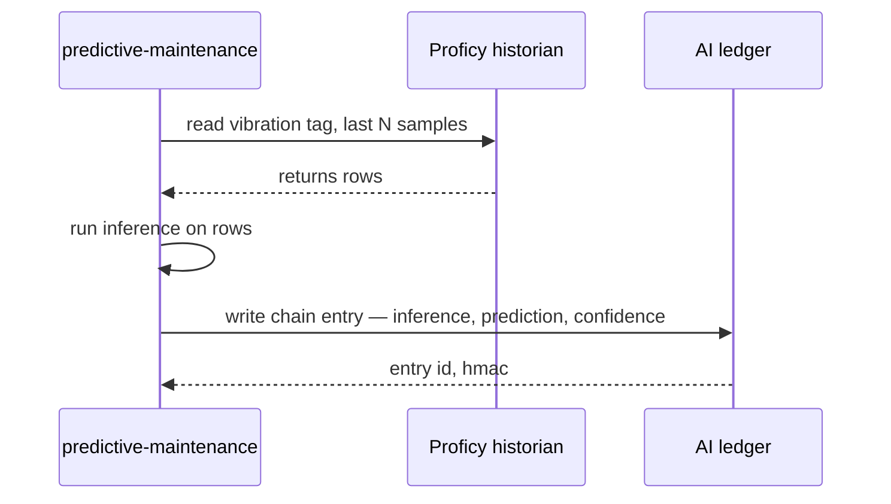
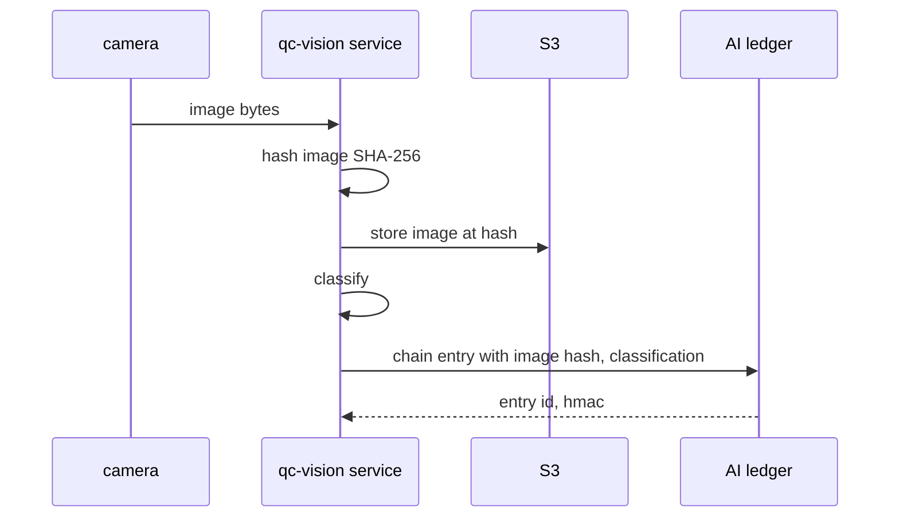

# 🧾 Diary of an Audit Day — Stelvio Industrial

**Engagement:** CMMC 2.0 Level 2 readiness re-assessment with AS 9100D quality-systems overlay
**Client:** Stelvio Industrial — specialty steel, northwest Indiana, ~$2.1B revenue, ~3,400 employees, third-generation family-owned
**Posture:** Partial TesseraSeal deployment — chained on the AI side (predictive maintenance, QC vision, ITAR screening) under FFIEC chain-of-custody v1.0b; not chained on the OT side or the IT business side
**Date:** Wednesday, the day after Northbridge wrapped
**Auditor:** the same eight-person team that walked the diary baseline two weeks ago, Mercator the week after, Northbridge last week

---

## Context

Stelvio is a DoD prime-contractor steel supplier. They roll medical-device-grade and aerospace-grade flat steel for primes most people would recognize. They handle CUI on a daily basis. CMMC 2.0 Level 2 is the floor they have to clear; their aerospace customer adds AS 9100D on top; their medical-device customer cites their QC data inside FDA design verification submissions; and ITAR §125 export-control records hang off the side of every order destined for a defense end-use.

Fourteen months ago, after a CMMC 2.0 readiness assessment named CUI-handling gaps in their AI tooling, Stelvio stood up TesseraSeal — but only on the AI side. Three services, one tenant:

- `predictive-maintenance` — vibration plus temperature ML on the rolling mill, predicts bearing failure ~72 hours out
- `qc-vision` — image classification on hot-rolled bars, flags surface defects, rolling-mill flaws, inclusions
- `itar-screening` — small NLP that classifies POs against USML categories under ITAR §125

Everything on the AI side is chained per FFIEC chain-of-custody v1.0b — HMAC-SHA-256 per-event MAC at capture per §4.1, daily Merkle root over the tenant-day per §4.2 (RFC 6962 leaf-and-node prefix scheme), Ed25519 seal signature per §4.3 produced inside an on-prem Thales Luna HSM under FIPS 140-2 Level 3 custody per §10.5. The IKM bytes never leave the Luna under the institution's chosen handshake — Stelvio runs Model B per §4.1.1 with HMAC-via-HSM dispatch, so the session key is wrapped under the HSM's master key and the SDK never sees IKM cleartext. The wire form is OTLP per §4.4 with the `ffiec.chain.*` attribute namespace and the §4.4.3 Resource-level dispatch attributes (`ffiec.chain.spec`, `ffiec.chain.posture`, `service.name`, `service.version`, `ffiec.chain.format_version`) so the TesseraSeal receiver routes chain traffic to the chain-of-custody pipeline rather than ordinary telemetry. The canonical bytes that go into each MAC are RFC 8785 JCS over the included field set per §5; the verifier's pre-flight JCS self-test per §7 baked-in `008-jcs-edge-cases/` fixture confirms the running JCS implementation conforms before any chain walk. The tenant_id `"stelvio"` is conformant under §3 character-class — pure ASCII alphanumerics, no slash, colon, or Unicode that would force Stelvio into a §3.1 legacy-mapping pattern. Verifiable.

Everything else is not.

The OT side — Siemens PLCs, Rockwell ControlLogix, GE Proficy historian, Plex MES, Wonderware HMI — runs the way OT has always run. The IT business side — Microsoft Dynamics 365 CRM, SAP ERP, email, SharePoint — runs the way IT business systems have always run. Both are mutable. Both have audit trails that depend on operational discipline rather than cryptographic enforcement. Neither is chain-instrumented, and the §10.19 chain-coverage map Maria published last quarter names them under "institutional systems not yet chain-instrumented" with the rollout posture the spec section requires; each `chain.coverage_map_published` operational event carries `coverage_map_version`, `effective_utc`, and `coverage_map_sha256` per §10.2 so an 18-month lookback by any acquirer or examiner can determine which map version was in force on a given date.

There is no SaaS-edge mirror connector in scope today — Dynamics 365 holds CRM data inside Microsoft's tenant but Stelvio has not yet stood up a §10.16 mirror connector that streams Dynamics CDC events into the chain-instrumented store. That means the §10.16 quantified-lag discipline (median, 95th-percentile SLO, alerting threshold, RTO) is not engaged and there is no CC8.1 wording to test against the §10.16 forbidden-phrase list (`"near real-time"`, `"low-latency"`, etc., per §10.16 normative). Phase 4 brings Dynamics under chain-instrumentation; whichever mirror pattern Phase 4 selects, the four-number requirement enters scope at that point per §10.16, and the engagement team will hold the Phase 4 CC8.1 wording to the §10.16 severity-classification clause — imprecise lag wording is **never** a Nit, MUST be classified as non-conformance, and MUST NOT be downgraded to a documentation observation. Stelvio's CC8.1 today does not contain the wording because the connector does not exist yet.

The team showed up knowing this. Maria Costanza, Stelvio's Director of Internal Audit, had told Dawn on the prep call: "I want you to find what I already know is broken. I need the report so I can take it to the CFO Friday."

This is the diary of that day.

---

## Audit Team

- **Dawn** — Lead Auditor (governance and narrative)
- **Raj** — Database specialist
- **Elena** — CRM systems
- **Mike** — Application and API layer
- **Diana** — IAM and access control
- **Luis** — DevOps, logs, pipelines
- **Chen** — Data engineering and ETL
- **Tom** — Internal-audit liaison specialist (visiting team — partners with the client CAE)

Client-side liaison: **Maria Costanza**, Director of Internal Audit, Stelvio Industrial. Practical. CMMC-prep veteran. Knows the gaps.

---

## 🗓️ 14-Month Backstory (informative)

Maria's prior CMMC readiness assessor — a different firm; not the team showing up today — had named CUI-handling gaps in the AI tooling 14 months back. That assessment named four problems specifically: (1) the ITAR screening NLP did not record a per-PO classification rationale auditable by an examiner, (2) the QC vision classifications had no integrity binding from camera to S3 to downstream MES, (3) the predictive-maintenance model's outputs were not lineage-anchored to a specific model version with retrievable training data, (4) the operator overrides on the QC vision side were captured in HMI flat files rather than chain-bound to the AI's classification.

The same assessor named the chain-of-custody primitives that would close the gap in language Maria's CFO understood: "HMAC-chained event capture at SDK boundary per the FFIEC v1.0b spec §4.1; daily Merkle seal on a Luna HSM under FIPS 140-2 Level 3 custody per §10.5; per-event MAC binding the canonical bytes per §5; cryptographic provenance the medical-device customer can reproduce on their own laptop without trusting Stelvio's tooling per §10.26 reference verifier distribution; chain-coverage map per §10.19 documenting which systems are in scope and which are not." The CFO signed the cheque inside two weeks. The TesseraSeal deployment took five months — ML-engineering team plus a TesseraSeal contractor for the receiver-side instrumentation. It went live 14 months ago this week.

In the time since, Maria has run the §10.1 weekly fingerprint reconciliation every Friday and posted the `master.reconciliation_completed` event with `unmatched_count=0` 60 weeks in a row. The §10.17 partition-ceremony attestation events have logged the partition creation, the Q3 controlling-person rotation, and one `partition_pin_reset` after a planned PIN-rotation following the colocation provider's tenant-level recommendation. The §10.19 chain-coverage map has been published quarterly with an updated `coverage_map_version` and a fresh `chain.coverage_map_published` operational event per §10.2 each quarter — Q1 2026 is `coverage_map_version = "stelvio-cov-2026-q1"`, `effective_utc = 2026-01-15T00:00:00Z`, `coverage_map_sha256 = "a8f3...d4e1"`. The map's "chain-instrumented institutional systems" column lists `predictive-maintenance`, `qc-vision`, and `itar-screening` with their `tenant_id = "stelvio"` and `service.name` bindings.

The systems on the §10.19 map's "institutional systems not yet chain-instrumented" column are the same systems the prior assessor named in the original gap report, plus a few that didn't make the original report because the original scope was AI-only. Maria's Phase 2 / Phase 3 / Phase 4 plan is what closes the rest of the gap. Today's audit will find what's still on the unchained side and document the remediation path.

> **🔍 Dawn's note (internal — pre-engagement):**
> *Maria did the work in advance. The chain-coverage map per §10.19 is the rare artifact that shows up in a prep call rather than as a finding-driven ask. She also operates §10.17 partition-ceremony attestation, §10.1 weekly fingerprint reconciliation, §10.10 rotation-crossing-seal-boundary discipline, and §10.18 runbook cross-referencing across the AI side. The CFO ask Friday is the Phase 2 line item. Today's report has to make Phase 2 sound like a low-risk extension of what already works.*

---

## 🌅 8:30 AM — Kickoff and the Drive In

Dawn rode in with Raj from the hotel. Forty minutes south on US-41, then east toward the lake. The mill stack was visible from the highway, white plume at a 45-degree lean in the wind.

Raj was on his second coffee. "What are we expecting today?"

Dawn watched the stack come closer. "Today, I want to know what a manufacturing company with the means but not the time looks like."

"Versus?"

"Two weeks ago — the financial services job. Graveyard. CRM overwrites, database mutability, the whole thing. We wrote it up and went home tired."

"And last week."

"Northbridge. Banking. TesseraSeal in everything. We ran out of things to find by 3 PM. Diana was reading Reddit by 4."

"Mercator was the week before."

"Half the river sealed, half not. Healthcare. Imaging side chained. Claims side mutable. We wrote the seam down the middle of the report and the CMO understood it instantly."

"And today is —"

"Today is partial again. But the seam is in a different place." Dawn drained her cup. "Mercator's seam was AI imaging versus claims. Stelvio's seam is AI versus OT versus IT business systems. Three zones, not two."

Raj nodded. "What's the recurring line you keep saying?"

Dawn looked at him sideways. "It never is."

"That's the one."

"It never is. But sometimes part of it is. I'm calibrating." She smiled at the stack on the horizon. "Mercator was half of it. Northbridge was all of it. Today is a third of it. That's a different shape."

Raj watched the stack too. "Northbridge spoiled us a little."

"Northbridge was the cleanest engagement I've run in years. Mercator was heavier — three Gaps and a Partial — but still lighter than the average week. This is the third one in the cycle and I've stopped expecting Northbridge to be the pattern."

They pulled into the visitor lot at 8:25.

Maria met them at the badge desk. Polo shirt, steel-toed boots, the kind of handshake that came from a quarter-century of mill floors. "You'll need PPE for the floor. Hard hat, safety glasses, hi-vis vest, hearing protection. Anyone with metal in their shoes other than steel toes — let me know now."

The team kitted up. Maria walked them to the conference room — glass-walled, with a window onto the rolling mill floor itself, two stories below. The mill ran. Slabs the color of sunrise moved on the rollers. The room vibrated faintly through the chair legs.

> **🔍 Dawn's note (internal):**
> *Family-owned, third generation. No active divestiture, no joint venture, no parent-spinoff in the rolling 18-month window. §10.24 entity succession does not engage today; if a JV with the aerospace customer or a divestiture of the medical-device feed materialized, the `chain.entity_succession` operational event with `dual_signatures`, `from_entity_lei`, `to_entity_lei`, `effective_utc`, and `kind` (per §10.24 schema) is the procedure I would expect to see — bound under the transfer-day's seal per §4.3 v1.0b. Note for the report: §10.24 is dormant here, but the §10.19 map already accommodates it because the `chain.coverage_map_published` re-emission cadence per §10.2 anchors lookback alignment across any future succession boundary.*

Maria set the agenda on the screen.

"Three zones today. AI side first. Then OT. Then IT business. The AI side is on TesseraSeal under v1.0b. The OT side is not. The IT business side is not. I am going to be straight with all of you: I know where the gaps are. The §10.19 chain-coverage map names every system on this site by its chain-instrumented status; I posted the map version effective last quarter and the `chain.coverage_map_published` operational event per §10.2 anchors it. I am not going to argue with your findings. I want them documented so I can take them to my CFO Friday and ask for Phase 2 funding. Phase 2 is OT historian. Phase 3 is MES and ERP. We have the means. We have not had the time."

Dawn smiled. "That's the most useful kickoff I've heard this month."

Maria did not smile back, but her shoulders dropped a half-inch. "Let's start on the floor."

> **🔍 Dawn's note (internal):**
> *"It never is. But sometimes part of it is."*
>
> *Calibrate. Three zones. The AI zone passes. The other two don't. The interesting question is not whether they don't pass — Maria already knows. The interesting question is what the customer-facing language looks like when one zone supports CMMC 2.0 Level 2 and the other two will need 12 to 18 months to catch up. Maria's already published the §10.19 map; the rollout posture column is what the CFO is going to read.*

Maria pulled up the §10.19 map document on the wall screen. The document had five columns per §10.19 normative content, each populated for every system in scope:

| System | Chain-instrumented? | Stelvio's? | Contractual inspection? | Evidentiary substitute | Rollout posture |
|---|---|---|---|---|---|
| `predictive-maintenance` (AI service) | YES | YES | n/a | n/a (chain-instrumented) | live since 2025-02 |
| `qc-vision` (AI service) | YES | YES | n/a | n/a (chain-instrumented) | live since 2025-02 |
| `itar-screening` (AI service) | YES | YES | n/a | n/a (chain-instrumented) | live since 2025-02 |
| GE Proficy historian (OT) | NO | YES | n/a | operational shift logs at the mill, no integrity binding | Phase 2 in 12 months |
| Siemens PLC + Rockwell ControlLogix (OT) | NO | YES | n/a | TIA Portal flat file on the engineering workstation | Phase 3 in 18 months |
| Plex MES (OT) | NO | YES | n/a | circular audit buffer with operator-clearable history | Phase 3 in 18 months |
| Wonderware HMI (OT) | NO | YES | n/a | paper shift logs and operator memory | Phase 3 in 18 months |
| Microsoft Dynamics 365 CRM | NO | YES (hosted by MS) | yes (Microsoft EA) | field-level change tracking on selected fields | Phase 4 distant |
| SAP ERP | NO | YES | n/a | SAP STAD audit trail and ticketing-system closure record | Phase 3 in 18 months |
| Microsoft Exchange Online (email) | NO | YES (hosted by MS) | yes (Microsoft EA) | standard mailbox retention, no integrity check on retrieved messages | Phase 4 distant |
| Microsoft SharePoint (QMS evidence) | NO | YES (hosted by MS) | yes (Microsoft EA) | Word documents with last-modified timestamps, no content-hash on retrieval | Phase 3 in 18 months (via §10.19 `audit.external_artifact.*` family) |
| Bureau Veritas third-party inspection (steel-mill audit reports) | NO | NO (third party) | yes (audit-services contract) | Bureau Veritas signed PDFs, retained per Stelvio CC8.1 | hash-anchor under §10.19 `audit.external_artifact.*` family from Phase 3 |
| CBP Container Examination Station notices (when applicable) | NO | NO (regulator-side) | n/a | CBP-issued PDF notices retained per CBP records-retention | hash-anchor under §10.19 `audit.external_artifact.*` family when applicable |

Dawn read the table. The table answered exactly the five questions §10.19 normates the map to answer for each system: is it chain-instrumented; is it the institution's or a third party's; is it under institutional contractual access for inspection; what evidentiary substitute exists where the chain does not reach; what is the institution's posture at that boundary. Every cell was filled. Every substitute description was honest — including the substitute weaknesses ("paper shift logs and operator memory" for Wonderware HMI; "circular audit buffer with operator-clearable history" for Plex MES; "no integrity check on retrieved messages" for Exchange).

Dawn wrote: *§10.19 chain-coverage map is fully populated and honest. Substitute descriptions name the weakness rather than papering over it. The map is version-stamped (`coverage_map_version="stelvio-cov-2026-q1"`, `effective_utc=2026-01-15T00:00:00Z`, `coverage_map_sha256="a8f3...d4e1"`) per §10.19 Round-17 M&A-P3 normative; the `chain.coverage_map_published` event per §10.2 anchors the lookback alignment. The map is the audit's organizing document.*

---

## 🧩 9:15 AM — First Question on the Mill Floor

Hard hats on. Hearing protection in. Maria led them out through a steel door and onto a catwalk above the rolling line. Slabs moved past below. The smell was hot mineral oil and wet steel. The sound was a low continuous roar that the hearing protection cut in half but did not erase.

Maria pointed past a railing at a black-housed camera mounted on a strut over the line. "QC vision. Looks at every bar coming off the finishing pass. Classifies surface defects in real time. Routes to scrap, rework, or ship."

Mike looked at the camera, then at the small ruggedized PC in a NEMA enclosure beside it. "And every classification it produces hits the chain."

"Every one. Image hashed. Classification logged. Operator override logged if there is one. Routing decision logged. The classification entry's `chain_kind` is `model_call` per §3, which is the v1 enumeration the verifier expects on entries that represent an LLM or vision-model invocation — though we're not running an LLM here, vision classification rolls under the same `model_call` discriminator because the inference shape is the same. The §3 `chain_kind` enumeration is closed; the verifier rejects any value not in the set with `chain_kind out of v1 enumeration at seq N`. The receiver at TesseraSeal stamps each chain `LogRecord` with a non-default `SeverityNumber` in the `9..20` range per §4.4.4 receiver-stamping discipline so collector-internal severity filters cannot silently drop the chain pipeline; the `SeverityText` is `\"OTLP\"` per the TesseraSeal reference convention. The §4.4 collector-pass-through rule plus the §4.4.4 severity-filter clause together close the silent-drop path."

Mike pulled out his laptop, balanced it on a railing, and opened TesseraSeal on the corporate VPN. "Let me find a recent one."

He filtered to `service.name = qc-vision` and the last five minutes. A row populated. Then another. Then another. They were appearing in real time as the bars passed under the camera.

"There." He pointed at one. "Bar ID 2026-04-09-RM02-1147, classified 14 seconds ago. Defect class: surface_inclusion. Confidence 0.94. Routing: rework. Operator override: none."

Dawn leaned in to read the row. "And the source image?"

"Hashed in the chain entry. The JPEG itself sits in S3 — referenced by the hash. If anyone tampers with the JPEG, the hash mismatches and the verifier fails. The hash binds the input, and the chain entry's MAC binds the hash — per §5 the canonical bytes the MAC covers include the `audit.*` payload, so the image SHA-256 reference is integrity-bound the same way any other application content is."

"Run the verifier on it."

Mike copied the entry ID into his terminal:

```
herald-verify --tenant=stelvio --service=qc-vision \
              --date=2026-04-09 --entry-id=2026-04-09-RM02-1147 \
              --strict
```

Four seconds. The terminal returned:

```
Status: PASS
Step: 12
Reason: chain integrity verified, HMAC recomputed,
        Merkle path resolved, signature verified
        against public key qc-prod-2026-q1
```

Mike turned the laptop. Dawn read the output. Maria read it over Dawn's shoulder.

"Twelve steps, four seconds, on a corporate VPN over a 4G hotspot." Mike snapped the laptop shut against the wind. "That's the thing working. The twelve steps are §7's ordered procedure — the format-version pre-flight, the HKDF-inputs digest check, the genesis-hash check, the tenant-id character-class check, per-entry binding, per-entry format, the structural walk, IKM lookup, fingerprint check before any MAC compute, MAC recompute, Merkle recomputation, signature verification. The verifier under `--strict` runs all of them per §10.12 exit-code contract. Exit 0 here means PASS."

> **✓ Confirmation #1**
> The QC vision chain is live on the production line and producing verifiable entries within ~200 ms of classification. Mike re-verified one in four seconds standing on a catwalk. The infrastructure is real, not a demo. The 12-step procedure is §7; the public-key resolution path is the institution's tenant key registry referenced through the seal record's `public_key_id` per §4.2 schema. The §7 step ordering is normative for the data-dependent steps — IKM lookup (step 7) precedes fingerprint check (step 8) precedes MAC compute (step 9), and the `expected_prev_hash` (the structurally-walked value) feeds the MAC recompute, not the entry's claimed `prev_hash`, per §7 step 9. The verifier's reference distribution is per §10.26 — separate repo, Apache-2.0, reproducible builds, Cosign-signed binaries, per-platform artifacts (Linux x86_64/ARM64, Windows, macOS), SHA-256 and SHA-512 manifests, and a CycloneDX SBOM per release. Mike's binary is the spec-version-pinned reference per §11; an examiner who runs a clean-room verifier that passes the Q-28 vendor-conformance corpus is operating a conformant verifier under §10.26 even without the reference binary.

Maria walked them along the catwalk to a second camera near the cooling bed. "Same setup at the cooling-bed inspection. And one more upstream of the finishing stand. Three cameras, one model, one chain."

Dawn wrote in her notebook: *Three cameras, one chain, one tenant, one service. Cardinality is small, behavior is consistent. §3 tenant_id stays single across the QC vision service; the service.name binding distinguishes the cameras at the OTLP Resource layer per §4.4.3. Single-site mfg, single seal region — §10.15 multi-region pattern selection is dormant; Stelvio is neither Pattern A (active-active with seal-region pinning) nor Pattern B (per-region tenant_id) because there is one region. The `ffiec.chain.region` attribute per §4.4 is therefore unnecessary; SDK per-process region binding (§4.4 SDK-side enforcement) collapses to one process for one region for one tenant.*

Down the catwalk, in a glass-walled control booth, an operator was looking at a Wonderware HMI screen. He tapped a touch panel. A bar's routing changed from "ship" to "rework."

Dawn watched. "What just happened?"

Maria shifted. "Operator override. He doesn't trust the AI's call. He thinks the bar is fine for ship."

"Did that go into the chain?"

"Yes. The HMI sends the override to the QC vision service over a local socket. The service writes a chain entry — operator ID, override direction, reason code if he typed one. The override entry chains to the original classification through `parent_run_id` and `parent_seq` per §4.4 cross-run linkage; both fields are part of the canonical bytes per §5, so the override-to-classification linkage is itself integrity-bound. That part is good."

"And the HMI itself?"

Maria hesitated for one heartbeat. "The HMI doesn't have an audit log. The override is logged because the QC vision service captures it on receipt. If the operator changed something on the HMI that didn't go through the QC vision path — a setpoint, an alarm threshold — there's no record. The §10.19 map names Wonderware HMI under 'institutional systems not yet chain-instrumented' with the Phase 3 rollout posture and an evidentiary substitute that's currently 'paper shift logs and operator memory.' The map names the substitute even when the substitute is weak — that's the discoverability the spec section requires."

Dawn wrote: *HMI -> QC vision link is captured in chain via §4.4 parent-linkage. HMI as a primary surface is not. §10.19 names the gap. Watch this.*

> **⚠️ Surprise #1 (Partial — bounded by §10.19 chain-coverage map disclosure)**
> The Wonderware HMI on the mill floor has no audit log. Override actions that pass through the QC vision service are captured because the service captures them and chains them to the parent classification per §4.4 (`parent_run_id` / `parent_seq`). Override actions that do not — setpoint changes, alarm acknowledgments, recipe selections — are unrecorded. The chain captures what crosses the AI service boundary. It does not capture what stays on the HMI. The §10.19 chain-coverage map names this as 'not chain-instrumented, Phase 3 rollout posture, evidentiary substitute weak.' That is the right disclosure shape per §10.19; the gap is real but the institution has documented it the way the spec section requires.

Maria caught the look between Dawn and Mike. "Phase 3 includes HMI instrumentation. We're not there yet. The map version that ships when Phase 3 lands updates `coverage_map_version` and emits a fresh `chain.coverage_map_published` per §10.2 so the lookback alignment stays coherent."

"Noted."

They came back inside. Maria handed off PPE and walked them down to a smaller conference room with no view of the floor. The roar fell to a hum. Dawn pulled up a chair and clicked her pen.

"Let's split. Raj — historian and AI ledger. Diana — IAM, both sides. Mike and Chen — pipelines and the AI services. Elena — Dynamics. Luis — logs and ops. Tom — sit with Maria, work the QMS evidence retrieval. Reconvene at noon."

They split.

---

## 🧠 10:00 AM — Database Deep Dive (Two Probes, Two Outcomes)

Raj had a corner of the conference table and two screens. One showed the AI-side ledger. The other showed the GE Proficy historian's SQL Server backend. He worked them in parallel.

### The AI ledger

Raj started with the chain. Append-only by design per §10.3 — application-level enforcement (codebase contains no UPDATE or DELETE statements on `events` or `daily_seals` tables) plus a database-role grant of INSERT and SELECT only for the ledger writer, with UPDATE, DELETE, and TRUNCATE revoked. The Merkle seal catches deletion at any layer per §10.3; the role-level enforcement is defense-in-depth. The Vidimus SDK signs each entry per §4.1; the HMAC-SHA-256 chain links entry N to entry N-1 with HKDF-per-tenant key binding, the `info` parameter constructed as `HKDF_INFO_BASE || "|" || utf8(tenant_id)` per §4.1 inviolate property 1. The §3 character-class restriction on `tenant_id` plus the `|` separator byte (0x7C) is what rules out boundary-confusion across two distinct tenant identifiers producing the same `info` byte sequence; Stelvio's single-tenant deployment is unaffected by the multi-tenant boundary attack but the constraint is a structural one the SDK enforces at construct time. Daily Ed25519 seals close out each day's chain on the on-prem Luna HSM under §10.5 FIPS 140-2 Level 3 custody with strict canonicalization per §4.3 (RFC 8032 §8.4 — non-canonical signature forms are refused). The IKM was generated inside the HSM per §10.6.1 — Luna's internal CSPRNG, FIPS-validated, never exposed to application memory — and the 32-byte minimum per §10.6 was enforced at provisioning. The `master_key.generated` operational event per §10.2 records `"hsm.luna-on-prem"` as the RNG type. The §10.5 fault-injection-attack residual risk is named in Stelvio's CC8.1 — Stelvio runs Luna 7s under FIPS 140-2 Level 3 with no documented Common Criteria EAL5+ uplift, so the residual risk lives under the institution's incident-response playbook rather than under cryptographic discharge. NTP discipline per §10.4 is operating; clock-skew anomalies surface as verifier reports rather than integrity failures, and the `|received_at − captured_at|` skew threshold is the default 5 minutes per §4.2.2.

He picked a random entry from three weeks ago. Copied its ID. Ran the verifier.

```
Status: PASS
Step: 12
Reason: chain integrity verified, HMAC recomputed,
        Merkle path resolved, signature verified
        against public key qc-prod-2026-q1
```

He picked a random entry from yesterday. Same result. He picked the very first entry from 14 months ago — the day TesseraSeal went live. Same result. The 14-month walk crossed two key-fingerprint rotation boundaries; per §10.10 the seal record's `key_versions` list carried both the old and new generations on the rotation days, and the verifier handled it via per-entry `key_version` lookup per §7 step 7 with no special-case logic. The IKM registry retention per §10.9 covered every generation referenced by retained entries.

He tried to mutate one. Issued an UPDATE on the chain table directly through SQL.

The database accepted it because nothing at the database layer prevents it on this particular environment — the role discipline per §10.3 is applied to the ledger-writer service account, not to the DBA account Raj was using. Raj ran the verifier on the next entry in the chain.

```
Status: FAIL
Step: 4
Reason: HMAC mismatch — entry payload does not produce
        the chained HMAC recorded in entry N+1
```

Per §7 step 9 the verifier feeds the structurally-walked `expected_prev_hash` into the MAC recompute, not the entry's claimed `prev_hash`. The constant-time comparison required by §10.8 caught the mismatch without leaking timing.

Then he tried to also rewrite entry N+1 to match. The verifier failed at the daily seal:

```
Status: FAIL
Step: 9
Reason: Merkle root mismatch — recomputed root does not
        match sealed root for date 2026-03-19
```

Per §7 step 10 the verifier streams the day's events in `(run_id, seq)` order and computes the RFC 6962 streaming Merkle root from each event's `payload_hash`; mismatch against `seal.merkle_root` is the failure mode. Per §1.4 compositional security the per-event MAC and the daily Merkle seal are independent layers — breaking one doesn't bypass the other — and Raj's two-step tamper hit both.

He rolled back his mutations. The chain returned to PASS. He noted the test in his workbook.

> **✓ Confirmation #2**
> The AI-side ledger is append-only in practice. Direct database mutation is technically possible at the storage layer, but the verifier catches it at the HMAC layer (single-entry tamper, §7 step 9) or the Merkle/seal layer (multi-entry tamper, §7 steps 10 and 11). The seal is on a Luna HSM that the database engineers do not have access to per §10.5 separation of duties — the seal-job operator role grants `sign` only; `extract`, `delete`, and `import` require separate authorization. To forge undetectably, an attacker would need both database write access and HSM signing access — and Stelvio has those split. This is the §1.1 three-layer compromise model made operational; the §1.2 fourth-class SDK-process compromise (Adversary F) is named in the institution's CC8.1 with the compensating controls Stelvio runs — host-hardening on the SDK process, intrusion detection on the captured stream, and the §10.10 master-key-rotation procedure that bounds any forward-only attack window. The §10.7 dev-adapter exclusion is in force at compile-time on Stelvio's production binary — the software-key adapter is compiled out via build-flag (the strictest pattern of the §10.7 alternatives), so a misconfigured environment variable cannot resurrect it; SOC's annual procedure inspects the production binary by code-search for the adapter symbol and the symbol is absent. The verifier under `--strict` would refuse any seal whose `dev_mode=true` per §10.7's regulator-visible-line guarantee; Stelvio's seals all carry `dev_mode=false` bound under the v1.0b 12-line `sign_payload` form per §4.3.

### The OT historian

Raj opened the second screen. GE Proficy. SQL Server backend. He had read-only access through Maria's audit role.

He picked a vibration tag — `RM02_BEARING_3_VIB_X` — and pulled the last 30 days of one-second samples. Tens of millions of rows. He pulled the schema.

The table had a `value` column, a `quality` column, a `timestamp` column, and a `wallclock` column. No `created_by`. No `modified_by`. No `modified_at`. No row-level audit.

He asked Maria, "Who has write access to this table?"

Maria pulled up a query in her own session and ran it against `sys.database_role_members`. Three roles. `db_owner` was assigned to four engineering accounts and one service account. `historian_writer` was assigned to the historian service.

"Could one of those engineering accounts edit a vibration sample from three weeks ago?"

"Yes."

"And there would be no record of the edit?"

"No record at the database layer. There might be a Windows event log entry on the server itself if someone connected via SSMS, but engineers connect from their workstations, and the event log on the engineering workstation rotates after a week."

Raj leaned back. "So a vibration trace from three weeks ago — say, the trace that fed the predictive-maintenance model the night a bearing failed — is mutable, with no record of the mutation, and the engineers who would be the prime suspects in any backdating scenario are the same engineers who hold `db_owner`."

"Yes."

"And the AI ledger has a chain entry that says 'predictive-maintenance ingested vibration trace at 02:14:33 UTC, predicted bearing failure with confidence 0.81' — but the chain entry references the trace by row range, not by hash."

Maria nodded slowly. "Phase 2 includes hashing the trace at the historian boundary. We are not there yet."

> **⚠️ Surprise #2 (Partial — §10.19 chain-coverage map names the gap; remediation queued for Phase 2)**
> The OT historian's SQL Server backend is mutable by anyone with `db_owner`. There is no row-level audit. Sensor traces from any past date can be edited or back-dated with no record. This is the same mutability shape as the diary baseline financial services audit two weeks ago — except the data being mutated here is what feeds the predictive-maintenance AI, which is otherwise chained. The §10.19 chain-coverage map names Proficy under "institutional systems not yet chain-instrumented, Phase 2 rollout posture" and the evidentiary substitute is "operational shift logs at the mill, no integrity binding." The map is honest about the substitute's weakness.

> **⚠️ Surprise #3 (Closed by §1.2 epistemic scope — this is the right framing for the AI side, not a finding against the chain)**
> The chain captures what the AI saw. It does not capture what was actually true at the sensor. If the historian was tampered with before the AI read it, the chain entry would faithfully record that the AI made a confident prediction based on tampered data — and the chain would verify PASS, because the tamper happened upstream of the chain boundary. **This is exactly what §1.2 epistemic scope says the chain proves and does not prove.** The chain proves (a) what the AI said at a specific time and (b) that the record was not tampered with after capture. The chain does NOT prove (c) the AI's statement is factually accurate, (d) the AI's statement complied with policy, or (e) the AI's statement is free of bias. The historian-tamper-before-read scenario is squarely in the (c) bucket — the chain accurately records what the model said about the input it was given; the input's authenticity is governed by storage controls upstream, not by chain integrity. Stelvio's posture aligns with §1.2; the Phase 2 hashing closure brings the upstream input under chain integrity too, which moves the scenario from (c) into (a)/(b).

Raj wrote in his workbook: *Chain integrity is necessary but not sufficient. The chain proves the AI saw what it saw and decided what it decided. The chain does not prove what the sensor actually measured. The boundary matters. Document where the boundary is. §1.2 names it explicitly.*

He moved on to the Plex MES backend.

### The MES

Plex's audit log is configurable. Maria pulled it up. Retention was set to 90 days.

"That's the default?"

"That's what we set it to. Six months ago, an engineer cleared the audit log to free disk space."

Raj waited.

"He did it on a maintenance window. He didn't tell anyone. We found out three weeks later when QA went looking for a 2024 work-order history during a customer audit."

"And the cleared records —"

"Gone. The log is a circular buffer. Once cleared, prior states are not reconstructible from Plex itself. We have nightly database backups, but the backups are full-database snapshots, not change logs. We can restore a point-in-time but we can't reconstruct the sequence of changes between two points."

Raj wrote in his workbook: *MES audit log: 90-day retention, cleared six months ago by engineer for disk space. Restoring from backup gives state at time T but not the change sequence between T1 and T2. §10.19 names Plex under not-chain-instrumented; §10.13 evidentiary-artifacts retention applies to chain artifacts only — the unchained MES audit log isn't covered by it.*

> **⚠️ Surprise #4 (Partial — §10.19 chain-coverage map names the gap; not a chain-integrity failure because Plex is not chain-instrumented)**
> Plex MES audit log is set to 90-day retention and was cleared six months ago by an engineer to free disk space. Backups exist but they are point-in-time snapshots, not change-record streams. Reconstructing the sequence of changes between two backup points is not possible. The §10.19 chain-coverage map names Plex under "institutional systems not yet chain-instrumented, Phase 3 rollout posture, evidentiary substitute weak — circular audit buffer with operator-clearable history." The honesty of the substitute description is what §10.19 demands; the engagement team agrees the map's posture matches what the team observed. Note that §10.13 evidentiary-artifacts retention applies to chain artifacts (SDK version manifest, source-code hash, HSM configuration, daily seal-job logs, change-management records, verifier output) — those are kept; the unchained Plex audit log is governed by Plex's own retention configuration, not §10.13. When Phase 3 brings Plex under chain instrumentation, §10.18 CC8.1 cross-referencing kicks in: the runbook section that describes Plex audit-log handling MUST cross-reference §10.16 (if a mirror connector goes between Plex and the chain) or §10.3 (if the chain decorator captures Plex events directly), with the specific spec section number named at the runbook-section heading per §10.18 normative form.

He moved on.

---

## 🔐 11:00 AM — IAM Review (Same Split)

Diana had a workbook that walked through identity, access, and credential rotation — once for the AI side, once for the OT side, once for the IT business side. Three columns. She filled them in the same order.

### AI side IAM

Every credential the AI services use — database creds for the chain backing store, S3 creds for the QC images, OpenAI API keys for an experimental classifier they were evaluating, the Luna HSM PIN for the daily seal — every rotation was a chain entry. `event.type = credential.rotated`, with rotator identity, rotation reason, and the new key fingerprint. The `master_key.rotated` and `master_key.rotation_observed` operational events per §10.2 anchored each IKM-generation transition; per §10.10 each rotation that crossed a seal boundary produced a day-after seal whose `key_versions = [old, new]` listed both generations.

Diana picked the last six rotations from the chain. Verified each. All PASS.

She asked Maria for the most recent rotation, which would have happened at the start of Q2.

```
herald-verify --tenant=stelvio --service=qc-vision \
              --event-type=credential.rotated \
              --date-range=2026-04-01:2026-04-08 --strict
```

Three entries returned. Two database creds and one S3 access key. All PASS. Per §10.1 the institution operates key-fingerprint reconciliation at weekly cadence — the `master.reconciliation_completed` event per §10.2 with `unmatched_count=0` had been published every Friday for the past 14 months without exception.

> **✓ Confirmation #3**
> Credential rotation on the AI services is captured in the chain with rotator identity, fingerprint, and reason. Six rotations sampled across the past 14 months. All verifier PASS. Multi-factor authentication on every service account that accesses the chain. §10.1 weekly fingerprint reconciliation runs with `unmatched_count=0` for every published reconciliation event since deployment. §10.6 IKM minimum length and §10.6.1 RNG-source requirements are met inside the Luna HSM; §10.9 IKM registry retention covers every generation referenced by retained chain entries. §10.1's tenant-id uniqueness enforcement at the IKM-registry layer is satisfied trivially in single-tenant deployments — the registry holds one entry, `"stelvio"`, with no duplication risk. The constant-time comparison primitive per §10.8 is used for both the fingerprint check at §7 step 8 and the MAC compare at §7 step 9 — `hmac.compare_digest` in the Python verifier path. The §10.17 HSM partition-ceremony attestation event `chain.partition_ceremony_attended` was emitted at partition creation 14 months ago and again at the one Q3 controlling-person rotation; signatories and witness with role/name/`entity_affiliation` per §10.17 schema, attendance-PDF SHA-256 bound on chain, the original paper attendance log retained by the colocation provider per §10.17 `attendance_pdf_holder`. Stelvio's HSM is on-prem in a co-located rack so the colocation engineer was the witness; cross-language CC8.1 discoverability does not engage because Stelvio operates a single English-language CC8.1.

### OT side IAM

Diana asked Maria to log in to the engineering workstation that controls the rolling-mill PLC and the QC vision camera mounts.

The login screen showed `Plant_Engineer` as the account.

"Who is `Plant_Engineer`?"

"Everybody." Maria's voice was flat. "It's a shared account. Six people use it. Same password."

"When was it last rotated?"

Maria pulled up a Windows event log on a different workstation. "Eighteen months ago."

"MFA?"

"No."

"And this workstation can hot-swap the running PLC program on the rolling mill?"

"Through TIA Portal. Yes."

"And the hot-swap is logged?"

"In TIA Portal."

"Where is the TIA Portal log?"

"Flat file on this workstation."

"Editable?"

"Yes."

Diana wrote: *Shared account. No MFA. Password 18 months stuck. PLC hot-swap log on the same machine, editable. Compounds. §10.19 names the engineering workstation under not-chain-instrumented, Phase 3, evidentiary substitute "TIA Portal flat file on the same workstation as the editor" — which is the kind of substitute the chain-coverage map is supposed to surface honestly so a CFO sees it.*

> **⚠️ Surprise #5 (Gap — §10.19 chain-coverage map names the system; the controls themselves are independent of the chain)**
> The engineering workstation that controls the rolling-mill PLC uses a shared account, `Plant_Engineer`, with no MFA, used by six people. The password was last rotated 18 months ago. The TIA Portal hot-swap log is a flat file on the same machine. Anyone with the shared password can hot-swap a PLC program and edit the log that records the hot-swap. The §10.19 chain-coverage map names the workstation; the IAM gap on top of it is independent of chain integrity but compounds the §10.19 substitute weakness — the substitute is "the same workstation that holds the editable log is the workstation everyone shares." That is the kind of compounded posture the chain-coverage map is designed to surface so the CFO sees it on one page.

### IT business side IAM (SAP)

Diana moved to SAP. Pulled the segregation-of-duties matrix. Cross-referenced authorizations against the SAP user master.

`SAP_ALL` was assigned to two production-support engineers.

She ran `STAD` and pulled their audit trail for the last 90 days. Each had used `SAP_ALL` rights twice — four uses total — for "emergency change" tickets in the corporate ticketing system.

She pulled the four ticket numbers. Asked Maria for ticket status.

Maria checked. "All four are open. Listed as 'pending review and closure.'"

"How long have they been open?"

"The oldest is 78 days."

"And there's no SLA on closing emergency-change tickets?"

"There's an SLA. Five business days. It is not enforced."

Diana wrote: *`SAP_ALL` x 2 prod-support engineers. Four uses in 90 days for "emergency change." All four tickets unclosed past SLA. The grant is technically time-bound by ticket but operationally unbound because tickets don't close. §10.19 names SAP under not-chain-instrumented, Phase 3-4 rollout, evidentiary substitute "SAP STAD audit trail and ticketing-system closure record" — and the closure record is the part that's broken.*

> **🔍 Sidebar — Dynamics field-level change tracking gap deep dive:**
> *Elena pulled Dynamics' change-tracking configuration screen in the engineering workstation behind Diana's chair. The screen showed the entity-level configuration. For the `Account` entity, change tracking was enabled on `name`, `primarycontactid`, `accountnumber`, `creditlimit`. It was disabled on `description`, `notes`, `marketingmaterials`. For the `Opportunity` entity, change tracking was enabled on `estimatedvalue`, `closedate`, `statuscode`. It was disabled on `description`, `currentsituation`, `proposedsolution`. The pattern was clear — structured fields with reportable values had tracking enabled; free-text narrative fields where decision rationale lives had tracking disabled.*
>
> *This is not a Dynamics-platform limitation. Dynamics 365's change-tracking feature can be enabled on any entity field; the configuration choice is institutional. Stelvio's choice was made in 2018 under a different IT director who was optimizing for the volume of change-tracking storage; free-text fields produce more change-tracking entries than structured fields when narrative is iterated. The cost-saving choice removed the change-tracking from the fields most likely to carry CMMC 2.0 Level 2 audit-relevant decision rationale.*
>
> *Elena: "So if a customer-dispute investigation needed to know what was in `Opportunity.proposedsolution` six months ago, what's the answer?"*
>
> *Devon (the IT business engineer): "Backups. We have nightly database snapshots. Restoring a six-months-ago backup gives the field's value at that snapshot's timestamp, but not the change history between snapshots. Same shape Dawn named at the diary baseline two weeks ago — backups, not version history."*
>
> *"And email retention if the discussion happened over email?"*
>
> *"Standard mailbox retention. 7 years on Exchange Online. The retention is configured but the integrity check on retrieval is not — we trust Exchange's tamper-resistance, which is operationally fine but isn't cryptographically grounded the way the chain is."*
>
> *Elena's note: §10.19 chain-coverage map names Dynamics under not-chain-instrumented Phase 4 rollout. Substitute is "field-level change tracking on selected fields plus mailbox retention with no content hash on retrieval"; the substitute weakness is the unselected fields plus the absent integrity check. Phase 4 brings Dynamics under chain instrumentation through the §10.16 SaaS-edge mirror-connector pattern (Dynamics is hosted by Microsoft so a §10.16 mirror is the right pattern); the connector emits chain entries with `audit.connector_source.system = "dataverse-service-bus"` per the §4.4.6 attribute family. SharePoint QMS evidence becomes `audit.external_artifact.kind = "qms_evidence"` per §10.19 — the chain-bound SHA-256 anchor binds the document hash, the document stays in SharePoint at retention. Phase 4 is the right placement; the §10.19 map's Phase 4 column anchors the rollout posture; the `chain.coverage_map_published` event per §10.2 re-emits each quarter so the lookback alignment is maintained until Phase 4 ships.*

> **⚠️ Surprise #6 (Gap — §10.19 chain-coverage map names the system; the SAP_ALL closure-discipline gap is the substitute weakness)**
> Two production-support engineers have `SAP_ALL` profile. They have used those rights four times in the last 90 days under "emergency change" tickets that have not been closed despite an SLA of five business days. The audit trail records the use, but the privilege itself is not effectively constrained because the closure step is not enforced. SAP is not chain-instrumented per §10.19; the substitute (STAD plus ticketing) records the use but the closure-discipline gap is the substitute's load-bearing failure. Phase 4 closure is the right rollout placement on the §10.19 map.

> **🔍 Sidebar — what would chain-instrumentation buy here:**
> *If SAP were under chain instrumentation, every `SAP_ALL` use would be a `chain_kind = "audit"` entry per §3 enumeration with `audit.*` namespace attributes naming the actor, the operation, the rationale, and the ticket-id. The chain entry's MAC would integrity-bind the use; rotation events and credential-revocation events would also be chained, so the closure-discipline gap (tickets remaining open past SLA) would surface as missing follow-up entries the §10.19 map's evidentiary-substitute column would not have to apologize for. Today the substitute is "STAD plus ticketing" and the substitute is broken. Phase 4 brings the SAP audit trail into the chain; the chain decorator captures `SAP_ALL` use at the moment of authorization and chains it to the corresponding closure event under `parent_run_id` / `parent_seq` per §4.4. Until Phase 4 ships, the §10.19 column reads honestly: not chain-instrumented, Phase 4 rollout, evidentiary substitute weak — closure step not enforced.*

Diana stacked the three columns side by side and stared at the page. Same person, three identities, three different exposures depending on which system they touched.

The AI column was a clean rotation history with chain-coupled evidence — every credential rotation chained per §4.4, each rotation-day's seal carrying `key_versions` per §10.10, weekly fingerprint reconciliation per §10.1 returning `unmatched_count=0` for 14 months. The §10.10 within-day algorithm rotation per §10.10.2 has not engaged at Stelvio because they have not rotated the seal-signature algorithm; the §10.10 boundary-crossing case engages on every IKM rotation that lands near UTC midnight, and the day-after seal carries `key_versions = [old, new]` per §10.10 normative — Stelvio's rotation history shows two such boundary-crossing rotations across the 14 months and both day-after seals correctly listed both generations. The verifier handled both via per-entry `key_version` lookup at §7 step 7 with no special-case logic.

The OT column was a shared account, no MFA, stuck password, editable log. There is no IKM rotation discipline because there is no IKM — the OT systems do not generate cryptographic key material in the §10.6 sense. The credentials at issue are operating-system-level shared logins and TIA Portal-level engineering credentials. That distinction matters: §10.6, §10.6.1, §10.8, §10.9, §10.10 do not apply to the OT column at all because the OT column is not chain-instrumented. The IAM gap on top of the §10.19-named rollout posture compounds the substitute weakness — the substitute is "the same workstation that holds the editable log is the workstation everyone shares" — but the gap is independent of chain integrity.

The IT business column was `SAP_ALL` with broken closure discipline. Same shape: §10.1 / §10.6 / §10.10 don't apply because SAP isn't chain-instrumented; the SAP STAD audit-trail is the substitute and the closure-discipline gap is the substitute's load-bearing failure. Phase 4 is the rollout placement.

She wrote at the bottom of the page: *The chain is not magic. Where it is wired in, IAM behaves. Where it is not, IAM behaves the way IAM behaves when nobody is forced to look. §10.19 makes the difference visible on one page. The chained column inherits §10.1 / §10.6 / §10.6.1 / §10.8 / §10.9 / §10.10 by construction; the unchained columns inherit none of them and depend on operational substitutes that the §10.19 map describes honestly. Phase 2 / Phase 3 / Phase 4 each bring §10.x discipline to bear on systems that today operate without it.*

---

## 🧪 12:00 PM — Lunch (But Not Really)

The catering came up to the conference room — sandwiches, fruit, coffee. Dawn and Tom took a corner. The rest of the team ate at the table or talked through findings between bites.

Dawn unwrapped a turkey. "Tom. The reporting frame."

Tom set his fork down. "Same finding language for the OT side as for the diary baseline?"

"That's what I want to know."

"CMMC scopes to CUI. Most of the OT side handles CUI. The vibration traces are not CUI per se, but the predictive-maintenance model's outputs feed maintenance decisions on a mill that produces CUI parts. The historian is in scope. The MES is in scope. The PLCs are in scope. Same finding language. The §10.19 chain-coverage map ties them all together as 'not chain-instrumented, Phase 2 or Phase 3 rollout' with rollout-posture metadata the spec section requires; the CFO reads them as a single roadmap."

"And the IT business side?"

"Dynamics holds customer records that are CUI for some customers — DoD primes, definitely. SAP holds material records tied to CUI orders. Email and SharePoint hold QMS evidence that is in-scope under DFARS 252.204-7012. Same finding language. Phase 3 / Phase 4 placement on the §10.19 map."

"So three zones, three sets of findings, but one severity scale?"

"One severity scale. Different remediation timelines, but one scale."

Dawn took a bite. Chewed. Looked at the mill through the window.

"What about the AI side?"

"The AI side passes. Document it explicitly. Don't bury it in the body of the report — make it a section header. Maria's CFO needs to see what the prior investment bought before he signs the cheque for Phase 2. The §10.19 map names the AI side under 'chain-instrumented institutional systems' with the tenant_id binding and service.name list documented; that's the column the CFO has to see in green."

"Agreed."

Tom picked up his fork. "And the medical-device customer?"

"That comes at 4:30. Maria mentioned it on the prep call. They want 'AI provenance evidence' on the QC classifications because they cite Stelvio's QC data inside an FDA design verification submission."

"What can we give them?"

"Verifier output per §7. Public key. Daily seal record per §4.2. They re-verify on their end with the standalone verifier per §10.26 — the reference verifier ships in a separate repo with reproducible builds, Cosign signatures, per-platform binaries, SHA-256/SHA-512 manifests, and a CycloneDX SBOM. They cannot re-verify the source image's history before the camera captured it — but they can verify the classification was not tampered with after capture. That's the line. We document where the line is in the cover letter using §1.2's epistemic-scope language verbatim — the chain proves what was said at time T and that the record wasn't tampered after capture; it does not prove the bar's pre-capture history."

Tom nodded slowly. "That's a clean line."

"It is. The trick is not pretending it's a different line. §1.2 names the line clearly so witness testimony stays on the integrity foundation, not the truth foundation. Westmark gets the language they need to brief their FDA reviewer; Stelvio doesn't have to overclaim."

They ate the rest of lunch in silence, watching slabs move on the rollers below.

After a few minutes Dawn put her sandwich down. "The Phase 2 conversation is going to be where the report does or doesn't pay for itself. I want to walk through the §4.4.6 connector_source family one more time before the afternoon session."

Tom flipped his notebook open. "Go."

"Phase 2 puts hashes at the historian boundary. The chain entry that the predictive-maintenance service emits today references vibration traces by tag and time range. After Phase 2 lands, the entry references them by SHA-256 over the canonicalized row set. The historian is not a SaaS edge in the §10.16 sense — it's an on-prem GE Proficy SQL Server backend, not a Salesforce-style change-data-capture stream — but the §4.4.6 attribute family applies by analogy because the discipline is identical. Bind the source-side identifier (`audit.connector_source.replay_id` — Stelvio will use the historian's row-key plus tag-name plus sample-window canonical hash, since the historian doesn't have a Salesforce-style `ReplayId`). Bind the source-side commit timestamp (`audit.connector_source.commit_timestamp` — the historian's own clock at the moment the row was committed). Bind the source-side actor (`audit.connector_source.commit_user` — the historian-side user identity when the row was written, RECOMMENDED per §4.4.6). And bind `change_kind` — Stelvio will name `READ` as an institution-named value documented in CC8.1, since the §4.4.6 enumerated `CREATE`/`UPDATE`/`DELETE` doesn't fit a sensor-sample read."

Tom: "And the stable `run_id` discipline?"

"Per §4.4.6 normative — the connector-emitted entries' `ffiec.chain.run_id` MUST derive from a stable source-side identifier, not from an ephemeral runtime UUID. Stelvio will use a deterministic hash over `(tag_name, sample_window_start_utc)` — that gives one chain `run_id` per tag per ten-minute window, and every chain entry tied to that window chains within the same run. An examiner can enumerate every chain entry tied to a given vibration tag by `run_id` alone — the per-tag history is reconstructable from the chain without depending on the connector's process state. An institution that derives `run_id` from a per-process UUID breaks this property: every connector restart starts a new run, the per-tag history fragments, and an examiner cannot mechanically recombine. §4.4.6 is normative on this. Phase 2's connector design has to honor it from day one."

Tom wrote it down. "And the lag observation?"

"The historian read isn't a SaaS edge so the §10.16 quantified-lag discipline (median, 95th-percentile SLO, alerting threshold, RTO) doesn't bind. But §4.4.6's `audit.connector_source.lag_observed_ms` recommendation does — per-entry observation that aggregates into the §10.16 `connector.lag_observation` operational event. Stelvio will emit the per-entry observation; whether they aggregate into a §10.16 event depends on whether the predictive-maintenance read pipeline meets the §10.16 mirror-connector definition. My read: it does — the predictive-maintenance service subscribes to historian commit events, replicates each into the chain-instrumented store, and emits chain entries from that store. That's the §10.16 mirror-connector shape. Phase 2's CC8.1 will need to name the four numbers — median lag, 95th-percentile lag SLO, alerting threshold, RTO — at the moment the connector goes live. The §10.16 forbidden-phrase list is on watch from day one of Phase 2."

Tom underlined his note. "And if the Phase 2 runbook says `'low-latency mirror'` instead of citing the four numbers?"

"§10.16 severity-classification clause — that's a non-conformance, NEVER a Nit, MUST be classified as such, MUST NOT be downgraded. The wording IS the testable claim; an institution whose runbook does not name the four numbers has not made a testable claim. We'd write that up as a finding, not a recommendation, the moment we observed it. Phase 2's CC8.1 wording goes through me before it ships."

"And §10.18 cross-referencing?"

"Each Phase 2 runbook section that touches §10.16 or §4.4.6 names the spec section number at the section heading or footnote. SOC 2 engagement teams test for it. Skipping the cross-reference is a §10.18 Nit, not a control failure, but it breaks the discoverability path."

Dawn took the last bite of her sandwich. "Phase 2 is technically tractable. Phase 3 is the harder one — MES and HMI bring people into the loop and that's where institutional culture lives. Phase 4 is mostly operational discipline on systems that are already there but unchained. The CFO pays for Phase 2 because the technology is the credibility argument; he pays for Phase 3 because Phase 2 worked and the pattern repeats. Maria knows this. The report has to make Phase 2 sound like a low-risk extension of what already works, not a new system."

Tom closed the notebook. "Got it. Same outline tomorrow?"

"Same outline. Three zones, one report, three remediation timelines, one severity scale. The §10.19 chain-coverage map column structure carries the report's organization — we don't invent a new structure, we use the one Maria already published."

---

## 🔄 1:00 PM — At the Mill (API Layer Inspection)

Mike and Chen wanted to see the chain entry for a defect classification land in real time, not just retrieve one after the fact. Maria walked them back out onto the catwalk near the QC vision camera at the cooling bed.

It was loud. They wore hearing protection and hand-signed agreements about which cameras were watching them.

Mike opened a terminal on his laptop. He had an SSH session into TesseraSeal and was tailing the chain stream for `service.name = qc-vision`:

```
herald-tail --tenant=stelvio --service=qc-vision \
            --follow --since=now
```

Chen had his own laptop open on the rail, tailing the QC vision service's structured logs to see the inference event from the application side.

A bar came down the cooling bed. Hot. Glowing. The camera flashed once. Mike's terminal scrolled.

```
[2026-04-09T13:02:14.412Z] entry_id=2026-04-09-RM02-2891
  service=qc-vision tenant=stelvio
  event=qc.classification chain_kind=model_call
  bar_id=RM02-2891
  image_sha256=8f3a...c714
  model_id=qc-defect-v3.2 model_version=2026-Q1
  gen_ai.request.model=qc-defect-v3.2
  gen_ai.response.model=qc-defect-v3.2
  classification=no_defect confidence=0.97
  routing=ship operator_override=null
  hmac=e2c4...91bd key_fingerprint=ab12...4567
  key_version=4 kms_handle_uri=onprem-luna://stelvio/qc-prod-2026q2
  audit.deployment.intent=production
  audit.deployment.policy_version=stelvio-mrm-2026q2
```

Chen's terminal showed the inference event 198 ms before Mike's chain entry.

"Two-tenths of a second from inference to chain entry," Chen said. "On the same network segment. The §4.4 attribute table requires `gen_ai.request.model` and `gen_ai.response.model` on any entry that represents a model call — the SDK refuses to emit per §4.4 SDK-side enforcement (the entry is rejected before the MAC is computed), and the verifier reports `gen_ai_model_identifier_missing at seq N` per §7 step 12a if either is missing. Stelvio passes both checks. The `audit.deployment.intent=production` and `policy_version` per §4.4.2 are the deployment-intent capture; intent = production means steady-state, no A/B test, no canary, no multi-region drift on this entry. The §4.4.2 `policy_version` is `stelvio-mrm-2026q2` and binds the per-decision invocation to the MRM-committee policy version that classified the call — the `policy_version` requirement under §4.4.2 fires whenever any `audit.deployment.*` attribute is present, even just `audit.deployment.intent` alone. Stelvio doesn't run state-DOI rate filings so `audit.deployment.rate_filing_id` and `actuarial_memo_version` are absent; those attributes apply to insurance carriers per Round-17 NAIC-P3 not to manufacturing. No A/B experiment so `experiment_id` is absent; no canary so `canary_traffic_pct` is absent."

"Verifier?"

Mike copied the entry ID and ran the verifier on his laptop:

```
herald-verify --tenant=stelvio --service=qc-vision \
              --date=2026-04-09 --entry-id=2026-04-09-RM02-2891 \
              --strict
```

Four seconds.

```
Status: PASS
Step: 12
Reason: chain integrity verified, HMAC recomputed,
        Merkle path resolved, signature verified
        against public key qc-prod-2026-q1
```

Mike turned the laptop. Chen read the output. Maria nodded.

Another bar came down. The camera flashed. Mike's terminal scrolled.

```
[2026-04-09T13:02:31.107Z] entry_id=2026-04-09-RM02-2892
  event=qc.classification chain_kind=model_call
  bar_id=RM02-2892
  classification=surface_inclusion confidence=0.88
  routing=rework operator_override=null
```

Mike re-verified. PASS. Four seconds.

> **✓ Confirmation #4**
> Live inference -> chain entry latency observed at ~200 ms. Verifier latency observed at ~4 seconds for any single entry. Twelve verification steps including format-version pre-flight (§7 step 1), HKDF-inputs digest check (§7 step 2), genesis-hash check (§7 step 3), tenant-id character-class check (§7 step 3a per §3 character class), per-entry binding (§7 step 4), structural walk (§7 step 6), IKM lookup before fingerprint check before MAC compute (§7 steps 7-9), Merkle recomputation (§7 step 10), and signature verification with `sign_payload_version` dispatch (§7 step 11 — Stelvio's seals carry `sign_payload_version="v1.0b"` so the verifier reconstructed the 12-line form binding `key_versions_canon` and `kms_handle_uris_digest`). Stelvio operates this pipeline on production hardware in a noisy production environment. It works.

> **🔍 Dawn's note — the §7 12-step walk deep dive:**
>
> *Mike just produced a chain entry at the catwalk and re-verified it in four seconds. The four seconds is twelve §7 steps in normative order. Walking the steps from the verifier-output line backwards into the spec:*
>
> *Step 1 — format-version pre-flight. The audit-file header records `format_version = "v1"`. The verifier compares against its running version (v1.0b). Match → proceed; mismatch → fail with `format_version <X> not supported by this verifier (running v1)`.*
>
> *Step 2 — HKDF inputs digest check. The verifier recomputes `expected_hkdf_inputs_digest = SHA-256(HKDF_SALT || info_for_header_tenant || length_LE32)` from the running spec constants. Constant-time compare against `header.hkdf_inputs_digest`. Mismatch → fail with `header HKDF inputs do not match running v1 inputs`. Stelvio is on FFIEC posture per §4.1.2 — the constants are `"ffiec.chain-of-custody.v1.salt"` and `"ffiec.chain-of-custody.v1.info"`. The Vidimus SDK is invoked under `--posture=ffiec` and the verifier under the same posture per §4.1.2 normative.*
>
> *Step 3 — genesis-hash check. Header records `genesis_hash = 32 zero bytes`. Verifier compares against the v1 constant. Pass.*
>
> *Step 3a — tenant-id character-class check. `header.tenant_id = "stelvio"` matches `^[A-Za-z0-9_.\-]{1,255}$` per §3. Pass.*
>
> *Step 4 — per-entry binding. Each chain entry's `tenant_id` and `run_id` match the header's `tenant_id` and `chain_id`. Cross-chain lift attempts would fail here with `cross-chain lift detected at seq N` per §7 normative reason string.*
>
> *Step 5 — per-entry format check. Each entry's `format_version` matches the header's. Pass.*
>
> *Step 6 — structural walk. The verifier walks the entries in `(run_id, seq)` order, asserting `seq` increments by 1 and `prev_hash` equals the previous entry's `payload_hash`. Mismatch → `chain link broken at seq N` or `seq out of order at seq N` per normative reason strings.*
>
> *Step 7 — IKM lookup. The verifier resolves `ikm = ikm_lookup("stelvio", entry.key_version)` against the IKM registry. Stelvio's registry holds the IKM under the Luna HSM handle; the verifier reads the handle URI. Null result → `unknown key_version: no IKM for (tenant=T, key_version=V) at seq N`. No MAC compute happens on lookup miss.*
>
> *Step 8 — fingerprint check. `expected_fingerprint = SHA-256(utf8("stelvio") || ikm)[:16]` constant-time compare against `entry.key_fingerprint` per §10.8. Mismatch → `key_fingerprint mismatch at seq N: looked-up IKM does not match the entry's recorded fingerprint`. No MAC compute happens on fingerprint mismatch — botched-rotation failure mode is detected at lookup time, not buried in a MAC-mismatch storm.*
>
> *Step 9 — MAC recompute. `session_key = HKDF-SHA-256(IKM=ikm, salt=HKDF_SALT, info=info_for_tenant, length=32)`. `expected_mac = HMAC-SHA-256(session_key, expected_prev_hash || canonical_bytes)`. The MAC input uses `expected_prev_hash` (the structurally walked value), NOT `entry.prev_hash` per §4.1 inviolate property 8. Constant-time compare against `entry.payload_hash` per §10.8.*
>
> *Step 10 — Merkle recomputation. The verifier streams the day's events in `(run_id, seq)` order, computing the streaming RFC 6962 Merkle root from each event's `payload_hash`. Mismatch → `merkle root mismatch — ledger contents do not produce sealed root`. Empty-day Merkle root is `SHA-256(b"") = e3b0c44298fc1c149afbf4c8996fb92427ae41e4649b934ca495991b7852b855` per §4.2.*
>
> *Step 11 — signature verification. The verifier dispatches on `seal.sign_payload_version`: absent → pre-amendment 6-line form; `"v1.0a"` → 10-line form; `"v1.0b"` → 12-line form. Stelvio's seals carry `sign_payload_version = "v1.0b"` (current amendment) so the verifier reconstructs the 12-line form: magic line + `"v1.0b"` + `algorithm` + `format_version` + `tenant_id` + `iso8601_date(tenant_day)` + `hex(merkle_root)` + `hex(hkdf_inputs_digest)` + `cadence` + `dev_mode` + `key_versions_canon` + `hex(kms_handle_uris_digest)`. The two terminal lines (`key_versions_canon` and `hex(kms_handle_uris_digest)`) close NIST-G2 and NIST-G1 — the day's distinct `key_version` values and the day's distinct `kms_handle_uri` values are bound under the signature. After signature validation, the `key_versions` cross-check runs as defense-in-depth per §7 step 11 normative.*
>
> *Step 12 — cadence and dev-mode check. Stelvio's seals carry `cadence = "daily"` matching the institution's claimed cadence per §4.2.1. `dev_mode = false` so the §10.7 dev-adapter exclusion check passes. Under `--strict` the verifier would refuse `dev_mode = true`.*
>
> *Step 12a — GenAI model identifier completeness check. The verifier scans for any chain entry carrying any attribute under the `gen_ai.*` namespace prefix. For each such entry, both `gen_ai.request.model` and `gen_ai.response.model` MUST be present and non-empty per §4.4. Stelvio passes both checks because the SDK enforces at write-time per §4.4 SDK-side enforcement; the verifier check is defense-in-depth.*
>
> *Twelve steps, four seconds, on a corporate VPN over a 4G hotspot. Mike's binary is the spec-version-pinned reference verifier per §10.26. The §7 procedure is byte-exact — produced under reproducible builds per §10.26, signed under Cosign, distributed with SHA-256 and SHA-512 manifests, accompanied by a CycloneDX SBOM. An examiner replicating Mike's result on their own laptop runs the same procedure to the same bytes and gets the same exit code per §10.12: 0 = PASS, 1 = FAIL, 2 = structural / input error, 3 = configuration error.*

Maria pointed at a third bar coming down. "Watch this one."

The camera flashed. The HMI in the booth chimed. The operator inside tapped the screen — reaching across to the routing column. The bar's destination changed from "rework" to "ship." Mike's terminal scrolled twice.

```
[2026-04-09T13:02:48.224Z] entry_id=2026-04-09-RM02-2893
  event=qc.classification chain_kind=model_call
  classification=surface_inclusion confidence=0.71
  routing=rework operator_override=null
  run_id=run-qc-2026-04-09-2893 seq=1

[2026-04-09T13:02:50.881Z] entry_id=2026-04-09-RM02-2894
  event=qc.operator_override chain_kind=audit
  bar_id=RM02-2893
  override_from=rework override_to=ship
  operator_id=BCRUZ reason_code=VISUAL_CONFIRMATION_NO_DEFECT
  parent_run_id=run-qc-2026-04-09-2893 parent_seq=1
```

Two entries, 2.6 seconds apart. The classification, then the override. Both PASS on the verifier. Per §4.4 the override entry's `parent_run_id` and `parent_seq` link to the classification; both fields are bound under the canonical bytes per §5, so the linkage itself is integrity-protected — an attacker can't rewrite the override's parent linkage without breaking the MAC.

Mike spoke into the wind. "The override is captured because it goes through the QC vision service. The operator's HMI tap is recorded by the service receiving the override. The parent linkage in the chain proves which classification the override applies to. And note — the QC vision service was restarted three weeks ago after a routine Kubernetes node drain. Per §10.25 run-resume, when the SDK came back up it acquired the chain tail via the three-place mechanism — first checked in-memory state (empty, fresh process), then the local-persistence sidecar (lost during the drain because the node's local volume didn't survive), then queried the ledger's chain-tail endpoint per §10.25's third mechanism, which returned `(latest_seq, latest_payload_hash, key_version)` for the active runs. The next entry resumed at `seq = latest_seq + 1` with `prev_hash = latest_payload_hash` — no silent re-genesis under the same `(tenant_id, run_id)`, which §10.25 names as non-conformant and §4.4 genesis-block uniqueness catches at the ledger ingestion cross-check anyway. The single-writer-per-run rule per §10.25 is enforced by the SDK's local file-lock on the sidecar and by the ledger's monotonicity check on first-entry-of-batch. The restart event is in the chain via the `ledger.startup` operational event per §10.2."

"And if the operator did something on the HMI that didn't go through the service?"

"Then it's not in the chain. §10.19 names the HMI as not chain-instrumented; the chain captures what crosses the service boundary, which is what §1.2 epistemic scope says the chain proves."

Chen wrote in his notebook: *The chain captures what crosses the AI service boundary, with `parent_run_id` / `parent_seq` linkage per §4.4 binding the override to the classification. Anything inside the HMI alone is not captured. Stelvio's HMI is on Phase 3 of the §10.19 map.*

They came back inside.

---

## 🧬 2:00 PM — Pipeline Reality

Chen pulled up the data flow from the historian into the predictive-maintenance service. He had a whiteboard. He drew the flow as a sequence.



Chen pointed at the second arrow.

"This is the gap. The predictive-maintenance service trusts the historian. The historian returns rows. The service runs inference. The chain entry records the inference and the prediction. But the chain entry references the rows by tag and time range — not by content hash. If those rows were edited at any point between collection and read, the chain entry still records that the AI made a confident prediction. The verifier still says PASS. The prediction is just garbage. Per §1.2 epistemic scope the chain accurately records what the AI said about the input it was given; the input's authenticity is upstream of the chain boundary."

Mike folded his arms. "So the chain says 'AI saw input X at time T.' What it cannot say is 'input X is what the sensor actually measured.'"

"Right. §1.2 (a) covers what the chain proves — what the AI said and that the record wasn't tampered after capture. §1.2 (c) is what the chain doesn't prove — that the AI's statement is factually accurate. The historian gap drops squarely into (c)."

"Phase 2 hashes the trace at the historian boundary?"

Maria nodded. "Phase 2 puts a content hash on the historian read. Either the historian writes hashes alongside the values, or the predictive-maintenance service hashes on read and the comparison is against a stored hash. Either way, the chain entry references the input by SHA-256, and tampering with the historian breaks the link. The pattern matches §4.4.6's discipline for SaaS-edge connectors — `audit.connector_source.system`, `replay_id`, `commit_timestamp`, and the rest of the family — even though the historian isn't a SaaS edge in the §10.16 sense. We're going to use the §4.4.6 attribute family by analogy because the discipline is the same: bind the source-side identifier and the source-side commit timestamp into the chain entry's canonical bytes so the chain can be cross-referenced to the historian's own audit trail. The §4.4.6 stable-`run_id` discipline applies — the connector-emitted entries' `ffiec.chain.run_id` will derive from a stable historian-side identifier (the tag-plus-time-window canonical hash, or the historian's own row-key when one exists), not from an ephemeral mirror-process UUID. Stable derivation lets the engagement team enumerate every chain entry tied to a given vibration tag by `run_id` alone — exactly the §4.4.6 design intent. The `audit.connector_source.change_kind` will be `READ` (or an institution-named value Stelvio documents in CC8.1 because §4.4.6's enumerated `CREATE`/`UPDATE`/`DELETE` doesn't quite fit a read-only sensor sample), and the `lag_observed_ms` will measure historian-commit-to-chain-MAC lag at the boundary."

Chen wrote: *Phase 2 line-item — hash inputs at historian read so chain entries reference content, not addresses. Apply §4.4.6 connector_source pattern by analogy: stable source-side row-key as the connector_source.replay_id, historian commit timestamp as commit_timestamp, the historian's logged-in user as commit_user. That moves the historian-to-AI seam from §1.2 (c) "the chain doesn't prove the input is accurate" to §1.2 (a)+(b) "the chain proves what was read and that it wasn't tampered after read."*

> **⚠️ Surprise #7 (Partial — closed by §1.2 epistemic scope at the chain layer; remediation queued under §4.4.6 connector_source pattern + §10.19 Phase 2)**
> The historian -> AI input pipeline is unauthenticated. The chain captures what the AI saw, not what the sensor measured. If a vibration trace was edited in the historian — and `db_owner` access on the historian SQL Server makes that possible without trace — the AI would receive tampered input, log a chain entry that PASS-verifies forever, and produce a prediction whose value the chain cannot vouch for. **This is exactly §1.2 (c) — the chain does not prove the AI's statement is factually accurate.** The chain's posture here is conformant; the residual risk is upstream of the chain boundary and is governed by storage controls. Phase 2 closes the gap by binding the historian-side row identity and commit timestamp into the chain entry per §4.4.6's connector_source attribute family applied by analogy. The §10.19 chain-coverage map already names the historian under "Phase 2 rollout" so the lookback alignment will work when Phase 2 ships.

Chen drew a second flow. "Same shape on the QC vision side, but better."



He pointed. "QC vision hashes the image at the service boundary. The chain entry references the image by SHA-256. The image in S3 is stored at the hash. If the S3 object is replaced with a different image, the hash check fails. If the camera's bytes were modified between camera and service — that's still a gap, but the gap is under one second on a local socket, in a NEMA enclosure on a catwalk. Different threat model than 'engineer with `db_owner` on the historian for 30 days.' Per §1.2 the QC vision side's input boundary is at the camera socket; per §1.2 (a) the chain proves what the service classified, and the image-hash binding extends (b) to the input bytes themselves once they cross the service. The historian side's input boundary is currently 30 days deep and unhashed; Phase 2 brings it forward to the moment of read."

"And the predictive-maintenance side has a 30-day window for tampering," Mike said.

"Effectively, yes."

Mike pressed it further. "Walk me through the §1.4 compositional-security argument as it applies to the predictive-maintenance side specifically."

Chen took the marker. "Three layers per §1.4. Layer 1 is the per-event HMAC — the predictive-maintenance service's chain entry MAC binds whatever the service captured at inference time, which is `(model output, model version, captured tag-and-time-window pair, captured tag values, confidence score, prediction)`. Layer 2 is the daily Merkle seal — the day's events for tenant `"stelvio"` aggregate into the Merkle root in `(run_id, seq)` order; the seal record's `merkle_root` binds the aggregate. Layer 3 is the HSM signature on the daily root — the Luna HSM signs `sign_payload` per §4.3 v1.0b form binding the root, the date, the algorithm, the format-version, the tenant_id, the cadence, the dev_mode, the `key_versions_canon`, and the `kms_handle_uris_digest`."

"And what does each layer prove?"

"Layer 1 proves no wire-level tampering after the predictive-maintenance service emitted the event. Layer 2 proves no retroactive entry insertion, deletion, or reordering after the seal was published. Layer 3 proves the Merkle root was sealed by Stelvio's HSM, not by the ledger server itself or any other party with ledger-write access. An attacker would need to break ALL THREE simultaneously to produce a tampered chain that verifies — break Layer 1 means forging an HMAC under our session key (which means stealing the IKM from the Luna), break Layer 2 means producing a different Merkle leaf set that yields the same sealed root (forbidden by SHA-256's second-preimage property per §1.3 / §4.2), and break Layer 3 means forging an Ed25519 signature under a key the HSM doesn't release."

"What about §1.2 (c) — the truth foundation, not the integrity foundation?"

Chen drew an arrow back to the historian. "That's the upstream-of-chain question. §1.2 (c) is what the chain DOES NOT PROVE — that the AI's statement is factually accurate. If the historian was tampered with before the predictive-maintenance service read the rows, the service's chain entry faithfully records that the AI made a confident prediction based on those rows. The chain verifies PASS. But the prediction is wrong because the input was wrong. That's the §1.2 (c) bucket — the chain accurately records what the model said about the input it was given; the input's authenticity is governed by storage controls upstream, not by chain integrity. Phase 2 brings the input under chain integrity by binding the historian-side row identity and commit timestamp into the chain entry per §4.4.6. After Phase 2, the historian-tamper-before-read scenario moves from §1.2 (c) into §1.2 (a)+(b) — the chain proves what was read and that it wasn't tampered after read."

Mike considered. "And the SDK-process compromise — §1.2 fourth class?"

"That's Adversary F per `docs/design/09-threat-model.md` §2.6, named in §1.2 fourth-class clause. If an attacker has root on the predictive-maintenance host, they hold the legitimate session key derived from the legitimate IKM. They can compute valid `payload_hash` values. They can emit chain entries that pass §7 step 8 (fingerprint match — same IKM) and step 9 (MAC match — same session key); the daily Merkle seal then signs those entries as a normal seal-day. Stelvio's IKM is NOT compromised, the ledger storage is NOT compromised, and the HSM is NOT compromised — yet the chain produces a verifying record of events the legitimate predictive-maintenance service did not generate. Forward-only attack window. Past chain entries are unaffected. The window is bounded by Stelvio's host-hardening, intrusion detection, and §10.10 master-key rotation. Stelvio's CC8.1 names the compensating controls: anomaly detection on the captured stream, out-of-band agent-behavior monitoring, third-party intrusion detection."

Mike wrote in his notebook: *§1.4 compositional security operational on the predictive-maintenance side; §1.2 fourth-class SDK-process compromise (Adversary F) named with compensating controls per CC8.1; Phase 2 closes the §1.2 (c) gap on input authenticity. Three named threat scenarios, three independent custody layers, named compensating controls for the fourth class. The four-factor `Daubert` grounding per §1.1 has the full residual-risk picture under cross-examination.*

Maria wrote in her own notebook. *Phase 2: hash at historian boundary using §4.4.6 connector_source attribute family by analogy. Phase 2: separate `historian_writer` from `db_owner`. Phase 2: row-level audit on the historian. Three line items, one Phase, twelve months. Every line item is queued on the §10.19 map with its rollout posture and the `chain.coverage_map_published` event will re-anchor when Phase 2 ships. Phase 2 runbook: cross-reference §10.16 mirror-connector at the connector-handling sections per §10.18; cross-reference §4.4.6 at the connector-source attribute sections; cross-reference §10.3 at the database-role-separation sections; cross-reference §10.13 at the evidentiary-artifacts retention sections. Each cross-reference is a one-line addition per §10.18; omission is a §10.18 Nit, not a control failure.*

> **🔍 Phase 2 connector design note (Chen's whiteboard):**
> *Three integration shapes are available for Phase 2's historian boundary. Each lands the chain entry differently and each engages different §10.x sections.*
>
> *Shape A — historian-side trigger that emits change-data-capture events into a Kafka topic; a Stelvio-operated connector subscribes and emits chain entries from the chain-instrumented store. Closest to the §10.16 SaaS-edge mirror shape. Engages §10.16 quantified-lag discipline (median, 95th-percentile SLO, alerting threshold, RTO must be named in CC8.1 per §10.16 normative; imprecise lag wording per §10.16 forbidden-phrase list is non-conformance NEVER a Nit). Engages §4.4.6 source-attribution attribute family. Engages stable-`run_id` discipline per §4.4.6 — the connector derives `run_id` from `(tag_name, sample_window_start_utc)` canonical hash. Engages §10.25 run-resume because connector restart goes through the ledger's chain-tail endpoint to preserve per-tag run continuity.*
>
> *Shape B — predictive-maintenance service polls the historian and emits chain entries from the polling process. Simpler operationally; the polling process is the "connector." §4.4.6 source-attribution still applies because the service is the boundary at which source-side evidence is captured. §10.16 mirror-connector definition is a closer fit than the polling shape suggests — the service "subscribes to the SaaS platform's change stream" interpretation generalizes to "polls source-side state and replicates each captured row into the chain-instrumented store." The four-number requirement in CC8.1 still binds.*
>
> *Shape C — historian writes hashes alongside values; the predictive-maintenance service reads value+hash, recomputes hash on read, asserts equality, and emits chain entries that bind the historian-side hash. No separate connector process. §4.4.6 source-attribution still binds (the predictive-maintenance service IS the connector under this shape, just collapsed into the read path). §10.16 mirror-connector lag bounds may or may not engage depending on whether Stelvio's CC8.1 names the read pipeline as a §10.16 mirror — Maria's preference is to name it as such so the four-number discipline is in scope from day one.*
>
> *Recommendation: Shape A. Cleanest separation of concerns; clearest §10.16 / §4.4.6 alignment; most testable substitute under audit-procedures P-3 / P-33.*

---

## 🦾 2:30 PM — Predictive-Maintenance Model Lineage

Mike had one more question before reconciliation. He'd seen Stelvio's predictive-maintenance model run; he wanted to understand how the model itself got onto production.

"Where did this model come from?"

"In-house team. ML engineering group inside Operations. Three engineers. They retrain quarterly off the historian's vibration corpus."

"And the model lineage?"

Maria pulled up the model registry. Each model version had a model card, a training-data summary, an evaluation report, and a hash for each. The model handover from training to production was itself a chain entry under `chain_kind = audit` carrying the §10.21 `audit.model_handover.*` attribute family.

```
audit.model_handover.provider              = "stelvio-internal-ml"
audit.model_handover.model_id              = "pm-bearing-vibration-rm02"
audit.model_handover.model_version         = "2026-Q1"
audit.model_handover.model_artifact_sha256 = "f8a3...e1c0"
audit.model_handover.model_card_sha256     = "9b27...4d8e"
audit.model_handover.training_shard_manifest_sha256 = "c14f...7a2b"
audit.model_handover.training_data_retention_floor_days = 540
```

Mike read the entry. "§10.21 cross-vendor model-handover. Even for an internal handover. And §4.4.5 underwriting-features family by analogy — the QC vision per-decision feature vector is recorded as `audit.underwriting.features.feature_vector_hash` even though this isn't underwriting; the discipline of binding the feature-vector hash plus `feature_store_version` plus `feature_categories` is the right shape for any model-driven decision. The §4.4.5 family is normative-when-applicable for underwriting/triage/pricing decisions in personal-lines insurance per Round-17 NAIC-P1; for manufacturing the engagement team treats it as the recommended shape rather than a normative-MUST. The `feature_categories` for QC vision are `[\"image_pixel_features_hashed\", \"prior_bar_routing_history\", \"customer_tolerance_band\"]` — the categories let an examiner read what drove the decision without parsing the institution's free-form `gen_ai_parameters` schema. Stelvio doesn't run protected-class proxy testing here because QC vision classifies steel surface defects, not people; `audit.disparate_impact.*` per §4.4.5 is dormant — the §4.4.5 disparate-impact family applies to model decisions about people, not metallurgy."

"Even for internal. The §10.21 attribute family applies whenever a model is delivered from one party to another under chain-of-custody — internal ML platform team to a downstream business unit counts. The deployer's CC8.1 names the absence of an external contract per §10.21's contract-binding clause, so we don't emit `contract_id` or `contract_hash_sha256` on the internal handover; those are required only when the handover happens under a written supply contract. For internal handovers the model_artifact_sha256 plus the model_card_sha256 plus the training_shard_manifest_sha256 are enough."

"And training-data retention?"

Maria nodded. "§10.20 — training-data retention floor must be at least as long as the longest active deployment window plus an investigation buffer. The bearing-vibration model has been in production for 14 months and we expect it to run another 12-18. The §10.20 floor is set at 540 days — 18 months for the deployment window plus 60 days investigation buffer per §10.20's typical 60-90-day buffer guidance. The training shards are retained at that floor in our internal data lake; the manifest hash on the chain entry binds the enumerated shard list per §10.21 `training_shard_manifest_sha256` so a forensic walk can recompute the manifest from the surviving shards and confirm the floor was honored."

Mike wrote: *§10.20 training-data retention floor 540 days; §10.21 model handover with shard manifest hash; internal handover so contract attributes omitted per §10.21's CC8.1-named-absence clause.*

"What if the model regresses six months from now?"

"§10.20 names the worked example exactly. The chain detects the regression — post-deployment inference scores diverge from validation-set expectations. The model handover entry identifies which model version is regressing. The shard manifest hash anchors the training set. Because the floor is 540 days, the training shards are still retrievable. The regression's root cause is walkable from the chain plus the surviving shards. Without the §10.20 floor, the chain would detect the regression but the root cause would be gone."

"And the bidirectional cross-vendor anchor implication?"

Maria nodded. "§10.20 names that one too. The deployer's chain entry references the provider's chain entry by ID and hash; the retention floor on the provider side governs the chain's forensic depth on the deployer side. For us, deployer and provider are the same legal entity — the in-house ML platform team and the operations group both report up through Stelvio. So the floor is unified and we don't have a 90-days-at-provider / 18-months-at-deployer mismatch. If we were buying the model from an external consultancy, we would write the 540-day floor into the data-processing addendum and the deployer-side CC8.1 would reference the contract. §10.20's GDPR Article 6(1)(f) legitimate-interest reasoning is what justifies a retention period that exceeds a strict data-minimization reading; we don't operate in EU jurisdictions today so GDPR isn't directly load-bearing, but the same legitimate-interest argument applies under DFARS 252.204-7012 and CMMC 2.0 retention obligations."

"And `audit.model_handover.fairness_audit_report_sha256`?"

"Required for high-risk AI systems under EU AI Act Article 11/12. Stelvio's predictive-maintenance and QC vision models are not high-risk under the EU AI Act because they classify steel surface defects, not people; the field is conditional under §10.21 and we omit it. The same applies to `audit.disparate_impact.*` per §4.4.5 — bearings don't have protected-class membership."

Mike raised an eyebrow. "What if Stelvio acquires a personal-lines insurance subsidiary in five years?"

"Then §4.4.5 engages and the deployer's chain emits the underwriting-features family on every model-driven underwriting / triage / pricing decision. The `audit.underwriting.features.*` family is normative-when-applicable for those decision classes per Round-17 NAIC-P1; the `audit.disparate_impact.*` family is RECOMMENDED at v1.0b for institutions running quarterly four-fifths-rule tests. The §4.4.5 family is currently dormant for Stelvio and stays dormant until a personal-lines decision class enters scope. The §4.4.5 schema is in the spec waiting for it."

Mike wrote in his notebook: *§10.20 floor 540 days; §10.21 internal handover, contract-binding attributes omitted under §10.21's CC8.1-named-absence clause; §10.21 `fairness_audit_report_sha256` and `audit_report_languages` omitted under conditional-when-applicable; §4.4.5 dormant — manufacturing decision class is metallurgy, not personal-lines. §10.20's bidirectional cross-vendor anchor implication does not engage because deployer and provider are the same legal entity. Phase 2's Plex-MES integration does not touch any of this — the §10.20 / §10.21 family operates on model handovers, not MES events.*

> **✓ Confirmation #5**
> The predictive-maintenance model handover is captured in the chain per §10.21 with `audit.model_handover.*` attribute family, including the §10.21 `training_shard_manifest_sha256` that binds the enumerated training-shard list. The §10.20 training-data retention floor is set at 540 days (18-month deployment window plus 60-day investigation buffer per §10.20). Internal handover, no external contract, contract-binding attributes omitted under §10.21's CC8.1-named-absence clause. The regression-walkability worked example in §10.20 is operational here. §10.11 adverse-action notice translation does not engage — Stelvio's predictive-maintenance and QC vision models do not produce ECOA / FCRA-bearing decisions; that family belongs to consumer credit and state-insurance lines. The §10.21 `audit.model_handover.audit_report_languages` array is single-element `[\"en\"]` here because the model documentation is English-only; the array form per §10.21 normative would discover translations through the chain itself if multi-jurisdictional documentation was available, which Round-17 M&A-N2 motivates for cross-border supplier audits but does not bind on a single-jurisdiction internal handover.

He moved on.

---

## 🔬 2:50 PM — Regression-Walkability Worked Example

Mike had one more line of inquiry before the reconciliation test. He wanted to see what the chain produced when the predictive-maintenance model regressed in production.

"Maria, has the predictive-maintenance model regressed at any point in the past 14 months?"

Maria pulled up the MRM committee's quarterly review notes. "Once. Q4 2025. The model started flagging false positives — predicting bearing failures that weren't materializing. The MRM committee ran a regression review."

"Walk me through what the chain showed."

Maria scrolled to the relevant entries. "The chain entries from the regression window all carry `audit.deployment.policy_version = stelvio-mrm-2025q4` and `audit.model_handover.model_version = 2025-Q3` — the model version at the time of the regression. The post-deployment inference scores diverged from validation-set expectations, which the MRM dashboard surfaced as an anomaly within ten days of the score drift starting. We pulled the chained model-handover entry — it bound the `audit.model_handover.model_artifact_sha256`, the `model_card_sha256`, and the `training_shard_manifest_sha256` per §10.21. The training shards were still retrievable because the §10.20 retention floor of 540 days covered the regression-detection window — the regressed model had been in production for 90 days, well within the 540-day floor. We re-ran a forensic walk: the manifest hash anchored the enumerated shard list, the training shards reproduced the manifest hash on recompute, and the MRM committee identified a labeling drift in one of the shards as the regression's root cause."

Mike: "And the §10.20 worked example."

"Exactly. §10.20 names this exactly — the chain detects the regression, the model handover entry identifies which model version is regressing, the shard manifest hash anchors the training set, and because the floor is 540 days the training shards are still retrievable. The regression's root cause is walkable from the chain plus the surviving shards. Without the §10.20 floor — say if the in-house ML platform team had been running a 90-day retention floor — the chain would have detected the regression but the root cause would have been gone by detection time."

"Was the regression a §1.2 (c) failure?"

"Inadvertently yes. The chain accurately recorded what the model said about the input it was given; the model's statement was factually incorrect because the training data labeling was drift. §1.2 (c) is what the chain doesn't prove — that the AI's statement is factually accurate. The chain proved (a) what the model said and (b) that the record wasn't tampered with after capture. The regression's root cause was upstream of the chain boundary — in the training data, not in the chain integrity. The §10.20 retention floor is what made the upstream root cause walkable; the chain alone wouldn't have done it. The two layers compose."

Mike wrote: *§10.20 worked example operational at Stelvio Q4 2025. Regression detected within 10 days; root cause identified via §10.21 model-handover entry's `training_shard_manifest_sha256` plus surviving training shards under §10.20 540-day floor. §1.2 (c) framing made the upstream root-cause attribution clean — the chain proved what the model said; the surviving shards proved why. Two evidence layers, one regression review, one MRM decision to retire the regressed model version and ship the corrected version under a fresh `audit.model_handover.*` entry.*

> **✓ Confirmation #5 follow-up**
> The §10.20 worked example is operational at Stelvio. Q4 2025 regression detected within 10 days of inference-score drift; §10.21 model-handover entry identified the regressing model version; §10.20 retention floor of 540 days kept training shards retrievable; surviving shards reproduced the manifest hash on recompute and the MRM committee identified labeling drift as the root cause. The §10.20 normative discipline ("training-data retention period MUST be at least as long as the longest active deployment window of any model trained on that data, plus an investigation buffer") closed the regression-walkability question that §1.2 (c) leaves open by naming the institution-side substitute that bridges integrity to truth.

He moved on to the reconciliation test.

---

## 📊 3:00 PM — Reconciliation Test

Tom set the test. Three QC vision defect classifications from the past 30 days. Trace each one end to end.

Maria picked three from the QC vision dashboard. She didn't tell the team in advance which ones — she just sent them three entry IDs and said "go."

```
2026-03-19-RM02-1147
2026-03-25-RM02-2204
2026-04-02-RM02-0883
```

Mike took the first. Chen took the second. Raj took the third. Twenty minutes.

### 2026-03-19-RM02-1147

Mike: "Verifier — PASS. Twelve steps per §7. Public key qc-prod-2026-q1. Image SHA-256 hash in the chain entry. JPEG present in S3 at the hash. Routing decision in the chain — rework. Per §4.4 the entry's `chain_kind=model_call` discriminator passed §3 enumeration; `gen_ai.request.model` and `gen_ai.response.model` both present per §4.4 SDK-side enforcement and §7 step 12a verifier check."

He kept going. "Trace forward into MES — the rework work order is in Plex. Created 2026-03-19 at 14:33 UTC. Closed 2026-03-20 at 09:11 UTC. Bar reprocessed and re-inspected. Second QC vision classification at 2026-03-20 09:42 UTC, no defect, routed to ship."

"And the original image — has anyone tampered with the JPEG in S3?"

Mike rehashed the JPEG. Compared to the chain entry hash. "Match. No tamper. Per §6 storage discipline, the chain-stamp fields are preserved verbatim — `prev_hash`, `payload_hash`, `key_version`, `key_fingerprint`, `format_version`, `mac_computed_at_utc`, `kms_handle_uri` — and S3 object lock with compliance-mode retention prevents bypass even by storage-account root. Same pattern as Northbridge."

Dawn wrote: *Reconciliation 1 — full trace. AI clean. MES clean for this work order. Image not tampered with. §6 storage discipline holds.*

### 2026-03-25-RM02-2204

Chen: "Verifier — PASS. Image SHA-256 in the chain entry. JPEG in S3 — match on rehash. Classification: surface_inclusion. Routing: scrap. Operator override: yes."

"What was the override?"

"Operator agreed with classification but downgraded routing from scrap to rework on the basis of customer-specific tolerance. Operator ID, reason code, all in the chain. Verified. The override entry chains to the classification entry through `parent_run_id` / `parent_seq` per §4.4; both linkage fields are bound under the canonical bytes per §5, so the override-to-classification relationship is integrity-protected the same way the per-event content is."

"Forward trace?"

"Plex shows the rework. Closed cleanly. Material yield reroute logged in MES. The reroute itself isn't in the chain — it's a Plex-only event — but the trigger is in the chain. Per §10.19 chain-coverage map, the Plex side is named under not-chain-instrumented Phase 3; the trigger crosses the chain boundary cleanly, the downstream Plex events fall outside the chain integrity claim per §1.2 (a)/(b)."

Dawn wrote: *Reconciliation 2 — full trace. AI clean. Override captured with parent linkage per §4.4. MES has the reroute but the reroute itself is unchained per §10.19.*

### 2026-04-02-RM02-0883

Raj: "Verifier — PASS. Image SHA-256 in chain entry. JPEG in S3 — match. Classification: surface_inclusion. Routing: ship."

> **🔍 Side note — ITAR screening NLP and §4.4.1 classifier output:**
> *The ITAR-screening service is a small NLP classifier that runs ahead of the order-routing pipeline; it classifies POs against USML categories under ITAR §125 and the classification informs the order-fulfillment route. That makes it a §4.4.1 pre-routing classifier even though the downstream "routing" is order-fulfillment routing rather than LLM-provider routing. The chain emits `audit.routing.classifier_output` per §4.4.1 BEFORE the order-routing decision it informs — the chain entry records `audit.routing.classifier_name = \"itar-screening-v2\"`, `classifier_version`, `classifier_input_hash` (SHA-256 over the canonicalized PO text), `classifier_scores` (per-USML-category), `classifier_decision`, and `classifier_confidence`. The two entries (classifier_output, then attempt) link via `parent_run_id` / `parent_seq` per §4.4. Without the pre-routing entry, reconstructing why an order was routed to a defense-end-use fulfillment path would depend on the classifier service's logs, which retain shorter than the chain itself. With it, the rationale is recoverable from the chain alone for the chain's full retention period — exactly the §4.4.1 design intent. Single-classifier, single-route deployment so `providers_attempted` and `provider_chosen` carry a single fulfillment-pipeline identifier rather than a multi-LLM list.*

"Ship despite a defect classification?"

"Confidence was 0.62. Classification policy is to ship below 0.70 unless a customer-specific tolerance overrides. Operator override: none. The decision is in the chain; the policy version is in the chain via the `audit.deployment.policy_version` attribute per §4.4.2 — `stelvio-mrm-2026q2`. An MRM committee review can correlate decisions back to the policy version that classified each invocation, which is the intent of the §4.4.2 deployment-intent capture even though this is a `production` intent rather than a canary or A/B."

"And forward trace?"

"This bar shipped to —" Raj paused. He pulled up the customer record in Dynamics. "Westmark Medical. Heat 18-RM02-0883 was shipped April 4. Westmark received it April 6. Westmark cited the heat in their design verification documentation for an FDA submission filed April 7."

The room was quiet.

"That's the call Maria mentioned this morning?"

"That's the call."

Maria leaned in. "Westmark's QE team called yesterday. They want AI provenance evidence on the QC classifications for the heats they cite. We need to send them something."

Tom pulled out a notebook. "What we can send them: the chain entry per §4.4 attribute table, the verifier output per §7's three-line normative format (`Status: PASS`, `Step: 12`, `Reason: ...`), the public key for the seal period per §4.2 schema's `public_key_id` resolution, and the daily seal record per §4.2. They can re-verify on their end with the standalone verifier per §10.26 — Cosign-signed binary, reproducible build, downloaded from the reference verifier's GitHub Releases page. They get cryptographic confirmation that the classification we provided to them is the classification we recorded at the camera, that the image in S3 matches the hash, and that nothing has been tampered with after capture."

"What we cannot send them," Dawn said, "is evidence of the trace before the camera. The bar's prior process — heat treat, rolling, cooling — is in the historian, the MES, and the PLC logs. Those are not chained. Those are not authenticatable in the same way. §1.2 epistemic scope is the language we use in the cover letter — the chain proves (a) what the AI said and (b) that the record wasn't tampered after capture; the chain does not prove (c) the bar's pre-capture history is what we say it is. Westmark's FDA reviewer reads the line, sees what the chain attests and what it doesn't, and Westmark layers their own evidence on the upstream side."

Maria nodded. "Document where the line is in the cover letter. Use §1.2 verbatim if it helps."

> **✓ Confirmation #6**
> Three QC vision classifications selected at random by Maria. All three reconcile end to end on the AI side. Verifier PASS for all three per §7 12-step procedure. Image hashes match for all three; per §6 storage discipline the chain-stamp fields are preserved verbatim and S3 object lock prevents bypass. Routing decisions captured in chain. Forward traces into MES are clean for the in-chain steps; the unchained Plex steps fall outside §1.2 (a)/(b) as expected per the §10.19 chain-coverage map's Phase 3 placement. The cross-system link to a customer's downstream system (Westmark FDA submission) exists and is auditable up to Stelvio's boundary.

> **⚠️ Surprise #8 (Closed by §1.2 epistemic scope; the cover letter language uses §1.2 verbatim)**
> The forward trace into Westmark's FDA design verification submission depends on records that Stelvio cannot vouch for after they leave Stelvio's perimeter. Westmark's quality engineering team is asking for AI provenance evidence on Stelvio's classifications. Stelvio can supply that evidence cleanly for the AI side per §1.2 (a) and (b). Westmark will need to layer their own provenance on the steps that happen in their own facility per §1.2 (c). This is the right framing; it's not a finding against Stelvio. The cover letter uses §1.2's epistemic-scope language so the FDA reviewer reads "the chain proves X, not Y" in the same words the spec uses.

The reconciliation test took 22 minutes. The team took five.

---

## 🧷 3:30 PM — Working Through the Operational Events

Before the 3:45 sit-down, Dawn and Tom did a quick walk-through of the §10.2 operational events Stelvio emits. Maria pulled the events query for the past 30 days into a side panel.

The event taxonomy on Stelvio's chain matched §10.2 closely. Maria scrolled through the list:

- `ledger.startup` — three over the past 30 days, matching the documented Kubernetes node-drain rotations and one planned maintenance restart.
- `ledger.hsm_session_opened` — one per day, on schedule with the Luna's session-management cadence.
- `seal.job_started` / `seal.job_completed` — daily pairs, every day, no missing seal-day for the past 30. The §4.3 60-minute SLA was met every day; one day pushed to 47 minutes after a transient HSM cluster failover (the §4.3.1 HSM unavailability path) but stayed inside the 60-minute envelope. The §4.3.1 72-hour regulator-notification threshold was never approached. No `seal.job_failed` events.
- `chain.verification_failure` — zero. The verifier passes every day.
- `audit_file.truncation_detected` — zero. No mid-write crashes per §4.1's mid-write truncation refusal, no `\n`-terminator-missing surfaces in the verifier byte-level seek check per §7's mid-write truncation rule.
- `hsm.operation_success` / `hsm.operation_failure` — pair counts match expectations; one `hsm.operation_failure` 18 days back with the corresponding success on retry inside the §4.3.1 retry-with-exponential-backoff window.
- `config.reload` — six over 30 days, all matched against change-management tickets in Stelvio's ITSM tool.
- `master_key.rotated` / `master_key.rotation_observed` — one of each in the window, the Q1-to-Q2 rotation; the day-after seal carried `key_versions = [v3, v4]` per §10.10 boundary-crossing handling.
- `master_key.retired` — zero. No IKM has been retired; the §10.9 retention coupling holds.
- `master.reconciliation_completed` — four (weekly), all with `unmatched_count=0`. §10.1 cadence honored.
- `master.cross_region_replication_completed` — zero. Single-region deployment, §10.15 dormant.
- `regulator_fingerprint.rotation_received` / `regulator_fingerprint.rotation_validated` / `regulator_fingerprint.installed` — zero. Stelvio is not under an Adversary I regulator-held-fingerprint regime today; the events are reserved for institutions whose regulators operate under the §2.9 reception procedure in `09-threat-model.md`.
- `connector.lag_observation` / `connector.outage` — zero. No SaaS-edge mirror connectors per §10.16; Phase 4 will engage these when Dynamics is brought under chain instrumentation.
- `chain.partition_ceremony_attended` — three over the past 14 months: partition creation at deployment, controlling-person rotation at Q3, partition-PIN reset 60 days back. All carrying `signatories` and `witness` per §10.17 schema with `entity_affiliation` per Round-17 M&A-P1.
- `chain.coverage_map_published` — six over 14 months: every quarter and on the two map-content updates. Per §10.19 Round-17 M&A-P3 the events carry `coverage_map_version`, `effective_utc`, and `coverage_map_sha256` so an 18-month-lookback auditor can determine which map version was in force on a given date.
- `consumer_index.attestation` — zero. §10.23 dormant for B2B mfg.
- `chain.entity_succession` — zero. §10.24 dormant for third-generation family ownership.

Tom: "That's a clean ledger of operational evidence."

Maria: "It is. We don't curate it; the events emit when the underlying conditions trigger. The §10.2 schema is the institution's contract with the SOC engagement and the FFIEC examiner. Audit procedures P-3 (control-completeness sample), P-6 (anomaly review), P-33 (routing event coupling), P-38 (cross-region replication-completeness — dormant for us), and P-57 (entity-succession completeness — dormant for us) all sample against this event stream. The events are retained at least as long as the chain events they relate to per §10.2 normative, which for Stelvio means 7 years minimum."

Dawn wrote: *§10.2 operational events all emit on schedule. Audit procedures sample against the event stream; institution's CC8.1 names the cadence. No anomalies in the past 30-day window beyond the documented HSM transient and the Q1-to-Q2 IKM rotation. §10.2 is the load-bearing evidence layer the §10.19 chain-coverage map's rollout posture column rests on top of.*

---

## 😬 3:45 PM — The Friction Builds

Maria had pulled in three engineers for a sit-down with the team — two from OT, one from IT business. Dawn wanted to confirm findings face-to-face before the debrief.

The OT lead, Rick, spoke first. He had been a millwright before he was an engineer. He did not have time for theory.

"Mill floor uptime is 99.7%. We don't have time to instrument every PLC. Every minute we are not rolling steel is a minute we are losing money. Last year we shipped 1.2 million tons. That's 41,000 tons an hour during run time. We don't take the line down for an audit log."

Dawn heard him out. "Rick, I'm not going to argue uptime."

"Good."

"What I'm going to write is what is missing and what the remediation timeline looks like. Maria has Phase 2 on the roadmap. Twelve months. Phase 2 puts hashes at the historian boundary using the §4.4.6 connector_source attribute family by analogy, splits `historian_writer` from `db_owner` per §10.3 append-only enforcement at the database role level, and adds row-level audit on the historian. None of those changes touch the running PLC. None of them require mill downtime. The §10.19 chain-coverage map's Phase 2 rollout posture is the column the report will cite."

Rick uncrossed his arms a fraction.

"Phase 3 is MES and HMI. Eighteen months. That one is heavier. Some of those changes require maintenance windows. We'll write that explicitly in the roadmap so the CFO sees the cost. The §10.19 map's Phase 3 placement names the maintenance-window dependency."

Rick nodded. "OK."

The IT business engineer, Devon, spoke next. He was pragmatic.

"We have a roadmap. Phase 2 OT. Phase 3 MES and ERP. Dynamics is — honestly, Dynamics is probably Phase 4. I'll be honest with you, the SAP `SAP_ALL` problem on the prod-support engineers is something I keep raising. We have an HR-level disagreement about whether we can revoke `SAP_ALL` from those two without breaking the on-call rotation."

Dawn wrote: *Phase 4 dependency. Document it but don't elevate it above the OT findings. §10.19 map's Phase 4 column is where it lands.*

The other OT engineer, Sam, who had been quiet, finally spoke.

"The Plex audit log — that was me."

The room turned.

"Six months ago. I cleared it. Disk space. I should have called someone. I didn't. We talked about it after. I won't do it again."

Maria didn't say anything. She had clearly heard this before.

Dawn wrote: *Plex audit log clear — disclosed by engineer in the room. Process gap, not malicious. Phase 3 includes audit log retention enforcement. Document. The chain-coverage map's evidentiary-substitute column for Plex already names the substitute as weak; the engineer's disclosure today is consistent with the §10.19 documented posture rather than a surprise that contradicts it.*

Dawn had a follow-up question for Sam. "When Phase 3 lands, the Plex audit log moves from 'configurable retention with operator-clearable history' to 'chain-instrumented per §10.3 plus §10.13 evidentiary-artifacts retention.' What does that look like operationally for someone in your role?"

Sam thought about it. "The clearing path goes away. There's no UI control for the engineer to clear the audit log because the audit log is being mirrored into the chain-instrumented store as it's written. The disk space concern doesn't apply to the chain-instrumented copy because the chain operates under a different retention regime — §10.13 names the SDK version manifest, source-code hash, HSM configuration, daily seal-job logs, change-management records, and verifier output as the evidentiary-artifacts retention. The chain entries for Plex events would inherit the same chain-data retention period. Disk space becomes a chain-storage concern, not a Plex-server concern."

"And the §4.4.6 connector_source attribute family applies?"

"Yes. Phase 3 brings Plex events through a mirror-connector pattern — the connector subscribes to Plex's change events, replicates each into the chain-instrumented store, and emits chain entries from there. `audit.connector_source.system = "plex-mes-cdc"`, `replay_id` from Plex's change-tracking token, `commit_timestamp` from Plex's commit clock, `commit_user` from the Plex user identity. The stable `run_id` per §4.4.6 derives from a stable Plex-side identifier — the work-order ID for work-order events, the part number for part-master events, depending on the event class. Phase 3's CC8.1 will name the four §10.16 numbers (median lag, 95th-percentile SLO, alerting threshold, RTO) before the connector ships, same way Phase 2's will."

Dawn wrote: *Phase 3 Plex chain instrumentation pattern matches Phase 2 historian pattern by analogy. §4.4.6 + §10.16 + §10.13 + §10.3 + §10.18. The clearing path goes away because the chain-instrumented copy is independent of the Plex server's local audit-log buffer. Sam's perspective is constructive — engineer disclosure plus understanding of the remediation path is the right shape for a Phase 3 commit.*

> **⚠️ Surprise #4 follow-up (closed by Phase 3 design)**
> The Plex MES audit-log clearing of six months ago is named honestly under §10.19 as the substitute weakness. Phase 3 closes the clearing path by chain-instrumenting the Plex change events through the §4.4.6 + §10.16 mirror-connector pattern. The chain-instrumented copy is governed by §10.13 evidentiary-artifacts retention rather than by Plex's local audit-log buffer; an engineer cannot clear the chain-instrumented copy because the chain-instrumented store enforces append-only per §10.3. The disclosure today is consistent with the §10.19 documented posture; the design path that closes it is named in Phase 3.

The friction in the room was not between auditors and engineers. It was between OT culture and IT culture. OT measured uptime. IT measured availability. Both measured incidents. Neither had been measuring "could we reconstruct what happened from the records 90 days from now." Maria had been the only person measuring that, and she had been measuring it alone.

Dawn looked across the table. "Maria, we're going to write this up so it supports your CFO ask. Phase 2 in 12 months and Phase 3 in 18. The AI side you already have demonstrates that the technology works in your environment. The §10.19 chain-coverage map you've already published is the one-page artifact that names which systems are in scope, which are in rollout, and the evidentiary substitutes the institution operates at every boundary. That is the strongest single argument for funding the next two phases."

Maria nodded. "That is what I needed to hear."

The friction subsided. The engineers left. Dawn closed the door.

---

## 🔍 4:30 PM — The Customer Question

Maria came back in. She had a printed email in her hand.

"Westmark Medical. Yesterday at 4:42 PM. Their QE manager — Jen Halverson. She's asking for AI provenance evidence on the QC classifications for the heats they cited in their April 7 FDA submission."

She handed the email to Dawn. Dawn read it.

"What is she asking for, specifically?"

"Anything that proves the QC vision classification we sent them is what we said it is. She wrote — let me find the line —" Maria turned the email and pointed. "Here. 'We need to demonstrate to FDA that the classification data cited in our design verification has not been altered between Stelvio's QC system and our document.'"

Dawn read the line twice. "That's a clean ask. And it maps cleanly to §1.2 (a) and (b) — what the AI said at time T, and that the record wasn't tampered after capture. That's exactly what the chain proves."

"What can I send them?"

Dawn took a breath. The team gathered.

"Send them four things. The chain entry per §4.4 — full payload, including the image SHA-256 hash, the model ID, the model version, the classification, the confidence, the routing, the chain HMAC, and the `audit.deployment.intent=production` plus `audit.deployment.policy_version` from §4.4.2 so the MRM-policy version that governed the decision is visible. The verifier output per §7's three-line normative format showing `Status: PASS`, `Step: 12`, `Reason: ...` — exit code 0 per §10.12 CLI exit-code contract. The public key — qc-prod-2026-q1, the same one in the verifier output, resolved through the seal record's `public_key_id` per §4.2 schema. The daily seal record per §4.2 — the Ed25519 signature for the date in question, with the Merkle root, the `sign_payload_version=v1.0b` so they know to reconstruct the 12-line form per §4.3, the `cadence=daily`, the `dev_mode=false` so they can confirm production posture per §10.7."

"And a cover letter."

"And a cover letter. The cover letter says three things. One — we record the classification at the camera, hashed and chained, within 200 ms of inference. Two — the chain seals daily on an on-prem Luna HSM under FIPS 140-2 Level 3 custody per §10.5; the seal-job operator role grants `sign` only with separation of duties per §10.5. Three — what we can attest to and what we cannot, in §1.2 epistemic-scope language. We can attest the classification was not tampered with after capture per §1.2 (b). We cannot attest to the source image's history before the camera captured it — that's a different threat model and a different scope per §1.2 (c). They will need to layer their own provenance on what happens on their side of the boundary."

Diana raised a hand. "Redaction. Westmark is going to put part of this in front of an FDA reviewer. Their reviewer doesn't need operator names from our chain entries — the operator-id field is internal to Stelvio and is at minimum quasi-PII under our HR posture."

"Right. §10.22 is the spec section. Redaction is pre-MAC at the SDK boundary — what gets recorded in canonical bytes is the redacted form, and the per-event MAC covers the redacted content. Stelvio's policy redacts operator name to operator-id-hash (`audit.redaction.redaction_method = \"sha256_hash\"`, `disposition = \"redacted_at_sdk\"`) and the chain entry carries `audit.redaction.policy_id = \"stelvio-pii-2026q1\"`, `policy_version`, `redacted_field_paths = [\"$.audit.operator.name\"]` per §10.22 normative attribute family. The redaction was already there when we recorded the entry; we don't re-redact at evidence-production time. The Westmark cover letter cites the §10.22 attribute family so the FDA reviewer sees what was redacted and how — that's the §10.22 bidirectional discipline: the institution names what was redacted; the examiner reads what was redacted; a discrepancy is a control failure surfaced through audit-procedures P-6. The captured JSON is the §5.2 best-evidence content-bearing form and IS the redacted form by §10.22's pre-MAC posture statement; the canonical bytes are the integrity-bearing form. We produce both in the evidence pack and label each by its evidentiary role per §5.2 and FRE 1001(d)."

Maria wrote it down. "Where is the line in the cover letter?"

"Halfway down the page. Bold. Don't bury it. The §1.2 language is in the spec for a reason — using it verbatim means the FDA reviewer reads exactly what the spec says, not Stelvio's paraphrase."

She nodded.

Diana spoke up. "Add one more thing — the public key fingerprint and the URL where Westmark can download the public key independently. Don't make them trust the public key we send them. Let them go fetch it themselves and compare. Per §10.26 the reference verifier ships separately, so Westmark can pull the open-source `herald-verify` from its GitHub Releases page, verify the Cosign signature against the published key, and run the binary on their own laptop. No Stelvio-side credential at any layer."

Mike walked the room through what Westmark's QE team would actually do.

"Step one — they download `herald-verify` from the GitHub Releases page. Per §10.26 the binary is reproducible — Westmark's security team can rebuild from source using the published toolchain and confirm the binary they downloaded is byte-identical. The release manifest lists SHA-256 and SHA-512 hashes per §10.26; Westmark's intake checks both. The release is Cosign-signed and the verification key is published through the project's release-key channel; Westmark's CC8.1 names the key fingerprint they accept, same way Stelvio's CC8.1 does. The CycloneDX SBOM ships per release so Westmark's vendor-management process inspects supply-chain composition without rebuilding from source."

"Step two — Westmark fetches the public key for `qc-prod-2026-q1` from Stelvio's public-key publication endpoint. The endpoint is server-authenticated TLS 1.3 minimum per §5.1 transport-encryption; the §5.1 discovery-and-policy-endpoints clause says any chain-related discovery endpoint inherits the OTLP transport-security floor. Westmark fetches the key, computes its fingerprint, and compares against the fingerprint Stelvio names in the cover letter. If they don't match, Westmark refuses to proceed — that's the trust separation per §10.26 design intent."

"Step three — Westmark runs `herald-verify --tenant=stelvio --service=qc-vision --date=2026-04-09 --entry-id=2026-04-09-RM02-2891 --strict --master-key=witness` against the chain entries Stelvio sent them. Witness mode per §7's witness-verifier subsection — Westmark doesn't have Stelvio's IKM, and they shouldn't. The verifier executes steps 1, 2, 3, 3a, 4, 5, 6, 10, 11, 12, and 12a; it skips steps 7, 8, and 9 because those require IKM access. The output is `Status: PASS-STRUCTURALLY, key-bound verification skipped` if all executed steps pass. That confirms the chain's structural integrity, the Merkle root reproduces from the events, and the HSM signature verifies under the public key Westmark fetched themselves. Witness mode does not confirm per-event MACs — that's what Stelvio's institutional self-verification confirms under `--master-key=<actual-key>` in our own audit cycle."

"Step four — Westmark's QE manager reads the §1.2 epistemic-scope language in the cover letter. They understand the chain proves what we said and that the record wasn't tampered with after capture; the chain doesn't prove the steel bar's pre-camera history, the bar's metallurgy after we shipped, or what happened on Westmark's side of the boundary. Westmark layers their own provenance on the steps that happen in their facility."

"Step five — Westmark cites the verification result in their FDA design-history-file, attaching Stelvio's chain entry and the verifier output and naming the spec sections that ground each evidentiary claim — §1.2 for the epistemic-scope frame, §4.4 for the chain entry's attribute structure, §7 for the verifier procedure, §4.2 for the seal-record form, §10.26 for the verifier distribution discipline. The FDA reviewer reads the citations against the published spec on Stelvio's GitHub. The spec is the binding contract; Stelvio's deployment is one conformant realization."

Dawn watched Mike walk through it. "You know what's good about this?"

"What."

"The whole pipeline survives Stelvio going out of business. Westmark fetched the verifier from a separate repository, fetched the public key from a published endpoint, and ran the verifier on their laptop. None of those steps required Stelvio to be available. The §10.26 distribution discipline plus §5.1 discovery-endpoint discipline plus the witness-verifier mode in §7 together produce evidence that doesn't depend on Stelvio's continued existence. That's what FDA reviewers want — evidence that's evaluable independently of the entity who produced it."

Tom nodded. "And that's the §10.26 design intent in spec language. Examiners, institutions, and counterparties read a verifier's output as authoritative evidence of chain integrity, so the verifier's distribution discipline is itself part of the conformance bar. The §10.26 verifier ships separately under an OSI-approved license; the spec is the binding contract; the verifier is one conformant realization. Westmark's QE manager has all of that in front of her right now."

Maria wrote it down. "I want this in the cover letter — the five steps Westmark walks. Not as instructions, as the framing of why the evidence is independently evaluable. The FDA reviewer reads what the chain proves and what process Westmark used to confirm it."

Dawn agreed. "Five steps in the cover letter. §10.26 + §5.1 + §7 witness mode + §1.2 epistemic scope + §4.4 attribute table — that's the citation set that grounds every step."

"Public key publication URL?"

Maria pulled up TesseraSeal. "Here — the public key publication endpoint. We expose all current and past public keys with seal dates. Westmark can pull qc-prod-2026-q1 themselves over HTTPS and compare the fingerprint."

Mike looked at the URL. "TLS-pinned. Per §5.1 transport encryption — TLS 1.3 minimum, server-authenticated TLS as the floor; the §5.1 sunset clause says TLS 1.2 sunsets on 2028-01-01, and Stelvio's already on 1.3. Per the §5.1 discovery-and-policy-endpoints clause, this kind of public-key registry endpoint inherits the same transport-security floor as OTLP transport. Good."

Dawn wrote in her notebook: *Customer ask — fully serviceable on the AI side. Cover letter draft to be reviewed Friday morning before Maria sends. Document the line per §1.2 verbatim. Westmark fetches the verifier per §10.26 distribution discipline; no Stelvio-side trust required.*

> **✓ Confirmation #7**
> Westmark's request for AI provenance evidence on the QC classifications is fully serviceable on the AI side. Stelvio can supply chain entry per §4.4, verifier output per §7, public key per §4.2 schema's `public_key_id`, and daily seal record per §4.2 for any classification on a chained service. Westmark can independently fetch the public key from a published endpoint per §5.1 discovery-endpoint floor and compare. Westmark can independently fetch the open-source `herald-verify` binary per §10.26 reference-verifier distribution and run it on their own laptop. The provenance line — what Stelvio can attest and what they cannot — is articulable in two paragraphs using §1.2 epistemic-scope language verbatim. §10.23 consumer-correlation index integrity does not engage — Stelvio's medical-device customer relationship is B2B per heat number (heat 18-RM02-0883), not per consumer; CFPB Civil Investigative Demand-style retrieval is a consumer-facing decision-class concern, not a manufacturing concern. The QC classifications are keyed by `(tenant_id, run_id, seq)` per §3 / §4.1 plus the heat number under `audit.*` namespace; the heat-number index is the institution-internal retrieval substrate and is governed by Stelvio's CC8.1 storage controls rather than by §10.23. §10.14 trusted-time integration is informative-only at v1.0 — Stelvio uses NTP discipline per §10.4 as the timestamp foundation; the institution's IT witness testifies to NTP synchronization (audit procedure P-7 verification) as the foundation for timestamp reliability if Westmark's FDA reviewer asks. RFC 3161 trusted-timestamp tokens are RECOMMENDED but not REQUIRED for v1.0; Stelvio has not adopted them and the cover letter does not need to mention them.

The team took fifteen minutes to draft the cover letter outline. Maria would refine it Thursday and send Friday after the CFO review.

---

## 📦 5:00 PM — Evidence Pack Production

Before the debrief, Maria asked Tom to walk her through what the evidence pack accompanying the audit report would actually contain. CFO ask Friday has to come with material the CFO can read.

Tom set out the components.

"One — the audit report itself. PDF, 22 pages, executive summary on page one. Three-zone summary table on page two. Findings register starting page three. Remediation roadmap starting page seventeen."

"Two — the §10.19 chain-coverage map at the version current today. PDF, signed under Stelvio's chain itself via the `chain.coverage_map_published` event per §10.2 with `coverage_map_sha256` binding the document's hash."

"Three — the Westmark cover letter as a real artifact. Three pages. Five-step verifier walkthrough per the §10.26 distribution discipline plus §5.1 discovery-endpoint discipline plus §7 witness-verifier mode plus §1.2 epistemic scope plus §4.4 attribute table. The cover letter cites the spec sections at each evidentiary claim so the FDA reviewer reads against the published spec, not Stelvio's paraphrase."

"Four — the four-second verifier video Mike took on the catwalk. .mp4 file. Subtitled with the §7 step counts. The CFO sees the steps tick off in real time."

"Five — the chain-stamp output for one chain entry walked through verbatim. Shows the field set per §4.4 attribute table — `ffiec.chain.spec`, `ffiec.chain.format_version`, `ffiec.chain.chain_kind`, `ffiec.chain.run_id`, `ffiec.chain.seq`, `ffiec.chain.prev_hash`, `ffiec.chain.payload_hash`, `ffiec.chain.key_version`, `ffiec.chain.key_fingerprint`, `ffiec.chain.tenant_id`, `ffiec.chain.captured_at`, `ffiec.chain.mac_computed_at_utc`, `ffiec.chain.kms_handle_uri`, `ffiec.chain.algorithm`. Plus the OTel envelope per §5 inclusion list, the `gen_ai.*` attributes per §4.4 SDK-side enforcement, the `audit.deployment.*` per §4.4.2, the `audit.redaction.*` per §10.22, and the `audit.model_handover.*` per §10.21 when applicable. The CFO sees what one chain entry looks like in full so he understands the integrity binding."

"Six — the seal record for one tenant-day walked through verbatim. Shows the field set per §4.2 schema — `tenant_id`, `seal_date`, `spec_version`, `format_version`, `merkle_root`, `algorithm`, `public_key_id`, `key_versions`, `hkdf_inputs_digest`, `signature`, `signed_at`, `cadence`, `late_binding_count`, `dev_mode`, `sign_payload_version="v1.0b"`. The CFO sees the v1.0b 12-line `sign_payload` per §4.3 reconstruction with `key_versions_canon` and `hex(kms_handle_uris_digest)` bound under the signature."

"Seven — the §10.2 operational events sample for the past 30 days. The `master.reconciliation_completed` events with `unmatched_count=0`. The `chain.partition_ceremony_attended` events from the 14-month history. The `chain.coverage_map_published` events showing the version stamps. The `seal.job_started` / `seal.job_completed` pairs showing the daily cadence. The CFO sees the operational evidence layer that the §10.19 map's rollout-posture column rests on top of."

"Eight — the verifier output for the past 30 days, one PASS line per tenant-day. 30 days × 1 seal-day per day = 30 PASS results. Plus the §7 normative output format reproduced for one verbose run. The CFO sees the 30-day all-PASS streak."

"Nine — the §10.13 evidentiary-artifacts inventory. SDK version manifest, source-code hash (Git commit SHA), HSM configuration (Luna 7, FIPS 140-2 Level 3, signing-key rotation history, separation-of-duties roster), daily seal-job logs sampled at one per week, change-management records covering the past 14 months. Each item is named per §10.13 normative form."

"Ten — Phase 2 / Phase 3 / Phase 4 design briefs. Connector design per §4.4.6 + §10.16 for Phase 2; chain-instrumentation patterns per §10.3 + §10.13 for Phase 3; SaaS-edge mirror design per §10.16 for Phase 4 Dynamics; SharePoint hash-anchoring design per §10.19 `audit.external_artifact.*` family for Phase 3 QMS evidence."

"Eleven — the §10.18 runbook cross-reference index. Each AI-side runbook section that touches a normative spec requirement names the spec section number at the section heading. The index is a one-page table mapping runbook section to spec section. SOC 2 vendor-management testing reads against this table."

Maria looked at the inventory. "That's the pack. Eleven items. The CFO reads items one through five Friday morning; he reads items six through eleven if he wants to drill into any specific area. The CFO ask is funded inside the first hour of the meeting because items one through five make the case independently."

Tom: "And if the CFO drills into item six and asks why `sign_payload_version="v1.0b"` matters?"

"I tell him that the v1.0b form binds the day's distinct `key_version` values and the day's distinct `kms_handle_uri` values into the HSM signature. That closes two silent-rewrite paths the v1.0a form left open — a tampered seal record's `key_versions` rewrite or `kms_handle_uri` flip now produces signature failure rather than passing through as procedural-only evidence. The technology improved over the past 18 months and Stelvio inherited the improvement at the v1.0b rollout. The CFO understands that — he funds technology improvements that close attack paths."

Tom wrote in his notebook. "Good answer. I'll put it in the report's executive summary."

---

## 🌆 5:30 PM — Auditor Debrief

The team reconvened in the conference room. Coffee was cold. The mill was still rolling. The wind had shifted and the stack plume now leaned the other way.

Dawn stood at the whiteboard. Three columns.

| Zone | Status |
|---|---|
| AI side (predictive maintenance, QC vision, ITAR screening) | 0 Gaps, 0 Partials |
| OT side (historian, PLC, MES, HMI) | 4 Gaps, 5 Partials |
| IT business side (Dynamics, SAP, email/SharePoint) | 3 Gaps, 4 Partials |

"That's the shape. Three zones. One passes. Two don't."

Maria stood with her arms crossed, listening.

"AI side." Dawn pointed. "TesseraSeal under FFIEC chain-of-custody v1.0b. Mature. Verifiable. Seven confirmations — chain integrity per §4.1 / §4.2 / §4.3, append-only ledger behavior per §10.3 plus §6 storage with the §1.4 compositional security argument operational, credential rotation under chain with §10.10 seal-boundary handling and §10.1 weekly fingerprint reconciliation, live inference-to-chain latency under 200 ms with §4.4.2 deployment-intent capture, three-of-three reconciliations PASS per §7 12-step procedure, predictive-maintenance model lineage per §10.21 with §10.20 retention floor at 540 days, and customer-evidence ask fully serviceable using §1.2 epistemic-scope language verbatim. The AI side passes CMMC 2.0 Level 2 for the in-scope subset. AS 9100D for the AI-decisioned QC classifications passes. ITAR §125 screening evidence is auditable. The §10.19 chain-coverage map's 'chain-instrumented institutional systems' column lists every AI service with tenant_id and service.name binding. This is the strongest part of your posture and it is the model for the other two zones."

She moved to the OT column.

"OT side. Four gaps. Historian SQL Server is mutable by `db_owner` with no row-level audit; the chain entry references vibration traces by tag and time range, not by content hash, leaving a 30-day tamper window upstream of the chain boundary per §1.2 (c). PLC engineering workstation has a shared account with no MFA and an 18-month-stuck password. PLC hot-swap log is a flat file editable by anyone with the shared password. Plex MES audit log is 90-day retention and was cleared six months ago to free disk space. Five partials around HMI capture and historian-to-AI pipeline trust. The remediation for the OT side is Phase 2 on the roadmap — twelve months — applying §4.4.6's connector_source attribute family by analogy to bind historian-side row identity into the chain, splitting `historian_writer` from `db_owner` per §10.3, adding row-level audit on the historian, audit log enforcement on Plex, MFA on the engineering workstation, and per-user accounts on the PLC engineering tools. None of these require mill-floor downtime. The §10.19 chain-coverage map's Phase 2 rollout posture and the rollout column will re-emit a `chain.coverage_map_published` event per §10.2 when Phase 2 ships, anchoring the lookback alignment for any auditor reviewing the map's history."

She moved to the IT business column.

"IT business side. Three gaps. `SAP_ALL` on two prod-support engineers with broken closure discipline on emergency-change tickets — the substitute (STAD plus ticketing) records the use but the closure step doesn't run. Dynamics has field-level change tracking enabled on some fields and disabled on others — same shape as the diary baseline we saw two weeks ago. The Dynamics field-level change tracking is configured; the configuration's gaps are the institution's choice rather than a Dynamics-platform limitation. The fields where tracking is disabled (`account notes`, `opportunity description`) are exactly the fields where free-text narrative goes — the fields most likely to carry decision rationale a customer-dispute investigation would need. The §10.19 map names Dynamics under not-chain-instrumented Phase 4 rollout posture; the evidentiary substitute is "Dynamics field-level change tracking on selected fields" and the substitute weakness is the unselected fields. QMS evidence in Word documents on SharePoint with no integrity check on retrieval — these are AS 9100D corrective-action records, IATF 16949 production-part-approval-process records, and FDA design-history-file evidence Westmark cites on their submissions. Four partials around backup-vs-change-history, email retention, and ERP material-record integrity. Phase 3 territory. Eighteen months. The Dynamics piece may be Phase 4. The §10.19 map's Phase 3 / Phase 4 columns name each system with the rollout posture; the CFO reads them as a single roadmap. Phase 3 brings SharePoint QMS evidence under §10.19 external-artifact hash-anchoring per the `audit.external_artifact.*` family — `kind = qms_evidence`, the document's SHA-256 binds on chain, the document itself stays in SharePoint at retention. That converts the SharePoint substitute from "Word documents with last-modified timestamps" to "SharePoint-stored documents with chain-bound SHA-256 anchors" — same upgrade pattern §10.19 intends for any external evidentiary artifact."

Maria nodded. "Phase 4 is realistic for Dynamics. We don't have the appetite to instrument it before SAP and MES."

"Document it explicitly. The CFO needs to see Phase 4 even if it's distant. The §10.19 map already names it — keep the rollout-posture column current and re-emit the `chain.coverage_map_published` event per §10.2 each quarter so the lookback alignment is anchored even when Phase 4 stays distant."

"Will do."

Dawn moved back to center.

"Five observations to close."

"One. The chain works. Stelvio has been running it on three production AI services for 14 months under FFIEC chain-of-custody v1.0b. The verifier returns in seconds per §7's normative output format. The HSM-sealed daily roots are present and correct per §4.3 with `sign_payload_version=v1.0b` binding the `key_versions_canon` and `kms_handle_uris_digest` extensions. The investment paid off. When Westmark called yesterday asking for AI provenance evidence, you had the answer — and the answer used §1.2 epistemic-scope language verbatim, which means Westmark's FDA reviewer reads exactly what the spec says, not Stelvio's paraphrase."

"Two. The chain is not a substitute for instrumentation everywhere. The chain captures what crosses the AI service boundary per §1.2 (a) and (b). The chain does not capture what sits inside the historian, the PLC, the HMI, the MES, the CRM, the ERP, or the document store — those land in §1.2 (c). Where the chain ends, mutability begins. The diary baseline we wrote two weeks ago at the financial services client describes what mutability looks like in detail — your OT side and your IT business side share that same shape. The §10.19 chain-coverage map names every system; the rollout-posture column is the remediation timeline."

"Three. The seam between the chained zone and the unchained zones is the single most important line in your audit story. Document it everywhere — to your customers, to your CMMC assessor, to your AS 9100D auditor, to your medical-device customer's QE team. The §10.19 chain-coverage map IS the documentation of the seam; the §1.2 epistemic-scope language IS the language you use to describe what the chain proves and doesn't prove. The line is not a weakness. It is a clarity. Stelvio knows what it can prove and what it cannot. The companies who get into trouble are the ones who don't know."

"Four. The runbook discipline matters. §10.18 requires every operational runbook section that describes a normative spec requirement to cross-reference the spec section number from which the requirement derives. Your current runbooks cite §4.1, §4.2, §4.3, §10.5, §10.7, §10.10 by number at the section heading; the Phase 2 runbook expansion that brings the historian under chain instrumentation will need to add §4.4.6 cross-references at the connector-handling sections, and the Phase 3 expansion will need §10.16 cross-references when a SaaS-edge mirror connector lands. Skipping a cross-reference is a SOC 2 Nit per §10.18, not a control failure — but it breaks the discoverability path a vendor-management auditor walks: runbook → spec → audit procedure → SOC engagement → examiner workpaper."

"Five. Algorithm posture. You're on Ed25519 for the seal signature today, single-algorithm posture per §4.3.2 default. v1.0 is a 128-bit security level per §1.3 — appropriate for FFIEC-banking-style 7-year retention horizons and for CMMC 2.0 Level 2's 12-year DoD records-retention horizon. Post-quantum migration is a v1.x candidate; when Dilithium per FIPS 204 or SLH-DSA per FIPS 205 reach FIPS-validated parity in your Luna model, the §4.3.2 dual-algorithm transitional posture (Variant B AND-security per §4.3.2 normative form, with each algorithm's own `sign_payload` per §4.3.2) is the migration path. The §4.1.3 per-event MAC algorithm-agility recommendation is in scope at v1.0b — Stelvio is not yet emitting `payload_hash_alt` because the operational cost-benefit hasn't crossed for you, but the option is in the spec. The §4.3.2 emergency-patch SLA is the primary migration mechanism — 30-day spec patch, 90-day migration window for HMAC/SHA-256 breaks, 180-day window for signature breaks."

She put the pen down.

Maria spoke. "What do I take to the CFO Friday?"

Tom answered. "The three-zone summary. The §10.19 chain-coverage map with the rollout-posture column highlighted. The roadmap costed against the three-zone summary. The Westmark cover letter as a real artifact showing what the prior investment already delivered, with the §1.2 epistemic-scope language verbatim. The four-second verifier video Mike took on the catwalk."

"You took a video?"

Mike held up his phone. "Took a video. Verifier PASS in four seconds, on the catwalk, over a 4G hotspot. Twelve steps per §7 procedure. Exit code 0 per §10.12 CLI exit-code contract."

"Send me that."

"Sent."

Dawn closed her notebook. "We'll have the report Thursday. You'll have it before the Friday review."

Maria's shoulders dropped that half-inch again. "Thank you."

The team packed up. Raj and Luis loaded the boxes of evidence into the rental SUV. Diana and Elena said goodbye to Maria at the badge desk. Mike and Chen took one last look at the rolling line on the way out.

Dawn walked out last. She turned at the door and looked back at the conference room window — at the slabs moving on the rollers two stories below, the stack plume in the wind, the catwalk where four hours earlier Mike had run the verifier and gotten PASS in four seconds.

She thought about the report's organizing argument. The §10.19 chain-coverage map was the one-page artifact that named the seam. The §1.2 epistemic-scope language was the language the cover letter would use to describe what the chain proves and doesn't prove. The §7 12-step procedure was the verifier's normative form; the §10.26 distribution discipline was what made the verification independently evaluable; the §4.3 v1.0b 12-line `sign_payload` was what closed the silent-rewrite paths the v1.0a form left open. Each spec section did its job. Stelvio's chain operates the way the spec normates, and the way the spec normates is the way the spec proves what it claims to prove and is honest about what it doesn't.

She thought about Maria's day. Maria had spent 14 months building the AI side of the chain because a prior assessor had named the gap and the CFO had funded the closure. She had spent 12 months publishing the §10.19 chain-coverage map quarterly so the boundaries were discoverable rather than discovered-per-finding. She had spent six months drafting the Phase 2 / Phase 3 / Phase 4 roadmap so the unfunded portions had names and timelines. She had spent the past week answering Westmark's QE manager's questions in a way that anticipated the FDA reviewer's read. Today she presented all of that to the audit team in three hours and let the team confirm what she already knew. Tomorrow she presents it to the CFO. The CFO funds Phase 2 because Phase 1 worked. Phase 1 worked because the spec said how to make it work and Maria followed the spec. The argument is plain.

Dawn pulled the door closed behind her.

> **🔍 Dawn's note (internal):**
> *It never is. But sometimes part of it is.*
>
> *Today, a third of it was. The right third. The third that decides. And the §10.19 chain-coverage map is what made the other two-thirds discoverable rather than discovered-per-finding. Maria did the work in advance. We confirmed it.*

---

## 🪞 Diary-Baseline Comparison

The team's diary baseline — the financial services audit two weeks prior — described a graveyard. CRM overwrites without version history. Database mutability with no row-level audit. Vendor-managed cloud KMS with role separation that was nominal rather than operational. Email retention configured but unenforced. The audit team spent eight hours producing 22 findings and a remediation roadmap whose timelines were measured in years, not months.

The Mercator audit one week later was different. Half the river was sealed; half was not. The imaging side had TesseraSeal-equivalent chain integrity for radiology AI; the claims-processing side had the same shape as the diary baseline. The seam between the chained imaging side and the unchained claims side was the load-bearing line of the report. Mercator's CMO understood it instantly because the seam mapped onto an existing organizational distinction (clinical vs administrative).

The Northbridge audit one week after Mercator was different again. TesseraSeal in everything. Banking-style §10.5 HSM custody, §10.1 weekly reconciliation, §10.15 multi-region Pattern A with seal-region pinning, §10.17 partition-ceremony attestation, §10.18 runbook cross-referencing, §10.19 chain-coverage map with the chain-instrumented column carrying every system in scope. The team ran out of things to find by 3 PM. Diana was reading Reddit by 4. The Northbridge report's findings register had two Nits — one §10.18 cross-reference omission in the runbook for a recently-promoted operational procedure, one §10.16 forbidden-phrase appearance in a draft Salesforce-mirror CC8.1 wording that was caught and reclassified per §10.16 severity-classification clause as Finding-001 non-conformance. (Finding-001 was the Nit-001 the team had originally written before re-reading §10.16's "imprecise lag wording is never a Nit" clause; the report rewrite stuck.)

Stelvio's shape is between Mercator and Northbridge. The seam is in a different place — three zones, not two — and the rollout is not yet complete; Phase 2, Phase 3, Phase 4 are the unfunded portions. But the chained zone has the same cryptographic foundation as Northbridge's chained zone. Same §4.1 / §4.2 / §4.3 primitives. Same §10.5 / §10.6 / §10.6.1 / §10.7 / §10.8 / §10.9 / §10.10 operational discipline. Same §7 12-step verifier procedure. Same §10.26 reference verifier distribution discipline. Same §10.17 partition-ceremony attestation. Same §10.19 chain-coverage map with the chain-instrumented column. Same §10.18 runbook cross-referencing on the AI-side runbooks.

What's different is the unchained portion's size and the rollout maturity. Mercator's unchained portion is "claims processing" — a single business-domain seam; Stelvio's is three zones (OT, IT business, plus the unchained subset of the AI side at the input boundary which Phase 2 closes). Northbridge's unchained portion is essentially zero. Stelvio is on the trajectory toward Northbridge's posture but is currently at Mercator's stage with a different seam shape.

> **🔍 Dawn's note (internal):**
> *Three audits in three weeks, three different shapes. The shape is what the report describes. The shape determines the remediation timeline. The shape determines the language the customer-facing writing uses. The shape is what §10.19 documents on a single page; the shape is what §1.2 epistemic scope describes in two paragraphs. We don't have to invent the language; the spec named it normatively. Our job is to walk Maria's posture against the spec, observe whether it conforms, and write the result up in the language the spec uses. That's all.*

---

## ✅ vs ❌ — The Three-Tier Summary

### ✅ AI Side (TesseraSeal — predictive maintenance, QC vision, ITAR screening)

| Item | Status |
|---|---|
| Chain integrity (HMAC per §4.1 + Merkle per §4.2 + daily Ed25519 seal on on-prem Luna HSM per §4.3 / §10.5) | PASS |
| §4.1.1 session-key handshake model | Model B HMAC-via-HSM dispatch — IKM never leaves Luna; session key wrapped under HSM master key; SDK never sees IKM cleartext |
| §4.1.2 vendor-namespaced constants / FFIEC posture | FFIEC posture in force; verifier invoked under `--posture=ffiec`; `hkdf_inputs_digest` recomputes correctly against §4.1 byte values |
| §4.3 strict Ed25519 canonicalization | Luna enforces strict canonicalization per RFC 8032 §8.4; non-canonical signature forms refused at signing |
| §4.3 v1.0b 12-line `sign_payload` | All current seals use `sign_payload_version="v1.0b"` binding `key_versions_canon` (NIST-G2) and `hex(kms_handle_uris_digest)` (NIST-G1) under signature |
| Append-only ledger behavior per §10.3 + §6 storage discipline under direct DB mutation attempt | PASS — verifier catches at §7 step 9 HMAC layer |
| Multi-entry tamper attempt | PASS — verifier catches at §7 step 10 Merkle layer per §1.4 compositional security |
| Credential rotation under chain per §4.4 + §10.10 seal-boundary handling | PASS — six rotations sampled, all PASS; two rotations crossed seal boundary, day-after seal carried `key_versions=[old,new]` per §10.10 |
| §10.1 key-fingerprint reconciliation cadence | Weekly, `unmatched_count=0` for 14 months (60 weekly events) |
| §10.6 IKM minimum length + §10.6.1 RNG generation | 32-byte minimum, generated inside Luna HSM CSPRNG, FIPS-validated; `master_key.generated` records `"hsm.luna-on-prem"` as RNG type |
| §10.9 IKM registry retention | All generations referenced by retained chain entries are recoverable |
| Inference -> chain latency | ~200 ms observed live on catwalk |
| Verifier latency per §7 12-step procedure | ~4 seconds for any single entry; pre-flight JCS self-test per §7 (Round-17 NIST-P2) baked-in fixture passes |
| §4.4.2 deployment-intent capture | `audit.deployment.intent=production`, `policy_version=stelvio-mrm-2026q2` on every model_call entry |
| §4.4.3 OTLP transport identification | Resource attributes `ffiec.chain.spec`, `ffiec.chain.posture`, `service.name="herald.py"`, `service.version`, `ffiec.chain.format_version` set on every OTLP request; receiver dispatches before per-entry decode |
| §4.4.4 receiver severity stamping | TesseraSeal receiver stamps non-default `SeverityNumber` in `9..20` range; `SeverityText="OTLP"`; collector pass-through preserved |
| §4.4.1 routing classifier output (ITAR screening NLP) | `audit.routing.classifier_output` chain entry emitted before downstream order-routing decision; classifier identity, version, input hash, scores, decision, confidence all present |
| §4.4.6 SaaS-edge connector source attribution | Not engaged today (no SaaS-edge mirror); Phase 2 connector design will engage |
| Reconciliation test (3 of 3) | PASS — full forward trace into MES, image hashes match per §6 storage discipline, no tamper |
| Customer-evidence ask (Westmark) | Fully serviceable — chain entry per §4.4, verifier output per §7, public key per §4.2 schema, seal record per §4.2; Westmark fetches verifier per §10.26 distribution discipline; line documented per §1.2 epistemic scope verbatim |
| §10.22 redaction discipline | `audit.redaction.*` family bound on entries containing operator-PII; `disposition="redacted_at_sdk"`; pre-MAC posture per §10.22 normative |
| Operator override capture per §4.4 parent linkage | PASS — captured in chain when override crosses QC vision service boundary, `parent_run_id`/`parent_seq` integrity-bound per §5 |
| §10.21 cross-vendor model-handover (predictive-maintenance lineage) | PASS — `audit.model_handover.*` family with `training_shard_manifest_sha256` |
| §10.20 training-data retention floor | 540 days (18-month deployment + 60-day investigation buffer) |
| §10.7 dev-adapter exclusion | Production binary excludes adapter at compile-time (strictest §10.7 pattern); `dev_mode=false` bound under v1.0b `sign_payload` |
| §10.8 constant-time comparison | Used for fingerprint and MAC checks per §7 step 8 / step 9 |
| §10.13 evidentiary artifacts retention | SDK version manifest, source-code hash (Git commit SHA), HSM configuration, daily seal-job logs, change-management records, verifier output all retained for chain-data retention period |
| §10.17 HSM partition-ceremony attestation | Partition creation, Q3 controlling-person rotation, one `partition_pin_reset` — all chained with proper signatories, witness, attendance-PDF SHA-256 |
| §10.18 runbook cross-referencing | AI-side runbooks cite §4.1, §4.2, §4.3, §10.5, §10.7, §10.10 by section number at runbook-section headings |
| §10.25 run-resume contract | SDK restart after Q1 Kubernetes node drain went through three-place tail acquisition (in-memory → sidecar → ledger query); no silent re-genesis under same `(tenant_id, run_id)` |
| §3 / §3.1 tenant_id character class | `tenant_id="stelvio"` conforms; no §3.1 legacy migration needed |
| CMMC 2.0 Level 2 readiness for AI subset | Demonstrable |
| AS 9100D evidence for AI-decisioned QC | Demonstrable |
| ITAR §125 screening evidence | Auditable |
| DFARS 252.204-7012 CUI handling | Auditable for the in-scope AI subset |
| §10.19 chain-coverage map ('chain-instrumented institutional systems' column) | Published, version-stamped, `chain.coverage_map_published` event per §10.2 anchored every quarter |
| §10.24 entity succession | Dormant — third-generation family ownership, no current succession event; spec-section is queued for future engagement if M&A or JV materializes |
| §10.23 consumer-correlation index | Dormant — B2B keyed by heat number, not consumer-keyed; CFPB CID-style retrieval not in scope |
| §4.4.5 underwriting features family | Dormant — manufacturing decision class is metallurgy not personal-lines; QC vision applies the family by analogy with `feature_categories` like `["image_pixel_features_hashed", "prior_bar_routing_history", "customer_tolerance_band"]` |
| §10.11 ECOA / state-insurance translation | Dormant — manufacturing does not produce ECOA-bearing decisions |
| §10.14 trusted-time integration | NTP per §10.4 is the foundation; RFC 3161 trusted-timestamp tokens not adopted (RECOMMENDED but not REQUIRED at v1.0) |
| §10.15 multi-region resilience | Single-region single-site deployment; Pattern A and Pattern B both dormant |

### ❌ OT Side (Proficy historian, PLC engineering workstation, Plex MES, Wonderware HMI)

| Item | Status |
|---|---|
| Historian SQL Server row-level audit | NONE — `db_owner` can edit any sample with no record |
| Historian write-role separation per §10.3 application + DB role layers | NONE — `db_owner` includes write capability |
| PLC engineering workstation account | SHARED — `Plant_Engineer`, six users, no MFA, password 18 months stuck |
| TIA Portal hot-swap log | EDITABLE — flat file on the engineering workstation |
| Plex MES audit log retention | 90 days, configurable, cleared 6 months ago by an engineer for disk space |
| Plex MES point-in-time reconstruction past 90 days | NOT POSSIBLE without backup restore + manual diff, change sequence not reconstructible |
| Wonderware HMI audit log | NONE — captured only when actions cross AI service boundary per §1.2 (a)/(b) |
| Historian -> AI input authentication | NONE — chain entries reference rows by tag/time, not by content hash; squarely in §1.2 (c) |
| §10.19 chain-coverage map column | All four named under 'institutional systems not yet chain-instrumented', Phase 2 / Phase 3 rollout posture, evidentiary-substitute weakness honestly described |
| Phase 2 remediation timeline | 12 months — applies §4.4.6 connector_source attribute family by analogy at the historian boundary; no mill-floor downtime required |
| Phase 2 connector design (Shape A) | Historian-side trigger emits CDC events to Kafka; Stelvio mirror connector subscribes per §10.16 mirror-connector definition; CC8.1 will name §10.16 four numbers (median lag, 95th-percentile SLO, alerting threshold, RTO) before connector ships |
| Phase 2 stable `run_id` discipline per §4.4.6 | `run_id = canonical_hash(tag_name, sample_window_start_utc)` — examiner enumerates per-tag history by `run_id` alone |
| Phase 2 §10.18 cross-references | Runbook sections that touch §10.16, §4.4.6, §10.3, §10.13 will name the spec section number at section heading |
| Phase 3 Plex audit log retention enforcement | Configuration-management lockdown so audit log cannot be cleared without dual-control authorization; closes Surprise #4 (engineer cleared log for disk space 6 months ago) |
| Phase 3 HMI audit instrumentation | Captures setpoint changes, alarm acknowledgments, recipe selections at HMI level; chain decorator on the HMI service emits chain entries with `chain_kind="audit"` |
| Phase 3 PLC engineering workstation IAM | Per-user accounts replace shared `Plant_Engineer`; MFA enforced; password rotation per Stelvio CC8.1; TIA Portal hot-swap log retained on a separate WORM-mode store outside the engineering workstation |
| Phase 3 maintenance-window dependency | Some PLC instrumentation requires brief mill-floor downtime; §10.19 map's Phase 3 column names the dependency so the CFO sees the cost |
| Phase 3 §10.18 cross-references | Runbook sections will cite §10.3 application + DB role layers, §10.13 evidentiary artifacts retention, and §10.17 partition-ceremony attestation if Phase 3 introduces a new HSM partition for the OT-side chain |
| §10.16 forbidden-phrase list watch | Engaged from Phase 2 day one — imprecise lag wording in Phase 2 / Phase 3 CC8.1 is non-conformance, NEVER a Nit, MUST NOT be downgraded per §10.16 severity-classification clause |

### ❌ IT Business Side (Dynamics 365, SAP, email, SharePoint)

| Item | Status |
|---|---|
| Dynamics 365 field-level change tracking | PARTIAL — enabled on account name and primary contact, disabled on account notes and opportunity description |
| Dynamics 365 retention shape | "Backups, not version history" — same as diary baseline |
| SAP `SAP_ALL` profile assignment | TWO production-support engineers with stale emergency-change ticket closures |
| SAP `STAD` recent use | Four uses in 90 days under unclosed emergency tickets, SLA 5 business days violated; substitute records use but closure-discipline gap is the substitute weakness |
| SharePoint QMS evidence integrity | NONE — Word documents with last-modified timestamps, no content-hash on retrieval |
| Email retention for QMS evidence | Standard mailbox retention, no integrity check on retrieved messages |
| ERP material-record integrity | Standard SAP audit log, clearable by `SAP_ALL` |
| §10.19 chain-coverage map column | All seven named under 'institutional systems not yet chain-instrumented', Phase 3 / Phase 4 rollout posture, evidentiary-substitute weaknesses honestly described |
| Phase 3 remediation timeline | 18 months — includes maintenance windows |
| Phase 4 (Dynamics) | Realistic, distant, document explicitly; map's Phase 4 column anchors the lookback alignment via quarterly `chain.coverage_map_published` re-emission per §10.2 |
| Phase 3 SharePoint upgrade | `audit.external_artifact.*` hash-anchoring per §10.19 — chain entry with `kind = qms_evidence`, document SHA-256 on chain, document stays in SharePoint at retention; converts substitute from "Word documents with timestamps" to "chain-bound SHA-256 anchors with retrievable source documents" |
| §10.16 SaaS-edge mirror | NOT IN SCOPE TODAY — no mirror connector on Dynamics or SharePoint; Phase 4 brings Dynamics under §10.16 and the four-number CC8.1 discipline binds at that point |
| §10.18 runbook cross-referencing on IT business systems | NOT IN SCOPE TODAY — runbooks are not yet chain-spec-cross-referenced because the systems are not yet chain-instrumented; Phase 3 / Phase 4 runbook expansions will add the §10.18 cross-references at the runbook-section headings |

---

## 📋 Friday CFO Brief Outline (Maria's prep notes)

The team leaves at 6:15 PM. Maria sits down at her desk an hour later and starts the CFO brief.

**Slide 1 — three zones, three colors.** Green for the AI side (chain-instrumented, CMMC 2.0 Level 2 demonstrable, AS 9100D evidence operational, ITAR §125 screening auditable). Yellow for the OT side (Phase 2 in 12 months — historian-boundary hashing per §4.4.6 + §10.16 by analogy, role separation per §10.3, row-level audit, plus IAM remediation on the engineering workstation). Red for the IT business side (Phase 3 in 18 months, Phase 4 distant for Dynamics).

**Slide 2 — the §10.19 chain-coverage map.** One page. Five columns per the §10.19 normative content: chain-instrumented institutional systems; institutional systems not yet chain-instrumented; third-party systems under contractual inspection; third-party systems out of contractual inspection reach; external evidentiary artifacts the institution may want to hash-anchor. Each row's rollout-posture column names planned, in-progress, or deferred. Each row's evidentiary-substitute column describes the substitute honestly per §10.19 normative — including substitute weakness when the substitute is weak.

**Slide 3 — what the prior investment bought.** 14 months of `master.reconciliation_completed` with `unmatched_count=0` per §10.1. Three §10.17 partition-ceremony attestation events with proper signatories and witness per §10.17 schema. 60 weekly reconciliation events. Two §10.10 IKM rotations crossed the seal boundary cleanly with the day-after seal carrying `key_versions = [old, new]`. The §7 12-step verifier returns PASS for every chain-day under examination. The §10.21 model-handover entries for the predictive-maintenance model carry `training_shard_manifest_sha256`. The §10.20 retention floor is 540 days. The §1.4 compositional-security argument is operational — single-layer compromise insufficient to silently tamper, three independent custody layers per §1.1 (IKM, ledger storage, HSM signing key), §1.2 fourth-class SDK-process compromise named in CC8.1 with compensating controls.

**Slide 4 — the Westmark cover letter as a real artifact.** Drafted; reviewed Friday morning; sent Friday after CFO review. The cover letter uses §1.2 epistemic-scope language verbatim. `audit.redaction.*` family per §10.22 is bound on the chain entries; the redaction posture is `"redacted_at_sdk"`. Westmark fetches the open-source verifier per §10.26 and runs it on their own laptop. No Stelvio-side trust required for the cryptographic verification; Stelvio-side trust is required only for the redaction policy itself, which is documented in CC8.1.

**Slide 5 — the four-second verifier video.** Mike's phone capture. Verifier PASS in four seconds, on the catwalk, over a 4G hotspot. Twelve steps per §7 procedure. Exit code 0 per §10.12.

**Slide 6 — Phase 2 ask.** The dollar number, the 12-month timeline, the §4.4.6 connector design (Shape A — historian-side trigger plus Stelvio-operated mirror connector per §10.16 mirror-connector definition). The CC8.1 wording will name the four §10.16 numbers (median lag, 95th-percentile SLO, alerting threshold, RTO) before the connector ships; imprecise wording is non-conformance per §10.16 severity-classification clause and never a Nit. The §10.18 cross-references will name §4.4.6 and §10.16 at the runbook section headings. Phase 2 brings the historian-to-AI seam from §1.2 (c) "the chain doesn't prove the input is accurate" to §1.2 (a)+(b) "the chain proves what was read and that it wasn't tampered after read" — same epistemic gain as the QC vision side already has.

**Slide 7 — Phase 3 ask preview.** 18 months. MES + HMI. Heavier; some changes require maintenance windows. The §10.19 map's Phase 3 rollout-posture column names the maintenance-window dependency. Phase 3 audit log retention enforcement closes Surprise #4 (Plex audit log clearing).

**Slide 8 — Phase 4 ask preview.** Distant. Dynamics + email + SharePoint + ERP material records. The §10.19 map's Phase 4 column names the placement; quarterly `chain.coverage_map_published` per §10.2 anchors the lookback alignment until Phase 4 ships.

**Final slide — the seam.** "Three zones, one report, one severity scale, three remediation timelines. The §10.19 chain-coverage map IS the documentation of the seam. The §1.2 epistemic-scope language IS the language we use when we describe what the chain proves and doesn't prove. Stelvio knows where the seam is. Their customer is about to."

Maria runs the brief past her CIO Thursday afternoon. The CIO has one comment: "Make sure the §10.16 forbidden-phrase clause is in the appendix. The CFO's last instinct is to write 'low-latency' into the runbook because it sounds good. He has to know that wording is a non-conformance the engagement team writes up as such."

Maria adds it to the appendix. Friday morning at 9 AM the CFO reads the brief. By 11 AM Phase 2 is funded.

---

## 🧾 Final Assessment Theme

> *"The chain is on the part that decides. The chain is not on the part that produces what the decision is made about. Stelvio knows the difference. Their customer needs to. The §10.19 chain-coverage map is the one-page artifact that names the difference; the §1.2 epistemic-scope language is the language Stelvio uses to describe it."*

Stelvio Industrial demonstrates AI-decision integrity within scope. The investment in TesseraSeal across predictive maintenance, QC vision, and ITAR screening returns verifiable provenance under CMMC 2.0 Level 2, AS 9100D, and ITAR §125. The verifier runs in seconds on production hardware in a noisy production environment per §7's 12-step procedure with §10.12 exit-code discipline. A medical-device customer asking for AI provenance evidence on cited QC classifications can be served cleanly per §4.4 attribute table, §4.2 seal schema, and §10.26 reference-verifier distribution, with the line between attestable and non-attestable documented in the cover letter using §1.2 epistemic-scope language verbatim.

Outside the AI scope, integrity is operational discipline. The OT side and the IT business side share the same mutability shape we documented in the diary baseline two weeks ago at a mid-size financial services client. The §10.19 chain-coverage map names every system and rollout posture; the substitute weaknesses are honestly described in the map's evidentiary-substitute column. The remediation is funded — Phase 2 in 12 months for the OT side (applying §4.4.6's connector_source attribute family by analogy at the historian boundary, with §10.16 four-number CC8.1 discipline binding from day one of the connector), Phase 3 in 18 months for the MES and ERP (audit-log retention enforcement, HMI instrumentation, per-user accounts on engineering workstations), Phase 4 distant for Dynamics (chain-instrumentation of CRM-side change events plus SharePoint QMS-evidence hash anchoring per §10.19 `audit.external_artifact.*` family). Maria takes the report to her CFO Friday with a four-second verifier video as the strongest single argument that the prior investment paid for itself.

The investment that paid off is the v1.0b adoption itself. The 12-line `sign_payload` per §4.3 binds `key_versions_canon` and `hex(kms_handle_uris_digest)` into the HSM signature, so a tampered seal record's `key_versions` rewrite or `kms_handle_uri` flip produces signature failure rather than passing through as procedural-only evidence. The §4.1.2 vendor-namespaced constants give Stelvio a forward-compatible posture if a future vendor variant emerges, and the §4.1.2 `hkdf_inputs_digest` discipline makes the conformance question binary at the chain-file granularity — either the file's events were produced under FFIEC constants or they were not, with no silent mode in which a non-FFIEC chain passes FFIEC verification. The §10.17 partition-ceremony attestation chain-couples the dual-control attendance to the chain itself, removing the procedural seam where dual-control attendance lived only on a paper-and-PDF document with different integrity properties from the chain. The §10.25 run-resume contract closes the silent-restart attack class at SDK and ledger layers. The §10.26 reference-verifier distribution discipline lets Westmark verify Stelvio's QC classifications without trusting Stelvio's tooling — which is why the medical-device customer call was a serviceable ask rather than a crisis.

The discipline is not magic. It is what the spec named normatively, what Maria operationalized 14 months ago, and what today's audit confirms is functioning. Phase 2 / Phase 3 / Phase 4 each bring §10.x discipline to bear on systems that today operate without it. The §10.19 map's rollout-posture column carries the timeline; the `chain.coverage_map_published` event per §10.2 anchors lookback alignment across each phase boundary; the §10.18 cross-references in the Phase-N runbooks complete the discoverability path from runbook to spec to audit procedure to SOC engagement to examiner workpaper.

Three zones, one report, one severity scale, three remediation timelines. The seam between zones is the single most important line in the audit story. Stelvio knows where the seam is. Their customer is about to. The CFO funds Phase 2 because Phase 1 worked; Phase 1 worked because the chain-of-custody primitives — HMAC at capture per §4.1, daily Merkle seal per §4.2, HSM signature per §4.3, OTLP-native wire per §4.4 — produce evidence the medical-device customer's FDA reviewer can read against the published spec without trusting Stelvio's tooling. That's the load-bearing argument. The report carries it from the catwalk to the boardroom in one page.

---

*End of diary. Filed Wednesday evening. Report drafted Thursday. Delivered Friday morning before the CFO review.*
