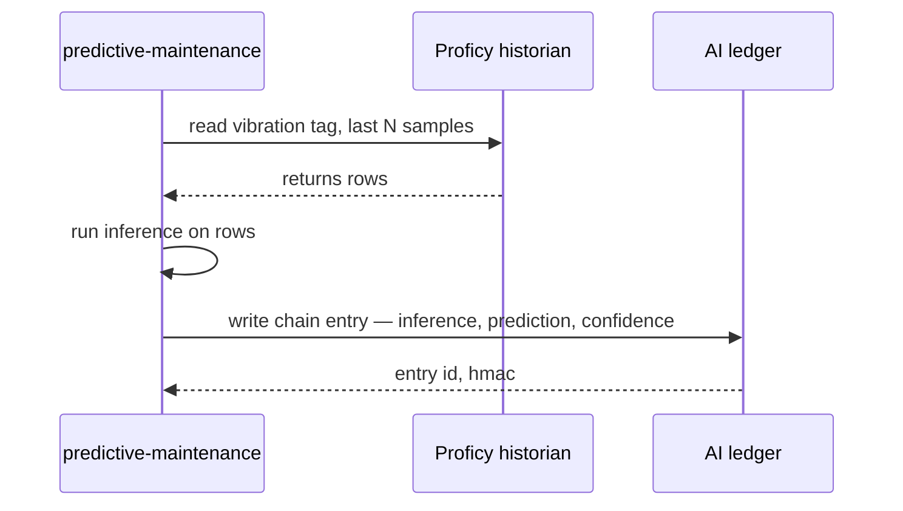
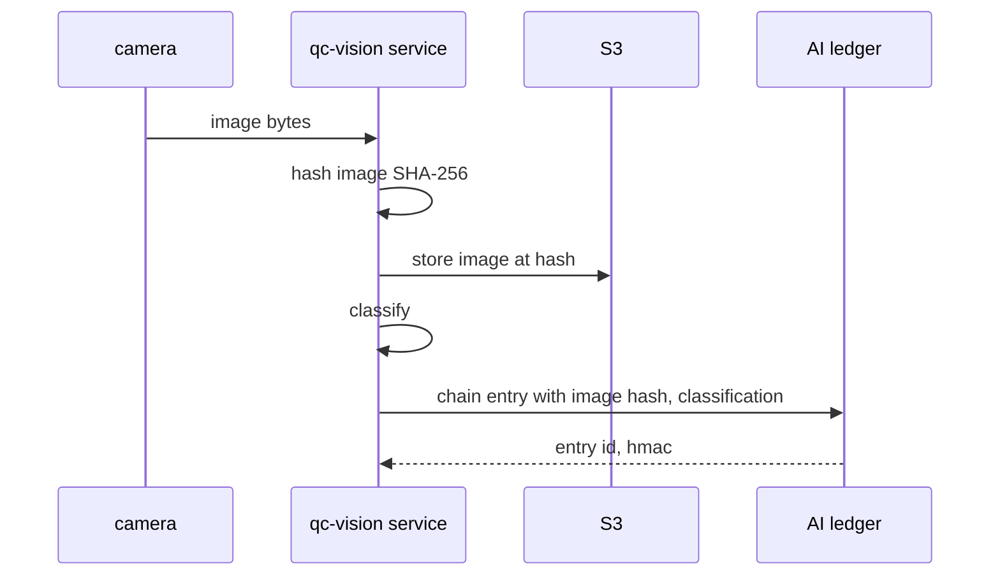

# 🧾 Diary of an Audit Day — Stelvio Industrial

**Engagement:** CMMC 2.0 Level 2 readiness re-assessment with AS 9100D quality-systems overlay
**Client:** Stelvio Industrial — specialty steel, northwest Indiana, ~$2.1B revenue, ~3,400 employees, third-generation family-owned
**Posture:** Partial TesseraSeal deployment — chained on the AI side (predictive maintenance, QC vision, ITAR screening); not chained on the OT side or the IT business side
**Date:** Wednesday, the day after Northbridge wrapped
**Auditor:** the same eight-person team that walked the diary baseline two weeks ago, Mercator the week after, Northbridge last week

---

## Context

Stelvio is a DoD prime-contractor steel supplier. They roll medical-device-grade and aerospace-grade flat steel for primes most people would recognize. They handle CUI on a daily basis. CMMC 2.0 Level 2 is the floor they have to clear; their aerospace customer adds AS 9100D on top; their medical-device customer cites their QC data inside FDA design verification submissions; and ITAR §125 export-control records hang off the side of every order destined for a defense end-use.

Fourteen months ago, after a CMMC 2.0 readiness assessment named CUI-handling gaps in their AI tooling, Stelvio stood up TesseraSeal — but only on the AI side. Three services, one tenant:

- `predictive-maintenance` — vibration plus temperature ML on the rolling mill, predicts bearing failure ~72 hours out
- `qc-vision` — image classification on hot-rolled bars, flags surface defects, rolling-mill flaws, inclusions
- `itar-screening` — small NLP that classifies POs against USML categories under ITAR §125

Everything on the AI side is chained, sealed daily on an on-prem Thales Luna HSM, verifiable.

Everything else is not.

The OT side — Siemens PLCs, Rockwell ControlLogix, GE Proficy historian, Plex MES, Wonderware HMI — runs the way OT has always run. The IT business side — Microsoft Dynamics 365 CRM, SAP ERP, email, SharePoint — runs the way IT business systems have always run. Both are mutable. Both have audit trails that depend on operational discipline rather than cryptographic enforcement.

The team showed up knowing this. Maria Costanza, Stelvio's Director of Internal Audit, had told Karen on the prep call: "I want you to find what I already know is broken. I need the report so I can take it to the CFO Friday."

This is the diary of that day.

---

## Audit Team

- **Karen** — Lead Auditor (governance and narrative)
- **Raj** — Database specialist
- **Elena** — CRM systems
- **Mike** — Application and API layer
- **Diana** — IAM and access control
- **Luis** — DevOps, logs, pipelines
- **Chen** — Data engineering and ETL
- **Tom** — Internal-audit liaison specialist (visiting team — partners with the client CAE)

Client-side liaison: **Maria Costanza**, Director of Internal Audit, Stelvio Industrial. Practical. CMMC-prep veteran. Knows the gaps.

---

## 🌅 8:30 AM — Kickoff and the Drive In

Karen rode in with Raj from the hotel. Forty minutes south on US-41, then east toward the lake. The mill stack was visible from the highway, white plume at a 45-degree lean in the wind.

Raj was on his second coffee. "What are we expecting today?"

Karen watched the stack come closer. "Today, I want to know what a manufacturing company with the means but not the time looks like."

"Versus?"

"Two weeks ago — the financial services job. Graveyard. CRM overwrites, database mutability, the whole thing. We wrote it up and went home tired."

"And last week."

"Northbridge. Banking. TesseraSeal in everything. We ran out of things to find by 3 PM. Diana was reading Reddit by 4."

"Mercator was the week before."

"Half the river sealed, half not. Healthcare. Imaging side chained. Claims side mutable. We wrote the seam down the middle of the report and the CMO understood it instantly."

"And today is —"

"Today is partial again. But the seam is in a different place." Karen drained her cup. "Mercator's seam was AI imaging versus claims. Stelvio's seam is AI versus OT versus IT business systems. Three zones, not two."

Raj nodded. "What's the recurring line you keep saying?"

Karen looked at him sideways. "It never is."

"That's the one."

"It never is. But sometimes part of it is. I'm calibrating." She smiled at the stack on the horizon. "Mercator was half of it. Northbridge was all of it. Today is a third of it. That's a different shape."

They pulled into the visitor lot at 8:25.

Maria met them at the badge desk. Polo shirt, steel-toed boots, the kind of handshake that came from a quarter-century of mill floors. "You'll need PPE for the floor. Hard hat, safety glasses, hi-vis vest, hearing protection. Anyone with metal in their shoes other than steel toes — let me know now."

The team kitted up. Maria walked them to the conference room — glass-walled, with a window onto the rolling mill floor itself, two stories below. The mill ran. Slabs the color of sunrise moved on the rollers. The room vibrated faintly through the chair legs.

Maria set the agenda on the screen.

"Three zones today. AI side first. Then OT. Then IT business. The AI side is on TesseraSeal. The OT side is not. The IT business side is not. I am going to be straight with all of you: I know where the gaps are. I am not going to argue with your findings. I want them documented so I can take them to my CFO Friday and ask for Phase 2 funding. Phase 2 is OT historian. Phase 3 is MES and ERP. We have the means. We have not had the time."

Karen smiled. "That's the most useful kickoff I've heard this month."

Maria did not smile back, but her shoulders dropped a half-inch. "Let's start on the floor."

> **🔍 Karen's note (internal):**
> *"It never is. But sometimes part of it is."*
>
> *Calibrate. Three zones. The AI zone passes. The other two don't. The interesting question is not whether they don't pass — Maria already knows. The interesting question is what the customer-facing language looks like when one zone supports CMMC 2.0 Level 2 and the other two will need 12 to 18 months to catch up.*

---

## 🧩 9:15 AM — First Question on the Mill Floor

Hard hats on. Hearing protection in. Maria led them out through a steel door and onto a catwalk above the rolling line. Slabs moved past below. The smell was hot mineral oil and wet steel. The sound was a low continuous roar that the hearing protection cut in half but did not erase.

Maria pointed past a railing at a black-housed camera mounted on a strut over the line. "QC vision. Looks at every bar coming off the finishing pass. Classifies surface defects in real time. Routes to scrap, rework, or ship."

Mike looked at the camera, then at the small ruggedized PC in a NEMA enclosure beside it. "And every classification it produces hits the chain."

"Every one. Image hashed. Classification logged. Operator override logged if there is one. Routing decision logged."

Mike pulled out his laptop, balanced it on a railing, and opened Herald.Compliance on the corporate VPN. "Let me find a recent one."

He filtered to `service.name = qc-vision` and the last five minutes. A row populated. Then another. Then another. They were appearing in real time as the bars passed under the camera.

"There." He pointed at one. "Bar ID 2026-04-09-RM02-1147, classified 14 seconds ago. Defect class: surface_inclusion. Confidence 0.94. Routing: rework. Operator override: none."

Karen leaned in to read the row. "And the source image?"

"Hashed in the chain entry. The JPEG itself sits in S3 — referenced by the hash. If anyone tampers with the JPEG, the hash mismatches and the verifier fails."

"Run the verifier on it."

Mike copied the entry ID into his terminal:

```
herald-verify --tenant=stelvio --service=qc-vision \
              --date=2026-04-09 --entry-id=2026-04-09-RM02-1147
```

Four seconds. The terminal returned:

```
Status: PASS
Step: 12
Reason: chain integrity verified, HMAC recomputed,
        Merkle path resolved, signature verified
        against public key qc-prod-2026-q1
```

Mike turned the laptop. Karen read the output. Maria read it over Karen's shoulder.

"Twelve steps, four seconds, on a corporate VPN over a 4G hotspot." Mike snapped the laptop shut against the wind. "That's the thing working."

> **✓ Confirmation #1**
> The QC vision chain is live on the production line and producing verifiable entries within ~200 ms of classification. Mike re-verified one in four seconds standing on a catwalk. The infrastructure is real, not a demo.

Maria walked them along the catwalk to a second camera near the cooling bed. "Same setup at the cooling-bed inspection. And one more upstream of the finishing stand. Three cameras, one model, one chain."

Karen wrote in her notebook: *Three cameras, one chain, one tenant, one service. Cardinality is small, behavior is consistent.*

Down the catwalk, in a glass-walled control booth, an operator was looking at a Wonderware HMI screen. He tapped a touch panel. A bar's routing changed from "ship" to "rework."

Karen watched. "What just happened?"

Maria shifted. "Operator override. He doesn't trust the AI's call. He thinks the bar is fine for ship."

"Did that go into the chain?"

"Yes. The HMI sends the override to the QC vision service over a local socket. The service writes a chain entry — operator ID, override direction, reason code if he typed one. That part is good."

"And the HMI itself?"

Maria hesitated for one heartbeat. "The HMI doesn't have an audit log. The override is logged because the QC vision service captures it on receipt. If the operator changed something on the HMI that didn't go through the QC vision path — a setpoint, an alarm threshold — there's no record."

Karen wrote: *HMI -> QC vision link is captured in chain. HMI as a primary surface is not. Watch this.*

> **⚠️ Surprise #1**
> The Wonderware HMI on the mill floor has no audit log. Override actions that pass through the QC vision service are captured because the service captures them. Override actions that do not — setpoint changes, alarm acknowledgments, recipe selections — are unrecorded. The chain captures what crosses the AI service boundary. It does not capture what stays on the HMI.

Maria caught the look between Karen and Mike. "Phase 3 includes HMI instrumentation. We're not there yet."

"Noted."

They came back inside. Maria handed off PPE and walked them down to a smaller conference room with no view of the floor. The roar fell to a hum. Karen pulled up a chair and clicked her pen.

"Let's split. Raj — historian and AI ledger. Diana — IAM, both sides. Mike and Chen — pipelines and the AI services. Elena — Dynamics. Luis — logs and ops. Tom — sit with Maria, work the QMS evidence retrieval. Reconvene at noon."

They split.

---

## 🧠 10:00 AM — Database Deep Dive (Two Probes, Two Outcomes)

Raj had a corner of the conference table and two screens. One showed the AI-side ledger. The other showed the GE Proficy historian's SQL Server backend. He worked them in parallel.

### The AI ledger

Raj started with the chain. Append-only by design. The Herald.Py SDK signs each entry. The HMAC-SHA-256 chain links entry N to entry N-1 with HKDF-per-tenant key binding. Daily Ed25519 seals close out each day's chain on the on-prem Luna HSM.

He picked a random entry from three weeks ago. Copied its ID. Ran the verifier.

```
Status: PASS
Step: 12
Reason: chain integrity verified, HMAC recomputed,
        Merkle path resolved, signature verified
        against public key qc-prod-2026-q1
```

He picked a random entry from yesterday. Same result. He picked the very first entry from 14 months ago — the day TesseraSeal went live. Same result.

He tried to mutate one. Issued an UPDATE on the chain table directly through SQL.

The database accepted it because nothing at the database layer prevents it. Raj ran the verifier on the next entry in the chain.

```
Status: FAIL
Step: 4
Reason: HMAC mismatch — entry payload does not produce
        the chained HMAC recorded in entry N+1
```

Then he tried to also rewrite entry N+1 to match. The verifier failed at the daily seal:

```
Status: FAIL
Step: 9
Reason: Merkle root mismatch — recomputed root does not
        match sealed root for date 2026-03-19
```

He rolled back his mutations. The chain returned to PASS. He noted the test in his workbook.

> **✓ Confirmation #2**
> The AI-side ledger is append-only in practice. Direct database mutation is technically possible, but the verifier catches it at the HMAC layer (single-entry tamper) or the Merkle/seal layer (multi-entry tamper). The seal is on a Luna HSM that the database engineers do not have access to. To forge undetectably, an attacker would need both database write access and HSM signing access — and Stelvio has those split.

### The OT historian

Raj opened the second screen. GE Proficy. SQL Server backend. He had read-only access through Maria's audit role.

He picked a vibration tag — `RM02_BEARING_3_VIB_X` — and pulled the last 30 days of one-second samples. Tens of millions of rows. He pulled the schema.

The table had a `value` column, a `quality` column, a `timestamp` column, and a `wallclock` column. No `created_by`. No `modified_by`. No `modified_at`. No row-level audit.

He asked Maria, "Who has write access to this table?"

Maria pulled up a query in her own session and ran it against `sys.database_role_members`. Three roles. `db_owner` was assigned to four engineering accounts and one service account. `historian_writer` was assigned to the historian service.

"Could one of those engineering accounts edit a vibration sample from three weeks ago?"

"Yes."

"And there would be no record of the edit?"

"No record at the database layer. There might be a Windows event log entry on the server itself if someone connected via SSMS, but engineers connect from their workstations, and the event log on the engineering workstation rotates after a week."

Raj leaned back. "So a vibration trace from three weeks ago — say, the trace that fed the predictive-maintenance model the night a bearing failed — is mutable, with no record of the mutation, and the engineers who would be the prime suspects in any backdating scenario are the same engineers who hold `db_owner`."

"Yes."

"And the AI ledger has a chain entry that says 'predictive-maintenance ingested vibration trace at 02:14:33 UTC, predicted bearing failure with confidence 0.81' — but the chain entry references the trace by row range, not by hash."

Maria nodded slowly. "Phase 2 includes hashing the trace at the historian boundary. We are not there yet."

> **⚠️ Surprise #2**
> The OT historian's SQL Server backend is mutable by anyone with `db_owner`. There is no row-level audit. Sensor traces from any past date can be edited or back-dated with no record. This is the same mutability shape as the diary baseline financial services audit two weeks ago — except the data being mutated here is what feeds the predictive-maintenance AI, which is otherwise chained.

> **⚠️ Surprise #3**
> The chain captures what the AI saw. It does not capture what was actually true at the sensor. If the historian was tampered with before the AI read it, the chain entry would faithfully record that the AI made a confident prediction based on tampered data — and the chain would verify PASS, because the tamper happened upstream of the chain boundary.

Raj wrote in his workbook: *Chain integrity is necessary but not sufficient. The chain proves the AI saw what it saw and decided what it decided. The chain does not prove what the sensor actually measured. The boundary matters. Document where the boundary is.*

He moved on to the Plex MES backend.

### The MES

Plex's audit log is configurable. Maria pulled it up. Retention was set to 90 days.

"That's the default?"

"That's what we set it to. Six months ago, an engineer cleared the audit log to free disk space."

Raj waited.

"He did it on a maintenance window. He didn't tell anyone. We found out three weeks later when QA went looking for a 2024 work-order history during a customer audit."

"And the cleared records —"

"Gone. The log is a circular buffer. Once cleared, prior states are not reconstructible from Plex itself. We have nightly database backups, but the backups are full-database snapshots, not change logs. We can restore a point-in-time but we can't reconstruct the sequence of changes between two points."

Raj wrote in his workbook: *MES audit log: 90-day retention, cleared six months ago by engineer for disk space. Restoring from backup gives state at time T but not the change sequence between T1 and T2.*

> **⚠️ Surprise #4**
> Plex MES audit log is set to 90-day retention and was cleared six months ago by an engineer to free disk space. Backups exist but they are point-in-time snapshots, not change-record streams. Reconstructing the sequence of changes between two backup points is not possible.

He moved on.

---

## 🔐 11:00 AM — IAM Review (Same Split)

Diana had a workbook that walked through identity, access, and credential rotation — once for the AI side, once for the OT side, once for the IT business side. Three columns. She filled them in the same order.

### AI side IAM

Every credential the AI services use — database creds for the chain backing store, S3 creds for the QC images, OpenAI API keys for an experimental classifier they were evaluating, the Luna HSM PIN for the daily seal — every rotation was a chain entry. `event.type = credential.rotated`, with rotator identity, rotation reason, and the new key fingerprint.

Diana picked the last six rotations from the chain. Verified each. All PASS.

She asked Maria for the most recent rotation, which would have happened at the start of Q2.

```
herald-verify --tenant=stelvio --service=qc-vision \
              --event-type=credential.rotated \
              --date-range=2026-04-01:2026-04-08
```

Three entries returned. Two database creds and one S3 access key. All PASS.

> **✓ Confirmation #3**
> Credential rotation on the AI services is captured in the chain with rotator identity, fingerprint, and reason. Six rotations sampled across the past 14 months. All verifier PASS. Multi-factor authentication on every service account that accesses the chain.

### OT side IAM

Diana asked Maria to log in to the engineering workstation that controls the rolling-mill PLC and the QC vision camera mounts.

The login screen showed `Plant_Engineer` as the account.

"Who is `Plant_Engineer`?"

"Everybody." Maria's voice was flat. "It's a shared account. Six people use it. Same password."

"When was it last rotated?"

Maria pulled up a Windows event log on a different workstation. "Eighteen months ago."

"MFA?"

"No."

"And this workstation can hot-swap the running PLC program on the rolling mill?"

"Through TIA Portal. Yes."

"And the hot-swap is logged?"

"In TIA Portal."

"Where is the TIA Portal log?"

"Flat file on this workstation."

"Editable?"

"Yes."

Diana wrote: *Shared account. No MFA. Password 18 months stuck. PLC hot-swap log on the same machine, editable. Compounds.*

> **⚠️ Surprise #5**
> The engineering workstation that controls the rolling-mill PLC uses a shared account, `Plant_Engineer`, with no MFA, used by six people. The password was last rotated 18 months ago. The TIA Portal hot-swap log is a flat file on the same machine. Anyone with the shared password can hot-swap a PLC program and edit the log that records the hot-swap.

### IT business side IAM (SAP)

Diana moved to SAP. Pulled the segregation-of-duties matrix. Cross-referenced authorizations against the SAP user master.

`SAP_ALL` was assigned to two production-support engineers.

She ran `STAD` and pulled their audit trail for the last 90 days. Each had used `SAP_ALL` rights twice — four uses total — for "emergency change" tickets in the corporate ticketing system.

She pulled the four ticket numbers. Asked Maria for ticket status.

Maria checked. "All four are open. Listed as 'pending review and closure.'"

"How long have they been open?"

"The oldest is 78 days."

"And there's no SLA on closing emergency-change tickets?"

"There's an SLA. Five business days. It is not enforced."

Diana wrote: *`SAP_ALL` x 2 prod-support engineers. Four uses in 90 days for "emergency change." All four tickets unclosed past SLA. The grant is technically time-bound by ticket but operationally unbound because tickets don't close.*

> **⚠️ Surprise #6**
> Two production-support engineers have `SAP_ALL` profile. They have used those rights four times in the last 90 days under "emergency change" tickets that have not been closed despite an SLA of five business days. The audit trail records the use, but the privilege itself is not effectively constrained because the closure step is not enforced.

Diana stacked the three columns side by side and stared at the page. Same person, three identities, three different exposures depending on which system they touched.

The AI column was a clean rotation history with chain-coupled evidence.

The OT column was a shared account, no MFA, stuck password, editable log.

The IT business column was `SAP_ALL` with broken closure discipline.

She wrote at the bottom of the page: *The chain is not magic. Where it is wired in, IAM behaves. Where it is not, IAM behaves the way IAM behaves when nobody is forced to look.*

---

## 🧪 12:00 PM — Lunch (But Not Really)

The catering came up to the conference room — sandwiches, fruit, coffee. Karen and Tom took a corner. The rest of the team ate at the table or talked through findings between bites.

Karen unwrapped a turkey. "Tom. The reporting frame."

Tom set his fork down. "Same finding language for the OT side as for the diary baseline?"

"That's what I want to know."

"CMMC scopes to CUI. Most of the OT side handles CUI. The vibration traces are not CUI per se, but the predictive-maintenance model's outputs feed maintenance decisions on a mill that produces CUI parts. The historian is in scope. The MES is in scope. The PLCs are in scope. Same finding language."

"And the IT business side?"

"Dynamics holds customer records that are CUI for some customers — DoD primes, definitely. SAP holds material records tied to CUI orders. Email and SharePoint hold QMS evidence that is in-scope under DFARS 252.204-7012. Same finding language."

"So three zones, three sets of findings, but one severity scale?"

"One severity scale. Different remediation timelines, but one scale."

Karen took a bite. Chewed. Looked at the mill through the window.

"What about the AI side?"

"The AI side passes. Document it explicitly. Don't bury it in the body of the report — make it a section header. Maria's CFO needs to see what the prior investment bought before he signs the cheque for Phase 2."

"Agreed."

Tom picked up his fork. "And the medical-device customer?"

"That comes at 4:30. Maria mentioned it on the prep call. They want 'AI provenance evidence' on the QC classifications because they cite Stelvio's QC data inside an FDA design verification submission."

"What can we give them?"

"Verifier output. Public key. Daily seal record. They re-verify on their end. They cannot re-verify the source image's history before the camera captured it — but they can verify the classification was not tampered with after capture. That's the line. We document where the line is in the cover letter."

Tom nodded slowly. "That's a clean line."

"It is. The trick is not pretending it's a different line."

They ate the rest of lunch in silence, watching slabs move on the rollers below.

---

## 🔄 1:00 PM — At the Mill (API Layer Inspection)

Mike and Chen wanted to see the chain entry for a defect classification land in real time, not just retrieve one after the fact. Maria walked them back out onto the catwalk near the QC vision camera at the cooling bed.

It was loud. They wore hearing protection and hand-signed agreements about which cameras were watching them.

Mike opened a terminal on his laptop. He had an SSH session into Herald.Compliance and was tailing the chain stream for `service.name = qc-vision`:

```
herald-tail --tenant=stelvio --service=qc-vision \
            --follow --since=now
```

Chen had his own laptop open on the rail, tailing the QC vision service's structured logs to see the inference event from the application side.

A bar came down the cooling bed. Hot. Glowing. The camera flashed once. Mike's terminal scrolled.

```
[2026-04-09T13:02:14.412Z] entry_id=2026-04-09-RM02-2891
  service=qc-vision tenant=stelvio
  event=qc.classification
  bar_id=RM02-2891
  image_sha256=8f3a...c714
  model_id=qc-defect-v3.2 model_version=2026-Q1
  classification=no_defect confidence=0.97
  routing=ship operator_override=null
  hmac=e2c4...91bd
```

Chen's terminal showed the inference event 198 ms before Mike's chain entry.

"Two-tenths of a second from inference to chain entry," Chen said. "On the same network segment."

"Verifier?"

Mike copied the entry ID and ran the verifier on his laptop:

```
herald-verify --tenant=stelvio --service=qc-vision \
              --date=2026-04-09 --entry-id=2026-04-09-RM02-2891
```

Four seconds.

```
Status: PASS
Step: 12
Reason: chain integrity verified, HMAC recomputed,
        Merkle path resolved, signature verified
        against public key qc-prod-2026-q1
```

Mike turned the laptop. Chen read the output. Maria nodded.

Another bar came down. The camera flashed. Mike's terminal scrolled.

```
[2026-04-09T13:02:31.107Z] entry_id=2026-04-09-RM02-2892
  event=qc.classification
  bar_id=RM02-2892
  classification=surface_inclusion confidence=0.88
  routing=rework operator_override=null
```

Mike re-verified. PASS. Four seconds.

> **✓ Confirmation #4**
> Live inference -> chain entry latency observed at ~200 ms. Verifier latency observed at ~4 seconds for any single entry. Twelve verification steps including HMAC recomputation, Merkle path resolution, and signature verification against the published public key. Stelvio operates this pipeline on production hardware in a noisy production environment. It works.

Maria pointed at a third bar coming down. "Watch this one."

The camera flashed. The HMI in the booth chimed. The operator inside tapped the screen — reaching across to the routing column. The bar's destination changed from "rework" to "ship." Mike's terminal scrolled twice.

```
[2026-04-09T13:02:48.224Z] entry_id=2026-04-09-RM02-2893
  event=qc.classification
  classification=surface_inclusion confidence=0.71
  routing=rework operator_override=null

[2026-04-09T13:02:50.881Z] entry_id=2026-04-09-RM02-2894
  event=qc.operator_override
  bar_id=RM02-2893
  override_from=rework override_to=ship
  operator_id=BCRUZ reason_code=VISUAL_CONFIRMATION_NO_DEFECT
```

Two entries, 2.6 seconds apart. The classification, then the override. Both PASS on the verifier.

Mike spoke into the wind. "The override is captured because it goes through the QC vision service. The operator's HMI tap is recorded by the service receiving the override."

"And if the operator did something on the HMI that didn't go through the service?"

"Then it's not in the chain."

Chen wrote in his notebook: *The chain captures what crosses the AI service boundary. Anything inside the HMI alone is not captured. Stelvio's HMI is on Phase 3.*

They came back inside.

---

## 🧬 2:00 PM — Pipeline Reality

Chen pulled up the data flow from the historian into the predictive-maintenance service. He had a whiteboard. He drew the flow as a sequence.



Chen pointed at the second arrow.

"This is the gap. The predictive-maintenance service trusts the historian. The historian returns rows. The service runs inference. The chain entry records the inference and the prediction. But the chain entry references the rows by tag and time range — not by content hash. If those rows were edited at any point between collection and read, the chain entry still records that the AI made a confident prediction. The verifier still says PASS. The prediction is just garbage."

Mike folded his arms. "So the chain says 'AI saw input X at time T.' What it cannot say is 'input X is what the sensor actually measured.'"

"Right."

"Phase 2 hashes the trace at the historian boundary?"

Maria nodded. "Phase 2 puts a content hash on the historian read. Either the historian writes hashes alongside the values, or the predictive-maintenance service hashes on read and the comparison is against a stored hash. Either way, the chain entry references the input by hash, and tampering with the historian breaks the link."

Chen wrote: *Phase 2 line-item — hash inputs at historian read so chain entries reference content, not addresses.*

> **⚠️ Surprise #7**
> The historian -> AI input pipeline is unauthenticated. The chain captures what the AI saw, not what the sensor measured. If a vibration trace was edited in the historian — and `db_owner` access on the historian SQL Server makes that possible without trace — the AI would receive tampered input, log a chain entry that PASS-verifies forever, and produce a prediction whose value the chain cannot vouch for.

Chen drew a second flow. "Same shape on the QC vision side, but better."



He pointed. "QC vision hashes the image at the service boundary. The chain entry references the image by SHA-256. The image in S3 is stored at the hash. If the S3 object is replaced with a different image, the hash check fails. If the camera's bytes were modified between camera and service — that's still a gap, but the gap is under one second on a local socket, in a NEMA enclosure on a catwalk. Different threat model than 'engineer with `db_owner` on the historian for 30 days.'"

"And the predictive-maintenance side has a 30-day window for tampering," Mike said.

"Effectively, yes."

Maria wrote in her own notebook. *Phase 2: hash at historian boundary. Phase 2: separate `historian_writer` from `db_owner`. Phase 2: row-level audit on the historian. Three line items, one Phase, twelve months.*

---

## 📊 3:00 PM — Reconciliation Test

Tom set the test. Three QC vision defect classifications from the past 30 days. Trace each one end to end.

Maria picked three from the QC vision dashboard. She didn't tell the team in advance which ones — she just sent them three entry IDs and said "go."

```
2026-03-19-RM02-1147
2026-03-25-RM02-2204
2026-04-02-RM02-0883
```

Mike took the first. Chen took the second. Raj took the third. Twenty minutes.

### 2026-03-19-RM02-1147

Mike: "Verifier — PASS. Twelve steps. Public key qc-prod-2026-q1. Image SHA-256 hash in the chain entry. JPEG present in S3 at the hash. Routing decision in the chain — rework."

He kept going. "Trace forward into MES — the rework work order is in Plex. Created 2026-03-19 at 14:33 UTC. Closed 2026-03-20 at 09:11 UTC. Bar reprocessed and re-inspected. Second QC vision classification at 2026-03-20 09:42 UTC, no defect, routed to ship."

"And the original image — has anyone tampered with the JPEG in S3?"

Mike rehashed the JPEG. Compared to the chain entry hash. "Match. No tamper."

Karen wrote: *Reconciliation 1 — full trace. AI clean. MES clean for this work order. Image not tampered with.*

### 2026-03-25-RM02-2204

Chen: "Verifier — PASS. Image SHA-256 in the chain entry. JPEG in S3 — match on rehash. Classification: surface_inclusion. Routing: scrap. Operator override: yes."

"What was the override?"

"Operator agreed with classification but downgraded routing from scrap to rework on the basis of customer-specific tolerance. Operator ID, reason code, all in the chain. Verified."

"Forward trace?"

"Plex shows the rework. Closed cleanly. Material yield reroute logged in MES. The reroute itself isn't in the chain — it's a Plex-only event — but the trigger is in the chain."

Karen wrote: *Reconciliation 2 — full trace. AI clean. Override captured. MES has the reroute but the reroute itself is unchained.*

### 2026-04-02-RM02-0883

Raj: "Verifier — PASS. Image SHA-256 in chain entry. JPEG in S3 — match. Classification: surface_inclusion. Routing: ship."

"Ship despite a defect classification?"

"Confidence was 0.62. Classification policy is to ship below 0.70 unless a customer-specific tolerance overrides. Operator override: none."

"And forward trace?"

"This bar shipped to —" Raj paused. He pulled up the customer record in Dynamics. "Westmark Medical. Heat 18-RM02-0883 was shipped April 4. Westmark received it April 6. Westmark cited the heat in their design verification documentation for an FDA submission filed April 7."

The room was quiet.

"That's the call Maria mentioned this morning?"

"That's the call."

Maria leaned in. "Westmark's QE team called yesterday. They want AI provenance evidence on the QC classifications for the heats they cite. We need to send them something."

Tom pulled out a notebook. "What we can send them: the chain entry, the verifier output, the public key for the seal period, and the daily seal record. They can re-verify on their end. They get cryptographic confirmation that the classification we provided to them is the classification we recorded at the camera, that the image in S3 matches the hash, and that nothing has been tampered with after capture."

"What we cannot send them," Karen said, "is evidence of the trace before the camera. The bar's prior process — heat treat, rolling, cooling — is in the historian, the MES, and the PLC logs. Those are not chained. Those are not authenticatable in the same way."

Maria nodded. "Document where the line is in the cover letter."

> **✓ Confirmation #5**
> Three QC vision classifications selected at random by Maria. All three reconcile end to end on the AI side. Verifier PASS for all three. Image hashes match for all three. Routing decisions captured in chain. Forward traces into MES are clean for the in-chain steps. The cross-system link to a customer's downstream system (Westmark FDA submission) exists and is auditable up to Stelvio's boundary.

> **⚠️ Surprise #8**
> The forward trace into Westmark's FDA design verification submission depends on records that Stelvio cannot vouch for after they leave Stelvio's perimeter. Westmark's quality engineering team is asking for AI provenance evidence on Stelvio's classifications. Stelvio can supply that evidence cleanly for the AI side. Westmark will need to layer their own provenance on the steps that happen in their own facility.

The reconciliation test took 22 minutes. The team took five.

---

## 😬 3:45 PM — The Friction Builds

Maria had pulled in three engineers for a sit-down with the team — two from OT, one from IT business. Karen wanted to confirm findings face-to-face before the debrief.

The OT lead, Rick, spoke first. He had been a millwright before he was an engineer. He did not have time for theory.

"Mill floor uptime is 99.7%. We don't have time to instrument every PLC. Every minute we are not rolling steel is a minute we are losing money. Last year we shipped 1.2 million tons. That's 41,000 tons an hour during run time. We don't take the line down for an audit log."

Karen heard him out. "Rick, I'm not going to argue uptime."

"Good."

"What I'm going to write is what is missing and what the remediation timeline looks like. Maria has Phase 2 on the roadmap. Twelve months. Phase 2 puts hashes at the historian boundary, splits `historian_writer` from `db_owner`, and adds row-level audit on the historian. None of those changes touch the running PLC. None of them require mill downtime."

Rick uncrossed his arms a fraction.

"Phase 3 is MES and HMI. Eighteen months. That one is heavier. Some of those changes require maintenance windows. We'll write that explicitly in the roadmap so the CFO sees the cost."

Rick nodded. "OK."

The IT business engineer, Devon, spoke next. He was pragmatic.

"We have a roadmap. Phase 2 OT. Phase 3 MES and ERP. Dynamics is — honestly, Dynamics is probably Phase 4. I'll be honest with you, the SAP `SAP_ALL` problem on the prod-support engineers is something I keep raising. We have an HR-level disagreement about whether we can revoke `SAP_ALL` from those two without breaking the on-call rotation."

Karen wrote: *Phase 4 dependency. Document it but don't elevate it above the OT findings.*

The other OT engineer, Sam, who had been quiet, finally spoke.

"The Plex audit log — that was me."

The room turned.

"Six months ago. I cleared it. Disk space. I should have called someone. I didn't. We talked about it after. I won't do it again."

Maria didn't say anything. She had clearly heard this before.

Karen wrote: *Plex audit log clear — disclosed by engineer in the room. Process gap, not malicious. Phase 3 includes audit log retention enforcement. Document.*

The friction in the room was not between auditors and engineers. It was between OT culture and IT culture. OT measured uptime. IT measured availability. Both measured incidents. Neither had been measuring "could we reconstruct what happened from the records 90 days from now." Maria had been the only person measuring that, and she had been measuring it alone.

Karen looked across the table. "Maria, we're going to write this up so it supports your CFO ask. Phase 2 in 12 months and Phase 3 in 18. The AI side you already have demonstrates that the technology works in your environment. That is the strongest single argument for funding the next two phases."

Maria nodded. "That is what I needed to hear."

The friction subsided. The engineers left. Karen closed the door.

---

## 🔍 4:30 PM — The Customer Question

Maria came back in. She had a printed email in her hand.

"Westmark Medical. Yesterday at 4:42 PM. Their QE manager — Jen Halverson. She's asking for AI provenance evidence on the QC classifications for the heats they cited in their April 7 FDA submission."

She handed the email to Karen. Karen read it.

"What is she asking for, specifically?"

"Anything that proves the QC vision classification we sent them is what we said it is. She wrote — let me find the line —" Maria turned the email and pointed. "Here. 'We need to demonstrate to FDA that the classification data cited in our design verification has not been altered between Stelvio's QC system and our document.'"

Karen read the line twice. "That's a clean ask."

"What can I send them?"

Karen took a breath. The team gathered.

"Send them four things. The chain entry — full payload, including the image SHA-256 hash, the model ID, the model version, the classification, the confidence, the routing, and the chain HMAC. The verifier output — the full twelve-step output showing PASS. The public key — qc-prod-2026-q1, the same one in the verifier output. The daily seal record — the Ed25519 signature for the date in question, with the Merkle root."

"And a cover letter."

"And a cover letter. The cover letter says three things. One — we record the classification at the camera, hashed and chained, within 200 ms of inference. Two — the chain seals daily on an on-prem HSM. Three — what we can attest to and what we cannot. We can attest the classification was not tampered with after capture. We cannot attest to the source image's history before the camera captured it — that's a different threat model and a different scope. They will need to layer their own provenance on what happens on their side of the boundary."

Maria wrote it down. "Where is the line in the cover letter?"

"Halfway down the page. Bold. Don't bury it."

She nodded.

Diana spoke up. "Add one more thing — the public key fingerprint and the URL where Westmark can download the public key independently. Don't make them trust the public key we send them. Let them go fetch it themselves and compare."

"Public key publication URL?"

Maria pulled up Herald.Compliance. "Here — the public key publication endpoint. We expose all current and past public keys with seal dates. Westmark can pull qc-prod-2026-q1 themselves over HTTPS and compare the fingerprint."

Mike looked at the URL. "TLS-pinned. Good."

Karen wrote in her notebook: *Customer ask — fully serviceable on the AI side. Cover letter draft to be reviewed Friday morning before Maria sends. Document the line.*

> **✓ Confirmation #6**
> Westmark's request for AI provenance evidence on the QC classifications is fully serviceable on the AI side. Stelvio can supply chain entry, verifier output, public key, and daily seal record for any classification on a chained service. Westmark can independently fetch the public key from a published endpoint and compare. The provenance line — what Stelvio can attest and what they cannot — is articulable in two paragraphs.

The team took fifteen minutes to draft the cover letter outline. Maria would refine it Thursday and send Friday after the CFO review.

---

## 🌆 5:30 PM — Auditor Debrief

The team reconvened in the conference room. Coffee was cold. The mill was still rolling. The wind had shifted and the stack plume now leaned the other way.

Karen stood at the whiteboard. Three columns.

| Zone | Status |
|---|---|
| AI side (predictive maintenance, QC vision, ITAR screening) | 0 Gaps, 0 Partials |
| OT side (historian, PLC, MES, HMI) | 4 Gaps, 5 Partials |
| IT business side (Dynamics, SAP, email/SharePoint) | 3 Gaps, 4 Partials |

"That's the shape. Three zones. One passes. Two don't."

Maria stood with her arms crossed, listening.

"AI side." Karen pointed. "TesseraSeal. Mature. Verifiable. Six confirmations — chain integrity, append-only ledger behavior, credential rotation under chain, live inference-to-chain latency under 200 ms, three-of-three reconciliations PASS, customer-evidence ask fully serviceable. The AI side passes CMMC 2.0 Level 2 for the in-scope subset. AS 9100D for the AI-decisioned QC classifications passes. ITAR §125 screening evidence is auditable. This is the strongest part of your posture and it is the model for the other two zones."

She moved to the OT column.

"OT side. Four gaps. Historian SQL Server is mutable by `db_owner` with no row-level audit. PLC engineering workstation has a shared account with no MFA and an 18-month-stuck password. PLC hot-swap log is a flat file editable by anyone with the shared password. Plex MES audit log is 90-day retention and was cleared six months ago to free disk space. Five partials around HMI capture and historian-to-AI pipeline trust. The remediation for the OT side is Phase 2 on the roadmap. Twelve months. Hashing at the historian boundary, splitting historian write roles, row-level audit on the historian, audit log enforcement on Plex, MFA on the engineering workstation, and per-user accounts on the PLC engineering tools. None of these require mill-floor downtime."

She moved to the IT business column.

"IT business side. Three gaps. `SAP_ALL` on two prod-support engineers with broken closure discipline on emergency-change tickets. Dynamics has field-level change tracking enabled on some fields and disabled on others — same shape as the diary baseline we saw two weeks ago. QMS evidence in Word documents on SharePoint with no integrity check on retrieval. Four partials around backup-vs-change-history, email retention, and ERP material-record integrity. Phase 3 territory. Eighteen months. The Dynamics piece may be Phase 4."

Maria nodded. "Phase 4 is realistic for Dynamics. We don't have the appetite to instrument it before SAP and MES."

"Document it explicitly. The CFO needs to see Phase 4 even if it's distant."

"Will do."

Karen moved back to center.

"Three observations to close."

"One. The chain works. Stelvio has been running it on three production AI services for 14 months. The verifier returns in seconds. The HSM-sealed daily roots are present and correct. The investment paid off. When Westmark called yesterday asking for AI provenance evidence, you had the answer."

"Two. The chain is not a substitute for instrumentation everywhere. The chain captures what crosses the AI service boundary. The chain does not capture what sits inside the historian, the PLC, the HMI, the MES, the CRM, the ERP, or the document store. Where the chain ends, mutability begins. The diary baseline we wrote two weeks ago at the financial services client describes what mutability looks like in detail — your OT side and your IT business side share that same shape."

"Three. The seam between the chained zone and the unchained zones is the single most important line in your audit story. Document it everywhere — to your customers, to your CMMC assessor, to your AS 9100D auditor, to your medical-device customer's QE team. The line is not a weakness. It is a clarity. Stelvio knows what it can prove and what it cannot. The companies who get into trouble are the ones who don't know."

She put the pen down.

Maria spoke. "What do I take to the CFO Friday?"

Tom answered. "The three-zone summary. The roadmap costed against the three-zone summary. The Westmark cover letter as a real artifact showing what the prior investment already delivered. The four-second verifier video Mike took on the catwalk."

"You took a video?"

Mike held up his phone. "Took a video. Verifier PASS in four seconds, on the catwalk, over a 4G hotspot. Twelve steps."

"Send me that."

"Sent."

Karen closed her notebook. "We'll have the report Thursday. You'll have it before the Friday review."

Maria's shoulders dropped that half-inch again. "Thank you."

The team packed up. Raj and Luis loaded the boxes of evidence into the rental SUV. Diana and Elena said goodbye to Maria at the badge desk. Mike and Chen took one last look at the rolling line on the way out.

Karen walked out last. She turned at the door and looked back at the conference room window — at the slabs moving on the rollers two stories below, the stack plume in the wind, the catwalk where four hours earlier Mike had run the verifier and gotten PASS in four seconds.

> **🔍 Karen's note (internal):**
> *It never is. But sometimes part of it is.*
>
> *Today, a third of it was. The right third. The third that decides.*

---

## ✅ vs ❌ — The Three-Tier Summary

### ✅ AI Side (TesseraSeal — predictive maintenance, QC vision, ITAR screening)

| Item | Status |
|---|---|
| Chain integrity (HMAC + Merkle + daily Ed25519 seal on on-prem Luna HSM) | PASS |
| Append-only ledger behavior under direct DB mutation attempt | PASS — verifier catches at HMAC layer |
| Multi-entry tamper attempt | PASS — verifier catches at Merkle/seal layer |
| Credential rotation under chain | PASS — six rotations sampled, all PASS |
| Inference -> chain latency | ~200 ms observed live on catwalk |
| Verifier latency | ~4 seconds for any single entry, 12 steps |
| Reconciliation test (3 of 3) | PASS — full forward trace into MES, image hashes match, no tamper |
| Customer-evidence ask (Westmark) | Fully serviceable — chain entry, verifier output, public key, seal record, line documented |
| Operator override capture | PASS — captured in chain when override crosses QC vision service boundary |
| CMMC 2.0 Level 2 readiness for AI subset | Demonstrable |
| AS 9100D evidence for AI-decisioned QC | Demonstrable |
| ITAR §125 screening evidence | Auditable |

### ❌ OT Side (Proficy historian, PLC engineering workstation, Plex MES, Wonderware HMI)

| Item | Status |
|---|---|
| Historian SQL Server row-level audit | NONE — `db_owner` can edit any sample with no record |
| Historian write-role separation | NONE — `db_owner` includes write capability |
| PLC engineering workstation account | SHARED — `Plant_Engineer`, six users, no MFA, password 18 months stuck |
| TIA Portal hot-swap log | EDITABLE — flat file on the engineering workstation |
| Plex MES audit log retention | 90 days, configurable, cleared 6 months ago by an engineer for disk space |
| Plex MES point-in-time reconstruction past 90 days | NOT POSSIBLE without backup restore + manual diff, change sequence not reconstructible |
| Wonderware HMI audit log | NONE — captured only when actions cross AI service boundary |
| Historian -> AI input authentication | NONE — chain entries reference rows by tag/time, not by content hash |
| Phase 2 remediation timeline | 12 months — no mill-floor downtime required |

### ❌ IT Business Side (Dynamics 365, SAP, email, SharePoint)

| Item | Status |
|---|---|
| Dynamics 365 field-level change tracking | PARTIAL — enabled on account name and primary contact, disabled on account notes and opportunity description |
| Dynamics 365 retention shape | "Backups, not version history" — same as diary baseline |
| SAP `SAP_ALL` profile assignment | TWO production-support engineers with stale emergency-change ticket closures |
| SAP `STAD` recent use | Four uses in 90 days under unclosed emergency tickets, SLA 5 business days violated |
| SharePoint QMS evidence integrity | NONE — Word documents with last-modified timestamps, no content-hash on retrieval |
| Email retention for QMS evidence | Standard mailbox retention, no integrity check on retrieved messages |
| ERP material-record integrity | Standard SAP audit log, clearable by `SAP_ALL` |
| Phase 3 remediation timeline | 18 months — includes maintenance windows |
| Phase 4 (Dynamics) | Realistic, distant, document explicitly |

---

## 🧾 Final Assessment Theme

> *"The chain is on the part that decides. The chain is not on the part that produces what the decision is made about. Stelvio knows the difference. Their customer needs to."*

Stelvio Industrial demonstrates AI-decision integrity within scope. The investment in TesseraSeal across predictive maintenance, QC vision, and ITAR screening returns verifiable provenance under CMMC 2.0 Level 2, AS 9100D, and ITAR §125. The verifier runs in seconds on production hardware in a noisy production environment. A medical-device customer asking for AI provenance evidence on cited QC classifications can be served cleanly, with the line between attestable and non-attestable documented in the cover letter.

Outside the AI scope, integrity is operational discipline. The OT side and the IT business side share the same mutability shape we documented in the diary baseline two weeks ago at a mid-size financial services client. The remediation is funded — Phase 2 in 12 months for the OT side, Phase 3 in 18 months for the MES and ERP, Phase 4 distant for Dynamics. Maria takes the report to her CFO Friday with a four-second verifier video as the strongest single argument that the prior investment paid for itself.

Three zones, one report, one severity scale, three remediation timelines. The seam between zones is the single most important line in the audit story. Stelvio knows where the seam is. Their customer is about to.

---

*End of diary. Filed Wednesday evening. Report drafted Thursday. Delivered Friday morning before the CFO review.*
