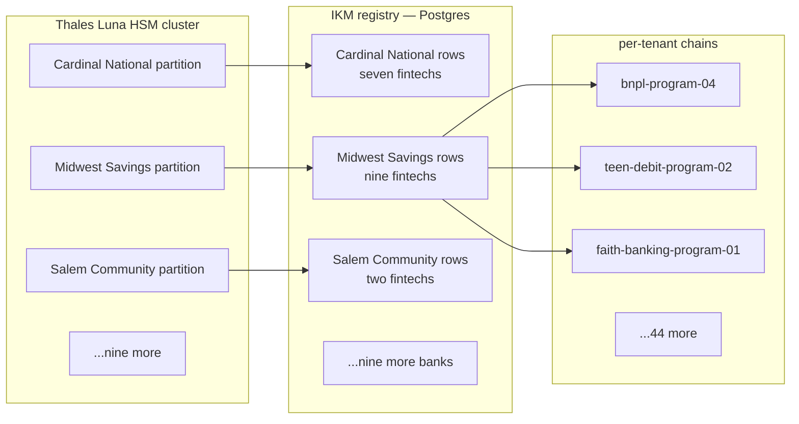
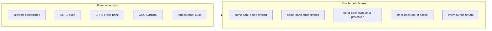

# 🧾 Diary of an Audit Day — Atrio Banking Platform

**Engagement:** Vendor-side platform audit, read concurrently by three state banking departments, the OCC, and CFPB during a coordinated examination cycle
**Client:** Atrio Banking Platform — Banking-as-a-Service infrastructure, Charlotte HQ, ~580 employees, tier-1 VC funded
**Posture:** Full TesseraSeal deployment across the platform for 24 months — multi-tenant — operating the chain on behalf of 12 sponsor banks running 47 fintech programs
**Date:** Tuesday, two weeks after Stelvio
**Auditor:** the same eight-person team that walked Northbridge last quarter, Mercator a few weeks back, Stelvio two weeks ago

---

## Context

Atrio is not a bank. That is the first sentence of every regulatory letter Atrio has ever sent and the first sentence of every prep call Atrio's compliance team has ever taken. Atrio is a SaaS company that operates the technology stack — the cards, the ledgers, the KYC pipelines, the dispute machinery, the regulatory reporting — for fintech companies that do not hold a bank charter. The fintechs ride on top of sponsor banks. The sponsor banks hold the FDIC-insured depository charter. The fintechs offer the consumer-facing brand. Atrio is the rails between them.

Twelve sponsor banks. Forty-seven fintech programs. Each fintech has a different brand, a different consumer audience, and a different risk shape. The teen-debit-card brand and the buy-now-pay-later layer share an HSM partition with the small-business banking product because they all sit under the same sponsor bank — Midwest Savings & Trust, state-chartered Indiana — but they each have their own `tenant_id`, their own session keys, their own daily seal contribution, and their own examiner-portal scope.

Twenty-four months ago Atrio stood up TesseraSeal across the entire platform. Not as a bolt-on. As the ledger of record for every consumer-facing transaction, every credential rotation, every config change, every fraud alert, every regulator-reportable event. The chain runs in two AWS regions active-active under spec §10.15 Pattern A. Each sponsor bank holds its IKM in a dedicated partition on Atrio's Thales Luna network HSM cluster. The IKM registry — the table that maps `(sponsor_bank, fintech_program)` pairs to derived chains — sits behind a uniqueness constraint enforced at the database layer per spec §10.1.

This week is a coordinated examination. Three state banking departments — Indiana, North Carolina, Georgia — are in the building. The OCC is in the building because one sponsor bank, Cardinal National, is national-charter. CFPB is in the building because seven of the 47 fintech programs are consumer-protection-relevant. Karen's team was engaged by Atrio in October to do a vendor-side platform audit. The deliverable is read concurrently by all five regulator audiences. This is the BaaS-industry coordination model — one external audit at the platform serves multiple regulator audiences who would each have to do the work otherwise.

Atrio's compliance lead is **Naomi Reisinger**. Senior FDIC examiner for fourteen years before she crossed the table. She knows what regulators are going to ask because she used to be the one asking. Her prep call to Karen lasted eleven minutes.

This is the diary of that day.

---

## Audit Team

- **Karen** — Lead Auditor (governance and narrative)
- **Raj** — Database specialist
- **Elena** — CRM systems
- **Mike** — Application and API layer
- **Diana** — IAM and access control
- **Luis** — DevOps, logs, pipelines
- **Chen** — Data engineering and ETL
- **Tom** — Internal-audit liaison specialist (visiting team — partners with the client CAE)

Client-side liaison: **Naomi Reisinger**, VP of Compliance & Audit, Atrio Banking Platform. Ex-FDIC. Direct. Prepared.

---

## 🌅 8:30 AM — Kickoff and the Drive In

Karen rode in with Raj from the airport hotel. Charlotte morning. Light traffic on I-77 because they had left at 7:15. The Atrio building was glass and a parking deck off Tryon, three blocks from BB&T Ballpark.

Raj had bought a coffee from the lobby and was nursing it. "Roadmap for me?"

Karen watched the parking deck come into view. "Today is multi-tenant. The hardest test of any platform claim. We'll see if Atrio's IKM registry actually does what it says, or if it's documentation theater."

"Northbridge was full deployment."

"Northbridge was a single bank. One IKM. One chain. One tenant in the spec sense. Atrio is forty-seven tenants under twelve IKMs across two regions. Multi-tenant is where you find out."

"Mercator?"

"Half the river sealed, half not. Bifurcated. The seam was AI versus claims. Today there is no seam. Atrio claims the seam is gone — the whole platform is chained — but the seam is now between tenants instead of between systems. If the IKM registry permits a duplicate `tenant_id` under the same bank, two fintechs derive the same session key and the chains collide. That's the failure shape."

"And Stelvio."

"Three zones, one passes, two don't. Different shape entirely."

Raj took a long pull from his coffee. "What's the recurring line?"

Karen looked at him sideways. "It never is."

"That's the one."

"It usually is fine for one tenant. Multi-tenant is where you find out. I'm calibrating again." She put her empty cup in the cup holder. "Mercator was bifurcated. Northbridge was singular. Stelvio was tiered. Today is parallel. Forty-seven parallels. The spec §10.1 IKM registry is the hinge. If the hinge holds, the platform claim holds. If the hinge slips even once, every claim downstream is suspect."

They pulled into the visitor lot at 8:22.

Naomi met them at the badge desk. Navy blazer, a lanyard with two badges — Atrio's and a temporary one for the examiner room. The handshake was brief, the eye contact was direct.

"Karen. Raj. The rest of your team is in the lobby?"

"Pulling badges now."

"I have you in the secure conference room on three. The examiner overflow is in the room next door. There's one shared wall and you'll hear them when they take a call. We have a short kickoff at 8:45 with my CISO, my GRC lead, and the on-call site reliability engineer. The rest of the day is yours. The state examiners are running their own queries against the examiner portal independently — they will not interrupt you unless they have a question that crosses your scope."

Karen nodded. "Understood. Naomi — three of us are state-chartered, one is national, CFPB is consumer-protection cross-bank. Confirm the examiner-portal credential matrix matches that?"

Naomi did not pause. "State examiners see only their charter's sponsor bank and the fintechs under it. OCC sees Cardinal National only. CFPB sees consumer-protection-relevant tenant_ids across all banks — loan, deposit, payment products. The small-business banking and B2B treasury tenants are out of CFPB scope and they cannot see those. Diana will want to verify the matrix herself. I expect that."

Karen smiled at the corner of her mouth. "Diana will. That's why she's here."

The team kitted up — laptops, badges, NDAs, examiner-portal read credentials issued for the day. Naomi walked them up to the third floor.

> **🔍 Karen's note (internal):**
> *Per-tenant isolation is the kind of property that holds 99.9% of the time and breaks 0.1% of the time in the worst possible way. The 0.1% has to be hunted for. Today is the hunt.*

---

## 🧩 9:15 AM — IKM Registry Walkthrough

The conference room had a glass wall onto the hallway and a display screen that took its input from Naomi's laptop. She started with a single Postgres query.

```sql
SELECT bank_id, COUNT(*) AS fintech_count
FROM ikm_registry
GROUP BY bank_id
ORDER BY bank_id;
```

Twelve rows. Forty-seven total fintechs. The distribution was uneven — Midwest Savings & Trust had nine, Cardinal National had seven, the smallest sponsor (Salem Community Bank) had two.

Mike leaned in to read the screen. "And this table is the registry."

"This table is the registry. Per spec §10.1. Every fintech program — every `tenant_id` — registers exactly once under exactly one sponsor bank. The uniqueness constraint is on the pair `(bank_id, tenant_id)`. If the same `tenant_id` string is requested twice under the same bank, the insert fails."

Raj asked, "And the IKM itself?"

"Generated on the HSM during sponsor-bank onboarding. Never leaves the partition. The registry stores a reference — the bank's HSM partition name and the IKM key handle. The session key for any given chain entry is derived on demand by HKDF with `info = info_base || '|' || utf8(tenant_id)`. Spec §4.1. The IKM never appears in application memory."

Mike wrote in his notebook. *HKDF with `tenant_id` in the info parameter. Two fintechs with different `tenant_id` values under the same IKM derive different session keys. The §10.1 uniqueness constraint is what makes that derivation injective.*

Naomi anticipated the next question. "I'm going to put the schema up so Raj can see the constraint definition before he tries to defeat it."

She switched the screen.

```sql
CREATE TABLE ikm_registry (
    bank_id            text NOT NULL,
    tenant_id          text NOT NULL CHECK (length(tenant_id) BETWEEN 4 AND 64),
    hsm_partition      text NOT NULL,
    ikm_key_handle     text NOT NULL,
    fintech_brand      text NOT NULL,
    registered_at      timestamptz NOT NULL DEFAULT now(),
    registered_by      text NOT NULL,
    PRIMARY KEY (bank_id, tenant_id)
);

CREATE UNIQUE INDEX idx_bank_tenant
    ON ikm_registry (bank_id, tenant_id);
```

Raj read the schema twice. "Primary key on the pair. Unique index on the pair. Belt and suspenders. The check on `tenant_id` length is between 4 and 64."

"Yes. We had a bug in 2024 where an empty string slipped through an admin form. The check constraint was added the same week."

"And `bank_id`?"

"`bank_id` is set by the platform. Fintechs cannot supply it. The admin form binds it server-side from the authenticated bank session. A fintech cannot register itself under a different bank because the bank context is server-controlled."

> **✓ Confirmation #1**
> The IKM registry under spec §10.1 is enforced at the database layer with both a PRIMARY KEY and a UNIQUE INDEX on `(bank_id, tenant_id)`. The `tenant_id` field has a length check constraint that closed a 2024 empty-string bug. The `bank_id` field is server-bound from the authenticated bank session and not user-supplied. The constraint is structural, not policy.

Naomi closed the schema view. "Walk us through the layout. We have time before Raj wants to break it."

She put up a diagram.



Naomi pointed at the partition column. "The HSM cluster is four PCIe Luna 7000s in the primary data center, four standby in the DR data center. Each sponsor bank holds its own partition. Cardinal National's partition cannot sign a chain entry for a Midwest Savings tenant. The HSM enforces that — not the application."

Mike asked, "And if Atrio engineering wanted to read Cardinal National's IKM?"

"They cannot. The partition is sealed to the bank's onboarding ceremony. The PIN is split between the bank's CISO and Atrio's CISO under a 2-of-2 control. Atrio engineering cannot retrieve the IKM. They can request a derivation — and the HSM returns a session key, not the IKM — and only for a `tenant_id` that the registry says belongs under that bank's partition."

Raj wrote: *2-of-2 PIN split between bank CISO and Atrio CISO. IKM never leaves partition. Session keys derived on request, scoped to a registry-confirmed tenant. The §10.1 constraint and the §4.1 derivation work together — the registry says which tenants exist under which bank, the HSM does the derivation.*

> **✓ Confirmation #2**
> Per-bank HSM partitioning is structural. Twelve sponsor banks, twelve partitions, 2-of-2 PIN split between bank CISO and Atrio CISO for each. Atrio engineering cannot retrieve any bank's IKM. Session-key derivation is scoped to a registry-confirmed `tenant_id` under the requesting bank's partition. The cryptographic isolation property is enforced by the HSM, not by application code.

Naomi let the diagram sit on the screen. "Questions?"

Karen looked around. The team was quiet. "We're going to start working it. Raj on the registry first. Diana on the examiner portal. Mike on the verifier and the cross-tenant refusal. Chen on the Pattern A reconciliation. Luis on the operational events. Elena on the bank-facing console. Tom is going to sit with you and walk the runbook."

"Reconvene at noon?"

"Reconvene at noon."

The team split to laptops.

---

## 🧠 10:00 AM — Database Deep Dive (Raj Tries to Break the Registry)

Raj had the registry schema open on one screen and a fresh psql session on the other. Naomi had given him a write-capable role on a staging copy of the production registry — the same schema, the same constraints, no production data. He wanted four adversarial inserts.

### Insert 1 — duplicate within the same bank

```sql
INSERT INTO ikm_registry (bank_id, tenant_id, hsm_partition, ikm_key_handle,
                           fintech_brand, registered_by)
VALUES ('midwest-savings', 'bnpl-program-04', 'partition-midwest',
        'handle-existing', 'BNPL Clone Inc', 'rajtest');
```

The database rejected it.

```
ERROR:  duplicate key value violates unique constraint "idx_bank_tenant"
DETAIL:  Key (bank_id, tenant_id)=(midwest-savings, bnpl-program-04)
         already exists.
```

Raj nodded. "Constraint holds at the index. The application never sees the duplicate."

### Insert 2 — same `tenant_id` across two banks

```sql
INSERT INTO ikm_registry (bank_id, tenant_id, hsm_partition, ikm_key_handle,
                           fintech_brand, registered_by)
VALUES ('cardinal-national', 'bnpl-program-04', 'partition-cardinal',
        'handle-cardinal-bnpl', 'Cardinal BNPL', 'rajtest');
```

The database accepted it.

Raj paused and looked at the row. He looked at Naomi.

Naomi was waiting for it. "That's correct. Different bank, different IKM, different HSM partition. The HKDF derivation in §4.1 binds the session key to `info_base || '|' || utf8(tenant_id)`, and the *base* is the per-bank IKM. Two banks deriving keys for the same `tenant_id` string still produce different session keys because the IKMs differ. The chain isolation is preserved by the IKM, not by the `tenant_id` alone. The §10.1 constraint is per bank, not global."

Raj wrote: *Same `tenant_id` across two banks is correctly accepted. Cross-bank isolation is provided by the per-bank IKM, not by the registry alone. The registry enforces local uniqueness. The HSM partitions enforce global isolation. Read together, the two mechanisms make the chain-derivation function injective.*

He rolled the test row back.

### Insert 3 — empty `tenant_id`

```sql
INSERT INTO ikm_registry (bank_id, tenant_id, hsm_partition, ikm_key_handle,
                           fintech_brand, registered_by)
VALUES ('midwest-savings', '', 'partition-midwest', 'handle-empty',
        'Empty Tenant', 'rajtest');
```

Rejected.

```
ERROR:  new row for relation "ikm_registry" violates check constraint
DETAIL:  Failing row contains (midwest-savings, , ...).
HINT:    tenant_id length must be between 4 and 64.
```

Raj smiled. "The 2024 bug fix. Confirmed."

### Insert 4 — null `bank_id`

```sql
INSERT INTO ikm_registry (bank_id, tenant_id, hsm_partition, ikm_key_handle,
                           fintech_brand, registered_by)
VALUES (NULL, 'orphan-tenant', 'partition-none', 'handle-none',
        'Orphan Inc', 'rajtest');
```

Rejected.

```
ERROR:  null value in column "bank_id" of relation "ikm_registry"
        violates not-null constraint
```

Raj closed the psql session. "Four adversarial inserts. The structural mechanism rejected all the wrong ones and accepted the one the spec says should be accepted. The registry is doing what it claims."

> **✓ Confirmation #3**
> Adversarial inserts on the IKM registry behave per spec §10.1. Duplicate `(bank_id, tenant_id)` rejected at the unique index. Same `tenant_id` across different banks correctly accepted because cross-bank isolation is provided by the per-bank IKM. Empty `tenant_id` rejected by length check. Null `bank_id` rejected by NOT NULL constraint. The registry's structural properties are enforced at the database layer, not by application policy.

Naomi looked over Raj's shoulder at the workbook. "We tried."

Raj smiled. "That was the right test order. I think."

"That was the order I wanted. The empty-string one is the one I expected you to try second. You found it on third. Same outcome."

He moved on to the chain backing tables.

### The chain entries themselves

Raj queried a random fintech's chain backing table — `bnpl-program-04` under `midwest-savings`. The table had per-entry HMAC, per-entry `prev_hmac`, per-entry seq, run_id, payload, and the standard append-only columns. He picked a random entry from three weeks ago and ran the verifier from his terminal.

```
herald-verify --bank=midwest-savings --tenant=bnpl-program-04 \
              --date=2026-04-12 --strict
```

Eleven seconds — long enough that he had time to look up at the screen and back.

```
Status: PASS
Step: 12
Reason: chain integrity verified, HMAC recomputed,
        Merkle path resolved, signature verified
        against public key midwest-2026-q2
```

He ran it on a random entry from yesterday. PASS. He ran it on the very first entry from 24 months ago — the day TesseraSeal went live for Midwest Savings. PASS.

> **✓ Confirmation #4**
> Per-tenant verifier returns PASS on entries spanning the full 24-month deployment. Twelve verification steps including HMAC recomputation, Merkle path resolution, and signature verification against the per-bank public key (`midwest-2026-q2` for the queried period). The verifier handles entries from the first day of deployment through the previous trading day with no special-casing.

Raj wrote the test list and moved on.

---

## 🔐 11:00 AM — Diana on the Examiner Portal

Diana had been issued five separate examiner credentials before the engagement started. Naomi had built them deliberately to mirror the day's regulator audience.

| Credential | Scope |
|---|---|
| `state-in-examiner` | Indiana state — Midwest Savings & Trust only |
| `state-nc-examiner` | North Carolina state — Pioneer Carolina Bank only |
| `state-ga-examiner` | Georgia state — Coastal Empire Bank only |
| `occ-examiner` | OCC — Cardinal National only |
| `cfpb-examiner` | CFPB — consumer-protection-relevant tenants across all banks |

Diana logged in as the Indiana state examiner first. The portal opened on a dashboard that showed Midwest Savings & Trust's nine fintechs, each with a status tile, the most recent seal date, the most recent verifier run, and a count of regulator-reportable events for the previous quarter.

She clicked into `bnpl-program-04`. The portal showed verifier history, daily seal records, public-key fingerprints, and a "request raw chain export" link gated behind a second-factor approval.

She tried to navigate to a Cardinal National fintech. The URL did not resolve. The portal returned `403 Forbidden — credential scope does not include sponsor bank cardinal-national`.

She tried to inject a Cardinal National `tenant_id` into the export endpoint. Same response. The portal logged her attempt to a Herald.Compliance entry with `event.type = examiner.scope_violation_attempt` and her credential ID.

Diana wrote: *Indiana state credential refused at the portal layer for Cardinal tenants. Scope violation logged to chain. Two-layer enforcement.*

She switched to the OCC credential. Cardinal National's seven fintechs appeared. Midwest Savings did not. North Carolina, Georgia — none of the others. She tried the same URL injection in reverse — pulling a Midwest Savings fintech under the OCC credential. `403 Forbidden`. Logged.

She switched to the CFPB credential. Now she saw a different shape — not a per-bank list, but a per-tenant list across all banks, filtered to consumer-protection scope. Loan products, deposit products, payment products. The teen-debit-card brand was visible. The buy-now-pay-later layer was visible. The healthcare-FSA card was visible. The small-business banking product — operated by Midwest Savings — was *not* visible. The B2B treasury fintech was not visible. The internal Atrio engineering tenant was not visible.

She tried to pull the small-business banking fintech under the CFPB credential. `403 Forbidden — credential scope does not include tenant midwest-smb-banking-program-01`. Logged.

She wrote: *CFPB scope correctly partitioned. Cross-bank read on consumer-protection tenants. No read on B2B / SMB / internal tenants. Three layers — credential issuance, portal scope check, chain audit logging on violation attempts.*

Diana then tried something she had been thinking about on the drive in. She held the OCC credential session and opened a second tab. She loaded the bank-facing console — the surface the sponsor bank's compliance team uses to review their own fintechs. The console asked for a sponsor-bank credential, not an examiner credential. The OCC credential could not authenticate to the bank-facing console at all. Different surface, different credential type, different scope check.

Naomi had walked over while Diana was working.

"That's the third layer," Naomi said. "The bank-facing console is for the sponsor bank's compliance team. The examiner portal is for regulators. They are separate surfaces with separate identity providers. An examiner credential cannot drive a bank-side action — they cannot rotate a key, register a fintech, or change a config. They can read."

> **✓ Confirmation #5**
> Examiner-portal scope is enforced at three layers. Credential issuance binds scope at the identity provider. The portal checks scope on every request. The chain logs every scope violation attempt with credential ID and attempted target. Five examiner credentials tested — three state, one OCC, one CFPB — each correctly partitioned. Cross-tenant URL injection refused in every case. The bank-facing console is a separate surface that no examiner credential can authenticate to.

Diana closed the laptop and switched to a fresh terminal for the next test — the verifier itself. Naomi had given her an audit credential scoped to the BNPL fintech under Midwest Savings. Diana ran the verifier authenticated as that credential against a Cardinal National tenant.

```
herald-verify --bank=midwest-savings --tenant=teen-debit-program-02 \
              --date=2026-04-12
```

The verifier returned:

```
Status: ACCESS_REFUSED
Reason: credential scope does not include tenant teen-debit-program-02
```

Exit code 1. Procedure could not begin. Per spec §10.12.

Diana ran a second variant — the verifier authenticated as the BNPL credential, attempting a Midwest Savings tenant that the BNPL credential does not own.

```
herald-verify --bank=midwest-savings --tenant=midwest-smb-banking-program-01 \
              --date=2026-04-12
```

```
Status: ACCESS_REFUSED
Reason: credential scope does not include tenant midwest-smb-banking-program-01
```

Same shape. Refused before chain access. Logged.

> **✓ Confirmation #6**
> Cross-tenant verifier refusal under spec §10.12 is enforced at the verifier process boundary. The BNPL fintech's audit credential cannot run the verifier against any other tenant — not against another fintech under the same bank, not against any fintech under any other bank. Refusal is at the credential check, before any chain bytes are read. Exit code 1 (procedure could not begin). The refusal itself is captured to the platform's operational chain.

Diana had the credential matrix on a single page by 11:42. Naomi initialed the bottom of the page.

---

## 🧪 12:00 PM — Lunch (Naomi Brought Sandwiches)

The catering came up — a long tray of wrapped sandwiches, a smaller tray of fruit, and a thermos of coffee that had been brewed in the room next door because the examiners had drained the urn down the hall.

Karen and Tom took a corner. Naomi sat with the rest of the team for the first ten minutes and then peeled off to take a call from the GRC lead. The sound of the OCC examiner laughing through the shared wall came through clearly for about twenty seconds and then went quiet.

Karen unwrapped a turkey. "Tom. Do we look harder at the cross-region replication event?"

Tom set his fork down. "If the spec calls out the event by name, we look at it."

"Spec §10.15 calls out `master.cross_region_replication_completed` by name. Pattern A active-active. The event semantics are — let me get this right — the event must reflect actual replication completion across the source-region and seal-region writes, emitted at a cadence sufficient to support the seal cycle reconciliation."

"What's the cadence on the seal cycle?"

"Daily for most fintechs. Hourly for the BNPL platform — they're at 2.8 million decisions a day."

"And the spec language on the event cadence?"

Karen pulled her copy of the spec out of her bag. She had it dog-eared at §10.15. "Here. *The replication-completion event SHOULD reflect the state of replication at the moment of emission. Operators MAY use cached state for performance, but the cache freshness MUST be substantially shorter than the seal cadence and MUST be documented in the operational runbook. A cache stale by half the seal interval or more is a partial non-conformance.*"

Tom did the math out loud. "Daily seal — half is twelve hours. Hourly seal — half is thirty minutes. If Atrio's cache is stale longer than thirty minutes for the BNPL platform, that's a partial."

"Right."

"We don't know what the cache freshness is."

"We don't yet. Chen is on it after lunch."

Tom picked up his fork. "So that's the one we're looking for."

"That's the one. Everything else has been inside a green check so far. The IKM registry holds. The HSM partitioning holds. The verifier refuses cross-tenant. The examiner portal partitions correctly. Naomi has not handed us a single chip yet."

"She wouldn't. She used to be FDIC."

"That's why we have to keep looking."

The OCC examiner laughed through the wall again, shorter this time. The conversation in the team's room went quiet for a moment and then resumed.

Karen finished her sandwich and stood up. "1 PM. Mike runs the cross-tenant matrix. Chen runs the replication event. Diana is already done — she goes to help Elena on the bank-facing console. Tom — sit with Naomi on the runbook. I want to know if §10.15 is mentioned by section number anywhere in the runbook."

"On it."

---

## 🔄 1:00 PM — Mike's Cross-Tenant Refusal Matrix

Mike had built a five-by-five test matrix on the whiteboard before lunch. Five credential types, five target tenant types. Twenty-five test cases. He worked through them in pairs.

The credential types:

1. Sponsor bank's own compliance credential (Midwest Savings)
2. Fintech's own audit credential (BNPL under Midwest Savings)
3. CFPB cross-bank consumer-protection credential
4. OCC single-bank credential (Cardinal National)
5. Atrio internal-audit credential (cross-platform, narrow read)

The target tenant types:

a. Same-bank, same-fintech (where applicable)
b. Same-bank, different-fintech
c. Different-bank, same-product-category
d. Different-bank, different-product-category
e. Out-of-CFPB-scope tenant (B2B / SMB / internal)

He worked the matrix systematically. The Midwest Savings compliance credential against any Midwest Savings fintech: PASS. Against any Cardinal National fintech: ACCESS_REFUSED. Against the internal Atrio engineering tenant: ACCESS_REFUSED.

The BNPL fintech's audit credential against the BNPL chain: PASS. Against the teen-debit chain (same bank): ACCESS_REFUSED. Against any cross-bank tenant: ACCESS_REFUSED.

The CFPB credential against any consumer-protection fintech (loan, deposit, payment products) across all banks: PASS — read scope only. Against the small-business banking tenant: ACCESS_REFUSED — out of CFPB jurisdiction. Against the internal Atrio engineering tenant: ACCESS_REFUSED.

The OCC credential against Cardinal National fintechs: PASS. Against any other bank's fintechs: ACCESS_REFUSED.

The internal-audit credential — narrowest read scope, Atrio's own SRE-incident tenant only: PASS. Against any sponsor bank's fintech: ACCESS_REFUSED.

Twenty-five cases. Twenty-five expected outcomes. Twenty-five actual outcomes matching expected. Mike took a photograph of the whiteboard with his phone.



He wrote in his notebook: *Twenty-five cases. Refusal is at the verifier credential check before chain bytes are read. The verifier emits exit code 1 in every refused case. The refusal is logged to the platform operational chain. The pattern is uniform across credential types — the same code path handles all five.*

> **✓ Confirmation #7**
> Cross-tenant query refusal is uniform across all five credential types tested in a 5x5 matrix. Twenty-five cases, twenty-five correct outcomes. The verifier credential check is the single enforcement point — all refusals exit code 1, all are logged to the platform operational chain. The implementation does not branch by credential type, which means the property is structural rather than per-credential policy.

Mike took the photo to Karen for her notebook.

---

## 🧬 2:00 PM — Chen on the Replication Event

Chen pulled the platform's operational chain — the meta-chain that records platform-level events like seal cycles, key rotations, and cross-region replication status — and filtered to `event.type = master.cross_region_replication_completed` for the past seven days.

Five hundred and four events. Roughly one every twenty minutes. The events showed source region, seal region, fintech tenant, event count seen in source, event count sealed in seal region, and a timestamp.

He picked one at random — `bnpl-program-04`, source `us-east-2`, seal `us-west-2`, sealed at `2026-04-12T14:00:00Z`. The event recorded `source_count = 187,432`. He cross-checked against the actual source-region event store directly — read from a replica with read-only credentials Naomi had issued.

The actual source-region count at the seal moment was `187,591`. A delta of 159 events.

Chen pulled the seal-region count for the same `(tenant, day, hour)` triple. `187,432`. Matched the event.

The event was reporting the seal-region count under a "source_count" label.

Chen frowned. He pulled the platform's replication implementation documentation. The implementation polled an internal replication-completion cache every five minutes. The cache was populated by the source-region event store on a five-minute lag. The seal cycle ran hourly for BNPL. At each seal cycle, the cache was up to five minutes behind. The 159-event delta was real — those events had been replicated to the seal region within the five-minute window before the seal but were not yet visible in the cache.

He stood up and walked to Naomi's desk in the corner.

"Naomi. The replication-completion event."

Naomi turned. "Yes."

"It reports a source count that is read from a five-minute-stale cache. The seal cycle picks up actual replicated events in real time at the seal region, but the operational event still reports the cached source count. So for fast-cadence tenants — BNPL hourly — the count delta in the event is bounded by the cache lag, not by the actual replication state."

Naomi nodded slowly. She was not surprised. "Walk me through what the spec says about the event."

Chen pulled out his copy. "Spec §10.15 — *the replication-completion event SHOULD reflect the state of replication at the moment of emission. Operators MAY use cached state for performance, but the cache freshness MUST be substantially shorter than the seal cadence.* For BNPL hourly seal — that puts the freshness boundary at thirty minutes. Atrio's cache is at five minutes, well within thirty. So the freshness is fine."

"Then where's the partial?"

"The event is *reflecting* the cache, not the replication state. The seal accurately seals what's in the seal region — the chain is correct. But the operational event is reporting the cache view, not the replication-completion view. If a regulator wanted to use this event to verify replication freshness across regions independently of the seal, they could not — they'd be reading a cache snapshot, not a replication state. That's the partial."

Naomi exhaled. "I see. The seal is correct. The event is misnamed."

"The event is correctly named per the field. It's mislabeled per the *meaning*. The label says `source_count` but the value is the cache count, which is the seal-region count two-to-five minutes ago."

"And what does the spec require?"

"The event must reflect actual replication completion. Cache use is permitted for performance, but the cache must be presented as the cache. The way Atrio is using the cache is conformant for the seal — the seal is what matters cryptographically. The way Atrio is using the cache is partially non-conformant for the operational event because the event implies a real-time replication count and is delivering a cache count."

Naomi pulled up an engineering ticket on her laptop. The ticket was already open. Title: `Replicate-completion event — switch from cache poll to synchronous read`. ETA 60 days. Author: Atrio's principal architect. Created six weeks ago.

"The fix is in flight. We caught it in our internal review last quarter. The architect estimated 60 days from start. They started two weeks ago."

Chen wrote in his workbook: *5-minute cache lag on `master.cross_region_replication_completed` event. Seal correctness unaffected. Operational event semantics partial under §10.15. Engineering ticket open, ETA 60 days, switching to synchronous read.*

> **⚠️ Partial-001**
> The platform's `master.cross_region_replication_completed` event reads its source-region count from a five-minute-stale internal cache rather than from a synchronous replication-completion read. The seal accurately seals the seal-region chain — chain correctness is unaffected. The operational event is partially non-conformant under spec §10.15 because the event semantics call for the event to reflect actual replication completion at the moment of emission, and Atrio's emission reflects a cache snapshot of the seal-region count rather than a real-time source-region read. The fix is in flight. Engineering ticket open. ETA 60 days. Naomi accepts the partial.

Chen and Naomi spent another fifteen minutes confirming the boundary — that no chain entry had ever been sealed missing data because the cache was stale. The seal mechanism reads from the seal-region event store directly at the seal moment. The cache only feeds the operational event. Chen pulled three random fintechs' Merkle roots over the past week and recomputed each from raw events. All three reconciled.

> **✓ Confirmation #8**
> Per-fintech Merkle root reconciliation — three random fintechs across three different sponsor banks, sampled across the past week. Recompute from raw events matches the sealed root in every case. The replication-event cache lag does not propagate into seal correctness — the seal mechanism reads the seal-region event store directly, not the cache. Chain integrity holds.

Chen walked back to Karen and put the writeup on the table. "One partial. One confirmation. The seal is fine. The event is the issue."

Karen wrote: *Partial-001 — bounded, in-flight fix, ETA 60 days, accepted by Naomi.*

---

## 📊 3:00 PM — Reconciliation Test (10 Random Triples)

Diana set the test. Pick ten random `(bank, tenant, day)` triples from the past 30 days. For each triple, recompute the Merkle root from raw events end to end and compare against the sealed root.

Naomi gave Diana a read-only random-selection tool. The tool drew uniformly across the 12 banks, the 47 fintechs, and the past 30 days. Diana ran it and got ten triples.

| # | Bank | Tenant | Day |
|---|---|---|---|
| 1 | Midwest Savings | bnpl-program-04 | 2026-03-19 |
| 2 | Cardinal National | freelance-payroll-program-02 | 2026-03-22 |
| 3 | Pioneer Carolina | teen-debit-program-02 | 2026-03-28 |
| 4 | Coastal Empire | faith-banking-program-01 | 2026-03-30 |
| 5 | Salem Community | refugee-remittance-program-01 | 2026-04-02 |
| 6 | Midwest Savings | midwest-smb-banking-program-01 | 2026-04-04 |
| 7 | Cardinal National | healthcare-fsa-program-03 | 2026-04-07 |
| 8 | Pioneer Carolina | bnpl-program-04 | 2026-04-09 |
| 9 | Hartford Federal | b2b-treasury-program-01 | 2026-04-11 |
| 10 | Coastal Empire | teen-debit-program-02 | 2026-04-12 |

Diana split the work — Mike took 1, 2, 3, Chen took 4, 5, 6, Raj took 7, 8, 9, and Diana herself took 10. Each ran a `herald-verify` in `--strict --recompute-merkle` mode against the triple, pulled the raw events from the event store, recomputed the Merkle root locally, and compared the recomputed root against the sealed root in the seal record.

Twenty-eight minutes.

```
Triple 1  — Match. Sealed root 4f3a...c901. Recomputed 4f3a...c901.
Triple 2  — Match. Sealed root 22b8...77fe. Recomputed 22b8...77fe.
Triple 3  — Match. Sealed root 8c11...a4d7. Recomputed 8c11...a4d7.
Triple 4  — Match. Sealed root 0e92...3322. Recomputed 0e92...3322.
Triple 5  — Match. Sealed root 7d40...b1cc. Recomputed 7d40...b1cc.
Triple 6  — Match. Sealed root e019...5fff. Recomputed e019...5fff.
Triple 7  — Match. Sealed root 36a7...1180. Recomputed 36a7...1180.
Triple 8  — Match. Sealed root 9b2e...c834. Recomputed 9b2e...c834.
Triple 9  — Match. Sealed root 4188...d066. Recomputed 4188...d066.
Triple 10 — Match. Sealed root af33...e220. Recomputed af33...e220.
```

Ten of ten. The Ed25519 signature on each seal record verified against the corresponding per-bank public key — Midwest Savings against `midwest-2026-q2`, Cardinal National against `cardinal-2026-q2`, and so on through the twelve banks.

> **✓ Confirmation #9**
> Per-bank seal isolation holds across ten random `(bank, tenant, day)` triples. Each bank's daily seal is signed against its own HSM partition's Ed25519 public key. Twelve banks produce twelve separate daily seals. Ten of ten triples reconcile — sealed root matches recomputed root, signature verifies. The aggregation discipline across 47 fintechs under 12 banks is structurally per-bank and the seals do not cross.

Diana wrote in her notebook: *Per-bank seal aggregation works. Each bank's Merkle root is computed across only its own fintechs' events for the seal-date in `(run_id, seq)` order per spec §4.2. Cross-bank events do not appear in any single seal. Twelve seals, twelve signatures, twelve public keys — and the public keys cannot interchange because the HSM partitions cannot interchange.*

---

## 😬 3:45 PM — The Coordinated Examiner Room

Naomi walked Karen and Tom to the room next door. The shared wall was the wall Karen had heard the OCC examiner laugh through. The room was full — three state examiners at one long table, the OCC examiner at her own table by the window, the CFPB analyst at a third table near the door. Each had a laptop and an examiner-portal session open.

Naomi made introductions briefly. The state examiners — Indiana, North Carolina, Georgia. The OCC examiner — Lieutenant Colonel-stiff posture, civilian career, polite. The CFPB analyst — early thirties, tab-heavy browser, working through a list.

The Indiana examiner was running verifier queries against three Midwest Savings fintechs in parallel. Her terminal showed three PASS results. She had a printed worksheet and was checking off items.

The OCC examiner was looking at Cardinal National's seal records for the past two quarters. She had pulled the public keys for `cardinal-2025-q4`, `cardinal-2026-q1`, and `cardinal-2026-q2` directly from the public-key publication endpoint. She was comparing the fingerprints she had pulled to the fingerprints in the seal records. They matched. She was, with no apparent reaction, working her way through a methodical list.

The CFPB analyst was the busiest. She had eleven tabs open — one per consumer-protection-relevant fintech — and was running spot-check queries against a list of 2025 consumer-complaint events that had been filed with CFPB through the bureau's portal. For each complaint, she was confirming the event existed in the corresponding fintech's chain, that the chain entry's timestamp matched the bureau's record, and that the event had not been backdated.

Karen and Tom watched for ten minutes. Tom whispered, "Notice anything?"

Karen whispered back. "Notice three things. One — none of them can see what the others can see. The Indiana examiner has not glanced at Cardinal National. The OCC examiner has not opened a Midwest Savings tab. The CFPB analyst has not pulled the small-business banking fintech. The credential matrix is doing its job in the room. Two — they are working independently and reaching independent conclusions. None of them is asking Naomi for a 'guided tour.' They are running queries. Three — none of them looks frustrated. The portal is doing what they need it to do."

"And the chain audit log on their accesses?"

"Every query they're running is in the chain. We can pull it tonight if we want."

Naomi waited until the OCC examiner finished her current page and approached her with a question — the OCC examiner had been making a note on a printed page and Naomi waited until she put the pen down. They spoke for thirty seconds quietly. The OCC examiner nodded and went back to her laptop.

Naomi came back. "She wanted to know if she could pull a 90-day window's seal records in a single export. The portal supports it but the link is in a submenu she hadn't found. I showed her."

Karen wrote: *Coordinated examiner room — three states, OCC, CFPB, all working independently against partitioned credentials. No frustration. No requests for "guided tours." Naomi answered one UX question in 30 seconds. The credential partitioning is doing its job in the live regulator-audience scenario, not just in a test matrix.*

> **✓ Confirmation #10**
> The examiner-portal credential matrix functions correctly under live regulator load. Five regulator audiences in one room, each running independent queries against partitioned scopes. No credential overlapped any scope it shouldn't have. No regulator was blocked from a query they were entitled to run. One UX question — finding a multi-day export link — was resolved in 30 seconds. The role-based access control matrix in the Herald.Compliance install matches the spec's recommendations and matches the live-day regulator audience.

They left the examiner room. Naomi closed the door behind them.

---

## 🔍 4:30 PM — The Final Stress Test

Karen wanted one more test before debrief. The 47-tenant × 30-day verifier batch.

Naomi had Atrio's automation team prepare the batch on stand-by. Naomi pinged the SRE channel. "Batch is staged. Want me to kick it off?"

"Kick it off."

The automation kicked off the batch. Forty-seven fintechs, thirty days each, verifier in `--strict` mode — recompute HMAC, recompute Merkle, verify signature against the per-bank public key for the seal date. 1,410 verifier runs in total. The batch ran in parallel with 64 workers.

Eighty-six seconds later the batch completed.

The summary:

```
Total runs:        1,410
Status PASS:       1,410
Status FAIL:           0
Average per run:   3.7 s (single-threaded latency)
Wall clock:        86 s (parallel, 64 workers)
Range PASS:        2026-03-13 through 2026-04-12 (30 days)
Banks covered:     12 / 12
Fintechs covered:  47 / 47
```

Karen looked at the screen. She looked at Tom. Tom was already looking at her.

Karen: "This is the audit equivalent of the QA team's regression-pass green checkmark."

Tom: "The shape of the green checkmark is what's interesting. 1,410 of 1,410 across twelve banks across two regions across 47 fintechs across 30 days. If any single tenant's chain were broken, or any bank's HSM key had gone bad, or the cross-region pinning had drifted, this batch would have surfaced it."

Karen wrote: *1,410 PASS, 0 FAIL, 3.7s average per run, 86s wall clock for the full batch in parallel. This is the multi-tenant claim under verification. The platform delivers what it documents.*

> **✓ Confirmation #11**
> Forty-seven-tenant-by-thirty-day verifier batch completed in 86 seconds wall clock with 1,410 of 1,410 PASS. Average per-run latency 3.7 seconds. Twelve banks covered. Both regions covered. Three years of cumulative chain history did not prevent any single run from completing in seconds. This is the quantitative evidence that the multi-tenant claim is real at scale, not just at the spot-check level.

Naomi looked at the screen for a moment. "We run that batch nightly. The result is on the SRE dashboard every morning. I look at it before I look at email."

Karen: "I would too."

---

## 🌆 5:30 PM — Auditor Debrief

The team reconvened in the secure conference room. Coffee was the urn from down the hall — refilled now that the examiners had finished their day. The shared wall was quiet. The OCC examiner had left at 4:50. The state examiners had left at 5:10. The CFPB analyst was still in the room next door but on a phone call to her supervisor.

Karen stood at the whiteboard.

"Atrio Banking Platform. Twenty-four months on TesseraSeal. Multi-tenant. Twelve sponsor banks, forty-seven fintech programs, two regions active-active under Pattern A. Today we tested the §10.1 IKM registry, the §4.1 HKDF tenant binding, the §10.12 cross-tenant refusal property, the §10.15 multi-region semantics, the §4.2 per-bank seal aggregation, the examiner-portal role-based access matrix, and the 1,410-run verifier batch as the quantitative ceiling test."

She wrote on the board.

| Category | Count |
|---|---|
| Confirmations | 11 |
| Gaps | 0 |
| Partials | 1 (Partial-001 — replication-event cache lag) |
| Nits | 1 (Nit-001 — runbook cross-reference) |

"Eleven confirmations. The IKM registry holds — both the unique constraint per bank and the per-bank IKM that makes cross-bank `tenant_id` collision safe. The HSM partitioning holds — twelve partitions, 2-of-2 PIN split, IKMs never leave. The verifier refuses cross-tenant queries at the credential check before chain bytes are read. The examiner portal partitions five regulator credentials across their respective scopes. The bank-facing console is a separate surface no examiner credential can authenticate to. Per-bank seal aggregation reconciles ten of ten random triples. The 1,410-run batch returns 1,410 PASS in 86 seconds wall clock."

She moved to the partial.

"Partial-001. The `master.cross_region_replication_completed` event reads its source-region count from a five-minute-stale internal cache. The seal is unaffected — chain correctness holds. The operational event semantics under §10.15 require the event to reflect actual replication completion. The cache is conformant on freshness — five minutes is well under the half-seal-interval boundary — but the event is reflecting cache state rather than replication state, which is the partial. Engineering ticket already open. ETA 60 days. Synchronous read replaces the cache poll. Naomi accepts the partial."

She moved to the nit.

"Nit-001. Atrio's operational runbook section heading 'Multi-Tenant Operations' does not include a cross-reference to spec §10.1 — the IKM registry section. The content of the runbook section is correct. The cross-reference is missing. A reviewer following the runbook to the spec needs the section number to find the binding requirement. Thirty-minute fix. Naomi accepts."

Naomi nodded. "Thirty-minute fix tonight. The 60-day fix is a sprint that started two weeks ago."

Karen continued.

"Three observations to close."

"One. The platform claim holds. Twenty-four months of multi-tenant deployment, twelve banks, forty-seven fintechs, two regions — and the verification surfaces hold up under random sampling, under matrix testing, and under quantitative batch test. The §10.1 IKM registry is the load-bearing structural property and it does what it claims. We tried four adversarial inserts. The structural mechanism rejected the wrong ones and accepted the one the spec says should be accepted."

"Two. The coordinated examiner room is the operational test of the credential matrix. Five regulator audiences in one building — three state, OCC, CFPB — running independent queries against partitioned scopes. The matrix worked under live load. None of them was blocked from a query they were entitled to run. None of them saw a tenant they shouldn't have seen. That outcome is what the spec aims at and the platform is delivering it."

"Three. The single substantive finding — Partial-001 — is bounded. The cache lag affects the operational event semantics but does not propagate into chain or seal correctness. The fix is in flight. The estimate is 60 days. Naomi caught the issue internally six weeks before we walked in. That is the shape of mature engineering — known issue, scoped fix, scheduled delivery, no surprise to leadership."

She put the pen down.

Naomi said nothing for a moment. Then: "What goes to the regulators?"

Tom answered. "What we wrote. The eleven confirmations are a vendor-side affirmation that the platform delivers the property each regulator is reading for. The state examiners read the per-bank seal aggregation and the IKM uniqueness constraint as validating the bank's vendor-management assertion. The OCC reads the same plus the HSM partitioning as validating Cardinal National's cryptographic-isolation assertion. CFPB reads the cross-bank consumer-protection scope as validating their cross-bank query path. The Partial is documented with the open ticket and the 60-day ETA — that goes to the regulators with the ticket number cited so they can track the closure independently."

"And the Nit?"

"Nit goes in the runbook section and is closed by the time the report is filed. That one doesn't need to go to the regulators."

Naomi exhaled. "Karen."

"Yes."

"Thank you for the partial. We caught it ourselves but having it written into an external audit closes the ticket faster internally."

Karen smiled at the corner of her mouth. "That's what I figured."

Karen closed her notebook. "We'll have the report Thursday. You'll have it before the OCC's exit meeting Friday morning."

The team packed up. Raj and Luis loaded the laptops into the backpacks. Diana said goodbye to Naomi at the door. Mike took one last look at the BNPL fintech's verifier dashboard on the conference room screen.

Karen walked out last. She turned at the door and looked back at the table — the empty coffee cups, the whiteboard with the eleven confirmations and one partial in her handwriting, the screen still showing the 1,410 / 1,410 batch summary.

Naomi was still at the table, gathering her own notes. She looked up when Karen turned.

"Where are you flying next week?"

"A different engagement. A retail-pharmacy chain. They have a TesseraSeal pilot on the prescribing-controlled-substances workflow and they want a vendor-side read before they brief their compliance committee."

Naomi nodded once. "Good engagement."

"We'll see. It never is." She smiled. "Sometimes part of it is. Today, all of it was."

> **🔍 Karen's note (internal):**
> *It never is. But sometimes it is.*
>
> *Today, it was. Twelve banks, forty-seven fintechs, two regions, twenty-four months. One partial — bounded, scheduled, accepted. The §10.1 hinge held. That was the test. That was the answer.*

---

## ✅ vs ✅ — What They Expected vs What They Found

### ✅ What Karen's Team Expected Walking In

| Item | Expectation |
|---|---|
| Twelve sponsor banks, forty-seven fintechs, two regions — somewhere in there is a tenant-isolation gap | Find it |
| The IKM registry constraint is the load-bearing property under §10.1 — verify it holds under adversarial inserts | Test four ways |
| HKDF tenant binding under §4.1 — confirm the `info` parameter actually binds and that cross-bank `tenant_id` collisions are safe by IKM separation | Probe by example |
| Cross-tenant verifier refusal under §10.12 — exit code 1, refused before chain access | Run the matrix |
| Examiner-portal scope partitioning — five credentials in a coordinated room | Watch live |
| Per-bank seal aggregation under §4.2 — twelve seals, twelve signatures, twelve public keys, no crossover | Reconcile randoms |
| Pattern A multi-region under §10.15 — replication events, regional pinning, per-region reconciliation | Pull the events |
| Quantitative ceiling — does the platform actually verify forty-seven fintechs across thirty days without something going sideways | Run the batch |

### ✅ What Karen's Team Found

| Item | Outcome |
|---|---|
| §10.1 IKM registry uniqueness constraint | Holds. Four adversarial inserts behave per spec. Empty-string bug closed in 2024. |
| §4.1 HKDF tenant binding | Holds. Same `tenant_id` across two banks correctly accepted because IKMs differ. |
| Per-bank HSM partitioning | Holds. Twelve partitions. 2-of-2 PIN split. IKMs never leave the partition. |
| §10.12 cross-tenant verifier refusal | Holds. 5x5 credential-by-target matrix, 25 of 25 expected outcomes. |
| Examiner-portal scope partitioning | Holds. Five credentials. Three layers — issuance, portal scope check, chain audit on violation. |
| Bank-facing console isolation | Holds. Separate surface from the examiner portal. No examiner credential can authenticate. |
| §4.2 per-bank seal aggregation | Holds. Ten of ten random `(bank, tenant, day)` triples reconcile. |
| §10.15 multi-region Pattern A correctness | Seal-correctness holds. Operational event partial. |
| Operational event `master.cross_region_replication_completed` | **Partial-001** — five-minute-stale cache, fix in flight, ETA 60 days. |
| Runbook cross-reference to §10.1 in 'Multi-Tenant Operations' section | **Nit-001** — missing, 30-minute fix. |
| 1,410-run verifier batch (47 fintechs × 30 days) | 1,410 PASS, 0 FAIL, 86 seconds wall clock, 3.7 s average per run. |
| Per-bank fingerprint reconciliation | Holds. Twelve banks, twelve public keys, no crossover. |

---

## 🧾 Final Assessment Theme

> *"Multi-tenant is where you find out. Twelve banks, forty-seven fintechs, two regions, twenty-four months — and the §10.1 hinge held. The one partial is bounded, in flight, and accepted. That is the shape of a platform claim that delivers."*

Atrio Banking Platform demonstrates multi-tenant isolation as a structural property, not a policy promise. The IKM registry under spec §10.1 enforces uniqueness at the database layer. The HKDF derivation under §4.1 binds session keys to the per-tenant `info` parameter, with the per-bank IKM providing cross-bank safety even when `tenant_id` strings collide across banks. The HSM partitioning enforces that no single Atrio role can reach into a sponsor bank's IKM. The verifier refuses cross-tenant queries at the credential check before any chain bytes are read. The examiner portal partitions five regulator credentials across their respective scopes and the partitioning held under live coordinated-examination load. Per-bank seal aggregation reconciles randomly chosen triples. The 1,410-run verifier batch closes the day with 1,410 of 1,410 PASS in 86 seconds wall clock.

The single substantive finding is bounded. Partial-001 — a five-minute-stale cache feeding the `master.cross_region_replication_completed` event — affects operational event semantics under §10.15 but does not propagate into chain or seal correctness. Atrio's engineering team caught the issue internally six weeks before the audit, opened a sprint two weeks before the audit, and is on track to close in 60 days with a synchronous-read replacement. The partial goes to the regulators with the ticket number cited so they can track the closure independently. Nit-001 is a 30-minute runbook fix.

Three state banking departments, one OCC examiner, and one CFPB analyst will read the report concurrently next week. The vendor-side affirmation — eleven confirmations, one partial, one nit — is the deliverable that lets each regulator audience close the corresponding line in their own examination without needing to repeat the platform-level work in five separate audits. That is the BaaS-industry coordination model functioning as designed. The platform claim, the cryptographic property, the operational event semantics, the credential matrix, and the quantitative ceiling all align with what the spec calls for and what each regulator audience needs.

The hinge held.

---

*End of diary. Filed Tuesday evening. Report drafted Wednesday and Thursday. Delivered Friday morning before the OCC exit meeting. Karen flies out Friday afternoon for a retail-pharmacy engagement the following Tuesday.*
