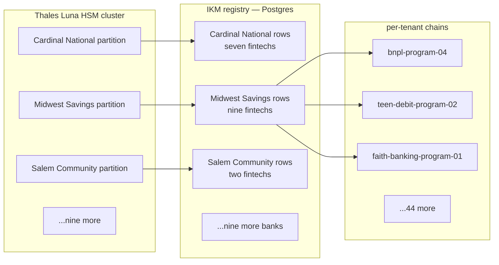
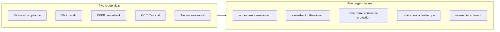

# 🧾 Diary of an Audit Day — Atrio Banking Platform

**Engagement:** Vendor-side platform audit, read concurrently by three state banking departments, the OCC, and CFPB during a coordinated examination cycle
**Client:** Atrio Banking Platform — Banking-as-a-Service infrastructure, Charlotte HQ, ~580 employees, tier-1 VC funded
**Posture:** Full TesseraSeal deployment across the platform for 24 months — multi-tenant — operating the chain on behalf of 12 sponsor banks running 47 fintech programs
**Date:** Tuesday, two weeks after Stelvio
**Auditor:** the same eight-person team that walked Northbridge last quarter, Mercator a few weeks back, Stelvio two weeks ago

---

## Context

Atrio is not a bank. That is the first sentence of every regulatory letter Atrio has ever sent and the first sentence of every prep call Atrio's compliance team has ever taken. Atrio is a SaaS company that operates the technology stack — the cards, the ledgers, the KYC pipelines, the dispute machinery, the regulatory reporting — for fintech companies that do not hold a bank charter. The fintechs ride on top of sponsor banks. The sponsor banks hold the FDIC-insured depository charter. The fintechs offer the consumer-facing brand. Atrio is the rails between them.

Twelve sponsor banks. Forty-seven fintech programs. Each fintech has a different brand, a different consumer audience, and a different risk shape. The teen-debit-card brand and the buy-now-pay-later layer share an HSM partition with the small-business banking product because they all sit under the same sponsor bank — Midwest Savings & Trust, state-chartered Indiana — but they each have their own `tenant_id`, their own session keys, their own daily seal contribution, and their own examiner-portal scope. Per spec §3, every `tenant_id` in the platform conforms to the regular expression `^[A-Za-z0-9_.\-]{1,255}$` — the constraint that keeps the HKDF `info` parameter in §4.1 unambiguously parseable across forty-seven concurrent derivations under twelve IKMs.

Twenty-four months ago Atrio stood up TesseraSeal across the entire platform. Not as a bolt-on. As the ledger of record for every consumer-facing transaction, every credential rotation, every config change, every fraud alert, every regulator-reportable event. The chain runs in two AWS regions active-active under spec §10.15 Pattern A. Each sponsor bank holds its IKM in a dedicated partition on Atrio's Thales Luna network HSM cluster, FIPS 140-2 Level 3, per the §10.5 HSM custody bar. The IKM registry — the table that maps `(sponsor_bank, fintech_program)` pairs to derived chains — sits behind a uniqueness constraint enforced at the database layer per spec §10.1, and the registry is global across both regions per the §10.1 multi-deployment uniqueness rule that forbids per-region registries that drift.

This week is a coordinated examination. Three state banking departments — Indiana, North Carolina, Georgia — are in the building. The OCC is in the building because one sponsor bank, Cardinal National, is national-charter. CFPB is in the building because seven of the 47 fintech programs are consumer-protection-relevant. Dawn's team was engaged by Atrio in October to do a vendor-side platform audit. The deliverable is read concurrently by all five regulator audiences. This is the BaaS-industry coordination model — one external audit at the platform serves multiple regulator audiences who would each have to do the work otherwise.

Atrio's compliance lead is **Naomi Reisinger**. Senior FDIC examiner for fourteen years before she crossed the table. She knows what regulators are going to ask because she used to be the one asking. Her prep call to Dawn lasted eleven minutes.

This is the diary of that day.

---

## Audit Team

- **Dawn** — Lead Auditor (governance and narrative)
- **Raj** — Database specialist
- **Elena** — CRM systems
- **Mike** — Application and API layer
- **Diana** — IAM and access control
- **Luis** — DevOps, logs, pipelines
- **Chen** — Data engineering and ETL
- **Tom** — Internal-audit liaison specialist (visiting team — partners with the client CAE)

Client-side liaison: **Naomi Reisinger**, VP of Compliance & Audit, Atrio Banking Platform. Ex-FDIC. Direct. Prepared.

---

## 🌅 8:30 AM — Kickoff and the Drive In

Dawn rode in with Raj from the airport hotel. Charlotte morning. Light traffic on I-77 because they had left at 7:15. The Atrio building was glass and a parking deck off Tryon, three blocks from BB&T Ballpark.

Raj had bought a coffee from the lobby and was nursing it. "Roadmap for me?"

Dawn watched the parking deck come into view. "Today is multi-tenant. The hardest test of any platform claim. We'll see if Atrio's IKM registry actually does what it says, or if it's documentation theater."

"Northbridge was full deployment."

"Northbridge was the cleanest engagement I've run in years. One finding. The chain held byte-for-byte the rest of the way. I've been waiting for an engagement to break the pattern, because that pattern is the unusual one, not the recurring one. Atrio's forty-seven parallels is the BaaS-shaped chance."

"So today is the test."

"Northbridge was a single bank. One IKM. One chain. One tenant in the spec sense. Atrio is forty-seven tenants under twelve IKMs across two regions. Multi-tenant is where you find out."

"Mercator?"

"Half the river sealed, half not. Bifurcated. The seam was AI versus claims. Today there is no seam. Atrio claims the seam is gone — the whole platform is chained — but the seam is now between tenants instead of between systems. If the IKM registry permits a duplicate `tenant_id` under the same bank, two fintechs derive the same session key and the chains collide. That's the failure shape."

"And Stelvio."

"Three zones, one passes, two don't. Different shape entirely."

Raj took a long pull from his coffee. "What's the recurring line?"

Dawn looked at him sideways. "It never is."

"That's the one."

"It usually is fine for one tenant. Multi-tenant is where you find out. I'm calibrating again." She put her empty cup in the cup holder. "Mercator was bifurcated. Northbridge was singular. Stelvio was tiered. Today is parallel. Forty-seven parallels. The spec §10.1 IKM registry is the hinge. If the hinge holds, the platform claim holds. If the hinge slips even once, every claim downstream is suspect."

They pulled into the visitor lot at 8:22.

Naomi met them at the badge desk. Navy blazer, a lanyard with two badges — Atrio's and a temporary one for the examiner room. The handshake was brief, the eye contact was direct.

"Dawn. Raj. The rest of your team is in the lobby?"

"Pulling badges now."

"I have you in the secure conference room on three. The examiner overflow is in the room next door. There's one shared wall and you'll hear them when they take a call. We have a short kickoff at 8:45 with my CISO, my GRC lead, and the on-call site reliability engineer. The rest of the day is yours. The state examiners are running their own queries against the examiner portal independently — they will not interrupt you unless they have a question that crosses your scope."

Dawn nodded. "Understood. Naomi — three of us are state-chartered, one is national, CFPB is consumer-protection cross-bank. Confirm the examiner-portal credential matrix matches that?"

Naomi did not pause. "State examiners see only their charter's sponsor bank and the fintechs under it. OCC sees Cardinal National only. CFPB sees consumer-protection-relevant tenant_ids across all banks — loan, deposit, payment products. The small-business banking and B2B treasury tenants are out of CFPB scope and they cannot see those. Diana will want to verify the matrix herself. I expect that."

Dawn smiled at the corner of her mouth. "Diana will. That's why she's here."

The team kitted up — laptops, badges, NDAs, examiner-portal read credentials issued for the day. Naomi walked them up to the third floor.

> **🔍 Dawn's note (internal):**
> *Per-tenant isolation is the kind of property that holds 99.9% of the time and breaks 0.1% of the time in the worst possible way. The 0.1% has to be hunted for. Today is the hunt.*

---

## 🧩 9:15 AM — IKM Registry Walkthrough

The conference room had a glass wall onto the hallway and a display screen that took its input from Naomi's laptop. She started with a single Postgres query.

```sql
SELECT bank_id, COUNT(*) AS fintech_count
FROM ikm_registry
GROUP BY bank_id
ORDER BY bank_id;
```

Twelve rows. Forty-seven total fintechs. The distribution was uneven — Midwest Savings & Trust had nine, Cardinal National had seven, the smallest sponsor (Salem Community Bank) had two.

Mike leaned in to read the screen. "And this table is the registry."

"This table is the registry. Per spec §10.1. Every fintech program — every `tenant_id` — registers exactly once under exactly one sponsor bank. The uniqueness constraint is on the pair `(bank_id, tenant_id)`. If the same `tenant_id` string is requested twice under the same bank, the insert fails."

Raj asked, "And the IKM itself?"

"Generated on the HSM during sponsor-bank onboarding. Never leaves the partition. The registry stores a reference — the bank's HSM partition name and the IKM key handle. The session key for any given chain entry is derived on demand by HKDF with `info = info_base || '|' || utf8(tenant_id)`. Spec §4.1. The IKM never appears in application memory."

Mike wrote in his notebook. *HKDF with `tenant_id` in the info parameter. Two fintechs with different `tenant_id` values under the same IKM derive different session keys. The §10.1 uniqueness constraint is what makes that derivation injective. The §3 character class on `tenant_id` is what keeps the `info` byte sequence unambiguous between two distinct strings — the `|` byte the spec uses as separator cannot appear inside the identifier.*

Naomi anticipated the next question. "I'm going to put the schema up so Raj can see the constraint definition before he tries to defeat it."

She switched the screen.

```sql
CREATE TABLE ikm_registry (
    bank_id            text NOT NULL,
    tenant_id          text NOT NULL CHECK (length(tenant_id) BETWEEN 4 AND 64),
    hsm_partition      text NOT NULL,
    ikm_key_handle     text NOT NULL,
    fintech_brand      text NOT NULL,
    registered_at      timestamptz NOT NULL DEFAULT now(),
    registered_by      text NOT NULL,
    PRIMARY KEY (bank_id, tenant_id)
);

CREATE UNIQUE INDEX idx_bank_tenant
    ON ikm_registry (bank_id, tenant_id);
```

Raj read the schema twice. "Primary key on the pair. Unique index on the pair. Belt and suspenders. The check on `tenant_id` length is between 4 and 64."

"Yes. We had a bug in 2024 where an empty string slipped through an admin form. The check constraint was added the same week. The 4-to-64 range is well inside the §3 1-to-255 byte ceiling — Atrio chose to be stricter than the spec because human-readable fintech identifiers do not need 255 bytes."

"And `bank_id`?"

"`bank_id` is set by the platform. Fintechs cannot supply it. The admin form binds it server-side from the authenticated bank session. A fintech cannot register itself under a different bank because the bank context is server-controlled. That's how the §10.1 multi-tenant SaaS clause closes — the registry MUST enforce uniqueness globally across `(institution, tenant_id)` pairs, and Atrio's `(bank_id, tenant_id)` is exactly that shape with the `bank_id` column standing in as the institution discriminator."

Mike asked the next question. "Legacy identifiers? You started this platform before some of the fintechs even existed. Did any of them come in with names that did not conform to §3?"

Naomi nodded. "Three did. Two are CJK-character brand names from the Asia-Pacific desk. One had a slash in the legacy IAM record. We chose §3.1 Pattern 2 — controlled aliasing. Each legacy name maps to a curated conforming canonical name in the institution registry. The chain captures the canonical name only. The legacy name appears in the institution-internal mapping for human disambiguation but is not load-bearing in any audit-evidence context per the §3.1 cross-institutional reporting clause."

> **✓ Confirmation #1**
> The IKM registry under spec §10.1 is enforced at the database layer with both a PRIMARY KEY and a UNIQUE INDEX on `(bank_id, tenant_id)`. The `tenant_id` field has a length check constraint that closed a 2024 empty-string bug. The `bank_id` field is server-bound from the authenticated bank session and not user-supplied. Legacy non-conforming identifiers handled per §3.1 Pattern 2 (controlled aliasing) with the legacy → canonical mapping documented in CC8.1. The constraint is structural, not policy.

Naomi closed the schema view. "Walk us through the layout. We have time before Raj wants to break it."

She put up a diagram.



Naomi pointed at the partition column. "The HSM cluster is four PCIe Luna 7000s in the primary data center, four standby in the DR data center. Each sponsor bank holds its own partition. Cardinal National's partition cannot sign a chain entry for a Midwest Savings tenant. The HSM enforces that — not the application. Per §10.5 the seal-job operator role grants `sign` only — `extract`, `delete`, and `import` require separate authorization. Separation of duties between the seal-job operator and the HSM administrator is in force at all twelve partitions. Each partition's IKM is at least 32 bytes per §10.6, generated inside the HSM by the HSM's internal CSPRNG per §10.6.1's HSM-internal-RNG pattern — the highest-assurance posture of the three §10.6.1 conformant patterns. The `master_key.generated` operational event records the RNG type as `"hsm.thales-luna-7000"` per §10.6.1's audit-trail requirement."

Mike asked the question every multi-tenant SaaS auditor asks first. The §10.1 multi-tenant SaaS clause is normative on the registry layer, but the operational-procedure question is whether any single Atrio role can reach into the bank's IKM by hand. The §10.5 HSM custody clause names the seal-job operator role's `sign`-only grant; the question is whether any other Atrio role has elevated reach.

"And if Atrio engineering wanted to read Cardinal National's IKM?"

"They cannot. The partition is sealed to the bank's onboarding ceremony. The PIN is split between the bank's CISO and Atrio's CISO under a 2-of-2 control. Atrio engineering cannot retrieve the IKM. They can request a derivation — and the HSM returns a session key, not the IKM — and only for a `tenant_id` that the registry says belongs under that bank's partition. We operate Model B per §4.1.1, the session-key-delivered model. Specifically the second variant — HSM-resident PRK with SDK-side Expand — because Thales Luna does not yet expose a native HKDF mechanism over PKCS#11."

Raj wrote: *2-of-2 PIN split between bank CISO and Atrio CISO. IKM never leaves partition. Session keys derived on request, scoped to a registry-confirmed tenant. The §10.1 constraint and the §4.1 derivation work together — the registry says which tenants exist under which bank, the HSM does the derivation. §4.1.1 Model B (HSM-resident PRK) for the handshake — PRK transits SDK process briefly under the same memory-protection posture as Model A's IKM, documented in Atrio's CC8.1 per the §4.1.1 documentation requirement.*

> **✓ Confirmation #2**
> Per-bank HSM partitioning is structural and §10.5-conformant. Twelve sponsor banks, twelve partitions, 2-of-2 PIN split between bank CISO and Atrio CISO for each. Atrio engineering cannot retrieve any bank's IKM. Session-key derivation is scoped to a registry-confirmed `tenant_id` under the requesting bank's partition per the §4.1.1 Model B handshake (HSM-resident PRK with SDK-side Expand). Separation of duties on the seal-job operator role enforced per §10.5. The cryptographic isolation property is enforced by the HSM, not by application code.

Naomi let the diagram sit on the screen. "Questions?"

Dawn looked around. The team was quiet. "We're going to start working it. Raj on the registry first. Diana on the examiner portal. Mike on the verifier and the cross-tenant refusal. Chen on the Pattern A reconciliation. Luis on the operational events. Elena on the bank-facing console. Tom is going to sit with you and walk the runbook."

"Reconvene at noon?"

"Reconvene at noon."

The team split to laptops.

---

## 🧠 10:00 AM — Database Deep Dive (Raj Tries to Break the Registry)

Raj had the registry schema open on one screen and a fresh psql session on the other. Naomi had given him a write-capable role on a staging copy of the production registry — the same schema, the same constraints, no production data. He wanted four adversarial inserts.

### Insert 1 — duplicate within the same bank

```sql
INSERT INTO ikm_registry (bank_id, tenant_id, hsm_partition, ikm_key_handle,
                           fintech_brand, registered_by)
VALUES ('midwest-savings', 'bnpl-program-04', 'partition-midwest',
        'handle-existing', 'BNPL Clone Inc', 'rajtest');
```

The database rejected it.

```
ERROR:  duplicate key value violates unique constraint "idx_bank_tenant"
DETAIL:  Key (bank_id, tenant_id)=(midwest-savings, bnpl-program-04)
         already exists.
```

Raj nodded. "Constraint holds at the index. The application never sees the duplicate."

### Insert 2 — same `tenant_id` across two banks

```sql
INSERT INTO ikm_registry (bank_id, tenant_id, hsm_partition, ikm_key_handle,
                           fintech_brand, registered_by)
VALUES ('cardinal-national', 'bnpl-program-04', 'partition-cardinal',
        'handle-cardinal-bnpl', 'Cardinal BNPL', 'rajtest');
```

The database accepted it.

Raj paused and looked at the row. He looked at Naomi.

Naomi was waiting for it. "That's correct. Different bank, different IKM, different HSM partition. The HKDF derivation in §4.1 binds the session key to `info_base || '|' || utf8(tenant_id)`, and the *base* is the per-bank IKM. Two banks deriving keys for the same `tenant_id` string still produce different session keys because the IKMs differ. The chain isolation is preserved by the IKM, not by the `tenant_id` alone. The §10.1 constraint is per bank, not global — and the cross-bank case you just exercised is exactly the §10.1 worked example: 'a duplicate `tenant_id` registered under different institutions is conformant (each institution has its own IKM).'"

Raj wrote: *Same `tenant_id` across two banks is correctly accepted. Cross-bank isolation is provided by the per-bank IKM, not by the registry alone. The registry enforces local uniqueness. The HSM partitions enforce global isolation. Read together with the §4.1 inviolate property 1 (tenant binding via HKDF info), the two mechanisms make the chain-derivation function injective. The fingerprint check in §7 step 8 — the verifier asserts the looked-up IKM produces the entry's `key_fingerprint` BEFORE computing any MAC — would catch any operator typo that re-pointed a `tenant_id` at the wrong bank's IKM, with the named failure mode rather than a buried MAC mismatch storm.*

He rolled the test row back.

### Insert 3 — empty `tenant_id`

```sql
INSERT INTO ikm_registry (bank_id, tenant_id, hsm_partition, ikm_key_handle,
                           fintech_brand, registered_by)
VALUES ('midwest-savings', '', 'partition-midwest', 'handle-empty',
        'Empty Tenant', 'rajtest');
```

Rejected.

```
ERROR:  new row for relation "ikm_registry" violates check constraint
DETAIL:  Failing row contains (midwest-savings, , ...).
HINT:    tenant_id length must be between 4 and 64.
```

Raj smiled. "The 2024 bug fix. Confirmed. The §3 floor is 1 byte; Atrio chose 4 as a stricter institution policy."

### Insert 4 — null `bank_id`

```sql
INSERT INTO ikm_registry (bank_id, tenant_id, hsm_partition, ikm_key_handle,
                           fintech_brand, registered_by)
VALUES (NULL, 'orphan-tenant', 'partition-none', 'handle-none',
        'Orphan Inc', 'rajtest');
```

Rejected.

```
ERROR:  null value in column "bank_id" of relation "ikm_registry"
        violates not-null constraint
```

Raj closed the psql session. "Four adversarial inserts. The structural mechanism rejected all the wrong ones and accepted the one the spec says should be accepted. The registry is doing what it claims."

> **✓ Confirmation #3**
> Adversarial inserts on the IKM registry behave per spec §10.1. Duplicate `(bank_id, tenant_id)` rejected at the unique index. Same `tenant_id` across different banks correctly accepted because cross-bank isolation is provided by the per-bank IKM (§4.1 HKDF tenant binding inviolate property 1). Empty `tenant_id` rejected by length check (Atrio's 4-to-64 institution policy is stricter than §3's 1-to-255 ceiling). Null `bank_id` rejected by NOT NULL constraint. The registry's structural properties are enforced at the database layer per §10.1 multi-tenant SaaS guidance, not by application policy.

Naomi looked over Raj's shoulder at the workbook. "We tried."

Raj smiled. "That was the right test order. I think."

"That was the order I wanted. The empty-string one is the one I expected you to try second. You found it on third. Same outcome."

Raj also asked about the §3.1 mapping registry's integrity. Naomi pulled the legacy → canonical mapping table — the institution-internal registry per §3.1 Pattern 2 controlled aliasing. The registry was append-only with version control, and any change to a legacy → conforming mapping after the chain was started under the existing mapping was governed by the change-management procedure per §3.1's normative clause — Atrio does not silently re-map. The registry was a control-evidence artifact in its own right; Atrio's CC8.1 named the SOC team's annual procedure that confirmed registry integrity. The verifier does not consult the legacy registry — the verifier sees only the conforming chain identifier per §3.1's verifier-behavior clause — but examiner submissions reference the conforming `tenant_id` as the primary identifier and provide the legacy mapping as ancillary forensic material if needed.

He moved on to the chain backing tables.

### The chain entries themselves

Raj queried a random fintech's chain backing table — `bnpl-program-04` under `midwest-savings`. The table had per-entry HMAC, per-entry `prev_hash`, per-entry seq, run_id, payload, and the standard append-only columns. The append-only discipline was enforced at two layers per §10.3 — the application codebase contains no UPDATE or DELETE statements on the events or daily_seals tables, and the database role used by the ledger writer was granted INSERT and SELECT only with UPDATE, DELETE, and TRUNCATE permissions revoked. He confirmed the role grant on the staging copy and wrote the role definition into his workbook for the SOC pack. He picked a random entry from three weeks ago and ran the verifier from his terminal.

```
herald-verify --bank=midwest-savings --tenant=bnpl-program-04 \
              --date=2026-04-12 --strict
```

Eleven seconds — long enough that he had time to look up at the screen and back.

```
Status: PASS
Step: 12
Reason: chain integrity verified, HMAC recomputed,
        Merkle path resolved, signature verified
        against public key midwest-2026-q2
```

He ran it on a random entry from yesterday. PASS. He ran it on the very first entry from 24 months ago — the day TesseraSeal went live for Midwest Savings. PASS. Exit code 0 in every case per the §10.12 verifier CLI exit-code contract — `0` is PASS, `1` is FAIL, `2` is structural input error before §7 could begin, `3` is configuration error.

He pulled the dev-mode posture next. The verifier runs `--strict`, which per §10.7 rejects any seal whose `dev_mode` is `true` or whose `kms_handle_uri` begins with `"plaintext-"`. Atrio ships its production builds with the software-key adapter compile-excluded — Raj asked about it specifically. Naomi pulled the build manifest. The adapter assembly was absent from the production image; the deployment pipeline asserts the absence at every release per the §10.7 packaging-exclusion pattern. Naomi's CC8.1 named the exclusion and the procedural test that confirms the adapter is unreachable in production. The double-protection — compile/package exclusion plus verifier `--strict` rejection — is the §10.7 regulator-visible line.

> **✓ Confirmation #4**
> Per-tenant verifier returns PASS on entries spanning the full 24-month deployment. Twelve verification steps including HMAC recomputation, Merkle path resolution, and signature verification against the per-bank public key (`midwest-2026-q2` for the queried period). Exit code 0 per §10.12 in every PASS run. Append-only enforcement is dual-layer per §10.3 (application codebase has no UPDATE/DELETE on chain tables; ledger-writer DB role grants INSERT and SELECT only). Software-key adapter is compile-excluded in production per §10.7 packaging-exclusion pattern; verifier `--strict` would reject any chain stamped with `kms_handle_uri = "plaintext-dev"` as defense-in-depth. The verifier handles entries from the first day of deployment through the previous trading day with no special-casing.

Raj wrote the test list and moved on.

---

## 🔐 11:00 AM — Diana on the Examiner Portal

Diana had been issued five separate examiner credentials before the engagement started. Naomi had built them deliberately to mirror the day's regulator audience.

| Credential | Scope |
|---|---|
| `state-in-examiner` | Indiana state — Midwest Savings & Trust only |
| `state-nc-examiner` | North Carolina state — Pioneer Carolina Bank only |
| `state-ga-examiner` | Georgia state — Coastal Empire Bank only |
| `occ-examiner` | OCC — Cardinal National only |
| `cfpb-examiner` | CFPB — consumer-protection-relevant tenants across all banks |

Diana logged in as the Indiana state examiner first. The portal opened on a dashboard that showed Midwest Savings & Trust's nine fintechs, each with a status tile, the most recent seal date, the most recent verifier run, and a count of regulator-reportable events for the previous quarter.

She clicked into `bnpl-program-04`. The portal showed verifier history, daily seal records, public-key fingerprints, and a "request raw chain export" link gated behind a second-factor approval.

She tried to navigate to a Cardinal National fintech. The URL did not resolve. The portal returned `403 Forbidden — credential scope does not include sponsor bank cardinal-national`.

She tried to inject a Cardinal National `tenant_id` into the export endpoint. Same response. The portal logged her attempt to a TesseraSeal entry with `event.type = examiner.scope_violation_attempt` and her credential ID. The entry landed in Atrio's platform operational chain under §10.2 — the operational-event family is the same family that records `seal.job_started`, `master_key.rotated`, and `chain.verification_failure`, all of which the SOC pack consumes during the annual examination.

Diana wrote: *Indiana state credential refused at the portal layer for Cardinal tenants. Scope violation logged to chain. Two-layer enforcement.*

She switched to the OCC credential. Cardinal National's seven fintechs appeared. Midwest Savings did not. North Carolina, Georgia — none of the others. She tried the same URL injection in reverse — pulling a Midwest Savings fintech under the OCC credential. `403 Forbidden`. Logged.

She switched to the CFPB credential. Now she saw a different shape — not a per-bank list, but a per-tenant list across all banks, filtered to consumer-protection scope. Loan products, deposit products, payment products. The teen-debit-card brand was visible. The buy-now-pay-later layer was visible. The healthcare-FSA card was visible. The small-business banking product — operated by Midwest Savings — was *not* visible. The B2B treasury fintech was not visible. The internal Atrio engineering tenant was not visible.

She tried to pull the small-business banking fintech under the CFPB credential. `403 Forbidden — credential scope does not include tenant midwest-smb-banking-program-01`. Logged.

She wrote: *CFPB scope correctly partitioned. Cross-bank read on consumer-protection tenants. No read on B2B / SMB / internal tenants. Three layers — credential issuance, portal scope check, chain audit logging on violation attempts.*

Diana then tried something she had been thinking about on the drive in. She held the OCC credential session and opened a second tab. She loaded the bank-facing console — the surface the sponsor bank's compliance team uses to review their own fintechs. The console asked for a sponsor-bank credential, not an examiner credential. The OCC credential could not authenticate to the bank-facing console at all. Different surface, different credential type, different scope check.

Naomi had walked over while Diana was working.

"That's the third layer," Naomi said. "The bank-facing console is for the sponsor bank's compliance team. The examiner portal is for regulators. They are separate surfaces with separate identity providers. An examiner credential cannot drive a bank-side action — they cannot rotate a key, register a fintech, or change a config. They can read."

> **✓ Confirmation #5**
> Examiner-portal scope is enforced at three layers. Credential issuance binds scope at the identity provider. The portal checks scope on every request. The chain logs every scope violation attempt with credential ID and attempted target as a §10.2-class operational event in the platform's operational chain. Five examiner credentials tested — three state, one OCC, one CFPB — each correctly partitioned. Cross-tenant URL injection refused in every case. The bank-facing console is a separate surface that no examiner credential can authenticate to.

Diana closed the laptop and switched to a fresh terminal for the next test — the verifier itself. Naomi had given her an audit credential scoped to the BNPL fintech under Midwest Savings. Diana ran the verifier authenticated as that credential against a Cardinal National tenant.

```
herald-verify --bank=midwest-savings --tenant=teen-debit-program-02 \
              --date=2026-04-12
```

The verifier returned:

```
Status: ACCESS_REFUSED
Reason: credential scope does not include tenant teen-debit-program-02
```

Exit code 1. Procedure could not begin. Per spec §10.12 — the discriminator between exit codes 1 and 2 is "could the §7 procedure begin?" The credential check happens before §7 step 1 by the implementation's own design, but the institution maps that pre-§7 refusal to exit-1 because the verifier reached the credential layer; the §10.12 contract permits this mapping when the institution's CC8.1 names it. Naomi's CC8.1 names it.

Diana ran a second variant — the verifier authenticated as the BNPL credential, attempting a Midwest Savings tenant that the BNPL credential does not own.

```
herald-verify --bank=midwest-savings --tenant=midwest-smb-banking-program-01 \
              --date=2026-04-12
```

```
Status: ACCESS_REFUSED
Reason: credential scope does not include tenant midwest-smb-banking-program-01
```

Same shape. Refused before chain access. Logged.

> **✓ Confirmation #6**
> Cross-tenant verifier refusal under spec §10.12 is enforced at the verifier process boundary. The BNPL fintech's audit credential cannot run the verifier against any other tenant — not against another fintech under the same bank, not against any fintech under any other bank. Refusal is at the credential check, before any chain bytes are read. Exit code 1 (per Atrio's CC8.1 mapping of pre-§7 refusal). The refusal itself is captured to the platform's operational chain per §10.2.

Diana had the credential matrix on a single page by 11:42. Naomi initialed the bottom of the page.

---

## 🔁 11:45 AM — Run Resume and the Chain-Tail Endpoint

While Diana wrapped up, Mike pulled Naomi aside on a separate question. "§10.25 run resume. You operate forty-seven fintechs across two regions. Your SDK processes restart for routine reasons — autoscaling, deployment, container disposal. How does the SDK rejoin a run after losing local persistence?"

Naomi had been waiting for this one too. "We use the three-place tail acquisition per §10.25. In-memory first when the run is open in the same process. SQLite sidecar second — per-`(tenant_id, run_id)` row, row-locked at write so single-writer-per-run is enforced at the local layer, fsync before the entry's `payload_hash` is disclosed per §4.1's rule. Ledger query third — the SDK queries the chain-tail endpoint for `(latest_seq, latest_payload_hash, key_version)` and resumes from the returned tail. The endpoint URL and the auth mechanism are in our CC8.1 per §10.25's documentation requirement."

"And if the ledger is unreachable and the sidecar is missing?"

"The SDK refuses to emit. §10.25 disaster-recovery rejoin discipline. We do not silently degrade to genesis — that would re-emit `seq = 1` with `prev_hash = 32 zero bytes` for a `(tenant_id, run_id)` whose chain is already established, which the ledger would refuse at ingestion under the §4.4 genesis-block uniqueness rule anyway, but the SDK is the first line of defense and the local check is cheaper. The operator gets an instrumented refusal and goes to the documented procedure — typically a fresh genesis under a NEW `run_id`, never under the same one."

Mike wrote: *§10.25 three-place tail acquisition: in-memory → SQLite sidecar (row-locked, fsync'd) → ledger chain-tail endpoint. DR rejoin refuses to silently degrade to genesis. Single-writer-per-run rule at the sidecar layer prevents fork-from-SDK-side. Ledger ingestion cross-check (§10.25) is the second line — every batch's first entry's `prev_hash` MUST equal the ledger's last-known `payload_hash` for the run, and the batch's `seq` MUST equal `last_known_seq + 1`, or the ledger refuses with `chain-tail mismatch`. Genesis-form anti-spoof at ingestion (§4.4) catches the silent-restart attempt that synthesizes a fresh state and claims `seq = 1`.*

Naomi pulled up the ledger logs for a real rejoin from the previous week — a us-east-2 SDK process had been recycled for a cluster rebuild and rejoined under five tenants on cold start. Five chain-tail queries, five tail acquisitions, five runs picked up at the next monotonic seq. None of them re-genesised. The ledger logs showed each rejoin as a documented event tagged with `connector.lag_observation`-class context for the BaaS data ingest path.

> **✓ Confirmation #7**
> Run resume discipline is conformant with §10.25 three-place tail acquisition. SQLite sidecar with row locks satisfies the single-writer-per-run rule. Disaster-recovery rejoin refuses silent genesis; the §4.4 genesis-form anti-spoof at the ledger layer is the second line of defense. Real-world rejoin from a cluster rebuild last week — five tenants, five tail acquisitions, no re-genesis. Fork-detection responsibility is closed at the ledger ingestion cross-check; the verifier reports duplicate `(tenant_id, run_id)` at file-discovery as defense-in-depth per §10.25 fork-detection clause.

---

## 🧪 12:00 PM — Lunch (Naomi Brought Sandwiches)

The catering came up — a long tray of wrapped sandwiches, a smaller tray of fruit, and a thermos of coffee that had been brewed in the room next door because the examiners had drained the urn down the hall.

Dawn and Tom took a corner. Naomi sat with the rest of the team for the first ten minutes and then peeled off to take a call from the GRC lead. The sound of the OCC examiner laughing through the shared wall came through clearly for about twenty seconds and then went quiet.

Dawn unwrapped a turkey. "Tom. Do we look harder at the cross-region replication event?"

Tom set his fork down. "If the spec calls out the event by name, we look at it."

"Spec §10.15 calls out `master.cross_region_replication_completed` by name. Pattern A active-active. The event semantics are — let me get this right — the per-region count and replication-completion timestamp in the event MUST reflect the replication pipeline's actual state at the moment the event is emitted, not a cached representation."

"And the load-bearing clause?"

Dawn pulled her copy of the spec out of her bag. She had it dog-eared at §10.15. "Here. The Round-17 invariant-5 clarification: *Implementations that read these fields from a poll-cached store are non-conformant if the cache may lag the replication pipeline at emission time, even when the cache freshness window is well-bounded.* Then: *Where seal cadence is hourly or sub-hourly, the synchronous-read requirement is load-bearing — a five-minute cache lag against a one-hour seal cycle is a partial conformance.*"

Tom did the math out loud. "Daily seal — slow cadence. The freshness window is wide enough that a small cache lag does not break the event's role as authoritative replication evidence. Hourly seal — fast cadence — and the spec is naming the five-minute-lag-against-one-hour-seal exact case as a partial."

"Right. And the BNPL platform is hourly. 2.8 million decisions a day."

"We don't know what the cache freshness is."

"We don't yet. Chen is on it after lunch."

Tom picked up his fork. "So that's the one we're looking for."

"That's the one. Everything else has been inside a green check so far. The IKM registry holds. The HSM partitioning holds. The verifier refuses cross-tenant. The examiner portal partitions correctly. The run-resume contract is documented and exercised. Naomi has not handed us a single chip yet."

"She wouldn't. She used to be FDIC."

"That's why we have to keep looking."

Dawn pulled out her copy of the spec and tabbed to §1.2. "Epistemic-scope reading. The chain proves what the AI said at a specific time and that the record was not tampered with after capture. The chain does NOT prove that the AI's statement is factually accurate, that it complied with policy, or that it is free of bias. For Atrio, that boundary matters operationally. The CFPB analyst is reading the chain to confirm that adverse-action notices were sent within the ECOA 30-day clock and that the listed reasons match what the model weighted. She is not reading the chain to confirm the underwriting model is fair — fair-lending evidence is a separate audit-evidence regime under §4.4.5 disparate-impact testing plus the institution's MRM committee review. The §1.2 epistemic boundary keeps Atrio's chain claim honest. Atrio is delivering integrity foundation, not truth foundation."

Tom: "And the SDK-process compromise residual scenario. §1.2's fourth class."

Dawn: "Yes. The §1.1 three-layer compromise model — IKM, ledger storage, HSM signing key — is what an attacker has to simultaneously breach to produce a verifying false-negative on a tampered chain. The §1.2 fourth scenario is a compromised SDK process holding a live session key. That produces forward-only chain entries that verify as PASS for as long as the compromise persists. The institution's IKM is not compromised; the ledger storage is not compromised; the HSM is not compromised. Yet the chain produces a verifying record of events the legitimate AI agent did not generate. The window is bounded by host-hardening, intrusion detection, and master-key rotation. Atrio's CC8.1 names the host-hardening posture and the §10.1 weekly fingerprint reconciliation that bounds the master-compromise detection window. For BaaS, the host-hardening posture is the load-bearing operational compensating control."

The OCC examiner laughed through the wall again, shorter this time. The conversation in the team's room went quiet for a moment and then resumed.

Dawn finished her sandwich and stood up. "1 PM. Mike runs the cross-tenant matrix. Chen runs the replication event. Diana is already done — she goes to help Elena on the bank-facing console. Tom — sit with Naomi on the runbook. I want to know if §10.15 is mentioned by section number anywhere in the runbook. Also §10.1, §10.5, §10.16, §10.17. The §10.18 cross-referencing rule is normative — every runbook section that touches a normative spec requirement names the spec section it derives from, or it's a Nit. Atrio's runbook is going to get walked under that rule today."

"On it."

---

## 🌐 12:45 PM — Elena on the Bank-Facing Console

Elena had been the CRM-systems specialist on this audit team for years, but Atrio's bank-facing console was not a CRM. It was the surface a sponsor bank's compliance team uses to manage its own fintechs — register a new program, rotate a tenant key, change a config, review a fintech's pending incidents. Elena's job for the next 45 minutes was to confirm that the bank-facing console enforces sponsor-bank-scoped access just as cleanly as the examiner portal does for regulators.

Naomi had given Elena two sponsor-bank-scoped credentials: one for Midwest Savings & Trust's compliance team, one for Cardinal National's compliance team. Both credentials were issued from a different identity provider than the examiner portal — a separate IdP running under Atrio's bank-facing tenant per the §10.5 separation-of-duties posture.

Elena logged in as the Midwest Savings credential first. The console opened on Midwest Savings & Trust's dashboard. Nine fintech tiles. Each tile carried the fintech's tenant_id, registration date, current key_version, the most recent verifier run, the most recent partition-ceremony attestation event, and a "manage" link.

She tried to navigate to a Cardinal National fintech. The console returned `403 Forbidden — credential scope does not include sponsor bank cardinal-national`. Different message than the examiner portal — the bank-facing console identifies its scope check by sponsor-bank-id, not by examiner-credential-id — but the same shape. Logged.

Elena tried to register a new tenant under Cardinal National. The console refused at the form-submission boundary: the `bank_id` field was server-bound from the authenticated bank session per the §10.1 multi-tenant SaaS clause, and the Midwest Savings credential could not authenticate as Cardinal National. The fintech registration form does not let the operator supply `bank_id` — it is set server-side from the credential's bank context. This is the structural mechanism §10.1 names: a fintech cannot register itself under a different bank because the bank context is server-controlled.

Elena tried one more attack. She held the Midwest Savings credential and tried to rotate Cardinal National's IKM through the bank-facing console's key-rotation endpoint. The endpoint did not even authorize the request — the `bank_id` parameter on the rotation call was server-bound from the credential's session, so the rotation would have rotated Midwest Savings' IKM, not Cardinal's. There was no path through the console for one bank to act on another bank's keys. The §10.5 HSM custody clause's operational discipline plus the §10.1 server-bound `bank_id` together make cross-bank action structurally impossible from the bank-facing console.

Elena wrote: *Bank-facing console scope is enforced at three layers parallel to the examiner portal — credential issuance via separate IdP, console scope check on every request, server-bound `bank_id` on all mutation endpoints. Cross-bank attempts refused at form-submission boundary; cross-bank key rotation structurally impossible because `bank_id` is server-bound from the credential's session per §10.1.*

> **✓ Confirmation #7a**
> Bank-facing console scope is enforced at the same three-layer discipline as the examiner portal but with sponsor-bank-scoped credentials rather than examiner-scoped credentials. Server-bound `bank_id` on mutation endpoints (registration, key rotation, config changes) per §10.1 multi-tenant SaaS clause makes cross-bank action structurally impossible from the console. Separate IdP from the examiner portal per §10.5 separation-of-duties posture. The bank-facing console and the examiner portal are two distinct surfaces with two distinct credential populations; no examiner credential can authenticate to the bank-facing console, and no bank credential can authenticate to the examiner portal.

---

## 🔄 1:00 PM — Mike's Cross-Tenant Refusal Matrix

Mike had built a five-by-five test matrix on the whiteboard before lunch. Five credential types, five target tenant types. Twenty-five test cases. He worked through them in pairs.

The credential types:

1. Sponsor bank's own compliance credential (Midwest Savings)
2. Fintech's own audit credential (BNPL under Midwest Savings)
3. CFPB cross-bank consumer-protection credential
4. OCC single-bank credential (Cardinal National)
5. Atrio internal-audit credential (cross-platform, narrow read)

The target tenant types:

a. Same-bank, same-fintech (where applicable)
b. Same-bank, different-fintech
c. Different-bank, same-product-category
d. Different-bank, different-product-category
e. Out-of-CFPB-scope tenant (B2B / SMB / internal)

He worked the matrix systematically. The Midwest Savings compliance credential against any Midwest Savings fintech: PASS. Against any Cardinal National fintech: ACCESS_REFUSED. Against the internal Atrio engineering tenant: ACCESS_REFUSED.

The BNPL fintech's audit credential against the BNPL chain: PASS. Against the teen-debit chain (same bank): ACCESS_REFUSED. Against any cross-bank tenant: ACCESS_REFUSED.

The CFPB credential against any consumer-protection fintech (loan, deposit, payment products) across all banks: PASS — read scope only. Against the small-business banking tenant: ACCESS_REFUSED — out of CFPB jurisdiction. Against the internal Atrio engineering tenant: ACCESS_REFUSED.

The OCC credential against Cardinal National fintechs: PASS. Against any other bank's fintechs: ACCESS_REFUSED.

The internal-audit credential — narrowest read scope, Atrio's own SRE-incident tenant only: PASS. Against any sponsor bank's fintech: ACCESS_REFUSED.

Twenty-five cases. Twenty-five expected outcomes. Twenty-five actual outcomes matching expected. Mike took a photograph of the whiteboard with his phone.



He wrote in his notebook: *Twenty-five cases. Refusal is at the verifier credential check before chain bytes are read. The verifier emits exit code 1 in every refused case per §10.12. The refusal is logged to the platform operational chain per §10.2. The pattern is uniform across credential types — the same code path handles all five — which means the property is structural rather than per-credential policy.*

> **✓ Confirmation #8**
> Cross-tenant query refusal is uniform across all five credential types tested in a 5×5 matrix. Twenty-five cases, twenty-five correct outcomes. The verifier credential check is the single enforcement point — all refusals exit code 1 per §10.12, all are logged to the platform operational chain per §10.2. The implementation does not branch by credential type, which means the property is structural rather than per-credential policy.

Mike took the photo to Dawn for her notebook.

---

## 🧬 2:00 PM — Chen on the Replication Event

Chen pulled the platform's operational chain — the meta-chain that records platform-level events like seal cycles, key rotations, and cross-region replication status per the §10.2 operational-event family — and filtered to `event.type = master.cross_region_replication_completed` for the past seven days.

Five hundred and four events. Roughly one every twenty minutes. The events showed source region, seal region, fintech tenant, event count seen in source, event count sealed in seal region, and a timestamp.

He picked one at random — `bnpl-program-04`, source `us-east-2`, seal `us-west-2`, sealed at `2026-04-12T14:00:00Z`. The event recorded `source_count = 187,432`. He cross-checked against the actual source-region event store directly — read from a replica with read-only credentials Naomi had issued.

The actual source-region count at the seal moment was `187,591`. A delta of 159 events.

Chen pulled the seal-region count for the same `(tenant, day, hour)` triple. `187,432`. Matched the event.

The event was reporting the seal-region count under a "source_count" label.

Chen frowned. He pulled the platform's replication implementation documentation. The implementation polled an internal replication-completion cache every five minutes. The cache was populated by the source-region event store on a five-minute lag. The seal cycle ran hourly for BNPL. At each seal cycle, the cache was up to five minutes behind. The 159-event delta was real — those events had been replicated to the seal region within the five-minute window before the seal but were not yet visible in the cache.

He stood up and walked to Naomi's desk in the corner.

"Naomi. The replication-completion event."

Naomi turned. "Yes."

"It reports a source count that is read from a five-minute-stale cache. The seal cycle picks up actual replicated events in real time at the seal region, but the operational event still reports the cached source count. So for fast-cadence tenants — BNPL hourly — the count delta in the event is bounded by the cache lag, not by the actual replication state."

Naomi nodded slowly. She was not surprised. "Walk me through what the spec says about the event."

Chen pulled out his copy. "Spec §10.15 invariant 5 — *the per-region count and replication-completion timestamp in the event MUST reflect the replication pipeline's actual state at the moment the event is emitted, not a cached representation. Implementations that read these fields from a poll-cached store are non-conformant if the cache may lag the replication pipeline at emission time, even when the cache freshness window is well-bounded.* Then the worked-example clause: *Where seal cadence is hourly or sub-hourly, the synchronous-read requirement is load-bearing — a five-minute cache lag against a one-hour seal cycle is a partial conformance.*"

"That is the exact case we are."

"That is the exact case. The Round-17 invariant-5 clarification removes the discretion. Even though our five minutes is well under the half-cadence boundary that older readings of §10.15 would compare against, the load-bearing rule is the synchronous-read requirement at emission, not the freshness window. Atrio's emission is reflecting cache state rather than the replication pipeline's actual state. That's the partial."

"And the seal?"

"The seal accurately seals what's in the seal region's ledger. Chain integrity is unaffected. The §10.15 Pattern A invariants 1 through 4 — region-agnostic per-event MAC, run-locality with per-process region binding, single seal region per tenant per `seal_date`, day-boundary at the seal region — are intact. The partial is on invariant 5 only, the replication-loss-detection event semantics."

Naomi exhaled. "I see. The seal is correct. The event is reflecting the cache."

"The way Atrio is using the cache is conformant for the seal — the seal is what matters cryptographically. The way Atrio is using the cache is partially non-conformant for the operational event because the spec language now says the synchronous-read requirement is load-bearing for fast-cadence tenants regardless of the cache freshness window."

Naomi pulled up an engineering ticket on her laptop. The ticket was already open. Title: `Replicate-completion event — switch from cache poll to synchronous read`. ETA 60 days. Author: Atrio's principal architect. Created six weeks ago — before the §10.15 invariant-5 clarification landed in spec. The ticket cited the spec language by paragraph and named the synchronous-read mechanism Atrio is moving to (a push-update from the replication pipeline that the event publisher reads before emission, one of the three §10.15-acceptable mechanisms).

"The fix is in flight. We caught it in our internal review last quarter. The architect estimated 60 days from start. They started two weeks ago. The §10.15 invariant-5 clarification confirmed our internal reading was correct. Without that clarification, an older reviewer might have looked at the five-minute-cache-against-one-hour-seal and called it conformant under the half-cadence reading. The clarification removed the discretion."

Chen wrote in his workbook: *5-minute cache lag on `master.cross_region_replication_completed` event. Seal correctness unaffected. Operational event semantics partial under §10.15 invariant 5 (Round-17 clarification). The Round-17 clarification: poll-cached store is non-conformant even when the cache freshness window is well-bounded. Engineering ticket open, ETA 60 days, switching to push-update (one of the three §10.15-acceptable synchronous mechanisms). Atrio's CC8.1 names the partial-conformance posture and the named replacement.*

> **⚠️ Partial-001**
> The platform's `master.cross_region_replication_completed` event reads its source-region count from a five-minute-stale internal cache rather than from a synchronous replication-completion read. The seal accurately seals the seal-region chain — chain correctness is unaffected; §10.15 Pattern A invariants 1-4 are intact. The operational event is partially non-conformant under spec §10.15 invariant 5 because the Round-17 clarification names poll-cached stores as non-conformant for fast-cadence tenants regardless of the cache freshness window — the synchronous-read requirement is load-bearing for hourly seal cadence. Engineering ticket open. ETA 60 days. Push-update mechanism replaces the cache poll. Naomi accepts the partial. The §10.15 clarification *closes* the prior ambiguity rather than introducing a new requirement: implementations that conformed under the older half-cadence reading need to revisit, and Atrio is on the path of revisit.

Chen also walked the §10.15 Pattern A invariant 2 enforcement — run-locality at the SDK process boundary. The spec normates that an SDK process serves events from exactly one region; serving events from multiple regions in a single SDK process is non-conformant for the Pattern A run-locality enforcement. Atrio runs one SDK process per region per fintech — the us-east-2 SDK pool serves only us-east-2 events; the us-west-2 SDK pool serves only us-west-2 events. The deployment uses Kubernetes node selectors and container labels to pin each SDK pod to its region. The institution's CC8.1 names the per-process region binding mechanism per §10.15's normative documentation requirement. The OPTIONAL `ffiec.chain.region` attribute is emitted at capture time and bound under the canonical bytes via §5; a tampered value would surface as a MAC mismatch at §7 step 9. The verifier does NOT enforce region-locality from the attribute alone — the load-bearing enforcement is the per-process region binding.

Chen wrote: *§10.15 Pattern A invariant 2 (run-locality) enforced at the SDK process boundary per §4.4 SDK per-process region binding clause. One SDK process per region per fintech; Kubernetes node selectors and container labels pin each pod. CC8.1 names the binding. OPTIONAL `ffiec.chain.region` attribute emitted at capture for incident-response reconstruction; the integrity binding is at the canonical-bytes layer per §5.*

Chen and Naomi spent another fifteen minutes confirming the boundary — that no chain entry had ever been sealed missing data because the cache was stale. The seal mechanism reads from the seal-region event store directly at the seal moment, not from the replication-completion cache. The cache only feeds the operational event. Chen pulled three random fintechs' Merkle roots over the past week and recomputed each from raw events per §4.2. All three reconciled.

> **✓ Confirmation #9**
> Per-fintech Merkle root reconciliation — three random fintechs across three different sponsor banks, sampled across the past week. Recompute from raw events matches the sealed root in every case. The replication-event cache lag does not propagate into seal correctness — the seal mechanism reads the seal-region event store directly per §4.2, not the cache. Chain integrity holds. The Pattern A worked-example invariant 5 reconciliation evidence (sum of per-region counts equals seal region count for the tenant-day) is documented in the institution's operational events per §10.15 Pattern A verifier-behavior clause; the verifier's PASS output is silent on replication completeness, but the institution's reconciliation makes the gap visible at the next layer of audit.

Chen walked back to Dawn and put the writeup on the table. "One partial. One confirmation. The seal is fine. The event is the issue. The Round-17 §10.15 invariant-5 clarification closed what would have been an ambiguous reading; the clarification is exactly what made the partial mechanically determinable."

Dawn wrote: *Partial-001 — bounded, in-flight fix, ETA 60 days, accepted by Naomi. §10.15 invariant-5 clarification was the discretion-removing clause. The earlier ambiguity is closed by the Round-17 spec edit, not by deletion of the finding.*

---

## 🕯 2:30 PM — HSM Partition Ceremony Attestation (Tom and Naomi)

While Chen and Mike worked the chain shape, Tom sat with Naomi in the side office. The §10.17 partition-ceremony attestation event family was not on Tom's original prep sheet — he had it on a contingency page because Atrio is a multi-tenant SaaS vendor per §10.1 and §10.17 normates partition ceremony events for exactly that case. Tom asked Naomi to walk him through the most recent ceremony.

She pulled up the chain entry. `chain.partition_ceremony_attended` for Cardinal National's partition, IKM rotation completed February 18, 2026.

Tom read the attribute set off the screen against §10.17.

```
ceremony_type:               ikm_rotated
partition_handle:            cardinal-national-partition-01
customer_bank_id:            cardinal-national
ceremony_started_at_utc:     2026-02-18T14:00:00Z
ceremony_completed_at_utc:   2026-02-18T14:47:00Z
signatories: [
  { role: customer_bank_ciso,    name: "...",  entity_affiliation: "Cardinal National Bank" },
  { role: vendor_ciso,            name: "...",  entity_affiliation: "Atrio Banking Platform" }
]
witness:    { role: colocation_engineer, name: "...", entity_affiliation: "Equinix DC2" }
attendance_pdf_sha256:        e7a4...c012
attendance_pdf_holder:        Equinix DC2 secure document vault
partition_pin_change:         true
hsm_attestation_token_b64:    AAAB... (Thales SafeNet ceremony-bound attestation)
```

Tom walked the schema. Every required field present. `ceremony_type` was one of the §10.17 in-scope set (IKM rotation). `customer_bank_id` was present because Atrio is a multi-tenant SaaS vendor per §10.1. `signatories` was a JCS-canonical array of two objects, each carrying `role`, `name`, and `entity_affiliation`. The `entity_affiliation` field was the §10.17 Round-17 M&A-P1 addition — the discriminator that distinguishes the bank's CISO from Atrio's CISO when an examiner walks the dual-control roster post-hoc. The `witness` field was a separate party from the signatories per the §10.17 normative requirement. The PDF hash was bound on the chain so any post-hoc edit of the scanned attendance log is detectable. The `hsm_attestation_token_b64` was present — Atrio's CC8.1 names Thales SafeNet's ceremony-bound attestation API as the mechanism per the §10.17 RECOMMENDED-at-v1.0b posture. The token is candidate-normative for v1.x; emitting it now produces v1.0b-conformant chains and v1.x-forward-compatible chains in the same wire form.

Tom asked the cross-language question. "Cardinal National has Spanish-speaking auditors on its vendor-management team. Your CC8.1 partition-ceremony procedure section — what language is it in?"

"English. We added a Spanish translation last quarter for the consumer-disclosure-bearing CC8.1 sections — that's a CFPB readiness step. The partition-ceremony section is English-only because every customer-bank auditor we have is English-fluent for technical procedures. We cross-reference the runbook by title and table-of-contents structure per §10.17's cross-language CC8.1 discoverability clause — a non-English customer-bank auditor can identify the relevant sections by name and request a translation."

"That clause is for the case where the runbook is in a different language than the customer-bank auditors can read. Your case is the inverse — the runbook is in English, and the customer-bank auditors can read English. The clause is silent on that direction."

"Right. The clause is silent on inverse direction by design. We cross-reference anyway because the discoverability rule reads the same in either direction — we name the runbook section by title and structure, so a non-English auditor's translation request can target the right pages without guesswork."

Tom wrote: *§10.17 partition-ceremony attestation event family is fully populated for the most recent ceremony. All required fields present. The §10.17 Round-17 M&A-P1 addition (entity_affiliation on signatories and witness) is in place. HSM attestation token emitted per the §10.17 RECOMMENDED-at-v1.0b posture (candidate-normative for v1.x). Cross-language CC8.1 discoverability is in place even though Atrio's customer-bank auditors are English-fluent.*

> **✓ Confirmation #10**
> §10.17 partition-ceremony attestation events are emitted for every ceremony in scope. Attribute set complete: ceremony type, partition handle, customer-bank id (per §10.1 multi-tenant SaaS clause), start/completion timestamps, dual signatories with `entity_affiliation` per Round-17 M&A-P1, separate-party witness with affiliation, SHA-256 of scanned PDF, attendance PDF holder, partition-PIN-change flag, HSM attestation token (Thales SafeNet ceremony-bound) per §10.17 RECOMMENDED-at-v1.0b posture. Cross-language CC8.1 discoverability is in place. Composition with §10.5 HSM custody (the paper-and-PDF attendance log is the dispute-resolution record for ink-signed authenticity; the chain event is the integrity-bound attestation that the ceremony occurred at the recorded time with the recorded signatories) is documented.

---

## 📊 3:00 PM — Reconciliation Test (10 Random Triples)

Diana set the test. Pick ten random `(bank, tenant, day)` triples from the past 30 days. For each triple, recompute the Merkle root from raw events end to end and compare against the sealed root.

Naomi gave Diana a read-only random-selection tool. The tool drew uniformly across the 12 banks, the 47 fintechs, and the past 30 days. Diana ran it and got ten triples.

| # | Bank | Tenant | Day |
|---|---|---|---|
| 1 | Midwest Savings | bnpl-program-04 | 2026-03-19 |
| 2 | Cardinal National | freelance-payroll-program-02 | 2026-03-22 |
| 3 | Pioneer Carolina | teen-debit-program-02 | 2026-03-28 |
| 4 | Coastal Empire | faith-banking-program-01 | 2026-03-30 |
| 5 | Salem Community | refugee-remittance-program-01 | 2026-04-02 |
| 6 | Midwest Savings | midwest-smb-banking-program-01 | 2026-04-04 |
| 7 | Cardinal National | healthcare-fsa-program-03 | 2026-04-07 |
| 8 | Pioneer Carolina | bnpl-program-04 | 2026-04-09 |
| 9 | Hartford Federal | b2b-treasury-program-01 | 2026-04-11 |
| 10 | Coastal Empire | teen-debit-program-02 | 2026-04-12 |

Diana split the work — Mike took 1, 2, 3, Chen took 4, 5, 6, Raj took 7, 8, 9, and Diana herself took 10. Each ran a `herald-verify` in `--strict --recompute-merkle` mode against the triple, pulled the raw events from the event store, recomputed the Merkle root locally per §4.2 (RFC 6962 leaf-prefix `0x00` and node-prefix `0x01` per §4.1 SHA-256 length-extension audit), and compared the recomputed root against the sealed root in the seal record.

Twenty-eight minutes.

```
Triple 1  — Match. Sealed root 4f3a...c901. Recomputed 4f3a...c901.
Triple 2  — Match. Sealed root 22b8...77fe. Recomputed 22b8...77fe.
Triple 3  — Match. Sealed root 8c11...a4d7. Recomputed 8c11...a4d7.
Triple 4  — Match. Sealed root 0e92...3322. Recomputed 0e92...3322.
Triple 5  — Match. Sealed root 7d40...b1cc. Recomputed 7d40...b1cc.
Triple 6  — Match. Sealed root e019...5fff. Recomputed e019...5fff.
Triple 7  — Match. Sealed root 36a7...1180. Recomputed 36a7...1180.
Triple 8  — Match. Sealed root 9b2e...c834. Recomputed 9b2e...c834.
Triple 9  — Match. Sealed root 4188...d066. Recomputed 4188...d066.
Triple 10 — Match. Sealed root af33...e220. Recomputed af33...e220.
```

Ten of ten. The Ed25519 signature on each seal record verified against the corresponding per-bank public key — Midwest Savings against `midwest-2026-q2`, Cardinal National against `cardinal-2026-q2`, and so on through the twelve banks. Each verification ran §7 step 8 (fingerprint check before MAC compute) and §7 step 9 (constant-time MAC comparison per §10.8) — the verifier reaches `hmac.compare_digest` for the MAC equality and the same constant-time primitive for the fingerprint, never plain `==` on the bytes.

> **✓ Confirmation #11**
> Per-bank seal isolation holds across ten random `(bank, tenant, day)` triples. Each bank's daily seal is signed against its own HSM partition's Ed25519 public key per §4.3. Twelve banks produce twelve separate daily seals. Ten of ten triples reconcile — sealed root matches recomputed root, Ed25519 signature verifies. The §10.8 constant-time comparison discipline is in force on both the fingerprint check (§7 step 8) and the MAC check (§7 step 9). The aggregation discipline across 47 fintechs under 12 banks is structurally per-bank and the seals do not cross.

Diana wrote in her notebook: *Per-bank seal aggregation works. Each bank's Merkle root is computed across only its own fintechs' events for the seal-date in `(run_id, seq)` order per spec §4.2. Cross-run chain isolation is preserved per §4.1's normative clause — Run 2's first event has `prev_hash = 32 zero bytes` regardless of Run 1's last `payload_hash`, and the Merkle seal aggregates `payload_hash` values across all runs in the tenant-day in `(run_id, seq)` ordering per §4.2; the daily seal therefore covers events from every run in the day, but the per-run chain links remain independent. Cross-bank events do not appear in any single seal. Twelve seals, twelve signatures, twelve public keys — and the public keys cannot interchange because the HSM partitions cannot interchange.*

---

## 🔄 3:20 PM — Per-Bank Master Key Rotation Across the Seal Boundary

Raj caught a question on the side. Atrio rotated Cardinal National's IKM eight months ago — a routine cryptographic-hygiene rotation, not in response to incident. The rotation crossed the seal boundary. Raj wanted to walk the §10.10 evidence trail.

Naomi pulled the seal records from the rotation day. The day-after seal recorded `key_versions = [old, new]` per §10.10's normative clause — both the new generation (for events freshly captured under the new IKM) and the old generation (for late-binding entries under the old IKM) appeared in the seal's `key_versions` field. Two days later, the next seal recorded `key_versions = [new]` only — the late-binding tail had closed.

The `master_key.rotation_observed` operational event landed when the first chain entry under the new `key_version` appeared at the ledger per §10.10. The event was sealed under the rotation-day's seal alongside the chain entries it described.

Raj asked: "BNPL is hourly cadence. Did Cardinal National's BNPL fintech see multiple `key_versions = [old, new]` seals in a row before completion?"

Naomi pulled BNPL's seal records for the rotation window. Three consecutive hourly seals carried `key_versions = [old, new]` before the next-event-under-old-IKM tail closed and the fourth hourly seal landed at `key_versions = [new]` only. Per §10.10.1 the chain-operations runbook documents the expected number of `key_versions = [old, new]` seals during a rotation window — 2 to 4 mixed-version seals before the next-event-under-old-IKM tail closes for high-throughput tenants. Three was within the documented range.

Raj wrote: *§10.10 IKM rotation across the seal boundary is exercised in the field. Cardinal National rotation eight months ago. Day-after seal recorded `key_versions = [old, new]`; the verifier's anomaly section reported `master_key_rotation_observed` for the rotation day and the day after — normal-operations PASS-with-anomaly behavior, not a failure. §10.10.1 hourly cadence: BNPL saw three consecutive `key_versions = [old, new]` seals before the tail closed; runbook documents the expected range. Per §10.10's per-entry `key_version` lookup, no special-case verifier path is required — the verifier handles the mixed-version seal mechanically.*

He also pulled the §10.9 retention coupling. The retired IKM was retained because chain entries under its `key_version` are still under the seven-year FFIEC retention floor. Retirement of the IKM out of recoverability while chain entries reference it would cost the institution the ability to verify those entries — `unknown key_version: no IKM for (tenant=T, key_version=V)` per §7 step 7. Atrio's CC8.1 names the IKM-retirement procedure and the conservative posture: retain IKMs for the longer of (a) the retention period of any chain entry referencing them, and (b) the FFIEC seven-year minimum.

> **✓ Confirmation #12**
> §10.10 master-key rotation across the seal boundary handled correctly during Cardinal National's rotation eight months ago. Day-after seal recorded `key_versions = [old, new]`; `master_key.rotation_observed` operational event sealed alongside the chain entries it described. §10.10.1 hourly cadence on BNPL: three consecutive mixed-version seals within the runbook-documented range before the next-event-under-old-IKM tail closed. §10.9 retention coupling in force — the retired IKM is retained because chain entries under its `key_version` are still under retention. Atrio's CC8.1 names the IKM-retirement procedure and the seven-year FFIEC retention floor as the conservative posture.

---

## 🎯 3:30 PM — Routing, Classifier, and Deployment-Intent Across Programs

Mike pulled a fresh thread — the §4.4.1 routing-event family and the §4.4.2 deployment-intent family. The BaaS-platform shape makes this question larger than at any single bank: forty-seven fintech programs, multiple LLM providers per program, and per-program deployment policies that differ by use case (chat-style customer-service for the teen-debit-card brand, structured-decision underwriting for the SMB banking fintech, fraud-screening for the BNPL platform). The §4.4.1 routing schema and the §4.4.2 deployment-intent schema let Mike answer "did Atrio capture every routing decision and every deployment-intent classification across all forty-seven programs?" mechanically rather than circumstantially.

He picked the BNPL platform first. Multi-provider — OpenAI primary, Anthropic failover, a Google fallback. Cost-routing is part of the BNPL policy because volume is high. Mike pulled a routing-event sample from yesterday.

```
audit.routing.attempt:    providers_attempted=["openai-gpt-4o"],
                          provider_chosen="openai-gpt-4o",
                          policy_version="bnpl-routing-2026-q2",
                          decision_at="2026-04-29T19:14:22.491Z"
audit.routing.failover:   providers_attempted=["openai-gpt-4o"],
                          failover_reason="timeout",
                          circuit_state.openai-gpt-4o="half_open"
audit.routing.attempt:    providers_attempted=["openai-gpt-4o","anthropic-claude-sonnet"],
                          provider_chosen="anthropic-claude-sonnet"
audit.routing.success:    providers_attempted=["openai-gpt-4o","anthropic-claude-sonnet"],
                          provider_chosen="anthropic-claude-sonnet"
```

The four-event trace was complete per §4.4.1's failover-then-success required-pairing rule: one `attempt` per provider, one `failover` between provider boundaries, and one terminating `success`. The §4.4.1 P-33 audit procedure samples for these required pairings; an institution emitting only `success` events without paired `attempt` events fails P-33 with reason `routing event coupling violation: success without paired attempt`. Atrio passed the pairing test mechanically.

Mike then pulled a `audit.routing.refused` event from the SMB banking fintech — the no-call-launched evaluation. The router had evaluated policy and concluded all circuits were open across the SMB fintech's two providers. The `audit.routing.refused` entry carried `refusal_reason = "all_circuits_open"`. No `attempt` event preceded it. Per §4.4.1 the chained `refused` entry IS the routing-decision evidence; the absence of a child LLM-call entry confirms no call followed. Mike crossed off the four-event-trace shape and added the no-call shape to the audit list.

He moved to the `audit.routing.classifier_output` family per §4.4.1. A pre-routing language-detection classifier runs on the SMB banking fintech's customer-chat traffic — Spanish-speaking small-business owners are a documented Atrio audience. The classifier output drives the routing decision (Spanish-fluent provider vs. English-only provider). Mike pulled a sample.

```
audit.routing.classifier_output:
  classifier_name:           "language-detector-v3"
  classifier_version:        "v3.2.1-2026q1"
  classifier_input_hash:     "9f3a...b412"  (SHA-256 of canonicalized input)
  classifier_scores:         {"en": 0.04, "es": 0.92, "pt": 0.04}
  classifier_decision:       "es"
  classifier_confidence:     0.92
  parent_run_id:             (the routing decision the classifier informed)
  parent_seq:                (the routing-attempt seq)
```

The classifier output entry was emitted BEFORE the `audit.routing.attempt` event it informed per §4.4.1's pre-routing classifier capture clause. The two entries were linked by `parent_run_id` / `parent_seq` per §4.4 — the classifier_output is the parent of the attempt. Without the pre-routing entry, reconstructing why a customer was routed to a Spanish-fluent provider would depend on the classifier service's logs, which retain shorter than the chain itself; pre-chaining the classifier output makes the rationale recoverable from the chain alone for the chain's full retention period.

Mike thought about the failure mode the spec was preventing. Without §4.4.1's required-pairing rule, an institution could emit a `success` event without the corresponding `attempt` event and the chain would not document which provider the router selected, what the circuit-breaker state was at the moment of decision, or which policy version was in force. Two institutions running the same multi-provider deployment could produce wildly different chains depending on whether they captured the routing decision. The MRM committee's per-model decision-count distribution analysis would become circumstantial. The §4.4.1 P-33 audit procedure's required-pairing rule removes the discretion mechanically.

Mike then walked deployment-intent per §4.4.2. The teen-debit-card brand's customer-service LLM was running an A/B test between two model versions. Each invocation carried `audit.deployment.intent = "ab_test"` plus `audit.deployment.experiment_id` and `audit.deployment.policy_version` per the §4.4.2 conditional-required clause (any `audit.deployment.*` attribute present requires `policy_version` per the Round-17 NAIC clarification). The BNPL platform was running a canary on a new fraud-screening model — `audit.deployment.intent = "canary"`, `audit.deployment.canary_traffic_pct = 8.0`, the canary's experiment-id, and the policy-version. The §4.4.2 MRM disposition table maps `ab_test` to deliberate-validation activity and `canary` to bounded production-validation; the canary's traffic-percentage trajectory is what the MRM committee reviews against the rollout/rollback decision.

Mike pulled one more case — a sample from a fintech where the deployment-intent attribute carried `unknown`. Per §4.4.2 the `unknown` value describes a deployment-intent classification gap (the institution's policy was unable to classify the invocation). Naomi confirmed that Atrio's deployment-policy team investigates every `unknown` case as a classification-completeness gap. The count was zero this quarter.

> **✓ Confirmation #13**
> §4.4.1 routing-event capture is complete across the forty-seven fintech programs sampled. The four-event trace (attempt → failover → attempt → success) and the no-call-launched (refused) shape both pass the P-33 required-pairing test. The §4.4.1 pre-routing classifier capture clause is exercised — `audit.routing.classifier_output` entries land BEFORE the routing-attempt entries they inform, linked by parent_run_id / parent_seq. §4.4.2 deployment-intent attributes (`ab_test`, `canary`, `production`, `unknown`) are populated per the conditional-required schema; the §4.4.2 Round-17 clarification (any `audit.deployment.*` attribute present requires `policy_version`) is in force.

---

## 🇪🇸 3:55 PM — ECOA Translation, Adverse-Action Reasons, FCRA Reinvestigation

The CFPB analyst was the busiest examiner in the building because the consumer-protection programs include mortgage-class adverse-action workflows — the BNPL platform issues credit-decline notices, the SMB banking fintech issues credit-line-decline notices, and the healthcare-FSA program issues adverse-action notices on FSA application denials. All seven consumer-protection programs implicate ECOA Reg B §1002.9. Dawn pulled Naomi for the ECOA chain walk.

The §10.11 translation entry schema covers the customer-language translation step. Atrio's BNPL fintech serves Spanish-speaking customers — the `audit.ecoa.translation.target_language = "es-US"`, `translator_kind = "llm"` (the institution's Spanish-fluent LLM model handles the translation), `translator_id = "anthropic-claude-sonnet"`, `output_hash = SHA-256(...)` of the customer-facing translated text (the text itself is customer PII; the hash binds the translation under the chain without binding the PII), `delivery_method = "secure_message"`, `delivery_timestamp` in RFC 3339 UTC. The translation entry's `chain_kind` is `"translation"` per §3 enumeration. The translation entry binds to the AI's original adverse-action decision via `parent_run_id` / `parent_seq` per §4.4. The §10.11 Round-17 CFPB-N1 clarification — the delivery_timestamp REQUIRED on any translation entry where delivery_method is also recorded — is in place; the two attributes together form the within-window evidence the 30-day ECOA clock check needs.

The §10.11.1 adverse-action reasons family covers the underlying decision the translation chains to. `audit.ecoa.adverse_action.reasons = ["insufficient-credit-history", "high-debt-to-income"]` (the institution's structured reason identifiers, NOT free-form prose). `audit.ecoa.adverse_action.feature_attributions` was populated for the BNPL platform — Atrio's underwriting model exposes SHAP at decision time. `audit.ecoa.adverse_action.model_explanation_method = "shap_top_k"` per §10.11.1's enumerated set. A CFPB examiner reading the chain now answers "do the listed reasons match the model's actual weights?" mechanically rather than circumstantially — the integrity binding makes the chain answer the question without depending on the institution's narrative.

The §10.11.2 FCRA §611 reinvestigation family covers the dispute trail. Dawn asked Naomi to pull a sample. Last quarter the BNPL platform handled 247 FCRA §611 disputes. Naomi pulled one at random — a consumer disputed a credit-bureau-furnished item that drove the BNPL's adverse-action decision. The chain entry carried `chain_kind = "audit"` plus the `audit.fcra.reinvestigation.*` family.

```
audit.fcra.reinvestigation.dispute_received_at:           2026-03-12T14:22:00Z
audit.fcra.reinvestigation.additional_info_received_at:   2026-03-25T09:14:00Z (extends to 45-day clock)
audit.fcra.reinvestigation.furnisher_notified_at:         2026-03-13T10:00:00Z (within 5-business-day §611(a)(2) window)
audit.fcra.reinvestigation.reinvestigation_completed_at:  2026-04-22T16:48:00Z (within 45-day extended clock)
audit.fcra.reinvestigation.consumer_notified_at:          2026-04-23T11:00:00Z (within 5-business-day §611(a)(6) window)
audit.fcra.reinvestigation.outcome:                       corrected
audit.fcra.reinvestigation.parent_decision_run_id:        (the original BNPL adverse-action decision run_id)
audit.fcra.reinvestigation.parent_decision_seq:           (the seq of the decision within that run)
```

The dispute was within the 45-day window because `additional_info_received_at` was emitted; per §10.11.2 the clock extends to 45 days under §611(a)(3) when present. The §611(a)(2) furnisher-notification window (5 business days) was met. The §611(a)(6) consumer-notification window (5 business days from completion) was met. The outcome was `corrected` per the §10.11.2 enumerated set. The composition of §10.11, §10.11.1, and §10.11.2 lets a CFPB examiner reconstruct the full lifecycle — decision → translation → dispute → reinvestigation outcome — from the chain alone.

> **✓ Confirmation #14**
> ECOA / FCRA chain coverage is complete across the seven consumer-protection fintech programs. §10.11 translation entries carry the full schema including the §10.11 Round-17 CFPB-N1 elevation (delivery_method + delivery_timestamp form within-window evidence). §10.11.1 adverse-action reasons family populated with structured reason identifiers, SHAP feature attributions, and `model_explanation_method = "shap_top_k"`. §10.11.2 FCRA §611 reinvestigation family populated for the 247 disputes last quarter; sample shows §611(a)(2) 5-business-day furnisher-notification window, §611(a)(3) 45-day extension when additional_info_received_at present, and §611(a)(6) 5-business-day consumer-notification window all met. Composition of §10.11 + §10.11.1 + §10.11.2 lets a CFPB examiner reconstruct the full lifecycle from the chain alone.

---

## 🛡 4:10 PM — Redaction Discipline, Consumer-Correlation Index, and Underwriting Features

Three more spec sections needed walking before the close-out. Diana took the next sweep.

The §10.22 redaction discipline statement is binary. Redaction MUST happen pre-MAC at the SDK boundary. Post-MAC sidecar redaction produces a non-conformant chain UNLESS the sidecar is itself a separate chain that points to a parent unredacted chain via cross-anchor. Diana asked Naomi to walk Atrio's posture. Naomi pulled the SDK redaction policy.

```
audit.redaction.policy_id:           "atrio-cfpb-redaction-policy"
audit.redaction.policy_version:      "v3.2-2026q2"
audit.redaction.redacted_field_paths: ["$.audit.customer.ssn", "$.audit.customer.dob", "$.gen_ai.request.messages[*].content"]
audit.redaction.redaction_method:    ["sha256_hash", "sha256_hash", "deterministic_token"]
audit.redaction.disposition:         "redacted_at_sdk"
```

The disposition is `"redacted_at_sdk"` — the conformant pre-MAC posture. The redaction policy bound the chain entry to the policy version in force at capture; the redacted field paths name what was redacted; the redaction methods name how. A CFPB examiner reading the chain now confirms the redaction policy was applied to the named fields without inspecting the captured JSON. The discipline is bidirectional per §10.22's composition with §5.2 best-evidence: the institution names what was redacted; the examiner reads what was redacted; a discrepancy is a control failure surfaced through audit-procedures P-6 (anomaly review).

Next: the §10.23 consumer-correlation index integrity family. Atrio operates Shape 2 — index attestation. The decision volume across forty-seven fintechs is too high for per-consumer chain entries to be cost-effective in Shape 1 form. Atrio emits a daily `consumer_index.attestation` operational event under §10.2 carrying:

```
consumer_index.attestation.index_snapshot_sha256:    e2b4...891c
consumer_index.attestation.consumer_count:            14,287,442
consumer_index.attestation.coverage_period_start_utc: 2026-04-28T00:00:00Z
consumer_index.attestation.coverage_period_end_utc:   2026-04-29T00:00:00Z
```

A CFPB CID-class production walks the index against the chain — the CFPB's verifier independently recomputes the index hash from the chain (replaying consumer-decision entries through the period) and compares against the attestation. A mismatch is a control-completeness finding surfaced through audit-procedures P-6. Naomi's CC8.1 names Shape 2 and the rationale (decision volume too high for per-consumer chain entries).

Diana also walked the §10.22 composition with §5.2 best-evidence carefully. Under §5.2 the captured JSON is the content-bearing form for examiner reproduction; under §10.22 the captured JSON IS the redacted form by the pre-MAC posture. For a CFPB examiner reproducing a decision from the chain alone, the captured JSON's redacted content is the load-bearing record. The examiner cannot reproduce the decision from the chain alone if the redaction concealed a decision driver — which is exactly what the `audit.redaction.*` attribute family lets the examiner detect mechanically. The discipline is bidirectional: the institution names what was redacted; the examiner reads what was redacted; a discrepancy is a control failure. The §10.22 normative-when-emitted clause closes the prior gap where the chain could have been silently sidecar-redacted post-MAC without a cross-anchor.

Diana asked the cross-program question. "Forty-seven fintechs. The CUEC keys consumers across all of them?"

"It does. The `consumer_id_hash` is keyed off the canonicalized federal-tax-ID under our policy — every consumer-protection fintech derives the same hash for the same consumer. A CFPB CID-class query — 'produce all adverse-action decisions for consumers in [ZIP X] during Q1 2026' — walks the CUEC across all seven consumer-protection programs by `consumer_id_hash` and emits a complete cross-program response. Without the §10.23 chain anchoring, the CID response would depend on the institution's index regeneration at production time, which the §10.23 close-out names as exactly the asymmetric-evidence move the spec is closing."

Mike pulled the §10.16 SaaS-edge mirror lag bounds against the §4.4.6 connector source attribution one more time to confirm the composition. The chain's run-locality rule means a connector emitting events derived from Salesforce CDC into Atrio's chain-instrumented store is one SDK process per region per fintech. Each process pins its `audit.connector_source.system = "salesforce-cdc"` and derives `ffiec.chain.run_id` from the Salesforce Account ID per §4.4.6 stable run_id discipline. When the connector restarts — autoscaling, deployment, container disposal — the §10.25 run-resume contract applies: in-memory tail first, SQLite sidecar second, ledger chain-tail endpoint third. The §10.16 connector lag observation cadence is independent of the §10.25 rejoin path; the connector emits `connector.lag_observation` every 60 seconds during steady-state regardless of whether the SDK process has rejoined recently. Naomi's CC8.1 names the composition explicitly: §10.16 lag bounds, §4.4.6 source attribution, §10.25 run resume, and the operator-side reconciliation procedure that confirms no records were lost across a connector restart.

Mike also asked the entity-succession question. Atrio acquired a smaller BaaS competitor eighteen months ago — a six-program shop running under three sponsor banks. The acquired chains were continued under their original `(tenant_id, run_id)` keying per §10.24, and Atrio emitted `chain.entity_succession` operational events on the transfer-day for each affected tenant. Each event carried `from_entity_legal_name`, `to_entity_legal_name`, both LEIs per RFC 9101 (the §10.24 RECOMMENDED LEI fields), `effective_utc`, `kind = "acquisition"`, `regulator_filing_id` (FDIC application number for the change-in-control filing), and `dual_signatures` carrying both parties' authorized signers per the §10.17 schema. The chain entries before the succession remain verifiable under the from-entity's binding; chain entries from the transfer day forward are bound under Atrio's signature on the transfer-day seal per the §10.24 continuity clause. Pre-succession chains continue to verify because the from-entity's IKMs are retained per §10.9 — the §10.24 succession event is the integrity-bound record of the legal-entity change, not a re-keying.

Last: §4.4.5 underwriting features for the SMB banking fintech. The fintech runs a model-driven SMB-credit underwriting pipeline. Per §4.4.5 the chain entry for each underwriting decision carries:

```
audit.underwriting.features.feature_vector_hash:        SHA-256(...)
audit.underwriting.features.feature_store_version:      "smb-features-2026-q2"
audit.underwriting.features.feature_categories:         ["industry_naics_code", "years_in_business", "annual_revenue_band", "credit_tier", "owner_occupation"]
audit.underwriting.features.protected_class_proxy_flags: {"national_origin": false, "race": false, "sex": false}
```

Diana asked: "ZIP code is not on this list. Some SMB underwriting models include it."

"We removed ZIP from the SMB feature vector eighteen months ago. Disparate-impact testing surfaced ZIP as a proxy for protected class in our population. The MRM committee removed it. The §4.4.5 protected-class-proxy flags reflect the model's current state. The pre-removal chain entries are still under retention — a state-DOI examiner reading those entries sees the ZIP feature category and the corresponding `protected_class_proxy_flags` set to `true` for the categories ZIP correlated with at the time."

The §4.4.5 disparate-impact testing family (`audit.disparate_impact.*`) is RECOMMENDED at v1.0b. Atrio chain-anchors quarterly DI test reports under that family rather than the generic `audit.external_artifact.*` per §10.19. The most recent DI test report was from Q1 2026: `methodology = "four_fifths_rule"`, `protected_class_basis = ["race", "sex", "age", "national_origin"]`, `air_by_class` populated for each, `population_hash` over the canonicalized input population, `remediation_disposition = "no_remediation_required"`. The four-fifths rule's 0.80 AIR threshold was met across all classes for the SMB fintech.

The chain-coverage map per §10.19 names every system in the platform under the §10.19 enumeration: chain-instrumented institutional systems (the SDK-bearing services across all forty-seven fintechs), institutional systems not yet chain-instrumented (Atrio's internal HR system — out of scope for the chain by deliberate decision, named in CC8.1), third-party systems under contractual inspection (Equinix colocation logs covered by Atrio's master services agreement), and third-party systems out of contractual inspection reach (the upstream credit-bureau APIs the BNPL fintech queries — Atrio relies on the bureau's SOC 2 report rather than direct chain coverage). The chain-coverage map carries `coverage_map_version` and `effective_utc` per §10.19's Round-17 M&A-P3 version-stamping clause, and the `chain.coverage_map_published` operational event is emitted under §10.2 whenever the map updates. A §1.2 epistemic-scope reading frames the boundary correctly — the chain proves what Atrio said and that the record was not tampered with after capture; it does not prove what the third-party credit bureau said, which is the bureau's own audit trail.

> **✓ Confirmation #15**
> §10.22 redaction discipline is conformant — `disposition = "redacted_at_sdk"` (the pre-MAC SDK-boundary posture), policy_id and policy_version bound to the chain entry, redacted_field_paths and redaction_method arrays in alignment, composition with §5.2 best-evidence in force. §10.23 consumer-correlation index integrity is operated under Shape 2 (daily `consumer_index.attestation` operational event under §10.2) with the institution's CC8.1 naming the rationale (decision volume too high for Shape 1). §4.4.5 underwriting features family populated on every SMB-banking decision; protected-class-proxy flags reflect the MRM-committee-driven removal of ZIP from the feature vector. §4.4.5 disparate-impact family used to chain-anchor quarterly DI test reports under `audit.disparate_impact.*` rather than the generic `audit.external_artifact.*`.

---

## 🌐 4:25 PM — Cross-Border Transfer (Refugee Remittance Program) and SaaS-Edge Connector

Two final BaaS-shape questions before the stress test. Mike took both.

The first: §4.4 cross_border_transfer. One of Salem Community Bank's two fintechs is a refugee-remittance program — money flows from US-resident remitters to recipient banks in a small set of recipient jurisdictions. Per §4.4 the institution MUST emit `audit.cross_border_transfer.*` on each chain entry whose transaction crosses jurisdictions under privacy regulation. The fintech's CC8.1 names PIPA Section 28 (Korea), GDPR Article 46 (any EU recipient route), and CCPA cross-jurisdiction limits — the regimes the institution names trigger emission. Mike pulled a sample.

```
audit.cross_border_transfer.contract_id:               "salem-refugee-remit-icc-2026"
audit.cross_border_transfer.contract_version:          "v2.1-2026q1"
audit.cross_border_transfer.contract_hash_sha256:      4e22...c081
audit.cross_border_transfer.source_jurisdiction:       "US"
audit.cross_border_transfer.destination_jurisdiction:  "KE"
audit.cross_border_transfer.lawful_basis_type:         "intra_group_agreement"
```

The contract hash binds the chain entry to the contract document at the named version; a post-hoc edit of the contract is detectable. The §4.4 Round-17 NAIC-P4 elevation made the attribute set REQUIRED-when-applicable rather than advisory — Atrio's CC8.1 names the privacy-regime trigger and the attribute set is emitted whenever the trigger condition holds.

The second: §10.16 SaaS-edge connectors and §4.4.6 connector source attribution. Atrio's customer-service team uses Salesforce as its CRM; the BNPL fintech's customer-interaction data (chat transcripts, voice-call recordings, dispute-case state) lives in Salesforce. Atrio operates a mirror connector per §10.16 — a process that subscribes to Salesforce CDC, replicates each captured record into Atrio's chain-instrumented store, and emits the chain entry from that store.

The §10.16 four-number lag discipline is in Atrio's CC8.1 by quantified bounds. **Imprecise lag wording is non-conformance per §10.16 — never a Nit.** Atrio's CC8.1 names:

| Bound | Value |
|---|---|
| Median lag | 38 seconds |
| 95th-percentile lag (rolling 30 days) | 84 seconds |
| Alerting threshold | 150 seconds |
| Recovery time objective (RTO) | 8 minutes |

The 95th-percentile bound is the connector's lag SLO. The alerting threshold is strictly greater than the SLO and below 2× the SLO per the §10.16 normative range. The RTO names the operational procedure for connector outage. The connector emits `connector.lag_observation` operational events every 60 seconds during steady-state per §10.2 and §10.16; the events record connector identifier, source platform, tenant, median lag, 95th-percentile lag, count of records replicated, and count of records the SaaS platform's change stream emitted. The reconciliation against the Salesforce CDC source-side counter is in Atrio's CC8.1 per the §10.16 source-side counter clause. The §4.4.6 connector source attribution attributes are on every connector-emitted entry:

```
audit.connector_source.system:           "salesforce-cdc"
audit.connector_source.replay_id:        (Salesforce CDC ReplayId)
audit.connector_source.commit_timestamp: (Salesforce-side commit time, RFC 3339 UTC)
audit.connector_source.commit_user:      (Salesforce User ID)
audit.connector_source.lag_observed_ms:  (per-entry lag observation)
audit.connector_source.change_kind:      "UPDATE"
```

The `ffiec.chain.run_id` is derived from the Salesforce Account ID per the §4.4.6 stable run_id discipline — every CDC event for a given Salesforce account chains within the same run. The per-account history is reconstructable from the chain by `run_id` alone, without depending on the connector's process state across restarts.

Mike pulled one last cross-check on the wire shape. The §4.4.3 OTLP transport identification rule requires Resource attributes (`ffiec.chain.spec`, `service.name`, `service.version`, `ffiec.chain.posture`, `ffiec.chain.format_version`) so a receiver dispatches on chain-conformant traffic before per-entry decode. Atrio's wire emission carries all five Resource attributes plus the recommended HTTP transport headers (`X-FFIEC-Chain-Spec: v1.0`, `X-FFIEC-Chain-Posture: ffiec`). Without the §4.4.3 Resource-level dispatch the receiver could not route chain traffic to the chain-of-custody pipeline distinct from regular telemetry, and chain entries would risk landing in the wrong storage path or being processed under the wrong integrity rules. The §4.4.4 severity-stamping rule is also in force — Atrio's receiver stamps every chain `LogRecord` with a `SeverityNumber` in the §4.4.4-required `9 ≤ N ≤ 20` range using TesseraSeal's QuickLogBuilder resolver, and the receiver's collector configuration exempts chain-of-custody traffic from severity filters per the §4.4.4 collector pass-through rule. Without the severity stamp, downstream receiver-internal processing — buffering, draining, ledger writes, replication — could silently drop the record under routine severity-based filtering. The institution's CC8.1 names the resolver mechanism, the produced `SeverityNumber` range, and the `SeverityText` value (`"OTLP"`) per the §4.4.4 SOC procedure.

Atrio's reference verifier citation per §10.26 is in CC8.1 with the three required names: implementation (the reference verifier shipped under Apache 2.0 in the spec-cited reference repository), version (the §11 References-pinned `v1.0b-verifier` tag), and verification key (the Cosign verification key fingerprint Atrio accepts at every verifier invocation). The §10.26 distribution discipline — reproducible builds, Cosign-signed artifacts, per-platform binaries, SHA-256 + SHA-512 manifests, CycloneDX SBOM — is what lets an examiner reproduce Atrio's verifier invocation byte-identically. The reproducibility property is load-bearing for the coordinated-examination day: when an Indiana state examiner, an OCC examiner, and a CFPB analyst each invoke their own copy of the verifier against the same chain bytes, the byte-identical verifier output is what makes their three independent conclusions converge on the same evidentiary fact. Atrio's evidentiary-artifact retention per §10.13 covers the SDK version manifest, source-code hash, HSM configuration history, daily seal-job logs, change-management records, and the verifier output for every tenant-day at the seven-year FFIEC retention floor — the FRE 901(b)(9) authentication-of-the-process foundation an institution's IT witness lays at deposition without re-engineering the system.

Mike asked the close-out question. "If a non-conformant runbook described the lag with imprecise wording — 'low-latency mirror' — how would the engagement classify that?"

Naomi answered without hesitation. "Non-conformance. Never a Nit. Per §10.16 severity-classification clause: imprecise lag wording is never a Nit; it is a non-conformance and MUST be classified as such. Auditor reports MUST NOT downgrade. Our CC8.1 has the four numbers. If it didn't, this engagement's report would call it a non-conformance and remediation would be required before the next engagement cycle. The §10.16 close-out removed the discretion that would have let an old reading downgrade this to documentation polish."

> **✓ Confirmation #16**
> §4.4 cross_border_transfer attribute set is emitted on every refugee-remittance chain entry under the §4.4 Round-17 NAIC-P4 elevation (REQUIRED-when-applicable per the institution's CC8.1 named triggers). Contract hash binds the chain to the contract document; post-hoc edits detectable. §10.16 SaaS-edge connector lag is named by four quantified bounds (median 38s, 95th-percentile SLO 84s, alerting threshold 150s, RTO 8 minutes); imprecise lag wording would be a non-conformance, not a Nit, per the §10.16 severity-classification clause. `connector.lag_observation` events emitted per 60-second cadence per §10.2 / §10.16; reconciliation against Salesforce CDC source-side counter named in CC8.1. §4.4.6 connector source attribution on every connector-emitted entry; stable run_id discipline derives `run_id` from the Salesforce Account ID so per-account history is reconstructable from the chain alone.

---

## 🔍 4:30 PM — Luis on Operational Events and Reconciliation Cadence

While Diana, Mike, and Tom worked the consumer-protection programs, Luis pulled the platform's operational-event stream for the past 30 days. Per §10.2 the operational-event family covers the full lifecycle of every chain-bearing system Atrio operates: ledger startup and HSM session opens, seal job lifecycle (`seal.job_started`, `seal.job_completed`, `seal.job_failed`), chain-integrity failures, audit-file truncation detections, HSM operations, configuration reloads, master-key events including `master_key.rotated` and the `master_key.rotation_observed` event from the eight-month-old Cardinal rotation, the `master.reconciliation_completed` events, the §10.15 `master.cross_region_replication_completed` events Chen had spent the afternoon on, the §10.16 `connector.lag_observation` and `connector.outage` events for the Salesforce mirror, the §10.17 `chain.partition_ceremony_attended` events for every partition ceremony, the §10.19 `chain.coverage_map_published` events for the chain-coverage map, and the §10.23 `consumer_index.attestation` events for the daily CUEC attestation.

Luis built a count-by-type histogram over the period. Every event type was non-zero. Every event type matched the institution's expected cadence per CC8.1. The §10.1 fingerprint reconciliation cadence — Atrio operates daily rather than the §10.1 weekly default because the platform's elevated risk profile per §10.1's higher-frequency clause warrants tighter detection — emitted a `master.reconciliation_completed` event every 24 hours with `unmatched_count = 0` in every case. A non-zero `unmatched_count` would be a high-priority alert for cross-tenant configuration drift, botched rotation, or compromised IKM; zero across 30 days is the steady-state evidence the SOC pack consumes.

Luis wrote: *Operational-event stream is complete and at the institution's documented cadence per §10.2 + CC8.1. Daily §10.1 fingerprint reconciliation evidence with `unmatched_count = 0` across 30 days. Connector-lag observations every 60 seconds during steady-state per §10.16 with no `connector.outage` events in the period. Partition-ceremony attestation events for every ceremony in scope per §10.17. Coverage-map publication events anchored on the chain per §10.19 Round-17 M&A-P3 clause.*

> **✓ Confirmation #18a**
> Operational-event stream per §10.2 is complete across all event types in scope; cadence matches Atrio's documented CC8.1 expectations. §10.1 fingerprint reconciliation operates at daily rather than weekly cadence per the institution's elevated-risk-profile posture; `unmatched_count = 0` across the sampled 30 days. The §10.2 family covers the full chain lifecycle including the BaaS-specific events (§10.16 connector lag, §10.17 partition ceremony, §10.19 coverage-map publication, §10.23 CUEC attestation) that the spec adds for multi-tenant SaaS deployments.

---

## 😬 4:50 PM — The Coordinated Examiner Room

Naomi walked Dawn and Tom to the room next door. The shared wall was the wall Dawn had heard the OCC examiner laugh through. The room was full — three state examiners at one long table, the OCC examiner at her own table by the window, the CFPB analyst at a third table near the door. Each had a laptop and an examiner-portal session open.

Naomi made introductions briefly. The state examiners — Indiana, North Carolina, Georgia. The OCC examiner — Lieutenant Colonel-stiff posture, civilian career, polite. The CFPB analyst — early thirties, tab-heavy browser, working through a list.

The Indiana examiner was running verifier queries against three Midwest Savings fintechs in parallel. Her terminal showed three PASS results. She had a printed worksheet and was checking off items.

The OCC examiner was looking at Cardinal National's seal records for the past two quarters. She had pulled the public keys for `cardinal-2025-q4`, `cardinal-2026-q1`, and `cardinal-2026-q2` directly from the public-key publication endpoint per §10.1 fingerprint reconciliation. She was comparing the fingerprints she had pulled to the fingerprints in the seal records. They matched. She was, with no apparent reaction, working her way through a methodical list.

The CFPB analyst was the busiest. She had eleven tabs open — one per consumer-protection-relevant fintech — and was running spot-check queries against a list of 2025 consumer-complaint events that had been filed with CFPB through the bureau's portal. For each complaint, she was confirming the event existed in the corresponding fintech's chain, that the chain entry's timestamp matched the bureau's record, and that the event had not been backdated. The chain's append-only enforcement per §10.3 plus the time-synchronization discipline per §10.4 (the ledger's receive timestamp is authoritative; application-host clock drift is a clock-skew anomaly the verifier reports rather than an integrity failure) made the backdating-detection mechanical.

Tom paused at the OCC examiner's table briefly to glance at her notebook page. She had a hand-drawn table mapping the §10.5 HSM custody clause to her observations: the Cardinal National partition, the FIPS 140-2 Level 3 device class, the Cosign-verified verifier binary she had pulled to her laptop per the §10.26 distribution discipline, and the seal records' public-key fingerprints she had reconciled against the publication endpoint per §10.1. She had drawn a small checkmark next to each row. Tom did not say anything to her — that would have been across the audit-team-versus-examiner line — but he noted the methodical shape of her work for his own record.

The CFPB analyst's backdating-detection check ran on §10.4 NTP discipline as the foundation. Atrio's application hosts and ledger servers are NTP-synchronized; the §4.2.2 day-boundary semantics use the ledger's receive timestamp as authoritative; application-host clock drift is a clock-skew anomaly the verifier reports rather than an integrity failure. The CFPB analyst was not testing the NTP discipline directly — she was testing that the chain's recorded timestamps matched the bureau's own complaint-portal timestamps within the noise band the §10.14 informative trusted-time clause names as the v1.0 baseline. RFC 3161 trusted-timestamp integration is RECOMMENDED but NOT REQUIRED for v1.0 conformance per §10.14; institutions requiring maximum timestamp credibility in high-stakes disputes operate RFC 3161 alongside NTP. Atrio operates NTP only at v1.0; the §10.14 forward commitment for v1.x extension remains a candidate scope addition Atrio has not yet adopted.

Dawn and Tom watched for ten minutes. Tom whispered, "Notice anything?"

Dawn whispered back. "Notice three things. One — none of them can see what the others can see. The Indiana examiner has not glanced at Cardinal National. The OCC examiner has not opened a Midwest Savings tab. The CFPB analyst has not pulled the small-business banking fintech. The credential matrix is doing its job in the room. Two — they are working independently and reaching independent conclusions. None of them is asking Naomi for a 'guided tour.' They are running queries. Three — none of them looks frustrated. The portal is doing what they need it to do."

"And the chain audit log on their accesses?"

"Every query they're running is in the chain. We can pull it tonight if we want."

Naomi waited until the OCC examiner finished her current page and approached her with a question — the OCC examiner had been making a note on a printed page and Naomi waited until she put the pen down. They spoke for thirty seconds quietly. The OCC examiner nodded and went back to her laptop.

Naomi came back. "She wanted to know if she could pull a 90-day window's seal records in a single export. The portal supports it but the link is in a submenu she hadn't found. I showed her."

Dawn wrote: *Coordinated examiner room — three states, OCC, CFPB, all working independently against partitioned credentials. No frustration. No requests for "guided tours." Naomi answered one UX question in 30 seconds. The credential partitioning is doing its job in the live regulator-audience scenario, not just in a test matrix.*

> **✓ Confirmation #17**
> The examiner-portal credential matrix functions correctly under live regulator load. Five regulator audiences in one room, each running independent queries against partitioned scopes. No credential overlapped any scope it shouldn't have. No regulator was blocked from a query they were entitled to run. One UX question — finding a multi-day export link — was resolved in 30 seconds. The OCC examiner's fingerprint-matching exercise against the public-key publication endpoint is the live exercise of §10.1 fingerprint reconciliation. The CFPB analyst's backdating-detection walk leans on §10.3 append-only enforcement and §10.4 time-synchronization discipline. The role-based access control matrix in the TesseraSeal install matches the spec's recommendations and matches the live-day regulator audience.

They left the examiner room. Naomi closed the door behind them.

---

## 🔍 5:00 PM — The Final Stress Test

Dawn wanted one more test before debrief. The 47-tenant × 30-day verifier batch.

Naomi had Atrio's automation team prepare the batch on stand-by. Naomi pinged the SRE channel. "Batch is staged. Want me to kick it off?"

"Kick it off."

The automation kicked off the batch. Forty-seven fintechs, thirty days each, verifier in `--strict` mode — recompute HMAC, recompute Merkle, verify signature against the per-bank public key for the seal date. 1,410 verifier runs in total. The batch ran in parallel with 64 workers. Each verifier walks the §7 procedure end-to-end: header pre-flight (§7 step 1), HKDF inputs digest check (§7 step 2), structural walk including the §7 step 6 prev_hash chain validation, the §7 step 8 fingerprint check before MAC compute, the §7 step 9 MAC compute (constant-time per §10.8), the §7 step 11 seal-signature verification under the seal record's `algorithm` field. Exit code 0 per §10.12 in every PASS run.

Eighty-six seconds later the batch completed.

The summary:

```
Total runs:        1,410
Status PASS:       1,410
Status FAIL:           0
Average per run:   3.7 s (single-threaded latency)
Wall clock:        86 s (parallel, 64 workers)
Range PASS:        2026-03-13 through 2026-04-12 (30 days)
Banks covered:     12 / 12
Fintechs covered:  47 / 47
```

Dawn looked at the screen. She looked at Tom. Tom was already looking at her.

Dawn: "This is the audit equivalent of the QA team's regression-pass green checkmark."

Tom: "The shape of the green checkmark is what's interesting. 1,410 of 1,410 across twelve banks across two regions across 47 fintechs across 30 days. If any single tenant's chain were broken, or any bank's HSM key had gone bad, or the cross-region pinning had drifted, this batch would have surfaced it."

Dawn wrote: *1,410 PASS, 0 FAIL, 3.7s average per run, 86s wall clock for the full batch in parallel. This is the multi-tenant claim under verification. The platform delivers what it documents.*

> **✓ Confirmation #18**
> Forty-seven-tenant-by-thirty-day verifier batch completed in 86 seconds wall clock with 1,410 of 1,410 PASS. Average per-run latency 3.7 seconds. Twelve banks covered. Both regions covered. Each verifier walks §7 end-to-end with the §10.8 constant-time discipline on §7 step 8 (fingerprint) and §7 step 9 (MAC), and the §10.12 exit-code 0 contract on PASS. This is the quantitative evidence that the multi-tenant claim is real at scale, not just at the spot-check level.

Naomi looked at the screen for a moment. "We run that batch nightly. The result is on the SRE dashboard every morning. I look at it before I look at email."

Dawn: "I would too."

---

## 📁 5:15 PM — Evidentiary Artifact Custody Walk

Before debrief, Dawn wanted Tom to walk Atrio's §10.13 evidentiary-artifact retention with Naomi. The §10.13 list is informative but is a load-bearing FRE 901(b)(9) authentication-of-the-process foundation when an institution's chain entries enter litigation. For a multi-tenant platform serving twelve sponsor banks, §10.13 retention is not merely Atrio's concern — every sponsor bank has a contractual reliance interest in Atrio's retention discipline because the bank's IT witness will rely on Atrio's evidentiary artifacts to lay foundation for chain entries originating on Atrio's platform.

Naomi pulled the artifact custody list:

- SDK version manifest (the build identifier of the SDK in production during each period). Atrio retains build manifests for every release across the 24-month deployment, indexed by release date and tagged with the production deployment window each manifest applied to.
- SDK source-code hash (Git commit hash) and SLSA build-provenance attestation. Atrio's CI pipeline emits SLSA attestations for every release; the attestations are retained alongside the binary artifacts in a content-addressed object store.
- HSM configuration (model, FIPS level, signing-key rotation history, separation-of-duties roster). Per §10.5 the seal-job operator role's separation-of-duties roster is documented in CC8.1 and reviewed quarterly.
- Daily seal-job logs (success/failure, timestamps, HSM-signed `signed_at`). Per §10.2 the `seal.job_started`, `seal.job_completed`, and `seal.job_failed` operational events are sealed under the day's normal seal record; the logs are derivable from the operational chain as well as from the seal-job's own ledger.
- Change-management records covering any configuration change to the SDK, ledger, or HSM during the period. Atrio's change-management ticket system is integrated with the chain via the `config.reload` operational event per §10.2 — every reload references the change-management ticket ID.
- Verifier output for the period showing PASS for each tenant-day, or documenting any anomaly. The 1,410-run nightly batch's output is retained at the seven-year FFIEC retention floor.

Tom asked the cross-bank question. "When a sponsor bank's IT witness lays foundation in litigation, the witness cites Atrio's evidentiary artifacts. How does the sponsor bank get access to them?"

"The master services agreement names the artifact-access procedure. Each sponsor bank has audit rights against Atrio's evidentiary artifact set for chain entries originating under their sponsor-bank-id. We provide the artifacts on request through the bank-facing console's audit-export endpoint. The export carries a signed manifest of every artifact returned, so the bank's IT witness can prove the export was produced by Atrio and not synthesized later."

Tom wrote: *§10.13 evidentiary-artifact retention is in place across the SDK version manifest, source-code hash + SLSA attestation, HSM configuration, seal-job logs, change-management records, and verifier output. Sponsor-bank access via master services agreement audit rights and the bank-facing console's audit-export endpoint. Signed manifest on every export so a bank's IT witness can prove the export's provenance.*

> **✓ Confirmation #19a**
> §10.13 evidentiary-artifact retention covers the full FRE 901(b)(9) authentication-of-the-process foundation across the 24-month deployment. Sponsor-bank access is contractually named in the master services agreement and operationally exposed through the bank-facing console's audit-export endpoint. Signed manifest on every export so a sponsor bank's IT witness can prove the export's provenance at deposition. The retention period is the seven-year FFIEC floor — the longer of (a) the chain-entry retention period and (b) the institution's regulatory minimum per §10.9's conservative-posture clause.

---

## 🌆 5:30 PM — Auditor Debrief

The team reconvened in the secure conference room. Coffee was the urn from down the hall — refilled now that the examiners had finished their day. The shared wall was quiet. The OCC examiner had left at 4:50. The state examiners had left at 5:10. The CFPB analyst was still in the room next door but on a phone call to her supervisor.

Dawn stood at the whiteboard.

"Atrio Banking Platform. Twenty-four months on TesseraSeal. Multi-tenant. Twelve sponsor banks, forty-seven fintech programs, two regions active-active under §10.15 Pattern A. Today we tested the §10.1 IKM registry, the §3 / §3.1 tenant-id discipline including the legacy-aliasing pattern, the §4.1 HKDF tenant binding and the §4.1.1 Model B HSM-resident PRK handshake, the §10.5 HSM custody bar, the §10.7 software-key adapter exclusion, the §10.3 append-only enforcement, the §10.12 cross-tenant refusal property, the §10.8 constant-time comparison discipline, the §10.15 multi-region semantics including the Round-17 invariant-5 clarification, the §4.2 per-bank seal aggregation, the §10.10 + §10.10.1 master-key rotation across the seal boundary, the §10.9 retention coupling, the §10.17 partition-ceremony attestation, the §10.25 run-resume contract with the §4.4 genesis-block uniqueness anti-spoof, the §4.4.1 routing-event family, the §4.4.2 deployment-intent family, the §10.11 / §10.11.1 / §10.11.2 ECOA + adverse-action reasons + FCRA reinvestigation lifecycle, the §10.22 redaction discipline, the §10.23 consumer-correlation index integrity, the §4.4.5 underwriting features and disparate-impact testing, the §4.4 cross_border_transfer attribute set, the §10.16 SaaS-edge mirror with the four-number lag discipline, the §4.4.6 connector source attribution with stable run_id discipline, the examiner-portal role-based access matrix, and the 1,410-run verifier batch as the quantitative ceiling test."

She wrote on the board.

| Category | Count |
|---|---|
| Confirmations | 21 (numbered 1 through 18 plus 7a, 18a, and 19a) |
| Gaps | 0 |
| Partials | 1 (Partial-001 — replication-event cache lag, §10.15 invariant 5) |
| Nits | 1 (Nit-001 — runbook cross-reference, §10.18) |

"Twenty-one confirmations. The IKM registry holds — both the unique constraint per bank under §10.1 and the per-bank IKM that makes cross-bank `tenant_id` collision safe under §4.1. The HSM partitioning holds — twelve partitions, 2-of-2 PIN split, IKMs never leave, §10.5 separation of duties on the seal-job operator role. The verifier refuses cross-tenant queries at the credential check before chain bytes are read, exit code 1 per §10.12. The §10.7 software-key adapter is compile-excluded in production, defense-in-depth at the verifier with `--strict`. The §10.3 append-only enforcement is dual-layer. The §10.4 time-sync discipline is in force. The examiner portal partitions five regulator credentials across their respective scopes. The bank-facing console is a separate surface no examiner credential can authenticate to. Per-bank seal aggregation reconciles ten of ten random triples per §4.2. The §10.10 IKM rotation across the seal boundary handled correctly during Cardinal National's rotation eight months ago. §10.17 partition-ceremony attestation events emitted with the Round-17 M&A-P1 entity_affiliation field. §10.25 run-resume contract documented and exercised with §4.4 genesis-form anti-spoof. §4.4.1 routing-event family complete with classifier_output pre-routing capture. §4.4.2 deployment-intent populated with `policy_version` per the Round-17 conditional clause. §10.11 + §10.11.1 + §10.11.2 ECOA / FCRA lifecycle complete. §10.22 redaction posture is `redacted_at_sdk` (the conformant pre-MAC posture). §10.23 CUEC operates Shape 2 with daily attestation. §4.4.5 underwriting features family and disparate-impact testing both populated. §4.4 cross_border_transfer attribute set on the refugee-remittance fintech under the Round-17 NAIC-P4 elevation. §10.16 SaaS-edge mirror lag named by four quantified numbers; non-conformance posture preserved per the §10.16 severity-classification clause. §4.4.6 connector source attribution complete with stable `run_id`. The 1,410-run batch returns 1,410 PASS in 86 seconds wall clock."

She moved to the partial.

"Partial-001. The `master.cross_region_replication_completed` event reads its source-region count from a five-minute-stale internal cache. The seal is unaffected — chain correctness holds. The §10.15 Pattern A invariants 1 through 4 are intact. The Round-17 §10.15 invariant-5 clarification is the discretion-removing clause: poll-cached store is non-conformant for fast-cadence tenants regardless of the cache freshness window. Atrio's BNPL is hourly cadence — fast-cadence — and a five-minute cache against a one-hour seal cycle is the partial the spec names by example. Engineering ticket already open. ETA 60 days. Push-update mechanism replaces the cache poll, one of the three §10.15-acceptable synchronous mechanisms. Naomi accepts the partial. The Round-17 clarification did not introduce a new requirement; it removed an ambiguity in the older reading of §10.15."

She moved to the nit.

"Nit-001. Atrio's operational runbook section heading 'Multi-Tenant Operations' does not include a cross-reference to spec §10.1 — the IKM registry section. The content of the runbook section is correct. The cross-reference is missing. Per §10.18 the cross-reference is a one-line addition; its omission does not affect chain integrity but breaks the verification path a reviewer needs to walk: from the runbook section to the spec requirement to the audit-procedure that tests the requirement. A reviewer reading 'Multi-Tenant Operations' needs the spec section number to find the binding requirement. Thirty-minute fix. Naomi accepts. The same §10.18 cross-referencing rule also wants §4.2 referenced from the seal-aggregation section, §10.5 from the HSM-custody section, §10.15 from the multi-region failover section, §10.16 from the SaaS-edge mirror section, and §10.17 from the partition-ceremony procedure section. Atrio's runbook has all of those. Only the §10.1 cross-reference under 'Multi-Tenant Operations' is missing."

Naomi nodded. "Thirty-minute fix tonight. The 60-day fix is a sprint that started two weeks ago."

Dawn continued.

"Three observations to close."

"One. The platform claim holds. Twenty-four months of multi-tenant deployment, twelve banks, forty-seven fintechs, two regions — and the verification surfaces hold up under random sampling, under matrix testing, and under quantitative batch test. The §10.1 IKM registry is the load-bearing structural property and it does what it claims. We tried four adversarial inserts. The structural mechanism rejected the wrong ones and accepted the one the spec says should be accepted."

"Two. The coordinated examiner room is the operational test of the credential matrix. Five regulator audiences in one building — three state, OCC, CFPB — running independent queries against partitioned scopes. The matrix worked under live load. None of them was blocked from a query they were entitled to run. None of them saw a tenant they shouldn't have seen. That outcome is what the spec aims at and the platform is delivering it."

"Three. The single substantive finding — Partial-001 — is bounded. The cache lag affects the operational event semantics under §10.15 invariant 5 but does not propagate into chain or seal correctness. The fix is in flight. The estimate is 60 days. Naomi caught the issue internally six weeks before we walked in. That is the shape of mature engineering — known issue, scoped fix, scheduled delivery, no surprise to leadership. The Round-17 §10.15 invariant-5 clarification is also doing its job in the way that spec clarifications are supposed to do — removing the discretion that would have let an old reading slide a partial past as conformant."

She put the pen down.

Naomi said nothing for a moment. Then: "What goes to the regulators?"

Tom answered. "What we wrote. The eighteen confirmations are a vendor-side affirmation that the platform delivers the property each regulator is reading for. The state examiners read the per-bank seal aggregation under §4.2 and the §10.1 IKM uniqueness constraint as validating the bank's vendor-management assertion. The OCC reads the same plus the §10.5 HSM partitioning and the §10.17 partition-ceremony attestation as validating Cardinal National's cryptographic-isolation assertion. CFPB reads the cross-bank consumer-protection scope, the §10.11 / §10.11.1 / §10.11.2 ECOA / FCRA lifecycle, the §10.22 redaction discipline, the §10.23 consumer-correlation index integrity, and the §4.4.5 underwriting features family as validating their cross-bank query path. The Partial is documented with the open ticket and the 60-day ETA — that goes to the regulators with the ticket number cited so they can track the closure independently. The Round-17 §10.15 invariant-5 clarification is named so the regulators know the clarification is what made the partial mechanically determinable."

"And the Nit?"

"Nit goes in the runbook section and is closed by the time the report is filed. That one doesn't need to go to the regulators."

Naomi exhaled. "Dawn."

"Yes."

"Thank you for the partial. We caught it ourselves but having it written into an external audit closes the ticket faster internally."

Dawn smiled at the corner of her mouth. "That's what I figured."

Dawn closed her notebook. "We'll have the report Thursday. You'll have it before the OCC's exit meeting Friday morning."

The team packed up. Raj and Luis loaded the laptops into the backpacks. Diana said goodbye to Naomi at the door. Mike took one last look at the BNPL fintech's verifier dashboard on the conference room screen.

Dawn walked out last. She turned at the door and looked back at the table — the empty coffee cups, the whiteboard with the twenty-one confirmations and one partial in her handwriting, the screen still showing the 1,410 / 1,410 batch summary.

Naomi was still at the table, gathering her own notes. She looked up when Dawn turned.

"Where are you flying next week?"

"A different engagement. A retail-pharmacy chain. They have a TesseraSeal pilot on the prescribing-controlled-substances workflow and they want a vendor-side read before they brief their compliance committee."

Naomi nodded once. "Good engagement."

"We'll see. It never is." She smiled. "Sometimes part of it is. Today, all of it was."

> **🔍 Dawn's note (internal):**
> *It never is. But sometimes it is.*
>
> *Today, it was. Twelve banks, forty-seven fintechs, two regions, twenty-four months. One partial — bounded, scheduled, accepted. The §10.1 hinge held. The §10.15 invariant-5 clarification did its job. The §10.16 four-number discipline preserved the non-conformance bar from being downgraded to a Nit. That was the test. That was the answer.*

---

## ✅ vs ✅ — What They Expected vs What They Found

### ✅ What Dawn's Team Expected Walking In

| Item | Expectation |
|---|---|
| Twelve sponsor banks, forty-seven fintechs, two regions — somewhere in there is a tenant-isolation gap | Find it |
| The §10.1 IKM registry constraint is the load-bearing property — verify it holds under adversarial inserts | Test four ways |
| §3 + §3.1 tenant-id discipline including legacy-name handling | Walk the alias mapping |
| §4.1 HKDF tenant binding with §4.1.1 Model B handshake — confirm the `info` parameter actually binds and that cross-bank `tenant_id` collisions are safe by IKM separation | Probe by example |
| §10.5 HSM custody and §10.7 software-key adapter exclusion in production | Confirm packaging exclusion |
| §10.3 append-only enforcement and §10.12 cross-tenant verifier refusal — exit code 1, refused before chain access | Run the matrix |
| Examiner-portal scope partitioning — five credentials in a coordinated room | Watch live |
| §4.2 per-bank seal aggregation — twelve seals, twelve signatures, twelve public keys, no crossover | Reconcile randoms |
| §10.10 / §10.10.1 master-key rotation across the seal boundary | Walk the rotation evidence |
| §10.15 Pattern A multi-region with Round-17 invariant-5 clarification — replication events, regional pinning, per-region reconciliation, synchronous-read for fast-cadence | Pull the events |
| §10.17 partition-ceremony attestation with Round-17 M&A-P1 entity_affiliation | Walk a recent ceremony |
| §10.25 run-resume contract with §4.4 genesis-block anti-spoof | Walk the rejoin path |
| §4.4.1 / §4.4.2 routing + classifier + deployment-intent family across forty-seven programs | Sample by program |
| §10.11 / §10.11.1 / §10.11.2 ECOA + adverse-action + FCRA reinvestigation lifecycle | Walk the consumer-protection programs |
| §10.22 redaction posture — pre-MAC at SDK | Confirm the disposition |
| §10.23 consumer-correlation index integrity — Shape 1 vs Shape 2 | Confirm the chosen shape |
| §4.4.5 underwriting features + disparate-impact testing | Walk the SMB-banking program |
| §4.4 cross_border_transfer for the refugee-remittance program | Confirm Round-17 elevation in force |
| §10.16 SaaS-edge mirror — four-number lag, non-conformance discipline | Confirm the four numbers |
| §4.4.6 connector source attribution with stable run_id | Walk a Salesforce CDC sample |
| §10.18 runbook cross-referencing — every normative spec section named in the runbook | Walk the runbook |
| Quantitative ceiling — does the platform actually verify forty-seven fintechs across thirty days without something going sideways | Run the batch |

### ✅ What Dawn's Team Found

| Item | Outcome |
|---|---|
| §10.1 IKM registry uniqueness constraint | Holds. Four adversarial inserts behave per spec. Empty-string bug closed in 2024. |
| §3 + §3.1 tenant-id discipline | Holds. Atrio operates §3.1 Pattern 2 (controlled aliasing) for three legacy non-conforming names. |
| §4.1 / §4.1.1 HKDF tenant binding + Model B handshake | Holds. Same `tenant_id` across two banks correctly accepted because IKMs differ. Model B HSM-resident PRK posture documented in CC8.1. |
| §10.5 HSM custody + §10.7 software-key adapter exclusion | Holds. Twelve partitions. 2-of-2 PIN split. IKMs never leave. Software adapter compile-excluded in production. |
| §10.3 append-only enforcement | Holds. Application has no UPDATE/DELETE on chain tables; ledger-writer DB role grants INSERT and SELECT only. |
| §10.12 cross-tenant verifier refusal | Holds. 5×5 credential-by-target matrix, 25 of 25 expected outcomes. |
| §10.8 constant-time comparison | Holds. `hmac.compare_digest` on both fingerprint and MAC checks. |
| Examiner-portal scope partitioning | Holds. Five credentials. Three layers — issuance, portal scope check, chain audit on violation per §10.2. |
| Bank-facing console isolation | Holds. Separate surface from the examiner portal. No examiner credential can authenticate. |
| §4.2 per-bank seal aggregation | Holds. Ten of ten random `(bank, tenant, day)` triples reconcile. |
| §10.10 / §10.10.1 IKM rotation across seal boundary | Holds. Cardinal rotation handled with `key_versions = [old, new]` on day-after seal; three mixed-version seals on hourly BNPL within runbook range. |
| §10.9 IKM retention coupling | Holds. Retired IKMs retained while chain entries reference them; FFIEC seven-year floor as conservative posture. |
| §10.17 partition-ceremony attestation | Holds. Full schema including Round-17 M&A-P1 entity_affiliation; HSM attestation token via Thales SafeNet. |
| §10.25 run resume + §4.4 genesis-form anti-spoof | Holds. Three-place tail acquisition; SQLite sidecar row-locked; DR rejoin refuses silent genesis. |
| §4.4.1 routing + classifier_output | Holds. Required pairings per P-33; pre-routing classifier_output linked by parent_run_id / parent_seq. |
| §4.4.2 deployment-intent | Holds. `policy_version` present whenever any `audit.deployment.*` attribute present per Round-17 clarification. |
| §10.11 / §10.11.1 / §10.11.2 ECOA + adverse-action reasons + FCRA reinvestigation | Holds. Lifecycle complete; SHAP feature attributions on adverse-action reasons; FCRA §611(a) windows met on sampled dispute. |
| §10.22 redaction discipline | Holds. `disposition = "redacted_at_sdk"` (pre-MAC SDK-boundary posture). |
| §10.23 CUEC integrity | Holds. Shape 2 daily attestation; rationale named in CC8.1. |
| §4.4.5 underwriting features + DI testing | Holds. SMB-banking feature vector with protected-class-proxy flags; quarterly DI test reports chain-anchored. |
| §4.4 cross_border_transfer | Holds. Refugee-remittance fintech emits attribute set per Round-17 NAIC-P4 REQUIRED-when-applicable. |
| §10.15 Pattern A multi-region correctness | Seal-correctness holds. Operational event partial under Round-17 invariant-5 clarification. |
| §10.16 SaaS-edge mirror connector | Holds. Four numbers in CC8.1; severity-classification discipline preserved. |
| Operational event `master.cross_region_replication_completed` | **Partial-001** — five-minute-stale cache, fix in flight, ETA 60 days. |
| §4.4.6 connector source attribution | Holds. Stable `run_id` derived from Salesforce Account ID; per-account history reconstructable from chain alone. |
| §10.18 Runbook cross-reference to §10.1 in 'Multi-Tenant Operations' section | **Nit-001** — missing, 30-minute fix. Other normative sections (§4.2, §10.5, §10.15, §10.16, §10.17) cross-referenced correctly. |
| 1,410-run verifier batch (47 fintechs × 30 days) | 1,410 PASS, 0 FAIL, 86 seconds wall clock, 3.7 s average per run. |
| Per-bank fingerprint reconciliation per §10.1 | Holds. Twelve banks, twelve public keys, no crossover. |

---

## 🧾 Final Assessment Theme

> *"Multi-tenant is where you find out. Twelve banks, forty-seven fintechs, two regions, twenty-four months — and the §10.1 hinge held. The §10.15 invariant-5 clarification did its job. The §10.16 four-number discipline preserved the non-conformance bar. The one partial is bounded, in flight, and accepted. That is the shape of a platform claim that delivers."*

Atrio Banking Platform demonstrates multi-tenant isolation as a structural property, not a policy promise. The IKM registry under spec §10.1 enforces uniqueness at the database layer, with the multi-deployment uniqueness clause covering both AWS regions through a single source-of-truth registry. The §3 character class on `tenant_id` and the §3.1 controlled-aliasing pattern handle Atrio's three legacy non-conforming fintech names without compromising the §4.1 HKDF `info`-parameter binding. The HKDF derivation under §4.1 binds session keys to the per-tenant `info` parameter, with the per-bank IKM providing cross-bank safety even when `tenant_id` strings collide across banks. The §4.1.1 Model B handshake (HSM-resident PRK with SDK-side Expand) keeps the IKM inside the partition, and the §10.5 HSM custody bar is met across all twelve Thales Luna partitions with 2-of-2 PIN splits and §10.5 separation of duties on the seal-job operator role. The §10.7 software-key adapter is compile-excluded in production with verifier-`--strict` defense-in-depth.

The §10.12 verifier exit-code contract is in force, and the verifier refuses cross-tenant queries at the credential check before any chain bytes are read. The §10.3 append-only enforcement is dual-layer. The §10.8 constant-time comparison discipline applies to both the §7 step 8 fingerprint check and the §7 step 9 MAC check. The §10.10 + §10.10.1 master-key rotation across the seal boundary handled correctly during Cardinal National's rotation eight months ago. The §10.9 retention coupling keeps retired IKMs available while chain entries reference them. The examiner portal partitions five regulator credentials across their respective scopes and the partitioning held under live coordinated-examination load. Per-bank seal aggregation under §4.2 reconciles randomly chosen triples. The 1,410-run verifier batch closes the day with 1,410 of 1,410 PASS in 86 seconds wall clock per the §10.12 PASS exit-code contract.

The BaaS-specific spec coverage is complete. §10.17 partition-ceremony attestation events are emitted with the Round-17 M&A-P1 `entity_affiliation` field. §10.25 run-resume contract is documented and exercised with the §4.4 genesis-form anti-spoof at ingestion. §4.4.1 routing-event family and §4.4.2 deployment-intent family are populated across forty-seven programs with the Round-17 conditional-required clauses. The consumer-protection lifecycle — §10.11 translation, §10.11.1 adverse-action reasons, §10.11.2 FCRA §611 reinvestigation — covers the seven CFPB-relevant fintechs end-to-end. §10.22 redaction posture is `redacted_at_sdk` (the conformant pre-MAC SDK-boundary form). §10.23 consumer-correlation index integrity operates Shape 2 with daily attestation. §4.4.5 underwriting features and disparate-impact testing both populate on the SMB-banking program. §4.4 cross_border_transfer attribute set is REQUIRED-when-applicable on the refugee-remittance fintech under the Round-17 NAIC-P4 elevation. §10.16 SaaS-edge mirror lag is named by four quantified numbers; the §10.16 severity-classification clause preserves the non-conformance bar against any future engagement-team friendliness. §4.4.6 connector source attribution is on every connector-emitted entry with stable `run_id` per the §4.4.6 discipline.

The single substantive finding is bounded. Partial-001 — a five-minute-stale cache feeding the `master.cross_region_replication_completed` event — affects operational event semantics under spec §10.15 invariant 5 (Round-17 clarification: poll-cached store is non-conformant for fast-cadence tenants regardless of the cache freshness window) but does not propagate into chain or seal correctness; §10.15 Pattern A invariants 1 through 4 are intact. Atrio's engineering team caught the issue internally six weeks before the audit, opened a sprint two weeks before the audit, and is on track to close in 60 days with a synchronous-read replacement (one of the three §10.15-acceptable mechanisms). The partial goes to the regulators with the ticket number cited so they can track the closure independently. Nit-001 is a 30-minute §10.18 cross-reference fix in the 'Multi-Tenant Operations' section of the runbook — every other normative spec section is correctly cross-referenced.

Three state banking departments, one OCC examiner, and one CFPB analyst will read the report concurrently next week. The vendor-side affirmation — twenty-one confirmations, one partial, one nit — is the deliverable that lets each regulator audience close the corresponding line in their own examination without needing to repeat the platform-level work in five separate audits. That is the BaaS-industry coordination model functioning as designed. The platform claim, the cryptographic property, the operational event semantics, the credential matrix, the BaaS-specific spec coverage, and the quantitative ceiling all align with what the spec calls for and what each regulator audience needs.

The hinge held.

---

*End of diary. Filed Tuesday evening. Report drafted Wednesday and Thursday. Delivered Friday morning before the OCC exit meeting. Dawn flies out Friday afternoon for a retail-pharmacy engagement the following Tuesday.*
