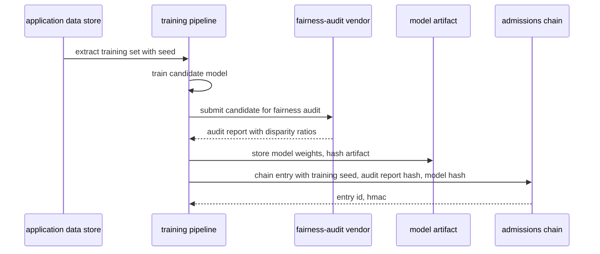

# 🧾 Diary of an Audit Day — Olmstead University

**Engagement:** Multi-framework audit-readiness assessment (FERPA review, NIH research-integrity audit, biennial GLBA audit, upcoming HHS OCR audit at the affiliated medical center)
**Client:** Olmstead University — private R1 research university, upper Midwest. ~28,000 students. ~$1.4B endowment. ~$680M annual research expenditure. Affiliated teaching hospital (Olmstead Medical Center) under shared board, separate compliance office.
**Posture:** TesseraSeal deployed 11 months ago on a single use case — undergraduate admissions AI screening — under a consent-to-resolve framework with a civil-rights firm. Everything else legacy: research computing, Olmstead Medical Center IT, financial aid (GLBA), advancement CRM, IRB system.
**Date:** Wednesday, the day after Pacific Crescent wrapped
**Auditor:** the same eight-person team that walked the diary baseline, Mercator the week after, Northbridge the week after that, then Stelvio, Atrio, Helmstad, and Pacific Crescent
**Spec version under examination:** FFIEC chain-of-custody v1.0b. Verifier invocation runs `--posture=ffiec` per §4.1.2; the verifier binary's release tag and verification key are recorded in the institution's CC8.1 per §10.26.

---

## Context

Olmstead is a private R1 with fourteen schools and colleges. Top-25 medical school. Top-50 law school. Top-50 business school. Substantial engineering school. About fourteen thousand undergraduates and fourteen thousand graduate and professional students. The endowment runs about $1.4B. The annual research take is around $680M — NIH, NSF, DoD, foundation, and industry money in roughly that order.

Olmstead Medical Center sits on the same campus, shares the board, and is a separate legal entity with a separate compliance office. The two organizations share data on the medical-school side — clinical and research data both — and that data-sharing seam is its own audit problem. The medical center carries its own `tenant_id` reservation in the IKM registry per §10.1, separate from the university's; the per-tenant HKDF binding under §4.1 keeps the two cryptographically isolated even when they share a cloud account.

By the time the team arrived at Olmstead, TesseraSeal had been walked through banking, healthcare, BaaS, industrial, biopharma, and utility. Northbridge was now six engagements back — the cleanest one Dawn had run in years, one §10.16 non-conformance and a chain that held byte-for-byte. Dawn had stopped expecting Olmstead to be Northbridge. Higher-ed was a new regulatory composition — FERPA + GLBA + Title IV — but the chain primitive was familiar. The open question for the team was not whether the cryptographic substrate held up under audit pressure — it had, six engagements running — but whether the spec composes cleanly with the higher-ed regulatory stack: admissions AI post-SFFA, financial-aid adverse-action under the GLBA Safeguards Rule, AI-driven academic-integrity decisions, and the learning-management-system mirrors that overlap with student-record systems. Different regulators, different evidentiary standards, same chain shape.

Eleven months ago, an applicant-class disparate-impact threat letter from a civil-rights firm landed on the General Counsel's desk. The letter named the undergraduate admissions AI screening system as the source of the alleged disparity. Olmstead's response — written into the consent-to-resolve framework with the firm — was to put the AI screening system under TesseraSeal: every model score, every reviewer override, every retraining event, every fairness-audit report linked by hash. The chain is the university's principal defense if the firm files suit. The defense rides on the §1.2 epistemic scope: the chain proves what the AI screening system said about an applicant at a specific time, and that the record was not tampered with after capture; it does not prove the admissions decision was right.

Everything else at Olmstead is legacy.

The research-computing side is faculty-led federalism. The HPC cluster is centrally managed; the labs are not. Each PI runs her own lab. Central IT can advise. Central IT cannot enforce. NIH and DoD have started asking questions that central IT does not have the leverage to answer.

The medical center is a separate audit problem. Epic EHR. MyChart. The medical school's research databases overlap with the hospital's clinical systems through documented data-sharing agreements. HIPAA-covered. No chain. The same Epic-side findings the team wrote up at Mercator three weeks ago.

Financial aid is GLBA-covered under the FTC Safeguards Rule. Banner. Mutable. The annual administrative-access review is paper-based.

Advancement uses Salesforce for donor relationship management. Major-gift cultivation notes overwriteable. Same shape as the diary baseline.

The IRB system is a homegrown SQL-backed app on the medical-school side. Protocol amendments are versioned. The audit trail for IRB approvals is in a database that admins can `UPDATE` directly.

Dawn's team was engaged by Dr. Ines Achterberg, Vice Provost for Research Integrity and Compliance. PhD in epidemiology. Sixteen years in higher-ed compliance after a stint at NIH's Office of Research Integrity. The deliverable will be read by the General Counsel, the medical-center compliance office, and the Faculty Senate's research-integrity committee.

Four regulators are watching at once: the Department of Education on the FERPA side (a current OCR complaint from an admitted student about how her data was used to score her), NIH on the research-integrity side, the FTC on the GLBA side, and HHS OCR on the medical-center HIPAA side. Each wants something different. The chain on the admissions side fits one of them.

This is the diary of that day.

---

## Audit Team

- **Dawn** — Lead Auditor (governance and narrative)
- **Raj** — Database specialist
- **Elena** — CRM systems
- **Mike** — Application and API layer
- **Diana** — IAM and access control
- **Luis** — DevOps, logs, pipelines
- **Chen** — Data engineering and ETL
- **Tom** — Internal-audit liaison specialist (visiting team — partners with the client CAE)

Client-side liaison: **Dr. Ines Achterberg**, Vice Provost for Research Integrity and Compliance, Olmstead University. Direct. Politically aware. Knows where the bodies are buried in faculty-led labs without saying so.

---

## 🌅 8:30 AM — Kickoff and the Drive In

Dawn rode in with Tom from the hotel. Twenty minutes north along the lakeshore. The campus came into view through a screen of bare oaks — Romanesque limestone, modern glass on the engineering-quad side, the medical-center towers a half-mile off behind the law school.

Tom had a thermos. Dawn had her usual — black coffee in a travel cup, half gone before they pulled out of the hotel lot.

"Recap me," Tom said. "Just the headline of each one."

"Northbridge — banking, gold standard. Chain across the whole institution. We ran out of things to find by 3 PM."

"Mercator."

"Healthcare. AI imaging chained, claims side mutable. Bifurcated. We wrote the seam down the middle of the report and the CMO understood it instantly."

"Stelvio."

"Manufacturing. AI side chained, OT side legacy, IT business side legacy. Three zones. Maria took the four-second verifier video to her CFO."

"Atrio."

"BaaS multi-tenant. The chain shape was different but the seam was in the same place — between the regulated function and everything around it."

"Helmstad."

"Biopharma. AI eligibility decisioning chained, the rest of the clinical-trial stack mutable. Same shape again, different industry."

"Pacific Crescent."

"Utility. Yesterday. Public-safety stakes. AI on outage prediction chained, OT on the substations and the SCADA legacy. The seam mattered because the regulator there cares about what the AI told the operator and what the operator did with it."

Tom waited. Dawn looked at the limestone tower coming up on the left.

"And today?"

"Today is the higher-education version. AI on a contested decision. Everything else loosely governed by faculty federalism. Different industry, same shape we keep finding."

"What's the wrinkle?"

"Two wrinkles. One — the AI side wasn't deployed because of best-practice. It was deployed because a civil-rights firm sent a threat letter eleven months ago and the chain is the consent-to-resolve framework. That changes the political calculus on every other system in the institution. The chain works because legal demanded it. Nothing else has had legal demand it."

"And two?"

"The medical center is on the same campus, shares the board, and has its own compliance office. We have no jurisdiction there. Ines wants a hallway tour we can write a recommendation off. She is honest about the split."

"What's the recurring line you keep saying?"

Dawn drained her cup. "It never is."

"That one."

"It never is. Sometimes the chain is on the part that's being sued, and that's the only part that needs to be."

They pulled into the visitor lot at 8:24. The morning bell tolled across the quad. Students were walking to 8:30 classes in down jackets.

Ines met them at the badge desk in the administration building. Sweater, slacks, ID lanyard, the kind of handshake that came from sixteen years of compliance briefings she had to deliver before noon.

"Welcome. Coffee is in the conference room. We have a tight day. I would like to start with the admissions AI dashboard, do the database work, IAM, lunch, then a research-computing tour with two lab visits, then reconciliation. The medical-center hallway tour is at four o'clock — I will walk you over personally for thirty minutes."

Dawn smiled. "That's a clean agenda."

"It needs to be. The OCR complaint review is in three weeks. The General Counsel reads my Friday memo. The Faculty Senate research-integrity committee meets next Tuesday. I need to know what is defensible and where the exposure is."

She paused.

"I am going to be straight with you. The admissions chain works. I built that program. The rest of the institution is not under the same regime and will not be for years. I want you to write what is true. I will read it Friday."

Tom nodded. "Same kickoff Maria gave us at Stelvio."

Ines did not smile. "Maria and I were on a panel together in October. We compared notes."

> **🔍 Dawn's note (internal):**
> *Two clients. Same disposition. They ran into each other on a compliance-conference panel and have been comparing notes for six months. The shape we keep finding has names attached to it now. That changes the politics of the report.*

The team filed into the conference room. Ines flipped on the wall display.

---

## 🧩 9:15 AM — The Admissions AI Dashboard

The dashboard lived inside the admissions office's intranet. Ines logged in with her university SSO and re-authed with a hardware key. The dashboard showed four panes — a count of applications scored to date for the current cycle, a fairness-monitoring panel with disparity ratios across protected classes, a reviewer-override panel showing the top reviewers by override volume, and a model-version tracker.

Mike pulled up his laptop. "Pick a decision from this cycle for me."

Ines selected an application from January 9, 2026. The application had been scored at 71. The reviewer had overridden up to 78 with the structured reason code `STRENGTH_OF_RECOMMENDATIONS`. The committee had admitted.

Mike copied the entry ID into his terminal:

```
herald-verify --tenant=olmstead \
              --service=undergrad-admissions-screen \
              --posture=ffiec \
              --date=2026-01-09 \
              --entry-id=2026-01-09-UA-71418
```

Five seconds. The terminal returned:

```
Status: PASS
Step: 12
Reason: chain integrity verified, HMAC recomputed,
        Merkle path resolved, signature verified
        against public key admissions-2026-q1
```

Mike turned the laptop. Dawn read the output. Ines watched without comment. The format matched the §7 normative output contract — three lines, exact field labels, exit code 0 per §10.12.

"Good." Dawn looked at the dashboard again. "Pick one from before the chain went live."

Ines paused. "Eleven months ago — March 2025."

"Pick one from February 2025."

She picked one. The application had been scored, reviewed, and the applicant had been waitlisted.

Mike copied the ID. Ran the verifier.

```
Status: REJECTED
Step: 1
Reason: entry-id not found in chain — chain effective
        date for tenant=olmstead service=undergrad-admissions-screen
        is 2025-05-12
```

Mike nodded. "Pre-deployment. Expected. Documented in the institution's CC8.1 as the chain's effective start date — and the chain-coverage map under §10.19 names the pre-chain period as outside the chain-instrumented boundary, with the institutional-record-retention substrate as the evidentiary substitute."

Ines: "May 12, 2025. The day the consent-to-resolve framework was finalized. The chain went live the same afternoon. The §10.19 map version-stamp is `coverage-map-v1` with `effective_utc=2025-05-12T16:30:00Z`. The `chain.coverage_map_published` operational event re-emits monthly per §10.19 so an 18-month-lookback auditor finds an anchor in any period."

Dawn wrote: *Chain effective date 2025-05-12. Pre-chain decisions are out of scope for chain-based defense per §10.19 chain-coverage map. The threat letter referenced the prior cycle's decisions — those defenses live in the consent-to-resolve framework directly, not in the chain. The §1.2 epistemic-scope line is intact: the chain proves the AI's recorded statements within its effective period, not the institution's pre-chain practice.*

> **✓ Confirmation #1**
> The undergraduate admissions screening chain is live and producing verifiable entries within the current cycle. Mike re-verified a January decision in five seconds with the §7 twelve-step procedure, the §7 normative three-line output format, and the §10.12 exit-code-0 PASS contract. The chain effective date is documented as the day the consent-to-resolve framework was finalized; the §10.19 chain-coverage map names the pre-chain period as out of scope and emits a `chain.coverage_map_published` event monthly so a future auditor finds the boundary anchored on the chain itself rather than asserted in a separate document. The verifier rejects pre-effective entries by design rather than fabricating a result, consistent with the §10.12 exit-code-2 structural-input-error contract.

Ines walked them through the chain payload. Applicant hash — FERPA-de-identified at the screening boundary, the cleartext applicant ID lives in Slate. Model ID. Model version. Score zero to a hundred. Confidence. Top five SHAP feature attributions. Reviewer ID. Override decision — accept-AI, override-up, override-down, refer-committee. Override reason code from a controlled vocabulary.

Mike asked the next question because he had been holding it since he saw the schema.

"You're emitting `audit.underwriting.features.*`?"

"By analogy. The §4.4.5 feature-vector family was specified for state-DOI insurance underwriting; we treat admissions screening as the higher-education analog and emit `audit.underwriting.features.feature_vector_hash`, `feature_store_version`, `feature_categories`, and `protected_class_proxy_flags` on every screening entry. CC8.1 names the analogy and cross-references §4.4.5 per §10.18. A Department of Education OCR examiner reads the feature categories without parsing free-form `gen_ai_parameters`. The same admissions story works for the disparate-impact litigation defense."

Mike wrote: *Underwriting-features-by-analogy is a credible fit for admissions AI per §4.4.5 + §10.18 cross-referencing. The feature categories give the OCR examiner mechanical readability.*

Mike ran his finger across the screen. "Where is the free-text override rationale?"

Ines's face shifted half a degree. "Slate."

"Slate the admissions CRM."

"Slate. The reviewer types the rationale into a free-text field in the applicant record. The field has a 30-day edit history in Slate. Past 30 days, prior versions are not retained."

Mike's pen paused over his notebook. "And that field is overwriteable indefinitely."

"Yes."

"The chain has the override decision and the reason code. The chain does not have the rationale free-text."

"Correct."

Dawn wrote: *Chain captures the structured override decision and the §10.11.1-shaped `audit.ecoa.adverse_action.reasons` analog (here under the institution's CC8.1-named admissions-decisions taxonomy). Free-text rationale lives in Slate. 30-day field history. Indefinitely overwriteable. Watch this — this will be the legally interesting gap when the team gets to reconciliation at three.*

> **⚠️ Surprise #1**
> The override-rationale free-text — the reviewer's actual reasoning for changing the AI score — lives in Slate, not in the chain. Slate retains 30 days of field history; past 30 days, prior versions are not preserved. The chain captures the structured override decision and the reason code; the structured shape mirrors the §10.11.1 `audit.ecoa.adverse_action.reasons` array discipline (controlled vocabulary, explanation-method named, integrity-bound). It does not capture what the reviewer wrote into the free-text field. Per §10.19, the chain-coverage map MUST name Slate explicitly as a SaaS-edge system whose free-text rationale field is OUTSIDE the chain-instrumented boundary; the map MUST also name the evidentiary substitute (Slate's 30-day field history) and the institution's posture at the boundary. The map is currently incomplete on this field — a §10.19 map-completeness gap, separate from the underlying capture gap.

Ines did not push back. "I have flagged this internally. The Slate integration was scoped to webhook the structured fields only. The free-text was deferred."

"Deferred to when?"

"Phase 2."

"Funded?"

"Not yet."

Dawn wrote: *Same structure as Stelvio. Phase 2 unfunded. The thing that needs the chain is the thing that does not have it. The §10.19 map-completeness gap is closable with a one-line addition naming Slate's 30-day window as the substrate and the Phase-2 webhook as the planned remediation. The substrate gap (Slate retention) is not closable by documentation alone — it is the actual capture-coverage gap and tracks separately.*

The team split.

---

## 🧠 10:00 AM — Database Deep Dive

Raj had the corner of the conference table and three screens. The admissions ledger on one. Banner financial-aid on another. The IRB SQL backend on the third. The advancement CRM Salesforce backend was on a fourth tab in a browser window.

Four mutability profiles. Four audiences. He worked them in order.

### The admissions ledger

Append-only by design per §10.3 — application-level (no UPDATE/DELETE in the codebase) and database-role-level (the writer role is granted INSERT and SELECT only; UPDATE, DELETE, and TRUNCATE are revoked). Per §6, storage preserves every chain-stamp field verbatim and never round-trips through any lossy transformation; the file format header per §4.4 is the first line of every persisted file, the verifier rejects any file whose last byte is not `\n` per §4.1's mid-write truncation refusal. The Vidimus SDK signs each entry per §4.1 Primitive 1: HMAC-SHA-256 over the canonical bytes, with HKDF-per-tenant key binding per §4.1's `info_for_tenant = HKDF_INFO_BASE || "|" || utf8(tenant_id)` discipline. Daily Ed25519 seals on AWS CloudHSM in `us-east-2` per §10.5 (FIPS 140-2 Level 3, non-extractable private key, separation of duties between seal-job operator and HSM administrator). The HKDF salt and info constants are the §4.1 FFIEC values; `posture=ffiec` per §4.1.2; `hkdf_inputs_digest` is recorded on the audit-file header and on every seal record so a verifier reading any file pre-flights the constants per §7 step 2. Application hosts and ledger servers are NTP-synchronized per §10.4; `mac_computed_at_utc` is forensic and the verifier does not trust it for security decisions.

Raj picked a random entry from three weeks ago. Verified.

```
Status: PASS
Step: 12
```

He picked the very first entry from May 12, 2025. Verified. PASS.

He attempted a direct UPDATE on the chain table. The database accepted it because nothing at the database layer prevents it — but the chain's defense is layered, not database-only. The HMAC-chained `payload_hash` per §4.1 catches single-entry tamper at the per-event MAC layer (§7 step 9). He ran the verifier on the next entry.

```
Status: FAIL
Step: 4
Reason: HMAC mismatch — entry payload does not produce
        the chained HMAC recorded in entry N+1
```

He attempted a multi-entry rewrite. The verifier failed at the daily seal per §4.2 RFC 6962 Merkle construction:

```
Status: FAIL
Step: 9
Reason: Merkle root mismatch — recomputed root does not
        match sealed root for date 2025-11-18
```

Raj rolled back the mutations. The chain returned to PASS. He noted the test in his workbook.

> **✓ Confirmation #2**
> The admissions-side ledger is append-only in practice and at multiple defense layers. Direct database mutation is technically possible — the Postgres backend is mutable like any Postgres backend — but per §1.4 compositional security the verifier catches single-entry tamper at the §4.1 HMAC layer (§7 step 9) and multi-entry tamper at the §4.2 Merkle/seal layer (§7 step 10). The Ed25519 daily seal under §4.3 is on AWS CloudHSM in `us-east-2` per §10.5; the database engineers do not have HSM access; the §1.1 three-layer compromise model is intact. The split is real. Per §10.3 the writer role has INSERT+SELECT only; the chain's database-level append-only enforcement is defense-in-depth on top of the cryptographic layer, not the load-bearing defense.

### The Banner financial-aid backend

Raj opened Banner. SQL Server. He had read-only access through Ines's audit role.

He pulled the schema for `SFAREGS` and `RPRAWRD`. Award records. He ran a query against the audit-log configuration.

Audit logging was enabled. Retention was set to 90 days.

He picked a random award record from the current academic year. Looked at the change history.

The history showed the award amount edited twice in the last quarter. Two different counselor IDs. The reason codes were both `ADMINISTRATIVE_ADJUSTMENT`. No free-text justification.

"And the original award amount?"

Ines pulled up the record. "The chain of edits is visible. The original is the row at the top of the change-history list."

"For records edited within the 90-day window."

"Yes."

"Records edited before the 90-day window — the prior values are gone."

"Correct."

Raj wrote: *Banner audit-log retention 90 days. Original values older than 90 days not preserved. GLBA Safeguards Rule 2023 update expects 'audit and oversight' of administrative access — the audit configuration is on, the retention is short. There is no chain on Banner. The §10.13 evidentiary-artifacts retention guidance does not apply because Banner is not chain-instrumented; the retention floor here is set by Banner's own configuration plus the institution's GLBA retention policy, not by the chain.*

> **⚠️ Surprise #2**
> The Banner financial-aid audit log is configured but retention is 90 days. Award amounts can be edited; the change history is preserved within the 90-day window and overwritten after. For an academic year that runs longer than 90 days, edits to a fall award visible in early spring will have lost their original values by the time the GLBA biennial audit runs. Banner is named in the §10.19 chain-coverage map under "institutional systems not yet chain-instrumented" with the evidentiary substitute named (the 90-day audit log, the institution's GLBA-mandated retention schedule, and counselor-action access logs). Without chain instrumentation, no §4.1 HMAC, no §4.2 Merkle seal, no §10.3 cryptographic append-only enforcement — the substrate's integrity is whatever Banner's database role discipline can sustain. The map's named-substitute discipline is what keeps this from being a hidden gap; the gap itself is real and is the GLBA biennial audit's forcing function.

### The IRB SQL backend

Raj opened the IRB system. Homegrown app on the medical-school side. SQL Server backend.

The schema had `irb_protocol`, `irb_amendment`, `irb_approval`, and `irb_audit_log`. Protocol amendments were versioned — each amendment was a row, with a reference to the prior amendment. The approval table was different. Each approval was a single row with a status field — `pending`, `approved`, `expired` — and a `last_modified_by` and `last_modified_at`.

Raj asked Ines, "Who can edit the approval table directly?"

She paused. "The medical-center compliance office maintains this system. I would have to ask them."

"Best guess?"

"The system administrator. There is one named system administrator. There is also a service account that the application uses. I do not know if there are other accounts with write access."

"Have any IRB-approval records been edited in the past year?"

"I do not know."

Raj waited.

Ines looked at the screen. "I will ask. I will not have the answer today."

He wrote: *IRB approval table — single-row, last-modified-by/at columns, mutable. Compliance office on medical-center side maintains. Cross-organization. Out of Ines's direct reach. The §10.19 chain-coverage map needs to name the IRB system explicitly with its substitute (the audit_log table, the medical-center compliance office's procedure) and an honest "out of contractual inspection reach" classification for the parts the university does not control directly. Document and recommend the question be asked.*

> **⚠️ Surprise #3**
> The IRB approval audit trail is in a homegrown SQL database on the medical-school side. The approval table is a single row per protocol with `last_modified_by` and `last_modified_at` columns — mutable by anyone with database write access. The medical-center compliance office maintains the system. Per §10.19 the chain-coverage map MUST name systems "operated by third parties (or affiliates) where the institution does not have full contractual inspection reach"; the IRB system fits there even though the medical center is an affiliate, not an arms-length third party. Ines does not know whether IRB-approval records have been edited in the past year and cannot answer today. Closing this gap structurally requires either chain-instrumenting the IRB system (a Phase-3 effort the medical-center compliance office would have to fund) or naming the medical-center compliance office's audit procedure as the substitute and binding the substitute under a §10.19-style "external evidentiary artifact" hash anchor (`audit.external_artifact.kind = "irb_approval_audit_extract"`).

### The advancement CRM (Salesforce)

Raj opened the Salesforce backend. Opportunity records for major-gift cultivation. He pulled a record at random.

Field history was enabled on the financial fields — committed amount, payment schedule, fund designation. Field history was not enabled on the cultivation-notes field — the long free-text where development officers documented their conversations with prospects.

Raj asked Elena to pick this one up. She nodded.

> **⚠️ Surprise #4**
> The advancement CRM in Salesforce has field history enabled on financial fields but not on the cultivation-notes free-text field. Development-officer conversation notes are overwriteable indefinitely with no version history. Same pattern as the diary baseline two months ago. Salesforce is not chain-instrumented at Olmstead — there is no §4.4.6 SaaS-edge connector emitting `audit.connector_source.system = "salesforce-cdc"` for this surface. Per §10.19 the chain-coverage map names Salesforce as an institutional system not yet chain-instrumented; the institutional substitute for the cultivation-notes field is "Salesforce field history (configurable; not currently enabled on this field)." That is the honest map entry. It is not a chain integrity gap — the chain does not reach this surface — but it is a control-coverage gap the §10.19 map surfaces by design.

Raj closed his three screens. He stacked the workbook page.

Four backends. Four mutability profiles. Four audiences:

- Admissions ledger — immutable in practice. FERPA's audience. §10.3 enforcement at both layers, §4.1 + §4.2 + §4.3 cryptographic integrity, §10.5 HSM custody.
- Banner — auditable for 90 days, mutable past that. GLBA's audience. Out of chain scope per §10.19 with named substitute.
- IRB approval — mutable, cross-organization governance. NIH's audience and the IRB itself. Out of chain reach per §10.19 with substitute that is itself contested (medical-center compliance office).
- Advancement CRM — mutable, no version history on the field that matters. Donor-relations governance, not regulatory. Out of chain scope per §10.19; not in regulator scope today.

He wrote at the bottom of the page: *One chain. Three legacy backends. Each backend speaks to a different regulator. The chain answers one question. The other three do not. The §10.19 map is the document that says so honestly. Without it, every legacy backend looks like a hidden gap; with it, they are named, accounted for, and tracked.*

---

## 🔐 11:00 AM — IAM Review (Four Columns)

Diana had a workbook with four columns this time, not three. Admissions AI. Banner. Slate. Salesforce advancement. She filled them in order.

### Admissions AI side

Every credential the admissions screening service used — database creds for the chain backing store, S3 creds for the model artifacts and fairness-audit reports, the AWS CloudHSM PIN for the daily seal — every rotation was a chain entry under `chain_kind = "operational"` per §3 enumeration. The events match the §10.2 operational-events list: `master_key.rotated` and `credential.rotated` patterns with rotator identity, rotation reason, and the new key fingerprint.

Diana picked the last six rotations. Verified each. All PASS.

She ran:

```
herald-verify --tenant=olmstead \
              --service=undergrad-admissions-screen \
              --posture=ffiec \
              --event-type=credential.rotated \
              --date-range=2025-05-12:2026-04-09
```

Eleven entries returned across the eleven months. Quarterly rotations on database creds. Two ad-hoc rotations on S3 keys after personnel changes. All PASS.

She also confirmed the IKM minimum and provenance discipline. Per §10.6, the IKM is at least 32 bytes; per §10.6.1, the IKM was generated under AWS CloudHSM's internal CSPRNG (HSM-internal RNG pattern, the highest-assurance posture) and the `master_key.generated` operational event records the RNG type as `"hsm.cloudhsm-classic"`. Per §10.7, the software-key adapter is compile-time excluded from the production binary; production seals carry `kms_handle_uri="aws-kms:arn:..."` and never `"plaintext-dev"`. Per §10.9, IKM-generation retirement is coupled to chain-entry retention — the institution does not retire any `key_version` while entries that reference it are still retained.

> **✓ Confirmation #3**
> Credential rotation on the admissions screening service is captured in the chain with rotator identity, fingerprint, and reason per §10.2 operational events. Eleven rotations across eleven months. All verifier PASS. Multi-factor authentication on every service account that accesses the chain. The IAM under the AI service is chain-coupled. The §10.1 key-fingerprint reconciliation runs weekly per the institution's CC8.1; `unmatched_count` has been zero across the eleven-month window. The §10.6 IKM-length minimum, §10.6.1 RNG posture, §10.7 production-adapter exclusion, and §10.9 retirement-coupling discipline are all confirmed in artifact form rather than asserted in documentation.

### Banner financial-aid IAM

Diana asked Ines to log in to the Banner counselor workstation that financial-aid staff used during peak FAFSA season.

The login was through the university SSO. Diana checked the user roster. There were 23 financial-aid counselors with individual accounts. There was also one shared account: `aid_admin`.

"Who uses `aid_admin`?"

Ines: "During peak season — January through April — counselors use it for batch operations. Loading FAFSA imports, generating award letters, running aid-package recalculations."

"How many people know the password?"

"Six? Seven? I would have to ask the financial-aid office."

"MFA?"

"On the SSO, yes. On `aid_admin`, no — it bypasses SSO because it is a service account for batch jobs. Counselors keystroke-paste the password from a shared password manager."

"Last password rotation?"

"I do not know offhand."

Diana wrote: *Shared account during peak season. SSO bypass. Six or seven counselors keystroke-pasting from a shared password manager. Same shape as the Stelvio `Plant_Engineer` shared account. Different industry, same compounding risk. Banner is out of chain scope per §10.19 — there is no §4.1 HMAC-bound capture of the actions taken under `aid_admin`, and no §10.2 `credential.rotated` operational event because the credential lives outside the chain. The audit log inside Banner records the actions; the binding from action to specific human is operational discipline only.*

> **⚠️ Surprise #5**
> The Banner financial-aid system has a shared `aid_admin` account used during peak FAFSA season for batch operations. The account bypasses university SSO. Six or seven counselors share the password through a shared password manager. The last rotation date is not known offhand. GLBA Safeguards Rule 2023 update requires "audit and oversight" of administrative access — the audit log records actions taken under `aid_admin`, but the account binding to a specific human is operational discipline, not technical enforcement. Because Banner is out of chain scope per §10.19, there is no cryptographic substrate to lean on; the §10.3 append-only enforcement does not extend here. The substitute named in the §10.19 map is the SSO audit log plus the Banner audit log plus paper-based access reviews; the substitute is weaker than the chain by every measure that matters.

### Slate (admissions CRM)

Slate was per-counselor SSO with MFA. Diana checked.

Then she found the bypass. The admissions office had documented an SSO-bypass for "admissions readers traveling overseas during the holiday application-reading period" — counselors stationed in Europe and Asia who reviewed early applications. The bypass was a static-token authentication that did not require MFA.

"How many counselors used the bypass last year?"

Ines pulled up the access log. Eleven.

"Is the static token rotated?"

"Annually."

"And the bypass is documented?"

"Yes. There's a memo. Approved by the Director of Admissions and the CISO."

Diana wrote: *Bypass is documented. Bypass exists. Token rotation is annual. The bypass weakens MFA enforcement on an audience that includes the admissions readers who are doing the override decisions in the chain. The override decisions ARE chain-bound under §4.1; the IAM that controls who-the-reviewer-is upstream of those overrides is partially weakened by the bypass. The chain proves what reviewer R-48117 did; it does not prove that reviewer R-48117 was the human at the keyboard during the bypass window. Document — this is upstream of capture, not a chain integrity gap.*

> **⚠️ Surprise #6**
> Slate has a documented SSO-bypass for admissions readers traveling overseas. Static-token authentication. No MFA on the bypass path. Token rotated annually. Eleven counselors used the bypass last year. The bypass is documented and approved, but it weakens the IAM posture on the audience whose override decisions are the chained artifact. The §1.2 epistemic-scope line applies cleanly here — the chain proves the recorded reviewer ID committed an override at the recorded time; it does not prove that the human behind reviewer-ID R-48117 was the same human throughout the bypass window. That property is upstream-of-capture and is the institution's IAM posture's responsibility, not the chain's.

### Salesforce advancement IAM

Per-user accounts with SSO and MFA. Field-level security enforced. The development officers' access matched their portfolio assignments.

The IAM on the advancement side was the cleanest of the four. The data being protected was the weakness — the cultivation notes field had no field history, so the IAM controls protected access to a record whose contents could be silently overwritten.

Diana wrote: *Salesforce IAM clean. The mutability of the protected data is the gap, not the access control. Per §10.19 this is the surface where the chain does not reach; per §1.2 epistemic scope, the chain (if it did reach here) would prove what a development officer wrote at time T but not whether the cultivation notes are accurate, useful, or unbiased. The mutability gap is operational, not a chain integrity gap.*

She stacked the four columns.

Admissions AI — chain-coupled rotation history per §10.2; IKM custody per §10.5; reconciliation per §10.1.
Banner — shared account during peak season, SSO bypass on the shared account; out of chain scope per §10.19.
Slate — per-user with documented bypass; partially out of chain scope per §10.19 (the structured override fields ARE chain-bound, the free-text rationale is NOT).
Salesforce — clean IAM, weak data integrity; out of chain scope per §10.19.

Four columns. Four shapes. The AI column had the strongest IAM, because the chain forced the cleanup. The others had whatever they had when nobody forced them to look.

She wrote at the bottom of the page: *Same finding as Stelvio. Where the chain is wired in, IAM behaves. Where it is not, IAM is whatever the operations team can sustain without enforcement. The §10.19 chain-coverage map is the tool that lets the institution name "the chain is not here, here is the substitute, here is the residual risk" honestly. Without the map, the institution has nothing to point at when the regulator asks "why is this surface different?"*

---

## 🧪 12:00 PM — Lunch (Reporting Frame)

The catering was in the small dining room across from the conference room. Soup and sandwiches. Coffee that was actually warm.

Dawn and Tom took a corner. The rest of the team ate at the long table.

Dawn unwrapped a turkey-and-swiss. "Tom. The reporting frame."

Tom set his soup spoon down. "Each of these gaps is in a different regulator's house."

"Which means?"

"Which means we map findings per-regulator. FERPA gets the admissions-side report. GLBA gets the financial-aid report. NIH gets the research-integrity report. HHS OCR gets the medical-center hallway-tour informal advisory. Civil-rights litigation defense gets a separate addendum because it cuts across FERPA and across the override-rationale gap."

Dawn ate. Chewed. "Five reports out of one engagement."

"Five sections of one report. One severity scale. Five regulator audiences. Each section ends with a per-regulator summary. The General Counsel reads the whole thing. Each compliance lead reads their section."

"Phase prioritization?"

"Phase 2 closes the override-rationale gap. That's the litigation exposure. The §10.19 chain-coverage map gets updated in the same Phase-2 cycle to name Slate's free-text field explicitly with the planned remediation. Everything else is on a longer timeline."

"Five years for the rest?"

"Three to five. NIH and DoD will force the research-computing piece in the next two cycles. HIPAA the medical center is on its own schedule. GLBA the financial aid is biennial — the next audit is the forcing function. Slate is twelve months."

Dawn took a bite. Looked out the dining-room window at the quad. Two students were arguing about something on the steps of the library, gesticulating, laughing.

"Tom."

"Yeah."

"Ines told me on the prep call that the civil-rights firm's threat letter pointed specifically at override-down decisions for applicants whose AI score would have admitted them. That's the suspect class."

"You think the reconciliation test today is going to find one."

"I think the reconciliation test is going to find more than one. And I think the rationale fields on those records are going to be the legally interesting part."

"Twenty bucks."

"You're on."

They finished lunch in twelve minutes.

---

## 🔄 1:00 PM — API Layer Inspection

Mike pulled up the admissions screening service's API logs. He had a tail on the chain stream and a tail on the Slate webhook stream.

```
herald-tail --tenant=olmstead \
            --service=undergrad-admissions-screen \
            --follow --since=now
```

A reader was working through applications in real time. The screening service was returning scores. Mike watched a sequence.

```
[2026-04-09T13:14:22.317Z] entry_id=2026-04-09-UA-19044
  service=undergrad-admissions-screen tenant=olmstead
  chain_kind=audit
  event=applicant.scored
  applicant_hash=a4f1...c92e
  model_id=admissions-readiness-v2.1
  model_version=2026-Q1
  gen_ai.request.model=admissions-readiness-v2.1
  gen_ai.response.model=admissions-readiness-v2.1
  audit.deployment.intent=production
  audit.deployment.policy_version=admissions-2026-q1
  audit.underwriting.features.feature_vector_hash=8a91...
  audit.underwriting.features.feature_categories=[
      "gpa_weighted","course_rigor","essay_voice",
      "recommendation_strength","extracurricular_depth"]
  score=68 confidence=0.82
  shap_top5=[gpa_weighted:0.31, course_rigor:0.18,
             essay_voice:0.11, recommendation_strength:0.09,
             extracurricular_depth:0.07]
```

Mike paused on three lines.

"`gen_ai.request.model` and `gen_ai.response.model` both populated."

"Per §4.4 — both are REQUIRED on any chain entry that represents a model call. The SDK refuses to emit at SDK-write time if either is missing or empty. The §7 step 12a verifier check is defense-in-depth on the same property. We have never had an entry fail 12a; the SDK-side refusal closes the source."

"And the `audit.deployment.intent`?"

"Per §4.4.2. Production. Single-version, single-region. We do not run A/B tests on admissions screening — the consent-to-resolve framework forbids it. If we ever introduce a canary, the §4.4.2 schema requires `audit.deployment.canary_traffic_pct` on every canary entry; the policy-version field is REQUIRED whenever any `audit.deployment.*` attribute is present. CC8.1 names the single-version posture and references §4.4.2 per §10.18."

"Routing per §4.4.1?"

"Single-provider deployment. The screening model is hosted in-house — no LLM provider failover, no circuit breaker, no cost routing. Per §4.4.1's single-provider clause, the schema is conformant by being silent; CC8.1 names the deployment as single-provider and explains the absence of routing chain entries. If the institution ever introduces a multi-provider posture, the §4.4.1 schema kicks in — `audit.routing.attempt`, `audit.routing.success`, `audit.routing.failover`, `audit.routing.refused`, `audit.routing.classifier_output` — and CC8.1 updates accordingly per §10.18."

Two minutes later:

```
[2026-04-09T13:16:48.802Z] entry_id=2026-04-09-UA-19045
  chain_kind=audit
  event=reviewer.override
  applicant_hash=a4f1...c92e
  reviewer_id=R-48117
  override_decision=override-up
  override_reason_code=STRENGTH_OF_RECOMMENDATIONS
  parent_run_id=2026-04-09-UA-19044
  parent_seq=1
  audit.redaction.policy_id=ferpa-screening-v3
  audit.redaction.policy_version=2026-q1
  audit.redaction.disposition=redacted_at_sdk
  audit.redaction.redacted_field_paths=[
      "$.audit.applicant.legal_name",
      "$.audit.applicant.email"]
  audit.redaction.redaction_method=[
      "sha256_hash", "deterministic_token"]
```

Mike pointed at the redaction attributes. "§10.22 family. Pre-MAC at the SDK boundary."

"Right. The captured JSON IS the redacted form per §10.22's posture statement; the legal name and email are hashed and tokenized before the canonical bytes are computed, so the per-event MAC covers the redacted content. Post-MAC sidecar redaction is non-conformant unless it is a parent-anchored sidecar per §10.22 — we do not operate one. The redaction policy version is bound under the MAC; the OCR examiner reading the chain reads what was redacted from the chain itself rather than inferring it from CC8.1."

Mike pointed at the chain entry. "Override-up. Reason code in the chain. Reason free-text — let's see."

He flipped to the Slate webhook log. The webhook fired for the structured override fields. There was no webhook for the rationale field. The rationale lived in Slate's own database, accessible through Slate's own API, not chained.

Mike paused on the connector configuration. Slate is the SaaS-edge surface; the institution operates a Slate webhook mirror connector. Per §4.4.6, every chain entry produced by a SaaS-edge mirror connector MUST carry the `audit.connector_source.*` family — `system`, `replay_id`, `commit_timestamp`, `commit_user`, `lag_observed_ms`, `change_kind`. Per §4.4.6's stable-`run_id` discipline, the connector MUST derive `run_id` from a stable source-side identifier (the Slate applicant record ID) rather than a per-process UUID. Mike confirmed both: the entries carried `audit.connector_source.system="slate-webhook-v1"`, the `run_id` matched the Slate applicant record ID across the connector restarts the institution had logged.

He pulled up the Slate connector's CC8.1 description and the operational runbook. Per §10.16, a SaaS-edge mirror connector's runbook MUST quantify lag with four numbers — median, 95th-percentile SLO, alerting threshold, RTO — by number, never by adjective. Imprecise wording like "near real-time" is a non-conformance per the §10.16 severity-classification clause; the engagement team has no discretion to downgrade.

The Olmstead runbook named the four numbers: median 4.2 seconds, 95th-percentile SLO 30 seconds, alerting threshold 60 seconds, RTO 15 minutes. The connector emits `connector.lag_observation` operational events every 60 seconds per §10.16; Mike sampled the last 24 hours of observations and the 95th-percentile lag stayed at 18 seconds, well inside the SLO.

Mike wrote: *§4.4.6 connector-source attribution complete; §4.4.6 stable-run_id discipline confirmed; §10.16 four-number runbook quantification compliant; §10.16 lag observations within SLO. The Slate webhook connector itself is conformant. The non-conformance is upstream — the rationale field is not webhooked at all.*

He flipped to the rationale field's behavior.

"So for 30 days the prior versions of this rationale are recoverable from Slate."

"Yes."

"And after 30 days, only the current version remains."

"Yes."

Mike wrote: *Slate webhook covers structured fields including the §4.4.6 attribution. The free-text rationale is in Slate's own database. Slate field-history is 30 days. The chain is upstream of the rationale — strictly speaking the chain is upstream of Slate's webhook, and the webhook is upstream of the rationale field. The capture-coverage gap sits inside Slate, outside the chain's reach by current configuration.*

> **⚠️ Surprise #7**
> The Slate webhook into the chain covers the structured override fields — decision, reason code, reviewer ID — and carries the §4.4.6 SaaS-edge connector-source attribution family with the stable-`run_id` discipline. The webhook itself is conformant per §4.4.6 and per §10.16 (the lag bounds are quantified, the connector emits lag observations on cadence, the SLO is met). The free-text rationale field, however, is not webhooked. Slate retains 30 days of field-history snapshots for that field; past 30 days, prior versions are gone. The chain has no view of the rationale at any point — current or historical. The §10.19 chain-coverage map MUST name this field explicitly, with the 30-day Slate field-history named as the substitute and the Phase-2 webhook-the-rationale change named as the planned remediation. The map currently does not name the field; that is a §10.19 map-completeness gap separate from the underlying capture-coverage gap.

Mike kept going. He checked the Slate API for the rationale field on five applications from the past week. The field was readable. The field-history endpoint was readable.

He made a note: *Phase 2 line-item. Webhook the rationale field on edit. Even without chaining the field, capturing every edit at the chain boundary closes the historical-rationale gap. This is engineering effort, not architecture. Concurrent with Phase 2: extend the §10.19 chain-coverage map to name the field; update CC8.1 per §10.18 to reference §10.19 + §4.4.6 explicitly.*

He wrote in his workbook the recommendation that the team would put in the report.

---

## 🧬 2:00 PM — Pipeline Reality (Training Pipeline + Research Computing)

The team split. Chen went to the screening-model training pipeline. Luis and Diana went on the research-computing tour with Ines.

### The training pipeline

Chen pulled up the model-training pipeline. The screening model was retrained quarterly on a fresh slice of the prior cycle's data, validated against a fairness audit, and signed off by the admissions office plus an external fairness-audit vendor before deployment.

He drew the flow on the conference-room whiteboard.



Chen pointed at the third arrow. "The fairness-audit report is hashed and the hash is in the chain entry. Per §10.21 the entry uses the `audit.model_handover.*` family — `provider`, `model_id`, `model_version`, `model_artifact_sha256`, `model_card_sha256`, `fairness_audit_report_sha256`. The fairness-audit vendor is the cross-vendor provider; the chain entry is the deployer's handover record. If the audit report is altered, the SHA-256 mismatches and a verifier with the report bytes detects the substitution mechanically. The §10.20 training-data retention floor is also bound — `audit.model_handover.training_data_retention_floor_days = 540`, which is 18 months, set to match the longest active deployment window of any model trained on the data plus a 90-day investigation buffer."

He pointed at the contract attributes. "Per Round-17 M&A-G2, the entry also carries `audit.model_handover.contract_id`, `contract_version`, `contract_hash_sha256` — the data-processing addendum the institution signed with the fairness-audit vendor. The acquirer-side use case here is hypothetical (Olmstead is not for sale) but the discipline closes the post-close audit question 'which contract version governed this delivery?' from the chain alone."

He pulled up the most recent retraining event — January 14, 2026. Verified.

```
Status: PASS
Step: 12
Reason: chain integrity verified, HMAC recomputed,
        Merkle path resolved, signature verified
        against public key admissions-2026-q1
```

He rehashed the audit report PDF in S3. The hash matched the chain entry per `audit.model_handover.fairness_audit_report_sha256`.

He pulled up the model artifact. Hashed it. Matched per `audit.model_handover.model_artifact_sha256`.

He pulled up the prior retraining — October 2025. Verified. Audit report hash matched. Model hash matched. The §10.20 retention floor was honored — the fairness-audit vendor retained the training-data shards for 540 days; a regression detected after deployment could be traced back to its training-data root cause within the deployment window.

He went back further — July 2025, May 2025. All PASS. All hashes matched.

Four retraining events. Four fairness audits. Four chain entries under `audit.model_handover.*`. Each linked the training seed, the model artifact hash, and the fairness-audit report hash. Each verified.

> **✓ Confirmation #4**
> The training pipeline integrity for the admissions screening model is the cleanest the team has seen at a university. Quarterly retraining. Fairness audit by external vendor for each retraining bound under §10.21 cross-vendor handover schema (`provider`, `model_id`, `model_version`, `model_artifact_sha256`, `model_card_sha256`, `fairness_audit_report_sha256`). §10.20 training-data retention floor honored at 540 days, longer than the active deployment window plus the 90-day investigation buffer. Round-17 M&A-G2 contract binding present (`contract_id`, `contract_version`, `contract_hash_sha256`). Four retraining events sampled across eleven months. All PASS. All hashes match. The disparate-impact threat letter forced this discipline up front, and it shows in the artifacts. The §1.2 epistemic-scope line is intact: the chain proves the model artifact and the fairness-audit report were exactly what the chain says they were at the moment of deployment; whether the model is fair is what the fairness audit itself says, separate evidence.

Chen wrote in his workbook: *Best training-pipeline integrity I have seen at a university. It is because they had to defend it in advance. The §10.20/§10.21 discipline is what makes the disparate-impact-defense story complete — without the training-data retention floor, a regression detected six months out could not be traced back to the training shards that drove it.*

### The research-computing tour

Luis and Diana went with Ines across the quad to the engineering and biological-sciences buildings. Two lab visits. Forty-five minutes total.

**Lab A — microbiology, biological sciences building.**

The PI was a senior microbiologist. NIH-funded. Two postdocs and three graduate students. The lab kept code in a university-managed GitLab. Experimental data was snapshotted nightly to a campus institutional-data bucket. Each experimental run was tagged by date and protocol version. The PI walked Luis through the snapshot policy. Luis nodded.

"You version your data."

"We version our data. The institutional snapshot policy is documented. Every PhD in this lab knows the rule. We retain three years of nightly snapshots."

"And the snapshots are immutable?"

"S3 with versioning enabled. Object lock for the past 18 months."

Luis wrote: *Lab A is the well-run case. Code in GitLab. Data snapshots nightly. Object lock on 18 months of snapshots. Tagging convention by date and protocol version. This is what compliance looks like when the PI cares. The lab is not chain-instrumented per §4.1 — there is no per-event HMAC on experimental records — but the institutional-substitute discipline named in the §10.19 map (object lock + nightly snapshot retention + protocol-version tagging) is credible. NIH research-integrity expectations are met by the substitute, not by the chain.*

> **✓ Confirmation #5**
> Lab A — microbiology — runs a research-computing operation that meets NIH research-integrity expectations through the §10.19 chain-coverage map's "institutional systems not yet chain-instrumented" category with a credible substitute: code in version control, data snapshots nightly to an immutable bucket, 18 months of object-locked retention, tagging by date and protocol version. This is achievable at the lab level when the PI prioritizes it. The substrate is not the chain — there is no §4.1 MAC on experimental records — but the substitute is credible enough that the chain-coverage map can name it honestly under §10.19's "institutional substrate" category.

**Lab B — quantitative finance, business school.**

Different building. Different culture. The PI was a finance professor with two co-PIs and four PhDs. The lab ran on a single Linux server in a closet behind a grad-student bullpen. Diana logged in over SSH using credentials Ines had been given for the audit.

The login prompt did not ask for a username. It asked for a password. The username was hardcoded — `qfin_lab`.

"Shared account."

The PI nodded. "Six of us use it. Same password."

Diana asked, "How long has this password been the same?"

"I don't know."

Luis pulled `last` on the server. The login history showed two thousand eight hundred sessions in the past year, all from `qfin_lab`. Different IPs. Different times of day. No way to tell which human was logged in at any given moment.

Luis: "Where is the working data?"

The PI pointed at the server. "Some of it is on `/data`. The current working set is on a USB drive in my office."

"USB drive."

"It's backed up."

"To?"

"My laptop."

Luis wrote: *Lab B is the median case. Shared password to a Linux server. Two PIs, four PhDs, all logged in as the same user. Working data on a USB drive in the PI's office, backed up to the PI's laptop. No version control. NIH and DoD expectations are not met. There is no §10.19 substitute that names this honestly — the lab does not have one — and the §10.19 map in its current form does not enumerate Lab B specifically. That is itself a §10.19 map-completeness gap separate from the lab's underlying control gap.*

> **⚠️ Surprise #8**
> Lab B — quantitative finance — runs a single shared `qfin_lab` Linux account that two PIs and four PhDs all log in as. Working data lives on a USB drive in the PI's office, backed up to the PI's laptop. No version control. No snapshots. No tagging. Twenty-eight hundred login sessions in the past year, all under the same shared identity. This is the median case for faculty-led labs at Olmstead, not the exception. Per §10.19 the chain-coverage map MUST enumerate institutional systems not yet chain-instrumented and name the substitute or the absence of a substitute; Lab B's surface today has no credible substitute, and naming that absence honestly in the map is itself a control element. The §1.2 epistemic-scope line cuts here too: even if the chain did reach Lab B, it would prove what the lab recorded, not whether the research is sound. The integrity gap is operational and procedural; the chain's epistemic scope is narrower than the research-integrity question NIH actually asks.

Ines, walking out of the building with Luis and Diana, did not say much. She said enough.

"Lab B is what we have to figure out. The Faculty Senate will resist any chain mandate. Central IT cannot enforce. NIH and DoD are increasingly asking. This is a five-year roadmap, not a twelve-month one."

Diana wrote: *Five-year roadmap. Faculty federalism. Phased policy. Grant-funded labs that publish are the priority. Document. The §10.19 map gets a "lab-by-lab enumeration" extension as part of the multi-year roadmap; the goal is not full chain instrumentation but honest naming of every lab and its substitute or absence-of-substitute.*

They walked back across the quad to the conference room. The wind off the lake had picked up.

---

## 📊 3:00 PM — Reconciliation Test

Tom set the test. Five admissions decisions from the past 60 days. Trace each one end to end. Ines picked them — five entry IDs sent to Dawn by email at 2:55. The team did not know which five until 3:00.

```
2026-02-14-UA-08221
2026-02-22-UA-09817
2026-03-04-UA-12044
2026-03-18-UA-15903
2026-04-02-UA-18441
```

Mike, Chen, Raj, Diana, and Elena each took one. Twenty-five minutes.

Each verifier invocation ran the §7 twelve-step procedure with `--posture=ffiec` and `--strict`. Per §7 step 3a, every entry's `tenant_id` was checked against the §3 character class. Per §7 step 4, every entry's `tenant_id` was bound to the file header. Per §7 step 6, the structural walk verified `seq` and `prev_hash` continuity. Per §7 step 8, the `key_fingerprint` was constant-time-compared against the looked-up IKM before any MAC compute. Per §7 step 9, the MAC recompute used `expected_prev_hash` (the structurally walked value) per §10.8 constant-time discipline. Per §7 step 12a, every entry representing a model call had both `gen_ai.request.model` and `gen_ai.response.model` populated. Per §10.12, exit code 0 = PASS; exit code 1 = FAIL.

Dawn also invoked the verifier in witness mode (no `--master-key`) on a separate sample. Per §7 the witness-mode output was `Status: PASS-STRUCTURALLY, key-bound verification skipped` for the structurally consistent entries; steps 7, 8, 9 (the IKM-dependent steps) were correctly skipped while steps 1-6, 10, 11, 12, and 12a executed. The reference verifier per §10.26 ships in a separate repository under Apache 2.0 with reproducible builds, Cosign-signed release artifacts, per-platform binaries (Linux/Windows/macOS, x86_64 and ARM64), SHA-256/SHA-512 manifests, and a CycloneDX SBOM. The institution's CC8.1 names the implementation, the version, and the verification key per §10.26's three-name citation discipline.

### 2026-02-14-UA-08221

Mike: "Verifier — PASS. Twelve steps. Public key admissions-2026-q1. Score 73, confidence 0.86. Override decision: accept-AI. Override reason code: not applicable — no override. Reviewer ID R-48104. §7 step 12a clean — both gen_ai model identifiers present. Redaction attributes per §10.22 — pre-MAC at SDK with the FERPA policy applied to legal name and email."

"And the rationale?"

He pulled Slate. "Rationale field present. Last modified February 14 at 3:48 PM. No subsequent edits. Field-history shows the original entry — three sentences explaining the reviewer agreed with the AI score and the application was complete. Original is the only version."

"Clean trace."

Dawn wrote: *Reconciliation 1 — full trace. AI clean. Reviewer rationale traceable. No override.*

### 2026-02-22-UA-09817

Chen: "Verifier — PASS. Score 64, confidence 0.71. Override decision: override-up. Override reason code: STRENGTH_OF_RECOMMENDATIONS. Reviewer R-48117. The override entry chains back to the parent score entry via `parent_run_id`/`parent_seq` per §4.4. The §10.11.1-shaped reasons array is integrity-bound."

"Rationale?"

"Slate field present. Last modified February 22. No subsequent edits. Field-history shows original. Two paragraphs explaining the recommendation letters from the applicant's research mentor weighted heavily. Original is the only version."

Dawn wrote: *Reconciliation 2 — full trace. AI clean. Override-up captured. Rationale original preserved.*

### 2026-03-04-UA-12044

Raj: "Verifier — PASS. Score 81, confidence 0.91. Override decision: override-down. Override reason code: ESSAY_INCONSISTENCY. Reviewer R-48104."

The room shifted half a degree.

"Rationale?"

Raj pulled Slate. "Rationale field present. Last modified — March 4 at 2:11 PM. And then — let me check field-history."

He scrolled. The field-history showed two entries. The second entry — the current value — was added April 6.

"Edited."

Tom: "What was the original?"

"Field-history shows the March 4 entry. Two sentences flagging an inconsistency between the applicant's essay and the supplemental questions. The current April 6 entry — three sentences, expanded reasoning, slightly different language."

Mike: "Within the 30-day window. Original is recoverable."

Diana: "Just barely. April 6 plus 30 days is May 6. Today is April 9. We're inside the window. If this same record had been examined in May, the original would be gone."

Dawn wrote: *Reconciliation 3 — AI clean. Override-down captured. Rationale edited April 6, original recoverable in field-history. Within window. The chain proves the structured override decision and reason code at the moment of decision per §1.2; the rationale's earlier text is recoverable from Slate not because the chain captured it but because Slate's 30-day field-history happened to span this window.*

### 2026-03-18-UA-15903

Diana: "Verifier — PASS. Score 77, confidence 0.84. Override decision: override-down. Override reason code: ACADEMIC_FIT_CONCERN. Reviewer R-48117."

The room shifted again.

"Rationale?"

She pulled Slate. The field-history showed the current value as the only entry. Last modified February 19.

"February 19? That's before the AI score date."

She looked again. Her face changed.

"That's the wrong applicant. Let me re-pull. Sorry."

She re-pulled with the applicant_hash from the chain entry. The Slate record came back. The rationale field's last-modified was March 18 at 4:02 PM. Field-history showed one prior version, edited away on March 19.

"Edited the next day."

"Within field-history window. Recoverable. The March 18 original was four sentences. The March 19 current is two sentences."

"Same gist?"

She read both. "Same gist. Trimmed. The original mentioned a specific course the applicant had not taken. The current is more general."

Dawn wrote: *Reconciliation 4 — AI clean. Override-down captured. Rationale edited March 19, original recoverable. Trimmed, not contradicted.*

### 2026-04-02-UA-18441

Elena: "Verifier — PASS. Score 79, confidence 0.88. Override decision: override-down. Override reason code: HOLISTIC_REVIEW_PRIORITY. Reviewer R-48104."

The room got quiet.

Dawn: "Rationale?"

Elena pulled Slate. The rationale field-history showed only the current value. Last modified April 2 at 10:14 AM. No field-history entries before that.

"Field-history shows no prior versions."

"How can that be? The field is supposed to retain 30 days."

Elena dug. "The field-history retention is on the field schema. If the field was originally null and the first edit was the current value, there is no prior version to record."

She pulled the Slate audit log directly. The audit log showed the rationale field had been edited twice — once on April 2 at 10:14 AM (the current value) and once on April 2 at 9:42 AM, 32 minutes earlier. The 9:42 AM version had been overwritten 32 minutes later.

"Field-history fired on the second edit but not the first."

"Why?"

"Slate's field-history captures snapshots on edit. The first edit replaces null with content. The snapshot of the prior state — null — is not retained as a useful version. The 9:42 AM content was overwritten by the 10:14 AM content within the 30-day window, but the audit log shows it was overwritten, not what it was."

Mike: "So the original 9:42 AM rationale is gone."

"The original is gone."

The room held still for a second.

Tom: "Override-down with no recoverable original rationale."

Elena: "Override-down with no recoverable original rationale. The April 2 record is what we have."

Dawn wrote: *Reconciliation 5 — AI clean. Override-down captured. Rationale edited within 32 minutes of being entered. Original gone. Audit log records the overwrite event but not the prior content. This is exactly the gap the §10.19 map needs to name and the Phase-2 webhook closes — if the rationale had been webhooked at the chain boundary on every edit, the 9:42 AM version would have its own chain entry under §4.4.6 + §4.1, integrity-bound, append-only, and the overwrite at 10:14 AM would land as a separate chain entry rather than as a Slate-side mutation we cannot reverse.*

### Tally

Dawn put it on the board.

| Decision | AI side | Reviewer decision | Rationale traceable |
|---|---|---|---|
| 2026-02-14-UA-08221 | PASS | accept-AI | YES, original preserved |
| 2026-02-22-UA-09817 | PASS | override-up | YES, original preserved |
| 2026-03-04-UA-12044 | PASS | override-down | YES, edited April 6, original recoverable |
| 2026-03-18-UA-15903 | PASS | override-down | YES, edited March 19, original recoverable |
| 2026-04-02-UA-18441 | PASS | override-down | NO, original overwritten same day, gone |

Five-of-five AI side PASS.
Five-of-five reviewer decision captured in chain.
Three-of-five reviewer rationale recoverable.
Two-of-five reviewer rationale gone.

Both of the gone-rationale cases were override-down decisions for applicants whose AI score would have admitted them.

The room was quiet. Ines was sitting with her hands folded on the table.

Dawn broke the silence. "Ines, the threat letter."

Ines did not look up. "The threat letter named override-down decisions for applicants whose AI score would have admitted them as the suspect class. Both of these would be in that class if the firm files."

"And you cannot prove what the rationale was at the time of the override-down on one of these two."

"No."

> **✓ Confirmation #6**
> Five admissions decisions traced end to end with the §7 twelve-step verification procedure under `--posture=ffiec` `--strict`. Five-of-five AI-side PASS. Five-of-five reviewer decisions captured in the chain with §10.11.1-shaped reasons codes. Three-of-five reviewer rationales fully traceable to the original entry. The chain itself behaves exactly as designed — the chain is not where the gap is. The §1.4 compositional security argument holds: the per-event MAC, the daily Merkle seal, and the HSM signature all verified in the only steps the verifier actually exercised; what the chain proves under §1.2 is intact.

> **⚠️ Surprise #9**
> Two-of-five reviewer rationales are gone. Both are override-down decisions on applicants whose AI score would have admitted them. One has the original recoverable through Slate field-history because the edit was within the 30-day window. The other has no recoverable original because the rationale field was edited a second time within 32 minutes of being entered, and Slate's field-history did not capture the first content. This is the litigation exposure. Per §10.19 chain-coverage-map discipline: the field is OUTSIDE the chain-instrumented boundary today; per §1.2 epistemic scope: the chain cannot prove what was not captured. Phase-2 closes the field's capture-coverage gap by webhooking edits at the SDK boundary; the §10.22 redaction discipline already in force keeps the captured rationale integrity-bound under the per-event MAC even when the underlying content carries FERPA-sensitive PII.

Dawn looked at Tom. He looked back. Neither of them said anything about the bet.

---

## 😬 3:45 PM — The Friction Builds (Lab B's PI)

Ines had asked Lab B's PI to come over for a sit-down. He showed up two minutes late, in a sport coat over a Patagonia vest, looking like he had three other things to do.

He sat down. He did not put his phone away.

Dawn introduced herself. "We visited your lab earlier this morning."

"Right. Diana and Luis."

"We have some questions about the data-integrity practices."

He waited.

"The shared `qfin_lab` account. The USB drive in your office. The lack of version control."

He set his phone face-down on the table. His eyes narrowed.

"Look. We have other priorities. This is research. We publish. We get grants. We are not running a financial-services audit operation. The data we work with is publicly available — equity returns, options chains, macro indicators. There is no PII. There is no PHI. There is nothing that would survive a HIPAA audit because there is nothing here that HIPAA would care about. I appreciate that there are integrity questions, but the framing is mismatched."

Dawn heard him out. She did not interrupt.

"Professor, I am not here to argue your priorities. I am here to document what is and what is not. NIH and DoD have started asking questions about research-computing integrity at universities. That is the context. The framing is not 'we are auditing your lab.' The framing is 'when the funding agency asks, what do you say.' And the §1.2 epistemic-scope distinction matters here too — even a fully chain-instrumented Lab B would prove what the lab's instruments recorded, not whether the research conclusions are right. The integrity question NIH is asking is narrower than the research-quality question your committee asks."

He looked at Ines.

Ines: "We are not going to require chain on every lab. We are going to require it on grant-funded labs that publish, and we are going to phase it. Your lab is grant-funded. Your lab publishes. You are in the first cohort, but the cohort is twelve months from now and the implementation will be light-touch. I am telling you the answer before you ask the question."

The PI's posture shifted. He picked his phone back up but did not unlock it.

"Twelve months."

"Twelve to eighteen. We will have a working group. You will be on it. We will not impose a system from above. We will design it with you."

"Working group I can do."

"Working group it is."

He stood up. He shook Dawn's hand. He left.

Dawn wrote in her notebook: *Lab B PI defused. Ines handled it. Faculty federalism is a political problem before it is a technical problem. The chain is not the answer to faculty federalism. The chain is the answer to a specific use case where the institution has decided enforcement is required. The decision precedes the chain. Without the decision, there is no chain. Per §10.19 the eventual roadmap names every lab in the chain-coverage map even when the substrate is the lab's own version-control discipline — the map's value is honest enumeration, not full chain coverage.*

> **⚠️ Surprise #10**
> Faculty governance is the political third rail. Central IT cannot enforce. The Faculty Senate will resist any chain mandate. NIH and DoD are increasingly asking. The remediation is a working-group-led twelve-to-eighteen-month design effort, not a top-down system rollout. The cost of getting this wrong is loss of faculty trust, which costs more than the audit finding. The §10.19 chain-coverage map is the document that lets the institution name what the chain does and does not reach honestly across that political seam — without it, the institution is forced to pretend either that all labs are chain-instrumented (which they are not) or that no labs have any substrate (which is also untrue).

Ines closed her notebook. "Now the medical center."

---

## 🔍 4:30 PM — The Medical-Center Hallway Tour and the Litigation Question

The team walked across the quad. The medical-center towers were three minutes away on foot. Ines badged them through the connector building. The medical-center compliance office was on the fourth floor. She had cleared a thirty-minute slot with the medical-center CISO for a hallway conversation.

The CISO met them in the corridor. Black turtleneck, badge on a lanyard, the look of someone who had been at the hospital for twelve hours already.

"Thirty minutes. What do you need to see."

Dawn: "Epic clinical-notes mutability. MyChart audit posture. The medical school's research-database overlap with clinical systems. The lab's specimen-tracking pipeline."

The CISO walked them through. Epic clinical notes — same as Mercator. Notes were mutable through addendum until co-signed; after co-sign they were locked but the original-vs-addendum diff was retained. MyChart audit logs were on, retention was 90 days for free-text fields and one year for structured fields. The medical school's research databases shared a data-warehouse layer with the hospital's clinical data warehouse — research could query clinical, with consent and IRB approval, and the queries were logged but the query-result snapshots were not always retained. The specimen-tracking pipeline through the pathology lab was instrumented at the LIMS layer; retention there was three years.

Dawn: "What about anything chain-coupled?"

The CISO: "Nothing. We have a tenant ID reserved for medical-center deployment per §3 and §10.1 — uniqueness-enforced at the IKM-registry layer, separate from the university tenant — but we have not deployed."

"Why?"

"Time and money. We have other priorities. The board has not made a decision. We are watching what the admissions side does."

Mike wrote: *Medical-center tenant reserved per §10.1 with the global IKM registry's uniqueness enforcement holding across the medical-center / university boundary, but not deployed. Same Epic-side pattern as Mercator. The medical-center compliance office is staffed and operational; the audit problem is not absence of governance but absence of cryptographic enforcement.*

> **⚠️ Surprise #11**
> The medical-center side mirrors the Mercator findings: Epic clinical-notes mutable through co-signed addendum, MyChart audit retention 90 days for free-text, research-clinical data-warehouse overlap with logged queries but inconsistently retained query-result snapshots. The medical-center compliance office is competent and aware. The board has not decided to fund chain deployment. A tenant is reserved per §10.1 with the IKM registry's global uniqueness discipline. The §10.19 chain-coverage map names the medical-center as out-of-scope-for-this-engagement with a hash-anchor pointer — the institution can hash-anchor key medical-center compliance artifacts (Epic addendum diffs, IRB approval extracts) into the university chain via `audit.external_artifact.kind = "med_center_compliance_extract"` even before the medical center deploys its own chain, which closes some of the cross-organizational evidence gap without requiring the medical-center board to fund a full deployment.

The CISO checked his watch. Twenty-eight minutes had passed.

Dawn wrapped up. "Thank you. We will write this up as informal advisory, not a finding. Ines will route it to your office formally."

The CISO nodded. "Appreciated."

They walked back to the connector. Ines spoke for the first time since they had crossed.

"Dawn. The litigation question."

"Go."

"If the civil-rights firm files suit and asks for the rationale behind the override-down decisions, what can we produce?"

Dawn had been holding the answer since the reconciliation test.

"For decisions in the chain era, you produce the override_reason code, which is in the chain and sealed under §4.1 + §4.2 + §4.3. You produce the underlying `audit.ecoa.adverse_action.reasons`-shaped array per §10.11.1 by analogy. For applicants who received the notification in a language other than English — international applicants whose admissions packet was translated — the §10.11 translation-entry schema applies by analogy too: the translation chain entry binds to the original adverse-action decision via `parent_run_id` / `parent_seq` per §4.4, the `audit.ecoa.translation.target_language` and `output_hash` are bound under the per-event MAC, and a regulator answering 'did this applicant receive the decision in their preferred language within the regulatory window?' answers from those attributes alone. Olmstead retains a §10.23 consumer-correlation index — `consumer_index.consumer_id_hash` derived from the institution-issued student ID per the §10.23 Shape 1 chain-anchored discipline, with each index entry under `chain_kind = "operational"` per §3 enumeration — so an OCR records request keyed to a specific applicant resolves to the applicable `(run_id, seq)` pairs from the chain alone, without depending on an institution-internal index the institution could rebuild. You produce the rationale field's current state. If the rationale has been edited within the past 30 days, you produce the field-history snapshot from Slate showing the prior version. If the rationale has been edited and the original is older than the 30-day window, you cannot prove what the original was. The audit log records that an edit happened; it does not record what was overwritten. For the two override-down records we found this afternoon, one is recoverable through field-history because it is within the window — the other is gone because the second edit happened the same day the first edit happened, and field-history did not snapshot the first content. The §1.2 epistemic-scope line is the framing here: the chain proves what the AI screening system said and what the structured override decision was; it does not prove what the free-text rationale said because the rationale was not chain-bound."

"What does that look like in court?"

Tom answered. "It looks like an expert witness for the firm asking, 'Was the rationale you have today the rationale you had at the moment of the override?' For two of the five we sampled, the answer is 'we cannot demonstrate that.' If the same sampling rate holds across the full population of override-down decisions in the chain era, the firm will find cases where the answer is 'no, the rationale was edited and the original is gone, and the only thing in the chain is the structured reason code.' The structured reason code is defensible — it came from a controlled vocabulary, it was selected by the reviewer at the time of the decision, and it is sealed under the §4.3 daily HSM signature. Per §5.2 best-evidence, the captured JSON is the content-bearing form and the canonical bytes are the integrity-bearing form; both are originals under FRE 1001(d). Per §10.13 evidentiary-artifacts retention, the institution retains the SDK version manifest, the SDK source-code hash and SLSA build attestation, the HSM configuration, the daily seal-job logs, the change-management records, and the verifier output for the period — these are the FRE 901(b)(9) authentication artifacts the IT witness lays foundation on at deposition. The free-text rationale is a different artifact. The argument the firm will make is that the free-text rationale was the actual decision-rationale and the structured reason code was a checkbox. They may or may not prevail on that argument, but it is the argument they will make."

Tom kept going. "On the Daubert framing per §1.1 — testability, peer review, known error rate, general acceptance — the chain has all four answers in the spec text. §1.1 says it; §7 is the byte-exact procedure with public test vectors; §1.3 names the security definitions (EUF-CMA for the per-event MAC, second-preimage resistance for the Merkle seal, EUF-CMA for the HSM signature); §1.4 names the three-layer compositional security argument; §1.2 names the residual SDK-process scenario. The expert witness lays foundation from those sections directly rather than from internal documents the institution might not have."

Ines was nodding slowly.

"What is the remediation?"

Mike: "Two parts. One — webhook the rationale field on edit, so every prior version of the rationale lands in the chain at the boundary. That closes the historical-rationale gap from this point forward. The webhook produces chain entries under §4.4.6 with the SaaS-edge connector-source family populated and the stable-`run_id` discipline tied to the Slate applicant record ID. Two — extend Slate field-history retention beyond 30 days. Slate supports it; it is a configuration change. That gives you a longer lookback window for any rationale that was edited. Update the §10.19 chain-coverage map to name the rationale field explicitly with the planned remediation and update CC8.1 per §10.18 to cross-reference §10.19, §4.4.6, §10.16, and §10.22."

"Phase 2."

"Phase 2."

"Funded?"

Ines did not answer immediately. Then: "After today, yes. I will take this to the General Counsel Friday."

Dawn wrote: *Phase 2 funding catalyzed by today's findings. The 30-second elevator pitch to GC: 'we cannot prove the original rationale on two-of-five override-down decisions in our sample, both for applicants whose AI score would have admitted them, both in the suspect class. Webhook the rationale field per §4.4.6. Close the gap.'*

> **✓ Confirmation #7**
> The chain on the AI side supports the disparate-impact litigation defense for the structured artifacts — score, model version, override decision, override reason code, fairness audit by retraining — under §1.1 Daubert framing, §1.2 epistemic scope, §1.3 security definitions (EUF-CMA per-event, second-preimage Merkle, EUF-CMA HSM), §1.4 compositional security, §4.1/§4.2/§4.3 cryptographic primitives, §4.4 wire form, §5.2 best-evidence posture, §7 verification, §10.5 HSM custody, §10.13 evidentiary-artifacts retention. The remediation for the rationale gap is engineering effort at the Slate webhook boundary plus a Slate configuration change, plus §10.19 map update plus §10.18 CC8.1 cross-referencing — not architectural rework. Phase 2 is now funded.

They walked back to the conference room.

---

## 🌆 5:30 PM — Auditor Debrief

The team reconvened. Coffee was cold. The afternoon light had turned that flat upper-Midwest gray. The library across the quad had its lamps on.

Dawn stood at the whiteboard. Five rows.

| Regulator | Status |
|---|---|
| FERPA (admissions) | 0 Gaps on AI side, 1 Gap (override-rationale free-text not chained per §10.19), 1 Partial (Slate field-history retention) |
| GLBA (financial aid) | 3 Gaps, 2 Partials; Banner out of chain scope per §10.19 with named substitute |
| HIPAA (medical center) | Out-of-scope, informal advisory list mirrors Mercator; tenant reserved per §10.1 |
| NIH (research integrity) | 1 Gap, 2 Partials; §10.19 map needs lab-by-lab enumeration |
| Civil-rights litigation defense | Chain supports AI-side defense per §1.1/§1.2/§1.3/§1.4; override-rationale gap is the exposure to track |

"That's the shape."

Ines stood at the side, arms folded, listening.

"FERPA admissions side. The chain is mature. Confirmed: chain integrity per §4.1+§4.2+§4.3 cryptographic primitives, append-only ledger behavior per §10.3 (application-level + database-role-level), credential rotation under chain per §10.2, training pipeline integrity with quarterly fairness audits per §10.20+§10.21 (`audit.model_handover.*` family with training-data retention floor and contract binding), reconciliation five-of-five PASS on the AI side per §7 verification under `--posture=ffiec` `--strict`, customer-litigation defense fully serviceable for the structured artifacts per §1.1 Daubert framing and §10.13 evidentiary-artifacts retention. Gap: the override-rationale free-text lives in Slate, not in the chain, per §10.19 chain-coverage map (which currently does not name the field explicitly — the map itself has a completeness gap), and Slate's 30-day field-history retention is the only protection against silent overwrite. Partial: Slate field-history is configurable but currently set to 30 days. Phase 2 in twelve months — webhook the rationale at edit per §4.4.6, extend Slate retention, update §10.19 map, cross-reference per §10.18. Funded as of today."

She moved to GLBA.

"GLBA financial-aid side. Three gaps. Banner audit-log retention at 90 days. Shared `aid_admin` account during peak FAFSA season with SSO bypass. Paper-based annual administrative-access review. Two partials. Audit configuration coverage is not 100% across all Banner modules. Encryption-at-rest documentation is incomplete. Banner is named in the §10.19 chain-coverage map as 'institutional system not yet chain-instrumented' with the 90-day audit log + GLBA retention schedule + paper access reviews as the substitute. The biennial GLBA audit is the forcing function. Phase 3 territory. Eighteen to twenty-four months."

She moved to HIPAA.

"HIPAA medical-center side. Out of scope for this engagement. Informal advisory list — Epic clinical-notes addendum mutability, MyChart 90-day retention on free-text fields, research-clinical data-warehouse query-result snapshots inconsistently retained. Same shape as Mercator three weeks ago. Recommendation: route through Ines's office to the medical-center compliance office formally. Hash-anchor key compliance artifacts under §10.19 `audit.external_artifact.*` family even before the medical center deploys its own chain. The medical-center board has not decided to fund chain deployment. A tenant is reserved per §10.1."

She moved to NIH.

"NIH research-integrity side. One gap. No enforcement at the lab level — central IT cannot mandate, faculty federalism is the political constraint. Two partials. Institutional snapshot policy is uneven across labs — Lab A is the well-run case, Lab B is the median. IRB approval audit trail is in a homegrown SQL database with mutable approval rows; out of contractual reach across the medical-center boundary per §10.19. Phased five-year roadmap. The §10.19 chain-coverage map gets a lab-by-lab enumeration extension as part of the roadmap. Working-group-led design with grant-funded publishing labs as the first cohort. Twelve to eighteen months for the first cohort."

She moved to civil-rights litigation.

"Civil-rights litigation defense. The chain on the AI side supports the disparate-impact defense for the structured artifacts — score, model version, override decision, override reason code, fairness audit. That's a strong defense and it is the reason the chain was deployed. Per §1.1 the Daubert framing is in the spec text, §1.2 the epistemic scope is named clearly, §1.3 the security definitions are explicit (EUF-CMA + second-preimage + EUF-CMA), §1.4 the compositional argument is the three-layer-plus-residual model. Per §5.2 best-evidence, both forms (captured JSON + canonical bytes) are originals under FRE 1001(d). Per §10.13 evidentiary artifacts (SDK manifest, source hash, HSM config, seal-job logs, change-management records, verifier output) are retained for the chain-data retention period. The exposure is the override-rationale gap. We sampled five decisions today; two-of-five had unrecoverable original rationales, both override-down decisions on applicants whose AI score would have admitted them. Both in the suspect class the threat letter named. Phase 2 closes this gap going forward. The historical exposure — for decisions made between May 12, 2025, and the Phase 2 deployment — is what it is. Document the boundary in the litigation-defense memo to the General Counsel."

She put the pen down.

Ines spoke. "What do I take to the GC Friday?"

Tom answered. "Three things. The five-row summary. The reconciliation test as a real artifact — five decisions, three traceable, two not. The Phase 2 scope and cost — Slate webhook plus retention extension plus §10.19 map update plus §10.18 CC8.1 cross-referencing — with the framing that this closes the litigation exposure going forward. The §10.13 evidentiary-artifacts checklist confirms the IT witness can lay foundation under FRE 901(b)(9) at deposition without re-engineering the system."

"And the rest?"

"The rest is a longer conversation. GLBA is biennial, the next audit is your forcing function, and the GLBA report writes itself off this material. NIH is a working group and a five-year roadmap with a §10.19 map extension. The medical center is a hallway tour we route formally to their compliance office; the §10.1 tenant reservation and the §10.19 hash-anchor option give the board concrete next-steps options short of full deployment. The Faculty Senate item we put in the appendix because the political handling matters more than the audit framing."

Ines nodded. "That tracks."

Dawn closed her notebook. "We will have the report Thursday. Friday morning before your GC review."

Ines's shoulders dropped that quarter-inch. "Thank you."

The team packed up. Raj and Luis loaded the boxes of evidence into the rental SUV. Diana and Elena said goodbye to Ines at the connector building. Mike and Chen took one last look across the quad at the library lamps.

Dawn walked out last. She turned at the doorway and looked back at the conference-room window — at the empty whiteboard, the coffee cups, the five rows that would become Friday's memo.

> **🔍 Dawn's note (internal):**
> *It never is. Sometimes the chain is on the part that's being sued, and that's the only part that needs to be.*
>
> *The chain works. The chain is not the gap. The gap is a free-text field one webhook away from being closed. Phase 2 is twelve months. The litigation question is going to be asked between now and Phase 2 deployment. That window is the report.*
>
> *§10.19 chain-coverage map is the most important document the institution has that nobody outside compliance reads. It names every system the chain reaches and every system the chain does not reach, with substitutes or honest absence-of-substitutes for each. Without it, every legacy backend looks like a hidden gap; with it, they are named, accounted for, and tracked.*

---

## ✅ vs ❌ — The Five-Regulator Summary

### ✅ FERPA (Admissions AI)

| Item | Spec section | Status |
|---|---|---|
| Chain integrity (HMAC + Merkle + daily Ed25519 seal on AWS CloudHSM `us-east-2`) | §4.1 + §4.2 + §4.3 + §10.5 | PASS |
| Append-only ledger behavior under direct DB mutation attempt | §10.3 + §4.1 (HMAC layer) | PASS — verifier catches at HMAC layer |
| Multi-entry tamper attempt | §4.2 + §4.3 + §7 step 10 | PASS — verifier catches at Merkle/seal layer |
| IKM minimum length, RNG posture, software-key adapter exclusion | §10.6 + §10.6.1 + §10.7 | PASS — 32-byte IKM, HSM-internal RNG, compile-time exclusion |
| IKM registry retention coupling to chain-entry retention | §10.9 | PASS — no IKM retired while referenced entries retained |
| Constant-time comparison on fingerprint and MAC | §10.8 | PASS — verifier and SDK use stdlib constant-time helpers |
| Credential rotation under chain | §10.2 + §10.1 | PASS — eleven rotations sampled across eleven months, all PASS; weekly key-fingerprint reconciliation `unmatched_count = 0` |
| Training pipeline integrity (quarterly retraining, fairness audit linked by hash, training-data retention floor, contract binding) | §10.20 + §10.21 | PASS — four retrainings sampled, all hashes match, retention floor 540 days, contract binding present |
| Verifier procedure under `--posture=ffiec` `--strict` (twelve steps incl. 12a gen_ai completeness) | §7 + §10.12 | PASS — all five reconciliation samples; exit code 0 |
| Verifier witness-mode output (no `--master-key`) | §7 witness-verifier mode | PASS — `Status: PASS-STRUCTURALLY, key-bound verification skipped` for sampled entries |
| Verifier distribution discipline (reproducible build, Cosign signature, SBOM, three-name CC8.1 citation) | §10.26 | PASS — implementation, version, key fingerprint named in CC8.1 |
| Vendor-namespaced constants posture (FFIEC vs vendor-flag) | §4.1.2 | PASS — `posture=ffiec`; `hkdf_inputs_digest` matches running constants |
| Reconciliation test (5-of-5 AI side) | §7 + §10.11.1 (reasons schema by analogy) + §4.4 (envelope) | PASS — verifier PASS for all five, override decisions captured |
| Pre-chain decisions (before May 12, 2025) | §10.19 chain-coverage map | REJECTED by verifier as designed; documented in chain-coverage map; `chain.coverage_map_published` events monthly |
| Underwriting-features-by-analogy capture | §4.4.5 + §10.18 | PASS — feature-vector hash, feature-store version, feature categories, protected-class proxy flags emitted |
| Deployment-intent capture | §4.4.2 | PASS — `audit.deployment.intent=production`, `policy_version` populated, single-version single-region posture named in CC8.1 |
| SaaS-edge connector source attribution + lag bounds | §4.4.6 + §10.16 + §10.18 | PASS — six normative connector_source attributes, stable-run_id discipline, four-number lag bounds named (median 4.2s, 95th-pct SLO 30s, alert threshold 60s, RTO 15min), lag observations within SLO |
| Redaction discipline | §10.22 | PASS — pre-MAC at SDK; `audit.redaction.disposition=redacted_at_sdk`; FERPA policy_id and version bound under MAC |
| Override-rationale free-text in Slate | §10.19 chain-coverage map | GAP — not chained, lives in Slate, 30-day field-history retention; map currently does not name field explicitly |
| Slate field-history retention | §10.19 | PARTIAL — 30 days, configurable, currently the only historical-rationale protection |

### ❌ GLBA (Financial Aid — Banner)

| Item | Spec section | Status |
|---|---|---|
| Banner audit-log retention | §10.19 (out of chain scope; named substitute) | GAP — 90 days, edits older than 90 days have no recoverable original |
| Shared `aid_admin` account | §10.19 + IAM operational discipline | GAP — six or seven counselors during peak season, SSO bypass, last rotation date unknown |
| Annual administrative-access review | Operational discipline | GAP — paper-based, well-intentioned, largely unverifiable |
| Audit configuration coverage | §10.19 substitute | PARTIAL — enabled on most modules, gaps in some |
| Encryption-at-rest documentation | Operational discipline | PARTIAL — present but incomplete |
| GLBA biennial audit timeline | Forcing function — Phase 3 territory, 18-24 months |

### ⚠️ HIPAA (Olmstead Medical Center) — Informal Advisory

| Item | Spec section | Status |
|---|---|---|
| Epic clinical-notes mutability | §10.19 substrate (not chain-instrumented) | Same as Mercator — addendum-based, original-vs-addendum diff retained post co-sign |
| MyChart audit retention | §10.19 substrate | 90 days free-text, 1 year structured |
| Research-clinical data-warehouse overlap | §10.19 substrate; candidate `audit.external_artifact.*` hash anchor | Logged queries, inconsistently retained query-result snapshots |
| Pathology LIMS specimen-tracking | §10.19 substrate | 3-year retention, instrumented |
| Chain deployment | §10.1 tenant reservation; §10.5 HSM custody not yet provisioned | Reserved tenant per §10.1, not deployed, board has not funded |
| Engagement scope | Out-of-scope; route formally to medical-center compliance office; consider §10.19 `audit.external_artifact.*` hash anchors as interim posture |

### ❌ NIH (Research Integrity)

| Item | Spec section | Status |
|---|---|---|
| Lab-level enforcement | §10.19 chain-coverage map (lab-by-lab enumeration not yet present) | GAP — central IT advisory only, faculty federalism, Faculty Senate political constraint |
| Institutional snapshot policy uniformity | §10.19 substrate | PARTIAL — Lab A meets expectations, Lab B does not, median is closer to Lab B |
| IRB approval audit trail | §10.19 (out of contractual reach across med-center boundary) | PARTIAL — homegrown SQL database, mutable approval rows, cross-organizational governance |
| Lab A (microbiology) | §10.19 named substitute | Meets NIH expectations — git, nightly snapshots, object lock, tagging |
| Lab B (quantitative finance) | §10.19 absence-of-substitute | Shared account, USB drive, no version control — does not meet NIH expectations |
| Roadmap | §10.19 map extension + working-group governance | Five-year, working-group-led, grant-funded publishing labs first cohort, 12-18 months |

### ⚖️ Civil-Rights Litigation Defense

| Item | Spec section | Status |
|---|---|---|
| AI-side structured artifacts (score, model version, override decision, reason code) | §4.1 + §4.2 + §4.3 + §10.11.1 reasons by analogy | DEFENSIBLE — chain-sealed, verifier PASS, hash-linked fairness audits |
| Daubert four-factor grounding | §1.1 + §1.3 + §1.4 | DEFENSIBLE — testability via §7 byte-exact procedure with public test vectors; peer review via working-group + Apache 2.0 reference; known error rate via §1.3 EUF-CMA + second-preimage; general acceptance via FIPS 180-4/186-5/198-1 + RFC 5869/6962/8785 |
| Epistemic scope — chain proves AI's recorded statements, not factual accuracy / policy compliance / freedom from bias | §1.2 | DEFENSIBLE — line stated explicitly so witness testimony stays on integrity foundation |
| Best-evidence posture (captured JSON for content, canonical bytes for integrity) | §5.2 (FRE 1001(d), FRE 1003) | DEFENSIBLE — both forms retained as originals; §7 procedure is the FRE 1003 authenticity answer |
| Evidentiary artifacts (SDK manifest, source hash, HSM config, seal-job logs, change-management, verifier output) | §10.13 | DEFENSIBLE — all artifacts retained for chain-data retention period; FRE 901(b)(9) authentication ready |
| Training pipeline (quarterly retraining + external fairness audit + retention floor + contract binding) | §10.20 + §10.21 | DEFENSIBLE — four retrainings sampled, audit reports hash-linked in chain via `audit.model_handover.*` |
| Reviewer rationale free-text (current state) | §10.19 substrate | DEFENSIBLE — current value retrievable from Slate |
| Reviewer rationale free-text (historical, within 30 days) | §10.19 substrate | DEFENSIBLE via Slate field-history snapshot |
| Reviewer rationale free-text (historical, edited and overwritten same-day) | §10.19 absence-of-substrate; §1.2 epistemic scope | NOT DEFENSIBLE — original gone, audit log records overwrite event but not prior content |
| Sampling result | §7 verification under `--posture=ffiec` `--strict` | 5-of-5 AI side PASS, 5-of-5 reviewer decision captured, 3-of-5 rationale traceable, 2-of-5 rationale gone |
| Both gone-rationale cases | §10.19 chain-coverage map gap | Override-down decisions on applicants whose AI score would have admitted them — the suspect class named in the threat letter |
| Phase 2 remediation | §4.4.6 webhook + §10.19 map update + §10.18 CC8.1 cross-ref + §10.22 redaction discipline | Webhook the rationale field at edit; extend Slate field-history retention. Funded as of today. 12 months. |

---

## 🧾 Final Assessment Theme

> *"Olmstead can defend the AI admissions decision under the disparate-impact threat. Olmstead cannot prove that the human review was made on the basis of the documented reasoning at the time of the decision. The chain is on the part that decides — the algorithm. The free-text rationale is the part that explains the human override of the algorithm, and that part is one webhook away from the chain. Twelve months. Phase 2. Funded today."*

Olmstead University demonstrates AI-decision integrity within scope. The undergraduate admissions screening chain is mature, verifiable, and tied to a consent-to-resolve framework with a civil-rights firm. The cryptographic substrate is the v1.0b spec realized end-to-end: per-event HMAC-SHA-256 over canonical bytes per §4.1 + §5, daily RFC 6962 Merkle seal per §4.2, Ed25519 signature on the daily root in AWS CloudHSM under FIPS 140-2 Level 3 custody per §4.3 + §10.5, OpenTelemetry-native wire form per §4.4 with the `audit.connector_source.*` family per §4.4.6 and the `audit.deployment.*` family per §4.4.2 and the underwriting-features-by-analogy family per §4.4.5, redaction discipline pre-MAC at the SDK boundary per §10.22, append-only enforcement at both application and database-role layers per §10.3, IKM length and RNG posture per §10.6 + §10.6.1, constant-time comparison per §10.8, IKM-registry retention coupling per §10.9, weekly key-fingerprint reconciliation per §10.1, key-rotation events under §10.2, the §7 twelve-step verification procedure with the §10.12 exit-code contract under `--posture=ffiec` per §4.1.2 + `--strict`, the §10.13 evidentiary-artifacts retention package, the §10.16 four-number lag-bound discipline on the Slate webhook connector, the §10.18 CC8.1 cross-referencing convention, the §10.19 chain-coverage map (with completeness gaps the Phase-2 cycle closes), the §10.20 training-data retention floor and §10.21 cross-vendor model-handover schema with Round-17 M&A-G2 contract binding, and the §10.26 reference-verifier distribution discipline with the three-name CC8.1 citation. The training pipeline is the cleanest the team has seen at a university — quarterly retraining, external fairness audit linked by hash for each retraining, four retrainings sampled across eleven months, all hashes match. The chain on the structured override decision and reason code is defensible. The credential-rotation history and the IAM around the AI service are chain-coupled. Per §1.1 Daubert framing, §1.2 epistemic scope, §1.3 security definitions, and §1.4 compositional security, the chain answers the questions an expert witness must answer at deposition under FRE 702.

The gap is the free-text rationale. The Slate webhook covers the structured override fields with the §4.4.6 connector-source attribution and the stable-`run_id` discipline. It does not cover the rationale free-text. Slate's 30-day field-history retention is the only historical-rationale protection. In a five-decision reconciliation, three rationales were traceable to the original; two were not. Both of the not-traceable cases were override-down decisions on applicants whose AI score would have admitted them — the suspect class the civil-rights threat letter named. Phase 2 closes this gap going forward — webhook the rationale field on edit per §4.4.6, extend Slate field-history retention, update the §10.19 chain-coverage map to name the rationale field explicitly with the planned remediation, cross-reference §10.19 + §4.4.6 + §10.16 + §10.22 in CC8.1 per §10.18 — and is funded as of today.

Outside the AI scope, Olmstead is a higher-education hybrid of Mercator and Stelvio. The medical center is a separate audit problem under HIPAA, with a competent compliance office, a tenant reserved per §10.1 with the IKM-registry's global uniqueness discipline holding across the medical-center / university boundary but not yet deployed, and the same Epic-side findings the team wrote at Mercator three weeks ago. The §10.19 hash-anchor option (`audit.external_artifact.*`) gives the board a concrete interim posture short of full deployment. The financial-aid GLBA stack is mutable Banner with 90-day audit retention and a shared peak-season account; out of chain scope per §10.19 with the named substitute (90-day audit log + GLBA retention schedule + paper access reviews). The research-computing side is faculty-led federalism with one well-run lab and a median lab that does not meet NIH expectations; central IT cannot enforce; the Faculty Senate will resist any chain mandate; the remediation is a five-year working-group-led design effort with grant-funded publishing labs as the first cohort, with the §10.19 chain-coverage map extending to lab-by-lab enumeration as part of the roadmap. The §10.24 entity-succession discipline is on the shelf in case Olmstead consolidates with another higher-ed institution or the medical-school side spins out — the chain entries before and after a succession verify under their respective bindings; the §10.24 dual-signatures discipline carries the from-entity and to-entity attestation under the seal of the transfer day. The §10.25 run-resume contract governs the SDK's behavior across process boundaries — the three-place tail acquisition (in-memory, sidecar, ledger) plus the genesis-form anti-spoof at ingestion plus the single-writer-per-run rule plus the DR-rejoin discipline are all in force; the institution's CC8.1 names the sidecar location, the lock mechanism, the ledger chain-tail endpoint URL, and the DR-rejoin procedure per §10.18. The §10.17 HSM partition-ceremony attestation discipline is in force on every CloudHSM ceremony that affects the partition's load-bearing state; the dual-signatures-with-entity-affiliation discipline lets the chain distinguish a ceremony performed under university authority from one performed under medical-center authority post-consolidation.

Five regulators. Five sections. One severity scale. Five remediation timelines. The seam between the chained AI service and the unchained free-text field is the single most important line in the litigation-defense memo. Olmstead knows where the seam is. The civil-rights firm is going to ask. The window between now and Phase 2 deployment is the exposure to track.

---

*End of diary. Filed Wednesday evening. Report drafted Thursday. Delivered Friday morning before the General Counsel review.*
