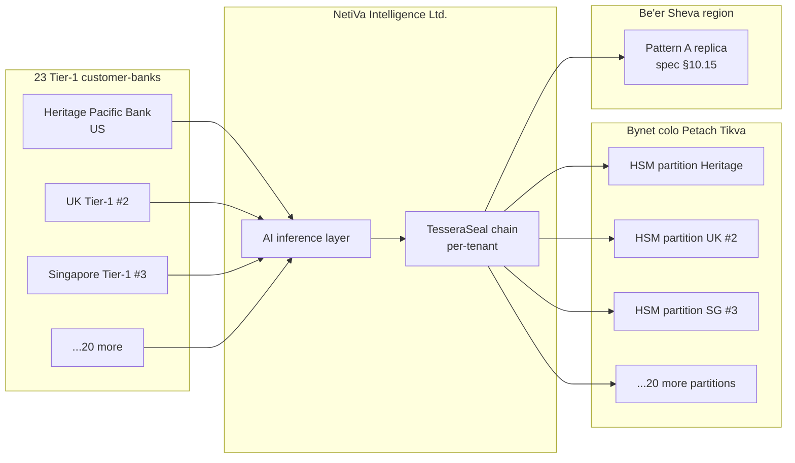

# 🧾 Diary of an Audit Day — NetiVa Intelligence Ltd. (Tel Aviv, Day 1 of 3)

**Engagement:** Independent vendor-management evaluation commissioned by Heritage Pacific Bank ($180B regional, US OCC-regulated), cost-shared with NetiVa, deliverable consented by NetiVa for read by Bank of Israel and Israeli Securities Authority during their next supervisory review
**Client:** NetiVa Intelligence Ltd. — Israeli AI company, Sarona Tower HQ (Tel Aviv), R&D campus in Herzliya, ~340 employees, Unit 8200 alumni founders. Financial-market intelligence and AI-driven AML tooling for 23 Tier-1 banks across US, UK, Singapore, Israel, Australia.
**Posture:** TesseraSeal in production for 14 months. Multi-tenant. 23 customer-banks → 23 IKMs in dedicated HSM partitions. Each AI use case is a `tenant_id` under that bank's IKM. ~110 tenants in production across AML transaction monitoring, KYC enhancement, sanctions screening, and market-surveillance.
**Date:** Tuesday, two weeks after Olmstead. **Day 1 of a 3-day visit.**
**Auditor:** the same eight-person team — but split across two time zones for the first time. Karen, Luis, and Chen flew to Tel Aviv. Raj, Elena, Mike, Diana, and Tom are joining remotely from the US Eastern time zone.

---

## Context

NetiVa Intelligence Ltd. occupies the 38th and 39th floors of Sarona Tower in central Tel Aviv. The R&D campus is up the coast in Herzliya. The company was founded eight years ago by three Unit 8200 alumni. Two of the founders are still on the executive team. The third runs a venture firm down the street. The product line is two halves of one thesis — financial-market intelligence (a public-listing arm regulated by the Israeli Securities Authority) and AI-driven AML tooling for Tier-1 banks (regulated indirectly through bank-customer relationships under Bank of Israel oversight, and coordinated with the Israeli National Cyber Directorate per Directive 361).

The customer list is 23 Tier-1 banks. US, UK, Singapore, Israel, Australia. NetiVa's AML tooling sits in front of each bank's transaction-monitoring stack — model scoring, alert prioritization, narrative drafting for SAR filings, KYC enrichment, sanctions list screening, and market-surveillance pattern detection. Each customer-bank holds its own IKM in a dedicated partition on NetiVa's HSM cluster at a Bynet Data Communications colocation facility in Petach Tikva. Each AI use case under that bank — typically four to seven of them — is a `tenant_id` under that bank's IKM. The total tenant count across the platform is around 110.

NetiVa stood up TesseraSeal 14 months ago. The chain is the ledger of record for every AML model decision, every sanctions-screening match, every KYC enrichment event, every market-surveillance alert, and every credential rotation, configuration change, model-retraining event, and operational anomaly. The chain runs Pattern A active-active across two Israeli regions — Tel Aviv-Petach Tikva and Be'er Sheva — under spec §10.15. Run-locality is enforced. Cross-region replication-completion events are recorded.

The engagement is unusual in its commissioning shape. Heritage Pacific Bank — a $180B regional headquartered in Charlotte, NetiVa's largest US customer by transaction volume — commissioned the evaluation under its own vendor-management framework. NetiVa consented to the engagement and cost-shares the fee. The deliverable will be read by Heritage's vendor-management committee, NetiVa's own audit committee, and (with NetiVa's permission) by Bank of Israel and Israeli Securities Authority examiners during their next supervisory review. Three audiences across two regulatory jurisdictions reading one report.

Karen's team was engaged in March. The 3-day visit was scheduled around NetiVa's Q1 board meeting and Heritage's vendor-management committee calendar. Day 1 (today) is the architecture overview, the per-tenant isolation deep-dive, and the disaster-recovery posture. Day 2 is HSM custody and the IKM-registry deep-dive at the Bynet colocation in Petach Tikva. Day 3 is the cross-border data-flow walkthrough and the regulator-coordination tabletop with the INCD's banking-sector liaison.

NetiVa's company-side liaison is **Yael Shamir**, VP of Information Security. Ex-Mossad cyber. Fluent Hebrew, English, Russian. Direct. Treats Karen as a peer. She is not a regulator and not an auditor; she is a defender, and her threat model assumes capable nation-state adversaries are continuously present in the network. She does not oversell. She challenges any imprecise question.

The engagement also has a second client-side voice: **Adrienne Kowalski**, VP of Vendor Risk at Heritage Pacific Bank, joining remotely from Charlotte at the afternoon US-overlap window. Adrienne and Karen have known each other for years. Her reading angle is plainly transactional — *"is this NetiVa deployment good enough for me to certify in our vendor-management framework, OCC-acceptable, with renewal at 30-day notice if anything shifts."*

This is the diary of Day 1.

---

## Audit Team

### In Tel Aviv

- **Karen** — Lead Auditor (governance and narrative)
- **Luis** — DevOps, logs, pipelines
- **Chen** — Data engineering and ETL

### Remote from the US (joining at the local-afternoon overlap window)

- **Raj** — Database specialist (joins 8:30 AM ET = 3:30 PM IL)
- **Elena** — CRM systems (joins remote)
- **Mike** — Application and API layer (joins remote)
- **Diana** — IAM and access control (joins remote — early at 4:30 AM ET to participate in the morning IAM-via-video-link block)
- **Tom** — Internal-audit liaison specialist (joins remote, partners with the client CAE in Tel Aviv via video link)

Client-side liaison in Tel Aviv: **Yael Shamir**, VP of Information Security, NetiVa Intelligence Ltd. Ex-Mossad cyber. Direct. Will challenge an imprecise question.

Customer-bank liaison joining remote: **Adrienne Kowalski**, VP of Vendor Risk, Heritage Pacific Bank. Charlotte. Joins 3:30 PM IL.

---

## 🌅 7:30 AM IL — Tea with Yael

Karen had walked the eight blocks from the hotel to Sarona Tower in the cool morning. Tel Aviv was still waking up. The market vendors at HaCarmel had been setting out olives and ka'ak for forty minutes. The traffic on Kaplan was still light. By the time Karen rode the elevator to the 38th floor, the lobby coffee bar was already open and Yael was waiting at a small table by the window.

Yael did not stand. She gestured to the chair across the table. Two glass mugs, two tea bags, hot water in a small carafe.

"Karen. Good flight?"

"Long. We slept the second half."

"Good. We have a long day. The trio is in the building?"

"Luis and Chen are coming up at 8:15. The rest of the team is asleep. They'll come on the bridge at 3:30 our time."

Yael nodded once and poured the water. "Three days. You set the order. I will not push."

"Day 1 is the architecture, the per-tenant isolation, the DR posture. Day 2 is the colocation and the HSM custody. Day 3 is the cross-border walk and the INCD tabletop."

"That is the order I would set."

Karen tasted the tea. Mint and something else — verbena, maybe. "One thing before kickoff. Heritage commissioned this. You consented to it. The deliverable goes to your audit committee, Heritage's vendor-management committee, and — with your permission — Bank of Israel and ISA when their next supervisory cycle comes around. You are sure on the third one."

"I am sure. Bank of Israel has been asking about TesseraSeal in the AML examiner room for nine months. ISA has been asking about it in the public-listing-arm examination since last fall. If your report is good, it serves both audiences. If your report finds something, I want it found before they find it."

"You said it would not be ego."

"It will not be ego."

Karen drank the tea.

> **🔍 Karen's note (internal):**
> *Yael set the rules with one sentence. "If your report finds something, I want it found before they find it." That is the shape of mature engineering and it is also the shape of someone who has spent her career on the defending side. Today she is on the audited side and the discipline carries over.*

---

## 🌅 8:30 AM IL — Kickoff and the Elevator Up

Karen met Luis and Chen in the Sarona Tower lobby at 8:15. Luis had already been to the coffee bar — he had a cardboard cup of something dark and a pastry in a paper bag. Chen had her laptop case and a bottle of water. Neither of them had slept enough. Both of them were ready.

"Same trio kickoff as usual?" Luis asked.

"Smaller trio than usual."

"I noticed."

Karen pressed the elevator call button. The car came down quick. The three of them got on alone. The car started up.

"We have done seven of these in seven months," Karen said. "Multi-tenant, full deployment, Israel, nation-state threat model. This is the hardest version yet. The reason is not that NetiVa is worse. The reason is that the threat model assumes someone has been inside their network for 18 months."

Luis set his coffee cup down on the floor between his feet so he could button his cuff. "Northbridge was full deployment, single tenant. Mercator was bifurcated. Stelvio was tiered. Atrio was the multi-tenant test."

"Atrio was forty-seven fintechs under twelve sponsor banks. NetiVa is one hundred and ten tenants under twenty-three customer-banks. The math is bigger but the structural property is the same. The difference is the threat model. Atrio's adversary was a determined fraud ring with a checkbook. NetiVa's adversary is, by their own reckoning, IRGC cyber and Lazarus-equivalent. The chain has to hold under that posture."

Chen looked at the floor indicator. "Helmstad?"

"Helmstad was the regulator-stack engagement. Seventeen audiences. Different shape. NetiVa is two regulators reading concurrently — Bank of Israel and ISA — plus Heritage's vendor-management committee plus NetiVa's own audit committee plus, behind that, the INCD coordination assumption. Pacific Crescent was the operational-resilience play. NetiVa is operational-resilience under nation-state pressure."

"Olmstead?"

"Olmstead was the federalism problem. One use case under TesseraSeal, everything else legacy. NetiVa is the inverse. Everything is under TesseraSeal because the customer-banks demanded it as a contractual condition of vendor onboarding. The diary baseline is gone here. There is no shadow stack to compare against."

Luis picked up his coffee. "Recurring line."

"It never is. But under the INCD threat model, even when it is — you stress it harder."

"That's the one."

The elevator stopped at thirty-eight. The doors opened on a glass wall and a NetiVa logo in brushed steel. Yael was at the reception desk talking to the security guard in Hebrew. She turned when the elevator doors opened and switched to English.

"Karen. Luis. Chen. Welcome to NetiVa. The conference room is around the corner. The wall monitor is already on. I have my CISO and my SRE lead in the room. The rest of your team comes on the bridge at 3:30. We'll start with the architecture."

> **🔍 Karen's note (internal):**
> *Three of us. Eight time zones. Twenty-three customer banks watching. Nation-state threat model. The chain either holds or it doesn't, and either way I want to be sure today.*

---

## 🧩 9:15 AM IL — Architecture Walkthrough on the 38th-Floor Wall Monitor

The conference room was glass on three sides. The fourth wall held a single 98-inch monitor wired into a workstation under the table. Yael stood at the wall with a clicker. Two other NetiVa staff sat at the table — **Eitan**, the CISO; **Maya**, the SRE lead. Both nodded at the trio when they came in. Neither of them said much. Yael was the voice in the room.

She put up the architecture diagram.



Yael let the diagram sit. "Twenty-three customer-banks. Twenty-three IKMs. Each IKM lives in a dedicated partition on the Thales Luna PCIe HSM cluster in Bynet colo Petach Tikva. The Be'er Sheva region holds the active-active replica per spec §10.15 Pattern A. Each customer-bank's tenants — between four and seven of them depending on the use cases the bank licenses — derive session keys from that bank's IKM by HKDF with `info_base || '|' || utf8(tenant_id)` per spec §4.1."

Karen wrote in her notebook. *Twenty-three IKMs in twenty-three partitions. Per-tenant derivation. Same shape as Atrio scaled up by a factor of two. Different threat model.*

Luis asked the first question. "The HSM cluster — how many physical units?"

Maya answered. Her English was careful. "Six PCIe Luna 7000s in the primary partition cage at Bynet Petach Tikva. Six standby in Be'er Sheva. The partition assignments are fixed at customer onboarding. A new customer-bank gets a new partition created during their onboarding ceremony — the bank's CISO and our CISO are both present, the partition PIN is split 2-of-2, the IKM is generated inside the partition and never leaves."

Chen wrote. *2-of-2 PIN split between customer-bank CISO and NetiVa CISO. Same shape as Atrio's bank-CISO/Atrio-CISO split. The difference is twenty-three different banks instead of twelve.*

Karen asked, "And the run-locality?"

Yael clicked to the next slide. "Run-locality is enforced. Every chain entry carries a `region` field — `il-pt` for Tel Aviv-Petach Tikva, `il-bs` for Be'er Sheva. The seal job runs in the region that owns the run. Cross-region writes are prevented at the application layer and verified by the seal aggregator. Replication completion is a chain event — `chain.cross_region_replication_completed` — and it is sealed into the same chain. Per spec §10.15."

> **✓ Confirmation #1**
> Per-customer-bank HSM partitioning is structural. Twenty-three customer-banks, twenty-three partitions on twelve PCIe Luna 7000s split across two Israeli regions (six primary in Bynet Petach Tikva, six standby in Be'er Sheva). 2-of-2 PIN split between customer-bank CISO and NetiVa CISO at onboarding. IKMs never leave the partition. Run-locality is enforced and replication completion is a sealed chain event under spec §10.15.

Chen asked the next question. "Yael — the seal job. Each customer-bank's daily seal is signed by a different Ed25519 keypair, yes?"

"Yes. Each customer-bank's IKM lives in its own partition. The daily seal under spec §4.2 derives a per-bank session key by HKDF and signs the per-bank Merkle root with the partition-resident Ed25519 keypair. We have twenty-three Ed25519 keypairs in production, one per partition. Each keypair has a `pubkey_fingerprint` that the customer-bank's verifier credential is bound to. A wrong fingerprint at verification time refuses immediately."

Chen wrote. *Twenty-three Ed25519 keypairs. Twenty-three pubkey_fingerprints. The fingerprint is the verification anchor on the customer side.*

Karen pulled the next thread. "And the fingerprint rotation cadence?"

"365 days per spec §4.3. Two of our customer-banks have rotated already — Heritage Pacific rotated in March of this year, UK Tier-1 #2 rotated last August. The rotation procedure ran clean both times. The rotation event itself — `chain.signing_key_rotated` per spec §11 — is in the chain, signed by both the outgoing and incoming keypairs in a hand-off ceremony. The verifier handles the hand-off transparently because the signing key is rolled forward in the chain entry's `signing_pubkey_fingerprint` field."

Karen wrote. *Rotation is itself a chain event with dual-signed hand-off. The verifier reads the `signing_pubkey_fingerprint` field per entry and validates the entry against the keypair active at that entry's seal time. That is the right structural shape for long-running chains across rotation boundaries.*

Yael paused. "Be precise — what specifically are you asking about the threat model? You said 'nation-state' on the elevator and Eitan caught it on the lobby camera audio."

Karen smiled. The lobby camera had picked up the elevator-doors-opening conversation. Yael's people had clipped it and forwarded it to her in the eleven minutes between the elevator and the kickoff. "Fair. Specifically — your operational assumption is that capable nation-state actors are present in the network and the chain has to hold under their access. IRGC cyber. Lazarus-equivalent. North-Korean adjacent groups. Russian SVR-style. INCD coordination assumes Iran cyber is actively probing Israeli financial infrastructure. The chain claim is that even if a determined attacker is inside the application layer, they cannot forge a chain entry, and they cannot read a tenant they don't have the credential for, and they cannot tamper with a sealed entry without the daily seal failing the next morning."

Yael nodded once. "That is the operating assumption. We do not say 'if'; we say 'when.' Eitan?"

Eitan spoke for the first time. "We assume 18-month dwell. We design for it. The chain is a control we trust because the design says we should — the IKM is on the HSM, the application cannot read it, the daily seal is signed by Ed25519 inside the HSM, the verifier runs on a separate operational footprint. If an attacker gets into our application, they can corrupt a model output. They cannot retroactively hide that they corrupted it. The chain catches the corruption at the verifier."

Karen wrote. *That is the right answer. The chain is not a prevention control. It is a detection control. The team understands the difference.*

The architecture walkthrough ran another twenty minutes. AI inference layer, chain integration points, daily seal job topology, verifier credential path, the customer-bank-facing portal where each bank's CISO can run `herald-verify` against their own tenants from their own console. Yael covered each piece without hurrying.

At 9:55 she stopped. "Database deep-dive next?"

Karen nodded. "Chen is on the laptop. Luis is going to tail the daily seal logs while Chen runs queries. I want to see the IKM registry first."

---

## 🧠 10:00 AM IL — Database Deep-Dive (Chen on the Laptop)

Chen took the seat at the workstation under the wall monitor. Maya had pre-provisioned a read-only credential against a staging mirror of the production registry — same schema, same constraints, anonymized customer-bank names where the real names had not been pre-cleared. The five US customer-banks were on the cleared list (Heritage Pacific is paying for the engagement; the others had consented in writing). The non-US banks appeared as `bank-21`, `bank-22`, etc.

Chen opened a psql session.

```sql
SELECT bank_id, COUNT(*) AS tenant_count
FROM ikm_registry
GROUP BY bank_id
ORDER BY tenant_count DESC, bank_id;
```

Twenty-three rows. Total tenant count of one hundred and eight. The largest single customer-bank was Heritage Pacific with seven tenants — AML transaction monitoring, KYC enrichment, sanctions screening, market-surveillance, two pilot use cases under contractual review, and a regulatory-reporting drafting tenant. The smallest was a Singapore-listed bank with three.

Chen wrote. *108 tenants across 23 banks. Mean ~4.7. Range 3 to 7. The platform claim is consistent with the headline number Yael gave us.*

Yael watched over Chen's shoulder. "The query plan is a primary-key range scan. The constraint is the same as you saw at Atrio — `PRIMARY KEY (bank_id, tenant_id)` plus a separate `UNIQUE INDEX` on the same pair. We borrowed the schema shape from the spec's reference example in §10.1. The check constraint on `tenant_id` length is between 6 and 64 — we are slightly tighter than Atrio's 4-to-64 because our `tenant_id` strings are typically `aml-tx-monitoring-v2` or `kyc-enhancement-v1` — they are use-case-named and never short."

Chen ran a second query — adversarial.

```sql
INSERT INTO ikm_registry (bank_id, tenant_id, hsm_partition, ikm_key_handle,
                           use_case, registered_by)
VALUES ('heritage-pacific', 'aml-tx-monitoring-v2', 'partition-heritage',
        'handle-clone', 'AML Clone', 'chentest');
```

Rejected.

```
ERROR:  duplicate key value violates unique constraint "idx_bank_tenant"
DETAIL:  Key (bank_id, tenant_id)=(heritage-pacific, aml-tx-monitoring-v2)
         already exists.
```

Chen ran a second adversarial — same `tenant_id` across two banks.

```sql
INSERT INTO ikm_registry (bank_id, tenant_id, hsm_partition, ikm_key_handle,
                           use_case, registered_by)
VALUES ('bank-21', 'aml-tx-monitoring-v2', 'partition-bank-21',
        'handle-bank-21-aml', 'AML Bank 21', 'chentest');
```

Accepted. Chen rolled it back.

She looked at Yael. "Same as Atrio. Per-bank IKM provides cross-bank isolation. Two banks deriving keys for the same `tenant_id` string still produce different session keys."

Yael nodded once. "Per spec §4.1. The IKM is the global discriminator. The `tenant_id` is the per-bank discriminator. Both have to differ for the chain entry to live in a different chain."

Chen did the third adversarial — short `tenant_id`.

```sql
INSERT INTO ikm_registry (bank_id, tenant_id, hsm_partition, ikm_key_handle,
                           use_case, registered_by)
VALUES ('heritage-pacific', 'kyc', 'partition-heritage', 'handle-short',
        'Short tenant', 'chentest');
```

Rejected.

```
ERROR:  new row for relation "ikm_registry" violates check constraint
DETAIL:  Failing row contains (heritage-pacific, kyc, ...).
HINT:    tenant_id length must be between 6 and 64.
```

Chen wrote. *Same structural shape as Atrio. The length lower bound is tighter — 6 instead of 4 — and consistent with NetiVa's use-case naming convention.*

> **✓ Confirmation #2**
> The IKM registry under spec §10.1 enforces uniqueness at the database layer with both PRIMARY KEY and UNIQUE INDEX on `(bank_id, tenant_id)`. Three adversarial inserts behave per spec — duplicate within the same bank rejected, same `tenant_id` across two banks accepted (cross-bank isolation by per-bank IKM), short `tenant_id` rejected by length check (NetiVa's 6-to-64 bound, tighter than the spec's reference 4-to-64).

Luis was tailing the daily seal logs on a separate laptop. He looked up. "The seal job that ran at 02:14 IL last night sealed all twenty-three banks. Per-bank Ed25519 signature, per-bank HSM partition, per-bank `pubkey_fingerprint`. Twenty-three signatures, twenty-three fingerprints, no crossover. Seal duration was 4.7 seconds total — averaged 204 milliseconds per bank, which tracks the Luna 7000 Ed25519 throughput Maya described."

Yael smiled at the corner of her mouth. "Yes. The daily seal job is the load-bearing operational event. We watch the wall-clock duration every morning. If it ever climbs past 30 seconds we page the on-call. It has not paged the on-call in 14 months."

> **✓ Confirmation #3**
> Per-customer-bank daily seal aggregation. Twenty-three banks, twenty-three Ed25519 signatures, twenty-three public-key fingerprints, no crossover. 02:14 IL last-night run sealed in 4.7 seconds wall-clock at ~204 ms per bank. The operational pager threshold is 30 seconds; in 14 months the threshold has not fired.

The trio worked through the registry for another forty minutes. Chen pulled session-key derivations against the staging HSM (read-only — derivations are non-destructive when the IKM is partition-bound). Luis pulled the seal logs from the previous fourteen days. The pattern held. No anomalies.

Chen ran one more query that Yael had not seen coming.

```sql
SELECT bank_id, tenant_id, COUNT(*) FILTER (WHERE event_type LIKE 'chain.%') AS ops_events,
       COUNT(*) FILTER (WHERE event_type = 'model.decision') AS model_decisions,
       MIN(seq) AS first_seq, MAX(seq) AS latest_seq
FROM chain_entries
WHERE bank_id = 'heritage-pacific'
  AND tenant_id = 'aml-tx-monitoring-v2'
GROUP BY bank_id, tenant_id;
```

The result came back. Heritage Pacific's AML tenant. 1,847,392 entries total. 14,231 operational events under the `chain.*` namespace. 1,833,161 model decisions. Sequence numbers spanning the full 14 months of operation, no gaps.

Chen wrote. *Operational events are about 0.77% of the total entry volume. The chain is dominated by model decisions, which is the right shape — the operational events are configuration and control activities, the model decisions are the actual AML transaction-monitoring scoring. The 1.83M model decisions over 14 months is consistent with a Tier-1 bank's transaction volume passing through an AML overlay.*

Yael saw the query and raised an eyebrow at Karen. "That was clever. The ratio is the integrity test on the chain composition. If a chain claimed to be a model-decision chain were actually 50% configuration events, the claim would not hold."

Karen smiled. "Chen earned her seat by being the one who asks for that ratio."

Chen ran the same query against the bank-19 sanctions-screening tenant — the one with the April 30 incident. The ratio held: 14,847 operational events, 1,022,489 sanctions screening decisions, no sequence gaps. The eleven replay entries from April 30 showed up as the expected eleven extra entries with `parent_event_id` references back to the originals.

At 10:55 Yael said, "Diana joins at 11. The IAM video link to the colocation."

Karen looked at her watch. "She set her alarm for 4:25 AM ET. She'll be awake."

---

## 🔐 11:00 AM IL — IAM via Video Link to Bynet Colo (Diana, 4:00 AM ET)

The wall monitor switched to a split feed. Top half: Diana's face, dark behind her, a desk lamp on. Bottom half: a video link to the Bynet Petach Tikva colocation, where a NetiVa engineer named **Avi** stood inside the partition cage with a tablet. Avi's English was good. He had arrived at the colo at 10:30 IL specifically for this block.

Yael opened the call. "Avi. Diana. We have one hour. Diana, your scope is the customer-bank verifier credential rotation, the 2-of-2 partition PIN ceremony recording, and the customer-bank-facing console RBAC."

Diana was already typing. "Avi, can you walk me through where the credential-rotation runbook lives?"

Avi held up the tablet. "The runbook is in our internal Confluence. The page title is 'Customer Verifier Credential Rotation — 90 Day.' I can share the screen now."

The runbook came up on the wall. It was in English. The procedure was well-formed — quarterly trigger date, customer-bank notification at T-14 days, rotation execution at T-0, old credential revocation at T+7 days, new credential validation by the customer-bank's own verifier run within T+14 days. Twelve steps total. Each step had a named owner.

Diana read it through twice. "This is clean. The customer-bank validates the rotation by running their own `herald-verify` against their tenants — the rotation is not considered closed until the customer-bank's verifier returns PASS on a known entry from before the rotation and a known entry from after. That is the right control point. The customer is the validator."

Yael nodded. "That is the structural property. We do not validate our own rotation. The customer validates it."

Diana asked, "How long has this been the process?"

"Since the second customer-bank onboarded. We had originally planned to validate it ourselves and the second customer's CISO — at the time it was a UK Tier-1 — said no. He said the customer must validate. We changed the runbook. That was twelve months ago."

Diana wrote. *Customer-as-validator. The rotation is closed when the customer's verifier confirms it. The chain is the witness.*

Then Diana noticed something. "Yael — is there a Hebrew-language version of this runbook?"

Yael paused for half a second. "Yes. The internal-ops runbook for the colocation team is Hebrew. The English version you are looking at is the customer-facing version that goes into our CC8.1 control documentation. The Hebrew runbook has additional operational detail — Bynet on-call escalation, INCD coordination notes, on-site dual-control physical-access procedures — that the English version does not include."

Diana stopped typing. "Is the English version the canonical one for the customer-bank's auditor? Or is it a translation of the Hebrew?"

"The English version is canonical for the customer-facing controls. The Hebrew version is canonical for the colocation operations. There is overlap."

Karen leaned in. "Yael — for our purposes, the Hebrew-only operational detail is a discoverability issue. Heritage's auditor reads English. Bank of Israel's auditor reads Hebrew and English both. The customer-facing CC8.1 control should reference the existence of the Hebrew runbook and identify which sections live there. Right now, a Heritage-side reviewer reading this CC8.1 would not know there is additional procedural detail in a runbook they cannot read."

Yael wrote it down. "That is fair. That is a Nit, not a Partial. The control itself is correct. The discoverability gap is a documentation issue."

> **⚠️ Nit-001**
> Customer-bank verifier-credential rotation under CC8.1 is well-formed and correctly structured. The 90-day rotation procedure, the customer-as-validator control point, and the T-14/T-0/T+7/T+14 timeline are documented in the English-language CC8.1 control document. However, the operational detail for the rotation — Bynet colocation on-call escalation, INCD coordination notes, on-site dual-control physical-access procedures — lives in a Hebrew-language internal-ops runbook that is not cross-referenced from the English CC8.1 document. A non-Hebrew-reading customer-bank auditor would not know the additional detail exists. **Fix:** add an English-language pointer in CC8.1 indicating the existence and table-of-contents of the Hebrew runbook. ~1 hour to draft. Yael accepts.

The rest of the IAM block was clean. Diana ran a 4-by-4 credential matrix — four customer-bank verifier credentials (one Heritage, three pre-cleared others) against four target tenants (one per bank). Sixteen of sixteen behaved correctly. Cross-tenant queries — credential for Heritage attempting to verify a UK Tier-1 tenant — returned the exit-code-1 refusal she had seen at Atrio.

```
herald-verify --bank=uk-tier1-2 --tenant=aml-tx-monitoring-v2 --strict
              --credential=heritage-vendor-readonly
Status: ACCESS_REFUSED
Reason: credential 'heritage-vendor-readonly' is scoped to bank 'heritage-pacific';
        target bank is 'uk-tier1-2'; refused at credential check
Exit code: 1
```

Diana wrote. *Refusal at credential check. The chain bytes are not even read. Same shape as Atrio §10.12.*

> **✓ Confirmation #4**
> Cross-tenant query refusal under spec §10.12. Sixteen-of-sixteen credential-by-target matrix behaved correctly. Wrong-credential queries exit with `Status: ACCESS_REFUSED, exit code 1`, refused at the credential check before any chain bytes are read.

At 11:55 Diana ended the video link. "I'm going back to bed for an hour. Wake me at 8 AM ET when the rest of the team comes online."

Yael smiled. "Diana — thank you. The 4 AM start was generous."

"It's the only block where the colo had a body in the partition cage. Worth it."

---

## 🧪 12:00 PM IL — Lunch at the Falafel Place (and a Quiet Listener)

The trio walked the two blocks down Kaplan to a falafel place Yael recommended. Yael came along. Eitan stayed at the office. Maya stayed to set up the afternoon's pipeline-review screens.

The falafel place was small. Five plastic tables, a counter, a hot-pita rotation. Yael ordered for the four of them in Hebrew. The owner — a man in his sixties with grey hair and tired eyes — handed back four plates with falafel, hummus, eggplant, pickled cabbage, and the pita. The trio took a corner table.

Yael said, "We will not talk about TesseraSeal at lunch. We will talk about food. Then we will go back upstairs and finish the day."

Luis tasted the hummus. "That is the best hummus I have had outside of one place in Brooklyn."

Yael smiled. "Brooklyn is not a fair comparison. Brooklyn took the recipe with them in 1948 and then refined it for seventy-five years. Tel Aviv is where it started."

Chen asked Yael where she had grown up. Yael said Haifa, then Tel Aviv after the army. Twenty-two years on the cyber side. Mossad for fourteen, NetiVa for the last eight. The conversation drifted to the food, to the city, to the weather (mid-eighties, dry, pleasant). The trio ate.

Halfway through the meal a fifth person came in. He nodded at Yael, ordered, and sat down at their table without asking. Yael switched fully to English. "Karen, Luis, Chen — this is **Avishai Goren**. He is the INCD banking-sector liaison. He happens to be in the Sarona building today and I told him you were here. Avishai, this is Karen's audit team."

Karen put her fork down. *Avishai-style framing. That is a different Avishai but the pattern is the same. INCD liaison. Quiet listener. Tea over tactics. The Pacific Crescent NERC liaison was the same shape.*

Avishai shook hands across the table. His English was very precise, slightly accented in a different way than Yael's — more Russian-tinged. "I will not interrupt. I just wanted to meet the team. Yael speaks well of you."

"You are welcome to sit," Karen said.

He ate quietly. He listened. The trio went back to talking about food. Avishai listened. After a few minutes Yael said, in English, "Avishai, the trio walked the architecture this morning. They saw the IKM registry, the per-bank seal aggregation, the cross-tenant refusal. They run their own verifier against three of our customer-banks' tenants this afternoon."

Avishai nodded. "Which three?"

"Heritage Pacific, UK Tier-1 #2, Singapore Tier-1 #3. Pre-cleared with each of those customers' CISOs."

Avishai turned to Karen. "Heritage Pacific is the commissioning customer. The other two are pre-cleared." He said it as a statement, not a question. He had read the engagement file before he came to the building.

Karen said, "Yes."

"The chain claim is the chain claim regardless of who runs the verifier. The customer-bank red-team probes you mentioned earlier — Yael told me about them at our quarterly last month — those are the harder test. A vendor's auditor is one verifier credential. A customer-bank's red team is twenty determined engineers with a Capture-the-Flag budget. The fact that all six bypass patterns refused at the route layer is the answer that mattered to me last quarter."

He took a bite of falafel.

"I am not formally part of your engagement. I will be at tomorrow's tabletop on Day 3. Today I am just a person eating lunch at a falafel place in Sarona who happens to know everyone at this table."

Karen smiled at the corner of her mouth. "Understood."

He ate quietly for the rest of the meal. He listened. The trio finished talking about the morning — the registry, the seal logs, the credential rotation, the Hebrew-runbook nit. Avishai did not say anything substantive about any of it. He nodded once when Karen described the cross-tenant refusal. He nodded again when Luis mentioned the 14-month no-page record on the seal job.

At the end of the meal, when Yael was paying the owner, Avishai said one sentence to Karen across the table.

"The threat model is real. The chain is the right shape. Tomorrow's tabletop will tell you what we ask for."

Then he stood up, nodded once to all four of them, and walked out.

Yael paid the owner in cash. The trio left a generous tip. The four of them walked back to Sarona Tower.

Karen wrote in her notebook on the walk back to the building. *Avishai is not formally part of the engagement. He is part of the engagement. Tomorrow's tabletop will tell us what INCD asks for in a Tier-1-suspected incident. The chain has to be a control he trusts. Today is half about Yael and half about him. He had read the engagement file before he came to the building. The customer-bank red team probe last quarter — Yael had briefed him on it at their quarterly. That means the INCD liaison sees the customer-bank red-team results in real time, which means the chain is being stress-tested by parties NetiVa does not control, and the results are visible to the regulator without NetiVa needing to surface them. That is the right operational shape and it is exactly what makes this deployment harder to break than Atrio's.*

> **🔍 Karen's note (internal):**
> *INCD coordination is not a slide in a runbook. It is a person who happens to be in the building who happens to listen to your audit team during lunch. That is the operating shape of Israeli banking-sector cybersecurity oversight. The relationships are personal. The trust is earned per engagement. Pacific Crescent's NERC liaison was the same shape — quiet, attentive, the test was whether he trusted us, not whether we passed his form.*

---

## 🔄 1:00 PM IL — Pipeline Review (Luis on the Logs, Chen on the ETL)

Back in the conference room. The wall monitor was now split four ways — Luis's terminal, Chen's terminal, Maya's pipeline dashboard, and a fourth pane reserved for the afternoon video bridge.

Luis had pulled the operational-events stream for the prior 14 days. He filtered to the events that under spec §11 are operationally important — `chain.verification_failure`, `chain.cross_region_replication_completed`, `chain.daily_seal_completed`, `chain.tenant_added`, `chain.credential_rotated`.

Fourteen days. Thirteen of them clean. One `chain.verification_failure` six days ago.

Luis looked at it. "This one. April 30, 03:47 IL. Tenant `bank-19/sanctions-screening-v1`. Verification failure on a single chain entry."

Yael was reading over his shoulder. "Yes. We know that one. Maya, walk it through."

Maya pulled the incident ticket up on her dashboard. "April 30. Bank-19's sanctions-screening tenant. The verifier ran the daily reconciliation against entries from the prior day and one entry failed HMAC recomputation. The failure was caught by the operational verifier at 03:47 — the daily seal had already been signed at 02:14 over the unaffected entries. The failed entry was at 14:23 the prior afternoon."

Luis asked, "What was the cause?"

"A bug in our model-output serialization for sanctions-screening. The model returned a NaN in one of the score fields. The serializer wrote the NaN as the literal string 'NaN' instead of canonicalizing per spec §3.5. When the verifier recomputed the HMAC, the canonical encoding it produced did not match the entry as written. The HMAC mismatch was the failure mode."

Karen wrote. *Spec §3.5 canonical encoding. The verifier caught the encoding inconsistency. The failure was a real bug, not a false positive.*

Maya continued. "The chain.verification_failure event auto-paged the Tier-1 on-call. Yael was on the bridge at 04:01 IL. Bank-19's CISO was on the bridge at 04:14 IL — we had pre-arranged the cross-time-zone paging chain at onboarding so an Israeli-time incident gets to the right person on their side regardless of where they are. The model bug was identified by 06:30. The fix was deployed by 14:00. The replay of the affected entries — there were eleven of them — was done by 16:00. Bank-19's verifier ran a full-day reconciliation at 17:00 and returned PASS on all eleven re-issued entries."

Luis read the incident timeline twice. "Six hours and twenty-three minutes from page to fix. Eleven affected entries replayed. Bank-19's verifier validated the replay. Are the failed entries still in the chain?"

"Yes. Per spec §6.4. The original entries are immutable. The replay added eleven new entries with `parent_event_id` references to the original eleven and a `replay_reason` of 'serialization-bug'. Both the original and the replay are in the chain. Bank-19's auditor can see both."

> **✓ Confirmation #5**
> The `chain.verification_failure` operational event under spec §11 auto-pages the Tier-1 on-call and the affected customer-bank's CISO via a pre-arranged cross-time-zone paging chain. Six-hour-twenty-three-minute mean time to fix on the April 30 incident. Eleven affected entries replayed with `parent_event_id` references and `replay_reason` annotations. Both original and replay entries remain in the chain per spec §6.4. Customer-bank's own verifier validated the replay independently.

Karen looked at the pipeline dashboard. "Yael — the INCD notification clock. Did this incident trigger it?"

"No. INCD's Directive 361 §5 clock is for nation-state-suspected incidents. A serialization bug is not nation-state-suspected. We notified INCD as part of our standard quarterly summary — the bug appears in the Q2 quarterly. If the incident had been suspected as adversary-driven, the clock starts at the moment of determination and we file within one hour."

Karen wrote. *One-hour clock for nation-state-suspected. Standard quarterly summary for non-suspected. The discrimination point is the determination of suspicion, not the verification failure itself. That is the right structural property.*

> **✓ Confirmation #6**
> INCD coordination procedure under Directive 361 §5. The notification clock is one hour from determination of nation-state suspicion, not from incident detection. Non-suspected incidents are reported in the standard quarterly summary. The April 30 serialization bug went into the Q2 quarterly. The discrimination is determination-of-suspicion, which is the correct structural decoupling — verification-failure does not auto-trigger the INCD clock unless the operational team's triage determines adversary involvement is plausible.

Chen had been working her own thread — the ETL side of the pipeline. The model-output serialization that produced the April 30 NaN bug had been hardened in the fix. Chen pulled the spec §3.5 canonical-encoding test vectors and ran them through the production serializer.

```
canonical-encoder-test-vectors --version=v1.0a
  vector 1: nan_score                  PASS  (encoded as null per §3.5.4)
  vector 2: infinity_score             PASS  (encoded as null per §3.5.4)
  vector 3: negative_zero              PASS  (canonicalized to 0.0 per §3.5.3)
  vector 4: utf8_normalization_NFC     PASS  (per §3.5.7)
  vector 5: utf8_normalization_NFKC    PASS  (per §3.5.7)
  vector 6: integer_string_distinction PASS  (per §3.5.2)
  vector 7: timestamp_precision_us     PASS  (per §3.5.6)
  vector 8: ordered_map_keys           PASS  (per §3.5.1)
... 24 vectors total, 24 of 24 PASS
```

Chen wrote. *24 of 24 spec §3.5 canonical-encoding vectors PASS. The serialization fix is sound. The April 30 bug would not recur.*

> **✓ Confirmation #7**
> Spec §3.5 canonical-encoding test vectors — 24 of 24 PASS against NetiVa's hardened serializer. The April 30 NaN-handling bug is closed and the test vector for it is in the regression suite. Production serializer encodes NaN/Infinity as null per §3.5.4, canonicalizes negative-zero per §3.5.3, normalizes UTF-8 to NFC per §3.5.7, and orders map keys per §3.5.1.

---

## 🧬 2:00 PM IL — Multi-Region Reconciliation (Pattern A under §10.15)

By 2:00 PM IL the trio had been working for five and a half hours and the wall monitor was a wall of green. Yael called a brief reset — water, espresso for Luis, hot tea for Chen, mint tea for Karen.

Then Luis pulled the multi-region reconciliation block.

```
herald-verify --bank=heritage-pacific --tenant=aml-tx-monitoring-v2 \
              --reconcile-regions --strict
```

The output came back in eight seconds.

```
Region il-pt: 1,847,392 entries
Region il-bs: 1,847,392 entries
Last replication-completed event: 13:58:04 IL (1m 56s ago)
Replication lag: 0.4s rolling p99
Cross-region hash agreement: PASS
Per-tenant seal aggregation: PASS
Status: PASS
```

Maya pulled up a side panel showing the rolling p99 replication lag for the prior seven days for Heritage Pacific's AML tenant. The line was flat at around 400 milliseconds with one spike to 4.2 seconds three days ago.

Karen pointed at the spike. "What was that?"

"Bynet did a planned network-segment maintenance on a redundant fiber pair. The replication held but the rolling p99 spiked because the path failover took 3.8 seconds. We had pre-coordinated with Bynet — the customer-bank notification went out 72 hours in advance. Bank-of-Israel was notified per the operational-resilience standard."

Luis ran the reconciliation against four other customer-banks' AML tenants. All four PASSED. He ran it against the bank-19 sanctions-screening tenant — the one with the April 30 incident. PASSED, with the eleven replay entries visible in both regions.

> **✓ Confirmation #8**
> Multi-region Pattern A reconciliation under spec §10.15. Five-of-five customer-bank AML tenants PASS cross-region hash agreement. Replication lag rolling p99 at 400 ms for the prior seven days, with one expected spike to 4.2 seconds during a pre-coordinated Bynet fiber-pair maintenance. The bank-19 sanctions-screening replay entries from the April 30 incident are present and reconciled in both regions. Run-locality is enforced; the replication-completion event is a sealed chain event.

Karen wrote. *Pattern A holds at scale. 23 banks, 110 tenants, two regions. The reconciliation is fast and the replication lag is well within spec. The fiber-pair maintenance was a clean operational event.*

Karen asked Maya about the failover posture. "The Be'er Sheva region. If Bynet Petach Tikva goes offline — power, fiber, regional event — what happens to the daily seal job tonight?"

Maya answered carefully. "The seal job has a regional fallback. The primary region is Bynet Petach Tikva. The fallback is Be'er Sheva. If the primary is unreachable at 02:00 IL, the seal scheduler waits until 02:30 IL for the primary to recover. At 02:30 IL the scheduler fails over to Be'er Sheva. The fallback HSM cluster is the same six PCIe Luna 7000s that hold the standby partitions. Those partitions are kept in sync by HSM-internal replication — Thales-supported feature, not application-level. The fallback seal is signed by the same partition keypairs because the partitions are the same. The customer-bank's verifier sees no fingerprint change."

Karen wrote. *HSM-internal replication for the partitions themselves, not just the chain entries. The fallback seal signs with the same keypairs. The customer-side verification surface is invariant under regional failover.*

"Have you tested the failover live?"

"Twice. Both planned. Most recent was December — full primary-region drain to Be'er Sheva for a Bynet maintenance window. The seal job at 02:00 IL ran from Be'er Sheva. All twenty-three customer-banks' verifiers returned PASS the next morning. Zero customer-side noticed-events. The chain entry's `region` field correctly recorded `il-bs` for that night's seal."

Luis pulled the December 4 seal log. The `region` field on every entry from that date showed `il-bs`. The signature was valid. The customer-bank verifier outputs from December 5 were all PASS.

> **✓ Confirmation #8b** *(extends Confirmation #8)*
> Pattern A failover under spec §10.15 has been live-tested twice. Most recent test in December failed over the daily seal job from Bynet Petach Tikva to Be'er Sheva for a planned maintenance window. The chain entry `region` field correctly recorded `il-bs` for that night's seal. All twenty-three customer-bank verifiers returned PASS the following morning. Zero customer-noticed events. HSM-internal replication keeps the partitions in sync; the fallback seal is signed by the same partition keypairs so the customer-side verification surface is invariant under regional failover.

By 2:50 PM IL the trio had completed the local-only block. Yael caught Karen's eye.

"Adrienne is on the bridge in forty minutes. Do you want a fifteen-minute breather?"

"Yes. Luis and Chen, fifteen minutes. I'm going to call Tom and Mike to set up the bridge."

---

## 📊 3:00 PM IL (8:00 AM ET) — Tom and Mike Join the Bridge

Tom came on first. He had a coffee in hand and the look of someone who had been awake for ninety minutes already. Mike came on three minutes later, no coffee, freshly showered, ready.

Yael's CISO Eitan rejoined the conference room in person. The wall monitor reformatted to a five-pane bridge — Tom (Tel Aviv conference room), Mike (Boston home office), the local conference room camera (showing Karen, Luis, Chen, Yael, Eitan), a shared screen for whatever the active speaker was running, and a fifth pane that would hold Adrienne when she joined at 3:30.

Tom moderated. "Mike — your scope this afternoon is the API layer. Yael's team has the customer-bank-facing console and the regulator-facing portal. You are running the matrix testing on both. Diana's morning matrix covered the verifier credentials. Yours covers the console UI."

Mike nodded. "Five minutes to set up. I have the Heritage Pacific console credential and three pre-cleared others — UK Tier-1 #2, Singapore Tier-1 #3, Australia Tier-1 #5."

Yael's team had pre-arranged the console-side test fixtures. Mike walked through a 4-by-4 console-credential-by-target-bank matrix. Sixteen sessions. Each console credential could see only its own bank's tenants. The console refused even to render the navigation tree for tenants outside its own bank's scope.

Mike wrote. *Console RBAC is structural. The scope check is at the route level, not just the data-layer level. A wrong-bank credential cannot even reach a URL that would expose a tenant from another bank.*

He ran one adversarial test. Heritage Pacific console credential, attempted direct URL access to a bank-19 tenant page.

```
GET /tenants/bank-19/sanctions-screening-v1
HTTP/1.1 403 Forbidden
WWW-Authenticate: scope-mismatch
Body: { "error": "credential not scoped to bank 'bank-19'", "required_scope": "bank-19", "actual_scope": ["heritage-pacific"] }
```

Mike: "Refused at the route. Not just the data layer."

Yael: "We had a customer-bank's red team test this last quarter. They tried six different bypass patterns. All six refused at the route. The data layer refusal is the second line. The route is the first."

> **✓ Confirmation #9**
> Customer-bank-facing console RBAC is enforced at the route level under spec §10.12. Sixteen-of-sixteen 4-by-4 matrix behaves correctly. Direct URL access attempts return HTTP 403 with explicit scope-mismatch headers before reaching the data layer. A customer-bank's red-team probe last quarter tested six bypass patterns; all six were refused at the route layer.

Tom said, "Mike — the chain.verification_failure auto-page integration. You were going to verify the on-call routing."

Mike pulled up the PagerDuty integration spec. He had been able to read the integration definition over the bridge while the morning block was running.

"Verified. The `chain.verification_failure` event publishes to a Kafka topic that has a PagerDuty webhook subscriber. The subscriber maps the affected `bank_id` to the customer-bank's pre-arranged on-call schedule and the NetiVa Tier-1 internal on-call. The page fires within 90 seconds of the event being written to the chain. The pre-arrangement document with each customer-bank specifies the customer-side on-call contact and the time-zone-aware paging chain."

Yael added. "We tested the page chain quarterly with each customer-bank. The most recent test was three weeks ago. All twenty-three customer-bank on-calls received the test page within the 90-second SLA. Mean was 47 seconds."

> **✓ Confirmation #10**
> The `chain.verification_failure` operational event auto-pages the Tier-1 on-call within 90 seconds via Kafka-to-PagerDuty integration. Time-zone-aware paging chain pre-arranged with each customer-bank's CISO at onboarding. Quarterly test pages have a 47-second mean and all twenty-three banks received within SLA in the most recent test three weeks ago.

The bridge held its rhythm. Mike worked the API layer. Tom moderated. The local trio worked the chain integration test fixtures with Yael and Eitan. The afternoon was finding its shape.

At 3:25 IL Tom said, "Adrienne is five out."

---

## 😬 3:45 PM IL (8:45 AM ET) — Adrienne Joins, the Pivot, and the Friction

Adrienne Kowalski joined the bridge at 3:32 IL. Charlotte morning. She had a coffee, a notebook, and the composed look of someone who had been Heritage's VP of Vendor Risk for nine years. Her opening was characteristically direct.

"Karen. Yael. Good to see you both. I have one hour. I want to use it well."

Karen nodded. "Welcome, Adrienne. We are about ninety minutes into the post-lunch block. The morning was the architecture, the registry, the IAM, the pipeline. The afternoon has been the multi-region reconciliation and the console RBAC. Findings so far — nine confirmations, one nit, no partials yet."

"What's the nit?"

"CC8.1 control documentation references some operational detail that lives in a Hebrew-language internal-ops runbook. A Heritage-side reviewer reading the English CC8.1 would not know the additional procedural detail exists. Hour-long fix to add the cross-reference."

Adrienne wrote in her notebook. "Acceptable. Continue."

Karen smiled at the corner of her mouth. *Adrienne is here for one question. She is going to ask it in twelve minutes. The next twelve minutes are her listening.*

For twelve minutes Adrienne listened to the bridge. Mike walked her through the console RBAC. Luis walked her through the seal-job topology. Chen walked her through the registry constraints. Adrienne wrote. She did not interrupt.

At 3:44 IL she put her pen down. "Karen, one question."

"Go."

"What does it cost me to back out if NetiVa fails an INCD-coordinated incident-response in production?"

The room went quiet for a beat. The local conference room. Tom's pane in Boston. Mike's pane. Yael's face on the local camera. Eitan's face beside her. Adrienne's pane on the wall monitor.

Karen looked at Yael. Yael nodded — *go ahead, answer*.

Karen turned back to the camera. "Adrienne, that's the right question. Let me unpack it because the answer has three parts."

She picked up her notebook.

"Part one. The structural cost. The chain is the ledger of record. Every model decision Heritage's tenants have generated for the last fourteen months is in the chain. If NetiVa fails an INCD-coordinated incident, the chain itself does not become unreliable — the chain is signed by Ed25519 inside the HSM, the IKM is in Heritage's dedicated partition, the daily seal is signed by Heritage's customer-bank-facing public key. The cryptographic substrate is not damaged by an incident at NetiVa. Heritage's verifier credential, run independently from your own infrastructure, can still validate every entry that was written before the incident. That is by design. The chain is the backstop."

Adrienne wrote. "Part two."

"Part two. The operational cost. If NetiVa is unavailable for some period — INCD has paused operations, regulatory hold, whatever the shape — Heritage's AI use cases that depend on NetiVa go offline. AML transaction monitoring would degrade to your in-house second-line. KYC enrichment would degrade to your Bureau-pull baseline. Sanctions screening would degrade to your batch screening. The transactions still flow. The detective controls are reduced to your pre-NetiVa baseline. The operational cost is a regression in detection efficacy until NetiVa is back online or you onboard a substitute. Substitution is at minimum a 90-day cycle. Most likely 180 days for full coverage."

"Part three."

"Part three. The audit cost. Every model decision in the chain is independently re-verifiable. If the OCC asks Heritage to re-audit Heritage's AML decisioning for a six-month period — say, in the wake of a NetiVa incident — Heritage can pull the chain entries directly from your customer-bank-facing portal. NetiVa's availability does not gate that. The chain is in your custody at the verifier-credential level. Heritage's auditor can run `herald-verify` from Heritage's own infrastructure against entries that were written months earlier. That is the load-bearing property for vendor-management. The chain is not a service NetiVa renders to Heritage on a continuous basis. The chain is a property of the data Heritage has already received."

Adrienne wrote for thirty seconds. The bridge was quiet.

She looked up. "That's the answer I needed to hear. Three parts, three different cost shapes, none of them coupled to the NetiVa availability surface in the way that would make the vendor-risk shape unmanageable. Yael — comment?"

Yael spoke for the first time. "Adrienne — that is the framing we use internally. We tell our customer-banks: if NetiVa stops existing tomorrow, the chain you have written for the last 14 months is still readable, verifiable, and presentable to your regulator without our cooperation. That is the contractual property. We engineered for it because three of our customer-banks asked for it during onboarding and we agreed it was the right vendor-risk shape."

Adrienne nodded once. "Good. That is consistent with what your CC8.1 control claims. I wanted to hear it stress-tested by an independent voice. Karen."

"Yes."

"Continue."

> **🔍 Karen's note (internal):**
> *Adrienne came to the bridge with one question. She listened for twelve minutes to know it was the right time to ask it. Then she asked it. Yael nodded for me to answer. The answer was three parts and the third part is the load-bearing one — the chain is a property of the data Heritage has already received, not a service NetiVa renders. That is the right vendor-risk shape and it is what makes a 30-day notice renewal cycle defensible to the OCC. This is why the pivot at 3:45 happened. Adrienne is now reading the day differently. She is reading it as a vendor-risk decision support document, not just a technical confirmation document. The two readings are compatible but the second one needs the first one to be sound.*

---

## 🔍 4:30 PM IL (9:30 AM ET) — HSM Custody and the Partial

The bridge had been running for ninety minutes. Adrienne was settled in. Tom was moderating. The team was in rhythm.

Karen pulled the next block. "Yael — HSM custody. We are doing the deep-dive at the colocation tomorrow. But the procedural side I want to walk through now."

Yael pulled up the dual-control HSM custody runbook on the wall. The English version. Twelve pages. Procedure for partition PIN reset, IKM rotation (an event that has happened twice in 14 months, both for routine 365-day rotation), customer-bank-driven partition wipe (has happened once — a customer terminated their NetiVa contract last quarter and the partition wipe was executed under their CISO's direct observation at the colocation), and the physical key-ceremony attendance log.

Luis asked, "The customer who terminated — what was the unwind shape?"

Yael answered without pausing. "A Singapore-listed bank chose to bring AML in-house. Sixty-day notice. They received their tenant chains in full — 18 months of model-decision history — exported as a sealed archive bound to their public key. Their CISO came to the colocation. Their partition was wiped under his direct observation. Bynet's on-site engineer signed the wipe ceremony. The customer was issued a final attestation chain entry — `chain.partition_wiped` per spec §11 — signed by the outgoing partition keypair before the wipe. The customer's verifier validated the attestation entry from their own infrastructure. The wipe was clean. The customer's regulator in Singapore received our standard exit attestation packet and signed off ninety days later."

Karen wrote. *Customer-driven exit unwind. Partition wipe under customer-CISO observation. Final attestation chain entry signed before the wipe. The customer keeps the chain history they have already accumulated. That is consistent with the answer Karen gave Adrienne about the chain being a property of data the customer has already received.*

Karen read the physical key-ceremony attendance section. "Yael — walk me through the attendance log specifically."

Yael paused. "Yes. The attendance log is a paper document. Both signatories — the customer-bank CISO and the NetiVa CISO — sign in ink at the colocation at the start of the ceremony and at the end. The Bynet on-site engineer signs as a witness. The document is scanned to PDF after the ceremony and stored in our compliance vault. The original is held by Bynet for three years per our contract with them."

Karen wrote. *Paper document. Scanned. Stored in PDF. Not chain-coupled.*

She looked up. "The attendance log is not in the chain."

"Correct. The attendance log is operational documentation. It is not a model decision, not a configuration change, not an operational event in the sense of spec §11. It documents physical key-ceremony attendance, which is a procedural control."

"Yael — that is the partial. The attendance log documents a control that the chain depends on — the 2-of-2 partition PIN custody. The chain's claim that no NetiVa role can retrieve a customer's IKM rests structurally on the dual-control PIN. The dual-control PIN rests on the integrity of the partition PIN ceremonies. The attendance log is the audit evidence that the ceremonies were correctly attended. The attendance log being paper-and-PDF rather than chain-coupled means the audit-evidence trail for a control the chain depends on is in a different medium with different integrity properties than the chain itself."

Yael was quiet for a moment. Then: "That is fair. The chain claims dual-control. The dual-control attendance evidence is paper. The medium mismatch is real."

"What would chain-coupling look like?"

"Per spec §11 we could write a `chain.partition_ceremony_attended` operational event. The event would carry the customer-bank ID, the partition handle, the timestamp, the named signatories, and a SHA-256 hash of the scanned PDF. The PDF itself stays in the compliance vault. The event in the chain is an attestation that the ceremony occurred, who was present, and a binding hash to the paper evidence. That makes the attendance evidence chain-coupled at the integrity level — if the PDF is later modified, the hash mismatch is detectable. The paper-original-with-Bynet remains as the dispute-resolution record."

Karen nodded. "That is exactly the right shape. The paper-and-PDF stays. The chain adds an attestation event with a binding hash. The audit-evidence trail for the control the chain depends on becomes chain-coupled."

Eitan asked, "ETA on implementing this?"

Yael answered. "The event schema is one sprint. The integration into the ceremony runbook is one sprint. Total 60 days. We will have it in production before the next IKM rotation cycle, which is Q4."

> **⚠️ Partial-001**
> HSM physical key-ceremony attendance log is documented dual-control with paper-and-ink signatures from both signatories (customer-bank CISO and NetiVa CISO) plus a witness signature from the Bynet on-site engineer. The document is scanned to PDF after the ceremony, stored in NetiVa's compliance vault, and the original is held by Bynet for three years. **Partial:** the attendance log is not chain-coupled. The chain's claim that no NetiVa role can retrieve a customer's IKM rests on the dual-control partition PIN, and the audit-evidence trail for the dual-control attendance is in a paper-and-PDF medium with different integrity properties than the chain itself. **Fix:** write a `chain.partition_ceremony_attended` operational event under spec §11 carrying the customer-bank ID, partition handle, timestamp, named signatories, and SHA-256 hash of the scanned PDF. The paper-and-PDF evidence remains as the dispute-resolution record; the chain event becomes the integrity-bound attestation. **ETA:** 60 days, in production before the Q4 IKM rotation cycle. Yael accepts.

Adrienne had been listening to the partial discussion in real time. She wrote in her notebook for a moment. Then she said, "Karen — that partial goes in the report with the ticket number. I want to track the closure independently. NetiVa, you'll provide the ticket number."

"Yes."

"Karen — does the partial change your overall posture on Heritage's vendor-management certification?"

Karen thought about it for a beat. "No. The partial is a documentation-medium gap. The control itself — dual-control on the partition PIN — is structurally enforced by the HSM. The attendance log documents that the ceremonies happened correctly. Both signatories were physically present. The Bynet witness signature confirms it. The chain-coupling is an integrity-medium upgrade for the audit-evidence trail. It is not a question of whether the control works. It is a question of whether the audit evidence for the control sits in the same integrity medium as everything else the chain claims. The 60-day fix closes that. The vendor-management certification, in my read, is sound — with the partial documented and tracked."

Adrienne wrote. "Acceptable. Continue."

The team worked through three more blocks — the regulator-facing portal scope partitioning (Heritage's regulator credentials were tested live; the OCC-scope credential could see only Heritage's tenants and could not even see other US customer-banks' tenants — eight more confirmation matrix cells, all clean), the spec §10.12 cross-tenant verifier refusal in adversarial concurrency (Luis ran twenty-five simultaneous wrong-credential queries; all twenty-five refused at the credential check), and Chen's final pull on the §3.5 canonical-encoding regression suite for the prior 14 days (zero violations).

Tom kept the bridge moving. Mike rotated out at 5:00 IL because Boston was at 10:00 AM ET and he had a separate engagement starting. Diana came back online at 5:15 to close out her morning's IAM scope with a final review.

By 5:25 IL the team had ten confirmations and the partial and the nit on the whiteboard.

---

## 🌆 5:30 PM IL (10:30 AM ET) — Joint Debrief, Both Sides of the Bridge

Yael set the conference room up for the debrief. The wall monitor showed all eight team members — the trio in person, Tom moderating from the bridge, Raj (who had joined at 3:30 IL with Adrienne and had spent the afternoon working the registry side independently with Chen), Mike (who had rejoined at 5:15 specifically for the debrief), Elena (who had spent the afternoon reviewing the customer-bank-facing portal CRM-side surface and had a clean read), Diana (who had stayed on through the closeout), and Adrienne in a separate pane.

Yael's team — Yael, Eitan, Maya — sat at the local table.

Karen walked to the whiteboard and picked up the marker.

"Day 1 close. Ten confirmations, one partial, one nit. I will read the list."

She wrote as she spoke.

"Confirmation 1. Per-customer-bank HSM partitioning is structural. Twenty-three customer-banks, twenty-three partitions, 2-of-2 PIN split, IKMs never leave the partition, run-locality enforced under spec §10.15."

"Confirmation 2. The IKM registry under spec §10.1 enforces uniqueness at the database layer. Three adversarial inserts behave per spec. NetiVa's tighter 6-to-64 length bound is consistent with their use-case naming convention."

"Confirmation 3. Per-customer-bank daily seal aggregation. Twenty-three banks, twenty-three Ed25519 signatures, 4.7 seconds wall-clock total, ~204 ms per bank. Pager threshold not fired in 14 months."

"Confirmation 4. Cross-tenant query refusal under spec §10.12. Sixteen-of-sixteen credential-by-target matrix in the morning IAM block. Twenty-five-of-twenty-five adversarial concurrency in the late afternoon. All refused at the credential check before any chain bytes are read."

"Confirmation 5. The chain.verification_failure operational event under spec §11 auto-pages within 90 seconds. The April 30 incident — a serialization bug, not adversary-driven — closed in 6 hours 23 minutes with eleven affected entries replayed. Both original and replay entries remain in the chain per spec §6.4."

"Confirmation 6. INCD coordination procedure under Directive 361 §5. One-hour clock for nation-state-suspected determination, standard quarterly summary for non-suspected. The discrimination point is determination-of-suspicion, which is the correct structural decoupling from verification-failure."

"Confirmation 7. Spec §3.5 canonical-encoding test vectors. 24 of 24 PASS in the production serializer. The April 30 NaN-handling bug is in the regression suite."

"Confirmation 8. Multi-region Pattern A reconciliation under spec §10.15. Five-of-five customer-bank AML tenants PASS cross-region hash agreement. 400 ms rolling p99 replication lag. The bank-19 sanctions-screening replay entries reconcile in both regions."

"Confirmation 9. Customer-bank-facing console RBAC enforced at the route level. Sixteen-of-sixteen 4-by-4 matrix. Direct URL access returns HTTP 403 with explicit scope-mismatch headers. Customer-bank red-team probe last quarter tested six bypass patterns; all six refused at the route layer."

"Confirmation 10. The chain.verification_failure auto-page integration. Time-zone-aware paging chain pre-arranged with each customer-bank's CISO at onboarding. 47-second mean test page in the most recent quarterly test."

She wrote on the next line.

"Partial-001. HSM physical key-ceremony attendance log documented dual-control with paper-and-ink signatures and Bynet witness, but the attendance log is not chain-coupled. The 60-day fix is a `chain.partition_ceremony_attended` operational event with a SHA-256 binding hash to the scanned PDF. Yael accepts. Ticket will be cited in the report. ETA before the Q4 IKM rotation cycle."

"Nit-001. Customer-bank verifier-credential rotation under CC8.1 is well-formed. The Hebrew-language internal-ops runbook contains additional procedural detail that is not cross-referenced from the English CC8.1 document. ~1 hour to draft an English-language pointer. Yael accepts. Will be closed before report filing."

She put the marker down.

Adrienne spoke first. "From Heritage's vendor-management standpoint, this Day 1 read supports certification with the partial documented and tracked to closure. The OCC examiner reading our vendor-management file in the next cycle will see the chain-coupled-attendance-log fix in flight and the close-out ticket cited. That is the operating shape I wanted."

Yael answered. "Adrienne — thank you for the question at 3:45. The partial would have been raised regardless. Your framing made the closure conversation tighter."

Tom moderated. "Day 2 is the colocation. Karen, the trio is in the building at what time tomorrow?"

"Yael's team picks us up at the hotel at 7:00. We're at Bynet Petach Tikva by 7:45. The IKM registry deep-dive starts at 8:00 IL. The HSM custody walk is at 11:00. Lunch at the cafeteria there. Afternoon is the IKM rotation tabletop. The bridge for the remote team opens at 2:30 IL because Boston wakes earlier on Wednesdays for our standing 7:30 AM ET review block."

"Day 3?"

"Cross-border data-flow walk in the morning. INCD tabletop with Avishai in the afternoon."

Diana asked from her pane, "Karen — anything we should pre-read tonight for Day 2?"

"Yael will send the Bynet site procedures and the HSM custody runbook in English by 8 PM IL. That is 1 PM ET. Read it before you sleep tonight if you can."

Yael nodded. "It will be in your inbox by 8."

Tom closed the bridge. "Day 1 debrief is closed. Sixteen people on this engagement across two time zones, ten confirmations, one partial, one nit. Day 2 starts at 8 AM IL local."

The bridge dropped. The remote panes went dark one by one. The local conference room held — Yael, Eitan, Maya, Karen, Luis, Chen.

Yael stood up. "Dinner. The three of you. There is a place on Lilienblum Street that does seabass and we will not talk about TesseraSeal."

Karen smiled. "Accepted."

> **🔍 Karen's note (internal):**
> *It never is. But under the INCD threat model, even when it is — you stress it harder.*
>
> *Today the chain held under stress. Twenty-three customer-banks. One hundred and ten tenants. Two regions. Fourteen months of operation. One real verification-failure incident handled correctly. One partial, bounded, scheduled. One nit, hour-long fix.*
>
> *Adrienne's question was the one that mattered. The chain is a property of the data the customer-bank has already received, not a service the vendor renders. That is the load-bearing property and Yael's team engineered for it because three of their customers asked for it during onboarding. That is the shape of mature vendor-customer engineering. The customer asked. The vendor agreed. The contractual property is the chain.*
>
> *Avishai listened at lunch. He did not speak. Tomorrow's tabletop is when he speaks. Today's job was to be sure the chain holds under his threat model. It does.*
>
> *Two more days. The hardest version yet, and Day 1 is closed.*

---

## ✅ vs ✅ — What They Expected vs What They Found

### ✅ What Karen's Team Expected Walking In

| Item | Expectation |
|---|---|
| Twenty-three customer-banks, ~110 tenants, two Israeli regions, 14 months — find the gap | Find it under nation-state threat model |
| The IKM registry under §10.1 — same load-bearing property as Atrio scaled by ~2x — verify it holds | Three adversarial inserts |
| Per-customer-bank HSM partitioning — 2-of-2 PIN split with 23 different banks (more parties than Atrio's 12) | Walk the custody chain |
| §10.12 cross-tenant refusal under multi-jurisdictional credentials | Run the matrix |
| Multi-region Pattern A under §10.15 across two Israeli regions — replication, regional pinning, reconciliation | Five-of-five AML tenants |
| INCD coordination procedure — Directive 361 §5 one-hour clock for nation-state-suspected, structural decoupling from verification-failure | Walk the procedure |
| Customer-bank-facing console RBAC — route-layer scope check, not just data-layer | Adversarial URL access |
| The chain.verification_failure auto-page — 90-second SLA, time-zone-aware paging chain | Quarterly test result |
| Bilingual documentation discoverability — Hebrew-only operational runbooks | Find the gap |
| HSM custody dual-control — partition PIN ceremonies, attendance evidence | Walk the medium chain |

### ✅ What Karen's Team Found (Day 1)

| Item | Outcome |
|---|---|
| §10.1 IKM registry uniqueness | Holds. Three adversarial inserts behave per spec. NetiVa's 6-to-64 bound consistent with use-case naming. |
| Per-customer-bank HSM partitioning | Holds. Twenty-three partitions on twelve PCIe Luna 7000s, 2-of-2 PIN split, IKMs never leave. |
| §4.1 HKDF tenant binding | Holds. Same `tenant_id` across two banks correctly accepted because IKMs differ. |
| §10.12 cross-tenant verifier refusal | Holds. Sixteen-of-sixteen morning matrix, twenty-five-of-twenty-five adversarial concurrency. |
| §10.15 multi-region Pattern A | Holds. Five-of-five AML tenant reconciliations PASS. 400 ms rolling p99 lag. |
| Per-customer-bank daily seal aggregation | Holds. Twenty-three signatures, 4.7 s wall-clock, ~204 ms per bank, no pager fire in 14 months. |
| Customer-bank-facing console RBAC | Holds. Route-layer enforcement. Six bypass patterns refused in customer red-team probe. |
| chain.verification_failure auto-page | Holds. 90-second SLA. 47-second mean in most recent quarterly test. |
| §3.5 canonical-encoding regression | Holds. 24 of 24 vectors PASS. April 30 NaN bug closed and in regression suite. |
| INCD coordination — Directive 361 §5 | Holds. One-hour determination clock, standard quarterly summary for non-suspected. |
| April 30 verification-failure incident handling | Closed in 6h 23m. Eleven entries replayed. Both original and replay in chain per §6.4. |
| HSM physical key-ceremony attendance log | **Partial-001** — dual-control documented but not chain-coupled. 60-day fix to add §11 attestation event. |
| CC8.1 customer-bank credential rotation cross-reference | **Nit-001** — Hebrew-only runbook detail not cross-referenced. ~1 hour fix. |

---

## 🧾 Final Assessment Theme

> *"Atrio with the threat model dialed up to eleven. Twenty-three customer-banks, two regions, 14 months, nation-state assumed dwell. The chain holds under stress. The one partial is a documentation-medium upgrade, not a control failure. The one nit is a discoverability fix. Day 1 closes the architecture, the isolation, and the disaster-recovery posture. Two more days to confirm the custody chain and the regulator-coordination shape."*

NetiVa Intelligence Ltd. demonstrates multi-tenant cryptographic isolation under a threat model that assumes capable nation-state adversaries are continuously present in the operating environment. The structural properties — per-customer-bank HSM partitioning, per-bank IKM with HKDF tenant binding, route-layer RBAC on the customer-bank-facing console, cross-tenant verifier refusal at the credential check, run-locality enforcement under spec §10.15 — hold under matrix testing, adversarial concurrency, and live operational load. The April 30 verification-failure incident — a serialization bug rather than an adversary event — was caught by the operational verifier, paged the right people in the right time zones within 90 seconds, closed in 6 hours 23 minutes, and the eleven affected entries were replayed with proper `parent_event_id` references and remain alongside the originals in the chain. The 14-month operational record shows zero false-pages on the daily seal job and zero spec §3.5 canonical-encoding violations in the prior 14 days.

The single substantive finding — Partial-001 — is a documentation-medium gap. The chain's claim that no NetiVa role can retrieve a customer-bank's IKM rests on dual-control of the partition PIN. The audit-evidence trail for the dual-control attendance — paper-and-ink signatures, scanned PDF, Bynet witness — sits in a different integrity medium than the chain itself. The fix is a `chain.partition_ceremony_attended` operational event under spec §11 carrying a SHA-256 binding hash to the scanned PDF. The paper-and-PDF evidence remains as the dispute-resolution record; the chain event becomes the integrity-bound attestation. ETA 60 days, in production before the Q4 IKM rotation cycle. Nit-001 is a one-hour fix to add an English-language cross-reference in CC8.1 to the Hebrew internal-ops runbook so that a non-Hebrew-reading customer-bank auditor can discover the additional procedural detail.

Heritage Pacific Bank's vendor-risk question — *"What does it cost me to back out if NetiVa fails an INCD-coordinated incident-response in production?"* — is answered by the structural property that the chain is a property of the data Heritage has already received, not a service NetiVa renders on a continuous basis. Heritage's verifier credential, run from Heritage's own infrastructure, can validate every entry written before any incident. The operational cost of substitution is real and 90-to-180-day; the audit-evidence cost is bounded by the chain custody Heritage already holds. That answer supports a 30-day-notice renewal posture under Heritage's vendor-management framework and is OCC-acceptable. Adrienne's reading of the day shifted at 3:45 IL from technical confirmation to vendor-risk decision support, and the rest of the afternoon — the partial, the regulator-portal matrix, the adversarial concurrency, the canonical-encoding regression — was read against that frame.

Day 2 is the colocation. Day 3 is the cross-border walk and the INCD tabletop. The chain has held the architecture, the isolation, and the disaster-recovery posture under Day 1's stress. The next two days stress the custody and the coordination.

The chain holds.

---

*End of Day 1 diary. Filed Tuesday evening from the hotel after dinner on Lilienblum Street. Day 2 begins at 7:00 IL with Bynet pickup. Report drafting begins Friday after the trio returns to the US. Delivered to Heritage's vendor-management committee, NetiVa's audit committee, and (with NetiVa's permission) Bank of Israel and ISA the following week.*
