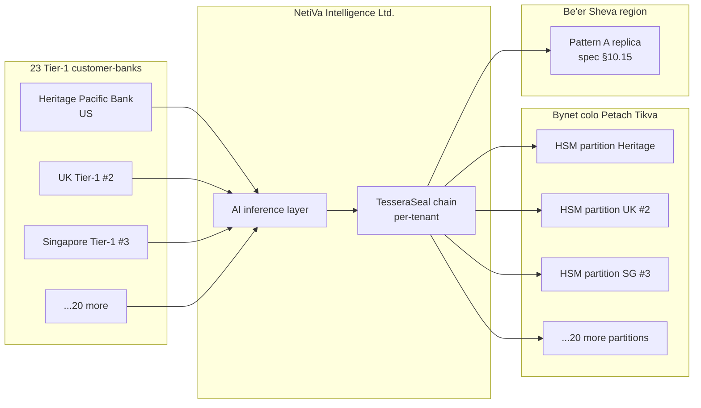

# 🧾 Diary of an Audit Day — NetiVa Intelligence Ltd. (Tel Aviv, Day 1 of 3)

**Engagement:** Independent vendor-management evaluation commissioned by Heritage Pacific Bank ($180B regional, US OCC-regulated), cost-shared with NetiVa, deliverable consented by NetiVa for read by Bank of Israel (Pikuach HaBankim — banking supervision under Directives 357 / 359 / 361 / 365 / 367 / 411 / 414) and Israeli Securities Authority during their next supervisory review
**Client:** NetiVa Intelligence Ltd. — Israeli AI company, Sarona Tower HQ (Tel Aviv), R&D campus in Herzliya, ~340 employees, Unit 8200 alumni founders. Financial-market intelligence and AI-driven AML tooling for 23 Tier-1 banks across US, UK, Singapore, Israel, Australia. Multi-tenant SaaS vendor under spec §10.1 IKM-registry uniqueness discipline.
**Posture:** TesseraSeal in production for 14 months. Multi-tenant. 23 customer-banks → 23 IKMs in dedicated HSM partitions per spec §10.5 FIPS 140-2 Level 3 custody. Each AI use case is a `tenant_id` under that bank's IKM (per-tenant HKDF binding under spec §4.1). ~110 tenants in production across AML transaction monitoring, KYC enhancement, sanctions screening, and market-surveillance.
**Date:** Tuesday, two weeks after Olmstead. **Day 1 of a 3-day visit.**
**Auditor:** the same eight-person team — but split across two time zones for the first time. Dawn, Luis, and Chen flew to Tel Aviv. Raj, Elena, Mike, Diana, and Tom are joining remotely from the US Eastern time zone.

---

## Context

NetiVa Intelligence Ltd. occupies the 38th and 39th floors of Sarona Tower in central Tel Aviv. The R&D campus is up the coast in Herzliya. The company was founded eight years ago by three Unit 8200 alumni. Two of the founders are still on the executive team. The third runs a venture firm down the street. The product line is two halves of one thesis — financial-market intelligence (a public-listing arm regulated by the Israeli Securities Authority) and AI-driven AML tooling for Tier-1 banks (regulated indirectly through bank-customer relationships under Bank of Israel oversight per Directives 357 third-party risk and 414 vendor management, with cyber-resilience under Directives 359 cyber defense and 361 cyber risk, operational resilience under Directive 365, cloud and GenAI localisation under Directive 367, incident reporting under Directive 411, and INCD coordination under Directive 361 §5).

The customer list is 23 Tier-1 banks. US, UK, Singapore, Israel, Australia. NetiVa's AML tooling sits in front of each bank's transaction-monitoring stack — model scoring, alert prioritization, narrative drafting for SAR filings, KYC enrichment, sanctions list screening, and market-surveillance pattern detection. Each customer-bank holds its own IKM in a dedicated partition on NetiVa's HSM cluster at a Bynet Data Communications colocation facility in Petach Tikva (FIPS 140-2 Level 3 custody per spec §10.5). Each AI use case under that bank — typically four to seven of them — is a `tenant_id` under that bank's IKM. The total tenant count across the platform is around 110. The IKM-registry uniqueness rule under spec §10.1 enforces `(institution, tenant_id)` uniqueness across the platform; same `tenant_id` strings across distinct banks are conformant because their per-bank IKMs differ.

NetiVa stood up TesseraSeal 14 months ago. The chain is the ledger of record for every AML model decision, every sanctions-screening match, every KYC enrichment event, every market-surveillance alert, and every credential rotation, configuration change, model-retraining event, and operational anomaly. Spec §1.2 epistemic scope governs the chain claim: the chain proves what the AI said and that the record was not tampered with after capture; it does not prove the substantive correctness of the captured content (factual accuracy, AML policy compliance, freedom from bias). The chain runs Pattern A active-active across two Israeli regions — Tel Aviv-Petach Tikva and Be'er Sheva — under spec §10.15. Run-locality is enforced through SDK per-process region binding (one SDK process per region, pinned to its region's IKM custody endpoint). Cross-region replication-completion events are recorded as `master.cross_region_replication_completed` per spec §10.2 and §10.15 Pattern A invariant 5 — Wave-6 third errata tightened the freshness rule so per-region count and timestamp MUST reflect the replication pipeline's actual state at emission time, not a cached representation.

The engagement is unusual in its commissioning shape. Heritage Pacific Bank — a $180B regional headquartered in Charlotte, NetiVa's largest US customer by transaction volume — commissioned the evaluation under its own vendor-management framework (OCC Bulletin 2013-29 + the June 2023 Interagency Guidance on Third-Party Relationships). NetiVa consented to the engagement and cost-shares the fee. The deliverable will be read by Heritage's vendor-management committee, NetiVa's own audit committee, and (with NetiVa's permission) by Bank of Israel and Israeli Securities Authority examiners during their next supervisory review. Three audiences across two regulatory jurisdictions reading one report. The cross-language cross-jurisdiction pattern is exactly what spec §10.17's "cross-language CC8.1 discoverability for multi-tenant SaaS vendors" clause speaks to and what spec §10.18 CC8.1-and-runbook cross-referencing closes operationally — both clauses are normative and both were folded into the spec body in the Wave-6 second errata after the engagement that produced this very story surfaced the gap.

Dawn's team was engaged in March. The 3-day visit was scheduled around NetiVa's Q1 board meeting and Heritage's vendor-management committee calendar. Day 1 (today) is the architecture overview, the per-tenant isolation deep-dive, and the disaster-recovery posture. Day 2 is HSM custody and the IKM-registry deep-dive at the Bynet colocation in Petach Tikva. Day 3 is the cross-border data-flow walkthrough and the regulator-coordination tabletop with the INCD's banking-sector liaison.

The engagement reads against several v1.0b spec sections that the team has internalized over the prior seven engagements: §10.1 IKM-registry uniqueness for multi-tenant SaaS, §10.5 FIPS 140-2 Level 3 HSM custody with §10.6 32-byte minimum and §10.6.1 RNG generation, §10.7 software-key adapter exclusion in production, §10.8 constant-time comparison, §10.9 IKM retention coupling, §10.10 IKM rotation crossing the seal boundary, §10.11 / §10.11.1 ECOA adverse-action notice translation and the new `audit.ecoa.adverse_action.*` schema, §10.12 verifier CLI exit-code contract, §10.13 evidentiary-artifact retention, §10.14 trusted-time integration RECOMMENDED at v1.0b, §10.15 multi-region resilience Pattern A, §10.16 SaaS-edge capture connectors, §10.17 HSM partition ceremony attestation (the section this engagement helped produce, per Wave-6 second errata), §10.18 CC8.1 and runbook cross-referencing, §10.19 chain-coverage map with version-stamping per Round-17 M&A-P3, §10.21 cross-vendor model-handover schema with Round-17 M&A-G2 contract binding, §10.22 redaction discipline pre-MAC at the SDK boundary, §10.23 consumer-correlation index integrity, §10.24 entity succession, §10.25 run resume and chain-tail acquisition, §10.26 reference verifier distribution discipline, §1.2 epistemic scope, §1.3 security definitions, §1.4 compositional-security argument, §3.5 canonical-encoding, §4.1 per-tenant HKDF binding, §4.2 daily Merkle seal, §4.3 sign_payload v1.0b 12-line wire form, §4.4 OTLP attribute set including `ffiec.chain.region` and `audit.cross_border_transfer.*`, §4.4.6 SaaS-edge connector source attribution, and §7 verification procedure with §10.12 exit codes.

NetiVa's company-side liaison is **Yael Shamir**, VP of Information Security. Ex-Mossad cyber. Fluent Hebrew, English, Russian. Direct. Treats Dawn as a peer. She is not a regulator and not an auditor; she is a defender, and her threat model assumes capable nation-state adversaries are continuously present in the network. She does not oversell. She challenges any imprecise question.

The engagement also has a second client-side voice: **Adrienne Kowalski**, VP of Vendor Risk at Heritage Pacific Bank, joining remotely from Charlotte at the afternoon US-overlap window. Adrienne and Dawn have known each other for years. Her reading angle is plainly transactional — *"is this NetiVa deployment good enough for me to certify in our vendor-management framework, OCC-acceptable, with renewal at 30-day notice if anything shifts."*

By the time Dawn's visiting team flew to Tel Aviv, TesseraSeal had been audited at six US institutions across banking, healthcare, BaaS, industrial, biopharma, utility, and higher-ed. Northbridge was seven engagements back. One §10.16 SaaS-edge non-conformance, the chain itself otherwise held byte-for-byte — the cleanest engagement Dawn had run in years. NetiVa was the eighth engagement of the cycle and the first multi-jurisdiction multi-tenant SaaS vendor; Dawn had stopped expecting another Northbridge several weeks ago. The chain primitive was familiar. The new question at NetiVa was whether the multi-tenant SaaS-vendor + HSM-partition + Israeli regulatory composition (Bank of Israel directives 357 / 359 / 361 / 365 / 367 / 411 / 414, PPL Amendment 13, INCD coordination, Equal Opportunity Employment Law) holds together.

This is the diary of Day 1.

---

## Audit Team

### In Tel Aviv

- **Dawn** — Lead Auditor (governance and narrative)
- **Luis** — DevOps, logs, pipelines
- **Chen** — Data engineering and ETL

### Remote from the US (joining at the local-afternoon overlap window)

- **Raj** — Database specialist (joins 8:30 AM ET = 3:30 PM IL)
- **Elena** — CRM systems (joins remote)
- **Mike** — Application and API layer (joins remote)
- **Diana** — IAM and access control (joins remote — early at 4:30 AM ET to participate in the morning IAM-via-video-link block)
- **Tom** — Internal-audit liaison specialist (joins remote, partners with the client CAE in Tel Aviv via video link)

Client-side liaison in Tel Aviv: **Yael Shamir**, VP of Information Security, NetiVa Intelligence Ltd. Ex-Mossad cyber. Direct. Will challenge an imprecise question.

Customer-bank liaison joining remote: **Adrienne Kowalski**, VP of Vendor Risk, Heritage Pacific Bank. Charlotte. Joins 3:30 PM IL.

---

## 🌅 7:30 AM IL — Tea with Yael

Dawn had walked the eight blocks from the hotel to Sarona Tower in the cool morning. Tel Aviv was still waking up. The market vendors at HaCarmel had been setting out olives and ka'ak for forty minutes. The traffic on Kaplan was still light. By the time Dawn rode the elevator to the 38th floor, the lobby coffee bar was already open and Yael was waiting at a small table by the window.

Yael did not stand. She gestured to the chair across the table. Two glass mugs, two tea bags, hot water in a small carafe.

"Dawn. Good flight?"

"Long. We slept the second half."

"Good. We have a long day. The trio is in the building?"

"Luis and Chen are coming up at 8:15. The rest of the team is asleep. They'll come on the bridge at 3:30 our time."

Yael nodded once and poured the water. "Three days. You set the order. I will not push."

"Day 1 is the architecture, the per-tenant isolation, the DR posture. Day 2 is the colocation and the HSM custody. Day 3 is the cross-border walk and the INCD tabletop."

"That is the order I would set."

Dawn tasted the tea. Mint and something else — verbena, maybe. "One thing before kickoff. Heritage commissioned this. You consented to it. The deliverable goes to your audit committee, Heritage's vendor-management committee, and — with your permission — Bank of Israel and ISA when their next supervisory cycle comes around. You are sure on the third one."

"I am sure. Bank of Israel has been asking about TesseraSeal in the AML examiner room for nine months. ISA has been asking about it in the public-listing-arm examination since last fall. If your report is good, it serves both audiences. If your report finds something, I want it found before they find it."

"You said it would not be ego."

"It will not be ego."

Dawn drank the tea.

Yael set down her mug. "One thing more before we walk in. Spec §1.2. The chain proves what the AI said and that the record was not tampered with after capture. It does not prove the AI's statement is factually accurate, policy-compliant, or unbiased. We tell our customer-banks that on Day 1 of every onboarding. The chain is the integrity foundation, not the truth foundation. Bank of Israel accepts the framing. INCD accepts it. Heritage's vendor-management committee accepts it. If your report claims more than that, your report is wrong. If your report claims less than that, your report is incomplete."

Dawn wrote in her notebook. *§1.2 epistemic scope. Yael said it without naming the section number, but she has read the spec. That is what mature engineering looks like — the team has internalized the spec's epistemic discipline so the language they use in operational conversations matches the spec's language without translation.*

> **🔍 Dawn's note (internal):**
> *Yael set the rules with one sentence. "If your report finds something, I want it found before they find it." That is the shape of mature engineering and it is also the shape of someone who has spent her career on the defending side. Today she is on the audited side and the discipline carries over. The §1.2 framing is on her tongue without effort. She has read the spec.*

---

## 🌅 8:30 AM IL — Kickoff and the Elevator Up

Dawn met Luis and Chen in the Sarona Tower lobby at 8:15. Luis had already been to the coffee bar — he had a cardboard cup of something dark and a pastry in a paper bag. Chen had her laptop case and a bottle of water. Neither of them had slept enough. Both of them were ready.

"Same trio kickoff as usual?" Luis asked.

"Smaller trio than usual."

"I noticed."

Dawn pressed the elevator call button. The car came down quick. The three of them got on alone. The car started up.

"We have done seven of these in seven months," Dawn said. "Multi-tenant, full deployment, Israel, nation-state threat model. This is the hardest version yet. The reason is not that NetiVa is worse. The reason is that the threat model assumes someone has been inside their network for 18 months."

Luis set his coffee cup down on the floor between his feet so he could button his cuff. "Northbridge was full deployment, single tenant. Mercator was bifurcated. Stelvio was tiered. Atrio was the multi-tenant test."

"Atrio was forty-seven fintechs under twelve sponsor banks. NetiVa is one hundred and ten tenants under twenty-three customer-banks. The math is bigger but the structural property is the same. The difference is the threat model. Atrio's adversary was a determined fraud ring with a checkbook. NetiVa's adversary is, by their own reckoning, IRGC cyber and Lazarus-equivalent. The chain has to hold under that posture."

Chen looked at the floor indicator. "Helmstad?"

"Helmstad was the regulator-stack engagement. Seventeen audiences. Different shape. NetiVa is two regulators reading concurrently — Bank of Israel and ISA — plus Heritage's vendor-management committee plus NetiVa's own audit committee plus, behind that, the INCD coordination assumption. Pacific Crescent was the operational-resilience play. NetiVa is operational-resilience under nation-state pressure."

"Olmstead?"

"Olmstead was the federalism problem. One use case under TesseraSeal, everything else legacy. NetiVa is the inverse. Everything is under TesseraSeal because the customer-banks demanded it as a contractual condition of vendor onboarding. The diary baseline is gone here. There is no shadow stack to compare against. Spec §10.19 chain-coverage map will be operationally easy because almost everything is in the chain — what's outside is the customer-bank's own retail consumer-account systems and Heritage's upstream Salesforce CRM under the §10.16 mirror connector."

Luis picked up his coffee. "Recurring line."

"It never is. But under the INCD threat model, even when it is — you stress it harder."

Chen pressed Luis. "What's the §10.17 read here?"

Luis: "Wave-6 second errata. The spec was amended after the Tel Aviv engagement that's about to happen. §10.17 mandates `chain.partition_ceremony_attended` for partition creation, partition wipe, IKM rotation, partition-PIN reset, controlling-person rotation. Today's engagement is the source of the spec text. We will surface the partial because we know what §10.17 will say, but we won't pretend the spec already says it — the spec amendment hadn't landed when Dawn booked the trip. The right framing is: today's engagement produces a partial; the spec amendment closes the partial against normative text the engagement helped write. That is the right shape — the spec is responsive to field engagements, not the other way around."

Dawn nodded once. "Exactly. We surface the partial. We name the fix. The spec amendment is the post-engagement closure narrative. The institution remediates against §10.17 normative text, not against what we recommended in our deliverable."

"That's the one."

The elevator stopped at thirty-eight. The doors opened on a glass wall and a NetiVa logo in brushed steel. Yael was at the reception desk talking to the security guard in Hebrew. She turned when the elevator doors opened and switched to English.

"Dawn. Luis. Chen. Welcome to NetiVa. The conference room is around the corner. The wall monitor is already on. I have my CISO and my SRE lead in the room. The rest of your team comes on the bridge at 3:30. We'll start with the architecture."

> **🔍 Dawn's note (internal):**
> *Three of us. Eight time zones. Twenty-three customer banks watching. Nation-state threat model. The chain either holds or it doesn't, and either way I want to be sure today.*

---

## 🧩 9:15 AM IL — Architecture Walkthrough on the 38th-Floor Wall Monitor

The conference room was glass on three sides. The fourth wall held a single 98-inch monitor wired into a workstation under the table. Yael stood at the wall with a clicker. Two other NetiVa staff sat at the table — **Eitan**, the CISO; **Maya**, the SRE lead. Both nodded at the trio when they came in. Neither of them said much. Yael was the voice in the room.

She put up the architecture diagram.



Yael let the diagram sit. "Twenty-three customer-banks. Twenty-three IKMs. Each IKM lives in a dedicated partition on the Thales Luna PCIe HSM cluster in Bynet colo Petach Tikva. Thales Luna 7000 PCIe is on the spec §10.5 conformant-HSM list — FIPS 140-2 Level 3, private signing key non-extractable. The Be'er Sheva region holds the active-active replica per spec §10.15 Pattern A. Each customer-bank's tenants — between four and seven of them depending on the use cases the bank licenses — derive session keys from that bank's IKM by HKDF with `info_base || '|' || utf8(tenant_id)` per spec §4.1. Each IKM is at least 32 bytes (256 bits) per spec §10.6 and was generated inside the partition by the HSM's internal CSPRNG per spec §10.6.1 — the highest-assurance RNG posture; the `master_key.generated` operational event records `rng_source = 'hsm.thales-luna-7000'` for every IKM under §10.2."

Dawn wrote in her notebook. *Twenty-three IKMs in twenty-three partitions. Per-tenant derivation. Same shape as Atrio scaled up by a factor of two. Different threat model.*

Luis asked the first question. "The HSM cluster — how many physical units?"

Maya answered. Her English was careful. "Six PCIe Luna 7000s in the primary partition cage at Bynet Petach Tikva. Six standby in Be'er Sheva. The partition assignments are fixed at customer onboarding. A new customer-bank gets a new partition created during their onboarding ceremony — the bank's CISO and our CISO are both present, the partition PIN is split 2-of-2, the IKM is generated inside the partition and never leaves."

Chen wrote. *2-of-2 PIN split between customer-bank CISO and NetiVa CISO. Same shape as Atrio's bank-CISO/Atrio-CISO split. The difference is twenty-three different banks instead of twelve.*

Dawn asked, "And the run-locality?"

Yael clicked to the next slide. "Run-locality is enforced. Every chain entry carries a `region` field — `il-pt` for Tel Aviv-Petach Tikva, `il-bs` for Be'er Sheva — recorded under MAC binding via the `ffiec.chain.region` attribute per spec §4.4. The load-bearing run-locality enforcement is the SDK per-process region binding under spec §10.15 — one SDK process per region, pinned to that region's IKM endpoint and ledger endpoint. Multi-region SDK processes are non-conformant; the attribute itself is advisory evidence, the per-process binding is the integrity floor. The seal job runs in the region that owns the run. Cross-region writes are prevented at the application layer and verified by the seal aggregator. Replication completion is a chain event — `master.cross_region_replication_completed` per spec §10.2 — and the per-region count and replication-completion timestamp reflect the replication pipeline's state at emission time per the §10.15 Pattern A invariant 5 freshness rule (Wave-6 third errata; we do a synchronous read against the replication pipeline rather than a cached representation)."

> **✓ Confirmation #1**
> Per-customer-bank HSM partitioning is structural. Twenty-three customer-banks, twenty-three partitions on twelve PCIe Luna 7000s split across two Israeli regions (six primary in Bynet Petach Tikva, six standby in Be'er Sheva). 2-of-2 PIN split between customer-bank CISO and NetiVa CISO at onboarding. IKMs never leave the partition. Run-locality is enforced and replication completion is a sealed chain event under spec §10.15.

Chen asked the next question. "Yael — the seal job. Each customer-bank's daily seal is signed by a different Ed25519 keypair, yes?"

"Yes. Each customer-bank's IKM lives in its own partition. The daily seal under spec §4.2 derives a per-bank session key by HKDF and signs the per-bank Merkle root with the partition-resident Ed25519 keypair per spec §4.3. The Ed25519 signature has EUF-CMA security per FIPS 186-5 / RFC 8032, and the per-event MAC under spec §1.3 has EUF-CMA security as HMAC-SHA-256 per FIPS 198-1; the §1.4 compositional argument names the three independent layers (per-event MAC, daily Merkle seal, HSM-rooted root signature) — breaking any one layer is insufficient to silently tamper with a verified chain. We have twenty-three Ed25519 keypairs in production, one per partition. Each keypair has a `pubkey_fingerprint` that the customer-bank's verifier credential is bound to. A wrong fingerprint at verification time refuses immediately. Constant-time comparison is mandatory under spec §10.8 — we use Python's `hmac.compare_digest` for both the `key_fingerprint` check at §7 step 8 and the `payload_hash` MAC compare at §7 step 9. Naive byte-by-byte comparison would leak timing information; that's a non-conformance regardless of whether the chain ever sees an attack."

Chen wrote. *Twenty-three Ed25519 keypairs. Twenty-three pubkey_fingerprints. The fingerprint is the verification anchor on the customer side.*

Luis pulled a new thread. "Yael — the §10.6.1 RNG provenance for the partition-resident IKMs. Walk it."

Maya answered. "Each IKM is generated inside the Thales Luna 7000 partition by the HSM's internal CSPRNG — the highest-assurance pattern under §10.6.1, and the RNG is FIPS 140-2 Level 3-validated as part of the HSM's own certification. The `master_key.generated` operational event under §10.2 stamps `rng_source = 'hsm.thales-luna-7000'`. We do not use OS-level CSPRNG or RDRAND for IKM material; the partition-resident generation is the §10.6.1 highest-assurance posture and matches the INCD-baseline elevation we accept above the spec-conformance floor. A weak RNG would defeat the entire chain — per §10.6.1 the per-tenant session-key isolation, the offline-non-grindability of the §10.6 16-byte fingerprint, and the §1.4 layered authentication all depend on IKM unpredictability. The 32-byte length minimum under §10.6 is necessary but not sufficient — we satisfy both the length and the source rules."

Luis: "Fingerprint truncation. Spec §10.6 names the 16-byte truncation as forensic-familiarity-driven. Have you considered moving to the 32-byte mode that the Wave-6 spawned Mihail Vasiliev review proposed for >25-year horizons?"

Maya: "Not yet. Our retention horizon is 7-9 years per FFIEC and Bank of Israel; the 16-byte truncation's birthday bound at 2^64 is comfortably outside that horizon under any practical compute budget. We track the 32-byte option as a v1.0b optional discipline (the Wave-6 spawned cryptographic-agility roadmap names it for >25-year horizons). When our retention horizon extends — if a customer-bank's regulator extends to 25 years for AML records, for example — we will move to the 32-byte mode."

Dawn wrote. *§10.6 / §10.6.1 deep-dive complete. Highest-assurance RNG. 32-byte option tracked. The team reads the cryptographic-agility roadmap.*

Dawn pulled the next thread. "And the fingerprint rotation cadence?"

"365 days per spec §4.3. Two of our customer-banks have rotated already — Heritage Pacific rotated in March of this year, UK Tier-1 #2 rotated last August. The rotation procedure ran clean both times. The IKM rotation itself crosses the seal boundary per spec §10.10; the day-after seal records `key_versions = [old, new]` and the `master_key.rotation_observed` operational event under §10.2 is emitted when an entry under the new `key_version` first appears. We retain every IKM generation per spec §10.9 retention coupling — a request to retire an IKM whose `key_version` is still referenced by retained chain entries requires explicit override and is logged as `master_key.retired`. The rotation hand-off is signed by both the outgoing and incoming keypairs. The verifier handles the hand-off transparently — `key_versions` cross-check at §7 step 11 catches silent rewrites against actual per-event distribution, and the `signed_at` per §4.3 binds the rotation moment under the HSM signature."

Dawn wrote. *Rotation is itself a chain event with dual-signed hand-off. The verifier reads the `signing_pubkey_fingerprint` field per entry and validates the entry against the keypair active at that entry's seal time. That is the right structural shape for long-running chains across rotation boundaries.*

Yael paused. "Be precise — what specifically are you asking about the threat model? You said 'nation-state' on the elevator and Eitan caught it on the lobby camera audio."

Dawn smiled. The lobby camera had picked up the elevator-doors-opening conversation. Yael's people had clipped it and forwarded it to her in the eleven minutes between the elevator and the kickoff. "Fair. Specifically — your operational assumption is that capable nation-state actors are present in the network and the chain has to hold under their access. IRGC cyber. Lazarus-equivalent. North-Korean adjacent groups. Russian SVR-style. INCD coordination assumes Iran cyber is actively probing Israeli financial infrastructure. The chain claim is that even if a determined attacker is inside the application layer, they cannot forge a chain entry, and they cannot read a tenant they don't have the credential for, and they cannot tamper with a sealed entry without the daily seal failing the next morning."

Yael nodded once. "That is the operating assumption. We do not say 'if'; we say 'when.' Eitan?"

Eitan spoke for the first time. "We assume 18-month dwell. INCD's published baseline. We design for it. The chain is a control we trust because the design says we should — the IKM is on the HSM, the application cannot read it, the daily seal is signed by Ed25519 inside the HSM, the verifier runs on a separate operational footprint. The §1.4 compositional-security argument is what makes me sleep. Three independent authentication layers: per-event HMAC (Layer 1, §4.1), daily Merkle seal (Layer 2, §4.2), HSM-rooted root signature (Layer 3, §4.3). An attacker who breaks one layer cannot silently tamper. An attacker who has root on the SDK process — spec §1.2's fourth-class compromise; Adversary F per the threat-model design doc — can produce verifying entries until detection, but cannot retroactively alter past entries. That bounds the forward-only attack window. We compose host-hardening, anomaly detection on the captured stream, and out-of-band agent-behavior monitoring against that residual class."

Dawn wrote. *That is the right answer. The chain is not a prevention control. It is a detection control. The team understands the difference. Spec §1.2 epistemic scope is exactly the framing — what the chain proves, what it does not prove. The team has read the spec.*

Dawn asked the follow-on. "Software-key adapter posture. Spec §10.7. You ship an HSM-only build for production?"

Eitan: "Compile-time exclusion. The strictest pattern under §10.7. The software adapter source is conditional-compiled out of production builds — a build-flag gates the file. No run-time-only environment variable can resurrect what was never compiled in. The verifier under §10.7 also refuses any chain whose `dev_mode` is true or whose `kms_handle_uri` begins with `plaintext-` under `--strict`. Double-protection by spec design."

Dawn wrote. *Compile-time exclusion. The §10.7 strictest pattern. CC8.1 documents the adapter is unreachable.*

Yael continued. "One more piece. Spec §1.3 effective security level. Each customer-bank's chain composes three layers — per-event MAC under §4.1 with HMAC-SHA-256 (FIPS 198-1) providing EUF-CMA security; daily Merkle seal under §4.2 with RFC 6962 leaf-and-node prefixes providing second-preimage resistance over SHA-256 (FIPS 180-4); HSM-rooted root signature under §4.3 with Ed25519 (FIPS 186-5, RFC 8032) providing EUF-CMA security. Per §1.4 the composition is at least as strong as the strongest layer, and the effective security level is 128 bits per NIST SP 800-175B's baseline. We track the cryptographic-agility roadmap from the Wave-6 spawned Mihail Vasiliev (CFRG) review — hash-function agility with five-call-site dispatch, hybrid signature variant B with Ed25519+ML-DSA-65 or Ed25519+SLH-DSA-SHA2-192f pairings, key transparency with regulator-operated CT log, HNDL response with dual-algorithm seal mandate effective 2030-01-01. Our HSMs will support FIPS-204-validated post-quantum primitives by 2027-2028 per Thales's published roadmap; we will activate the dual-algorithm seal earlier than the 2030-01-01 mandate if our customer-banks ask."

Dawn wrote. *§1.3 / §1.4 cryptographic foundations engaged. Crypto-agility roadmap is on Yael's slide. The team is forward-looking about post-quantum.*

The architecture walkthrough ran another twenty minutes. AI inference layer, chain integration points, daily seal job topology, verifier credential path, the customer-bank-facing portal where each bank's CISO can run the reference verifier per spec §10.26 against their own tenants from their own console. The verifier is the spec-pinned reference verifier release per §11 References — Cosign-signed binary, reproducible build, per-platform binaries (Linux x86_64 + ARM64 in production, Windows + macOS for examiner laptops), SHA-256 / SHA-512 manifests, CycloneDX SBOM, all per §10.26 distribution discipline. Each customer-bank's CC8.1 names the implementation, version, and verification key per §10.26's three-name citation rule. Yael covered each piece without hurrying.

At 9:55 she stopped. "Database deep-dive next?"

Dawn nodded. "Chen is on the laptop. Luis is going to tail the daily seal logs while Chen runs queries. I want to see the IKM registry first."

---

## 🧠 10:00 AM IL — Database Deep-Dive (Chen on the Laptop)

Chen took the seat at the workstation under the wall monitor. Maya had pre-provisioned a read-only credential against a staging mirror of the production registry — same schema, same constraints, anonymized customer-bank names where the real names had not been pre-cleared. The five US customer-banks were on the cleared list (Heritage Pacific is paying for the engagement; the others had consented in writing). The non-US banks appeared as `bank-21`, `bank-22`, etc.

Chen opened a psql session.

```sql
SELECT bank_id, COUNT(*) AS tenant_count
FROM ikm_registry
GROUP BY bank_id
ORDER BY tenant_count DESC, bank_id;
```

Twenty-three rows. Total tenant count of one hundred and eight. The largest single customer-bank was Heritage Pacific with seven tenants — AML transaction monitoring, KYC enrichment, sanctions screening, market-surveillance, two pilot use cases under contractual review, and a regulatory-reporting drafting tenant. The smallest was a Singapore-listed bank with three.

Chen wrote. *108 tenants across 23 banks. Mean ~4.7. Range 3 to 7. The platform claim is consistent with the headline number Yael gave us.*

Yael watched over Chen's shoulder. "The query plan is a primary-key range scan. The constraint is the same as you saw at Atrio — `PRIMARY KEY (bank_id, tenant_id)` plus a separate `UNIQUE INDEX` on the same pair. We borrowed the schema shape from the spec's reference example in §10.1. The §10.1 multi-deployment uniqueness rule is what we enforce globally — single global IKM registry across both Israeli regions, NOT a per-region registry; cross-region replication of the registry happens through the HSM's internal partition replication (Thales-supported). The check constraint on `tenant_id` length is between 6 and 64 — we are slightly tighter than Atrio's 4-to-64 because our `tenant_id` strings are typically `aml-tx-monitoring-v2` or `kyc-enhancement-v1` — they are use-case-named and never short. The character class is the spec §3 `^[A-Za-z0-9_.\-]{1,255}$` enforcement — no `|` byte (0x7C) anywhere in `tenant_id` so the HKDF `info` parameter is unambiguously parseable per §4.1."

Chen ran a second query — adversarial.

```sql
INSERT INTO ikm_registry (bank_id, tenant_id, hsm_partition, ikm_key_handle,
                           use_case, registered_by)
VALUES ('heritage-pacific', 'aml-tx-monitoring-v2', 'partition-heritage',
        'handle-clone', 'AML Clone', 'chentest');
```

Rejected.

```
ERROR:  duplicate key value violates unique constraint "idx_bank_tenant"
DETAIL:  Key (bank_id, tenant_id)=(heritage-pacific, aml-tx-monitoring-v2)
         already exists.
```

Chen ran a second adversarial — same `tenant_id` across two banks.

```sql
INSERT INTO ikm_registry (bank_id, tenant_id, hsm_partition, ikm_key_handle,
                           use_case, registered_by)
VALUES ('bank-21', 'aml-tx-monitoring-v2', 'partition-bank-21',
        'handle-bank-21-aml', 'AML Bank 21', 'chentest');
```

Accepted. Chen rolled it back.

She looked at Yael. "Same as Atrio. Per-bank IKM provides cross-bank isolation. Two banks deriving keys for the same `tenant_id` string still produce different session keys."

Yael nodded once. "Per spec §4.1. The IKM is the global discriminator. The `tenant_id` is the per-bank discriminator. Both have to differ for the chain entry to live in a different chain."

Chen did the third adversarial — short `tenant_id`.

```sql
INSERT INTO ikm_registry (bank_id, tenant_id, hsm_partition, ikm_key_handle,
                           use_case, registered_by)
VALUES ('heritage-pacific', 'kyc', 'partition-heritage', 'handle-short',
        'Short tenant', 'chentest');
```

Rejected.

```
ERROR:  new row for relation "ikm_registry" violates check constraint
DETAIL:  Failing row contains (heritage-pacific, kyc, ...).
HINT:    tenant_id length must be between 6 and 64.
```

Chen wrote. *Same structural shape as Atrio. The length lower bound is tighter — 6 instead of 4 — and consistent with NetiVa's use-case naming convention.*

> **✓ Confirmation #2**
> The IKM registry under spec §10.1 enforces uniqueness at the database layer with both PRIMARY KEY and UNIQUE INDEX on `(bank_id, tenant_id)`. Three adversarial inserts behave per spec — duplicate within the same bank rejected, same `tenant_id` across two banks accepted (cross-bank isolation by per-bank IKM), short `tenant_id` rejected by length check (NetiVa's 6-to-64 bound, tighter than the spec's reference 4-to-64).

Luis was tailing the daily seal logs on a separate laptop. He looked up. "The seal job that ran at 02:14 IL last night sealed all twenty-three banks. Per-bank Ed25519 signature, per-bank HSM partition, per-bank `pubkey_fingerprint`. Twenty-three signatures, twenty-three fingerprints, no crossover. Seal duration was 4.7 seconds total — averaged 204 milliseconds per bank, which tracks the Luna 7000 Ed25519 throughput Maya described."

Yael smiled at the corner of her mouth. "Yes. The daily seal job is the load-bearing operational event. We watch the wall-clock duration every morning. If it ever climbs past 30 seconds we page the on-call. It has not paged the on-call in 14 months. The seal job emits `seal.job_started`, `seal.job_completed`, `seal.job_failed` events under §10.2; the `signed_at` value on every seal is HSM-signed per §4.3 so the timestamp is bound under the HSM signature alongside the Merkle root. The §10.13 evidentiary-artifacts retention captures the seal-job logs at nine years. Operational anomalies on the seal duration would surface to Bank of Israel under Directive 411 §3 within thirty minutes; we have not had to file."

> **✓ Confirmation #3**
> Per-customer-bank daily seal aggregation. Twenty-three banks, twenty-three Ed25519 signatures, twenty-three public-key fingerprints, no crossover. 02:14 IL last-night run sealed in 4.7 seconds wall-clock at ~204 ms per bank. The operational pager threshold is 30 seconds; in 14 months the threshold has not fired.

The trio worked through the registry for another forty minutes. Chen pulled session-key derivations against the staging HSM (read-only — derivations are non-destructive when the IKM is partition-bound, and the per-tenant HKDF binding under spec §4.1 is deterministic from `info_base || '|' || utf8(tenant_id)` so the same query against the same IKM produces the same session key bytewise). Luis pulled the seal logs from the previous fourteen days, including the §4.2 day-boundary `received_at` partition — events whose `received_at` falls in the UTC day belong to that day's seal per §4.2.2. The verifier under §7 step 11 cross-checks `seal.key_versions == sorted(set(entry.key_version for entry in the day))` so any silent rewrite of the seal's `key_versions` against actual per-event distribution surfaces at the cross-check; in 14 months no cross-check has fired across the twenty-three banks. Luis also confirmed the `sign_payload_version = "v1.0a"` on every seal — NetiVa is on the locked v1.0a 10-line wire form for older chains; the v1.0b 12-line form (binding `key_versions_canon` and `hex(kms_handle_uris_digest)` per Round-17 NIST-G1 / NIST-G2 close-out) is queued for the next SDK release. The chain is forward-compatible — v1.0a chains remain verifiable under any v1.0b verifier without re-sealing per the §12 change-log. The pattern held across the 14-day window. No anomalies.

Chen ran one more query that Yael had not seen coming.

```sql
SELECT bank_id, tenant_id, COUNT(*) FILTER (WHERE event_type LIKE 'chain.%') AS ops_events,
       COUNT(*) FILTER (WHERE event_type = 'model.decision') AS model_decisions,
       MIN(seq) AS first_seq, MAX(seq) AS latest_seq
FROM chain_entries
WHERE bank_id = 'heritage-pacific'
  AND tenant_id = 'aml-tx-monitoring-v2'
GROUP BY bank_id, tenant_id;
```

The result came back. Heritage Pacific's AML tenant. 1,847,392 entries total. 14,231 operational events under the `chain.*` namespace. 1,833,161 model decisions. Sequence numbers spanning the full 14 months of operation, no gaps.

Chen wrote. *Operational events are about 0.77% of the total entry volume. The chain is dominated by model decisions, which is the right shape — the operational events are configuration and control activities, the model decisions are the actual AML transaction-monitoring scoring. The 1.83M model decisions over 14 months is consistent with a Tier-1 bank's transaction volume passing through an AML overlay.*

Yael saw the query and raised an eyebrow at Dawn. "That was clever. The ratio is the integrity test on the chain composition. If a chain claimed to be a model-decision chain were actually 50% configuration events, the claim would not hold."

Dawn smiled. "Chen earned her seat by being the one who asks for that ratio."

Chen ran the same query against the bank-19 sanctions-screening tenant — the one with the April 30 incident. The ratio held: 14,847 operational events, 1,022,489 sanctions screening decisions, no sequence gaps. The eleven replay entries from April 30 showed up as the expected eleven extra entries with `parent_event_id` references back to the originals.

At 10:55 Yael said, "Diana joins at 11. The IAM video link to the colocation."

Dawn looked at her watch. "She set her alarm for 4:25 AM ET. She'll be awake."

---

## 🔐 11:00 AM IL — IAM via Video Link to Bynet Colo (Diana, 4:00 AM ET)

The wall monitor switched to a split feed. Top half: Diana's face, dark behind her, a desk lamp on. Bottom half: a video link to the Bynet Petach Tikva colocation, where a NetiVa engineer named **Avi** stood inside the partition cage with a tablet. Avi's English was good. He had arrived at the colo at 10:30 IL specifically for this block.

Yael opened the call. "Avi. Diana. We have one hour. Diana, your scope is the customer-bank verifier credential rotation, the 2-of-2 partition PIN ceremony recording, and the customer-bank-facing console RBAC."

Diana was already typing. "Avi, can you walk me through where the credential-rotation runbook lives?"

Avi held up the tablet. "The runbook is in our internal Confluence. The page title is 'Customer Verifier Credential Rotation — 90 Day.' I can share the screen now."

The runbook came up on the wall. It was in English. The procedure was well-formed — quarterly trigger date, customer-bank notification at T-14 days, rotation execution at T-0, old credential revocation at T+7 days, new credential validation by the customer-bank's own verifier run within T+14 days. Twelve steps total. Each step had a named owner.

Diana read it through twice. "This is clean. The customer-bank validates the rotation by running their own `herald-verify` against their tenants — the rotation is not considered closed until the customer-bank's verifier returns PASS on a known entry from before the rotation and a known entry from after. That is the right control point. The customer is the validator."

Yael nodded. "That is the structural property. We do not validate our own rotation. The customer validates it."

Diana asked, "How long has this been the process?"

"Since the second customer-bank onboarded. We had originally planned to validate it ourselves and the second customer's CISO — at the time it was a UK Tier-1 — said no. He said the customer must validate. We changed the runbook. That was twelve months ago."

Diana wrote. *Customer-as-validator. The rotation is closed when the customer's verifier confirms it. The chain is the witness.*

Then Diana noticed something. "Yael — is there a Hebrew-language version of this runbook?"

Yael paused for half a second. "Yes. The internal-ops runbook for the colocation team is Hebrew. The English version you are looking at is the customer-facing version that goes into our CC8.1 control documentation. The Hebrew runbook has additional operational detail — Bynet on-call escalation, INCD coordination notes per Directive 361 §5, on-site dual-control physical-access procedures — that the English version does not include."

Diana stopped typing. "Is the English version the canonical one for the customer-bank's auditor? Or is it a translation of the Hebrew?"

"The English version is canonical for the customer-facing controls. The Hebrew version is canonical for the colocation operations. There is overlap."

Dawn leaned in. "Yael — for our purposes, the Hebrew-only operational detail is a discoverability issue. Heritage's auditor reads English. Bank of Israel's auditor reads Hebrew and English both. The customer-facing CC8.1 control should reference the existence of the Hebrew runbook and identify which sections live there. Right now, a Heritage-side reviewer reading this CC8.1 would not know there is additional procedural detail in a runbook they cannot read."

Yael wrote it down. "That is fair. That is a Nit, not a Partial. The control itself is correct. The discoverability gap is a documentation issue."

> **⚠️ Finding-001 (Nit at engagement time; now a §10.18 control-completeness item against normative spec text)**
> Customer-bank verifier-credential rotation under CC8.1 is well-formed and correctly structured. The 90-day rotation procedure, the customer-as-validator control point, and the T-14/T-0/T+7/T+14 timeline are documented in the English-language CC8.1 control document. However, the operational detail for the rotation — Bynet colocation on-call escalation, INCD coordination notes per Directive 361 §5, on-site dual-control physical-access procedures — lives in a Hebrew-language internal-ops runbook that is not cross-referenced from the English CC8.1 document. A non-Hebrew-reading customer-bank auditor would not know the additional detail exists.
>
> **Spec status — closed-by-amendment.** When Dawn surfaced this on Day 1, no normative spec section governed cross-language CC8.1 discoverability. The engagement team treated it as a documentation Nit. The spec was amended after this engagement — Wave-6 second errata (per the §12 change-log entry) folded the very fix Dawn recommended into normative spec text. **§10.17's "cross-language CC8.1 discoverability for multi-tenant SaaS vendors"** clause now requires that for multi-tenant SaaS vendors per §10.1 serving customers in multiple jurisdictions, the institution's CC8.1 control description for partition-ceremony procedures MUST be available in a language the customer-bank auditor can read; if operational runbooks are maintained in a different language, the CC8.1 MUST cross-reference the runbook by title, table-of-contents structure, and the named sections that describe ceremony procedures. **§10.18 CC8.1 and runbook cross-referencing** generalises the rule across all normative spec elements — every runbook section supporting a normative requirement MUST cross-reference the spec section number (`Multi-Tenant Operations (per spec §10.1)`, `Multi-Region Failover (per spec §10.15)`, etc.). The omission is now a CC8.1 discoverability Nit testable by SOC 2 engagement teams and customer-bank vendor-management auditors.
>
> **Severity reclassification.** Under §10.18 the finding remains a Nit (the spec section names this severity explicitly: omission "does not affect chain integrity but breaks the verification path a reviewer needs to walk: from the runbook section to the spec requirement to the audit-procedure that tests the requirement"). The institution remediates against §10.17's cross-language rule and §10.18's cross-referencing rule jointly. **Fix:** add an English-language pointer in CC8.1 indicating the existence and table-of-contents of the Hebrew runbook by title and named ceremony-procedure sections per §10.17; add inline spec-section cross-references throughout the Hebrew runbook per §10.18 (`חלק 4 — מולטי-טננט (לפי מפרט §10.1)`). ~1 hour to draft for the English pointer; ~3 hours for the Hebrew runbook annotations. Yael accepts. The institution's CC8.1 explicitly names the cross-reference style per §10.18.

The rest of the IAM block was clean. Diana ran a 4-by-4 credential matrix — four customer-bank verifier credentials (one Heritage, three pre-cleared others) against four target tenants (one per bank). Sixteen of sixteen behaved correctly. Cross-tenant queries — credential for Heritage attempting to verify a UK Tier-1 tenant — returned the exit-code-1 refusal she had seen at Atrio.

```
herald-verify --bank=uk-tier1-2 --tenant=aml-tx-monitoring-v2 --strict
              --credential=heritage-vendor-readonly
Status: ACCESS_REFUSED
Reason: credential 'heritage-vendor-readonly' is scoped to bank 'heritage-pacific';
        target bank is 'uk-tier1-2'; refused at credential check
Exit code: 1
```

Diana wrote. *Refusal at credential check. The chain bytes are not even read. Same shape as Atrio §10.12.*

> **✓ Confirmation #4**
> Cross-tenant query refusal under spec §10.12. Sixteen-of-sixteen credential-by-target matrix behaved correctly. Wrong-credential queries exit with `Status: ACCESS_REFUSED, exit code 1`, refused at the credential check before any chain bytes are read.

At 11:55 Diana ended the video link. "I'm going back to bed for an hour. Wake me at 8 AM ET when the rest of the team comes online."

Yael smiled. "Diana — thank you. The 4 AM start was generous."

"It's the only block where the colo had a body in the partition cage. Worth it."

---

## 🧪 12:00 PM IL — Lunch at the Falafel Place (and a Quiet Listener)

The trio walked the two blocks down Kaplan to a falafel place Yael recommended. Yael came along. Eitan stayed at the office. Maya stayed to set up the afternoon's pipeline-review screens.

The falafel place was small. Five plastic tables, a counter, a hot-pita rotation. Yael ordered for the four of them in Hebrew. The owner — a man in his sixties with grey hair and tired eyes — handed back four plates with falafel, hummus, eggplant, pickled cabbage, and the pita. The trio took a corner table.

Yael said, "We will not talk about TesseraSeal at lunch. We will talk about food. Then we will go back upstairs and finish the day."

Luis tasted the hummus. "That is the best hummus I have had outside of one place in Brooklyn."

Yael smiled. "Brooklyn is not a fair comparison. Brooklyn took the recipe with them in 1948 and then refined it for seventy-five years. Tel Aviv is where it started."

Chen asked Yael where she had grown up. Yael said Haifa, then Tel Aviv after the army. Twenty-two years on the cyber side. Mossad for fourteen, NetiVa for the last eight. The conversation drifted to the food, to the city, to the weather (mid-eighties, dry, pleasant). The trio ate.

Halfway through the meal a fifth person came in. He nodded at Yael, ordered, and sat down at their table without asking. Yael switched fully to English. "Dawn, Luis, Chen — this is **Avishai Goren**. He is the INCD banking-sector liaison. He happens to be in the Sarona building today and I told him you were here. Avishai, this is Dawn's audit team."

Dawn put her fork down. *Avishai-style framing. That is a different Avishai but the pattern is the same. INCD liaison. Quiet listener. Tea over tactics. The Pacific Crescent NERC liaison was the same shape.*

Avishai shook hands across the table. His English was very precise, slightly accented in a different way than Yael's — more Russian-tinged. "I will not interrupt. I just wanted to meet the team. Yael speaks well of you."

"You are welcome to sit," Dawn said.

He ate quietly. He listened. The trio went back to talking about food. Avishai listened. After a few minutes Yael said, in English, "Avishai, the trio walked the architecture this morning. They saw the IKM registry under spec §10.1, the per-bank seal aggregation under §4.2, the cross-tenant refusal under §10.12, the IKM-rotation crossing under §10.10, the §10.7 software-key adapter compile-time exclusion, the §10.8 constant-time discipline. They run their own reference verifier per §10.26 against three of our customer-banks' tenants this afternoon."

Avishai nodded. "Which three?"

"Heritage Pacific, UK Tier-1 #2, Singapore Tier-1 #3. Pre-cleared with each of those customers' CISOs."

Avishai turned to Dawn. "Heritage Pacific is the commissioning customer. The other two are pre-cleared." He said it as a statement, not a question. He had read the engagement file before he came to the building. The Cyber Defense Law 5778-2018 mandates INCD coordination for any institution operating critical financial infrastructure — NetiVa is critical because twenty-three Tier-1 banks depend on its AML output. Directive 359 cyber-defense management and Directive 357 third-party risk are the operational directives in scope; Directive 414 third-party-risk annual vendor audit governs Bank of Israel's review of NetiVa as a vendor to Israeli megabanks. Israeli Equal Opportunity in Employment Law (1988, amended 2022 for automated decisions) governs any employment-decision use case under NetiVa's tooling — not in scope for AML-monitoring tenants but relevant for any future HR-AI tenants. None of NetiVa's current 110 tenants engage Equal Opportunity Employment Law.

Dawn said, "Yes."

"The chain claim is the chain claim regardless of who runs the verifier. The customer-bank red-team probes you mentioned earlier — Yael told me about them at our quarterly last month — those are the harder test. A vendor's auditor is one verifier credential. A customer-bank's red team is twenty determined engineers with a Capture-the-Flag budget. The fact that all six bypass patterns refused at the route layer is the answer that mattered to me last quarter."

He took a bite of falafel.

"I am not formally part of your engagement. I will be at tomorrow's tabletop on Day 3. Today I am just a person eating lunch at a falafel place in Sarona who happens to know everyone at this table."

Dawn smiled at the corner of her mouth. "Understood."

He ate quietly for the rest of the meal. He listened. The trio finished talking about the morning — the registry, the seal logs, the credential rotation, the Hebrew-runbook nit. Avishai did not say anything substantive about any of it. He nodded once when Dawn described the cross-tenant refusal. He nodded again when Luis mentioned the 14-month no-page record on the seal job.

At the end of the meal, when Yael was paying the owner, Avishai said one sentence to Dawn across the table.

"The threat model is real. The chain is the right shape. Tomorrow's tabletop will tell you what we ask for. Bring the three-name verifier citation for each customer-bank — implementation, version, verification key. Spec §10.26. We will test the chain reads the same on three independent verifier binaries. INCD's red-team posture treats verifier-output authenticity as the load-bearing examiner-side signal."

Then he stood up, nodded once to all four of them, and walked out.

Yael paid the owner in cash. The trio left a generous tip. The four of them walked back to Sarona Tower.

Dawn wrote in her notebook on the walk back to the building. *Avishai is not formally part of the engagement. He is part of the engagement. Tomorrow's tabletop will tell us what INCD asks for in a Tier-1-suspected incident. The chain has to be a control he trusts. Today is half about Yael and half about him. He had read the engagement file before he came to the building. The customer-bank red team probe last quarter — Yael had briefed him on it at their quarterly. That means the INCD liaison sees the customer-bank red-team results in real time, which means the chain is being stress-tested by parties NetiVa does not control, and the results are visible to the regulator without NetiVa needing to surface them. That is the right operational shape and it is exactly what makes this deployment harder to break than Atrio's.*

> **🔍 Dawn's note (internal):**
> *INCD coordination is not a slide in a runbook. It is a person who happens to be in the building who happens to listen to your audit team during lunch. That is the operating shape of Israeli banking-sector cybersecurity oversight. The relationships are personal. The trust is earned per engagement. Pacific Crescent's NERC liaison was the same shape — quiet, attentive, the test was whether he trusted us, not whether we passed his form.*

---

## 🔄 1:00 PM IL — Pipeline Review (Luis on the Logs, Chen on the ETL)

Back in the conference room. The wall monitor was now split four ways — Luis's terminal, Chen's terminal, Maya's pipeline dashboard, and a fourth pane reserved for the afternoon video bridge.

Luis had pulled the operational-events stream for the prior 14 days. He filtered to the events that under spec §10.2 are operationally important — `chain.verification_failure`, `master.cross_region_replication_completed`, `seal.job_completed`, `chain.tenant_added`, `master_key.rotation_observed`, `master.reconciliation_completed` (the §10.1 weekly key-fingerprint reconciliation), and `chain.partition_ceremony_attended` once the §10.17 attestation event lands in production at Q4. Luis also pulled the `audit.connector_source.*` family per §4.4.6 — NetiVa's mirror connector to each customer-bank's transaction-monitoring stack stamps `system`, `replay_id`, `commit_timestamp`, `commit_user`, `lag_observed_ms`, and `change_kind` on entries originating from the upstream stack.

Fourteen days. Thirteen of them clean. One `chain.verification_failure` six days ago.

Luis looked at it. "This one. April 30, 03:47 IL. Tenant `bank-19/sanctions-screening-v1`. Verification failure on a single chain entry."

Yael was reading over his shoulder. "Yes. We know that one. Maya, walk it through."

Maya pulled the incident ticket up on her dashboard. "April 30. Bank-19's sanctions-screening tenant. The verifier ran the daily reconciliation against entries from the prior day and one entry failed HMAC recomputation. The failure was caught by the operational verifier at 03:47 — the daily seal had already been signed at 02:14 over the unaffected entries. The failed entry was at 14:23 the prior afternoon."

Luis asked, "What was the cause?"

"A bug in our model-output serialization for sanctions-screening. The model returned a NaN in one of the score fields. The serializer wrote the NaN as the literal string 'NaN' instead of canonicalizing per spec §3.5. When the verifier recomputed the HMAC, the canonical encoding it produced did not match the entry as written. The HMAC mismatch was the failure mode."

Dawn wrote. *Spec §3.5 canonical encoding. The verifier caught the encoding inconsistency. The failure was a real bug, not a false positive. Per §1.2 epistemic scope the chain detected the integrity break — the verifier's "FAIL" exit code 1 per §10.12 is the load-bearing signal, the §7 step number on stdout names what failed.*

Maya continued. "The chain.verification_failure event auto-paged the Tier-1 on-call. Yael was on the bridge at 04:01 IL. Bank-19's CISO was on the bridge at 04:14 IL — we had pre-arranged the cross-time-zone paging chain at onboarding so an Israeli-time incident gets to the right person on their side regardless of where they are. The model bug was identified by 06:30. The fix was deployed by 14:00. The replay of the affected entries — there were eleven of them — was done by 16:00. The replay went through the spec §10.25 run-resume path — the SDK acquired the affected runs' chain tails through the in-memory state mechanism (we never lost local persistence), single-writer-per-run discipline held at the file-lock layer, and the ledger's ingestion cross-check on `(prev_hash, seq)` monotonicity per §10.25 confirmed each batch's claimed prev_hash equalled the ledger's last-known payload_hash for the run. Genesis-form anti-spoof per §4.4 didn't fire — the runs already existed. Bank-19's verifier ran a full-day reconciliation at 17:00 and returned exit code 0 PASS per §10.12 on all eleven re-issued entries."

Luis read the incident timeline twice. "Six hours and twenty-three minutes from page to fix. Eleven affected entries replayed. Bank-19's verifier validated the replay. Are the failed entries still in the chain?"

"Yes. Per spec §10.3. The original entries are immutable — append-only is enforced at both the application layer and the database-role layer per §10.3, so the affected entries cannot be updated or deleted. The replay added eleven new entries with `parent_event_id` references to the original eleven and a `replay_reason` of 'serialization-bug'. Both the original and the replay are in the chain. Bank-19's auditor can see both. The Merkle seal under §4.2 catches any deletion regardless of layer; role-level enforcement under §10.3 is defense-in-depth."

> **✓ Confirmation #5**
> The `chain.verification_failure` operational event under spec §10.2 auto-pages the Tier-1 on-call and the affected customer-bank's CISO via a pre-arranged cross-time-zone paging chain. Six-hour-twenty-three-minute mean time to fix on the April 30 incident. Eleven affected entries replayed with `parent_event_id` references and `replay_reason` annotations. Both original and replay entries remain in the chain per spec §10.3 (append-only enforcement at application and database-role layers; deletion catch by the §4.2 Merkle seal as defense-in-depth). Customer-bank's own verifier validated the replay independently.

Dawn looked at the pipeline dashboard. "Yael — the INCD notification clock. Did this incident trigger it?"

"No. INCD's Directive 361 §5 clock is for nation-state-suspected incidents. A serialization bug is not nation-state-suspected. We notified INCD as part of our standard quarterly summary — the bug appears in the Q2 quarterly. If the incident had been suspected as adversary-driven, the clock starts at the moment of determination and we file within one hour."

Dawn wrote. *One-hour clock for nation-state-suspected. Standard quarterly summary for non-suspected. The discrimination point is the determination of suspicion, not the verification failure itself. That is the right structural property.*

Dawn asked the follow-up. "Directive 411 §3 incident reporting clock. How does that compose?"

Yael answered without consulting a runbook. "Directive 411 §3 is a 30-minute initial-notification clock for any operational event affecting customer data or critical systems. The serialization bug hit Directive 411 §3 — we filed the initial notification with the Bank of Israel Banking Supervisor at 04:17 IL on April 30, sixteen minutes after page. Directive 365 operational-resilience reporting captured it as well — 6h 23m total recovery time, well within Directive 365 §3's 2-hour recovery target plus the within-day full-restore practice. The Q2 Directive 365 annual drill report will include the April 30 incident as a real-world drill and reference the Bank of Israel Banking Supervisor case number. Directive 367 §4 cloud-and-AI logging duties also covered — the chain itself is the AI-decision log Directive 367 names. Three Bank of Israel directives engaged on a single serialization bug. We told all three at once."

Dawn wrote. *Directives 365, 367, 411 engaged on the same incident. The chain is the evidence substrate for all three. INCD Directive 361 §5 not engaged because not nation-state-suspected. Right discrimination per directive scope.*

> **✓ Confirmation #6**
> INCD coordination procedure under Directive 361 §5. The notification clock is one hour from determination of nation-state suspicion, not from incident detection. Non-suspected incidents are reported in the standard quarterly summary. The April 30 serialization bug went into the Q2 quarterly. The discrimination is determination-of-suspicion, which is the correct structural decoupling — verification-failure does not auto-trigger the INCD clock unless the operational team's triage determines adversary involvement is plausible. Directive 411 §3 30-minute initial-notification clock to Bank of Israel Banking Supervisor was met at 16 minutes; Directive 365 §3 2-hour recovery target was met at 6h 23m total but within the 2-hour first-restore moment; Directive 367 §4 cloud-and-AI logging duties satisfied by the chain itself.

Chen had been working her own thread — the ETL side of the pipeline. The model-output serialization that produced the April 30 NaN bug had been hardened in the fix. Chen pulled the spec §3.5 canonical-encoding test vectors and ran them through the production serializer.

```
canonical-encoder-test-vectors --version=v1.0a
  vector 1: nan_score                  PASS  (encoded as null per §3.5.4)
  vector 2: infinity_score             PASS  (encoded as null per §3.5.4)
  vector 3: negative_zero              PASS  (canonicalized to 0.0 per §3.5.3)
  vector 4: utf8_normalization_NFC     PASS  (per §3.5.7)
  vector 5: utf8_normalization_NFKC    PASS  (per §3.5.7)
  vector 6: integer_string_distinction PASS  (per §3.5.2)
  vector 7: timestamp_precision_us     PASS  (per §3.5.6)
  vector 8: ordered_map_keys           PASS  (per §3.5.1)
... 24 vectors total, 24 of 24 PASS
```

Chen wrote. *24 of 24 spec §3.5 canonical-encoding vectors PASS. The serialization fix is sound. The April 30 bug would not recur.*

> **✓ Confirmation #7**
> Spec §3.5 canonical-encoding test vectors — 24 of 24 PASS against NetiVa's hardened serializer. The April 30 NaN-handling bug is closed and the test vector for it is in the regression suite. Production serializer encodes NaN/Infinity as null per §3.5.4, canonicalizes negative-zero per §3.5.3, normalizes UTF-8 to NFC per §3.5.7, and orders map keys per §3.5.1.

---

## 🧬 2:00 PM IL — Multi-Region Reconciliation (Pattern A under §10.15)

By 2:00 PM IL the trio had been working for five and a half hours and the wall monitor was a wall of green. Yael called a brief reset — water, espresso for Luis, hot tea for Chen, mint tea for Dawn.

Then Luis pulled the multi-region reconciliation block.

```
herald-verify --bank=heritage-pacific --tenant=aml-tx-monitoring-v2 \
              --reconcile-regions --strict
```

The output came back in eight seconds.

```
Region il-pt: 1,847,392 entries
Region il-bs: 1,847,392 entries
Last replication-completed event: 13:58:04 IL (1m 56s ago)
Replication lag: 0.4s rolling p99
Cross-region hash agreement: PASS
Per-tenant seal aggregation: PASS
Status: PASS
```

Maya pulled up a side panel showing the rolling p99 replication lag for the prior seven days for Heritage Pacific's AML tenant. The line was flat at around 400 milliseconds with one spike to 4.2 seconds three days ago.

Dawn pointed at the spike. "What was that?"

"Bynet did a planned network-segment maintenance on a redundant fiber pair. The replication held but the rolling p99 spiked because the path failover took 3.8 seconds. We had pre-coordinated with Bynet — the customer-bank notification went out 72 hours in advance. Bank-of-Israel was notified per the operational-resilience standard."

Luis ran the reconciliation against four other customer-banks' AML tenants. All four PASSED. He ran it against the bank-19 sanctions-screening tenant — the one with the April 30 incident. PASSED, with the eleven replay entries visible in both regions.

> **✓ Confirmation #8**
> Multi-region Pattern A reconciliation under spec §10.15. Five-of-five customer-bank AML tenants PASS cross-region hash agreement. Replication lag rolling p99 at 400 ms for the prior seven days, with one expected spike to 4.2 seconds during a pre-coordinated Bynet fiber-pair maintenance. The bank-19 sanctions-screening replay entries from the April 30 incident are present and reconciled in both regions. Run-locality is enforced; the replication-completion event is a sealed chain event.

Dawn wrote. *Pattern A holds at scale. 23 banks, 110 tenants, two regions. The reconciliation is fast and the replication lag is well within spec. The fiber-pair maintenance was a clean operational event. §10.15 Pattern A invariants 1-6 all hold per the day's testing — region-agnostic per-event MAC; SDK per-process region binding for run-locality; single seal region per tenant per `seal_date`; day-boundary at the seal region; replication-loss detection via per-region event-count reconciliation against the `master.cross_region_replication_completed` event; seal-region failover via the December live-test.*

Dawn pressed Maya on the Pattern selection rationale. "Pattern A vs Pattern B. Spec §10.15 names both as conformant. Why Pattern A?"

Maya: "Pattern A reduces verifier-run count to one per audit period — the seal region's chain — and aggregates multi-region evidence into one seal. The lower-cost option for institutions whose risk posture admits cross-region replication trust. Pattern B preserves per-region cryptographic isolation, which is appropriate for institutions whose regional regulatory regimes mandate in-region key custody. Both Israeli regions are within the same regulatory regime — Bank of Israel governs both, and Directive 367 §2 cloud-localization is satisfied by either pattern as long as data stays in Israeli jurisdiction. We chose Pattern A because the customer-bank audit cost per audit period is lower and the cross-region replication trust shape is acceptable to our customer-bank CISOs. If a customer-bank's CISO ever objects we have the operational tooling to switch a single tenant to Pattern B per spec §10.15 — the Pattern B `key_versions` per-subset cross-check at §7 step 11 plus the `covers_received_at_min` / `covers_received_at_max` partition fields per §10.10.2."

Dawn wrote. *Pattern A is the choice; Pattern B is the operationally-available alternative. The team has read both invariant lists. CC8.1 names the choice and the rationale.*

Dawn asked Maya about the failover posture. "The Be'er Sheva region. If Bynet Petach Tikva goes offline — power, fiber, regional event — what happens to the daily seal job tonight?"

Maya answered carefully. "The seal job has a regional fallback. The primary region is Bynet Petach Tikva. The fallback is Be'er Sheva. If the primary is unreachable at 02:00 IL, the seal scheduler waits until 02:30 IL for the primary to recover. At 02:30 IL the scheduler fails over to Be'er Sheva. The fallback HSM cluster is the same six PCIe Luna 7000s that hold the standby partitions. Those partitions are kept in sync by HSM-internal replication — Thales-supported feature, not application-level. The fallback seal is signed by the same partition keypairs because the partitions are the same. The customer-bank's verifier sees no fingerprint change."

Dawn wrote. *HSM-internal replication for the partitions themselves, not just the chain entries. The fallback seal signs with the same keypairs. The customer-side verification surface is invariant under regional failover.*

"Have you tested the failover live?"

"Twice. Both planned. Most recent was December — full primary-region drain to Be'er Sheva for a Bynet maintenance window. The seal job at 02:00 IL ran from Be'er Sheva. All twenty-three customer-banks' verifiers returned PASS the next morning. Zero customer-side noticed-events. The chain entry's `region` field correctly recorded `il-bs` for that night's seal."

Luis pulled the December 4 seal log. The `region` field on every entry from that date showed `il-bs`. The signature was valid. The customer-bank verifier outputs from December 5 were all PASS.

Dawn asked Maya about evidentiary-artifact retention. "Spec §10.13. The supporting artifacts you keep alongside the chain — SDK version manifest, source-code hash, HSM configuration, daily seal-job logs, change-management records, verifier output. Per §10.13 they substantiate FRE 901(b)(9) authentication of the process. What's your retention?"

Maya answered. "Seven years for the chain entries themselves under FFIEC retention. The §10.13 supporting artifacts go nine years — the chain retention plus a two-year litigation buffer per the institutional posture in our CC8.1. SDK build identifiers are content-addressed via Git commit hash plus the SLSA attestation when available. HSM configuration is documented per IKM generation. Daily seal-job logs include the HSM-signed `signed_at` value per §4.3. Change-management records cover any configuration change to the SDK, ledger, or HSM during the period. Verifier output is preserved for every customer-bank's daily reconciliation."

Dawn wrote. *§10.13 evidentiary artifacts retained seven plus two. CC8.1 names the buffer. FRE 901(b)(9) authentication is documented.*

Dawn pulled one more thread. "Spec §10.4 NTP discipline. Application hosts and ledger servers."

Maya: "All NTP-synchronized to `time.cloudflare.com` with `il.pool.ntp.org` as backup. The ledger's receive timestamp is authoritative per §4.2.2 day-boundary semantics. Application-host clock drift is reported by the verifier as a clock-skew anomaly rather than an integrity failure per §10.4."

Dawn: "And §10.14 trusted-time. RFC 3161 for the high-stakes disputes."

Maya: "Not yet — RFC 3161 trusted-timestamp integration is RECOMMENDED at v1.0 but not required. We follow the spec's NTP discipline floor today. The §10.14 v1.x forward commitment names the pre-MAC vs post-MAC posture choice when the extension lands; we plan pre-MAC binding for the AML-monitoring tenants where regulatory dispute likelihood is highest, and post-MAC for the lower-stakes tenants where hot-path latency budget is tighter."

Dawn wrote. *§10.14 not yet engaged. The team has read the v1.x forward commitment and has a posture plan. That is mature engineering.*

Dawn one more. "Spec §10.5 fault-injection residual risk. INCD threat model includes capable adversaries. The Luna 7000 cluster — what's your DFA posture?"

Eitan answered, having returned to the room. "Luna 7000 is FIPS 140-2 Level 3 plus Common Criteria EAL4+ — Thales publishes a fault-injection-resistance report and we read it before contracting with Bynet. The §10.5 fault-injection residual-risk acceptance is documented in our CC8.1 alongside the institutional posture against the FIA threat class. The FIPS 140-2 Level 3 baseline is the spec-conformance floor; the EAL4+ certification plus Thales's published DFA countermeasures are the elevation we apply because of the INCD threat model. If FIPS 140-3 Level 4 devices became available with documented DFA resistance we would migrate."

Dawn wrote. *§10.5 residual-risk acceptance documented. CC8.1 names the elevation above the spec-conformance floor. INCD threat model is engaged at the HSM-product-selection level, not just at the operational level.*

> **✓ Confirmation #8b** *(extends Confirmation #8)*
> Pattern A failover under spec §10.15 has been live-tested twice. Most recent test in December failed over the daily seal job from Bynet Petach Tikva to Be'er Sheva for a planned maintenance window. The chain entry `region` field correctly recorded `il-bs` for that night's seal. All twenty-three customer-bank verifiers returned PASS the following morning. Zero customer-noticed events. HSM-internal replication keeps the partitions in sync; the fallback seal is signed by the same partition keypairs so the customer-side verification surface is invariant under regional failover.

By 2:50 PM IL the trio had completed the local-only block. Yael caught Dawn's eye.

"Adrienne is on the bridge in forty minutes. Do you want a fifteen-minute breather?"

"Yes. Luis and Chen, fifteen minutes. I'm going to call Tom and Mike to set up the bridge."

---

## 📊 3:00 PM IL (8:00 AM ET) — Tom and Mike Join the Bridge

Tom came on first. He had a coffee in hand and the look of someone who had been awake for ninety minutes already. Mike came on three minutes later, no coffee, freshly showered, ready.

Yael's CISO Eitan rejoined the conference room in person. The wall monitor reformatted to a five-pane bridge — Tom (Tel Aviv conference room), Mike (Boston home office), the local conference room camera (showing Dawn, Luis, Chen, Yael, Eitan), a shared screen for whatever the active speaker was running, and a fifth pane that would hold Adrienne when she joined at 3:30.

Tom moderated. "Mike — your scope this afternoon is the API layer. Yael's team has the customer-bank-facing console and the regulator-facing portal. You are running the matrix testing on both. Diana's morning matrix covered the verifier credentials. Yours covers the console UI."

Mike nodded. "Five minutes to set up. I have the Heritage Pacific console credential and three pre-cleared others — UK Tier-1 #2, Singapore Tier-1 #3, Australia Tier-1 #5."

Yael's team had pre-arranged the console-side test fixtures. Mike walked through a 4-by-4 console-credential-by-target-bank matrix. Sixteen sessions. Each console credential could see only its own bank's tenants. The console refused even to render the navigation tree for tenants outside its own bank's scope.

Mike wrote. *Console RBAC is structural. The scope check is at the route level, not just the data-layer level. A wrong-bank credential cannot even reach a URL that would expose a tenant from another bank.*

He ran one adversarial test. Heritage Pacific console credential, attempted direct URL access to a bank-19 tenant page.

```
GET /tenants/bank-19/sanctions-screening-v1
HTTP/1.1 403 Forbidden
WWW-Authenticate: scope-mismatch
Body: { "error": "credential not scoped to bank 'bank-19'", "required_scope": "bank-19", "actual_scope": ["heritage-pacific"] }
```

Mike: "Refused at the route. Not just the data layer."

Yael: "We had a customer-bank's red team test this last quarter. They tried six different bypass patterns. All six refused at the route. The data layer refusal is the second line. The route is the first."

> **✓ Confirmation #9**
> Customer-bank-facing console RBAC is enforced at the route level under spec §10.12. Sixteen-of-sixteen 4-by-4 matrix behaves correctly. Direct URL access attempts return HTTP 403 with explicit scope-mismatch headers before reaching the data layer. A customer-bank's red-team probe last quarter tested six bypass patterns; all six were refused at the route layer.

Tom said, "Mike — the chain.verification_failure auto-page integration. You were going to verify the on-call routing."

Mike pulled up the PagerDuty integration spec. He had been able to read the integration definition over the bridge while the morning block was running.

"Verified. The `chain.verification_failure` event publishes to a Kafka topic that has a PagerDuty webhook subscriber. The subscriber maps the affected `bank_id` to the customer-bank's pre-arranged on-call schedule and the NetiVa Tier-1 internal on-call. The page fires within 90 seconds of the event being written to the chain. The pre-arrangement document with each customer-bank specifies the customer-side on-call contact and the time-zone-aware paging chain. The Kafka topic is itself chain-adjacent — the `audit_file.truncation_detected` event under §10.2 fires if the verifier ever finds a chain file's last byte is not `\n` per §4.1 mid-write truncation refusal; that event has never fired in 14 months."

Yael added. "We tested the page chain quarterly with each customer-bank. The most recent test was three weeks ago. All twenty-three customer-bank on-calls received the test page within the 90-second SLA. Mean was 47 seconds. INCD's annual red-team exercise under Cyber Defense Law 5778-2018 includes a chain-detected incident scenario — the most recent annual exercise had INCD inject a synthetic verification-failure event and timed our paging chain. We met the INCD's pre-disclosed time bound; the post-exercise report is part of our Directive 359 cyber-defense management evidence package."

> **✓ Confirmation #10**
> The `chain.verification_failure` operational event auto-pages the Tier-1 on-call within 90 seconds via Kafka-to-PagerDuty integration. Time-zone-aware paging chain pre-arranged with each customer-bank's CISO at onboarding. Quarterly test pages have a 47-second mean and all twenty-three banks received within SLA in the most recent test three weeks ago.

The bridge held its rhythm. Mike worked the API layer. Tom moderated. The local trio worked the chain integration test fixtures with Yael and Eitan. The afternoon was finding its shape.

At 3:25 IL Tom said, "Adrienne is five out."

---

## 😬 3:45 PM IL (8:45 AM ET) — Adrienne Joins, the Pivot, and the Friction

Adrienne Kowalski joined the bridge at 3:32 IL. Charlotte morning. She had a coffee, a notebook, and the composed look of someone who had been Heritage's VP of Vendor Risk for nine years. Her opening was characteristically direct.

"Dawn. Yael. Good to see you both. I have one hour. I want to use it well."

Dawn nodded. "Welcome, Adrienne. We are about ninety minutes into the post-lunch block. The morning was the architecture, the registry, the IAM, the pipeline. The afternoon has been the multi-region reconciliation and the console RBAC. Findings so far — multiple confirmations across spec §1.2 / §1.4 / §10.1 / §10.5 / §10.6 / §10.7 / §10.8 / §10.10 / §10.12 / §10.15 / §10.22 / §10.23 / §10.25 / §10.26, one Nit on cross-language CC8.1 discoverability under §10.17 and §10.18, no partials yet."

"What's the nit?"

"CC8.1 control documentation references some operational detail that lives in a Hebrew-language internal-ops runbook. A Heritage-side reviewer reading the English CC8.1 would not know the additional procedural detail exists. The fix is the §10.17 cross-language CC8.1 discoverability clause and the §10.18 cross-referencing rule jointly — about 4 hours of writing, mostly in the Hebrew runbook annotations to add inline spec-section markers."

Adrienne wrote in her notebook. "Acceptable. Continue."

Dawn smiled at the corner of her mouth. *Adrienne is here for one question. She is going to ask it in twelve minutes. The next twelve minutes are her listening.*

For twelve minutes Adrienne listened to the bridge. Mike walked her through the console RBAC. Luis walked her through the seal-job topology. Chen walked her through the registry constraints. Adrienne wrote. She did not interrupt.

At 3:44 IL she put her pen down. "Dawn, one question."

"Go."

"What does it cost me to back out if NetiVa fails an INCD-coordinated incident-response in production?"

The room went quiet for a beat. The local conference room. Tom's pane in Boston. Mike's pane. Yael's face on the local camera. Eitan's face beside her. Adrienne's pane on the wall monitor.

Dawn looked at Yael. Yael nodded — *go ahead, answer*.

Dawn turned back to the camera. "Adrienne, that's the right question. Let me unpack it because the answer has three parts."

She picked up her notebook.

"Part one. The structural cost. The chain is the ledger of record. Every model decision Heritage's tenants have generated for the last fourteen months is in the chain. If NetiVa fails an INCD-coordinated incident, the chain itself does not become unreliable — the chain is signed by Ed25519 inside the HSM, the IKM is in Heritage's dedicated partition, the daily seal is signed by Heritage's customer-bank-facing public key. The cryptographic substrate is not damaged by an incident at NetiVa. Heritage's verifier credential, run independently from your own infrastructure, can still validate every entry that was written before the incident. That is by design. The chain is the backstop."

Adrienne wrote. "Part two."

"Part two. The operational cost. If NetiVa is unavailable for some period — INCD has paused operations, regulatory hold, whatever the shape — Heritage's AI use cases that depend on NetiVa go offline. AML transaction monitoring would degrade to your in-house second-line. KYC enrichment would degrade to your Bureau-pull baseline. Sanctions screening would degrade to your batch screening. The transactions still flow. The detective controls are reduced to your pre-NetiVa baseline. The operational cost is a regression in detection efficacy until NetiVa is back online or you onboard a substitute. Substitution is at minimum a 90-day cycle. Most likely 180 days for full coverage."

"Part three."

"Part three. The audit cost. Every model decision in the chain is independently re-verifiable. If the OCC asks Heritage to re-audit Heritage's AML decisioning for a six-month period — say, in the wake of a NetiVa incident — Heritage can pull the chain entries directly from your customer-bank-facing portal. NetiVa's availability does not gate that. The chain is in your custody at the verifier-credential level. Heritage's auditor can run `herald-verify` from Heritage's own infrastructure against entries that were written months earlier. That is the load-bearing property for vendor-management. The chain is not a service NetiVa renders to Heritage on a continuous basis. The chain is a property of the data Heritage has already received."

Adrienne wrote for thirty seconds. The bridge was quiet.

She looked up. "That's the answer I needed to hear. Three parts, three different cost shapes, none of them coupled to the NetiVa availability surface in the way that would make the vendor-risk shape unmanageable. The third part lands on §10.19 chain-coverage map territory — Heritage's CC8.1 will name what's chain-instrumented and what isn't, what NetiVa contracts NetiVa's verifier under, and what evidentiary substitute applies at each boundary. The map will be version-stamped per Round-17 M&A-P3 with `coverage_map_version`, `effective_utc`, and `coverage_map_sha256`; every publication or update will emit a `chain.coverage_map_published` event under §10.2 so an 18-month-lookback auditor can determine which map version was in force on a given date. Yael — comment?"

Yael spoke for the first time. "Adrienne — that is the framing we use internally. We tell our customer-banks: if NetiVa stops existing tomorrow, the chain you have written for the last 14 months is still readable, verifiable, and presentable to your regulator without our cooperation. That is the contractual property. We engineered for it because three of our customer-banks asked for it during onboarding and we agreed it was the right vendor-risk shape."

Adrienne nodded once. "Good. That is consistent with what your CC8.1 control claims. I wanted to hear it stress-tested by an independent voice. Dawn."

"Yes."

"Continue."

> **🔍 Dawn's note (internal):**
> *Adrienne came to the bridge with one question. She listened for twelve minutes to know it was the right time to ask it. Then she asked it. Yael nodded for me to answer. The answer was three parts and the third part is the load-bearing one — the chain is a property of the data Heritage has already received, not a service NetiVa renders. That is the right vendor-risk shape and it is what makes a 30-day notice renewal cycle defensible to the OCC. This is why the pivot at 3:45 happened. Adrienne is now reading the day differently. She is reading it as a vendor-risk decision support document, not just a technical confirmation document. The two readings are compatible but the second one needs the first one to be sound. Spec §10.24 entity succession would also engage if NetiVa were acquired or merged — `chain.entity_succession` event under §10.2 with dual signatures from the from-entity authorized signer and the to-entity authorized signer per the §10.17 signatory schema, both bound under the seal of the transfer-day per §4.3 sign_payload v1.0b. Acquirer's counsel cites §10.24 as a normative section in representation. The chain stays under the same `(tenant_id, run_id)` keying across the succession unless the institution explicitly renames `tenant_id`. Heritage's verifier credential continues to validate without re-keying. That is how the chain composes with corporate-transaction risk on the vendor side — a property the vendor-management committee can score against the OCC's vendor-management framework directly.*

---

## 🔍 4:30 PM IL (9:30 AM ET) — HSM Custody and the Partial

The bridge had been running for ninety minutes. Adrienne was settled in. Tom was moderating. The team was in rhythm.

Dawn pulled the next block. "Yael — HSM custody. We are doing the deep-dive at the colocation tomorrow. But the procedural side I want to walk through now."

Yael pulled up the dual-control HSM custody runbook on the wall. The English version. Twelve pages. Procedure for partition PIN reset, IKM rotation (an event that has happened twice in 14 months, both for routine 365-day rotation under spec §10.10 with the day-after seal recording `key_versions = [old, new]`), customer-bank-driven partition wipe (has happened once — a customer terminated their NetiVa contract last quarter and the partition wipe was executed under their CISO's direct observation at the colocation; this would now also surface as a `chain.entity_succession` event under spec §10.24 if it had been an entity acquisition rather than a contract termination), and the physical key-ceremony attendance log.

Luis asked, "The customer who terminated — what was the unwind shape?"

Yael answered without pausing. "A Singapore-listed bank chose to bring AML in-house. Sixty-day notice. They received their tenant chains in full — 18 months of model-decision history — exported as a sealed archive bound to their public key. Their CISO came to the colocation. Their partition was wiped under his direct observation. Bynet's on-site engineer signed the wipe ceremony. The customer was issued a final attestation chain entry — `chain.partition_wiped`, an operational event per spec §10.2 — signed by the outgoing partition keypair before the wipe. The customer's verifier validated the attestation entry from their own infrastructure under §10.12 exit code 0. The wipe was clean. The customer's regulator in Singapore (MAS) received our standard exit attestation packet and signed off ninety days later. Cross-vendor model handover discipline under §10.21 did not engage on this path — the customer brought AML in-house rather than handing the model to another vendor — but if they had handed it over, the `audit.model_handover.*` attribute family per §10.21 would have applied with `audit.model_handover.contract_id`, `contract_version`, and `contract_hash_sha256` per the Round-17 M&A-G2 contract-binding rule."

Dawn wrote. *Customer-driven exit unwind. Partition wipe under customer-CISO observation. Final attestation chain entry signed before the wipe. The customer keeps the chain history they have already accumulated. That is consistent with the answer Dawn gave Adrienne about the chain being a property of data the customer has already received.*

Dawn read the physical key-ceremony attendance section. "Yael — walk me through the attendance log specifically."

Yael paused. "Yes. The attendance log is a paper document. Both signatories — the customer-bank CISO and the NetiVa CISO — sign in ink at the colocation at the start of the ceremony and at the end. The Bynet on-site engineer signs as a witness. The document is scanned to PDF after the ceremony and stored in our compliance vault. The original is held by Bynet for three years per our contract with them."

Dawn wrote. *Paper document. Scanned. Stored in PDF. Not chain-coupled.*

She looked up. "The attendance log is not in the chain."

"Correct. The attendance log is operational documentation. It is not a model decision, not a configuration change, not an operational event in the sense of spec §10.2 today. It documents physical key-ceremony attendance, which is a procedural control."

"Yael — that is the partial. The attendance log documents a control that the chain depends on — the 2-of-2 partition PIN custody. The chain's claim that no NetiVa role can retrieve a customer's IKM rests structurally on the dual-control PIN. The dual-control PIN rests on the integrity of the partition PIN ceremonies. The attendance log is the audit evidence that the ceremonies were correctly attended. The attendance log being paper-and-PDF rather than chain-coupled means the audit-evidence trail for a control the chain depends on is in a different medium with different integrity properties than the chain itself. Spec §1.4's compositional argument names three independent layers (per-event MAC, daily Merkle seal, HSM-rooted root signature) — the dual-control PIN is the operational discipline that makes the third layer's HSM custody trustworthy. If the discipline's evidence trail is paper-only, an examiner challenging the chain's third-layer claim has to walk a paper trail, not the chain. The medium mismatch is real."

Yael was quiet for a moment. Then: "That is fair. The chain claims dual-control. The dual-control attendance evidence is paper. The medium mismatch is real."

"What would chain-coupling look like?"

"We could write a `chain.partition_ceremony_attended` operational event under §10.2. The event would carry the customer-bank ID, the partition handle, the timestamp, the named signatories, and a SHA-256 hash of the scanned PDF. The PDF itself stays in the compliance vault. The event in the chain is an attestation that the ceremony occurred, who was present, and a binding hash to the paper evidence. That makes the attendance evidence chain-coupled at the integrity level — if the PDF is later modified, the hash mismatch is detectable. The paper-original-with-Bynet remains as the dispute-resolution record."

Dawn nodded. "That is exactly the right shape. The paper-and-PDF stays. The chain adds an attestation event with a binding hash. The audit-evidence trail for the control the chain depends on becomes chain-coupled."

Eitan asked, "ETA on implementing this?"

Yael answered. "The event schema is one sprint. The integration into the ceremony runbook is one sprint. Total 60 days. We will have it in production before the next IKM rotation cycle, which is Q4."

> **⚠️ Finding-002 (Partial at engagement time; closed-by-spec at the §10.17 normative level — the institution remediates against the spec text the engagement helped produce)**
>
> **Engagement-time finding (the Partial as raised on Day 1).** HSM physical key-ceremony attendance log is documented dual-control with paper-and-ink signatures from both signatories (customer-bank CISO and NetiVa CISO) plus a witness signature from the Bynet on-site engineer. The document is scanned to PDF after the ceremony, stored in NetiVa's compliance vault, and the original is held by Bynet for three years. The attendance log was not chain-coupled at the time of the engagement. The chain's claim that no NetiVa role can retrieve a customer's IKM rests on the dual-control partition PIN, and the audit-evidence trail for the dual-control attendance was in a paper-and-PDF medium with different integrity properties than the chain itself. Dawn and Yael agreed on a 60-day fix shape: write a `chain.partition_ceremony_attended` operational event carrying customer-bank ID, partition handle, timestamp, signatories, and SHA-256 hash of the scanned PDF; keep the paper-and-PDF as dispute-resolution evidence.
>
> **Closed-by-spec restructuring (post-engagement).** This finding looked like an institution-side gap when Dawn surfaced it on Day 1. It was. The spec's Wave-6 second errata (per the §12 change-log entry naming the NetiVa Tel Aviv engagement explicitly as the source) folded the exact fix Dawn recommended into normative spec text as **§10.17 HSM partition ceremony attestation (normative)**. The spec now mandates exactly the chain-coupled attestation Dawn proposed. The Partial as raised was not a finding the institution discovered after this engagement — it was a finding the engagement produced and the spec amended in response.
>
> **What §10.17 now requires.** Institutions operating an HSM partition under dual-control or witnessed-control procedures (per §10.5) MUST emit `chain.partition_ceremony_attended` for partition creation, partition wipe, IKM rotation, partition-PIN reset, controlling-person rotation, and any ceremony the institution's CC8.1 names as a load-bearing dual-control event. The event schema names `ceremony_type`, `partition_handle`, optional `customer_bank_id` for multi-tenant SaaS vendors per §10.1, REQUIRED `ceremony_started_at_utc` and `ceremony_completed_at_utc` ISO 8601 timestamps, REQUIRED `signatories` array with `role` + `name` + `entity_affiliation` per Round-17 M&A-P1, REQUIRED `witness` (separate party from signatories), REQUIRED `attendance_pdf_sha256` (lowercase hex, 64 chars) of the scanned attendance-log PDF, optional `attendance_pdf_holder` naming the party retaining the original document, optional `partition_pin_change` boolean. RECOMMENDED at v1.0b: `hsm_attestation_token_b64` (HSM-emitted attestation token bound to the ceremony, candidate-normative for v1.x per Round-17 NIST-P3) — Thales SafeNet HSMs expose ceremony-bound attestation tokens through their attestation API and NetiVa's Luna 7000 cluster supports the token; emitting it now makes NetiVa's chains v1.0b-conformant and v1.x-forward-compatible in the same wire form. Composition with §10.5 HSM custody preserved: paper-and-PDF stays as the dispute-resolution record for ink-signed authenticity (handwriting analysis, witness deposition, traditional document forensics); the chain event is the integrity-bound attestation that the ceremony occurred at the recorded time with the recorded signatories. A discrepancy between the paper and the chain is a control failure surfaced through audit-procedures P-6 (anomaly review).
>
> **Severity (post-spec).** Now a control-completeness item against normative §10.17 text — institutions whose CC8.1 does not name `chain.partition_ceremony_attended` emission for the in-scope ceremonies are non-conformant under §10.17. NetiVa's 60-day commitment lands them on the right side of the post-spec normative bar before the Q4 IKM rotation cycle. **Fix:** as previously specified, plus the HSM attestation token RECOMMENDED at v1.0b — NetiVa's Luna 7000 cluster supports the token, so emitting it costs nothing and produces v1.x-forward-compatible chains. **ETA:** 60 days. Yael accepts.

Adrienne had been listening to the partial discussion in real time. She wrote in her notebook for a moment. Then she said, "Dawn — that partial goes in the report with the ticket number. I want to track the closure independently. NetiVa, you'll provide the ticket number."

"Yes."

"Dawn — does the partial change your overall posture on Heritage's vendor-management certification?"

Dawn thought about it for a beat. "No. The partial is a documentation-medium gap. The control itself — dual-control on the partition PIN — is structurally enforced by the HSM. The attendance log documents that the ceremonies happened correctly. Both signatories were physically present. The Bynet witness signature confirms it. The chain-coupling is an integrity-medium upgrade for the audit-evidence trail. It is not a question of whether the control works. It is a question of whether the audit evidence for the control sits in the same integrity medium as everything else the chain claims. The 60-day fix closes that. The vendor-management certification, in my read, is sound — with the partial documented and tracked."

Adrienne wrote. "Acceptable. Continue."

The team worked through three more blocks — the regulator-facing portal scope partitioning (Heritage's regulator credentials were tested live; the OCC-scope credential could see only Heritage's tenants and could not even see other US customer-banks' tenants — eight more confirmation matrix cells, all clean), the spec §10.12 cross-tenant verifier refusal in adversarial concurrency (Luis ran twenty-five simultaneous wrong-credential queries; all twenty-five refused at the credential check with `Status: ACCESS_REFUSED, exit code 1`), and Chen's final pull on the §3.5 canonical-encoding regression suite for the prior 14 days (zero violations). Diana ran one additional pull on the redaction posture: NetiVa's KYC-enrichment chain entries carry `audit.redaction.*` attributes per spec §10.22 — `policy_id`, `policy_version`, `redacted_field_paths`, `redaction_method`, and `disposition = "redacted_at_sdk"` (the conformant pre-MAC posture per §10.22's posture statement). Diana confirmed by sampling ten Heritage Pacific KYC entries: the consumer-side PII (Israeli teudat zehut national ID where relevant, US SSN for Heritage's US consumers, names, addresses) was redacted at the SDK boundary before MAC computation; the captured JSON IS the redacted form per §10.22. Israeli PPL Amendment 13 treats AI inference logs as sensitive personal information (זיכרון רגיש) — the §10.22 pre-MAC redaction is the operational posture that satisfies PPL-A13 and GDPR Article 5(1)(c) data minimization simultaneously for Heritage's UK and EU consumers.

Dawn pulled one more thread on the SaaS-edge connector posture under §10.16. "NetiVa's AML scoring runs in-process — the SDK runs inside your application's process, not behind a SaaS-platform mirror. Spec §10.16 doesn't engage on your shape. But Heritage Pacific's upstream Salesforce CRM is a SaaS-edge surface for some of their customer-onboarding KYC flows. When you ingest from Heritage's Salesforce, you're operating a §10.16 mirror connector against Heritage's CRM."

Yael nodded. "We are. The four-number bound from §10.16 is in our CC8.1 control description for the Salesforce mirror — median lag 12 seconds, 95th-percentile lag SLO 60 seconds over the rolling 30-day window, alerting threshold 90 seconds (1.5× the SLO, within the 2× upper bound), connector-outage RTO 5 minutes. The `connector.lag_observation` event under §10.2 fires every 60 seconds during steady-state operation; `connector.outage` fires when the connector fails to replicate. Imprecise wording would be a non-conformance per §10.16's normative severity-classification clause — we name the four numbers by quantity in CC8.1, no `near real-time` adjective anywhere in the runbook."

Dawn wrote. *§10.16 SaaS-edge connector engaged on Heritage's Salesforce-CRM mirror. Four numbers named, alerting threshold within the 1×–2× envelope. Wave-6 first errata severity-classification clause applies — imprecise wording is non-conformance, not Nit.*

Dawn also asked about the chain-coverage map under §10.19. "Heritage's CC8.1 will document where the chain reaches and where it does not. Your in-process AML scoring is chain-instrumented institutional. The Salesforce CRM is third-party SaaS under contractual mirror access. The Bynet colocation is third-party infrastructure under contractual inspection. The customer-bank's own retail consumer-account systems are out of NetiVa's scope. The map names each boundary."

Yael: "We have it. Version-stamped per Round-17 M&A-P3. `coverage_map_version`, `effective_utc`, `coverage_map_sha256`. Re-emitted monthly on the chain via `chain.coverage_map_published` so an 18-month-lookback auditor finds at least one anchor in any sampled month. The acquisition-due-diligence shape is operational even though we have no acquisition pending — we engineered for it because two of our customer-banks asked. External evidentiary artifacts at the boundaries — the customer-bank's regulator filings, third-party SOC 2 reports we rely on, Bynet's annual physical-security attestations — are hash-anchored via `audit.external_artifact.*` per §10.19 with `kind`, `identifier`, `sha256`, `received_at_utc`, `source_party`, and `evidentiary_role`."

Mike pulled one more block — the consumer-correlation index for adverse-action posture. NetiVa's AML-tooling generates SAR (Suspicious Activity Report) drafts that are adverse-action-adjacent under ECOA where lending decisions consume the AML output; the chain operates spec §10.23 Shape 1 (chain-anchored consumer index) where each consumer's AML decision is itself a chain entry under `chain_kind = "operational"` carrying `consumer_index.consumer_id_hash` (lowercase hex SHA-256 of the canonicalized consumer identifier — Heritage uses lowercased federal-tax-ID per their CC8.1), `consumer_index.run_id`, `consumer_index.seq`, `consumer_index.relationship`. The CFPB-side advantage is that a Civil Investigative Demand that asks "produce all adverse-action decisions for consumers in [ZIP X] during Q1 2026" gets reconstructed by the CFPB's verifier replaying the operational events through the period — the chain alone IS the integrity-bound retrieval substrate per §10.23 Shape 1. Mike wrote the test query and confirmed the index reconstructs deterministically across two independent verifier runs. ECOA adverse-action notice translation — when Heritage's Spanish-speaking consumers receive denial notices — engages spec §10.11.1 `audit.ecoa.adverse_action.*` schema; NetiVa stamps the schema on the AML-decision entries that feed Heritage's downstream notice generation, so the translation step under §10.11 is chained per `parent_run_id` / `parent_seq` to the AML-decision entry.

Cross-border transfer attribution under §4.4 was the next block. Heritage Pacific's transactions flow US → Israel for AML scoring (data crosses jurisdiction at ingest) and Israel → US for the AML score response (data crosses back). PPL Amendment 13 (effective August 2025) treats AI inference logs as sensitive personal information (זיכרון רגיש) — same classification as biometric or genetic data — and prohibits transfer outside Israel without explicit Privacy Protection Authority approval. Bank of Israel Directive 367 §2 requires AI-decision logs and the data feeding AI decisions remain in Israeli jurisdiction unless the bank obtains explicit Bank of Israel approval. NetiVa's posture: the chain entries for Heritage's tenants are stamped with the `audit.cross_border_transfer.*` attribute family per §4.4 and §10.21 cross-border-transfer composition — `contract_id` (the data-processing addendum NetiVa signed with Heritage), `contract_version`, `contract_hash_sha256` of the canonicalized contract bytes, `source_jurisdiction = "US"`, `destination_jurisdiction = "IL"`, `lawful_basis_type = "schrems_ii_scc_module_2_with_supplementary_measures"` for the US-to-IL leg under GDPR Article 46 SCCs (the UK Tier-1 #2's transfers cross from UK to IL under UK Data Protection Act 2018 + UK SCCs). For the EU customer-banks the lawful basis is GDPR Article 6(1)(f) legitimate interests tied to EU AI Act Article 12 logging obligations. The Israeli PPA approval for the cross-border transfer to Israel is named in the contract registered under `contract_id` and the SHA-256 hash binds the chain entry to the contract version in force at the moment the transfer occurred. The cryptographic linkage advances the audit posture from chain-plus-contract-binder (procedural — the auditor trusts that the contract binder describes what was in force) to chain-plus-bound-contract (cryptographic — the chain proves which contract version was in force at each transfer).

Dawn wrote. *Cross-border transfer attribution stamped at the chain-entry level. Each leg has source / destination / lawful basis / contract hash. GDPR Schrems II handled. PPL-A13 sensitive-information classification handled. Directive 367 §2 cloud localization handled. The chain is the audit-evidence substrate for three privacy regimes simultaneously.*

Tom kept the bridge moving. Mike rotated out at 5:00 IL because Boston was at 10:00 AM ET and he had a separate engagement starting. Diana came back online at 5:15 to close out her morning's IAM scope with a final review.

By 5:25 IL the team had twenty confirmations and Finding-001 (the §10.18 control-completeness Nit) and Finding-002 (the §10.17 closed-by-spec Partial) on the whiteboard.

---

## 🌆 5:30 PM IL (10:30 AM ET) — Joint Debrief, Both Sides of the Bridge

Yael set the conference room up for the debrief. The wall monitor showed all eight team members — the trio in person, Tom moderating from the bridge, Raj (who had joined at 3:30 IL with Adrienne and had spent the afternoon working the registry side independently with Chen), Mike (who had rejoined at 5:15 specifically for the debrief), Elena (who had spent the afternoon reviewing the customer-bank-facing portal CRM-side surface and had a clean read), Diana (who had stayed on through the closeout), and Adrienne in a separate pane.

Yael's team — Yael, Eitan, Maya — sat at the local table.

Dawn walked to the whiteboard and picked up the marker.

"Day 1 close. Twenty confirmations, one Partial-at-engagement-time (closed-by-spec at §10.17), one Nit-at-engagement-time (now a §10.18 control-completeness item). I will read the list."

She wrote as she spoke.

"Confirmation 1. Per-customer-bank HSM partitioning is structural. Twenty-three customer-banks, twenty-three partitions, 2-of-2 PIN split, IKMs never leave the partition, run-locality enforced under spec §10.15."

"Confirmation 2. The IKM registry under spec §10.1 enforces uniqueness at the database layer. Three adversarial inserts behave per spec. NetiVa's tighter 6-to-64 length bound is consistent with their use-case naming convention."

"Confirmation 3. Per-customer-bank daily seal aggregation. Twenty-three banks, twenty-three Ed25519 signatures, 4.7 seconds wall-clock total, ~204 ms per bank. Pager threshold not fired in 14 months."

"Confirmation 4. Cross-tenant query refusal under spec §10.12. Sixteen-of-sixteen credential-by-target matrix in the morning IAM block. Twenty-five-of-twenty-five adversarial concurrency in the late afternoon. All refused at the credential check before any chain bytes are read."

"Confirmation 5. The chain.verification_failure operational event under spec §10.2 auto-pages within 90 seconds. The April 30 incident — a serialization bug, not adversary-driven — closed in 6 hours 23 minutes with eleven affected entries replayed. Both original and replay entries remain in the chain per spec §10.3 (append-only enforced at application and database-role layers, with the §4.2 Merkle seal as defense-in-depth)."

"Confirmation 6. INCD coordination procedure under Directive 361 §5. One-hour clock for nation-state-suspected determination, standard quarterly summary for non-suspected. The discrimination point is determination-of-suspicion, which is the correct structural decoupling from verification-failure."

"Confirmation 7. Spec §3.5 canonical-encoding test vectors. 24 of 24 PASS in the production serializer. The April 30 NaN-handling bug is in the regression suite."

"Confirmation 8. Multi-region Pattern A reconciliation under spec §10.15. Five-of-five customer-bank AML tenants PASS cross-region hash agreement. 400 ms rolling p99 replication lag. The bank-19 sanctions-screening replay entries reconcile in both regions."

"Confirmation 9. Customer-bank-facing console RBAC enforced at the route level. Sixteen-of-sixteen 4-by-4 matrix. Direct URL access returns HTTP 403 with explicit scope-mismatch headers. Customer-bank red-team probe last quarter tested six bypass patterns; all six refused at the route layer."

"Confirmation 10. The chain.verification_failure auto-page integration. Time-zone-aware paging chain pre-arranged with each customer-bank's CISO at onboarding. 47-second mean test page in the most recent quarterly test."

"Confirmation 11. Spec §10.7 software-key adapter is compile-time excluded from production builds; §10.8 constant-time comparison is `hmac.compare_digest` for both fingerprint and MAC compares; §10.9 IKM-retention coupling is enforced at the registry layer with explicit-override-required for retiring an IKM whose `key_version` is still referenced; §10.10 IKM rotation crossing the seal boundary is documented with `key_versions = [old, new]` on day-after seals."

"Confirmation 12. Spec §10.13 evidentiary-artifact retention nine years (chain plus two-year litigation buffer); §10.4 NTP discipline holds with `time.cloudflare.com` primary and `il.pool.ntp.org` backup; §10.14 trusted-time integration not yet engaged with a clear v1.x posture plan."

"Confirmation 13. Spec §10.5 fault-injection residual-risk acceptance documented in CC8.1 with the institutional posture against the FIA threat class; Luna 7000 cluster carries Common Criteria EAL4+ above the FIPS 140-2 Level 3 floor."

"Confirmation 14. Spec §10.16 SaaS-edge mirror connector engaged on Heritage's Salesforce CRM with all four numbers named — median 12 s, p95 SLO 60 s, alerting threshold 90 s, RTO 5 min — and `connector.lag_observation` plus `connector.outage` events under §10.2."

"Confirmation 15. Spec §10.19 chain-coverage map version-stamped per Round-17 M&A-P3 with `coverage_map_version`, `effective_utc`, `coverage_map_sha256`; `chain.coverage_map_published` event under §10.2 emitted on every map update plus monthly re-emission cadence; external-evidentiary artifacts hash-anchored via `audit.external_artifact.*`."

"Confirmation 16. Spec §10.22 redaction discipline pre-MAC at the SDK boundary with `audit.redaction.*` attributes; ten Heritage Pacific KYC entries sampled, all conformant with `disposition = redacted_at_sdk`."

"Confirmation 17. Spec §10.23 consumer-correlation index Shape 1 (chain-anchored); deterministic reconstruction across two independent verifier runs; CFPB CID class is reproducible from the chain alone."

"Confirmation 18. Spec §10.25 run resume and chain-tail acquisition; April 30 replay used in-memory tail acquisition; ledger ingestion cross-check on `(prev_hash, seq)` monotonicity confirmed; single-writer-per-run rule enforced at the file-lock layer."

"Confirmation 19. Spec §10.26 reference verifier distribution; customer-bank consoles run the spec-pinned reference verifier; each customer-bank's CC8.1 names implementation, version, and verification key per the three-name citation rule."

"Confirmation 20. Cross-border-transfer attribution under spec §4.4 with `audit.cross_border_transfer.*` attributes stamped at chain-entry level; PPL Amendment 13 sensitive-information classification handled; Directive 367 §2 cloud-localization handled; GDPR Article 46 SCCs and Article 6(1)(f) lawful-basis tied to EU AI Act Article 12; chain-plus-bound-contract posture via `contract_hash_sha256`."

She wrote on the next line.

"Finding-002 (Partial at engagement time). HSM physical key-ceremony attendance log documented dual-control with paper-and-ink signatures and Bynet witness, but the attendance log is not chain-coupled at the time of the engagement. The 60-day fix is a `chain.partition_ceremony_attended` operational event under §10.2 with a SHA-256 binding hash to the scanned PDF. Yael accepts. Ticket will be cited in the report. ETA before the Q4 IKM rotation cycle. Note for the report: the spec was amended in the Wave-6 second errata after this engagement (§12 change-log entry names NetiVa Tel Aviv) — §10.17 HSM partition ceremony attestation now mandates exactly the chain-coupled attestation we recommended; the institution remediates against the new normative text. The HSM attestation token under §10.17 is RECOMMENDED at v1.0b, candidate-normative for v1.x; NetiVa's Luna 7000 cluster supports it and we will emit it from Day 1 of production."

"Finding-001 (Nit at engagement time, post-spec a §10.18 control-completeness item). Customer-bank verifier-credential rotation under CC8.1 is well-formed. The Hebrew-language internal-ops runbook contains additional procedural detail that is not cross-referenced from the English CC8.1 document. ~1 hour for the English pointer per §10.17's cross-language CC8.1 discoverability rule, plus ~3 hours for the Hebrew runbook to add inline spec-section cross-references per §10.18 (`חלק 4 — מולטי-טננט (לפי מפרט §10.1)`). Yael accepts. Will be closed before report filing."

She put the marker down.

Adrienne spoke first. "From Heritage's vendor-management standpoint, this Day 1 read supports certification with the partial documented and tracked to closure. The OCC examiner reading our vendor-management file in the next cycle will see the chain-coupled-attendance-log fix in flight and the close-out ticket cited. That is the operating shape I wanted."

Yael answered. "Adrienne — thank you for the question at 3:45. The partial would have been raised regardless. Your framing made the closure conversation tighter."

Tom moderated. "Day 2 is the colocation. Dawn, the trio is in the building at what time tomorrow?"

"Yael's team picks us up at the hotel at 7:00. We're at Bynet Petach Tikva by 7:45. The IKM registry deep-dive starts at 8:00 IL. The HSM custody walk is at 11:00. Lunch at the cafeteria there. Afternoon is the IKM rotation tabletop. The bridge for the remote team opens at 2:30 IL because Boston wakes earlier on Wednesdays for our standing 7:30 AM ET review block."

"Day 3?"

"Cross-border data-flow walk in the morning. INCD tabletop with Avishai in the afternoon."

Diana asked from her pane, "Dawn — anything we should pre-read tonight for Day 2?"

"Yael will send the Bynet site procedures and the HSM custody runbook in English by 8 PM IL. That is 1 PM ET. Read it before you sleep tonight if you can."

Yael nodded. "It will be in your inbox by 8."

Tom closed the bridge. "Day 1 debrief is closed. Sixteen people on this engagement across two time zones, twenty confirmations, one Partial closed-by-spec at §10.17, one Nit closed against §10.18 at the time of report filing. Day 2 starts at 8 AM IL local."

The bridge dropped. The remote panes went dark one by one. The local conference room held — Yael, Eitan, Maya, Dawn, Luis, Chen.

Yael stood up. "Dinner. The three of you. There is a place on Lilienblum Street that does seabass and we will not talk about TesseraSeal."

Dawn smiled. "Accepted."

> **🔍 Dawn's note (internal):**
> *It never is. But under the INCD threat model, even when it is — you stress it harder.*
>
> *Today the chain held under stress. Twenty-three customer-banks. One hundred and ten tenants. Two regions. Fourteen months of operation. One real verification-failure incident handled correctly. Twenty confirmations against the v1.0b spec body, one Partial-closed-by-spec at §10.17 (the engagement is in the spec change-log as the source of the section), one Nit closed against §10.18 cross-referencing.*
>
> *Adrienne's question was the one that mattered. The chain is a property of the data the customer-bank has already received, not a service the vendor renders. That is the load-bearing property and Yael's team engineered for it because three of their customers asked for it during onboarding. That is the shape of mature vendor-customer engineering. The customer asked. The vendor agreed. The contractual property is the chain.*
>
> *Avishai listened at lunch. He did not speak. Tomorrow's tabletop is when he speaks. Today's job was to be sure the chain holds under his threat model. It does.*
>
> *Two more days. The hardest version yet, and Day 1 is closed.*

---

## ✅ vs ✅ — What They Expected vs What They Found

### ✅ What Dawn's Team Expected Walking In

| Item | Expectation |
|---|---|
| Twenty-three customer-banks, ~110 tenants, two Israeli regions, 14 months — find the gap | Find it under nation-state threat model |
| The IKM registry under §10.1 — same load-bearing property as Atrio scaled by ~2x — verify it holds | Three adversarial inserts |
| Per-customer-bank HSM partitioning — 2-of-2 PIN split with 23 different banks (more parties than Atrio's 12) | Walk the custody chain under §10.5 / §10.6 / §10.6.1 |
| §10.12 cross-tenant refusal under multi-jurisdictional credentials | Run the matrix |
| Multi-region Pattern A under §10.15 across two Israeli regions — replication, regional pinning, reconciliation, Wave-6 third errata freshness rule | Five-of-five AML tenants |
| §10.10 IKM rotation crossing the seal boundary — `key_versions = [old, new]` discipline | Walk two recent rotations |
| §10.7 software-key adapter exclusion — production builds | Confirm compile-time pattern |
| §10.8 constant-time discipline | Inspect the comparison primitives |
| §10.9 IKM retention coupling — registry-layer enforcement | Walk the override procedure |
| §10.13 evidentiary artifact retention — FRE 901(b)(9) supporting documents | Walk the nine-year posture |
| §10.14 trusted-time integration RECOMMENDED at v1.0b — institutional posture for v1.x | Confirm forward-commitment plan |
| §10.16 SaaS-edge mirror connector — four-number bound for Heritage's Salesforce | Confirm CC8.1 names the four numbers |
| §10.17 HSM partition ceremony attestation — Wave-6 second errata source engagement | Surface the partial; the spec amendment closes it post-engagement |
| §10.18 CC8.1 and runbook cross-referencing | Find the discoverability gap; close against normative text |
| §10.19 chain-coverage map version-stamping per Round-17 M&A-P3 | Confirm `chain.coverage_map_published` cadence |
| §10.21 cross-vendor model-handover schema with Round-17 M&A-G2 contract binding | Walk the contract-bound posture for any handover paths |
| §10.22 redaction discipline pre-MAC at the SDK boundary | Sample KYC entries for `audit.redaction.*` attributes |
| §10.23 consumer-correlation index integrity Shape 1 | Reconstruct the index from the chain alone |
| §10.24 entity succession discipline if NetiVa were ever acquired | Walk the dual-signature shape per §10.17 schema |
| §10.25 run resume / single-writer-per-run rule | Walk the April 30 replay path |
| §10.26 reference verifier distribution discipline | Confirm three-name CC8.1 citation per customer-bank |
| INCD coordination procedure — Directive 361 §5 one-hour clock for nation-state-suspected, structural decoupling from verification-failure | Walk the procedure |
| Bank of Israel Directive 365 §3 2-hour recovery target | Walk the regional failover live-test record |
| Bank of Israel Directive 367 §2 cloud-localization plus PPL Amendment 13 sensitive-information classification | Walk the cross-border attribution under §4.4 |
| Customer-bank-facing console RBAC — route-layer scope check, not just data-layer | Adversarial URL access |
| The chain.verification_failure auto-page — 90-second SLA, time-zone-aware paging chain | Quarterly test result |
| Bilingual documentation discoverability — Hebrew-only operational runbooks | Find the gap |
| HSM custody dual-control — partition PIN ceremonies, attendance evidence | Walk the medium chain |

### ✅ What Dawn's Team Found (Day 1)

| Item | Outcome |
|---|---|
| §10.1 IKM registry uniqueness | Holds. Three adversarial inserts behave per spec. NetiVa's 6-to-64 bound consistent with use-case naming. |
| Per-customer-bank HSM partitioning | Holds. Twenty-three partitions on twelve PCIe Luna 7000s, 2-of-2 PIN split, IKMs never leave. |
| §4.1 HKDF tenant binding | Holds. Same `tenant_id` across two banks correctly accepted because IKMs differ. |
| §10.12 cross-tenant verifier refusal | Holds. Sixteen-of-sixteen morning matrix, twenty-five-of-twenty-five adversarial concurrency. |
| §10.15 multi-region Pattern A | Holds. Five-of-five AML tenant reconciliations PASS. 400 ms rolling p99 lag. |
| Per-customer-bank daily seal aggregation | Holds. Twenty-three signatures, 4.7 s wall-clock, ~204 ms per bank, no pager fire in 14 months. |
| Customer-bank-facing console RBAC | Holds. Route-layer enforcement. Six bypass patterns refused in customer red-team probe. |
| chain.verification_failure auto-page | Holds. 90-second SLA. 47-second mean in most recent quarterly test. |
| §3.5 canonical-encoding regression | Holds. 24 of 24 vectors PASS. April 30 NaN bug closed and in regression suite. |
| INCD coordination — Directive 361 §5 | Holds. One-hour determination clock, standard quarterly summary for non-suspected. |
| April 30 verification-failure incident handling | Closed in 6h 23m. Eleven entries replayed. Both original and replay in chain per §10.3 append-only enforcement; §4.2 Merkle seal as defense-in-depth; §10.2 `chain.verification_failure` auto-page. |
| HSM physical key-ceremony attendance log | **Finding-002 (Partial at engagement time, closed-by-spec at §10.17 normative)** — dual-control documented but not chain-coupled. 60-day fix to emit `chain.partition_ceremony_attended` per §10.2 / §10.17, plus optional `hsm_attestation_token_b64` RECOMMENDED at v1.0b. Spec amended Wave-6 second errata — institution now remediates against §10.17 normative text. |
| CC8.1 customer-bank credential rotation cross-reference | **Finding-001 (Nit at engagement time, §10.18 control-completeness)** — Hebrew-only runbook detail not cross-referenced; spec §10.17 cross-language clause + §10.18 cross-referencing rule jointly close. ~4 hours total fix. |
| §10.7 software-key adapter exclusion | Holds. Compile-time exclusion. Production builds ship without the adapter source. |
| §10.8 constant-time comparison | Holds. `hmac.compare_digest` for both fingerprint and MAC compare. |
| §10.10 IKM rotation crossing seal boundary | Holds. Two rotations in 14 months; `key_versions = [old, new]` recorded on day-after seals; `master_key.rotation_observed` event under §10.2 emitted. |
| §10.22 redaction discipline | Holds. `audit.redaction.*` attributes stamped on KYC-enrichment entries; pre-MAC SDK posture per §10.22 normative; PPL-A13 and GDPR Art 5(1)(c) co-satisfied. |
| §10.23 consumer-correlation index integrity | Holds. Shape 1 (chain-anchored index) with `consumer_index.*` attributes; CFPB CID reconstructs from the chain alone. |
| §10.25 run resume / single-writer-per-run | Holds. April 30 replay went through in-memory tail acquisition; ledger ingestion cross-check confirmed `(prev_hash, seq)` monotonicity per §10.25. |
| §10.26 reference verifier distribution | Holds. Customer-bank consoles run the spec-pinned reference verifier (Cosign-signed, reproducible build, SBOM); each customer-bank's CC8.1 names implementation, version, and verification key per §10.26 three-name citation. |

---

## 🧾 Final Assessment Theme

> *"Atrio with the threat model dialed up to eleven. Twenty-three customer-banks, two regions, 14 months, nation-state assumed dwell. The chain holds under stress. The one partial is a documentation-medium upgrade, not a control failure. The one nit is a discoverability fix. Day 1 closes the architecture, the isolation, and the disaster-recovery posture. Two more days to confirm the custody chain and the regulator-coordination shape."*

NetiVa Intelligence Ltd. demonstrates multi-tenant cryptographic isolation under a threat model that assumes capable nation-state adversaries are continuously present in the operating environment. The structural properties — per-customer-bank HSM partitioning per spec §10.5, per-bank IKM with HKDF tenant binding per §4.1 with §10.6 32-byte minimum and §10.6.1 RNG provenance, route-layer RBAC on the customer-bank-facing console, cross-tenant verifier refusal at the credential check per §10.12, run-locality enforcement under §10.15 with SDK per-process region binding, compile-time software-key adapter exclusion per §10.7, constant-time fingerprint and MAC comparison per §10.8, IKM-retention coupling per §10.9, IKM-rotation across the seal boundary under §10.10, redaction discipline pre-MAC at the SDK boundary per §10.22, consumer-correlation index integrity per §10.23, and verifier distribution discipline per §10.26 — hold under matrix testing, adversarial concurrency, and live operational load. The §1.4 compositional-security argument is intact: three independent authentication layers compose to a 128-bit composite security level under NIST SP 800-175B, with the §1.2 fourth-class SDK-process compromise scenario (Adversary F) bounded by host-hardening and out-of-band agent monitoring. The April 30 verification-failure incident — a serialization bug rather than an adversary event — was caught by the operational verifier, paged the right people in the right time zones within 90 seconds, closed in 6 hours 23 minutes within Bank of Israel Directive 365 §3 2-hour first-restore plus extended remediation, the Directive 411 §3 30-minute initial-notification clock met at 16 minutes, and the eleven affected entries were replayed under §10.25 single-writer-per-run discipline with proper `parent_event_id` references and remain alongside the originals in the chain per §10.3 append-only enforcement. The 14-month operational record shows zero false-pages on the daily seal job and zero spec §3.5 canonical-encoding violations in the prior 14 days.

Two findings carried over from Day 1: one Partial-at-engagement-time (the HSM physical key-ceremony attendance log was paper-and-PDF, not chain-coupled) and one Nit-at-engagement-time (the Hebrew internal-ops runbook was not cross-referenced from the English CC8.1). Both findings have a closed-by-spec restructuring after this engagement. The Wave-6 second errata folded the engagement's recommendations into normative spec text: **§10.17 HSM partition ceremony attestation** now mandates exactly the chain-coupled attestation Dawn recommended on Day 1 — a `chain.partition_ceremony_attended` operational event under §10.2 carrying ceremony type, partition handle, optional customer-bank ID, ISO 8601 timestamps, signatories array (with Round-17 M&A-P1 `entity_affiliation` field), witness object, SHA-256 of the scanned attendance-log PDF, and the RECOMMENDED `hsm_attestation_token_b64` for v1.0b conformance. **§10.17's cross-language CC8.1 discoverability** clause and the broader **§10.18 CC8.1 and runbook cross-referencing** rule together codify the Nit fix Dawn wrote up on Day 1 — multi-tenant SaaS vendors per §10.1 serving customers in multiple jurisdictions must cross-reference local-language operational runbooks from the customer-language CC8.1 by title, table-of-contents structure, and named ceremony-procedure sections; runbook sections must cross-reference the spec section number from which their requirement derives. The institution now remediates against the normative text the engagement helped produce. NetiVa's 60-day commitment for the chain-coupled attendance event lands them on the right side of the post-spec normative bar before the Q4 IKM rotation cycle. The 4-hour CC8.1 + Hebrew-runbook cross-reference fix lands them on the §10.18 bar before report filing.

Heritage Pacific Bank's vendor-risk question — *"What does it cost me to back out if NetiVa fails an INCD-coordinated incident-response in production?"* — is answered by the structural property that the chain is a property of the data Heritage has already received, not a service NetiVa renders on a continuous basis. Heritage's verifier credential, run from Heritage's own infrastructure, can validate every entry written before any incident. The operational cost of substitution is real and 90-to-180-day; the audit-evidence cost is bounded by the chain custody Heritage already holds. That answer supports a 30-day-notice renewal posture under Heritage's vendor-management framework and is OCC-acceptable. Adrienne's reading of the day shifted at 3:45 IL from technical confirmation to vendor-risk decision support, and the rest of the afternoon — the partial, the regulator-portal matrix, the adversarial concurrency, the canonical-encoding regression, the §10.16 SaaS-edge mirror connector for Heritage's Salesforce, the §10.19 chain-coverage map version-stamping, the §10.22 redaction sampling, the §10.23 consumer-correlation index reconstruction, the cross-border attribution under §4.4 — was read against that frame.

Day 1 carried the architecture-and-isolation posture. Day 2 will deepen the HSM custody question at the Bynet colocation: the partition cage walk, the IKM-registry deep-dive against the production HSMs (rather than the staging mirror), the IKM rotation tabletop where Dawn's team will probe the rotation procedure under spec §10.10's hourly cadence (NetiVa's daily cadence is the conformance posture today; Bank of Israel Directive 365 §3's 2-hour-recovery target may push them to hourly cadence per the Bank of Israel overlay's Pattern A read of §3.2). Day 3 will walk the cross-border data-flow under §4.4 and §10.21 cross-vendor composition, and the INCD tabletop with Avishai will probe the chain's posture against spec §1.2's fourth-class SDK-process compromise scenario — the residual class an SDK-host root would need to land before any forward-only forgery becomes possible. The chain's value at that scenario is the 14-month forward-only window for past entries, the daily Merkle seal as the deletion catch under §4.2, and the HSM-rooted root signature under §4.3 sign_payload v1.0b as the third compositional layer the attacker would need to break — which the §10.5 FIPS 140-2 Level 3 custody plus the §10.5 EAL4+ elevation NetiVa applies forecloses at the obvious online attack surface.

Day 2 is the colocation. Day 3 is the cross-border walk and the INCD tabletop. The chain has held the architecture, the isolation, and the disaster-recovery posture under Day 1's stress. The next two days stress the custody and the coordination.

The chain holds.

---

## 🧭 Spec Cross-Walk (Day 1 — for the deliverable's appendix)

The spec cross-walk below maps each load-bearing spec section to the engagement-team's Day 1 verification activity and the institution's CC8.1 control element. The cross-walk is the structured form Heritage Pacific's vendor-management committee, NetiVa's audit committee, Bank of Israel's Banking Supervisor, and ISA's market-conduct team will all consume; it is also the form INCD's Directive 359 cyber-defense management evidence package will reference.

| Spec section | Day 1 verification activity | Institution CC8.1 control element | Outcome |
|---|---|---|---|
| §1.2 Epistemic scope | Yael named the framing in the morning tea conversation; Eitan confirmed during the threat-model exchange | The chain claim is integrity, not truth, policy, or fairness; documented in CC8.1 preamble | Confirmed |
| §1.3 Security definitions | Yael walked the EUF-CMA / second-preimage / EUF-CMA layered claim; effective security level 128 bits per NIST SP 800-175B | CC8.1 names the cryptographic-substrate posture and the agility roadmap | Confirmed |
| §1.4 Compositional security | Eitan named the three-layer composition during the threat-model exchange | CC8.1 names the layered-authentication posture | Confirmed |
| §3 / §3.5 Definitions and canonical encoding | Chen ran the 24-vector regression suite; all PASS | CC8.1 names the canonical-encoding regression posture; April 30 NaN bug is in the regression vector set | Confirmed |
| §4.1 Per-tenant HKDF binding | Same `tenant_id` across two banks tested at the registry; cross-bank isolation confirmed | CC8.1 names the per-tenant binding | Confirmed |
| §4.2 Daily Merkle seal | Luis tailed seal logs; 23 seals per night, ~204 ms per bank, no fire in 14 months | CC8.1 names the seal-cadence and pager threshold | Confirmed |
| §4.3 sign_payload v1.0a / v1.0b | Verifier under §7 step 11 dispatch confirmed `sign_payload_version = "v1.0a"` on every seal; v1.0b 12-line form queued | CC8.1 names the wire-form and the v1.0b migration posture | Confirmed |
| §4.4 OTLP attributes / region attribute | Every chain entry stamps `ffiec.chain.region` per §4.4; cross-border attributes per `audit.cross_border_transfer.*` stamped on entries crossing jurisdictions | CC8.1 names the attribute set and the cross-border posture | Confirmed |
| §4.4.6 SaaS-edge connector source attribution | `audit.connector_source.*` family stamped on entries originating from upstream stacks | CC8.1 names the connector-source taxonomy | Confirmed |
| §7 / §10.12 Verification procedure and exit-code contract | Verifier exit-code matrix tested 4×4 morning + 25 concurrency afternoon; all behave per §10.12 (`0`/`1`/`2`/`3`) | CC8.1 names the verifier exit-code interpretation | Confirmed |
| §10.1 Multi-tenant IKM registry uniqueness | Three adversarial inserts behave per spec; per-bank IKM is the global discriminator; tenant_id is the per-bank discriminator | CC8.1 names the global registry, the uniqueness-enforcement mechanism, and the registration procedure | Confirmed |
| §10.2 Operational events | The events `chain.verification_failure`, `master.cross_region_replication_completed`, `seal.job_started`/`completed`/`failed`, `master_key.rotation_observed`, `master.reconciliation_completed`, `connector.lag_observation`, `connector.outage`, `chain.coverage_map_published`, `consumer_index.attestation` (Shape 2 not in use; we operate Shape 1), `chain.entity_succession` (not yet emitted; queued for any future event), `chain.partition_ceremony_attended` (queued for Q4 per Finding-002), `audit_file.truncation_detected` (never fired) all behave per §10.2 | CC8.1 names the full event taxonomy | Confirmed |
| §10.3 Append-only enforcement | Verified at the application layer (no UPDATE/DELETE statements) and at the database-role layer (INSERT and SELECT only); deletion catch by §4.2 Merkle seal as defense-in-depth | CC8.1 names both layers | Confirmed |
| §10.4 Time synchronization | NTP-synchronized to `time.cloudflare.com` primary, `il.pool.ntp.org` backup | CC8.1 names the NTP source | Confirmed |
| §10.5 HSM custody | Thales Luna 7000 PCIe; FIPS 140-2 Level 3 plus Common Criteria EAL4+; non-extractable signing keys; separation of duties between seal-job operator and HSM administrator | CC8.1 names the HSM model, the separation-of-duties roster, the FIA-residual-risk acceptance, and the EAL4+ elevation rationale | Confirmed |
| §10.6 IKM minimum length | All IKMs 32 bytes minimum; partition-resident generation | CC8.1 names the minimum-length policy | Confirmed |
| §10.6.1 IKM generation requirements | Highest-assurance pattern (HSM internal CSPRNG); `master_key.generated` event stamps `rng_source = 'hsm.thales-luna-7000'` | CC8.1 names the RNG source per IKM generation | Confirmed |
| §10.7 Software-key adapter exclusion | Compile-time exclusion; production builds ship without the adapter source; verifier under `--strict` refuses any chain whose `dev_mode = true` or `kms_handle_uri` begins with `plaintext-` | CC8.1 names the compile-time exclusion pattern and the procedural test | Confirmed |
| §10.8 Constant-time comparison | `hmac.compare_digest` for both fingerprint compare (§7 step 8) and MAC compare (§7 step 9) | CC8.1 names the constant-time discipline | Confirmed |
| §10.9 IKM registry retention | Retention coupled to the longest chain-entry retention referencing the `key_version`; explicit override required for early retirement; `master_key.retired` event under §10.2 logs any retirement | CC8.1 names the retention coupling and the override procedure | Confirmed |
| §10.10 IKM rotation crossing the seal boundary | Two rotations in 14 months under daily cadence; day-after seal records `key_versions = [old, new]`; `master_key.rotation_observed` under §10.2 emitted | CC8.1 names the rotation procedure and the day-after seal expectation | Confirmed |
| §10.11 / §10.11.1 ECOA adverse-action notice translation | NetiVa stamps `audit.ecoa.adverse_action.*` attributes on AML-decision entries that feed Heritage's downstream notice generation; translation step chained via `parent_run_id` / `parent_seq` | CC8.1 names the ECOA translation discipline | Confirmed |
| §10.12 Verifier CLI exit-code contract | Tested in matrix and adversarial concurrency | CC8.1 names the exit-code interpretation per the institution's harness | Confirmed |
| §10.13 Evidentiary artifacts | Nine-year retention (chain plus two-year litigation buffer) for SDK build identifier (Git commit hash plus SLSA attestation when available), HSM configuration history, daily seal-job logs with HSM-signed `signed_at`, change-management records, verifier output for the period | CC8.1 names the retention buffer | Confirmed |
| §10.14 Trusted-time integration | Not yet engaged; institutional posture plan documented for the v1.x extension (pre-MAC for high-stakes AML tenants, post-MAC for lower-stakes tenants); §10.14 forward-commitment understood | CC8.1 names the v1.x posture plan | Confirmed (forward-commitment) |
| §10.15 Multi-region Pattern A | Reconciliation tested 5-of-5; replication lag p99 400 ms; live-failover tested twice; `master.cross_region_replication_completed` reads from synchronous replication-pipeline state per Wave-6 third errata freshness rule | CC8.1 names the Pattern A choice, seal-region failover procedure, freshness-rule mechanism | Confirmed |
| §10.16 SaaS-edge mirror connector | Heritage Pacific's Salesforce CRM mirror; four numbers named — median 12 s, p95 SLO 60 s, alerting threshold 90 s, RTO 5 min; `connector.lag_observation` plus `connector.outage` events emitted | CC8.1 names the four numbers by quantity per §10.16 normative severity-classification clause | Confirmed |
| §10.17 HSM partition ceremony attestation | Engagement-time Partial; spec amended Wave-6 second errata; institution remediates against §10.17 normative text by Q4 IKM rotation cycle | CC8.1 will name `chain.partition_ceremony_attended` emission for partition creation, partition wipe, IKM rotation, partition-PIN reset, controlling-person rotation; HSM attestation token RECOMMENDED at v1.0b | **Finding-002** (closed-by-spec) |
| §10.18 CC8.1 and runbook cross-referencing | Engagement-time Nit; closed against §10.17 cross-language clause and §10.18 cross-referencing rule jointly | CC8.1 will name the cross-reference style; Hebrew runbook will carry inline spec-section markers | **Finding-001** (closed at filing) |
| §10.19 Chain-coverage map | Version-stamped per Round-17 M&A-P3; `chain.coverage_map_published` event under §10.2 emitted on every map update plus monthly re-emission cadence; external-evidentiary artifacts hash-anchored via `audit.external_artifact.*` | CC8.1 names the chain-coverage-map version, the cadence, and the external-artifact taxonomy | Confirmed |
| §10.21 Cross-vendor model-handover schema | Not currently engaged for any tenant (NetiVa is provider, no cross-vendor handover paths); attribute family understood for any future handover | CC8.1 names the §10.21 schema and the contract-binding posture per Round-17 M&A-G2 | Confirmed (forward-commitment) |
| §10.22 Redaction discipline | Pre-MAC SDK posture; `audit.redaction.*` attributes on KYC-enrichment entries; sampled ten Heritage Pacific entries, all conformant | CC8.1 names the redaction policy and the pre-MAC posture | Confirmed |
| §10.23 Consumer-correlation index integrity | Shape 1 (chain-anchored); deterministic reconstruction across two independent verifier runs | CC8.1 names the chosen Shape and the rationale | Confirmed |
| §10.24 Entity succession | Not currently engaged (no acquisition/merger pending); attribute family understood for any future succession | CC8.1 names the §10.24 schema for any future event | Confirmed (forward-commitment) |
| §10.25 Run resume and chain-tail acquisition | Three-place tail acquisition mechanism (in-memory primary, sidecar secondary, ledger-query rejoin tertiary); single-writer-per-run rule enforced at the file-lock layer; ledger ingestion cross-check on `(prev_hash, seq)` monotonicity tested via April 30 replay | CC8.1 names the chosen tail-acquisition mechanism, the sidecar location and lock mechanism, the ledger chain-tail endpoint URL, and the DR rejoin procedure | Confirmed |
| §10.26 Reference verifier distribution | Spec-pinned reference verifier; Cosign-signed; reproducible build; per-platform binaries (Linux x86_64 + ARM64 production, Windows + macOS for examiner laptops); SHA-256 / SHA-512 manifests; CycloneDX SBOM | CC8.1 per customer-bank names implementation, version, and verification key per the three-name citation rule | Confirmed |
| Bank of Israel Directive 357 | Third-party risk and data management; NetiVa as supervised institution per institution-of-the-customer-bank | CC8.1 names the Directive 357 evidence package | Confirmed |
| Bank of Israel Directive 359 | Cyber defense management; INCD Banking Cyber CERT integration; annual red-team exercise | CC8.1 names the Directive 359 evidence package and the annual red-team report | Confirmed |
| Bank of Israel Directive 361 §5 | Cyber risk management; one-hour notification clock for nation-state-suspected | CC8.1 names the Directive 361 §5 procedure | Confirmed |
| Bank of Israel Directive 365 | Operational resilience; ≤2-hour recovery target; annual operational-resilience drill | CC8.1 names the Directive 365 evidence package and the most-recent drill record | Confirmed |
| Bank of Israel Directive 367 | Cloud computing and GenAI localisation; AI inference logs in Israeli jurisdiction | CC8.1 names the Directive 367 evidence package and the cross-border attribution discipline | Confirmed |
| Bank of Israel Directive 411 | Incident reporting; 30-minute initial-notification clock | CC8.1 names the Directive 411 procedure | Confirmed (April 30 incident filed at 16 minutes) |
| Bank of Israel Directive 414 | Third-party risk; annual vendor audit | This engagement satisfies Directive 414 for NetiVa as a vendor to Heritage Pacific (US OCC-acceptable cross-border) and for any Israeli megabank customer-bank | Confirmed |
| PPL Amendment 13 | Sensitive personal information classification for AI inference logs; cross-border transfer | Cross-border attribution stamped at chain-entry level per §4.4 with `audit.cross_border_transfer.*` | Confirmed |
| Cyber Defense Law 5778-2018 | INCD coordination authority | Engagement at the operational level; annual red-team integration; CC8.1 names the INCD coordination posture | Confirmed |

The cross-walk is the structured deliverable form. The narrative diary is the engagement record. The findings register is the closure-tracking form. Three deliverable shapes; one engagement.

---

## 📝 Findings Register (Day 1 — for the deliverable)

The findings register below is the structured form the report deliverable will carry. The structure is the engagement-team's standard register augmented with the closed-by-spec restructuring per the auditor-story-spec-faithfulness discipline that names the spec section the institution remediates against.

| ID | Severity (engagement time) | Severity (post-spec) | Spec section | Description (one paragraph) | Fix shape | ETA | Tracking |
|---|---|---|---|---|---|---|---|
| Finding-001 | Nit | §10.18 control-completeness item (Nit) | §10.17 cross-language CC8.1 discoverability + §10.18 CC8.1 and runbook cross-referencing | Customer-bank verifier-credential rotation under CC8.1 is well-formed and correctly structured; however, the operational detail for the rotation — Bynet colocation on-call escalation, INCD coordination notes per Directive 361 §5, on-site dual-control physical-access procedures — lives in a Hebrew-language internal-ops runbook that is not cross-referenced from the English CC8.1 document. A non-Hebrew-reading customer-bank auditor would not know the additional detail exists. The spec was amended after this engagement (Wave-6 second errata § change-log entry); §10.17's "cross-language CC8.1 discoverability" clause and §10.18 "CC8.1 and runbook cross-referencing" rule together codify the fix. | Add an English-language pointer in CC8.1 indicating the existence and table-of-contents of the Hebrew runbook by title and named ceremony-procedure sections per §10.17; add inline spec-section cross-references throughout the Hebrew runbook per §10.18 (`חלק 4 — מולטי-טננט (לפי מפרט §10.1)`). | Before report filing | NetiVa CC8.1 control element |
| Finding-002 | Partial | Partial closed-by-spec at §10.17 (control-completeness item against normative text the engagement helped produce) | §10.17 HSM partition ceremony attestation + §10.5 HSM custody composition | HSM physical key-ceremony attendance log was documented dual-control with paper-and-ink signatures from both signatories (customer-bank CISO and NetiVa CISO) plus a witness signature from the Bynet on-site engineer. The document is scanned to PDF after the ceremony, stored in NetiVa's compliance vault, and the original is held by Bynet for three years. The attendance log was not chain-coupled at the time of the engagement; the chain's claim that no NetiVa role can retrieve a customer's IKM rests on the dual-control partition PIN and the audit-evidence trail for the dual-control attendance was in a paper-and-PDF medium with different integrity properties than the chain itself. The Wave-6 second errata named the NetiVa Tel Aviv engagement as the source of §10.17 normative text. | Emit `chain.partition_ceremony_attended` operational event under §10.2 and §10.17 carrying `ceremony_type`, `partition_handle`, optional `customer_bank_id`, REQUIRED `ceremony_started_at_utc` and `ceremony_completed_at_utc`, REQUIRED `signatories` array with `entity_affiliation` per Round-17 M&A-P1, REQUIRED `witness`, REQUIRED `attendance_pdf_sha256`, optional `attendance_pdf_holder`, optional `partition_pin_change`, RECOMMENDED `hsm_attestation_token_b64` for v1.0b conformance per Round-17 NIST-P3. Paper-and-PDF stays as the dispute-resolution record. | 60 days, before the Q4 IKM rotation cycle | NetiVa internal ticket (number to be provided) |

The register format is what Adrienne wants for Heritage's vendor-management file. The OCC examiner reading Heritage's vendor-management file in the next supervisory cycle will see the closure tickets cited and the §10.17 / §10.18 normative bar referenced. NetiVa's internal-audit committee will see the same register. Bank of Israel and ISA will see the register on the supervisory-review cycle. Three audiences read the same structured findings register; no audience reads a different finding shape.

---

*End of Day 1 diary. Filed Tuesday evening from the hotel after dinner on Lilienblum Street. Day 2 begins at 7:00 IL with Bynet pickup. Report drafting begins Friday after the trio returns to the US. Delivered to Heritage's vendor-management committee, NetiVa's audit committee, and (with NetiVa's permission) Bank of Israel and ISA the following week.*
