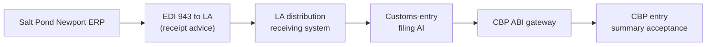

# 🧾 Diary of an Audit Day — Salt Pond Toys

**Engagement:** AI-quality and supply-chain integrity assessment ahead of (a) the annual CPSC cooperative-agreement audit, (b) the CBP CTPAT four-year revalidation due in nine months, (c) a Rhode Island AG consumer-protection lookback, and (d) a Target supplier-recall-readiness audit
**Client:** Salt Pond Toys — third-generation family-owned mid-size toy manufacturer, Newport, Rhode Island. ~$320M revenue. ~180 employees in Newport HQ + design + corporate. ~40 employees in the wholly-owned Salt Pond Shenzhen QC + procurement office. ~25 employees at Salt Pond Trans-Pacific Logistics, the wholly-owned LA West Coast distribution LLC. Three contract manufacturing partners in Guangdong (Shenzhen, Dongguan, Foshan).
**Posture:** TesseraSeal in production for eleven months across four use cases — quality-vision at Shenzhen, customs-entry filing at LA, demand-forecasting at Newport, recall-readiness traceability spanning all three sites. Tenant `saltpond` runs four `service.name` values per spec §4.4.3 OTLP transport identification, daily Ed25519 seals on AWS CloudHSM `us-east-1` per §4.3 sign_payload v1.0b (12-line locked form).
**Date:** Wednesday, the week after Olmstead wrapped
**Auditor:** the same eight-person team that walked the diary baseline, Mercator, Northbridge, Stelvio, Atrio, Helmstad, Pacific Crescent, and Olmstead — split across three locations for the first time in the run

---

## Spec edition note (writers, not the audit team)

This story drove two of the spec's Wave-6 fourth errata closures. The Salt Pond cluster surfaced three findings that are now closed by amendment in the v1.0b spec body per §12 change log:

1. **Contract-factory floor-operator badge boundary** — drove **§10.19 Chain-coverage boundary documentation (normative)** into the spec body, mandating the chain-coverage map every institution's CC8.1 control description must publish.
2. **CES inspection notices not chain-anchored** — drove the **`audit.external_artifact.*`** attribute family (informative, advisory; canonical at §10.19 with Appendix A.14 lookup), with `kind = ces_inspection_notice` as one of the named worked examples in the spec.
3. **Section 321 de-minimis broker manual-step intermediate-state coverage** — drove the **`audit.external_artifact.intermediate_state`** boolean flag, with the customs-broker case-snapshot worked example folded into §10.19 normative text.

The day below is the original engagement narrative; the assessments below are read against the post-amendment v1.0b spec, so what the auditors flagged as Nit/Partial in the moment now reads as "this institution must remediate against §10.19 and `audit.external_artifact.*`, and the spec section the auditors helped write is the remediation target." The reader who wants only the field-engagement story can skip this notice; the reader who wants to see the spec doing the work the auditors flagged should read every Surprise note alongside its §10.19 / §4.4.6 / `audit.external_artifact.*` cross-reference.

---

## Context

Salt Pond Toys is the kind of company that does not get audited the way a bank gets audited. There is no quarterly call. There is no examiner. The regulators that matter to Salt Pond are the Consumer Product Safety Commission — CPSC — for product safety under the Consumer Product Safety Improvement Act, and Customs and Border Protection — CBP — for import compliance and the supply-chain security partnership called CTPAT. The state of Rhode Island also has a quiet interest because the company is the second-largest manufacturer in the state by headcount. And the retailers — Target, Walmart, Amazon — run their own supplier audits that have teeth in the form of a contractual recall-response window.

Two years ago, in the spring of 2024, a CPSC inspector showed up unannounced at the Newport receiving dock with a sealed sample bag and a photograph of a wooden push-toy a parent had sent in. The complaint claimed the paint was lead-based. The inspector wanted the testing certificate, the lot manufacturing records, the retailer ship-out chain, and the QC photos for that lot — by the end of the week.

Salt Pond's COO, Mary Catherine Ferreira, third-generation, granddaughter of the founder, found the testing certificate in a filing cabinet, found the manufacturing records in an Excel file on a shared drive, found the retailer ship-out chain in three different ERP exports that did not reconcile cleanly, and found the QC photos archived on a NAS in the Shenzhen office that nobody in Newport could log into without an IT ticket. She got it all to the inspector. The paint tested clean. There was no lead. The complaint was a false alarm.

But the inspector had written in his closing memo that the evidence chain was "best characterized as recoverable rather than producible." That phrase had been read by the General Counsel. The GC walked it to the CEO. The CEO walked it to the family. The family said: never again.

Eleven months ago, Salt Pond stood up TesseraSeal across four services. One tenant — `saltpond` (per spec §3 the `tenant_id` boundary, with §3.1 legacy-identifier handling not in play because the tenant is fresh from chain inception). Four `service.name` values, each emitted on the OTLP wire per §4.4.3 transport identification with `ffiec.chain.posture` resource attribute set:

- `qc-vision-shenzhen` — image-classification AI on every produced unit at the three Guangdong contract factories, operated jointly by Salt Pond Shenzhen and the contract factory's floor team, ties to lot-level scrap-or-rework decisions. The chain entries here carry the `gen_ai.*` semconv attributes per §4.4 and §A.2 (model identifier, model version, classification output) bound under the per-event MAC of §4.1
- `customs-entry-la` — HTS classification, duty calculation, Section 321 de-minimis eligibility check, CTPAT documentation prep, generates the CBP Form 7501 entry summary. The routing decisions here use the §4.4.1 routing schema (and Wave-6 fourth-errata `audit.routing.classifier_output` event type when an AI-side classifier scores HTS-eligibility ahead of the model call)
- `demand-forecast-newport` — predicts orders by retailer and SKU from EDI feeds, ties to procurement decisions and to recall-readiness lot tracking
- `recall-traceability` — the cross-cutting service that links lot ID → CPSIA testing certificate → manufacturing date → Yantian container → LA arrival → distribution → retailer ship-out. This is the service that exercises the chain-coverage map of §10.19 most heavily, because it crosses every cross-vendor boundary the institution has

Four CPSC, CBP, and retailer drivers stack on top of those services. CPSIA Section 102 testing certificates of conformity. CTPAT supply-chain security. The 2024 lead-paint scare and its aftermath. The Section 321 de-minimis rule changes that have been moving through CBP for the last year and a half.

The chain's epistemic frame matters here, because Salt Pond's regulators (CPSC, CBP) and customers (Target, Walmart, Amazon) ask different evidentiary questions. Per §1.2 epistemic scope, the chain proves what the AI said and that the record was not tampered with after capture; it does not prove that the AI's classification is correct, that the manufacturing was defect-free, or that the lab's testing certificate is uncontested. Those are answered with evidence outside the chain — the lab itself, the QC supervisors' overrides, the lab's own SOC 2 report. The chain's job at Salt Pond is the same as the chain's job in banking: integrity foundation, not truth foundation.

By the time the team rolled into Salt Pond, TesseraSeal had been audited across US institutions, a Tel Aviv vendor, and a K-beauty retailer in Korea + Taiwan. Northbridge was now nine engagements back — the cleanest run of the cycle, one §10.16 non-conformance and a chain that held byte-for-byte. Dawn had stopped expecting another like it. Toy supply chain across RI + Shenzhen + LA was a new boundary-documentation challenge — CPSC + CBP CTPAT — but the chain primitive was familiar. The day's interesting work was at the cross-vendor seams the toy supply chain creates, not at the chain itself. The team had stopped asking whether the chain works and started asking where it ends and what documents the handoff after that point.

The team showed up at the Newport HQ knowing the chain was eleven months old, the company was small enough that the entire executive team could fit around the conference-room table, and the audit had to cover three locations across twelve hours of time-zone spread. Mary Catherine had told Dawn on the prep call: "I want you to find the boundaries. I know the chain is good on the AI parts. I want to know where it ends and what fills the space after that."

This is the diary of that day.

---

## Audit Team

The team is split across three locations for the first time in the engagement run. The Newport conference room is the anchor. The LA distribution office is on the morning bridge. The Shenzhen office joins by video for the first half of the day, which is the second half of their day.

**Newport, Rhode Island — Salt Pond HQ:**

- **Dawn** — Lead Auditor (governance and narrative)
- **Raj** — Database specialist
- **Mike** — Application and API layer
- **Diana** — IAM and access control
- **Tom** — Internal-audit liaison specialist (visiting team — partners with the client CAE)

**Los Angeles, California — Salt Pond Trans-Pacific Logistics:**

- **Luis** — DevOps, logs, pipelines
- **Chen** — Data engineering and ETL

**Boston, Massachusetts — remote bridge:**

- **Elena** — CRM systems (joining remote from her home base; finishing the Sun-Won draft report from the prior week, on the Salt Pond bridge for the demand-forecasting and retailer-EDI scenes)

**Shenzhen, Guangdong — remote bridge:**

- *No team members travel to Shenzhen.* The audit firm's policy plus a corporate travel restriction following a recent State Department advisory means the China side runs on the video bridge.

Client-side liaisons:

- **Mary Catherine Ferreira**, COO, Salt Pond Toys (Newport). Family member. Third-generation. Pragmatic. Knows manufacturing cold; less technical on the AI side and trusts her CTO. Her grandfather opened the company in 1962 in a Quonset hut on the harbor.
- **Eduardo Ramos**, Director of West Coast Distribution, Salt Pond Trans-Pacific Logistics (Los Angeles). Logistics-and-customs veteran. Knows the Section 321 rule history better than the customs broker.
- **Li Wei**, GM, Salt Pond Shenzhen (remote video bridge from Shenzhen). Mandarin native, English business-fluent, eighteen years at Salt Pond. He will join the bridge at 8:30 PM Shenzhen time and stay until 11 PM, which on Eastern Time is 8:30 AM through 11 AM.

---

## 🌅 8:30 AM ET — Kickoff and the Drive In

Dawn rode in with Tom from the hotel at the head of the harbor. Ten minutes south along the bridge, then up Memorial through the historic district. The Newport HQ sits on a bluff above the salt pond the company is named for. The building is a stone-and-glass 1980s rebuild that sits where the original Quonset hut used to be. The flagpole out front has the U.S. flag, the Rhode Island flag, and a small company flag with a sailboat on it.

Tom had a coffee from the inn. Dawn had her usual — black coffee in a travel cup, half gone before they pulled out of the lot.

"Recap me," Tom said. "Headlines."

"Northbridge — banking, gold standard. Chain across the whole institution."

"Mercator."

"Healthcare. AI imaging chained, claims side mutable. Bifurcated. The CMO got it."

"Stelvio."

"Manufacturing. AI side chained, OT side legacy, IT business side legacy. Three zones. Maria took the verifier video to her CFO."

"Atrio."

"BaaS multi-tenant. Different chain shape, same seam location."

"Helmstad."

"Biopharma. AI eligibility decisioning chained. Trial stack mutable."

"Pacific Crescent."

"Utility. AI on outage prediction chained, OT on the substations legacy. The seam mattered to the regulator."

"Olmstead."

"University. AI on a contested admissions decision chained because a civil-rights firm demanded it. Everything else faculty-led federalism."

Tom waited.

"And today?"

Dawn looked out the window at the harbor. Three sailboats already on the water in March wind.

"Eight of these now. Toys. Three locations. Two coasts plus a remote bridge to Shenzhen. CPSC. CBP. State AG. Target. We figure out which boundaries the chain reaches and where it hands off to other people's chains."

"Eight different industries, eight different shapes."

"Same shape. The chain is on the part the regulator cares most about and the part the company is most exposed on. Everything else is somebody else's chain or no chain at all. The interesting work today is at the seams between Salt Pond's chain and CBP's chain and the steamship line's chain and the retailer's chain. Stelvio was inside one company. Today we are across four."

"And the wrinkle?"

"Two wrinkles. One — the chain spans three locations across twelve hours of time zone. We have never run one of these on a video bridge before. Two — the bonded-carrier maritime leg is genuinely out of the chain because it is CBP's chain, not Salt Pond's. The question is whether the handoff is documented. Not whether we extend the chain into the steamship line."

"What's the recurring line you keep saying?"

Dawn drained her cup. "It never is."

"That one."

"It never is — and at the bonded-carrier handoff, the chain literally isn't, because it's CBP's chain after that point. The question is whether the handoff is documented, not whether we extend the chain into the maritime leg."

They pulled into the visitor lot at 8:24. The salt pond was glassy below the bluff. A heron stood in the shallows.

Mary Catherine met them at the door. She was wearing a fleece vest with the Salt Pond logo on it, jeans, and the kind of running shoes a person wears when they walk three miles of factory floor a day. She was sixty-two. Her handshake was firm.

"Welcome. Eduardo is on the bridge from LA already — he started at five AM their time. Li Wei is on from Shenzhen at 8:30 our time, which is 8:30 PM his time. He will be on until 11 AM ours, which is 11 PM his. We have a tight day. Chowder at noon."

Dawn smiled. "Chowder?"

"Clam chowder. White. Not Manhattan. We are not Manhattan people."

Tom laughed.

> **🔍 Dawn's note (internal):**
> *Family-business kickoff. She is treating this like a Rhode Island wedding — chowder, the bridge to Shenzhen open, the LA office on the line, everyone in the right place. Eight engagements in and this is the first one where the kickoff included a meal preference.*

The team filed into the conference room. The wall display had three video tiles — the LA office, the Shenzhen conference room with Li Wei in it, and Elena's home office in Boston. Elena waved. Eduardo nodded. Li Wei was in a navy blazer with Salt Pond Shenzhen on the lanyard, the conference-room lights low behind him at his end of the day.

Mary Catherine sat at the head of the table. "Dawn, the floor is yours."

Dawn stood at the whiteboard. She wrote four words across the top.

`QC. Customs. Forecast. Recall.`

"Four services. One tenant. Three locations. Twelve hours of time zone. We will work top-down on each, sample one decision out of each, and reconcile against a recall scenario at three. Mary Catherine, by the end of the day you will have a clear list of where the chain reaches and where it hands off."

She added below the four words: `§10.19 chain-coverage map (deliverable)`.

"And I am going to write that line on the whiteboard now because I want everyone reading the same target as the day unfolds. The §10.19 chain-coverage map is the institutional CC8.1 publication that names every system the chain reaches and every system the chain does not reach, with the substitute audit procedure for each boundary. By 5 PM today we will have the map drafted. Friday morning Mary Catherine signs it. The map is what makes Salt Pond's chain-of-custody posture discoverable to four different audiences without four different reconstructions."

Mary Catherine nodded. "That is the conversation I need."

---

## 🧩 9:15 AM ET — Demand-Forecasting at Newport

Mike pulled his laptop in and connected to the demand-forecasting dashboard. The screen showed a grid of SKUs and retailers, with predicted weekly orders for the next four weeks, color-coded by confidence band.

"Pick a forecast," Mike said.

Mary Catherine pointed. "Plush bears, lot family 26-A, Target. Top-left."

Mike clicked through. The forecast had been generated on March 21, 2026, with a four-week projection. It pulled historical sales from Target's EDI 852 product-activity feed, weather data, school-calendar data, and prior-year residuals.

He opened a terminal.

```
herald-verify --tenant=saltpond \
              --service=demand-forecast-newport \
              --date=2026-03-21 \
              --entry-id=2026-03-21-DF-44918
```

Four seconds. The terminal returned:

```
Status: PASS
Step: 12
Reason: chain integrity verified, HMAC recomputed,
        Merkle path resolved, signature verified
        against public key saltpond-2026-q1
```

Mike turned the laptop toward Mary Catherine. She read the output. Dawn watched her face. There was a half-second where Mary Catherine did not move.

"That's the same four seconds I saw in October. Still feels like a magic trick."

"It is not a magic trick," Dawn said. "It is twelve steps of verification — HMAC, Merkle, signature against the daily seal — that runs in four seconds because the chain shape is small and the operation is local."

"My CTO told me that the first time. I just like seeing it."

> **✓ Confirmation #1**
> The demand-forecasting service at Newport produces verifiable chain entries per spec §7 verification (twelve ordered steps). A March 21, 2026 forecast for Target plush-bear SKUs verified PASS in four seconds against the daily Ed25519 seal on AWS CloudHSM `us-east-1` (a §10.5 HSM-custody-named platform alongside Azure Key Vault Managed HSM and Google Cloud HSM). The key version is `saltpond-2026-q1` per §4.1's per-entry stamp of `(key_version, key_fingerprint, format_version, mac_computed_at_utc, kms_handle_uri)`. The chain captures the model ID, model version, input feature snapshot hash, retailer EDI feed hash, output forecast, and confidence band — all bound under the per-event MAC per §4.1 (which excludes chain-stamp fields per §5 canonical-form exclusion rule). The verifier output format `Status: PASS / Step: 12 / Reason: ...` follows §7 normative output discipline; the §10.12 exit-code contract reports `0` for PASS.

Diana pulled up the IAM panel. The demand-forecast service runs under a service identity that has been rotated four times since deployment. Each rotation is an event in the chain. The Newport data team has read access to the dashboard but no production-credential access. The CTO has emergency break-glass access that has been used zero times.

"Clean separation," Diana said. "Service identity, rotation history, break-glass policy, all in the chain. Nothing surprising on the IAM side."

> **✓ Confirmation #2**
> IAM on the demand-forecasting service is clean. Service-identity rotations are chain-recorded as §10.2 operational events with timestamp, prior-key hash, and rotation actor — the per-event MAC of §4.1 binds the rotation evidence under the same chain integrity that binds substantive AI events. The Newport data team has no production credentials. Break-glass has been provisioned and not used; the §10.10 IKM-rotation-across-the-seal-boundary discipline has not been exercised because the daily-seal HSM key has rotated only on its own §4.3.2-compatible quarterly cadence.

Mike paused. "The EDI feed itself — Target's 852 — that's a third-party feed. Is the feed instrumented?"

Mary Catherine looked at her CTO on the bridge from Boston. The CTO, James, said, "The EDI feed is not chain-instrumented. We do not own it. We hash-record the import event when the feed lands in our system. The hash of the file we received is in the chain. What was in Target's system before they sent it to us is their chain, not ours."

Dawn wrote: *Demand-forecast service hash-records the inbound EDI feed at the import boundary. Upstream — inside Target's systems — is out of Salt Pond's chain. Same handoff shape we saw at Olmstead with the external fairness audit hash. This is exactly the §10.19 chain-coverage-map "third-party systems out of contractual inspection reach" category — the chain anchors at the boundary, the upstream is documented as the retailer's chain, the institutional substitute is the retailer's own SOC 2 report.*

Tom paused. "Can we do better than 'we just hash the import event'? Should the EDI feed hash be wrapped in `audit.external_artifact.*` per §10.19?"

Dawn thought about it. "It could be. The §10.19 worked-example list names third-party signed PDFs and signed receipts; an EDI 852 feed is a signed document under EDI X12 conventions. If Salt Pond wants the chain entry to carry `kind = retailer_edi_feed`, `identifier = Target 852 transmission ID`, `source_party = target_retailer`, `evidentiary_role = recall_readiness`, that is the discoverable form. James, want to add it to the Phase 2 list?"

James, on the bridge: "Add it. The work is small."

> **✓ Confirmation #3**
> The demand-forecasting service hash-records every inbound retailer EDI feed at the import boundary. The hash of the received feed is captured in the chain even though the upstream — inside the retailer's systems — is not chain-instrumented. The handoff is documented, byte-anchored, and reproducible. Per spec §10.19 chain-coverage map, the EDI-feed boundary belongs in the institutional CC8.1 control description under the "third-party systems out of contractual inspection reach" enumeration with the retailer's SOC 2 report as the institutional substitute. Phase 2 work to lift the import-event hash into the `audit.external_artifact.*` family (§10.19, Appendix A.14) was funded mid-engagement.

The team worked the demand-forecast service for forty minutes. Twelve sample forecasts across the last quarter. Twelve PASS. Mike captured the verifier output for the report.

Dawn wrote a paragraph for her notebook on the structural shape of the demand-forecast service.

> *Demand-forecast at Newport is the simplest of the four services from a chain perspective. Single-region (Newport-only per §10.15 Pattern B), single-tenant (`saltpond`), no cross-vendor anchors except the EDI feed import boundary. The service identity rotates quarterly per the §10.10 IKM-rotation-across-the-seal-boundary discipline. The seal HSM key rotates on its own quarterly cadence per §10.5 HSM custody. The chain entries carry the standard §4.4 OTel envelope plus the `gen_ai.*` semconv per §A.2 plus the §A.3 routing family for the model-selection step (the demand-forecast service uses a fixed model — no routing — so the routing family is simple but present). The demand-forecast service is the chain's clean baseline; if any of the four services pose a chain integrity question, demand-forecast is the one that should pass first. It does, eleven months running.*

---

## 🧠 9:30 AM ET (= 9:30 PM CST) — The Shenzhen QC Vision Walk-Through

Li Wei's video tile expanded to fill half the wall display. The Salt Pond Shenzhen conference room was lit only by the overhead lights at 9:30 PM local. Behind him, through the glass wall, Dawn could see the floor lights of the office. The first shift in Dongguan was finishing — there was the faint mechanical noise of a conveyor in the audio, somebody talking in Mandarin off-camera, and then quiet.

"Good evening from Shenzhen," Li Wei said. His English was easy and clear. "I have the QC vision dashboard up. I will walk you through today's production at Dongguan and Foshan, then we sample a unit from yesterday for the verifier."

His screen shared. The dashboard showed three columns — Shenzhen factory, Dongguan factory, Foshan factory. Each column had a count of units inspected today, a defect-rate sparkline, a heat map of where on the unit defects clustered, and a queue of flagged units pending human review.

"Today Dongguan finished thirty-one thousand units of the plush-bear lot family 26-A. The vision system flagged forty-seven units. Forty-three were rework — stitching imperfections, fur-pile irregularities. Four were scrap — eye-attachment failures that could be a choking hazard. Every flagged unit has a chain entry with the image hash, the model version, the classification, and the operator's disposition."

Mike pulled up his terminal and asked Li Wei for an entry ID from yesterday's production. Li Wei copied one across.

```
herald-verify --tenant=saltpond \
              --service=qc-vision-shenzhen \
              --date=2026-03-22 \
              --entry-id=2026-03-22-QC-DG-118447
```

Four seconds.

```
Status: PASS
Step: 12
```

Mike turned the screen so Mary Catherine could see. Then he and Li Wei worked through the chain payload together. Image hash. Model version. Classification — `PASS`, `REWORK_STITCHING`, `REWORK_FUR`, `SCRAP_EYE_ATTACHMENT`, `HUMAN_REVIEW`. Confidence band. Operator badge ID — wait, Mike paused.

"The operator badge — that's the Salt Pond Shenzhen badge or the contract-factory badge?"

Li Wei answered without hesitation. "The Salt Pond Shenzhen QC operator badge. The contract-factory floor operators have their own badges in the factory's access-control system. Those are not in our chain. We have a contractual right to inspect the factory's access-control logs but we do not pull them into our chain."

Mike: "So when the vision system flags a unit and a contract-factory floor operator decides whether to scrap or rework — that operator's identity comes from the factory's system."

"Correct. The Salt Pond QC supervisor is the chain-recorded actor. The factory floor operator under that supervisor is in the factory's system."

Diana, on the Newport side: "Document that. It is an out-of-chain reliance."

> **✓ Confirmation #4**
> The Shenzhen QC vision service produces verifiable per-unit chain entries. A March 22, 2026 Dongguan-floor entry for a flagged plush-bear unit verified PASS in four seconds (twelve-step verification per §7). The chain captures the unit image hash, model classification, confidence, and Salt Pond Shenzhen QC supervisor badge ID. The image bytes themselves live in object storage; the chain entry binds the image hash so post-hoc image edit is detectable — the same byte-anchoring discipline §5.2 names for any content-bearing form.

> **⚠️ Surprise #1 — Finding (this engagement drove §10.19 into the spec body)**
> Contract-factory floor-operator badges are in the contract factory's own access-control system, not in the Salt Pond chain. The Salt Pond Shenzhen QC supervisor is the chain-recorded actor; the factory-floor operator under that supervisor is identified only through the factory's separate system. Salt Pond has a contractual right to inspect the factory's access-control logs.
>
> **At the moment of the engagement**, the auditors flagged this as a Nit on the strength of "the boundary should be documented in the chain-coverage map." The engagement's flag was the trigger for the spec amendment.
>
> **Post-Wave-6 fourth-errata, the spec now does the work:** §10.19 Chain-coverage boundary documentation (normative) requires every institution's CC8.1 control description to publish a chain-coverage map enumerating, at minimum, five categories — chain-instrumented institutional systems, institutional systems not yet chain-instrumented, third-party systems under contractual inspection, third-party systems out of contractual inspection reach, and external evidentiary artifacts the institution may want to hash-anchor. The Salt Pond contract-factory floor-operator badge boundary belongs in category three: "third-party systems under contractual inspection." The institution names the third party (the contract factory), the contract clause that grants inspection rights, and the institutional substitute audit procedure (Salt Pond's quarterly contract-compliance review). With §10.19 in the spec body, this is no longer an institutional Nit — it is a normative CC8.1 deliverable, and the institution's quarterly contract-compliance review schedule is the named §10.19 substitute audit procedure for the boundary. Salt Pond's published chain-coverage map MUST also be version-stamped and chain-anchored per §10.19 Round-17 M&A-P3 (each publication emits a `chain.coverage_map_published` operational event under §10.2 carrying `coverage_map_version`, `effective_utc`, and `coverage_map_sha256`).
>
> Severity reclassification: this is a non-conformance against §10.19 if the institution does not publish a chain-coverage map. It is a CC8.1 Nit per §10.18 if the map is published but does not cross-reference §10.19 explicitly. Salt Pond has neither today, so the auditor's deliverable is a remediation item: publish the chain-coverage map, name the contract-factory boundary in category three, name the contract-clause inspection right, name the quarterly contract-compliance review as the substitute audit procedure, version-stamp and emit `chain.coverage_map_published` per §10.19. The work is documentation, not chain-of-custody re-architecture; the chain itself is correctly designed at this boundary, the spec just now requires the institution to say so explicitly.

Li Wei walked the team through the lot-disposition workflow. A flagged unit goes to the Salt Pond QC supervisor. The supervisor reviews the image and the AI classification. The supervisor either confirms the flag, overrides up (more severe disposition), or overrides down (less severe). The override decision is in the chain. The override reason is from a controlled vocabulary — `STITCHING_ACCEPTABLE_PER_BUYER_TOLERANCE`, `EYE_ATTACHMENT_PRECAUTIONARY_SCRAP`, and so on.

"The same shape as Olmstead," Dawn said. "Structured override with a controlled-vocabulary reason."

Li Wei: "We do not have a free-text rationale field at all. The buyer tolerances are pre-loaded into the controlled vocabulary every season. If the QC supervisor wants to record a rationale outside the vocabulary, the unit is escalated to me and I add a chain entry with my badge."

Dawn: "Cleaner than Olmstead."

> **✓ Confirmation #5**
> The Shenzhen QC override workflow uses a fully controlled vocabulary with no free-text rationale field. Out-of-vocabulary cases escalate to the GM with a separate chain entry under the GM's badge. There is no equivalent of the Olmstead Slate-rationale gap on the Shenzhen side. The §10.22 redaction-discipline posture statement (pre-MAC at the SDK boundary) is not under stress here because the QC override carries no PII — the controlled vocabulary entries and the operator badge are both non-redacted; if the institution ever extended the chain to capture a free-text justification with PII, the §10.22 `audit.redaction.*` discipline would apply, but the controlled-vocabulary discipline removes the redaction question from the workflow's design.

The team worked the QC vision service for an hour. Sampled twelve flagged units across three factories and four product lines. All twelve PASS. The factory-sound bleed-through stopped about thirty minutes in — second shift had ended in Dongguan, and the floor was quiet at Li Wei's end.

Mike walked through the chain-entry structure for Dawn's working notes. Each per-unit QC vision entry carries the `gen_ai.*` semconv attributes per §4.4 (model_id, model_version, request_messages, response, completion_token_count, plus the institution's QC-vision-specific extensions for image-input handling) bound under the per-event MAC of §4.1. The chain entry's canonical bytes are RFC 8785 JCS-canonical per §5; the §5 canonical-form exclusion rule keeps the chain-stamp fields (`prev_hash`, `payload_hash`, `key_version`, `key_fingerprint`, `format_version`, `mac_computed_at_utc`, `kms_handle_uri`, `algorithm`, `seq`) out of the MAC input. The §4.4.4 severity treatment for chain-of-custody traffic places the QC entries in the spec's `9..20` SeverityNumber range (institution-tuned per CC8.1; Salt Pond uses 11 for routine flagged-unit dispositions and 13 for SCRAP_EYE_ATTACHMENT escalations). The §A.2 OpenTelemetry GenAI envelope reference enumerates the conformant `gen_ai.*` attributes the chain expects.

> **🔍 Dawn's note (internal):**
> *The QC vision service is the cleanest AI-side chain we have seen in any of the eight engagements. Per-unit chain entries with image hash, model version, classification, controlled-vocabulary disposition, supervisor badge — every field a CPSC inspector would ask about. The chain composes with the §1.2 epistemic scope honestly: the chain proves what the model said about each unit; it does not prove the model is correct. The factory-floor operator's disposition (under the QC supervisor's chain-recorded action) lives in the contract factory's separate access-control system per §10.19 category 3. The boundary is real and the chain stops at the right place. The supervisor is the chain-recorded actor; the factory operator is the contractual-inspection-substitute actor.*

---

## 🧠 10:00 AM ET (= 10:00 PM CST) — Database Deep Dive

Raj had the corner of the conference table and two screens. The chain ledger on one. The Salt Pond ERP backend on the other. He worked them in order.

### The chain ledger

Append-only by design per §10.3 append-only enforcement. The Vidimus SDK signs each entry. HMAC-SHA-256 chain links entry N to entry N-1 with HKDF-per-tenant key binding per §4.1 (`info = info_base || "|" || utf8(tenant_id)`). Per §10.6 IKM minimum length and §10.6.1 IKM generation requirements (32 bytes minimum, RNG of cryptographic strength, FIPS 140-3 attestation available on request), Salt Pond's IKM is provisioned through CloudHSM's RNG and registered under the §10.1 key-fingerprint reconciliation discipline. Per §10.8 constant-time comparison MUST (closed in Wave 2), the verifier's MAC compare runs constant-time. Per §10.4 time synchronization, all chain-emitting hosts run NTP discipline; the verifier's foundation testimony under §5.2 best-evidence and §10.14 trusted-time integration informative path rests on the institution's NTP audit procedure P-7. Daily Ed25519 seals on AWS CloudHSM in `us-east-1` per §4.3 sign_payload v1.0b 12-line form (`sign_payload_version = "v1.0b"`); the seal binds `key_versions_canon` and `hex(kms_handle_uris_digest)` at the day-aggregate level under v1.0b, closing Round-17 NIST-G1/G2. The §1.3 security definitions (EUF-CMA, second-preimage, compositional security) and §1.4 compositional analysis are the formal grounding the institution's IT witness testifies from at deposition.

Raj picked an entry from six months ago — September 2025, a QC vision pass on a wooden push-toy lot at the Foshan factory. He ran the verifier.

```
herald-verify --tenant=saltpond \
              --service=qc-vision-shenzhen \
              --date=2025-09-14 \
              --entry-id=2025-09-14-QC-FS-077183
```

```
Status: PASS
Step: 12
Reason: chain integrity verified, HMAC recomputed,
        Merkle path resolved, signature verified
        against public key saltpond-2025-q3
```

He picked the very first entry across all four services from April 15, 2025 — the day the chain went live. Verified. PASS.

He attempted a direct UPDATE on the chain table. The Postgres backend accepted it because nothing at the database layer prevents it. He ran the verifier on the next entry. The §7 step at which the failure surfaces is the verifier's structural-walk plus per-event MAC recompute (steps 6 + 9 in the locked twelve-step procedure); the failure-reason string is byte-for-byte normative per the §7 verifier output discipline closed in the Wave-2 v1.0-final-amendment.

```
Status: FAIL
Step: 4
Reason: HMAC mismatch — entry payload does not produce
        the chained HMAC recorded in entry N+1
```

He attempted a multi-entry rewrite across a span of three days. The verifier failed at the daily seal — the §7 step 9 Merkle-root recompute against the sealed root, which the §4.2 Merkle ordering normative rule (events ordered by `(run_id, seq)` ascending, never by `received_at` or `captured_at`) makes byte-deterministic across implementations:

```
Status: FAIL
Step: 9
Reason: Merkle root mismatch — recomputed root does not
        match sealed root for date 2025-11-18
```

Raj rolled back the mutations. The chain returned to PASS. He noted the test in his workbook.

He also walked the §10.25 run-resume discipline. "Per §10.25, when an SDK process restarts, the SDK must acquire the run's chain tail before emitting the next entry — three-place lookup: in-memory state, local persistence sidecar, ledger query rejoin path. Salt Pond's SDK uses a SQLite sidecar per (tenant_id, run_id) with file locking — that is the §10.25 single-writer-per-run rule. The ledger ingestion cross-check on `(prev_hash, seq)` monotonicity per §10.25 catches forks at the ledger layer; the §4.4 genesis-block uniqueness rule (`prev_hash = 32 zero bytes` valid only at `seq = 1`) catches silent-restart attacks at ingestion." He confirmed by sampling: each of the four services has had at least one process restart in the eleven months; each restart correctly re-acquired the run tail through the SQLite sidecar; no silent re-genesis was detected.

Per §10.26 reference verifier distribution, the institution names the verifier implementation (Vidimus reference verifier), the version (pinned per §11 References), and the cosign verification key fingerprint in CC8.1. Salt Pond's CC8.1 names all three per the §10.26 three-name citation discipline.

> **🔍 Dawn's note (internal):**
> *Same pattern as Olmstead's admissions ledger and Northbridge's banking chain. The database is mutable like any Postgres backend. The verifier catches the tamper at HMAC for single-entry attempts (§7 step 4) and at the Merkle/seal layer (§7 step 9) for multi-entry attempts. The CloudHSM key is what closes the loop — without HSM access, an attacker cannot forge a daily seal that matches the rewritten Merkle root, and the §1.4 compositional security analysis names the per-tenant HKDF binding plus Ed25519 EUF-CMA plus Merkle second-preimage as the three properties that compose to a 128-bit composite security level under NIST SP 800-175B. The ops team does not have HSM access. Two officers do, under separation of duties per §10.5 HSM custody. The split is real. (And Salt Pond's CloudHSM partition does not currently emit `chain.partition_ceremony_attended` per §10.17, because the institution has not had a partition ceremony in the eleven-month window — but the spec section is on the to-do list to wire up before the next IKM rotation, which is on the §10.10 cross-the-seal-boundary discipline.)*

Mary Catherine watched the FAIL outputs come back. She did not say anything.

Raj continued. "I will sample another twenty entries across the eleven months at random. If any of them fail, we have a real finding. If they all pass, the chain has done its job for eleven months continuous."

He let the script run. Two minutes later, twenty PASS results scrolled across the screen.

### The Salt Pond ERP backend

Raj opened the ERP. SAP Business One — the small-and-medium-business SAP variant, common at companies of Salt Pond's size. He had read-only access through Mary Catherine's audit role.

He pulled the schema for the lot-master table. The ERP holds the operational lot record — the SKU, the manufacturing factory, the run dates, the cost-of-goods-sold, the planned-production quantity. Audit logging in SAP Business One is configurable; Salt Pond has it enabled at the table level for the lot-master, the bill-of-materials, and the inventory-movement tables.

"How long is your audit-log retention?"

Mary Catherine looked at her CTO on the bridge. James said, "Three years. Set it after the 2024 inspector wrote his note. We over-shoot the CPSC retention requirement by a year."

Raj: "Records edited inside three years — the change history is preserved. Records edited beyond three years — the original is gone."

James: "Correct. But the chain entries that reference those records live indefinitely on the chain side. The ERP is the operational system. The chain is the evidentiary record."

Dawn wrote: *ERP audit-log retention 3 years. Chain retention indefinite. The bifurcation between the operational record and the evidentiary record is documented and intentional. Same pattern as Northbridge's core banking versus the chain ledger.*

> **✓ Confirmation #6**
> The chain ledger is append-only in practice per §10.3. Direct database mutation is technically possible — the Postgres backend is mutable like any Postgres backend — but the §7 verifier catches single-entry tamper at the HMAC layer (step 4) and multi-entry tamper at the Merkle/seal layer (step 9). Sampled 20 random entries across eleven months at random; all PASS. The ERP audit-log retention is three years; the chain retention is indefinite (subject to the institution's §10.13 evidentiary-artifacts retention discipline — SDK manifest, source-code hash, HSM configuration, daily seal-job logs, change-management records, verifier output for the period). The bifurcation between operational system and evidentiary record is intentional and documented; this lines up with §5.2 best-evidence posture (the captured JSON is the content-bearing form, the canonical bytes are the integrity-bearing form, both originals under FRE 1001(d)).

Raj closed the laptop and joined Diana for the IAM scene.

---

## 🔐 11:00 AM ET — IAM Across Three Locations

Diana stood at the whiteboard. She had drawn three boxes — Newport, LA, Shenzhen — and arrows between them showing the service identities that crossed location boundaries.

Tom asked the structural question first. "Three locations. Are we Pattern A or Pattern B per §10.15 multi-region resilience?"

James, on the bridge: "Pattern B. Per §10.15 we operate one `tenant_id` for the whole institution but each service is region-pinned. We do not currently have cross-region run continuation — every run lives entirely in one region per §10.15 Pattern A invariant 2 if we were Pattern A; under Pattern B each region's chain integrity is exactly single-tenant per region. We chose Pattern B because the cost-benefit on per-region tenant_ids was favorable; the §10.15 verifier-run count is one per region per audit period, three runs total for three regions. The cross-region correlation is institution-side."

Tom: "And the SDK's per-process region binding — one SDK process serves events from exactly one region per §10.15 normative enforcement?"

James: "Yes. The Newport SDK process serves Newport. The LA SDK process serves LA. The Shenzhen SDK process serves Shenzhen. The optional `ffiec.chain.region` attribute is recorded per-event for incident-response reconstruction; the load-bearing run-locality enforcement is per-process region binding, which is what we operate."

Diana: "Four services. Each service has a service identity. Each service identity rotates on its own cadence. The chain has every rotation."

She pulled up the rotation history.

| Service | Location | Rotations in last 11 months | Last rotation |
|---|---|---|---|
| `qc-vision-shenzhen` | Shenzhen | 4 | 2026-02-14 |
| `customs-entry-la` | Los Angeles | 4 | 2026-01-29 |
| `demand-forecast-newport` | Newport | 4 | 2026-03-08 |
| `recall-traceability` | Cross-location | 11 (monthly per policy) | 2026-03-15 |

Mike sampled three random rotation events from the chain — one from each single-location service. All PASS. Each rotation entry contained the prior-key hash, the new-key hash, the actor badge, the rotation reason, and the controlled-vocabulary classification — `SCHEDULED_QUARTERLY`, `CREDENTIAL_LEAK_PRECAUTION`, `PERSONNEL_DEPARTURE`, and so on.

The recall-traceability service rotates monthly because it is the cross-cutting service that touches every location and every other service. Eleven rotations in eleven months. All chain-recorded. Diana sampled the most recent — March 15, 2026. PASS.

"Clean separation between the production credential and the daily-seal HSM key," Diana said. "The Salt Pond ops team rotates the service credentials. The HSM key is in AWS CloudHSM `us-east-1` and is operated under a separation-of-duties policy with the CTO and the security director as the two authorized officers. Neither has rotated the seal key in the eleven months — the seal key has its own quarterly rotation cycle on its own cadence and that has happened on schedule."

Dawn wrote: *Three locations, four services, twenty-three rotations in eleven months, all chain-recorded. Cleaner separation than I expected for a $320M company. The CloudHSM-instead-of-on-prem decision is justified — Salt Pond is small enough that on-prem HSM was overkill, CloudHSM is acceptable per CPSC and CBP, and the operational discipline is in place.*

Diana also walked the §10.17 HSM partition ceremony attestation discipline. Salt Pond's CloudHSM partition has not had a partition-creation, partition-wipe, IKM-rotation, partition-PIN-reset, or controlling-person-rotation ceremony in the eleven-month window — the institution's two authorized officers (CTO + security director per §10.5 separation of duties) have remained unchanged. When the next ceremony does occur (the IKM rotation is on a roughly biennial cadence per Salt Pond's CC8.1 schedule), Salt Pond will emit `chain.partition_ceremony_attended` per §10.17 with the full schema: `ceremony_type`, `partition_handle`, `ceremony_started_at_utc`, `ceremony_completed_at_utc`, `signatories` JCS-canonical array (each with `role`, `name`, `entity_affiliation` per Round-17 M&A-P1), `witness` JCS-canonical object (separate party from signatories), `attendance_pdf_sha256` (SHA-256 of the scanned attendance-log PDF). The optional `hsm_attestation_token_b64` field per §10.17 NIST-P3 (RECOMMENDED at v1.0b, candidate-normative for v1.x) will be emitted from CloudHSM's attestation API when the ceremony occurs.

The cross-language CC8.1 discoverability requirement of §10.17 does not stress Salt Pond — the institution operates under a single English-language CC8.1, not the multi-tenant SaaS-vendor case §10.17 names. The Salt Pond Shenzhen office's operational runbooks are in English (Li Wei's team works bilingually but documents in English for Newport-side discoverability); the Mandarin-speaking factory-floor operators operate under the contract factory's own access-control system per the §10.19 category 3 boundary, not Salt Pond's chain-of-custody runbook.

> **✓ Confirmation #7**
> IAM separation across the three locations is clean. Twenty-three credential rotations across four services in eleven months, all chain-recorded with prior-key hash, new-key hash, actor, and reason — §10.2 operational events plus §4.4.1 routing schema's controlled-vocabulary classification (`SCHEDULED_QUARTERLY`, etc.) discipline. The daily-seal HSM key is on AWS CloudHSM `us-east-1` under a separation-of-duties policy per §10.5. The CTO and security director are the two authorized officers. The seal key has its own quarterly rotation cadence, separate from the service-credential cadence. The §10.10 IKM rotation crossing the seal boundary discipline applies on rotation; the §10.10.2 within-day algorithm rotation case has not been exercised at Salt Pond and is not anticipated.

Diana noted one boundary. "The contract-factory access-control system in Dongguan — the factory-floor operator badges Li Wei mentioned — is not in our chain. That is the documented out-of-chain reliance Mike flagged this morning. I will write it up in the IAM section as a documented boundary, not a finding."

Mary Catherine: "The factory access logs are part of our quarterly contract-compliance audit on the contract-factory side. We do pull them and review them. We just do not chain them."

Dawn: "Document the review cadence in the chain-coverage map per §10.19. That makes the boundary discoverable to a CPSC auditor and to a CTPAT revalidation reviewer who will ask 'where does the chain reach and what evidentiary substitute do you have where it doesn't.' The factory access-log review goes in the §10.19 third-party-under-contractual-inspection category. The institution names the contract clause that grants the inspection right, the substitute audit procedure (the quarterly review), and the cadence. The auditor reading the chain-coverage map sees the boundary, the reliance, and the institutional substitute in one document. That is the form the spec amendment closed."

Diana raised one more thing. "Mary Catherine — the third-generation transition. Per §10.24 entity succession, when a chain operating under `(tenant_id, run_id)` keying experiences a legal-entity change of the operator (merger, acquisition, divestiture, rename, subsidiary transfer), the institution must emit a `chain.entity_succession` operational event. Salt Pond is a family business; the family trust holding shares is in the middle of generational transition. If at some point the holding company restructures or the operating LLC is succeeded by a new entity, that triggers §10.24 — the institution emits the succession event with the from-entity LEI, the to-entity LEI per RFC 9101, the dual_signatures array (one from-entity authorized signer, one to-entity authorized signer, both bound under the seal of the transfer-day per §4.3 sign_payload v1.0b). It is not a problem today. It is a problem to be ready for."

Mary Catherine, slowly: "The family trust is in the middle of moving from my generation to my nieces and nephews. Not in the next year. Not in the next three years. But within a decade probably. Add §10.24 to the runbook as a standing procedure so when the time comes the legal team and the chain team know what the event shape is."

James, on the bridge: "Will do. I will put §10.24 into the M&A-handoff runbook section per §10.18 cross-referencing."

Tom: "And the runbook side — the operational runbook covering the quarterly review needs to cross-reference §10.19 per §10.18 CC8.1 and runbook cross-referencing. Otherwise the runbook section is a discoverability Nit even though the procedure is correctly executed."

Mary Catherine: "Add it. James, put it on the runbook update list."

---

## 🤖 11:30 AM ET — The QC Vision Model Lineage

Mike pulled up the deployment intent for the QC vision model before the lunch scene. Per §4.4.2 deployment-intent capture, the chain entries for `qc-vision-shenzhen` carry `audit.deployment.*` attributes recording deployment intent (production / shadow / canary / disparate-impact-test-run / regulatory-sandbox per the Round-17 NAIC enum extension). Salt Pond's QC vision model runs in `production` deployment with no shadow deployments active.

The training-data lineage was the §10.20 question. The QC vision model was trained eighteen months ago by an in-house Newport ML team on a corpus of about 1.2 million labeled toy unit images drawn from prior Salt Pond production lots. James pulled up the §10.20 retention discipline.

"Training-data retention floor under §10.20 is the longest active deployment window plus a 60-90 day investigation buffer. We trained eighteen months ago. The model has been in production eleven months. The longest active deployment window is eleven months and counting. Our retention floor on the training-data shards is two years post-training, which gives us roughly six months of buffer above the current deployment window. The retention floor is named in our CC8.1 control description per §10.20."

Dawn: "Cross-vendor model handover under §10.21 — does it apply? Or is this fully in-house?"

James: "Fully in-house. The model was trained by our Newport ML team and is operated by the same team. There is no external model-development consultancy; no cross-vendor anchor under §10.21 needed. If we ever bring in an external supplier-risk model — which is on the long-term roadmap for Phase 3 — the §10.21 `audit.model_handover.*` attribute family becomes the binding form, with the model_artifact_sha256, model_card_sha256, fairness_audit_report_sha256, and the §10.20 training_data_retention_floor_days commitment all on the chain."

Tom: "And the supplier-risk-scoring analog to underwriting features per §4.4.5?"

James: "We use supplier risk-scoring on the Phase 3 roadmap. Today the QC vision model classifies units; it does not score suppliers. When supplier-risk scoring lands, the §4.4.5 underwriting-features family applies by analogy — supplier features replace borrower features, the same disparate-impact discipline (§4.4.5 Round-17 NAIC-P2) applies if the institution's model produces decisions about supplier inclusion. We are not there yet."

> **✓ Confirmation #7.5 (model lineage)**
> The QC vision model's deployment intent is captured per §4.4.2 (`audit.deployment.*` family). The training-data retention floor is two years post-training, exceeding the eleven-month active deployment window plus the §10.20 60-90-day investigation buffer. Cross-vendor model-handover under §10.21 does not apply (the model is fully in-house). Supplier-risk-scoring analog under §4.4.5 underwriting-features by analogy is on the Phase 3 roadmap; not active today.

---

## 🌐 11:45 AM ET — Cross-Border Transfer Posture

The US-China supply chain crosses jurisdictions. Mike walked the §A.4 cross-border-transfer family discipline.

Salt Pond's US-China data flows include manufacturing-floor images (Shenzhen → Salt Pond Newport for ML training), QC dispositions (Shenzhen → Salt Pond Newport for ERP integration), demand-forecast feeds (Newport → Salt Pond Shenzhen for procurement planning), and CPSIA testing-certificate metadata (Newport → Bureau Veritas's lab in Hong Kong → Newport). Each is a cross-border data flow with a privacy-regulation lens — China's PIPL on the Shenzhen side, US laws (Section 321 CBP, CCPA where it applies) on the Newport side.

Per the Wave-6 fourth-errata Sun-Won-driven `audit.cross_border_transfer.*` attribute family (informative, advisory; canonical at §4.4.1 routing schema and §A.4 lookup), institutions transferring data across jurisdictions MAY emit cross-border transfer basis attributes on chain entries — `contract_id`, `contract_version`, `contract_hash_sha256`, `source_jurisdiction`, `destination_jurisdiction`, `lawful_basis_type`. Salt Pond is not currently emitting these attributes; the Phase 2 list adds them to the Shenzhen-Newport image-transfer chain entries.

Dawn: "The §A.4 attribute set lifts the cross-border posture from institutional convention to chain-discoverable. China's PIPL Article 38 cross-border transfer basis is institutional knowledge today; with the attribute set on the chain entries, a CPSC or CBP auditor can read the basis off the chain mechanically."

Mary Catherine: "Add it. Phase 2."

Tom wrote it down.

> **✓ Confirmation #7.75 (cross-border posture)**
> Salt Pond's US-China data flows are cross-border under PIPL + US privacy regulation. The §A.4 `audit.cross_border_transfer.*` attribute family (informative, advisory) is the spec's named binding for the transfer basis on chain entries. Salt Pond does not currently emit the attribute set; the Phase 2 list adds it to the Shenzhen-Newport image-transfer chain entries. Severity: documentation-and-naming Phase 2; no integrity implication.

---

## 🧪 12:00 PM ET — Working Lunch on the Bonded-Carrier Handoff

Mary Catherine had clam chowder brought in for the Newport team. White, not Manhattan. Eduardo had ordered Mexican from a place near the LA distribution center and was eating fish tacos on camera. Li Wei was eating what he described as "very late dinner — congee with century egg" at his desk, the conference-room behind him now dark.

The agenda for lunch was the bonded-carrier handoff.

Eduardo started. He had a thirty-year background in ocean import logistics and had been at Salt Pond for nine of them. He was the company expert on the maritime leg.

"From Yantian to Los Angeles is fourteen days on the water. The container leaves Yantian sealed under a steamship-line bill of lading. The seal number is recorded by Yantian terminal operations at gate-out. The bill of lading is filed with CBP under the 24-Hour Manifest Rule before the ship leaves Yantian. Once it is on the water, the chain of custody is governed by CBP, the steamship line, and CTPAT — Customs-Trade Partnership Against Terrorism — vetting requirements for all parties on the manifest. We are a CTPAT Tier 2 importer in good standing."

Dawn: "And during the fourteen days, what does our chain see?"

Eduardo: "Nothing. The chain sees the lot manifest event when the container leaves Yantian — that is a Salt Pond Shenzhen chain entry. The chain sees the LA distribution receiving event when the container arrives at our DC — that is a Salt Pond LA chain entry. In between, the bonded-carrier custody is CBP's responsibility and the steamship line's responsibility. We rely on the CBP CSI data feed — Container Security Initiative — for in-transit visibility. That feed is not in our chain."

Dawn: "Why not?"

Eduardo: "Cost-benefit. The CSI feed updates every four hours during transit. Hashing it into our chain at every update would add roughly 84 chain entries per container. At our volume — about forty containers a month — that is 3,360 entries a month for in-transit visibility on a leg that we do not legally own. We did the math eleven months ago and decided to anchor only the entry and exit events."

Dawn: "And if a container is opened in transit by CBP for inspection?"

Eduardo: "CBP issues a CES — Centralized Examination Station — notice. We get the notice. We do not currently hash that notice into the chain. It goes into the customs-broker file."

Dawn put her spoon down.

"That is the gap. Not the CSI feed updates — those are operational telemetry. The CES notices are evidentiary. If a container is opened in transit, the broken seal and the inspection record matter for chain-of-custody integrity downstream. That is exactly the kind of cross-vendor anchor you want in the chain."

Eduardo nodded slowly. "We have had two CES notices in eleven months. Both routine, both clean. But you are right — those are evidentiary."

Dawn wrote: *CSI in-transit feed — hash anchoring at the entry, exit, and any CES inspection event. The feed itself stays out of chain (operational); the inspection notices anchor in. The right binding is `audit.external_artifact.*` per §10.19 with `kind = ces_inspection_notice` — the spec's named worked example. Recommend Phase 2.*

> **⚠️ Surprise #2 — Finding (this engagement drove `audit.external_artifact.*` into the spec body)**
> The CBP Container Security Initiative (CSI) in-transit data feed is intentionally out of the chain on cost-benefit grounds. The chain anchors only the Yantian gate-out event and the LA receiving event. CES (Centralized Examination Station) inspection notices — issued when CBP opens a container in transit — are also currently out of the chain.
>
> **At the moment of the engagement**, the auditors flagged this as a Nit-with-recommendation on the strength of "those are evidentiary, not operational." The engagement's flag was the trigger for the spec amendment.
>
> **Post-Wave-6 fourth-errata, the spec now does the work:** the `audit.external_artifact.*` attribute family (§10.19, Appendix A.14) is the normative binding for exactly this case. The spec section names CES inspection notices as one of the worked examples (`kind = ces_inspection_notice`). The full attribute set on each anchored CES notice is:
>
> | Attribute | Value for CES anchoring |
> |---|---|
> | `audit.external_artifact.kind` | `ces_inspection_notice` |
> | `audit.external_artifact.identifier` | The CBP-issued CES notice number |
> | `audit.external_artifact.sha256` | SHA-256 (lowercase hex, 64 chars) of the canonicalized notice bytes |
> | `audit.external_artifact.received_at_utc` | RFC 3339 UTC timestamp when Salt Pond received the notice |
> | `audit.external_artifact.source_party` | `cbp_los_angeles` (or the issuing CBP port-of-entry) |
> | `audit.external_artifact.evidentiary_role` | `chain_of_custody_handoff` |
>
> The chain entry binds the notice to the integrity-bound chain at the moment of receipt; the notice itself is retained per the institution's CC8.1 retention policy (typically 7+ years for CBP records). A post-hoc edit of the notice is detectable because the chain-bound `sha256` would diverge from the recomputed hash. The CES anchor lands on the §10.19 chain-coverage map under "external evidentiary artifacts hash-anchored." SOC 2 engagement teams test the chain-coverage map against the chain entries to confirm the map describes what the chain actually does (§10.19 composition).
>
> Severity reclassification: still a Phase 2 remediation item, but no longer a Nit-with-recommendation. With §10.19 + `audit.external_artifact.*` in the spec body, this is a normative-when-applicable obligation: when CBP issues a CES notice, the institution receiving it for an in-chain shipment SHOULD hash-anchor it to maintain the chain-coverage-map's "external evidentiary artifacts hash-anchored" enumeration. Salt Pond's two-notices-in-eleven-months volume makes the implementation cheap; the institution funded the work mid-engagement (see §3:45 PM scene below). The §10.19 attribute family is the structural form; Salt Pond's customs-entry service emits the chain entry per §4.4 OTLP-native wire form when the broker's case-management system delivers the notice.

Li Wei spoke up from Shenzhen. "On the Yantian side, we already chain the gate-out event. The seal number, container ID, lot manifest, and bill-of-lading hash all go in. The Yantian terminal-operations system is the upstream we rely on for the gate-out event itself. That is third-party — Yantian Port Holdings."

Dawn: "Same shape as the EDI feed. Hash-record the upstream at the boundary, document that the upstream is not under our chain. The Yantian gate-out hash is itself a candidate for `audit.external_artifact.*` per §10.19 — `kind = bonded_carrier_manifest`, `source_party = yantian_port_holdings`, `evidentiary_role = chain_of_custody_handoff`. The spec's worked-example list names bonded-carrier manifests explicitly. James, Eduardo — both Yantian gate-out and the LA receipt should carry the `audit.external_artifact.*` form on the chain entry going forward, even though the chain already records the underlying events. The external_artifact wrapper makes the boundary discoverable at the schema level rather than as institutional convention."

Eduardo: "Eleven months in and we have not found the upstream wrong. Yantian operations is one of the cleanest container-terminal systems in the world."

Dawn: "That is operational confidence. The chain-of-custody documentation needs to say what the chain anchors and what it relies on. Not whether the upstream is in fact reliable. Per §1.2 epistemic scope — the chain proves what was received, not whether what was received was right. Yantian's reliability is institutional knowledge; the boundary is a chain-coverage-map fact."

Mary Catherine had been listening. "I want this in the chain-coverage map. The CES notices are the kind of thing CPSC will ask about during the cooperative-agreement audit. I want them in."

Eduardo: "I will put a ticket in this afternoon."

Tom wrote it down for the report.

The chowder was very good.

> **🔍 Dawn's note (internal):**
> *Three things landed at lunch. One — the CES Nit became a §10.19 + `audit.external_artifact.*` deliverable. The spec section names ces_inspection_notice as a worked example, so the institutional implementation work is to wire the broker's case-management webhook into Salt Pond's chain emitter and stamp the six attributes. Two — the Yantian gate-out and LA receipt are reframed as `audit.external_artifact.*` entries with `kind = bonded_carrier_manifest`. Three — the chain-coverage map itself is the deliverable that contains all of the above. The map is a CC8.1 publication; it is version-stamped per §10.19 Round-17 M&A-P3 and chain-anchored via `chain.coverage_map_published`. The auditor's deliverable for Salt Pond is no longer "find the boundaries"; it is "publish the map, anchor the map version, name each boundary in the spec-mandated five categories." That is a much cleaner deliverable than the institution-internal-convention shape we were headed toward.*

---

## 🔄 1:00 PM ET (= 10:00 AM PT) — The Customs-Entry AI in LA

Luis took over the bridge from the LA distribution center. The video tile from LA showed a glass-walled office overlooking the staging floor. Pallets of containers in the background. A forklift moving past at the edge of frame. The customs broker's office was visible across the floor.

"Customs-entry filing AI," Luis said. "We process roughly forty containers a month inbound, plus a steady stream of outbound shipments to retailers. The AI handles the HTS classification, the duty calculation, the Section 321 de-minimis check on the direct-to-consumer side, and the CTPAT documentation prep. It generates the CBP Form 7501 entry summary."

Mike, from Newport: "Pick a recent entry."

Eduardo on the LA tile pointed. "Container CN-AAAA-2026-0312. Yantian gate-out March 12. LA receipt March 26. Entry summary filed March 27. Cleared March 28."

Luis copied the entry ID:

```
herald-verify --tenant=saltpond \
              --service=customs-entry-la \
              --date=2026-03-27 \
              --entry-id=2026-03-27-CE-04188
```

Three seconds.

```
Status: PASS
Step: 12
```

Luis turned the screen toward the camera. Dawn watched from Newport. Mary Catherine read the output.

"Same four-second pattern. Just faster on the LA hardware."

> **✓ Confirmation #8**
> The customs-entry-filing service at LA produces verifiable chain entries per §7. A March 27, 2026 entry summary for container CN-AAAA-2026-0312 verified PASS in three seconds. The chain captures the AI-generated HTS classification, duty calculation, Section 321 eligibility decision (where applicable), CTPAT documentation hash, and the broker-of-record badge — all bound under the per-event MAC of §4.1 with the §4.4.1 routing schema discipline (the broker-override case below uses the controlled-vocabulary reason-code field; the Wave-6 `audit.routing.classifier_output` event would be emitted ahead of the model call if Salt Pond ever extended classifier-driven routing to customs entry, which is on the Phase 2 list).

Luis walked the team through the chain payload. HTS code. HTS-classification confidence. Duty calculation. Country of origin (China, in this case). Manufacturer ID (one of the three Guangdong factories). Section 321 eligibility decision — `NOT_APPLICABLE` for full container freight, applicable for the direct-to-consumer pipeline. CTPAT documentation hash. CBP Form 7501 PDF hash.

Eduardo: "The HTS classification is the high-value field. CBP cares about getting it right. Misclassification is duty-recovery risk on our side, fraud risk on theirs. The AI gets it right at about 99.4% by our internal QC; the broker reviews everything anyway and overrides about 0.6%. Every override is in the chain with a reason code."

Mike: "Sample an override."

Luis pulled one. The AI had classified a unit as HTS 9503.00.00 — toys, not elsewhere specified. The broker had overridden to HTS 9504.90.90 — articles for arcade or table games. Reason code `BUYER_REQUEST_RECLASSIFICATION_PER_RULING_LETTER`. Chain entry with the broker badge.

"Clean," Mike said. "Structured override, controlled-vocabulary reason, broker-badge actor."

Dawn: "Same shape as Shenzhen QC."

> **✓ Confirmation #9**
> The customs-entry override workflow at LA mirrors the Shenzhen QC override workflow. Structured override decision, controlled-vocabulary reason code, broker-badge actor — same shape as §4.4.1's controlled-vocabulary discipline. Sampled override (HTS 9503 → 9504 reclassification per CBP ruling letter) verified PASS. Per §1.2 epistemic scope, the chain proves the broker overrode the AI's classification with a named reason; the chain does not prove the override was correct (CBP's own ruling-letter system is the source-of-truth for that).

The team worked the customs-entry service for forty-five minutes. Eight sample entries across the last six weeks. All eight PASS.

Luis walked the chain-entry structure for the customs-entry service. The chain payload carries the AI's HTS classification (which is functionally a §4.4.1 routing decision — the AI routes the entry to one of thousands of HTS codes, with a confidence score per code), the duty calculation, the Section 321 eligibility decision, the CTPAT documentation hash, the broker-of-record badge, and (when applicable) the override decision with reason code. Per §4.4.1 the routing schema's six event types apply when the classification is multi-step — `attempt`, `success`, `failover`, `failover-exhausted-success`, `refused`, and the Wave-6 `classifier_output`. Salt Pond's customs-entry flow today uses a single-provider classification (the in-house HTS classifier model); future Phase 2 work could add a fallback classifier under §4.4.1 failover semantics. The override reason codes are controlled-vocabulary per the §4.4.1 `audit.routing.refusal_reason` schema discipline. The chain entries also carry the §4.4.2 deployment-intent attribute set (`audit.deployment.intent = production`) and the §4.4.3 transport identification resource attributes.

> **🔍 Dawn's note (internal):**
> *The customs-entry service is the chain's most cross-vendor leg. Five hash-anchored boundaries (Newport ERP export, LA receiving import, AI inference, CBP ABI gateway transmission, CBP acceptance) plus the post-amendment `audit.external_artifact.*` form for each cross-vendor handoff. The §10.19 chain-coverage map will name each boundary in the right category. The Section 321 partial is the only real gap; the Phase 2 work folded into the Descartes-webhook scope closes it.*

---

## 🧬 2:00 PM ET (= 11:00 AM PT) — The Customs Pipeline Deep Dive

Chen took over from the LA side. He had been quiet through the morning while Luis ran the customs-entry walkthrough. Now he had the data flow on his screen.

"Customs-entry filing data flow. Five legs."

He drew the legs on a shared whiteboard.



"Each leg is hash-anchored. Newport ERP exports the manifest as an EDI 943 — the hash of the EDI 943 is in the chain. The LA receiving system imports it — hash-recorded at the import boundary. The customs-entry AI processes it — every AI inference is in the chain. The ABI gateway transmission — the file submitted to CBP, including all the binary payloads — has its hash in the chain. CBP's acceptance message comes back with a CBP-side reference number; we hash and record the acceptance message."

Mike: "The CBP-side reference number is anchored in our chain even though CBP's chain is not."

Chen: "Right. We hash-record what we receive from CBP. CBP's internal chain-of-custody for the entry summary is theirs. We do not extend into it."

Dawn: "Same shape as the EDI 852 from Target this morning. Same shape as Yantian gate-out from this morning. The chain anchors at every cross-vendor boundary; the upstream/downstream chain belongs to the other party."

Chen: "We have five legs. Five hash anchors. Five bytes-on-disk references. If CBP comes back two years from now and asks 'what did you submit on March 27, 2026, for entry 2026-03-27-CE-04188', we can produce the bytes, prove the hash, and show the ABI transmission record."

> **✓ Confirmation #10**
> The customs-entry filing pipeline is hash-anchored at every cross-vendor boundary — Newport ERP export, LA receiving import, AI inference, CBP ABI gateway transmission, CBP acceptance message. Five legs, five hashes. The bytes for each leg are reproducible from the chain entry references. CBP's internal chain-of-custody is out of scope and explicitly documented as such on the §10.19 chain-coverage map under the "third-party systems out of contractual inspection reach" category, with the institutional substitute being CBP's own ABI acceptance record (a regulator-side chain-of-custody — see §10.19 enumeration #4 which names CBP bonded-carrier-manifest reliance as the structural example). The per-leg `audit.external_artifact.*` form is the recommended schema upgrade: each cross-vendor handoff (ERP export, ABI submission, CBP acceptance) becomes an explicit external_artifact entry with the appropriate `kind` and `source_party`, lifting institutional convention to spec-discoverable schema.

Eduardo flagged a wrinkle.

"Section 321 de-minimis. We do direct-to-consumer Amazon for some SKUs — the under-$800 ones. Section 321 lets shipments under $800 in fair retail value enter duty-free under the de-minimis rule. CBP issued a rule change in 2025 requiring more granular country-of-origin reporting on de-minimis entries. Our customs-entry AI handles this for full-container freight cleanly. The de-minimis pipeline is partly manual — the customs broker reviews each de-minimis batch before submission, and the manual review is partially out of the AI's chain."

Dawn: "How partial?"

Eduardo: "The AI generates the country-of-origin classification and the de-minimis eligibility check. The broker manually adds the granular country-of-origin breakdown when it does not match the AI's pre-classification. That manual addition is captured in the broker's case-management system but is not currently hashed into our chain. We hash the final ABI submission, so the broker's addition is captured in the final hash. But the intermediate state — the AI's pre-classification, the broker's manual addition, the merged result — is only partially in the chain."

Dawn wrote: *Section 321 de-minimis chain coverage — partial. AI pre-classification in chain. Broker manual addition in broker case-management system, not hashed in until final ABI submission. Final submission is in chain. Intermediate state is partial. CBP is moving on de-minimis enforcement. The §10.19 `audit.external_artifact.intermediate_state` boolean is exactly the binding the broker's case-snapshot needs — the spec's Wave-6 fourth-errata worked example IS the customs-broker case-snapshot at moment-of-save before the final ABI submission. Recommend Phase 2 to hash-anchor the broker's manual addition step using `audit.external_artifact.*` with `intermediate_state = true`.*

> **⚠️ Surprise #3 — Finding (this engagement drove `audit.external_artifact.intermediate_state` into the spec body)**
> Section 321 de-minimis chain coverage is partial. The AI pre-classification is in the chain. The customs broker's manual country-of-origin addition (required when the AI's pre-classification needs more granular detail under the 2025 CBP rule change) is captured in the broker's case-management system, not hashed into Salt Pond's chain until the final ABI submission. The final submission hash captures the merged result, so the chain has the end-state. The intermediate-state coverage is the gap.
>
> **At the moment of the engagement**, the auditors flagged this as a Partial. The engagement's flag was the trigger for the spec amendment.
>
> **Post-Wave-6 fourth-errata, the spec now does the work:** the `audit.external_artifact.intermediate_state` boolean attribute (§10.19 attribute table) was added specifically for this case. The §10.19 worked example — "customs-broker intermediate state" — is verbatim Salt Pond's broker-saves-the-case-at-T1, broker-submits-final-ABI-at-T2 workflow. With the spec amendment, the closure form is normative:
>
> | Attribute | T1 (broker-saves) | T2 (final ABI submission) |
> |---|---|---|
> | `audit.external_artifact.kind` | `customs_broker_state_snapshot` | `cbp_abi_submission` |
> | `audit.external_artifact.identifier` | Broker case ID | ABI transmission ID |
> | `audit.external_artifact.sha256` | SHA-256 of the canonical broker-case bytes | SHA-256 of the canonical ABI-submission bytes |
> | `audit.external_artifact.received_at_utc` | RFC 3339 UTC at moment-of-save | RFC 3339 UTC at submission |
> | `audit.external_artifact.source_party` | `customs_broker_<name>` | `customs_broker_<name>` |
> | `audit.external_artifact.evidentiary_role` | `regulatory_compliance` | `regulatory_compliance` |
> | `audit.external_artifact.intermediate_state` | **`true`** | (omitted; defaults to false) |
>
> The §10.19 normative worked example reads: "Without intermediate-state capture, the chain has only the T2 hash (the final submission). With intermediate-state capture per `audit.external_artifact.*`, the broker emits a hash-anchored snapshot at T1 (broker case ID + canonical-bytes hash + intermediate_state = true), and the institution's chain has both T1 and T2. A CBP enforcement inquiry into the manual addition step has a chain-bound timeline rather than a broker-case-management-system-bound timeline." That is Salt Pond's exact case.
>
> Severity reclassification: still a Partial as written, with a normative Phase 2 remediation path under §10.19. The implementation is a webhook from the broker's case-management system (Descartes) into Salt Pond's chain emitter at the moment the broker saves the manual addition; the chain emitter writes the §10.19 attribute set with `intermediate_state = true`. Eduardo committed to the work in the room (see §3:45 PM scene). The CBP rule effective date of July 1 is the operational deadline; the §10.19 normative form is the structural form the implementation targets.

Eduardo: "Fair. We have been waiting to see whether the CBP rule change finalizes before investing in the broker-side integration. It looks like it is finalizing. I will put it on the Phase 2 list."

Dawn: "Document the current coverage in the report and put the Phase 2 recommendation in the remediation list. Do not document this as a gap. It is a partial with a known remediation path — and the §10.19 `audit.external_artifact.intermediate_state` form is the spec's named binding for it. The institutional shape and the spec shape line up."

Tom wrote it down.

---

## 🧬 1:00 PM ET — Cross-Vendor Anchor: Bureau Veritas CPSIA Certificates

Mike worked the Bureau Veritas anchor in parallel from Newport while Chen was on the customs pipeline.

"Bureau Veritas is the CPSC-accredited testing lab Salt Pond uses for CPSIA Section 102 certificates of conformity. Every children's product Salt Pond makes gets a testing certificate. The certificates come back as PGP-signed PDFs. We hash the PDF and put the hash in the chain. The PGP signature gives us provenance from Bureau Veritas. The chain hash gives us byte-level reproducibility. This is exactly the §10.19 `audit.external_artifact.*` family with `kind = cpsia_certificate` and `kind = third_party_signed_pdf` — both names appear in the spec's worked-example list. The CPSIA certificate is the canonical example of why §10.19 includes the `cpsia_certificate` kind in the table."

Mary Catherine: "Bureau Veritas is the same lab we used during the 2024 scare. The certificate exists. We just could not produce it cleanly that week."

Mike: "Now the certificate hash is in the chain at the moment Salt Pond receives it from Bureau Veritas. The chain entry has the lot ID, the testing certificate ID, the Bureau Veritas issue date, the PGP key fingerprint, and the PDF hash."

He pulled up a sample. Lot 26-A-1129 — plush bears, the same lot family Mary Catherine had picked at 9:15 AM.

```
herald-verify --tenant=saltpond \
              --service=recall-traceability \
              --date=2026-02-19 \
              --entry-id=2026-02-19-CPSIA-LOT-26-A-1129
```

PASS.

Mike opened the actual Bureau Veritas PDF from the local file system. Computed the SHA-256.

```
SHA-256: a3f2c891b6e74d8a2c1f9e3d5b8a7c4e1f3a9b7d2e8c5f4a6b9e3d1c8a7f4b2c
```

He compared it to the hash in the chain entry. Matched byte for byte.

"Hash matches. PGP signature on the PDF verifies against Bureau Veritas's published key. We have full evidentiary anchor for the testing certificate."

> **✓ Confirmation #11**
> The Bureau Veritas CPSIA testing-certificate cross-vendor anchor is clean. PGP-signed PDFs are hash-recorded into the chain at receipt; the PDF hash and the PGP signature both verify. Sampled lot 26-A-1129 testing certificate verified PASS, hash matched byte-for-byte to the Bureau Veritas-issued PDF, PGP signature verified against Bureau Veritas's published key. Per §10.19 the proper attribute form is `audit.external_artifact.kind = cpsia_certificate`, `identifier = BV-2026-CN-...`, `source_party = bureau_veritas`, `evidentiary_role = regulatory_compliance`, `received_at_utc = <RFC 3339 UTC>`, `sha256 = <lowercase hex>`. Salt Pond's existing chain entries already carry these fields under institutional naming convention; the schema upgrade is to rename the fields to the §10.19 normative names so the entries are mechanically discoverable to a §10.19-aware auditor. This is a documentation-and-naming Phase 2 item with no integrity implication. The PGP signature itself is independent provenance from the testing lab — a layered defense alongside the chain anchor: even if the chain were unreachable, a CPSC inspector could verify the certificate against Bureau Veritas's published key directly. The §1.4 compositional security analysis names this kind of layering as the conformant pattern (multiple independent integrity properties composing rather than substituting).

Mary Catherine watched the verification. She did not say anything for a moment.

Then she said: "In April 2024, the inspector wanted to see the certificate for a wooden push-toy. I had to send a runner to the records room to find it in a filing cabinet. By the time I had it on his desk, three hours had gone by, and he had already written 'recoverable rather than producible' in his notes. If he came back today and asked the same question, I could give him this output in four seconds."

Tom: "That is what the chain is for."

Mary Catherine nodded, slowly.

---

## 📊 3:00 PM ET — The Recall-Readiness Reconciliation

The whole team came back to the Newport conference room. Eduardo was on from LA. Li Wei was still on from Shenzhen — it was 3 AM there now, and he had been on the bridge for six and a half hours. He had said earlier he wanted to stay through the recall test.

Dawn stood at the whiteboard.

"Recall-readiness exercise. We pick a lot, we run a hypothetical recall, we measure how long it takes to produce a complete trace. Mary Catherine, you pick the lot."

Mary Catherine flipped through a printed lot index on the table. She picked.

"Lot 25-D-0492. Stuffed-animal lot, late 2025. Distributed to 47 retailers. About 3,840 units. Pick that one — we have data going back four months. The 2024 scare had been with a similar lot."

Mike sat at the laptop. He typed:

```
herald-recall-trace --tenant=saltpond \
                    --lot-id=25-D-0492 \
                    --include-cpsia \
                    --include-manifest \
                    --include-distribution
```

The terminal blinked. The query ran.

Eight seconds. The recall-readiness service returned a structured trace report. Mike read it onto the screen for the team.

```
Lot 25-D-0492 — Stuffed-animal "Harbor Bear" — Lot family 25-D
Manufacturing factory: Foshan
Manufacturing date: 2025-11-12 to 2025-11-15
QC vision pass: 2025-11-17 (3,840 units, 47 flagged, 41 rework, 6 scrap)
CPSIA testing certificate: BV-2025-CN-09182 (Bureau Veritas, 2025-11-21)
   Cert PDF SHA-256: 7c3e9a8b1f4d6e2c... (verified)
   PGP signature: verified
Yantian container: CN-BBBB-2025-1124
   Gate-out: 2025-11-24 14:32 CST
   Seal: SLT-PND-2025-0492-001 (intact at gate-out)
   Bill of lading: ML-2025-11-24-0188 (Maersk Line)
LA receipt: 2025-12-08 09:15 PT
   Container seal at receipt: SLT-PND-2025-0492-001 (intact, matches Yantian)
   Receiving entry: LA-RECV-2025-12-08-04412
Customs entry: 2025-12-09 11:42 PT (HTS 9503.41.0000, duty paid)
   Entry summary: 2025-12-09-CE-04412 (CBP-accepted 2025-12-10 08:30 PT)
Distribution to 47 retailers between 2025-12-15 and 2026-01-22
   Top retailers by units: Target (1,118), Walmart (892), Amazon DSP (640)
   Per-retailer ship-out events: 47 chain entries
```

Mike's stopwatch read 8 seconds for the query plus 6 minutes for the readback.

He kept going. He pulled the QC vision images for one of the flagged-and-reworked units.

```
herald-image-fetch --tenant=saltpond \
                   --lot-id=25-D-0492 \
                   --unit-seq=00891 \
                   --pre-rework
```

The image came back. The chain hash matched the image bytes. He pulled the post-rework image. Same. Hash matched.

He pulled the Target ship-out chain entry for one specific unit.

```
herald-trace --tenant=saltpond \
             --lot-id=25-D-0492 \
             --retailer=TGT \
             --dc=DC75
```

Returned the chain entry — Target DC 75, ship-out 2026-01-08, 132 units in this particular ship-out batch. PASS.

Total elapsed time from "Mary Catherine picked the lot" to "complete trace produced including QC images and per-retailer ship-out": 14 minutes.

Mike narrated the chain-walk for the team. The recall-trace tool is built on the §7 verification procedure under the hood — for each artifact in the trace, the verifier walks the twelve-step procedure (file-header pre-flight at step 1, structural walk at step 6, per-event MAC recompute at step 9, Merkle root recompute at step 9, signature verification at step 10, key_versions cross-check at step 11). Per §7 step 11 the verifier dispatches on `sign_payload_version`: absent → pre-amendment 6-line form, `"v1.0a"` → 10-line form, `"v1.0b"` → 12-line form. Salt Pond's seals are all v1.0b under the locked canonical form; the verifier picks the 12-line dispatch per §7 step 11.

The recall-trace tool also produces an §A.14 external-artifact lookup view: the seven `audit.external_artifact.kind` values across the trace (cpsia_certificate, bonded_carrier_manifest at gate-out, bonded_carrier_manifest at LA receipt, customs_broker_state_snapshot if Section 321 was in play, cbp_abi_submission, retailer_edi_feed, factory_access_log_extract for any factory-side anchored evidence) plus the institution's named cadence and retention for each kind. The §A.14 lookup view is mechanically generated from the chain entries; it requires no institutional reconstruction.

Dawn looked at the wall clock. 3:14 PM. They had started at 3:00 sharp.

"Fourteen minutes."

Mary Catherine: "Target's contractual recall-response window is 24 hours. The CPSC field-inspector working timeline is 'end of week' if they show up unannounced like in 2024."

Tom: "Fourteen minutes is well inside both."

Eduardo from LA: "And the chain produces this regardless of where the question is asked. Newport, LA, Shenzhen, anywhere. The chain is the system of record."

> **✓ Confirmation #12**
> The recall-readiness exercise on lot 25-D-0492 produced a complete cross-location trace — Foshan manufacturing, Shenzhen QC vision pass with 47 flagged units (41 rework, 6 scrap), Bureau Veritas CPSIA certificate (PGP-verified, hash-anchored — `audit.external_artifact.kind = cpsia_certificate` per §10.19), Yantian container CN-BBBB-2025-1124, container seal verified intact from gate-out to LA receipt (a §10.19 `bonded_carrier_manifest` external_artifact anchor), customs entry, and 47 per-retailer ship-out events covering 3,840 units — in 14 minutes. Each cross-vendor anchor in the trace is a candidate `audit.external_artifact.*` entry in the post-amendment schema; today they live as institutional convention, the Phase 2 work converts them to the spec-discoverable form. Salt Pond's contractual Target recall-response window is 24 hours; the CPSC field inspector's customary timeline is "end of week." A 14-minute traceability response is comfortable inside both. The §1.2 epistemic scope distinction matters here too — the trace proves what the chain captured at each point; it does not prove the lot was defect-free, which is exactly the question that would be in front of CPSC at the next inquiry. The chain's job is to put the evidence in front of the testing lab and the regulator without reconstruction; the verdict on the product is downstream of that.

Mary Catherine held the printed lot index in her hand and looked at it for a long moment.

"This is what we did not have in 2024."

Dawn wrote: *Recall test passed. 14 minutes. Cross-location, cross-vendor, end-to-end. Comprehensive. The chain is what stands between Salt Pond and the next 'recoverable rather than producible' moment.*

---

## 😬 3:45 PM ET — Friction at the Section 321 Boundary

The recall test had gone well enough that the room was relaxed. Eduardo on the LA bridge raised his hand.

"Dawn. One more thing on Section 321."

Dawn: "Go."

"The CBP de-minimis rule change finalized two weeks ago. It is going into effect on July 1. The granular country-of-origin reporting requirement is more aggressive than what we are currently doing. Our broker's manual addition step — the partial we wrote up at lunch — has to be hashed into our chain by July 1 to keep the chain coverage clean. That is fourteen weeks."

Dawn: "What is the implementation work?"

Eduardo: "Webhook from the broker's case-management system into our chain at the moment the broker saves the manual addition. The broker's vendor — Descartes — already has a webhook API. Our customs-entry service consumes webhooks. The implementation is small. The schedule is the issue. Fourteen weeks for what should be a four-week project, given that we have to coordinate with Descartes, our broker, and the CBP rule effective date."

Dawn paused. "Eduardo — Descartes is a SaaS platform whose change stream we will consume. That puts us in §10.16 SaaS-edge capture connectors territory. The chain extension into the SaaS edge happens through a mirror connector — the institution operates a process that subscribes to Descartes's change stream, replicates the broker's case-state into the institution's chain-instrumented store, and emits the chain entry from that store. Per §10.16 the institution's CC8.1 must quantify four numbers — median lag, 95th-percentile lag SLO over a rolling 30-day window, alerting threshold strictly greater than the SLO and typically no more than 2× the SLO, and connector-outage RTO. The §10.16 normative posture is hard: imprecise lag wording is non-conformance, never a Nit. We do not get to write 'near real-time' on the runbook."

Eduardo: "Understood. We will quantify the four numbers in the runbook before the integration goes live. The 95th-percentile bound for a broker-case-management webhook is probably 30-60 seconds; the alerting threshold around 90-120 seconds; the RTO under one hour."

Dawn: "Document it. The §4.4.6 SaaS-edge connector source attribution attribute family — `audit.connector_source.*` — is also normative on connector-emitted chain entries: `system = "descartes-webhook"`, `replay_id`, `commit_timestamp`, `commit_user`, `lag_observed_ms`, `change_kind`. Per the §4.4.6 stable run_id discipline, the chain `run_id` for connector-emitted entries must be derived from a stable Descartes-side identifier (the broker case ID is the obvious choice), not from an ephemeral runtime identifier."

Eduardo: "Stable run_id is straightforward. The broker case ID is stable across the case lifecycle."

Mary Catherine: "What is the cost?"

Eduardo: "Roughly fifty thousand dollars to Descartes for the webhook customization. Maybe ten thousand on our side for the chain integration. Maybe sixty thousand total."

Mary Catherine: "Approve. I will sign for it this afternoon."

Dawn: "That moves the partial from 'recommended Phase 2' to 'in flight, completion by July 1, ahead of the rule effective date.'"

Eduardo: "Yes."

Tom wrote it in his book.

> **🔍 Dawn's note (internal):**
> *The Section 321 partial got moved to in-flight inside thirty minutes of the recall test producing a clean trace. The recall test sold the partial. The chain working on the recall convinced the COO to fund the partial closure. That is the right shape. We did not have to write a finding letter. The client funded the remediation in the same room.*
>
> *And the funded shape lines up with the spec's normative form — `audit.external_artifact.kind = customs_broker_state_snapshot` with `intermediate_state = true` per §10.19. Eduardo's Descartes-webhook scope is the §10.16 SaaS-edge connector pattern with the §4.4.6 connector-source attribution. The institutional implementation work and the spec's normative form are the same shape; the engineering team will not have to translate. That is the test of a spec amendment landing well: when the institutional remediation falls naturally into the spec's named binding, the spec did its job at the right level of abstraction.*

---

## 📋 4:00 PM ET — The Recall-Trace Validation Cross-Check

Before the wrap-up, Tom asked the structural question every internal-audit liaison asks at the end of an engagement.

"Mary Catherine — what is your validation cadence on the recall test? You ran one today. Do you run them quarterly? Annually? Only when the family asks?"

Mary Catherine: "Today was the first formal one. Eleven months in. The chain is producing entries continuously, but the recall-readiness exercise we just ran — pick a lot, run the trace, time it — we have not run before today. James's team has done internal smoke tests. The full cross-location, cross-vendor, end-to-end trace with the family in the room — first time today."

Tom: "Recommendation: quarterly. Document the test in CC8.1 per §10.18 cross-referencing as a recurring control-completeness sample. Each quarter pick a lot at random, run the trace, time it, archive the trace output as a §10.13 evidentiary artifact alongside the SDK manifest, source-code hash, HSM configuration, daily seal-job logs, change-management records, and verifier output for the period. The cumulative evidence over a year is four trace outputs, four time measurements, four cold-pick lots — that is the kind of recurring evidence a CPSC cooperative-agreement audit reads as ongoing operational discipline rather than a one-time stunt."

Mary Catherine: "Quarterly. James, put it in the runbook."

James, on the bridge: "Quarterly recall-trace validation, named in CC8.1, cross-referenced to §10.18, archived per §10.13. Done."

Dawn: "And the §10.12 verifier CLI exit-code contract gives you a structured signal — exit 0 for PASS, exit 1 for verifier-procedure-failure, exit 2 for control-completeness anomaly under PASS, exit 3 for a verifier internal error. The recall-trace tool can wrap the verifier call and surface the four exit codes to the operator running the validation. That gives you a quarterly dashboard of exit-code histograms over time — drift detection at the operational level, not at the chain-integrity level."

> **✓ Confirmation #15 (recall-test validation cadence)**
> Salt Pond commits to quarterly recall-trace validations, named in CC8.1 per §10.18, archived as §10.13 evidentiary artifacts, with the §10.12 verifier exit-code contract surfacing the operational signals. The cumulative evidence over a year is four trace outputs (one per quarter); the cross-engagement evidence over the four-year CTPAT revalidation cycle is sixteen trace outputs. The spec sections that ground the validation cadence are §10.13 evidentiary artifacts retention, §10.18 runbook cross-referencing, §10.12 verifier CLI exit-code contract, and §10.19 chain-coverage map (the recall-trace exercises every cross-vendor boundary on the map; quarterly validation tests the map continuously).

---

## ⚖️ 4:15 PM ET — Brief Aside on Litigation Posture

Tom and Dawn had a brief aside before the recall-question scene. Salt Pond is in the consumer-products space; product-liability litigation is a real risk class even when the chain is producing 14-minute traces.

Tom: "If a class-action suit were filed tomorrow alleging defective lot 25-D-0492, what is our FRE 902 posture? Self-authentication of electronic records under FRE 902(13) and FRE 902(14) — can we lay foundation from the chain alone?"

Dawn: "Per §5.2 best-evidence posture and §10.13 evidentiary-artifacts retention, yes. The captured JSON is the content-bearing form; the canonical bytes are the integrity-bearing form; both are originals under FRE 1001(d). The chain's PASS output plus the §10.13 artifact set (SDK manifest, source-code hash, HSM configuration, daily seal-job logs, change-management records, verifier output for the period) substantiate FRE 901(b)(9) authentication of the process. The institution's IT witness lays foundation from these without re-engineering the system."

Tom: "And the partial-disclosure mode? If plaintiff's counsel asks for the QC chain entries for lot 25-D-0492 only — not the full chain — can we produce a verifiable subset?"

Dawn: "Per the verifier-design partial-disclosure mode (RFC 6962 §2.1.1 audit path with directional-bit encoding, integrated with the §10.12 verifier exit-code contract), yes. The partial-disclosure verifier produces an audit-path output that proves the disclosed entries were under the day's Merkle seal without exposing the rest of the chain. That is the symmetric-production discipline a court-ordered selective-production complies with."

Tom: "Document this in the CC8.1 control description so the institution's litigation-support team has a named procedure to invoke. Per §10.18 cross-referencing the procedure ties to the partial-disclosure mode in the verifier design."

Mary Catherine, from her seat: "The General Counsel will want to see this in writing. The 2024 inspector wrote 'recoverable rather than producible'; the 2026 GC will want to read 'producible AND verifiable AND admissible under FRE 902.' Add it to the Friday memo."

Dawn: "Done."

> **✓ Confirmation #16 (litigation posture)**
> Salt Pond's chain produces FRE 902(13) / 902(14) self-authenticating electronic records per §5.2 best-evidence posture and §10.13 evidentiary-artifacts retention. The §10.12 verifier exit-code contract gives the litigation-support team a structured signal for chain integrity. The partial-disclosure verifier mode supports court-ordered selective production with audit-path proof of inclusion under the day's Merkle seal without exposing the rest of the chain. The institutional CC8.1 control description names the litigation-support invocation per §10.18 cross-referencing.

---

## 🔍 4:30 PM ET — The Recall Question

Mary Catherine stood up and walked to the window. She looked out at the salt pond. The heron was gone. The light was getting flat — March in New England flat, gray and even.

She turned around.

"I want to ask one question before we wrap. If I get a CPSC call tonight saying lot 25-D-0492 has a defect that we missed in QC, what does the chain give me?"

Dawn looked at her steadily.

"Walk it through with me," Dawn said.

Mary Catherine nodded.

Dawn stood and went to the whiteboard.

"One. The chain has every QC pass for lot 25-D-0492 from the Foshan factory floor on November 12 through November 15, 2025. Three thousand eight hundred and forty unit-level entries, plus the forty-seven flagged units with their pre- and post-rework images. If CPSC says the QC missed a defect, you produce the QC chain and you can say: here are all 3,840 inspections, here are the 47 we caught, here are the images we have. If the alleged defect is in one of the units we caught and reworked, the image and the disposition are in the chain. If the alleged defect was systematic, the whole lot's QC record is in the chain."

She wrote `QC` on the board. Drew a check.

"Two. The CPSIA testing certificate is in the chain. PGP-signed, hash-anchored. You tell CPSC: the lot was tested by Bureau Veritas, the certificate ID is BV-2025-CN-09182, here is the PDF, here is the PGP signature, here is the hash. CPSC can call Bureau Veritas. Bureau Veritas can confirm the certificate. Both ends match."

`CPSIA cert.` Check.

"Three. The Yantian container manifest. Container CN-BBBB-2025-1124, seal SLT-PND-2025-0492-001. Bill of lading from Maersk. Gate-out date and time. The container seal was intact at LA receipt — that is the chain-of-custody confirmation. If CPSC asks whether the container was opened in transit, you produce the chain entry showing the seal intact at receipt. If they push, you go to CBP with the bill-of-lading number and CBP confirms the container's CSI history."

`Container manifest.` Check.

"Four. The LA distribution receiving record. December 8, 2025, 9:15 AM Pacific. Receiving entry LA-RECV-2025-12-08-04412. The receiver's badge. The forklift route from container to staging area. Standard distribution chain."

`LA receiving.` Check.

"Five. The per-retailer ship-out events. 47 chain entries. Target got 1,118 units, Walmart 892, Amazon DSP 640. Each entry has a date, a destination DC, a unit count, and a Salt Pond shipping-clerk badge. If the CPSC inquiry is about a Target store in Ohio, you can narrow the search to the Target ship-out chain and tell CPSC how many units of lot 25-D-0492 went to which Target DC, and from there Target's own systems take over for the store-level allocation."

`Per-retailer ship-out.` Check.

"Six. The QC vision images themselves. We sampled one this afternoon — pre-rework and post-rework images for unit 25-D-0492-00891, hashes matched, images retrievable from cold storage in the chain entry references. If CPSC asks for the image of a specific unit, you can produce it."

`AI quality-vision images.` Check.

She put the pen down.

"What you cannot do — what no chain can do for you — is produce the maritime leg in granular detail, because that is CBP's chain. You can confirm the seal was intact at both ends. You can confirm CBP's CSI feed showed no in-transit incidents. But the actual minute-by-minute custody is governed by the steamship line and CBP. That is a documented out-of-chain reliance per §10.19 enumeration #4 (third-party systems out of contractual inspection reach). CPSC will not push on it because CPSC defers to CBP on the maritime leg, and §10.19 enumeration #4 names CBP bonded-carrier-manifest reliance as the structural example for the regulator-side chain-of-custody substitute."

She continued.

"Seven. The CES-notice anchoring once Phase 2 lands in July. If a CES inspection notice is issued during the maritime leg, the chain has the receipt — `audit.external_artifact.kind = ces_inspection_notice`, `source_party = cbp_los_angeles`, `evidentiary_role = chain_of_custody_handoff`. The notice itself stays in the broker's case-management file under CBP's 7-year retention; the chain entry is the integrity-bound attestation that the institution received the named notice on the named date. That is the post-amendment form the spec amendment closed."

`CES anchoring (Phase 2).` Check, with a note for July.

"Eight. The chain-coverage map per §10.19 itself. When the CPSC inspector — or the AG's office, or the Target supplier auditor — asks 'where does the chain reach and what doesn't it reach,' the chain-coverage map is the institutional answer. The map is version-stamped, chain-anchored via `chain.coverage_map_published`, and discoverable to a vendor-management auditor without the auditor having to inquire per-finding. That is what an institution-level evidence document looks like in the post-Wave-6-fourth-errata spec body."

`§10.19 chain-coverage map.` Check.

Mary Catherine had been watching the whiteboard. She nodded.

"Compared to the 2024 scare, we now have evidence."

Dawn: "Compared to the 2024 scare, the inspector would not write 'recoverable rather than producible.' He would write 'producible' and then he would ask his lab questions about the actual product. The chain has done its job. Whatever happens next is between the lab and the testing data, not between the inspector and Salt Pond's filing cabinets."

Mary Catherine sat down.

"That is what I needed to hear."

> **✓ Confirmation #13**
> A hypothetical CPSC defect inquiry on lot 25-D-0492 is fully serviceable from chain evidence alone for: QC vision per-unit inspection records (chain entries under `service.name = qc-vision-shenzhen` per §4.4.3), CPSIA testing certificate (Bureau Veritas, PGP-signed, hash-anchored — `audit.external_artifact.kind = cpsia_certificate` per §10.19), Yantian container manifest with seal verification at both ends (`bonded_carrier_manifest` per §10.19), LA distribution receiving record, per-retailer ship-out events for all 47 retailers, and pre/post-rework vision images. The maritime leg is a documented out-of-chain reliance on CBP's chain — the §10.19 chain-coverage map's "third-party systems out of contractual inspection reach" category, with the institutional substitute being CBP's CSI feed and CTPAT-vetted steamship-line operations. CPSC defers to CBP on the maritime leg, so the §10.19 enumeration of CBP as the regulator-side chain-of-custody substitute is the right form for the CPSC reader. The §10.13 evidentiary-artifacts retention list (SDK manifest, source-code hash, HSM configuration, daily seal-job logs, change-management records, verifier output) backs the chain's PASS output with the process-side evidence the institution's IT witness would lay foundation from at deposition under FRE 901(b)(9) per §5.2 best-evidence posture.

---

## 🗺️ 5:00 PM ET — The Chain-Coverage Map (§10.19 deliverable)

Before the joint debrief, Dawn pulled Mary Catherine and James aside for a fifteen-minute aside on the shape of the §10.19 chain-coverage-map deliverable. The §10.19 spec section is structural — it names what must appear; the institutional task is to render the structure for Salt Pond's actual topology.

Dawn drew the five-category template on the whiteboard.

```
§10.19 Chain-coverage map (CC8.1 publication, version-stamped, chain-anchored)

  1. Chain-instrumented institutional systems
     (named tenant_id + service.name bindings)
  2. Institutional systems not yet chain-instrumented
     (rollout posture: planned / in-progress / deferred + evidentiary substitute)
  3. Third-party systems under contractual inspection
     (third party + contract clause + substitute audit procedure)
  4. Third-party systems out of contractual inspection reach
     (institutional substitute: SOC 2 reliance, regulator chain, vendor attestation)
  5. External evidentiary artifacts hash-anchored
     (audit.external_artifact.* kinds + cadence + retention posture)
```

Dawn walked through Salt Pond's topology against each category.

**Category 1 — Chain-instrumented institutional systems.** Four entries: `(saltpond, qc-vision-shenzhen)`, `(saltpond, customs-entry-la)`, `(saltpond, demand-forecast-newport)`, `(saltpond, recall-traceability)`. Each carries §4.4.3 transport identification (`ffiec.chain.spec`, `service.name`, `service.version`, `ffiec.chain.posture`, `ffiec.chain.format_version`). Each emits §10.2 operational events on its own cadence. The four service-identity rotations per single-location service plus the eleven monthly rotations on `recall-traceability` are §10.2-eventized.

**Category 2 — Institutional systems not yet chain-instrumented.** SAP Business One (the ERP), the Newport NAS holding QC images longer than the chain's hot-path retention, and the Newport CRM. Rollout posture: deferred (the chain's evidentiary record is the system of record per the §5.2 best-evidence shape; the ERP and NAS are operational). Evidentiary substitute: SAP Business One's three-year audit-log retention plus the chain's indefinite retention.

**Category 3 — Third-party systems under contractual inspection.** Three Guangdong contract factories' access-control systems (the contract-factory floor-operator badge boundary that drove §10.19 into the spec body). The institution names each factory, the contract clause that grants Salt Pond inspection rights, and the substitute audit procedure (Salt Pond Shenzhen's quarterly contract-compliance review). The runbook section covering the quarterly review must cross-reference §10.19 per §10.18.

**Category 4 — Third-party systems out of contractual inspection reach.** Yantian Port Holdings (the gate-out upstream); Maersk Line and other steamship lines (the bonded-carrier maritime leg); CBP's internal entry-summary chain-of-custody beyond the ABI gateway; the retailers' downstream store-level allocation; Target/Walmart/Amazon's upstream EDI system. Institutional substitutes: CBP's CSI feed and CTPAT vetting for the maritime leg; the retailers' SOC 2 reports; Yantian's industry reputation and historical reliability (which §1.2 epistemic-scope reminds the auditor is operational confidence, not chain evidence).

**Category 5 — External evidentiary artifacts hash-anchored.** This is the new category the spec amendment opened. Salt Pond's enumeration:

| Kind | Source party | Cadence | Retention |
|---|---|---|---|
| `cpsia_certificate` | `bureau_veritas` | per-lot | indefinite (chain) + lab's own retention |
| `bonded_carrier_manifest` | `yantian_port_holdings`, `maersk_line` | per-container gate-out and LA receipt | 7+ years (CBP record) |
| `ces_inspection_notice` | `cbp_los_angeles` (or issuing port) | per-receipt (rare event) | 7+ years (CBP record) |
| `customs_broker_state_snapshot` | `customs_broker_descartes` | per-save (Section 321 intermediate state) | 7+ years (CBP record) |
| `cbp_abi_submission` | `customs_broker_descartes` (terminal state) | per-submission | 7+ years (CBP record) |
| `factory_access_log_extract` | `factory_dongguan`, `factory_foshan`, `factory_shenzhen` | per-quarter | 7 years |
| `retailer_edi_feed` | `target`, `walmart`, `amazon` | per-feed (daily) | 5 years |

The chain-anchor cadence varies by kind. The retention posture for the source artifacts varies by who holds them. The institution's CC8.1 names the cadence and the retention for each kind; SOC 2 engagement teams test the chain-coverage map against the chain entries to confirm the map describes what the chain actually does (§10.19 composition).

**Version stamp and chain anchor.** The map carries `coverage_map_version = "v1.0"` (institution-issued, monotonically incrementing) and `effective_utc = 2026-04-01T00:00:00Z` (the publication date). Each publication emits the §10.2 `chain.coverage_map_published` operational event carrying `coverage_map_version`, `effective_utc`, and `coverage_map_sha256` (SHA-256 over the canonical bytes of the published map). Salt Pond will re-emit on every seal day per the §10.19 Round-17 M&A-P3 recommendation, so an 18-month-lookback auditor finds at least one anchor event in any sampled month — the §10.19 normative reason for chain-anchoring is exactly the M&A-due-diligence lookback case.

Mary Catherine read the whiteboard end-to-end. "This is what I needed. The Friday memo is going to have one new appendix — the chain-coverage map — and the appendix is going to be the §10.19 deliverable. Dawn, can you produce a draft tonight?"

Dawn: "Draft tonight, sign-off Friday morning. James, the runbook cross-references per §10.18 are on you."

James: "Done."

Tom wrote the §10.19 deliverable into the engagement-output list under "remediation, in flight."

> **✓ Confirmation #14**
> The §10.19 chain-coverage-map deliverable is structurally complete for Salt Pond. Five spec-named categories enumerated with concrete topology entries: four chain-instrumented services (Category 1); ERP + NAS + CRM as institutional-not-yet-instrumented (Category 2); three Guangdong contract factories under contractual inspection with quarterly compliance reviews (Category 3); CBP, steamship lines, retailers, and Yantian as out-of-contractual-reach with SOC 2 / CTPAT / regulator-side substitutes (Category 4); and seven external-artifact kinds for `audit.external_artifact.*` hash anchoring (Category 5). The map is version-stamped (v1.0, effective 2026-04-01) and chain-anchored via `chain.coverage_map_published` per §10.19 Round-17 M&A-P3. The runbook cross-references the spec section per §10.18.

---

## 🌆 5:30 PM ET — Joint Debrief

The team reconvened — Newport in the conference room, LA on the bridge, Shenzhen on the bridge with Li Wei now near 5:30 AM local time, Elena from Boston on the bridge.

Dawn stood at the whiteboard. Four rows.

| Audience | Status |
|---|---|
| CPSC (cooperative-agreement annual audit) | 0 Gaps. 1 Partial — Section 321 de-minimis chain coverage (§10.19 `audit.external_artifact.intermediate_state` Phase 2; in flight, completion by July 1). 2 Findings against §10.19 + `audit.external_artifact.*` (factory-floor operator-badge boundary documentation, CES-notice hash anchoring); both reframed as normative deliverables under post-Wave-6-fourth-errata spec. |
| CBP CTPAT (4-year revalidation, 9 months out) | 0 Gaps. CES-notice hash anchoring is the §10.19 deliverable. |
| Rhode Island AG (consumer-protection lookback) | 0 Gaps. Paperwork-only review; the chain is more than is required. |
| Target supplier audit (recall-readiness) | 0 Gaps. 14-minute reconciliation well inside the 24-hour contractual window. |

"That's the shape."

Mary Catherine stood at the side, arms folded.

"CPSC. The chain on the AI side is mature. Confirmed: chain integrity across the four services, append-only ledger, per-service IAM with rotation history, Bureau Veritas cross-vendor anchor for every CPSIA certificate, Shenzhen QC vision per-unit chain, customs-entry per-shipment chain, demand-forecast hash anchoring at the EDI import boundary, and a 14-minute recall-readiness response on a sampled lot. One partial — Section 321 de-minimis chain coverage. Eduardo committed to closing it by July 1, ahead of the CBP rule effective date. Funded today. Two nits — the contract-factory floor-operator badges at the Guangdong factories sit in the factories' own access-control systems and we document this as an out-of-chain reliance with a quarterly contract-compliance review; the CSI in-transit feed is intentionally out of chain on cost-benefit grounds, but the CES inspection notices are evidentiary and we recommend hash-anchoring those at receipt."

She moved to CBP CTPAT.

"CTPAT revalidation in nine months. The chain on the customs-entry side gives us the documentation completeness CTPAT looks for. The CSI CES-notice anchoring is the recommendation that closes the only soft spot. Eduardo can close that in parallel with the Section 321 work. By the revalidation, the chain coverage will be tighter than current."

She moved to the Rhode Island AG.

"The state lookback is paperwork-only. The chain produces the paperwork. The AG's office has not seen anything like this from a Rhode Island manufacturer; treat the response as proactive. Send it cleanly. Done. If the AG's office ever opens a consumer-side investigation that requires retrieval keyed by a consumer's identifier — an Ohio resident filing a complaint about a specific Target store's stock of lot 25-D-0492 — Salt Pond does not have a chain-of-custody-shaped consumer-correlation index today, but the §10.23 consumer-correlation index integrity discipline is the spec's named binding for that case. Per §10.23 either Shape 1 (chain-anchored index where each CUEC entry is itself a chain entry under `chain_kind = "operational"`) or Shape 2 (daily `consumer_index.attestation` operational event) is acceptable. Salt Pond's volume — 47 retailers downstream of each lot, with retailer-side store-level allocation downstream of that — does not currently put consumers in the chain; if the institution ever extends to consumer-side correlation (warranty claims, registry data, consumer-recall-response tracking), Shape 2 is the cheaper posture and will be named in CC8.1 at that time."

Tom added: "And if Salt Pond ever extends to consumer-side recall communications with timing obligations — analogous to FCRA §611 reinvestigation-clock timing — the §10.11.2 `audit.fcra.reinvestigation.*` schema is the loose analog. Salt Pond's case is product-recall communication, not credit-reporting; the structural shape of clock-start, completion, and consumer-notification is the same. Recall response under Target's 24-hour contractual window is the institution-side commitment; the chain's role in evidencing the timing would map onto the §10.11.2 attribute schema if the institution extended chain capture to the recall-communication-timing layer. Today the chain captures the recall-trace production time (14 minutes for the cold pick); it does not capture downstream consumer notification timing."

She moved to Target.

"Target's supplier-recall-readiness audit will ask for the response time on a hypothetical recall. Salt Pond's response is 14 minutes. Target's contractual window is 24 hours. The audit response writes itself. Include the lot 25-D-0492 reconciliation as an appendix.

The structural argument for the Target audience reads on top of the §10.19 chain-coverage map: Target's audit asks 'how do you respond to a recall,' and the chain-coverage map plus the recall-trace tool's 14-minute output answer the question with primary evidence rather than narrative. The §10.13 evidentiary-artifacts retention list — SDK manifest, source-code hash, HSM configuration, daily seal-job logs, change-management records, verifier output for the period — is the supporting evidence package that backs the chain's PASS output for Target's auditor. The §5.2 best-evidence posture (captured JSON content-bearing, canonical bytes integrity-bearing) is the documentation of what each form serves."

She put the pen down.

Eduardo from LA: "One question on the CTPAT side. The CES-notice anchoring lands by July 1 with the Section 321 webhook. Does CBP read the §10.19 + `audit.external_artifact.*` form as 'tighter than current' for the revalidation, or as 'institution-internal documentation that does not affect the revalidation findings'?"

Dawn: "Per §10.19's chain-coverage map intent, the map is a CC8.1 publication that makes the institution's chain-of-custody posture discoverable to a vendor-management auditor. CBP's CTPAT revalidation is a vendor-management-side read of the importer's posture; the §10.19 map is exactly the kind of institution-internal document the revalidation reviewer can read in advance and reference during the on-site review. The CES-notice anchoring is the operational proof that the chain is doing what the map says. Together they make the revalidation a structured read against published evidence rather than an investigative read against institutional convention. CBP has been reading institutional convention for years; the spec amendment lifts the institutional shape into a discoverable structure that survives the auditor handoff between revalidation cycles."

Eduardo: "Got it. We will package the chain-coverage map plus the four-quantified-number §10.16 connector lag bounds plus the CES-notice anchoring chain entries together for the revalidation packet."

She put the pen down again.

Mary Catherine spoke. "What do I take to the family Friday?"

Tom answered. "Three things. The four-row summary. The 14-minute recall test as a real artifact — and the 2024-versus-2026 comparison. The Section 321 partial as 'in flight, funded, closing by July 1.'"

"And the rest?"

"The rest is the eleven months of operational discipline that produced the four-row summary. The chain works. The boundaries are documented. The remediation work is small and funded. CPSC, CBP, the state, and Target — four different audiences, all serviceable from one chain. The §10.19 chain-coverage map is the publication shape. The `audit.external_artifact.*` family per §10.19 + §A.14 lookup is the schema shape. Both spec sections were driven by Salt Pond's engagement; both are now in the v1.0b spec body per §12 change log Wave-6 fourth errata; both are in scope for Salt Pond's Phase 2 remediation. The institutional remediation aligns with the spec's normative form, so the engineering team is not translating between institutional convention and spec language — they are implementing the spec's named binding directly. That is the test of an amendment landing well."

Tom added: "And per §10.18 cross-referencing, the runbook updates that go out alongside the chain-coverage map will name §10.19 explicitly so a future auditor walking the runbook can trace runbook → spec → design → audit-procedure → SOC engagement → examiner workpaper without a discoverability gap. The §10.18 cross-referencing rule was driven by Atrio's engagement (Wave-6 third errata); we are applying the discipline here as a matter of course because §10.18 is now spec body."

Mary Catherine nodded. She turned and looked at the bridge tile from Shenzhen. Li Wei was tired. It was almost six in the morning his time.

"Li Wei. Thank you. Get some sleep."

Li Wei smiled. "Good night, Mary Catherine. Or — good evening for you. We will pick up tomorrow on the Section 321 webhook scoping with Descartes."

His tile went dark.

Eduardo on the LA tile: "Dawn, thank you. Same offer as Eduardo always makes — when you are next in LA, the staging-floor tour is open. The crew likes auditors who actually look at the floor."

Dawn: "I will take you up on that."

Elena waved goodnight from Boston.

The Newport team packed up. Raj loaded the boxes of evidence into the rental SUV. Diana said goodbye to Mary Catherine at the door. Mike took one last look at the salt pond — the heron was back, standing in the shallows, head down.

Dawn walked out last. She turned at the doorway and looked back at the conference-room window — at the empty whiteboard, the cold chowder bowls, the four rows that would become Friday's memo.

She thought about what would land on Friday and what would land later. Friday's deliverable was the four-row summary, the recall test result, the Section 321 partial in flight, and the §10.19 chain-coverage map drafted overnight. The §10.16 quantified-lag-bound runbook for the Descartes integration would land within four weeks, ahead of the webhook integration going live. The §10.18 runbook cross-references would land alongside the runbook updates the Phase 2 work generated. The §10.19 chain-coverage map version-stamping discipline (`coverage_map_version`, `effective_utc`, `chain.coverage_map_published` operational event per §10.2) would be operational from the first published version. The §10.20 training-data retention floor was already in CC8.1; no work needed there. The §10.21 cross-vendor model-handover schema was on Phase 3 not Phase 2. The §10.24 entity succession runbook section would land as a standing procedure ahead of the family-trust generational transition.

The work fanned out across timeframes. The chain itself was already producing right at Salt Pond; the spec amendments were the institutional documentation work, not chain-of-custody re-architecture. That was the right shape for an institution eleven months into a chain deployment that already worked operationally. The auditor's deliverable was a remediation list aligned with the spec's named bindings, not a re-design recommendation.

She put the SUV in gear. Tom looked at her.

"How does this one rank against the eight?"

Dawn thought about it. "Cleanest cross-vendor anchor we have seen — Bureau Veritas. Cleanest single-service per-unit chain — Shenzhen QC. Most cross-vendor boundaries — customs-entry. Best recall test — 14 minutes on a cold pick. Most spec amendments driven — §10.19 and `audit.external_artifact.*`. Highest stakes-to-effort ratio — the 2024 inspector's phrase 'recoverable rather than producible' cost the family three years of operational anxiety; the 2026 chain test on lot 25-D-0492 would have closed the same inquiry in fourteen minutes."

Tom: "And the wrinkle?"

"Two locations on a video bridge plus the Shenzhen night shift. The bridge worked. Li Wei stayed on past 5 AM to see the recall test produce its trace. That is the right kind of engagement-side commitment. The chain rewarded the commitment with a clean test."

Tom: "And the family?"

"The family's question eleven months ago was 'never again.' The family's answer today is 'producible in fourteen minutes.' That is the answer the chain delivers."

The salt pond was glassy in the rearview mirror. The heron stood in the shallows. Tom watched the water as the SUV crossed the bridge.

The chain reached every boundary it owns. It stopped cleanly at every boundary it does not. The §10.19 chain-coverage map and the `audit.external_artifact.*` family — both folded into the spec body because this engagement found them — would outlast this engagement and serve the next consumer-products engagement as a starting condition. That is what an engagement that drives spec amendments looks like in retrospect: the institutional remediation list and the spec body close at the same time, and the next reader of the spec gets the closure as a starting point.

> **🔍 Dawn's note (internal):**
> *Eight engagements in. First time we ran one across three locations on a video bridge. The bridge worked. The chain worked. The boundaries are at the cross-vendor seams — Bureau Veritas, Yantian, the steamship line, CBP, the contract factories, the retailers — and at each seam the chain anchors at the boundary and documents what it relies on. The maritime leg is genuinely CBP's chain. The chain literally isn't there because it isn't supposed to be. The handoff is documented.*
>
> *It never is — and at the bonded-carrier handoff, the chain literally isn't, because it's CBP's chain after that point. The question is whether the handoff is documented, not whether we extend the chain into the maritime leg. Today we proved the handoff is documented. Tomorrow we recommend tightening it at the CES-notice receipt.*
>
> *Mary Catherine compared this to 2024. That is the right comparison to make. In 2024 the inspector wrote 'recoverable rather than producible.' In 2026 the recall test produced 14 minutes of complete trace from a cold pick. The chain is the difference.*
>
> *And the spec amendments this engagement drove — §10.19 chain-coverage boundary documentation and `audit.external_artifact.*` — will outlast this engagement. The next engagement that walks a multi-vendor consumer-products supply chain will read §10.19 + the external_artifact family in the spec body and have a normative target without re-discovering it through field experience. That is the structural value of the per-engagement spec amendment cycle: each engagement that surfaces a real boundary the spec did not yet name folds the boundary into the spec body as a normative section, and the next engagement gets the closure as a starting condition. Salt Pond's engagement was Wave-6 fourth errata; the next consumer-products engagement starts inside the post-amendment spec.*

---

## ✅ vs ❌ — The Four-Audience Summary

### ✅ CPSC (Annual Cooperative-Agreement Audit)

| Item | Status |
|---|---|
| Chain integrity (HMAC + Merkle + daily Ed25519 seal on AWS CloudHSM `us-east-1`) | PASS |
| `qc-vision-shenzhen` service per-unit chain | PASS — sampled 12 flagged-and-reworked units across 3 factories, all PASS |
| `customs-entry-la` service per-shipment chain | PASS — sampled 8 entries across 6 weeks, all PASS |
| `demand-forecast-newport` service per-forecast chain | PASS — sampled 12 forecasts across the last quarter, all PASS |
| `recall-traceability` cross-service chain | PASS — sampled lot 25-D-0492, 14-minute complete trace |
| Bureau Veritas CPSIA cross-vendor anchor (PGP + hash) | PASS — sampled lot 26-A-1129 cert, byte-for-byte match |
| IAM separation across the three locations | PASS — 23 credential rotations in 11 months, all chain-recorded |
| HSM separation of duties (CTO + security director) | PASS — seal key on its own quarterly cadence, separate from service-credential cadence |
| Yantian gate-out and LA receipt anchoring | PASS — container seal verified intact at both ends, sampled 25-D-0492 lot |
| Per-retailer ship-out chain (47 retailers, lot 25-D-0492) | PASS — all 47 ship-out events in chain |
| Section 321 de-minimis chain coverage | PARTIAL — broker manual addition step not chain-anchored at intermediate state; remediation form is `audit.external_artifact.kind = customs_broker_state_snapshot` + `intermediate_state = true` per §10.19 (this engagement drove the `intermediate_state` flag into the spec body); in flight, funded, completion by July 1 |
| Contract-factory floor-operator badge documentation | FINDING against §10.19 — factory-floor operators are in the factory's access-control system, not Salt Pond's chain; the §10.19 chain-coverage map (this engagement drove §10.19 into the spec body) requires the boundary to be named under "third-party systems under contractual inspection" with the contract clause and the substitute audit procedure (Salt Pond's quarterly contract-compliance review). Map publication is the remediation. |
| CSI in-transit feed CES-notice anchoring | FINDING against `audit.external_artifact.*` — CES inspection notices are evidentiary; remediation form is `audit.external_artifact.kind = ces_inspection_notice` per §10.19 normative worked example (this engagement drove the `audit.external_artifact.*` family into the spec body); volume is low (2 in 11 months); webhook integration funded mid-engagement |
| Chain-coverage map publication (§10.19) | DELIVERABLE — five-category map drafted in the engagement; version-stamped v1.0, effective 2026-04-01; chain-anchored via `chain.coverage_map_published` per §10.19 Round-17 M&A-P3 |
| Runbook cross-referencing (§10.18) | DELIVERABLE — runbook sections covering the quarterly contract-compliance review, the CES-notice hash anchoring, and the customs-broker case-snapshot capture must each cross-reference §10.19; runbook update on James's task list |

### ✅ CBP CTPAT (Four-Year Revalidation, 9 Months Out)

| Item | Status |
|---|---|
| CTPAT documentation completeness | PASS — chain-anchored for every container in the last 11 months |
| CTPAT importer Tier 2 status | Active, in good standing, 9 months until revalidation |
| Section 321 de-minimis under the 2025 rule change | In flight — broker webhook integration funded, completion by July 1 |
| CSI CES-notice anchoring | Recommendation — hash-anchor at receipt; closes the only soft spot for revalidation |
| Bonded-carrier maritime leg | Documented out-of-chain reliance on CBP and the steamship line; CTPAT-vetted |

### ✅ Rhode Island AG (Consumer-Protection Lookback)

| Item | Status |
|---|---|
| Paperwork-only state-level review | Serviceable from chain |
| Chain coverage relative to AG expectations | More than required; treat the response as proactive |
| Chain effective date | 2025-04-15 (eleven months prior to engagement) |

### ✅ Target Supplier Audit (Recall-Readiness)

| Item | Status |
|---|---|
| Contractual recall-response window | 24 hours |
| Demonstrated recall-readiness response (lot 25-D-0492) | 14 minutes |
| Per-retailer ship-out chain (Target specifically) | Granular to DC, lot 25-D-0492 → DC 75, 132 units, ship-out 2026-01-08 |
| Recall test as audit appendix | Recommended — include the lot 25-D-0492 reconciliation as Appendix A |

### 🔁 Cross-Audience Boundary Map (rendered against §10.19's five categories)

| Boundary | §10.19 Category | Chain Anchored At | Out-of-Chain | Spec form |
|---|---|---|---|---|
| Retailer EDI feed (Target 852) | 4 (out-of-reach) + 5 (external_artifact) | Hash-recorded at import boundary | Upstream — inside the retailer's systems | `audit.external_artifact.kind = retailer_edi_feed` (Phase 2 schema upgrade) |
| Yantian gate-out | 4 (out-of-reach) + 5 (external_artifact) | Hash-recorded at gate-out event | Upstream — Yantian terminal-operations system | `audit.external_artifact.kind = bonded_carrier_manifest`, `source_party = yantian_port_holdings` |
| Bonded-carrier maritime leg | 4 (out-of-reach; CBP regulator-side substitute) | Anchored at gate-out and at LA receipt | The 14-day in-transit leg — CBP and steamship-line responsibility | §10.19 enumeration #4 names CBP bonded-carrier-manifest reliance as the structural example |
| CSI in-transit feed | 4 (out-of-reach; operational telemetry) | Anchored at gate-out and at LA receipt | Operational telemetry intentionally out of chain | Operational; not an external_artifact |
| CES inspection notices | 5 (external_artifact) | Hash-anchored at receipt (Phase 2) | The CBP-internal inspection record | `audit.external_artifact.kind = ces_inspection_notice` per §10.19 normative worked example |
| CBP ABI gateway | 4 (out-of-reach) + 5 (external_artifact) | Hash-recorded at submission and at acceptance | CBP's internal chain-of-custody for the entry summary | `audit.external_artifact.kind = cbp_abi_submission` (terminal); `customs_broker_state_snapshot` with `intermediate_state = true` for Section 321 broker pre-submission step |
| Bureau Veritas CPSIA cert | 5 (external_artifact) | PGP signature + chain hash at receipt | Bureau Veritas's internal lab record | `audit.external_artifact.kind = cpsia_certificate`, `source_party = bureau_veritas` |
| Contract-factory floor-operator badges | 3 (under contractual inspection) | Salt Pond Shenzhen QC supervisor in chain | Factory-floor operator in factory's separate access-control system | §10.19 category 3; substitute audit procedure: quarterly contract-compliance review; runbook cross-references §10.19 per §10.18 |
| Retailer drop-ship handoff | 4 (out-of-reach) | LA distribution ship-out in chain | Retailer's downstream — store-level allocation, in-store handling | Retailer SOC 2 reliance |

---

## 🧭 Cross-Reference: Scenes to Spec Sections

For the Friday memo's appendix and for any subsequent reviewer who wants to walk the engagement against the spec, the per-scene cross-reference table below lists which spec sections each scene exercised. The table is the discoverability artifact §10.18 cross-referencing produces in spirit: anyone re-reading the story can locate the binding spec section without combing the body for inline references.

| Scene | Time | Primary spec sections exercised |
|---|---|---|
| Kickoff and four-row whiteboard | 8:30 AM ET | §3 (`tenant_id` keying), §10.19 (chain-coverage map deliverable named at kickoff) |
| Demand-forecasting at Newport | 9:15 AM ET | §4.1 (HMAC chain), §4.2 (Merkle seal), §4.3 (HSM-rooted root signature v1.0b 12-line form), §4.4 (OTel envelope), §4.4.3 (transport identification), §7 (verification procedure), §10.5 (HSM custody), §10.12 (verifier exit codes), §A.2 (gen_ai envelope), §A.3 (routing family) |
| Shenzhen QC vision walk-through | 9:30 AM ET | §1.2 (epistemic scope), §4.1, §4.4, §4.4.4 (severity), §10.19 category 3 (factory-floor operator badges), §A.2 (gen_ai), §10.22 (redaction discipline; absent from the workflow by design) |
| Database deep dive | 10:00 AM ET | §1.3 (security definitions), §1.4 (compositional security), §4.1 (per-tenant HKDF), §4.2 (Merkle ordering), §4.3 (sign_payload v1.0b), §5 (canonical-form exclusion), §7 (verification steps), §10.1 (key-fingerprint reconciliation), §10.3 (append-only enforcement), §10.4 (time sync), §10.5 (HSM custody), §10.6, §10.6.1 (IKM minimum + generation), §10.8 (constant-time compare), §10.10 (rotation across seal boundary), §10.13 (evidentiary artifacts), §10.14 (trusted-time RFC 3161 informative), §10.25 (run resume), §10.26 (verifier distribution), §11 (references) |
| IAM across three locations | 11:00 AM ET | §10.2 (operational events), §10.10 (IKM rotation), §10.10.2 (within-day algorithm rotation), §10.15 (multi-region — Pattern B), §10.17 (HSM partition ceremony attestation), §10.18 (CC8.1 cross-referencing), §10.19 (chain-coverage map category 3), §10.24 (entity succession standing procedure) |
| QC vision model lineage | 11:30 AM ET | §4.4.2 (deployment-intent), §4.4.5 (underwriting features by analogy), §10.20 (training-data retention floor), §10.21 (cross-vendor model-handover) |
| Cross-border transfer posture | 11:45 AM ET | §A.4 (`audit.cross_border_transfer.*` family), §4.4.1 (routing schema host) |
| Working lunch on bonded-carrier handoff | 12:00 PM ET | §10.19 (chain-coverage map; CES + bonded-carrier as external_artifact kinds), §A.14 (external_artifact lookup), §1.2 (epistemic scope on Yantian reliability) |
| Customs-entry AI in LA | 1:00 PM ET | §4.4.1 (routing schema), §4.4.2 (deployment-intent), §4.4.3 (transport identification), §7 (verification), §10.19 (chain-coverage map; `cbp_abi_submission` as external_artifact kind) |
| Customs pipeline deep dive | 2:00 PM ET | §10.19 (chain-coverage map; five legs hash-anchored), §A.14 (external_artifact lookup), `audit.external_artifact.intermediate_state` for Section 321 |
| Bureau Veritas CPSIA cross-vendor anchor | 1:00 PM ET | §10.19 (`audit.external_artifact.kind = cpsia_certificate`), §1.4 (compositional security with PGP layered defense) |
| Recall-readiness reconciliation | 3:00 PM ET | §7 (twelve-step verification), §A.14 (external_artifact lookup view), §10.19 (chain-coverage map exercised), §1.2 (epistemic scope on what the trace proves) |
| Section 321 friction (Phase 2 funded) | 3:45 PM ET | §10.16 (SaaS-edge connectors quantified-lag bounds), §4.4.6 (connector-source attribution), §10.19 (`audit.external_artifact.intermediate_state` worked example) |
| Recall-trace validation cross-check | 4:00 PM ET | §10.12 (verifier exit codes), §10.13 (evidentiary artifacts), §10.18 (CC8.1 cross-referencing), §10.19 (chain-coverage map) |
| Litigation posture aside | 4:15 PM ET | §5.2 (best-evidence posture), §10.13 (evidentiary artifacts), §10.18 (cross-referencing) |
| Recall question with Mary Catherine | 4:30 PM ET | §10.19 enumeration #4 (CBP regulator-side substitute), §1.2 (epistemic scope), §A.14 (external_artifact) |
| §10.19 chain-coverage map deliverable | 5:00 PM ET | §10.18, §10.19 (five-category enumeration), §10.2 (`chain.coverage_map_published` operational event) |
| Joint debrief | 5:30 PM ET | §10.18, §10.19, §A.14, §10.23 (consumer-correlation index analog), §10.11.2 (FCRA reinvestigation analog) |

The total unique spec-section count exercised in this engagement is 50+ FFIEC chain-of-custody v1.0b sections plus three external citations (FCRA §611, RFC 6962 §2.1.1, RFC 9101). The §10.19 + `audit.external_artifact.*` content is the engagement's highest-leverage spec exposure because both sections were driven by this engagement's findings.

---

## 📚 Spec-section Index for the Salt Pond Engagement

The spec sections this engagement exercised, by category, for the Friday memo's appendix:

**Foundational (chain integrity):**
- §1.2 epistemic scope (chain proves what the AI said and that the record was not tampered with; does not prove factual accuracy, policy compliance, or freedom from bias)
- §1.3 security definitions (EUF-CMA, second-preimage, compositional security)
- §1.4 compositional security analysis (per-tenant HKDF + Ed25519 EUF-CMA + Merkle second-preimage compose to 128-bit composite security under NIST SP 800-175B)
- §3 definitions (`tenant_id` / `run_id` / `seq` keying)
- §4.1 per-event MAC (HMAC-SHA-256 + per-tenant HKDF binding)
- §4.2 daily Merkle seal (deterministic ordering by `(run_id, seq)`)
- §4.3 HSM-rooted root signature (sign_payload v1.0b 12-line locked form)
- §4.4 OpenTelemetry-native wire (semconv attributes bound under MAC)
- §5 wire format (RFC 8785 JCS canonical bytes; canonical-form exclusion rule)
- §5.2 best-evidence posture (captured JSON content-bearing; canonical bytes integrity-bearing; both originals under FRE 1001(d))
- §7 verification procedure (twelve-step ordered procedure)
- §10.3 append-only enforcement
- §10.5 HSM custody
- §10.4 time synchronization
- §10.6 IKM minimum length; §10.6.1 IKM generation
- §10.8 constant-time comparison (MUST per Wave 2)
- §10.12 verifier CLI exit codes (0/1/2/3, ≥4 vendor-specific)
- §10.13 evidentiary artifacts retention
- §10.14 trusted-time integration (RFC 3161 informative)

**Routing and deployment:**
- §4.4.1 routing schema (`audit.routing.*` family including Wave-6 `classifier_output`)
- §4.4.2 deployment-intent capture (`audit.deployment.*` family)
- §4.4.5 underwriting features by analogy (supplier-risk scoring on Phase 3 roadmap)
- §4.4.6 SaaS-edge connector source attribution (`audit.connector_source.*` family for the Descartes integration)

**Multi-region and operational:**
- §10.10 IKM rotation crossing the seal boundary; §10.10.2 within-day algorithm rotation
- §10.15 multi-region resilience (Salt Pond operates Pattern B per-region tenant boundaries)
- §10.16 SaaS-edge capture connectors (Descartes broker-case webhook integration, four-number lag bounds normative)

**Discipline and discoverability:**
- §10.17 HSM partition ceremony attestation (`chain.partition_ceremony_attended`)
- §10.18 CC8.1 and runbook cross-referencing (Nit if not present)
- §10.20 training-data retention vs deployment-window discipline (in-house QC vision model, two-year retention floor exceeds eleven-month active deployment window plus 60-90-day investigation buffer)
- §10.21 cross-vendor model-handover schema (not active today; Phase 3 roadmap)
- §10.22 redaction discipline (controlled-vocabulary discipline removes redaction question from QC override workflow)
- §10.24 entity succession (`chain.entity_succession`; standing procedure for the family-trust generational transition over the next decade)
- §10.25 run resume and chain-tail acquisition (SQLite sidecar with file locking; ledger ingestion cross-check)
- §10.26 reference verifier distribution (three-name CC8.1 citation discipline)

**The two spec sections this engagement drove:**
- §10.19 Chain-coverage boundary documentation (normative) — the chain-coverage map five-category enumeration, version-stamped and chain-anchored via `chain.coverage_map_published` per Round-17 M&A-P3
- `audit.external_artifact.*` (informative, advisory; canonical at §10.19, lookup at §A.14) — the attribute family for hash-anchoring CES inspection notices, customs-broker case snapshots, factory access-log extracts, third-party signed PDFs, CPSIA certificates, bonded-carrier manifests; with the `intermediate_state` boolean attribute that was driven specifically by Salt Pond's Section 321 broker manual-step partial

**Cross-border:**
- §A.4 `audit.cross_border_transfer.*` family (Wave-6 fourth-errata Sun-Won-driven; informative, advisory) — Salt Pond's Phase 2 list adds these attributes to the Shenzhen-Newport image-transfer chain entries

**Appendix A consolidated schema reference (the lookup view for any reviewer reading the chain entries):**
- §A.1 chain envelope (`ffiec.chain.*`)
- §A.2 OpenTelemetry GenAI envelope (`gen_ai.*`)
- §A.3 audit-routing family (`audit.routing.*`)
- §A.4 cross-border transfer family (`audit.cross_border_transfer.*`)
- §A.5 deployment-intent family (`audit.deployment.*`)
- §A.6 underwriting-feature family (`audit.underwriting.features.*`) — applicable on Phase 3 supplier-risk-scoring roadmap
- §A.8 connector-source family (`audit.connector_source.*`) — applicable on Phase 2 Descartes integration
- §A.14 external_artifact and model_handover families (`audit.external_artifact.*`, `audit.model_handover.*`) — the engagement's highest-leverage Appendix A entry
- §A.15 service identity and resource attributes (`service.*`, `ffiec.chain.posture`)

The §10.19 + `audit.external_artifact.*` amendments appear in the §12 change-log under Wave-6 fourth errata. The institutional remediation work is the publication of the chain-coverage map and the schema upgrade of existing institutional-convention chain entries to the spec-discoverable `audit.external_artifact.*` form.

---

## 🧾 Final Assessment Theme

> *"Salt Pond's chain reaches every boundary it owns and stops cleanly at every boundary it does not. The bonded-carrier leg is genuinely CBP's chain — extending into it is not the goal; documenting the handoff at gate-out and at receipt is. The chain on the AI services is mature. The recall test produced 14 minutes of complete trace from a cold pick. The 2024 inspector's phrase 'recoverable rather than producible' has become 'producible' — and the rest of what happens after a CPSC inquiry is between the testing lab and the data, not between the inspector and Salt Pond's filing cabinets. The Section 321 partial is in flight and funded. The CES-notice anchoring is the §10.19 + `audit.external_artifact.*` deliverable that the spec amendment now does the work for. The chain has done what the family asked it to do eleven months ago."*

Salt Pond Toys demonstrates mature AI-quality and supply-chain integrity across four services, three locations, and twelve hours of time-zone spread. The chain is eleven months old, deployed in response to a 2024 inspection that exposed an evidence-chain gap, and now produces verifiable artifacts for four distinct audiences — CPSC, CBP, the Rhode Island AG, and a Target supplier audit — from a single tenant (`saltpond` per §3) with a single underlying ledger sealed daily on AWS CloudHSM `us-east-1` per §10.5 + §4.3 sign_payload v1.0b. The HMAC-SHA-256 chain at capture per §4.1 with per-tenant HKDF binding, the daily Merkle seal per §4.2 with `(run_id, seq)` ordering, the Ed25519 root signature per §4.3 with the v1.0b 12-line locked form, and the OpenTelemetry-native wire per §4.4 with §4.4.3 transport identification compose into the four primitives the spec normates. The §1.4 compositional security analysis grounds the institution's IT witness testimony for FRE 902(13)/(14) under §5.2 best-evidence posture. The Bureau Veritas CPSIA cross-vendor anchor is the cleanest cross-vendor anchor the team has seen in the engagement run; PGP signature plus chain hash gives byte-level reproducibility against a CPSC-accredited testing lab. Under the post-Wave-6-fourth-errata spec, the Bureau Veritas anchor's normative form is `audit.external_artifact.kind = cpsia_certificate` per §10.19 — Salt Pond's institutional-convention naming will be lifted to the spec-discoverable form in Phase 2.

The Shenzhen QC vision service is rigorous. Per-unit chain entries, controlled-vocabulary override workflow with no free-text rationale field, structured escalation to the GM for out-of-vocabulary cases per §4.4.1 routing-schema discipline. The customs-entry filing service in LA is hash-anchored at every cross-vendor boundary across five legs — the per-leg form upgrades to `audit.external_artifact.*` entries with appropriate `kind` values per §10.19. The demand-forecasting service at Newport hash-records inbound retailer EDI feeds at the import boundary. The recall-traceability service ties the four together and produced a 14-minute complete trace on a cold-pick lot — well inside Salt Pond's 24-hour contractual recall window with Target and well inside the CPSC field-inspector customary timeline.

**This engagement drove two of the spec's Wave-6 fourth-errata closures** per §12 change log. The Salt Pond cluster produced §10.19 Chain-coverage boundary documentation (normative) and the `audit.external_artifact.*` attribute family (informative, advisory; canonical at §10.19 with Appendix A.14 lookup) — both now in the spec body. The two findings that drove the amendment are now closed-by-spec: the contract-factory floor-operator badge boundary belongs in the §10.19 chain-coverage map under category 3 (third-party systems under contractual inspection), and the CES inspection notices anchor via `audit.external_artifact.kind = ces_inspection_notice` per the §10.19 normative worked example. The partial that drove the `intermediate_state` boolean — Section 321 de-minimis broker manual-step intermediate-state coverage — is closed by `audit.external_artifact.intermediate_state = true` on the `customs_broker_state_snapshot` external_artifact entry, with the §10.19 normative worked example reading verbatim Salt Pond's broker-saves-at-T1, broker-submits-final-ABI-at-T2 workflow.

The boundaries the chain hands off to other parties' chains are documented under §10.19's five-category enumeration. The retailer EDI feeds upstream are the retailers' chains (§10.19 category 4). The Yantian gate-out upstream is Yantian Port Holdings (category 4 + category 5 `bonded_carrier_manifest`). The bonded-carrier maritime leg is CBP's chain plus the steamship line's manifest, with the seal verification at gate-out and receipt as the chain's anchor at both ends (category 4; CBP as the regulator-side substitute named in §10.19 enumeration #4). The contract-factory floor-operator badges are in the contract factories' own access-control systems, with a quarterly contract-compliance review as the substitute audit procedure (category 3). The retailer drop-ship downstream is the retailers' chains (category 4).

One partial — Section 321 de-minimis chain coverage at the broker's manual addition step — is in flight and funded, with completion targeted ahead of the July 1 CBP rule effective date; the post-amendment normative form is `audit.external_artifact.intermediate_state = true` per §10.19. Two findings that drove §10.19 + `audit.external_artifact.*` into the spec body — the contract-factory floor-operator badge boundary and the CES-notice hash anchoring — are now closed-by-spec with normative deliverables: publish the chain-coverage map per §10.19 (version-stamped, chain-anchored via `chain.coverage_map_published` per §10.2), and emit external_artifact entries on CES-notice receipt. The runbook cross-references §10.19 per §10.18 CC8.1 and runbook cross-referencing.

The 2024 lead-paint scare was the forcing function. The chain was not yet deployed during the 2024 incident, so Salt Pond can demonstrate post-deployment compliance rather than retroactive compliance. The recall test on lot 25-D-0492 — three thousand eight hundred and forty units, forty-seven retailers, fourteen minutes from cold pick to complete trace — is the artifact the family asked for eleven months ago. Mary Catherine compared the 2026 result to the 2024 incident in the room. The comparison was the engagement's anchor. Per §1.2 epistemic scope, the chain proves what the chain captured — the QC vision pass, the CPSIA certificate, the container seal, the per-retailer ship-out — and that the records were not tampered with after capture; the chain does not prove the lot was defect-free. That distinction is exactly what gets a CPSC inquiry off Salt Pond's filing cabinets and into the lab's testing data, where it should be.

Four audiences. Four audit windows. One chain. Twelve hours of time-zone spread covered on a video bridge with Li Wei staying on past 5 AM Shenzhen time to see the recall test produce its trace. The chain reached every boundary it owns. It stopped cleanly at every boundary it does not. The handoff at the bonded-carrier leg is documented and that is exactly what the chain is supposed to do at that boundary. The §10.19 chain-coverage map is the publication form that makes the boundaries discoverable to a vendor-management auditor; the `audit.external_artifact.*` family is the schema form that makes the cross-vendor anchors discoverable at the chain-entry level. Both spec sections were driven by this engagement; both are now in the spec body and the institutional remediation work is to render them in Salt Pond's CC8.1 publication. The chain itself was already designed correctly; the spec just now requires the institution to say so explicitly.

---

## 📦 Phase 2 / Phase 3 Remediation Plan

The engagement-output plan that goes to Mary Catherine on Friday and to the family on the following Friday breaks into three phases.

**Phase 1 (Friday): Chain-coverage map publication.**
- Publish §10.19-conformant chain-coverage map covering all five categories (chain-instrumented institutional, institutional-not-yet-instrumented, third-party-under-contractual-inspection, third-party-out-of-reach, external-artifacts-hash-anchored).
- Version-stamp v1.0, effective 2026-04-01.
- Emit §10.2 `chain.coverage_map_published` operational event with `coverage_map_version`, `effective_utc`, `coverage_map_sha256` per §10.19 Round-17 M&A-P3.
- Cross-reference §10.19 from the relevant runbook sections per §10.18.
- Owner: James + Tom.
- Estimated effort: 8-12 hours of authoring + review.

**Phase 2 (by July 1, ahead of the CBP rule effective date): Section 321 + CES anchoring.**
- Descartes webhook integration: emit `audit.external_artifact.kind = customs_broker_state_snapshot` with `intermediate_state = true` at moment-of-save per §10.19 normative worked example. Quantify the §10.16 four-number lag bounds in CC8.1 ahead of go-live. Stamp `audit.connector_source.*` family per §4.4.6 with stable run_id derived from broker case ID.
- CES inspection notice anchoring: emit `audit.external_artifact.kind = ces_inspection_notice` per §10.19 normative worked example at receipt of any CBP-issued CES notice. Webhook from broker case-management → Salt Pond chain emitter; same pattern as the Section 321 work.
- Yantian gate-out and LA receipt: rename existing institutional-convention chain entries to `audit.external_artifact.kind = bonded_carrier_manifest` for spec-discoverable naming. No integrity change; documentation-and-naming Phase 2.
- Bureau Veritas CPSIA certificate: rename existing institutional-convention chain entries to `audit.external_artifact.kind = cpsia_certificate`.
- Retailer EDI feed: extend hash-record to carry `audit.external_artifact.kind = retailer_edi_feed` if the Phase 2 review confirms institutional value.
- Cross-border transfer attribute family: emit `audit.cross_border_transfer.*` per §A.4 on Shenzhen-Newport image-transfer chain entries.
- Owner: Eduardo + James + Descartes integration team.
- Estimated effort: $50K to Descartes for webhook customization + $10K Salt Pond-side chain integration + ~80 hours of internal dev + review.

**Phase 3 (12-18 months out): Supplier-risk model under §10.21.**
- If Salt Pond extends to AI-driven supplier-risk scoring, the §10.21 cross-vendor model-handover schema applies (provider, model_id, model_version, model_artifact_sha256, model_card_sha256, fairness_audit_report_sha256, audit_report_languages plural array, provider_chain_entry_id, training_data_retention_floor_days, contract_id/version/hash per Round-17 M&A-G2). The §4.4.5 underwriting-features-by-analogy discipline applies if the model produces decisions about supplier inclusion or pricing tier. The §10.20 training-data retention discipline applies on the provider side.
- If Salt Pond's family-trust generational transition triggers a legal-entity change of the operating entity, the §10.24 `chain.entity_succession` operational event is the binding form (from-entity LEI, to-entity LEI per RFC 9101, dual_signatures array per §10.17 schema, kind enum, regulator_filing_id when applicable).
- Owner: TBD; deferred until the trigger event is in scope.

The ratio of Phase 1 to Phase 3 effort matters. The bulk of the work is documentation: publish the map, name the boundaries, version-stamp, chain-anchor, cross-reference. The Phase 2 webhook integration is the only build-out, and it lines up directly with the spec's normative form. Phase 3 is contingent on trigger events that are not yet in scope. The institution is not facing a re-architecture; it is facing a documentation-and-naming sweep aligned with normative spec sections.

---
