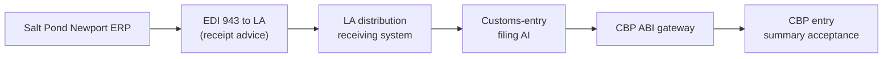

# 🧾 Diary of an Audit Day — Salt Pond Toys

**Engagement:** AI-quality and supply-chain integrity assessment ahead of (a) the annual CPSC cooperative-agreement audit, (b) the CBP CTPAT four-year revalidation due in nine months, (c) a Rhode Island AG consumer-protection lookback, and (d) a Target supplier-recall-readiness audit
**Client:** Salt Pond Toys — third-generation family-owned mid-size toy manufacturer, Newport, Rhode Island. ~$320M revenue. ~180 employees in Newport HQ + design + corporate. ~40 employees in the wholly-owned Salt Pond Shenzhen QC + procurement office. ~25 employees at Salt Pond Trans-Pacific Logistics, the wholly-owned LA West Coast distribution LLC. Three contract manufacturing partners in Guangdong (Shenzhen, Dongguan, Foshan).
**Posture:** TesseraSeal in production for eleven months across four use cases — quality-vision at Shenzhen, customs-entry filing at LA, demand-forecasting at Newport, recall-readiness traceability spanning all three sites
**Date:** Wednesday, the week after Olmstead wrapped
**Auditor:** the same eight-person team that walked the diary baseline, Mercator, Northbridge, Stelvio, Atrio, Helmstad, Pacific Crescent, and Olmstead — split across three locations for the first time in the run

---

## Context

Salt Pond Toys is the kind of company that does not get audited the way a bank gets audited. There is no quarterly call. There is no examiner. The regulators that matter to Salt Pond are the Consumer Product Safety Commission — CPSC — for product safety under the Consumer Product Safety Improvement Act, and Customs and Border Protection — CBP — for import compliance and the supply-chain security partnership called CTPAT. The state of Rhode Island also has a quiet interest because the company is the second-largest manufacturer in the state by headcount. And the retailers — Target, Walmart, Amazon — run their own supplier audits that have teeth in the form of a contractual recall-response window.

Two years ago, in the spring of 2024, a CPSC inspector showed up unannounced at the Newport receiving dock with a sealed sample bag and a photograph of a wooden push-toy a parent had sent in. The complaint claimed the paint was lead-based. The inspector wanted the testing certificate, the lot manufacturing records, the retailer ship-out chain, and the QC photos for that lot — by the end of the week.

Salt Pond's COO, Mary Catherine Ferreira, third-generation, granddaughter of the founder, found the testing certificate in a filing cabinet, found the manufacturing records in an Excel file on a shared drive, found the retailer ship-out chain in three different ERP exports that did not reconcile cleanly, and found the QC photos archived on a NAS in the Shenzhen office that nobody in Newport could log into without an IT ticket. She got it all to the inspector. The paint tested clean. There was no lead. The complaint was a false alarm.

But the inspector had written in his closing memo that the evidence chain was "best characterized as recoverable rather than producible." That phrase had been read by the General Counsel. The GC walked it to the CEO. The CEO walked it to the family. The family said: never again.

Eleven months ago, Salt Pond stood up TesseraSeal across four services. One tenant — `saltpond`. Four `service.name` values:

- `qc-vision-shenzhen` — image-classification AI on every produced unit at the three Guangdong contract factories, operated jointly by Salt Pond Shenzhen and the contract factory's floor team, ties to lot-level scrap-or-rework decisions
- `customs-entry-la` — HTS classification, duty calculation, Section 321 de-minimis eligibility check, CTPAT documentation prep, generates the CBP Form 7501 entry summary
- `demand-forecast-newport` — predicts orders by retailer and SKU from EDI feeds, ties to procurement decisions and to recall-readiness lot tracking
- `recall-traceability` — the cross-cutting service that links lot ID → CPSIA testing certificate → manufacturing date → Yantian container → LA arrival → distribution → retailer ship-out

Four CPSC, CBP, and retailer drivers stack on top of those services. CPSIA Section 102 testing certificates of conformity. CTPAT supply-chain security. The 2024 lead-paint scare and its aftermath. The Section 321 de-minimis rule changes that have been moving through CBP for the last year and a half.

The team showed up at the Newport HQ knowing the chain was eleven months old, the company was small enough that the entire executive team could fit around the conference-room table, and the audit had to cover three locations across twelve hours of time-zone spread. Mary Catherine had told Karen on the prep call: "I want you to find the boundaries. I know the chain is good on the AI parts. I want to know where it ends and what fills the space after that."

This is the diary of that day.

---

## Audit Team

The team is split across three locations for the first time in the engagement run. The Newport conference room is the anchor. The LA distribution office is on the morning bridge. The Shenzhen office joins by video for the first half of the day, which is the second half of their day.

**Newport, Rhode Island — Salt Pond HQ:**

- **Karen** — Lead Auditor (governance and narrative)
- **Raj** — Database specialist
- **Mike** — Application and API layer
- **Diana** — IAM and access control
- **Tom** — Internal-audit liaison specialist (visiting team — partners with the client CAE)

**Los Angeles, California — Salt Pond Trans-Pacific Logistics:**

- **Luis** — DevOps, logs, pipelines
- **Chen** — Data engineering and ETL

**Boston, Massachusetts — remote bridge:**

- **Elena** — CRM systems (joining remote from her home base; finishing the Sun-Won draft report from the prior week, on the Salt Pond bridge for the demand-forecasting and retailer-EDI scenes)

**Shenzhen, Guangdong — remote bridge:**

- *No team members travel to Shenzhen.* The audit firm's policy plus a corporate travel restriction following a recent State Department advisory means the China side runs on the video bridge.

Client-side liaisons:

- **Mary Catherine Ferreira**, COO, Salt Pond Toys (Newport). Family member. Third-generation. Pragmatic. Knows manufacturing cold; less technical on the AI side and trusts her CTO. Her grandfather opened the company in 1962 in a Quonset hut on the harbor.
- **Eduardo Ramos**, Director of West Coast Distribution, Salt Pond Trans-Pacific Logistics (Los Angeles). Logistics-and-customs veteran. Knows the Section 321 rule history better than the customs broker.
- **Li Wei**, GM, Salt Pond Shenzhen (remote video bridge from Shenzhen). Mandarin native, English business-fluent, eighteen years at Salt Pond. He will join the bridge at 8:30 PM Shenzhen time and stay until 11 PM, which on Eastern Time is 8:30 AM through 11 AM.

---

## 🌅 8:30 AM ET — Kickoff and the Drive In

Karen rode in with Tom from the hotel at the head of the harbor. Ten minutes south along the bridge, then up Memorial through the historic district. The Newport HQ sits on a bluff above the salt pond the company is named for. The building is a stone-and-glass 1980s rebuild that sits where the original Quonset hut used to be. The flagpole out front has the U.S. flag, the Rhode Island flag, and a small company flag with a sailboat on it.

Tom had a coffee from the inn. Karen had her usual — black coffee in a travel cup, half gone before they pulled out of the lot.

"Recap me," Tom said. "Headlines."

"Northbridge — banking, gold standard. Chain across the whole institution."

"Mercator."

"Healthcare. AI imaging chained, claims side mutable. Bifurcated. The CMO got it."

"Stelvio."

"Manufacturing. AI side chained, OT side legacy, IT business side legacy. Three zones. Maria took the verifier video to her CFO."

"Atrio."

"BaaS multi-tenant. Different chain shape, same seam location."

"Helmstad."

"Biopharma. AI eligibility decisioning chained. Trial stack mutable."

"Pacific Crescent."

"Utility. AI on outage prediction chained, OT on the substations legacy. The seam mattered to the regulator."

"Olmstead."

"University. AI on a contested admissions decision chained because a civil-rights firm demanded it. Everything else faculty-led federalism."

Tom waited.

"And today?"

Karen looked out the window at the harbor. Three sailboats already on the water in March wind.

"Eight of these now. Toys. Three locations. Two coasts plus a remote bridge to Shenzhen. CPSC. CBP. State AG. Target. We figure out which boundaries the chain reaches and where it hands off to other people's chains."

"Eight different industries, eight different shapes."

"Same shape. The chain is on the part the regulator cares most about and the part the company is most exposed on. Everything else is somebody else's chain or no chain at all. The interesting work today is at the seams between Salt Pond's chain and CBP's chain and the steamship line's chain and the retailer's chain. Stelvio was inside one company. Today we are across four."

"And the wrinkle?"

"Two wrinkles. One — the chain spans three locations across twelve hours of time zone. We have never run one of these on a video bridge before. Two — the bonded-carrier maritime leg is genuinely out of the chain because it is CBP's chain, not Salt Pond's. The question is whether the handoff is documented. Not whether we extend the chain into the steamship line."

"What's the recurring line you keep saying?"

Karen drained her cup. "It never is."

"That one."

"It never is — and at the bonded-carrier handoff, the chain literally isn't, because it's CBP's chain after that point. The question is whether the handoff is documented, not whether we extend the chain into the maritime leg."

They pulled into the visitor lot at 8:24. The salt pond was glassy below the bluff. A heron stood in the shallows.

Mary Catherine met them at the door. She was wearing a fleece vest with the Salt Pond logo on it, jeans, and the kind of running shoes a person wears when they walk three miles of factory floor a day. She was sixty-two. Her handshake was firm.

"Welcome. Eduardo is on the bridge from LA already — he started at five AM their time. Li Wei is on from Shenzhen at 8:30 our time, which is 8:30 PM his time. He will be on until 11 AM ours, which is 11 PM his. We have a tight day. Chowder at noon."

Karen smiled. "Chowder?"

"Clam chowder. White. Not Manhattan. We are not Manhattan people."

Tom laughed.

> **🔍 Karen's note (internal):**
> *Family-business kickoff. She is treating this like a Rhode Island wedding — chowder, the bridge to Shenzhen open, the LA office on the line, everyone in the right place. Eight engagements in and this is the first one where the kickoff included a meal preference.*

The team filed into the conference room. The wall display had three video tiles — the LA office, the Shenzhen conference room with Li Wei in it, and Elena's home office in Boston. Elena waved. Eduardo nodded. Li Wei was in a navy blazer with Salt Pond Shenzhen on the lanyard, the conference-room lights low behind him at his end of the day.

Mary Catherine sat at the head of the table. "Karen, the floor is yours."

Karen stood at the whiteboard. She wrote four words across the top.

`QC. Customs. Forecast. Recall.`

"Four services. One tenant. Three locations. Twelve hours of time zone. We will work top-down on each, sample one decision out of each, and reconcile against a recall scenario at three. Mary Catherine, by the end of the day you will have a clear list of where the chain reaches and where it hands off."

Mary Catherine nodded. "That is the conversation I need."

---

## 🧩 9:15 AM ET — Demand-Forecasting at Newport

Mike pulled his laptop in and connected to the demand-forecasting dashboard. The screen showed a grid of SKUs and retailers, with predicted weekly orders for the next four weeks, color-coded by confidence band.

"Pick a forecast," Mike said.

Mary Catherine pointed. "Plush bears, lot family 26-A, Target. Top-left."

Mike clicked through. The forecast had been generated on March 21, 2026, with a four-week projection. It pulled historical sales from Target's EDI 852 product-activity feed, weather data, school-calendar data, and prior-year residuals.

He opened a terminal.

```
herald-verify --tenant=saltpond \
              --service=demand-forecast-newport \
              --date=2026-03-21 \
              --entry-id=2026-03-21-DF-44918
```

Four seconds. The terminal returned:

```
Status: PASS
Step: 12
Reason: chain integrity verified, HMAC recomputed,
        Merkle path resolved, signature verified
        against public key saltpond-2026-q1
```

Mike turned the laptop toward Mary Catherine. She read the output. Karen watched her face. There was a half-second where Mary Catherine did not move.

"That's the same four seconds I saw in October. Still feels like a magic trick."

"It is not a magic trick," Karen said. "It is twelve steps of verification — HMAC, Merkle, signature against the daily seal — that runs in four seconds because the chain shape is small and the operation is local."

"My CTO told me that the first time. I just like seeing it."

> **✓ Confirmation #1**
> The demand-forecasting service at Newport produces verifiable chain entries. A March 21, 2026 forecast for Target plush-bear SKUs verified PASS in four seconds against the daily Ed25519 seal on AWS CloudHSM `us-east-1`. The key version is `saltpond-2026-q1`. The chain captures the model ID, model version, input feature snapshot hash, retailer EDI feed hash, output forecast, and confidence band.

Diana pulled up the IAM panel. The demand-forecast service runs under a service identity that has been rotated four times since deployment. Each rotation is an event in the chain. The Newport data team has read access to the dashboard but no production-credential access. The CTO has emergency break-glass access that has been used zero times.

"Clean separation," Diana said. "Service identity, rotation history, break-glass policy, all in the chain. Nothing surprising on the IAM side."

> **✓ Confirmation #2**
> IAM on the demand-forecasting service is clean. Service-identity rotations are chain-recorded with timestamp, prior-key hash, and rotation actor. The Newport data team has no production credentials. Break-glass has been provisioned and not used.

Mike paused. "The EDI feed itself — Target's 852 — that's a third-party feed. Is the feed instrumented?"

Mary Catherine looked at her CTO on the bridge from Boston. The CTO, James, said, "The EDI feed is not chain-instrumented. We do not own it. We hash-record the import event when the feed lands in our system. The hash of the file we received is in the chain. What was in Target's system before they sent it to us is their chain, not ours."

Karen wrote: *Demand-forecast service hash-records the inbound EDI feed at the import boundary. Upstream — inside Target's systems — is out of Salt Pond's chain. Same handoff shape we saw at Olmstead with the external fairness audit hash.*

> **✓ Confirmation #3**
> The demand-forecasting service hash-records every inbound retailer EDI feed at the import boundary. The hash of the received feed is captured in the chain even though the upstream — inside the retailer's systems — is not chain-instrumented. The handoff is documented, byte-anchored, and reproducible.

The team worked the demand-forecast service for forty minutes. Twelve sample forecasts across the last quarter. Twelve PASS. Mike captured the verifier output for the report.

---

## 🧠 9:30 AM ET (= 9:30 PM CST) — The Shenzhen QC Vision Walk-Through

Li Wei's video tile expanded to fill half the wall display. The Salt Pond Shenzhen conference room was lit only by the overhead lights at 9:30 PM local. Behind him, through the glass wall, Karen could see the floor lights of the office. The first shift in Dongguan was finishing — there was the faint mechanical noise of a conveyor in the audio, somebody talking in Mandarin off-camera, and then quiet.

"Good evening from Shenzhen," Li Wei said. His English was easy and clear. "I have the QC vision dashboard up. I will walk you through today's production at Dongguan and Foshan, then we sample a unit from yesterday for the verifier."

His screen shared. The dashboard showed three columns — Shenzhen factory, Dongguan factory, Foshan factory. Each column had a count of units inspected today, a defect-rate sparkline, a heat map of where on the unit defects clustered, and a queue of flagged units pending human review.

"Today Dongguan finished thirty-one thousand units of the plush-bear lot family 26-A. The vision system flagged forty-seven units. Forty-three were rework — stitching imperfections, fur-pile irregularities. Four were scrap — eye-attachment failures that could be a choking hazard. Every flagged unit has a chain entry with the image hash, the model version, the classification, and the operator's disposition."

Mike pulled up his terminal and asked Li Wei for an entry ID from yesterday's production. Li Wei copied one across.

```
herald-verify --tenant=saltpond \
              --service=qc-vision-shenzhen \
              --date=2026-03-22 \
              --entry-id=2026-03-22-QC-DG-118447
```

Four seconds.

```
Status: PASS
Step: 12
```

Mike turned the screen so Mary Catherine could see. Then he and Li Wei worked through the chain payload together. Image hash. Model version. Classification — `PASS`, `REWORK_STITCHING`, `REWORK_FUR`, `SCRAP_EYE_ATTACHMENT`, `HUMAN_REVIEW`. Confidence band. Operator badge ID — wait, Mike paused.

"The operator badge — that's the Salt Pond Shenzhen badge or the contract-factory badge?"

Li Wei answered without hesitation. "The Salt Pond Shenzhen QC operator badge. The contract-factory floor operators have their own badges in the factory's access-control system. Those are not in our chain. We have a contractual right to inspect the factory's access-control logs but we do not pull them into our chain."

Mike: "So when the vision system flags a unit and a contract-factory floor operator decides whether to scrap or rework — that operator's identity comes from the factory's system."

"Correct. The Salt Pond QC supervisor is the chain-recorded actor. The factory floor operator under that supervisor is in the factory's system."

Diana, on the Newport side: "Document that. It is an out-of-chain reliance."

> **✓ Confirmation #4**
> The Shenzhen QC vision service produces verifiable per-unit chain entries. A March 22, 2026 Dongguan-floor entry for a flagged plush-bear unit verified PASS in four seconds. The chain captures the unit image hash, model classification, confidence, and Salt Pond Shenzhen QC supervisor badge ID.

> **⚠️ Surprise #1 (Nit)**
> Contract-factory floor-operator badges are in the contract factory's own access-control system, not in the Salt Pond chain. The Salt Pond Shenzhen QC supervisor is the chain-recorded actor; the factory-floor operator under that supervisor is identified only through the factory's separate system. Salt Pond has a contractual right to inspect the factory's access-control logs. The boundary should be documented in the chain-coverage map. Severity: nit.

Li Wei walked the team through the lot-disposition workflow. A flagged unit goes to the Salt Pond QC supervisor. The supervisor reviews the image and the AI classification. The supervisor either confirms the flag, overrides up (more severe disposition), or overrides down (less severe). The override decision is in the chain. The override reason is from a controlled vocabulary — `STITCHING_ACCEPTABLE_PER_BUYER_TOLERANCE`, `EYE_ATTACHMENT_PRECAUTIONARY_SCRAP`, and so on.

"The same shape as Olmstead," Karen said. "Structured override with a controlled-vocabulary reason."

Li Wei: "We do not have a free-text rationale field at all. The buyer tolerances are pre-loaded into the controlled vocabulary every season. If the QC supervisor wants to record a rationale outside the vocabulary, the unit is escalated to me and I add a chain entry with my badge."

Karen: "Cleaner than Olmstead."

> **✓ Confirmation #5**
> The Shenzhen QC override workflow uses a fully controlled vocabulary with no free-text rationale field. Out-of-vocabulary cases escalate to the GM with a separate chain entry under the GM's badge. There is no equivalent of the Olmstead Slate-rationale gap on the Shenzhen side.

The team worked the QC vision service for an hour. Sampled twelve flagged units across three factories and four product lines. All twelve PASS. The factory-sound bleed-through stopped about thirty minutes in — second shift had ended in Dongguan, and the floor was quiet at Li Wei's end.

---

## 🧠 10:00 AM ET (= 10:00 PM CST) — Database Deep Dive

Raj had the corner of the conference table and two screens. The chain ledger on one. The Salt Pond ERP backend on the other. He worked them in order.

### The chain ledger

Append-only by design. The Herald.Py SDK signs each entry. HMAC-SHA-256 chain links entry N to entry N-1 with HKDF-per-tenant key binding. Daily Ed25519 seals on AWS CloudHSM in `us-east-1`.

Raj picked an entry from six months ago — September 2025, a QC vision pass on a wooden push-toy lot at the Foshan factory. He ran the verifier.

```
herald-verify --tenant=saltpond \
              --service=qc-vision-shenzhen \
              --date=2025-09-14 \
              --entry-id=2025-09-14-QC-FS-077183
```

```
Status: PASS
Step: 12
Reason: chain integrity verified, HMAC recomputed,
        Merkle path resolved, signature verified
        against public key saltpond-2025-q3
```

He picked the very first entry across all four services from April 15, 2025 — the day the chain went live. Verified. PASS.

He attempted a direct UPDATE on the chain table. The Postgres backend accepted it because nothing at the database layer prevents it. He ran the verifier on the next entry.

```
Status: FAIL
Step: 4
Reason: HMAC mismatch — entry payload does not produce
        the chained HMAC recorded in entry N+1
```

He attempted a multi-entry rewrite across a span of three days. The verifier failed at the daily seal:

```
Status: FAIL
Step: 9
Reason: Merkle root mismatch — recomputed root does not
        match sealed root for date 2025-11-18
```

Raj rolled back the mutations. The chain returned to PASS. He noted the test in his workbook.

> **🔍 Karen's note (internal):**
> *Same pattern as Olmstead's admissions ledger and Northbridge's banking chain. The database is mutable like any Postgres backend. The verifier catches the tamper at HMAC for single-entry attempts and at the Merkle/seal layer for multi-entry attempts. The CloudHSM key is what closes the loop — without HSM access, an attacker cannot forge a daily seal that matches the rewritten Merkle root. The ops team does not have HSM access. Two officers do, under separation of duties. The split is real.*

Mary Catherine watched the FAIL outputs come back. She did not say anything.

Raj continued. "I will sample another twenty entries across the eleven months at random. If any of them fail, we have a real finding. If they all pass, the chain has done its job for eleven months continuous."

He let the script run. Two minutes later, twenty PASS results scrolled across the screen.

### The Salt Pond ERP backend

Raj opened the ERP. SAP Business One — the small-and-medium-business SAP variant, common at companies of Salt Pond's size. He had read-only access through Mary Catherine's audit role.

He pulled the schema for the lot-master table. The ERP holds the operational lot record — the SKU, the manufacturing factory, the run dates, the cost-of-goods-sold, the planned-production quantity. Audit logging in SAP Business One is configurable; Salt Pond has it enabled at the table level for the lot-master, the bill-of-materials, and the inventory-movement tables.

"How long is your audit-log retention?"

Mary Catherine looked at her CTO on the bridge. James said, "Three years. Set it after the 2024 inspector wrote his note. We over-shoot the CPSC retention requirement by a year."

Raj: "Records edited inside three years — the change history is preserved. Records edited beyond three years — the original is gone."

James: "Correct. But the chain entries that reference those records live indefinitely on the chain side. The ERP is the operational system. The chain is the evidentiary record."

Karen wrote: *ERP audit-log retention 3 years. Chain retention indefinite. The bifurcation between the operational record and the evidentiary record is documented and intentional. Same pattern as Northbridge's core banking versus the chain ledger.*

> **✓ Confirmation #6**
> The chain ledger is append-only in practice. Direct database mutation is technically possible — the Postgres backend is mutable like any Postgres backend — but the verifier catches single-entry tamper at the HMAC layer and multi-entry tamper at the Merkle/seal layer. Sampled 20 random entries across eleven months at random; all PASS. The ERP audit-log retention is three years; the chain retention is indefinite. The bifurcation between operational system and evidentiary record is intentional and documented.

Raj closed the laptop and joined Diana for the IAM scene.

---

## 🔐 11:00 AM ET — IAM Across Three Locations

Diana stood at the whiteboard. She had drawn three boxes — Newport, LA, Shenzhen — and arrows between them showing the service identities that crossed location boundaries.

"Four services. Each service has a service identity. Each service identity rotates on its own cadence. The chain has every rotation."

She pulled up the rotation history.

| Service | Location | Rotations in last 11 months | Last rotation |
|---|---|---|---|
| `qc-vision-shenzhen` | Shenzhen | 4 | 2026-02-14 |
| `customs-entry-la` | Los Angeles | 4 | 2026-01-29 |
| `demand-forecast-newport` | Newport | 4 | 2026-03-08 |
| `recall-traceability` | Cross-location | 11 (monthly per policy) | 2026-03-15 |

Mike sampled three random rotation events from the chain — one from each single-location service. All PASS. Each rotation entry contained the prior-key hash, the new-key hash, the actor badge, the rotation reason, and the controlled-vocabulary classification — `SCHEDULED_QUARTERLY`, `CREDENTIAL_LEAK_PRECAUTION`, `PERSONNEL_DEPARTURE`, and so on.

The recall-traceability service rotates monthly because it is the cross-cutting service that touches every location and every other service. Eleven rotations in eleven months. All chain-recorded. Diana sampled the most recent — March 15, 2026. PASS.

"Clean separation between the production credential and the daily-seal HSM key," Diana said. "The Salt Pond ops team rotates the service credentials. The HSM key is in AWS CloudHSM `us-east-1` and is operated under a separation-of-duties policy with the CTO and the security director as the two authorized officers. Neither has rotated the seal key in the eleven months — the seal key has its own quarterly rotation cycle on its own cadence and that has happened on schedule."

Karen wrote: *Three locations, four services, twenty-three rotations in eleven months, all chain-recorded. Cleaner separation than I expected for a $320M company. The CloudHSM-instead-of-on-prem decision is justified — Salt Pond is small enough that on-prem HSM was overkill, CloudHSM is acceptable per CPSC and CBP, and the operational discipline is in place.*

> **✓ Confirmation #7**
> IAM separation across the three locations is clean. Twenty-three credential rotations across four services in eleven months, all chain-recorded with prior-key hash, new-key hash, actor, and reason. The daily-seal HSM key is on AWS CloudHSM `us-east-1` under a separation-of-duties policy. The CTO and security director are the two authorized officers. The seal key has its own quarterly rotation cadence, separate from the service-credential cadence.

Diana noted one boundary. "The contract-factory access-control system in Dongguan — the factory-floor operator badges Li Wei mentioned — is not in our chain. That is the documented out-of-chain reliance Mike flagged this morning. I will write it up in the IAM section as a documented boundary, not a finding."

Mary Catherine: "The factory access logs are part of our quarterly contract-compliance audit on the contract-factory side. We do pull them and review them. We just do not chain them."

Karen: "Document the review cadence in the chain-coverage map. That converts the nit into a documented dependency."

---

## 🧪 12:00 PM ET — Working Lunch on the Bonded-Carrier Handoff

Mary Catherine had clam chowder brought in for the Newport team. White, not Manhattan. Eduardo had ordered Mexican from a place near the LA distribution center and was eating fish tacos on camera. Li Wei was eating what he described as "very late dinner — congee with century egg" at his desk, the conference-room behind him now dark.

The agenda for lunch was the bonded-carrier handoff.

Eduardo started. He had a thirty-year background in ocean import logistics and had been at Salt Pond for nine of them. He was the company expert on the maritime leg.

"From Yantian to Los Angeles is fourteen days on the water. The container leaves Yantian sealed under a steamship-line bill of lading. The seal number is recorded by Yantian terminal operations at gate-out. The bill of lading is filed with CBP under the 24-Hour Manifest Rule before the ship leaves Yantian. Once it is on the water, the chain of custody is governed by CBP, the steamship line, and CTPAT — Customs-Trade Partnership Against Terrorism — vetting requirements for all parties on the manifest. We are a CTPAT Tier 2 importer in good standing."

Karen: "And during the fourteen days, what does our chain see?"

Eduardo: "Nothing. The chain sees the lot manifest event when the container leaves Yantian — that is a Salt Pond Shenzhen chain entry. The chain sees the LA distribution receiving event when the container arrives at our DC — that is a Salt Pond LA chain entry. In between, the bonded-carrier custody is CBP's responsibility and the steamship line's responsibility. We rely on the CBP CSI data feed — Container Security Initiative — for in-transit visibility. That feed is not in our chain."

Karen: "Why not?"

Eduardo: "Cost-benefit. The CSI feed updates every four hours during transit. Hashing it into our chain at every update would add roughly 84 chain entries per container. At our volume — about forty containers a month — that is 3,360 entries a month for in-transit visibility on a leg that we do not legally own. We did the math eleven months ago and decided to anchor only the entry and exit events."

Karen: "And if a container is opened in transit by CBP for inspection?"

Eduardo: "CBP issues a CES — Centralized Examination Station — notice. We get the notice. We do not currently hash that notice into the chain. It goes into the customs-broker file."

Karen put her spoon down.

"That is the gap. Not the CSI feed updates — those are operational telemetry. The CES notices are evidentiary. If a container is opened in transit, the broken seal and the inspection record matter for chain-of-custody integrity downstream. That is exactly the kind of cross-vendor anchor you want in the chain."

Eduardo nodded slowly. "We have had two CES notices in eleven months. Both routine, both clean. But you are right — those are evidentiary."

Karen wrote: *CSI in-transit feed — hash anchoring at the entry, exit, and any CES inspection event. The feed itself stays out of chain (operational); the inspection notices anchor in. Recommend Phase 2.*

> **⚠️ Surprise #2 (Nit, escalating to recommendation)**
> The CBP Container Security Initiative (CSI) in-transit data feed is intentionally out of the chain on cost-benefit grounds. The chain anchors only the Yantian gate-out event and the LA receiving event. CES inspection notices — issued when CBP opens a container in transit — are also currently out of the chain. The CES notices are evidentiary. Recommend Phase 2: hash-anchor the CES notices into the chain at receipt. Volume is low (two notices in eleven months). Severity: nit, with a recommendation.

Li Wei spoke up from Shenzhen. "On the Yantian side, we already chain the gate-out event. The seal number, container ID, lot manifest, and bill-of-lading hash all go in. The Yantian terminal-operations system is the upstream we rely on for the gate-out event itself. That is third-party — Yantian Port Holdings."

Karen: "Same shape as the EDI feed. Hash-record the upstream at the boundary, document that the upstream is not under our chain."

Eduardo: "Eleven months in and we have not found the upstream wrong. Yantian operations is one of the cleanest container-terminal systems in the world."

Karen: "That is operational confidence. The chain-of-custody documentation needs to say what the chain anchors and what it relies on. Not whether the upstream is in fact reliable."

Mary Catherine had been listening. "I want this in the chain-coverage map. The CES notices are the kind of thing CPSC will ask about during the cooperative-agreement audit. I want them in."

Eduardo: "I will put a ticket in this afternoon."

Tom wrote it down for the report.

The chowder was very good.

---

## 🔄 1:00 PM ET (= 10:00 AM PT) — The Customs-Entry AI in LA

Luis took over the bridge from the LA distribution center. The video tile from LA showed a glass-walled office overlooking the staging floor. Pallets of containers in the background. A forklift moving past at the edge of frame. The customs broker's office was visible across the floor.

"Customs-entry filing AI," Luis said. "We process roughly forty containers a month inbound, plus a steady stream of outbound shipments to retailers. The AI handles the HTS classification, the duty calculation, the Section 321 de-minimis check on the direct-to-consumer side, and the CTPAT documentation prep. It generates the CBP Form 7501 entry summary."

Mike, from Newport: "Pick a recent entry."

Eduardo on the LA tile pointed. "Container CN-AAAA-2026-0312. Yantian gate-out March 12. LA receipt March 26. Entry summary filed March 27. Cleared March 28."

Luis copied the entry ID:

```
herald-verify --tenant=saltpond \
              --service=customs-entry-la \
              --date=2026-03-27 \
              --entry-id=2026-03-27-CE-04188
```

Three seconds.

```
Status: PASS
Step: 12
```

Luis turned the screen toward the camera. Karen watched from Newport. Mary Catherine read the output.

"Same four-second pattern. Just faster on the LA hardware."

> **✓ Confirmation #8**
> The customs-entry-filing service at LA produces verifiable chain entries. A March 27, 2026 entry summary for container CN-AAAA-2026-0312 verified PASS in three seconds. The chain captures the AI-generated HTS classification, duty calculation, Section 321 eligibility decision (where applicable), CTPAT documentation hash, and the broker-of-record badge.

Luis walked the team through the chain payload. HTS code. HTS-classification confidence. Duty calculation. Country of origin (China, in this case). Manufacturer ID (one of the three Guangdong factories). Section 321 eligibility decision — `NOT_APPLICABLE` for full container freight, applicable for the direct-to-consumer pipeline. CTPAT documentation hash. CBP Form 7501 PDF hash.

Eduardo: "The HTS classification is the high-value field. CBP cares about getting it right. Misclassification is duty-recovery risk on our side, fraud risk on theirs. The AI gets it right at about 99.4% by our internal QC; the broker reviews everything anyway and overrides about 0.6%. Every override is in the chain with a reason code."

Mike: "Sample an override."

Luis pulled one. The AI had classified a unit as HTS 9503.00.00 — toys, not elsewhere specified. The broker had overridden to HTS 9504.90.90 — articles for arcade or table games. Reason code `BUYER_REQUEST_RECLASSIFICATION_PER_RULING_LETTER`. Chain entry with the broker badge.

"Clean," Mike said. "Structured override, controlled-vocabulary reason, broker-badge actor."

Karen: "Same shape as Shenzhen QC."

> **✓ Confirmation #9**
> The customs-entry override workflow at LA mirrors the Shenzhen QC override workflow. Structured override decision, controlled-vocabulary reason code, broker-badge actor. Sampled override (HTS 9503 → 9504 reclassification per CBP ruling letter) verified PASS.

The team worked the customs-entry service for forty-five minutes. Eight sample entries across the last six weeks. All eight PASS.

---

## 🧬 2:00 PM ET (= 11:00 AM PT) — The Customs Pipeline Deep Dive

Chen took over from the LA side. He had been quiet through the morning while Luis ran the customs-entry walkthrough. Now he had the data flow on his screen.

"Customs-entry filing data flow. Five legs."

He drew the legs on a shared whiteboard.



"Each leg is hash-anchored. Newport ERP exports the manifest as an EDI 943 — the hash of the EDI 943 is in the chain. The LA receiving system imports it — hash-recorded at the import boundary. The customs-entry AI processes it — every AI inference is in the chain. The ABI gateway transmission — the file submitted to CBP, including all the binary payloads — has its hash in the chain. CBP's acceptance message comes back with a CBP-side reference number; we hash and record the acceptance message."

Mike: "The CBP-side reference number is anchored in our chain even though CBP's chain is not."

Chen: "Right. We hash-record what we receive from CBP. CBP's internal chain-of-custody for the entry summary is theirs. We do not extend into it."

Karen: "Same shape as the EDI 852 from Target this morning. Same shape as Yantian gate-out from this morning. The chain anchors at every cross-vendor boundary; the upstream/downstream chain belongs to the other party."

Chen: "We have five legs. Five hash anchors. Five bytes-on-disk references. If CBP comes back two years from now and asks 'what did you submit on March 27, 2026, for entry 2026-03-27-CE-04188', we can produce the bytes, prove the hash, and show the ABI transmission record."

> **✓ Confirmation #10**
> The customs-entry filing pipeline is hash-anchored at every cross-vendor boundary — Newport ERP export, LA receiving import, AI inference, CBP ABI gateway transmission, CBP acceptance message. Five legs, five hashes. The bytes for each leg are reproducible from the chain entry references. CBP's internal chain-of-custody is out of scope and explicitly documented as such.

Eduardo flagged a wrinkle.

"Section 321 de-minimis. We do direct-to-consumer Amazon for some SKUs — the under-$800 ones. Section 321 lets shipments under $800 in fair retail value enter duty-free under the de-minimis rule. CBP issued a rule change in 2025 requiring more granular country-of-origin reporting on de-minimis entries. Our customs-entry AI handles this for full-container freight cleanly. The de-minimis pipeline is partly manual — the customs broker reviews each de-minimis batch before submission, and the manual review is partially out of the AI's chain."

Karen: "How partial?"

Eduardo: "The AI generates the country-of-origin classification and the de-minimis eligibility check. The broker manually adds the granular country-of-origin breakdown when it does not match the AI's pre-classification. That manual addition is captured in the broker's case-management system but is not currently hashed into our chain. We hash the final ABI submission, so the broker's addition is captured in the final hash. But the intermediate state — the AI's pre-classification, the broker's manual addition, the merged result — is only partially in the chain."

Karen wrote: *Section 321 de-minimis chain coverage — partial. AI pre-classification in chain. Broker manual addition in broker case-management system, not hashed in until final ABI submission. Final submission is in chain. Intermediate state is partial. CBP is moving on de-minimis enforcement. Recommend Phase 2 to hash-anchor the broker's manual addition step.*

> **⚠️ Surprise #3 (Partial)**
> Section 321 de-minimis chain coverage is partial. The AI pre-classification is in the chain. The customs broker's manual country-of-origin addition (required when the AI's pre-classification needs more granular detail under the 2025 CBP rule change) is captured in the broker's case-management system, not hashed into Salt Pond's chain until the final ABI submission. The final submission hash captures the merged result, so the chain has the end-state. The intermediate-state coverage is the gap. CBP is moving on de-minimis enforcement. Recommend Phase 2: hash-anchor the broker's manual addition step at the moment the broker saves it. Severity: partial.

Eduardo: "Fair. We have been waiting to see whether the CBP rule change finalizes before investing in the broker-side integration. It looks like it is finalizing. I will put it on the Phase 2 list."

Karen: "Document the current coverage in the report and put the Phase 2 recommendation in the remediation list. Do not document this as a gap. It is a partial with a known remediation path."

Tom wrote it down.

---

## 🧬 1:00 PM ET — Cross-Vendor Anchor: Bureau Veritas CPSIA Certificates

Mike worked the Bureau Veritas anchor in parallel from Newport while Chen was on the customs pipeline.

"Bureau Veritas is the CPSC-accredited testing lab Salt Pond uses for CPSIA Section 102 certificates of conformity. Every children's product Salt Pond makes gets a testing certificate. The certificates come back as PGP-signed PDFs. We hash the PDF and put the hash in the chain. The PGP signature gives us provenance from Bureau Veritas. The chain hash gives us byte-level reproducibility."

Mary Catherine: "Bureau Veritas is the same lab we used during the 2024 scare. The certificate exists. We just could not produce it cleanly that week."

Mike: "Now the certificate hash is in the chain at the moment Salt Pond receives it from Bureau Veritas. The chain entry has the lot ID, the testing certificate ID, the Bureau Veritas issue date, the PGP key fingerprint, and the PDF hash."

He pulled up a sample. Lot 26-A-1129 — plush bears, the same lot family Mary Catherine had picked at 9:15 AM.

```
herald-verify --tenant=saltpond \
              --service=recall-traceability \
              --date=2026-02-19 \
              --entry-id=2026-02-19-CPSIA-LOT-26-A-1129
```

PASS.

Mike opened the actual Bureau Veritas PDF from the local file system. Computed the SHA-256.

```
SHA-256: a3f2c891b6e74d8a2c1f9e3d5b8a7c4e1f3a9b7d2e8c5f4a6b9e3d1c8a7f4b2c
```

He compared it to the hash in the chain entry. Matched byte for byte.

"Hash matches. PGP signature on the PDF verifies against Bureau Veritas's published key. We have full evidentiary anchor for the testing certificate."

> **✓ Confirmation #11**
> The Bureau Veritas CPSIA testing-certificate cross-vendor anchor is clean. PGP-signed PDFs are hash-recorded into the chain at receipt; the PDF hash and the PGP signature both verify. Sampled lot 26-A-1129 testing certificate verified PASS, hash matched byte-for-byte to the Bureau Veritas-issued PDF, PGP signature verified against Bureau Veritas's published key.

Mary Catherine watched the verification. She did not say anything for a moment.

Then she said: "In April 2024, the inspector wanted to see the certificate for a wooden push-toy. I had to send a runner to the records room to find it in a filing cabinet. By the time I had it on his desk, three hours had gone by, and he had already written 'recoverable rather than producible' in his notes. If he came back today and asked the same question, I could give him this output in four seconds."

Tom: "That is what the chain is for."

Mary Catherine nodded, slowly.

---

## 📊 3:00 PM ET — The Recall-Readiness Reconciliation

The whole team came back to the Newport conference room. Eduardo was on from LA. Li Wei was still on from Shenzhen — it was 3 AM there now, and he had been on the bridge for six and a half hours. He had said earlier he wanted to stay through the recall test.

Karen stood at the whiteboard.

"Recall-readiness exercise. We pick a lot, we run a hypothetical recall, we measure how long it takes to produce a complete trace. Mary Catherine, you pick the lot."

Mary Catherine flipped through a printed lot index on the table. She picked.

"Lot 25-D-0492. Stuffed-animal lot, late 2025. Distributed to 47 retailers. About 3,840 units. Pick that one — we have data going back four months. The 2024 scare had been with a similar lot."

Mike sat at the laptop. He typed:

```
herald-recall-trace --tenant=saltpond \
                    --lot-id=25-D-0492 \
                    --include-cpsia \
                    --include-manifest \
                    --include-distribution
```

The terminal blinked. The query ran.

Eight seconds. The recall-readiness service returned a structured trace report. Mike read it onto the screen for the team.

```
Lot 25-D-0492 — Stuffed-animal "Harbor Bear" — Lot family 25-D
Manufacturing factory: Foshan
Manufacturing date: 2025-11-12 to 2025-11-15
QC vision pass: 2025-11-17 (3,840 units, 47 flagged, 41 rework, 6 scrap)
CPSIA testing certificate: BV-2025-CN-09182 (Bureau Veritas, 2025-11-21)
   Cert PDF SHA-256: 7c3e9a8b1f4d6e2c... (verified)
   PGP signature: verified
Yantian container: CN-BBBB-2025-1124
   Gate-out: 2025-11-24 14:32 CST
   Seal: SLT-PND-2025-0492-001 (intact at gate-out)
   Bill of lading: ML-2025-11-24-0188 (Maersk Line)
LA receipt: 2025-12-08 09:15 PT
   Container seal at receipt: SLT-PND-2025-0492-001 (intact, matches Yantian)
   Receiving entry: LA-RECV-2025-12-08-04412
Customs entry: 2025-12-09 11:42 PT (HTS 9503.41.0000, duty paid)
   Entry summary: 2025-12-09-CE-04412 (CBP-accepted 2025-12-10 08:30 PT)
Distribution to 47 retailers between 2025-12-15 and 2026-01-22
   Top retailers by units: Target (1,118), Walmart (892), Amazon DSP (640)
   Per-retailer ship-out events: 47 chain entries
```

Mike's stopwatch read 8 seconds for the query plus 6 minutes for the readback.

He kept going. He pulled the QC vision images for one of the flagged-and-reworked units.

```
herald-image-fetch --tenant=saltpond \
                   --lot-id=25-D-0492 \
                   --unit-seq=00891 \
                   --pre-rework
```

The image came back. The chain hash matched the image bytes. He pulled the post-rework image. Same. Hash matched.

He pulled the Target ship-out chain entry for one specific unit.

```
herald-trace --tenant=saltpond \
             --lot-id=25-D-0492 \
             --retailer=TGT \
             --dc=DC75
```

Returned the chain entry — Target DC 75, ship-out 2026-01-08, 132 units in this particular ship-out batch. PASS.

Total elapsed time from "Mary Catherine picked the lot" to "complete trace produced including QC images and per-retailer ship-out": 14 minutes.

Karen looked at the wall clock. 3:14 PM. They had started at 3:00 sharp.

"Fourteen minutes."

Mary Catherine: "Target's contractual recall-response window is 24 hours. The CPSC field-inspector working timeline is 'end of week' if they show up unannounced like in 2024."

Tom: "Fourteen minutes is well inside both."

Eduardo from LA: "And the chain produces this regardless of where the question is asked. Newport, LA, Shenzhen, anywhere. The chain is the system of record."

> **✓ Confirmation #12**
> The recall-readiness exercise on lot 25-D-0492 produced a complete cross-location trace — Foshan manufacturing, Shenzhen QC vision pass with 47 flagged units (41 rework, 6 scrap), Bureau Veritas CPSIA certificate (PGP-verified, hash-anchored), Yantian container CN-BBBB-2025-1124, container seal verified intact from gate-out to LA receipt, customs entry, and 47 per-retailer ship-out events covering 3,840 units — in 14 minutes. Salt Pond's contractual Target recall-response window is 24 hours; the CPSC field inspector's customary timeline is "end of week." A 14-minute traceability response is comfortable inside both.

Mary Catherine held the printed lot index in her hand and looked at it for a long moment.

"This is what we did not have in 2024."

Karen wrote: *Recall test passed. 14 minutes. Cross-location, cross-vendor, end-to-end. Comprehensive. The chain is what stands between Salt Pond and the next 'recoverable rather than producible' moment.*

---

## 😬 3:45 PM ET — Friction at the Section 321 Boundary

The recall test had gone well enough that the room was relaxed. Eduardo on the LA bridge raised his hand.

"Karen. One more thing on Section 321."

Karen: "Go."

"The CBP de-minimis rule change finalized two weeks ago. It is going into effect on July 1. The granular country-of-origin reporting requirement is more aggressive than what we are currently doing. Our broker's manual addition step — the partial we wrote up at lunch — has to be hashed into our chain by July 1 to keep the chain coverage clean. That is fourteen weeks."

Karen: "What is the implementation work?"

Eduardo: "Webhook from the broker's case-management system into our chain at the moment the broker saves the manual addition. The broker's vendor — Descartes — already has a webhook API. Our customs-entry service consumes webhooks. The implementation is small. The schedule is the issue. Fourteen weeks for what should be a four-week project, given that we have to coordinate with Descartes, our broker, and the CBP rule effective date."

Mary Catherine: "What is the cost?"

Eduardo: "Roughly fifty thousand dollars to Descartes for the webhook customization. Maybe ten thousand on our side for the chain integration. Maybe sixty thousand total."

Mary Catherine: "Approve. I will sign for it this afternoon."

Karen: "That moves the partial from 'recommended Phase 2' to 'in flight, completion by July 1, ahead of the rule effective date.'"

Eduardo: "Yes."

Tom wrote it in his book.

> **🔍 Karen's note (internal):**
> *The Section 321 partial got moved to in-flight inside thirty minutes of the recall test producing a clean trace. The recall test sold the partial. The chain working on the recall convinced the COO to fund the partial closure. That is the right shape. We did not have to write a finding letter. The client funded the remediation in the same room.*

---

## 🔍 4:30 PM ET — The Recall Question

Mary Catherine stood up and walked to the window. She looked out at the salt pond. The heron was gone. The light was getting flat — March in New England flat, gray and even.

She turned around.

"I want to ask one question before we wrap. If I get a CPSC call tonight saying lot 25-D-0492 has a defect that we missed in QC, what does the chain give me?"

Karen looked at her steadily.

"Walk it through with me," Karen said.

Mary Catherine nodded.

Karen stood and went to the whiteboard.

"One. The chain has every QC pass for lot 25-D-0492 from the Foshan factory floor on November 12 through November 15, 2025. Three thousand eight hundred and forty unit-level entries, plus the forty-seven flagged units with their pre- and post-rework images. If CPSC says the QC missed a defect, you produce the QC chain and you can say: here are all 3,840 inspections, here are the 47 we caught, here are the images we have. If the alleged defect is in one of the units we caught and reworked, the image and the disposition are in the chain. If the alleged defect was systematic, the whole lot's QC record is in the chain."

She wrote `QC` on the board. Drew a check.

"Two. The CPSIA testing certificate is in the chain. PGP-signed, hash-anchored. You tell CPSC: the lot was tested by Bureau Veritas, the certificate ID is BV-2025-CN-09182, here is the PDF, here is the PGP signature, here is the hash. CPSC can call Bureau Veritas. Bureau Veritas can confirm the certificate. Both ends match."

`CPSIA cert.` Check.

"Three. The Yantian container manifest. Container CN-BBBB-2025-1124, seal SLT-PND-2025-0492-001. Bill of lading from Maersk. Gate-out date and time. The container seal was intact at LA receipt — that is the chain-of-custody confirmation. If CPSC asks whether the container was opened in transit, you produce the chain entry showing the seal intact at receipt. If they push, you go to CBP with the bill-of-lading number and CBP confirms the container's CSI history."

`Container manifest.` Check.

"Four. The LA distribution receiving record. December 8, 2025, 9:15 AM Pacific. Receiving entry LA-RECV-2025-12-08-04412. The receiver's badge. The forklift route from container to staging area. Standard distribution chain."

`LA receiving.` Check.

"Five. The per-retailer ship-out events. 47 chain entries. Target got 1,118 units, Walmart 892, Amazon DSP 640. Each entry has a date, a destination DC, a unit count, and a Salt Pond shipping-clerk badge. If the CPSC inquiry is about a Target store in Ohio, you can narrow the search to the Target ship-out chain and tell CPSC how many units of lot 25-D-0492 went to which Target DC, and from there Target's own systems take over for the store-level allocation."

`Per-retailer ship-out.` Check.

"Six. The QC vision images themselves. We sampled one this afternoon — pre-rework and post-rework images for unit 25-D-0492-00891, hashes matched, images retrievable from cold storage in the chain entry references. If CPSC asks for the image of a specific unit, you can produce it."

`AI quality-vision images.` Check.

She put the pen down.

"What you cannot do — what no chain can do for you — is produce the maritime leg in granular detail, because that is CBP's chain. You can confirm the seal was intact at both ends. You can confirm CBP's CSI feed showed no in-transit incidents. But the actual minute-by-minute custody is governed by the steamship line and CBP. That is a documented out-of-chain reliance. CPSC will not push on it because CPSC defers to CBP on the maritime leg."

Mary Catherine had been watching the whiteboard. She nodded.

"Compared to the 2024 scare, we now have evidence."

Karen: "Compared to the 2024 scare, the inspector would not write 'recoverable rather than producible.' He would write 'producible' and then he would ask his lab questions about the actual product. The chain has done its job. Whatever happens next is between the lab and the testing data, not between the inspector and Salt Pond's filing cabinets."

Mary Catherine sat down.

"That is what I needed to hear."

> **✓ Confirmation #13**
> A hypothetical CPSC defect inquiry on lot 25-D-0492 is fully serviceable from chain evidence alone for: QC vision per-unit inspection records, CPSIA testing certificate (Bureau Veritas, PGP-signed, hash-anchored), Yantian container manifest with seal verification at both ends, LA distribution receiving record, per-retailer ship-out events for all 47 retailers, and pre/post-rework vision images. The maritime leg is a documented out-of-chain reliance on CBP's chain. CPSC defers to CBP on the maritime leg.

---

## 🌆 5:30 PM ET — Joint Debrief

The team reconvened — Newport in the conference room, LA on the bridge, Shenzhen on the bridge with Li Wei now near 5:30 AM local time, Elena from Boston on the bridge.

Karen stood at the whiteboard. Four rows.

| Audience | Status |
|---|---|
| CPSC (cooperative-agreement annual audit) | 0 Gaps. 1 Partial — Section 321 de-minimis chain coverage (in flight, completion by July 1). 2 Nits — factory-floor operator-badge documentation, CSI feed CES-notice anchoring. |
| CBP CTPAT (4-year revalidation, 9 months out) | 0 Gaps. CSI feed CES-notice anchoring is the recommendation. |
| Rhode Island AG (consumer-protection lookback) | 0 Gaps. Paperwork-only review; the chain is more than is required. |
| Target supplier audit (recall-readiness) | 0 Gaps. 14-minute reconciliation well inside the 24-hour contractual window. |

"That's the shape."

Mary Catherine stood at the side, arms folded.

"CPSC. The chain on the AI side is mature. Confirmed: chain integrity across the four services, append-only ledger, per-service IAM with rotation history, Bureau Veritas cross-vendor anchor for every CPSIA certificate, Shenzhen QC vision per-unit chain, customs-entry per-shipment chain, demand-forecast hash anchoring at the EDI import boundary, and a 14-minute recall-readiness response on a sampled lot. One partial — Section 321 de-minimis chain coverage. Eduardo committed to closing it by July 1, ahead of the CBP rule effective date. Funded today. Two nits — the contract-factory floor-operator badges at the Guangdong factories sit in the factories' own access-control systems and we document this as an out-of-chain reliance with a quarterly contract-compliance review; the CSI in-transit feed is intentionally out of chain on cost-benefit grounds, but the CES inspection notices are evidentiary and we recommend hash-anchoring those at receipt."

She moved to CBP CTPAT.

"CTPAT revalidation in nine months. The chain on the customs-entry side gives us the documentation completeness CTPAT looks for. The CSI CES-notice anchoring is the recommendation that closes the only soft spot. Eduardo can close that in parallel with the Section 321 work. By the revalidation, the chain coverage will be tighter than current."

She moved to the Rhode Island AG.

"The state lookback is paperwork-only. The chain produces the paperwork. The AG's office has not seen anything like this from a Rhode Island manufacturer; treat the response as proactive. Send it cleanly. Done."

She moved to Target.

"Target's supplier-recall-readiness audit will ask for the response time on a hypothetical recall. Salt Pond's response is 14 minutes. Target's contractual window is 24 hours. The audit response writes itself. Include the lot 25-D-0492 reconciliation as an appendix."

She put the pen down.

Mary Catherine spoke. "What do I take to the family Friday?"

Tom answered. "Three things. The four-row summary. The 14-minute recall test as a real artifact — and the 2024-versus-2026 comparison. The Section 321 partial as 'in flight, funded, closing by July 1.'"

"And the rest?"

"The rest is the eleven months of operational discipline that produced the four-row summary. The chain works. The boundaries are documented. The remediation work is small and funded. CPSC, CBP, the state, and Target — four different audiences, all serviceable from one chain."

Mary Catherine nodded. She turned and looked at the bridge tile from Shenzhen. Li Wei was tired. It was almost six in the morning his time.

"Li Wei. Thank you. Get some sleep."

Li Wei smiled. "Good night, Mary Catherine. Or — good evening for you. We will pick up tomorrow on the Section 321 webhook scoping with Descartes."

His tile went dark.

Eduardo on the LA tile: "Karen, thank you. Same offer as Eduardo always makes — when you are next in LA, the staging-floor tour is open. The crew likes auditors who actually look at the floor."

Karen: "I will take you up on that."

Elena waved goodnight from Boston.

The Newport team packed up. Raj loaded the boxes of evidence into the rental SUV. Diana said goodbye to Mary Catherine at the door. Mike took one last look at the salt pond — the heron was back, standing in the shallows, head down.

Karen walked out last. She turned at the doorway and looked back at the conference-room window — at the empty whiteboard, the cold chowder bowls, the four rows that would become Friday's memo.

> **🔍 Karen's note (internal):**
> *Eight engagements in. First time we ran one across three locations on a video bridge. The bridge worked. The chain worked. The boundaries are at the cross-vendor seams — Bureau Veritas, Yantian, the steamship line, CBP, the contract factories, the retailers — and at each seam the chain anchors at the boundary and documents what it relies on. The maritime leg is genuinely CBP's chain. The chain literally isn't there because it isn't supposed to be. The handoff is documented.*
>
> *It never is — and at the bonded-carrier handoff, the chain literally isn't, because it's CBP's chain after that point. The question is whether the handoff is documented, not whether we extend the chain into the maritime leg. Today we proved the handoff is documented. Tomorrow we recommend tightening it at the CES-notice receipt.*
>
> *Mary Catherine compared this to 2024. That is the right comparison to make. In 2024 the inspector wrote 'recoverable rather than producible.' In 2026 the recall test produced 14 minutes of complete trace from a cold pick. The chain is the difference.*

---

## ✅ vs ❌ — The Four-Audience Summary

### ✅ CPSC (Annual Cooperative-Agreement Audit)

| Item | Status |
|---|---|
| Chain integrity (HMAC + Merkle + daily Ed25519 seal on AWS CloudHSM `us-east-1`) | PASS |
| `qc-vision-shenzhen` service per-unit chain | PASS — sampled 12 flagged-and-reworked units across 3 factories, all PASS |
| `customs-entry-la` service per-shipment chain | PASS — sampled 8 entries across 6 weeks, all PASS |
| `demand-forecast-newport` service per-forecast chain | PASS — sampled 12 forecasts across the last quarter, all PASS |
| `recall-traceability` cross-service chain | PASS — sampled lot 25-D-0492, 14-minute complete trace |
| Bureau Veritas CPSIA cross-vendor anchor (PGP + hash) | PASS — sampled lot 26-A-1129 cert, byte-for-byte match |
| IAM separation across the three locations | PASS — 23 credential rotations in 11 months, all chain-recorded |
| HSM separation of duties (CTO + security director) | PASS — seal key on its own quarterly cadence, separate from service-credential cadence |
| Yantian gate-out and LA receipt anchoring | PASS — container seal verified intact at both ends, sampled 25-D-0492 lot |
| Per-retailer ship-out chain (47 retailers, lot 25-D-0492) | PASS — all 47 ship-out events in chain |
| Section 321 de-minimis chain coverage | PARTIAL — broker manual addition step not chain-anchored at intermediate state; in flight, funded, completion by July 1 |
| Contract-factory floor-operator badge documentation | NIT — factory-floor operators are in the factory's access-control system, not Salt Pond's chain; documented as out-of-chain reliance with quarterly contract-compliance review |
| CSI in-transit feed CES-notice anchoring | NIT — CES inspection notices are evidentiary; recommend hash-anchoring at receipt; volume is low (2 in 11 months) |

### ✅ CBP CTPAT (Four-Year Revalidation, 9 Months Out)

| Item | Status |
|---|---|
| CTPAT documentation completeness | PASS — chain-anchored for every container in the last 11 months |
| CTPAT importer Tier 2 status | Active, in good standing, 9 months until revalidation |
| Section 321 de-minimis under the 2025 rule change | In flight — broker webhook integration funded, completion by July 1 |
| CSI CES-notice anchoring | Recommendation — hash-anchor at receipt; closes the only soft spot for revalidation |
| Bonded-carrier maritime leg | Documented out-of-chain reliance on CBP and the steamship line; CTPAT-vetted |

### ✅ Rhode Island AG (Consumer-Protection Lookback)

| Item | Status |
|---|---|
| Paperwork-only state-level review | Serviceable from chain |
| Chain coverage relative to AG expectations | More than required; treat the response as proactive |
| Chain effective date | 2025-04-15 (eleven months prior to engagement) |

### ✅ Target Supplier Audit (Recall-Readiness)

| Item | Status |
|---|---|
| Contractual recall-response window | 24 hours |
| Demonstrated recall-readiness response (lot 25-D-0492) | 14 minutes |
| Per-retailer ship-out chain (Target specifically) | Granular to DC, lot 25-D-0492 → DC 75, 132 units, ship-out 2026-01-08 |
| Recall test as audit appendix | Recommended — include the lot 25-D-0492 reconciliation as Appendix A |

### 🔁 Cross-Audience Boundary Map

| Boundary | Chain Anchored At | Out-of-Chain |
|---|---|---|
| Retailer EDI feed (Target 852) | Hash-recorded at import boundary | Upstream — inside the retailer's systems |
| Yantian gate-out | Hash-recorded at gate-out event | Upstream — Yantian terminal-operations system |
| Bonded-carrier maritime leg | Anchored at gate-out and at LA receipt | The 14-day in-transit leg — CBP and steamship-line responsibility |
| CSI in-transit feed | Anchored at gate-out and at LA receipt | Operational telemetry intentionally out of chain; CES notices to be hash-anchored at receipt (recommendation) |
| CBP ABI gateway | Hash-recorded at submission and at acceptance | CBP's internal chain-of-custody for the entry summary |
| Bureau Veritas CPSIA cert | PGP signature + chain hash at receipt | Bureau Veritas's internal lab record |
| Contract-factory floor-operator badges | Salt Pond Shenzhen QC supervisor in chain | Factory-floor operator in factory's separate access-control system; quarterly contract-compliance review |
| Retailer drop-ship handoff | LA distribution ship-out in chain | Retailer's downstream — store-level allocation, in-store handling |

---

## 🧾 Final Assessment Theme

> *"Salt Pond's chain reaches every boundary it owns and stops cleanly at every boundary it does not. The bonded-carrier leg is genuinely CBP's chain — extending into it is not the goal; documenting the handoff at gate-out and at receipt is. The chain on the AI services is mature. The recall test produced 14 minutes of complete trace from a cold pick. The 2024 inspector's phrase 'recoverable rather than producible' has become 'producible' — and the rest of what happens after a CPSC inquiry is between the testing lab and the data, not between the inspector and Salt Pond's filing cabinets. The Section 321 partial is in flight and funded. The CES-notice anchoring is a small recommendation. The chain has done what the family asked it to do eleven months ago."*

Salt Pond Toys demonstrates mature AI-quality and supply-chain integrity across four services, three locations, and twelve hours of time-zone spread. The chain is eleven months old, deployed in response to a 2024 inspection that exposed an evidence-chain gap, and now produces verifiable artifacts for four distinct audiences — CPSC, CBP, the Rhode Island AG, and a Target supplier audit — from a single tenant with a single underlying ledger. The Bureau Veritas CPSIA cross-vendor anchor is the cleanest cross-vendor anchor the team has seen in the engagement run; PGP signature plus chain hash gives byte-level reproducibility against a CPSC-accredited testing lab.

The Shenzhen QC vision service is rigorous. Per-unit chain entries, controlled-vocabulary override workflow with no free-text rationale field, structured escalation to the GM for out-of-vocabulary cases. The customs-entry filing service in LA is hash-anchored at every cross-vendor boundary across five legs. The demand-forecasting service at Newport hash-records inbound retailer EDI feeds at the import boundary. The recall-traceability service ties the four together and produced a 14-minute complete trace on a cold-pick lot — well inside Salt Pond's 24-hour contractual recall window with Target and well inside the CPSC field-inspector customary timeline.

The boundaries the chain hands off to other parties' chains are documented. The retailer EDI feeds upstream are the retailers' chains. The Yantian gate-out upstream is Yantian Port Holdings. The bonded-carrier maritime leg is CBP's chain plus the steamship line's manifest, with the seal verification at gate-out and receipt as the chain's anchor at both ends. The contract-factory floor-operator badges are in the contract factories' own access-control systems, with a quarterly contract-compliance review as the operational discipline. The retailer drop-ship downstream is the retailers' chains.

One partial — Section 321 de-minimis chain coverage at the broker's manual addition step — is in flight and funded, with completion targeted ahead of the July 1 CBP rule effective date. Two nits — the contract-factory floor-operator badge documentation and the CSI CES-notice hash anchoring — are documented as out-of-chain reliances and as a small recommendation respectively.

The 2024 lead-paint scare was the forcing function. The chain was not yet deployed during the 2024 incident, so Salt Pond can demonstrate post-deployment compliance rather than retroactive compliance. The recall test on lot 25-D-0492 — three thousand eight hundred and forty units, forty-seven retailers, fourteen minutes from cold pick to complete trace — is the artifact the family asked for eleven months ago. Mary Catherine compared the 2026 result to the 2024 incident in the room. The comparison was the engagement's anchor.

Four audiences. Four audit windows. One chain. Twelve hours of time-zone spread covered on a video bridge with Li Wei staying on past 5 AM Shenzhen time to see the recall test produce its trace. The chain reached every boundary it owns. It stopped cleanly at every boundary it does not. The handoff at the bonded-carrier leg is documented and that is exactly what the chain is supposed to do at that boundary.

---
