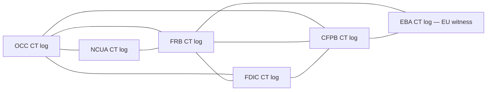

# Cryptographic Agility Roadmap

> **What this doc is.** The institution-facing and verifier-facing roadmap covering how the chain migrates between cryptographic primitives over its operating horizon. This document folds proposals previously framed as "v1.1 candidates" — hash-function agility, hybrid signatures, key transparency, the HNDL response, public-key-id binding, and the optional 32-byte fingerprint mode — into the v1.0a normative posture as documented roadmap with concrete migration mechanism. The chain ships v1.0a with single-algorithm Ed25519 plus SHA-256/HMAC-SHA-256 as the production primitives; the agility plumbing is part of v1.0a so a v1.x amendment that introduces a second algorithm or a different hash function does not require a wire-format break.

> **What this doc is NOT.** Not a v1.x specification. The byte-level fixture for the second algorithm is a documented placeholder (cross-reference to `spec/test-vectors/015-multi-algorithm/`); the v1.x amendment ships the fixture with concrete primitives. This document names the migration mechanism and the migration triggers; the v1.x amendment names the specific primitives, byte-layouts, and conformance gates.

---

## 1. Reading order

| Reader | Reading order |
|---|---|
| Institution preservation-plan custodian (records officer) | §2 (current primitive posture) → §10 (HNDL response and dual-algorithm seal mandate) → §11 (migration windows and trigger conditions) → cross-reference `templates/records-management-program.md` §7 |
| Verifier implementer | §3 (algorithm-dispatch plumbing already in v1.0a) → §4 (hash-function agility) → §5 (hybrid signature variant B specification) → §6 (key-transparency mechanism) |
| Examiner reading the chain at year 25 | §11 (migration window) → §10 (HNDL response) → §12 (long-horizon outlook for the chain produced today) |
| CFRG / academic reviewer | §4 → §5 → §6 → §7 (public-key-id binding into sign_payload) → §8 (key_fingerprint optional 32-byte mode) |

---

## 2. Current primitive posture (v1.0a)

The chain v1.0a ships with the following primitive selections. Each has a documented migration path covered in subsequent sections.

| Primitive class | v1.0a default | Migration mechanism in this document | Migration trigger |
|---|---|---|---|
| Per-event MAC | HMAC-SHA-256 (FIPS 198-1) | §4 hash-function agility | NIST sunset of SHA-256 OR credible HMAC-SHA-256 cryptanalytic result |
| Per-event payload hash | SHA-256 (FIPS 180-4) | §4 hash-function agility | NIST sunset of SHA-256 |
| Session-key derivation | HKDF-SHA-256 (RFC 5869) | §4 hash-function agility (HKDF salt+info inputs are hash-bound) | Same as per-event MAC |
| Daily Merkle leaf and internal node | SHA-256 with `0x00` / `0x01` domain separators (RFC 6962) | §4 hash-function agility | Same as SHA-256 |
| Daily seal signature | Ed25519 (FIPS 186-5; RFC 8032) | §3 algorithm dispatch already in v1.0a; §5 hybrid signature variant B for dual-algorithm posture | NIST deprecation OR HNDL response (§10) |
| Canonicalization | JCS (RFC 8785) | No migration anticipated; JCS is determinism-focused not security-focused | None foreseen |
| Key fingerprint | 16-byte truncation `SHA-256(utf8(tenant_id) || ikm)[:16]` | §8 optional 32-byte mode for >25-year horizons | Institution-side preservation-plan decision |

The v1.0a substrate is the regulatory baseline. The mechanisms below are the institution's documented forward path.

---

## 3. Algorithm-dispatch plumbing — what v1.0a already carries

The seal-record `algorithm` field is a real upgrade vector that v1.0a ships in normative form.

- **Spec §4.3.2** names the seal record's `algorithm` line; the verifier dispatches signature verification on it.
- **Spec §4.2** carries the `signatures` list — Variant B per-algorithm `sign_payload` admits dual-algorithm coexistence at the wire level.
- **Spec §7 step 11** specifies the dispatch table covering cases (a) through (e) including AND-security under both signatures, single-algorithm fallback, and "one valid + one invalid" with severity stance.

This is the right shape. AND-security is the only defensible posture during a transition because OR-security would let an attacker who breaks one algorithm forge while the un-broken algorithm still validates legitimate seals. NIST IR 8413 and SP 800-208 both lean toward AND-style hybrid for archival; the v1.0a §7 step 11 dispatch is consistent.

What v1.0a does NOT carry in normative form (and what this document specifies for v1.x amendment):

- **Hash-function agility** — the per-event payload hash, the per-event MAC, the HKDF derivation, the Merkle leaf/internal-node hash, and the key fingerprint are all hard-baked at SHA-256 in v1.0a. Spec §4.1 carries an informative forward note (`ffiec.chain.algorithm` as an OPTIONAL forensic-only attribute) but the dispatch identifier is not normative. §4 below promotes this to v1.x normative.
- **Shipped dual-algorithm fixture** — test-vector 015 is a structural placeholder (cross-reference `spec/test-vectors/015-multi-algorithm/`). §5 below specifies the fixture shape with concrete FIPS 204 ML-DSA and FIPS 205 SLH-DSA stubs.
- **Key-transparency mechanism** — the verifier trusts whatever public key it is handed; threat-model design 09 §2.10 names a multi-channel defense but no normative key-transparency log. §6 below specifies the mechanism.
- **`public_key_id` binding into `sign_payload`** — currently on the seal record but not inside `sign_payload`. §7 below specifies this as a v1.0a optional discipline and v1.x normative.
- **HNDL response** — §10.10 of the spec covers within-day algorithm rotation; the harvest-now-decrypt-later threat model and the dated dual-algorithm seal mandate are specified in §10 below.

The mechanisms below are documented as v1.0a roadmap. The v1.x amendment that lands them changes byte-layout details (some additional `sign_payload` lines, some new fields on the seal record); the algorithm-dispatch plumbing v1.0a already carries handles the transition without breaking pre-amendment chains. Pre-amendment chains continue to verify under v1.0a per the existing `sign_payload_version` dispatch logic.

---

## 4. Hash-function agility

SHA-256 is the hard assumption in five distinct call sites in v1.0a. The v1.x amendment lifts SHA-256 to a parameterized choice; v1.0a chains continue to verify under SHA-256 forever (the hash function is bound into the canonical bytes). *(closes Vasiliev G-3)*

### 4.1 The five call sites

| Site | Current (v1.0a) | Identifier under hash agility |
|---|---|---|
| Per-event MAC | HMAC-SHA-256 | `mac_hash_algorithm = "sha-256"` |
| Per-event payload hash | SHA-256 | `payload_hash_algorithm = "sha-256"` |
| Session-key derivation | HKDF-SHA-256 | `hkdf_hash_algorithm = "sha-256"` |
| Key fingerprint | `SHA-256(utf8(tenant_id) || ikm)[:16]` | `fingerprint_hash_algorithm = "sha-256"` |
| Merkle tree (leaf + internal-node hash) | SHA-256 with RFC 6962 domain separators | `merkle_hash_algorithm = "sha-256"` |

Each call site receives an algorithm identifier. The verifier dispatches on the identifier the same way it dispatches per-seal on the signature `algorithm` field today.

### 4.2 Hash-algorithm identifier registry

The v1.x amendment will publish a registry of accepted hash-algorithm identifiers. The initial registry:

| Identifier | Underlying algorithm | Output length | Status |
|---|---|---|---|
| `sha-256` | NIST FIPS 180-4 SHA-256 | 32 bytes | v1.0a default; remains accepted indefinitely |
| `sha-512/256` | NIST FIPS 180-4 SHA-512/256 (truncation-tolerant) | 32 bytes | v1.x candidate; admitted on parity with sha-256 |
| `sha-3-256` | NIST FIPS 202 SHA3-256 | 32 bytes | v1.x candidate; structurally distinct from SHA-2 family (sponge construction) |
| `shake-128` | NIST FIPS 202 SHAKE-128 (variable-length output, fixed at 32 bytes for chain use) | 32 bytes | v1.x candidate |

Future identifiers may be added as NIST publishes them. A verifier that does not recognize a hash-algorithm identifier returns the v1.x equivalent of `unsupported hash algorithm` failure-reason string and exit code 3 (configuration error).

### 4.3 Per-event vs per-seal dispatch

Hash-algorithm identifiers are bound at two layers:

- **Per-event** — each chain entry's canonical bytes name the hash algorithms that produced its `payload_hash`, its MAC, and the HKDF derivation. The entry's `ffiec.chain.hash_algorithm` attribute (currently the v1.0a forensic-only forward note) is promoted to a normative dispatch identifier.
- **Per-seal** — each daily seal record names the Merkle hash algorithm. A seal's `merkle_hash_algorithm` field on the seal record dispatches the verifier's Merkle reconstruction.

The two layers are independent. A chain that adopts SHA3-256 for per-event hashing while keeping SHA-256 Merkle (or vice versa) is mechanically supported by the dispatch — institutional choice.

### 4.4 Migration mechanism

When a hash function is migrated:

1. **Algorithm-dispatch addition.** The new identifier is added to the registry. Verifier implementations are updated to dispatch on the new identifier.
2. **Per-tenant transition.** The institution announces the migration date for a specific tenant. Chain entries captured before the date are bound to the old hash; entries captured after the date are bound to the new hash. The chain validates correctly across the boundary because each entry is self-describing.
3. **Seal-side transition.** The seal record at the seal-day spanning the migration carries a per-event-bound dispatch — the seal's `merkle_hash_algorithm` field names the algorithm used to compute the day's Merkle root. A migration mid-day produces a seal record under one algorithm; the institution typically times the migration to a seal boundary.
4. **Verifier behavior.** A v1.x verifier dispatches on the per-event and per-seal identifiers. A v1.0a-only verifier validates only entries bound to SHA-256 (the implicit identifier under v1.0a); presented with a non-SHA-256 entry it rejects with `unsupported hash algorithm at field N`.
5. **Re-sealing under new primitives (optional).** The institution may re-seal historical entries under the new hash functions (cross-reference `templates/records-management-program.md` §7.4 step 2 — the migration procedure). The original seals are preserved alongside; the institution holds two integrity-bound representations of the historical record.

### 4.5 Why this matters at the 25-year horizon

The Merkle seal happens to depend on second-preimage resistance rather than collision resistance per spec §4.2 (the best published second-preimage attack on SHA-256 has complexity exceeding 2^254 per Khovratovich-Rechberger 2010 type results), so the seal alone is robust against the realistic 2030-2045 cryptanalytic horizon. The per-event MAC's HMAC-SHA-256 collision robustness sits at 2^128 birthday-bound — fine today, watch-list at 25 years. Hash-function agility is the structural defense that lets the institution migrate before the watch-list becomes a credible attack horizon.

Without hash-function agility, the day SHA-256 weakens, every chain entry produced under v1.0a needs re-MAC-ing or the institution accepts that the historical chain's repudiation-resistance moves with the algorithm. With agility, the institution issues a migration certificate, re-seals under the new hash, and preserves both representations. The 25-year horizon is the point at which the cost of "no agility" becomes load-bearing for institutional risk management.

---

## 5. Hybrid signature variant B specification

Spec §4.2 carries the `signatures` list, §4.3.2 names the dual-algorithm transitional posture, and §4.3 binds `algorithm` and `sign_payload_version` into the per-algorithm `sign_payload` (Variant B). This section specifies the v1.x fixture shape with concrete FIPS 204 ML-DSA and FIPS 205 SLH-DSA stubs. *(closes Vasiliev P-1)*

### 5.1 Variant B reminder

Variant B is the v1.0a-shipped form of dual-algorithm `sign_payload`: each algorithm's signature covers its own algorithm-bound `sign_payload`. The third line of `sign_payload` differs by algorithm — Variant B is the load-bearing property closing algorithm-confusion attacks. A v1.0a signature is `Ed25519(sign_payload_with_third_line_ed25519)`; an ML-DSA-65 signature is `ML-DSA-65(sign_payload_with_third_line_mldsa65)`. Two signatures over two distinct payloads, both committed to the same seal-day's Merkle root.

### 5.2 Concrete primitive selections for the v1.x fixture

The v1.x amendment ships fixtures for two concrete dual-algorithm pairings:

**Pairing 1 — Ed25519 + ML-DSA-65 (FIPS 204).** ML-DSA-65 is the NIST-published name for Dilithium3 at security level 3 (192-bit classical / 192-bit quantum security under Module-LWE assumptions).

| Property | Ed25519 | ML-DSA-65 |
|---|---|---|
| Public key size | 32 bytes | ~1952 bytes |
| Signature size | 64 bytes | ~3293 bytes |
| Algorithm identifier in seal record | `ed25519` | `ml-dsa-65` |
| `sign_payload` third line | `ed25519` | `ml-dsa-65` |
| FIPS reference | FIPS 186-5 | FIPS 204 |
| RFC reference | RFC 8032 | (N/A — FIPS-only) |
| Underlying hardness assumption | Discrete log over Curve25519 | Module-LWE |

A dual-algorithm seal under this pairing carries ~3.4 KB of signature payload per seal-day per tenant. Annual cost: ~1.2 MB per tenant per year. Bandwidth and storage are not a constraint at this scale.

**Pairing 2 — Ed25519 + SLH-DSA-SHA2-192f (FIPS 205).** SLH-DSA-SHA2-192f is the NIST-published name for SPHINCS+ at security level 3 with SHA-2 underlying hash and 192-bit fast variant.

| Property | Ed25519 | SLH-DSA-SHA2-192f |
|---|---|---|
| Public key size | 32 bytes | 48 bytes |
| Signature size | 64 bytes | ~35664 bytes |
| Algorithm identifier in seal record | `ed25519` | `slh-dsa-sha2-192f` |
| `sign_payload` third line | `ed25519` | `slh-dsa-sha2-192f` |
| FIPS reference | FIPS 186-5 | FIPS 205 |
| Underlying hardness assumption | Discrete log over Curve25519 | Hash-function preimage / second-preimage / collision (no structured assumption) |

A dual-algorithm seal under this pairing carries ~36 KB of signature payload per seal-day per tenant. Annual cost: ~13 MB per tenant per year. Larger than Pairing 1 but well within bounds for archival storage. The hash-based construction inherits SHA-256's security margin; under Grover, SLH-DSA degrades to roughly 2^96 against preimage attacks — comfortable for a 50-year horizon. SLH-DSA has no structured-lattice concerns (unlike ML-DSA, whose Module-LWE hardness is still under active cryptanalysis).

### 5.3 Why two pairings

The two pairings address two different risk postures:

- **Pairing 1 (Ed25519 + ML-DSA-65)** — the institution accepts Module-LWE as a hardness assumption and prefers smaller signatures. Most institutions adopt this pairing for the bandwidth and storage savings.
- **Pairing 2 (Ed25519 + SLH-DSA)** — the institution wants conservative cryptographic foundations and accepts the larger signatures. Hash-based signatures have the strongest security argument because they reduce to symmetric-cryptography hardness — the only assumption is that the underlying hash function (SHA-256 in this case) remains preimage-resistant. Institutions with extreme-horizon retention (50+ years) or risk profiles that disqualify lattice assumptions adopt this pairing.

Both pairings are AND-security: a seal validates only when both signatures validate. An attacker forging one algorithm cannot forge the seal because the un-forged algorithm still rejects.

### 5.4 sign_payload form for each algorithm

Each algorithm's `sign_payload` follows the v1.0a 10-line form (with the v1.0b 11-line form per §7 below where applicable). Concrete examples for tenant `tenant-ffiec-test-1`, seal-date 2026-05-06, daily cadence, dev_mode=false:

```
ed25519 sign_payload:
  ffiec.chain-of-custody.v1\n
  v1.0a\n
  ed25519\n
  v1\n
  tenant-ffiec-test-1\n
  2026-05-06\n
  hex(merkle_root)\n
  hex(hkdf_inputs_digest)\n
  daily\n
  0

ml-dsa-65 sign_payload:
  ffiec.chain-of-custody.v1\n
  v1.0a\n
  ml-dsa-65\n
  v1\n
  tenant-ffiec-test-1\n
  2026-05-06\n
  hex(merkle_root)\n
  hex(hkdf_inputs_digest)\n
  daily\n
  0

slh-dsa-sha2-192f sign_payload:
  ffiec.chain-of-custody.v1\n
  v1.0a\n
  slh-dsa-sha2-192f\n
  v1\n
  tenant-ffiec-test-1\n
  2026-05-06\n
  hex(merkle_root)\n
  hex(hkdf_inputs_digest)\n
  daily\n
  0
```

Note the third line differs by algorithm — Variant B's load-bearing property. The other lines are identical because they describe the same seal-day's evidence.

### 5.5 Fixture status

Test-vector 015 (`spec/test-vectors/015-multi-algorithm/`) is currently a documented placeholder. The v1.x amendment ships:

- TEST-USE-ONLY ML-DSA-65 keypair under FIPS 204
- TEST-USE-ONLY SLH-DSA-SHA2-192f keypair under FIPS 205
- Real signatures over the canonical sign_payload bytes
- The verifier's expected output: `Status: PASS (co-signed)`, `Spec §7 step 11 case: (a) both signatures present and both valid`, `per_algorithm_results: {ed25519: PASS, ml-dsa-65: PASS}` (or the SLH-DSA equivalent)
- A `chain_vectors.json` extension naming the dual_algorithm_chain section

The fixture's structural placeholder is the v1.0a close-out; the byte-level fixture is the v1.x amendment. The structural plumbing v1.0a already ships handles dual-algorithm dispatch the moment the second algorithm's keypair is bound into the registry.

### 5.6 HSM vendor coordination

ML-DSA and SLH-DSA HSM support is shipping in 2026-2028 across the major vendors. The institution's HSM vendor's roadmap is the gating factor for moving from "structural readiness" to "production deployment." HSM vendors shipping FIPS 204 / FIPS 205 support during this window:

- AWS CloudHSM and AWS KMS — roadmap PQ-readiness 2026-2027
- Google Cloud KMS — roadmap PQ-readiness 2026-2027
- Azure Key Vault HSM — roadmap PQ-readiness 2026-2027
- Thales Luna Network HSM — FIPS 140-3 validation cycle for ML-DSA underway
- Entrust nShield — FIPS 140-3 validation cycle for ML-DSA underway

The institution monitors its HSM vendor's PQ-readiness milestones. A v1.x amendment shipping after two major HSM vendors deliver FIPS-validated ML-DSA support is the likely trigger; a v1.x amendment shipping the same support for SLH-DSA follows independently.

---

## 6. Key-transparency mechanism

Spec §4.3 says "the corresponding public key is published via the institution's tenant key registry (out of scope of this specification, but implementations MUST provide a documented retrieval path)." Verifier design 07 §2 names `--root-key` as a flat-file PEM the examiner provides. The seal record carries `public_key_id` as a string identifier, and §7 step 11 verifies the signature against the resolved public key. This is the trust root, and v1.0a is silent on how the verifier knows the trust root is correct. *(closes Vasiliev G-5)*

This section specifies the recommended key-transparency mechanism — the regulator-operated CT log path — and documents the alternate Sigstore-style path for institutions extending verification beyond regulator-supervised consumers.

### 6.1 The trust-root problem

The threat model in design 09 §2.10 (Adversary I) acknowledges this as "examiner-side tooling subversion" and names a multi-channel defense. The defense is sound for federally-supervised submissions where the examiner-regulator channel substitutes for transparency. It does not extend to non-supervised consumers (a journalist, an academic, an external auditor without regulator credentials).

An attacker who substitutes both the public key file and the seal records under a forged signing key produces a chain that PASSes verification — the adversary controls both the seal-record bytes and the key the verifier checks against. The defense closes when the verifier can cryptographically prove the public key it validated against was the public key the institution registered as of `seal_date`, with cryptographic evidence rather than out-of-band trust.

### 6.2 Recommended path — regulator-operated CT log

The FFIEC (or each prudential regulator) operates an append-only Merkle log of `(institution_id, tenant_id, public_key_id, valid_from, valid_until, public_key_bytes)` records. Each record entered into the log is signed by the regulator's master key. Witness statements gossip between regulators. The verifier walking a seal includes the log inclusion proof in its report.

#### 6.2.1 Log construction

The CT log is a standard RFC 6962 Merkle log: append-only, signed-tree-head, audit-path-based inclusion proofs, consistency proofs between two tree heads. The institution's chain inherits the same construction the seal Merkle uses — RFC 6962 §2.1 with `0x00` / `0x01` domain separators.

| Property | Detail |
|---|---|
| Log entry | `(institution_id, tenant_id, public_key_id, valid_from, valid_until, public_key_bytes, regulator_signature)` |
| Entry signing | Regulator's master key (held under FIPS 140-2 Level 3 custody equivalent to spec §10.5) |
| Tree head signing | Regulator's tree-head signing key (separate from entry signing key per separation-of-duties discipline) |
| Inclusion proof | RFC 6962 §2.1.1 audit path against the tree head signed at or after `seal_date` |
| Consistency proof | Between the tree head as of `valid_from` and the tree head as of `seal_date` |
| Witness gossip | Each regulator's tree-head signed by other regulators or by independent witnesses; the gossip graph closes the "rogue regulator" attack surface |

#### 6.2.2 Verifier behavior with key-transparency

A v1.x verifier with key-transparency enabled:

1. Resolves the public key for `(tenant_id, public_key_id)` from the institution's tenant key registry as today.
2. Fetches (or accepts as input) the regulator's CT log inclusion proof for the resolved key as of `seal_date`.
3. Validates the inclusion proof against a regulator-signed tree-head the verifier holds independently.
4. If the inclusion proof validates, the verifier proceeds with the standard signature verification under the resolved public key.
5. If the inclusion proof fails, the verifier rejects with `key transparency log inclusion proof failed at field N` and exit code 3.

The verifier remains offline-capable — it does not call out to the log during verification. The institution provides the inclusion proof at production time, the same way the institution provides the seal record and the chain entries.

#### 6.2.3 Log discovery and trust anchor

Each FFIEC member regulator publishes its CT log's URL and the regulator's tree-head signing public key. The verifier holds the regulator's public key out-of-band (the same way it holds the institution's signing key today), but the regulator's key changes far less frequently than the institution's key. A verifier holds 5-10 regulator keys; the institution holds dozens or hundreds of tenant-level signing keys. The trust anchor concentration is what makes the regulator-operated CT log the right shape.

#### 6.2.4 Witness gossip

Independent witnesses gossip between FFIEC regulators. A typical gossip graph:



A compromised regulator key cannot produce a different tree-head than the consensus tree-head witnessed by the others. The gossip graph closes the "rogue regulator" attack surface; an attacker compromising one regulator's CT log cannot insert a forged key without the gossip detecting the divergence.

### 6.3 Alternate path — Sigstore-style ephemeral identity

For institutions extending trust beyond regulator-supervised consumers, the alternate path is Sigstore-style. Each signing key is bound to a workload identity attested by an OIDC IdP at registration; the binding is logged in Rekor (Sigstore's transparency log) with the inclusion proof. The verifier checks the Rekor inclusion proof.

| Property | Detail |
|---|---|
| Trust anchor | The OIDC IdP's signing key plus Rekor's tree-head signing key |
| Signing-key identity | An ephemeral certificate the IdP issues at registration; the certificate names the workload identity |
| Inclusion proof | Rekor's RFC 6962 audit path against a Rekor tree-head |
| Verifier behavior | Same as §6.2.2 above with the Rekor tree-head substituting for the regulator's tree-head |

The Sigstore path is the right shape if the spec extends trust to non-supervised consumers. The regulator-operated path is the better shape for the spec's regulator-anchored trust topology — most chain consumers are regulator-supervised, and the gossip graph between regulators provides stronger institutional accountability than the Sigstore CA can provide.

### 6.4 Recommended posture for v1.x

The recommended posture for the v1.x amendment is the regulator-operated CT log path (§6.2). The institution's tenant key registry remains the operational touchpoint; the regulator's CT log is the cryptographic anchor. The Sigstore path is documented as alternate; institutions choosing it document the choice in their CC8.1 control description.

The seal-record schema can carry an optional `key_log_inclusion_proof` field without breaking existing chains. v1.0a chains that have no inclusion proof continue to verify under the existing trust-root posture; v1.x chains that have an inclusion proof verify under the stronger key-transparency posture.

---

## 7. `public_key_id` binding into `sign_payload` — v1.0a optional discipline

The v1.0a `sign_payload` carries 10 lines: magic, `sign_payload_version`, `algorithm`, `format_version`, `tenant_id`, `seal_date`, `hex(merkle_root)`, `hex(hkdf_inputs_digest)`, `cadence`, `dev_mode`. The `public_key_id` field is on the seal record but NOT inside `sign_payload`. *(closes Vasiliev N-6)*

Spec §7 step 11 covers the case where the resolved public key's algorithm disagrees with the seal's claimed algorithm, which is the right response to a corrupted resolution path. It does not cover the case where the attacker resolves a different valid key for the same algorithm — say, an attacker controls `public_key_id="tenant-A-key-v2"` and substitutes a different valid Ed25519 public key under that label.

### 7.1 Optional v1.0a discipline

Institutions operating long-horizon chains adopt the v1.0a optional discipline of binding `public_key_id` into `sign_payload`. The discipline:

- The institution emits a v1.0b form of `sign_payload` carrying `public_key_id` as line 11.
- The seal record's `sign_payload_version` field names `v1.0b` instead of `v1.0a`.
- A v1.x verifier dispatches on the `sign_payload_version` field — `v1.0a` chains validate against the 10-line form; `v1.0b` chains validate against the 11-line form.
- Pre-discipline-adoption chains continue to validate under v1.0a per the existing dispatch logic.

### 7.2 v1.0b sign_payload form

```
v1.0b sign_payload (Ed25519 example):
  ffiec.chain-of-custody.v1\n
  v1.0b\n
  ed25519\n
  v1\n
  tenant-ffiec-test-1\n
  2026-05-06\n
  hex(merkle_root)\n
  hex(hkdf_inputs_digest)\n
  daily\n
  0\n
  tenant-ffiec-test-1-seal-key-v1
```

Eleven lines: ten v1.0a-form lines plus the `public_key_id` value. The 11th line has no trailing newline (consistent with v1.0a's `dev_mode` line treatment).

### 7.3 Why this closes the algorithm-confusion attack class

A signature produced under key X cannot be presented as a signature under key Y because the bytes the signer covered name X explicitly. The verifier's `entry.public_key_id == header.public_key_id` check is then cryptographic rather than operational — the signature verification itself rejects substitution.

Under Adversary I's three-channel defense, the substitution attack is closed at the regulator-held-fingerprint layer. With v1.0b discipline, it is closed cryptographically as well. Defense-in-depth: the regulator-held-fingerprint check remains the operational pre-flight; the cryptographic binding is the load-bearing close.

### 7.4 Migration mechanism

When an institution adopts v1.0b discipline:

1. The institution's seal job emits v1.0b `sign_payload` going forward.
2. Existing v1.0a-bound seals continue to validate under the existing 10-line form.
3. The verifier dispatches on `sign_payload_version` and validates each seal under the form named.
4. Mixed-form chains (some seals v1.0a, some v1.0b) are valid — each seal's `sign_payload_version` is independently dispatched.

The migration is per-seal-job opt-in. A v1.x amendment may promote v1.0b to required; until then it is a documented optional discipline.

---

## 8. `key_fingerprint` optional 32-byte mode for >25-year horizons

Spec §10.6's "16-byte fingerprint truncation analysis" makes the argument that the 128-bit truncated fingerprint does not need collision resistance because the per-entry MAC check at §7 step 9 catches any colliding-IKM substitution. The argument is correct as stated. The 2^64 birthday bound on a 128-bit truncated SHA-256 is within reach of a well-funded adversary over a multi-decade horizon. *(closes Vasiliev N-8)*

### 8.1 Long-horizon cost of 16-byte truncation

By 2046, the cost of finding two IKMs that produce the same `SHA-256(utf8(tenant_id) || ikm)[:16]` truncation is ~2^64 SHA-256 calls, which at $5 per GH-hour-equivalent (BMG curve trend) sits in the millions of dollars. Within reach of nation-state and within reach of a sophisticated insider.

Under Grover's algorithm, the quantum collision-search cost on the truncated 128-bit fingerprint is ~2^42 (not 2^64) because Brassard-Høyer-Tapp's quantum birthday provides a ~N^(1/3) speedup over the classical N^(1/2). A 2^42 quantum search is plausible inside the 30-year horizon under any CRQC scenario where Grover-like search is feasible.

### 8.2 Optional 32-byte mode

Institutions with retention horizons exceeding 25 years SHOULD configure the optional 32-byte fingerprint mode under v1.x.

| Mode | Output size | Computation | Use case |
|---|---|---|---|
| 16-byte (v1.0a default) | 16 bytes | `SHA-256(utf8(tenant_id) || ikm)[:16]` | Standard institutional posture; adequate for retention horizons <=25 years |
| 32-byte (v1.x optional) | 32 bytes | `SHA-256(utf8(tenant_id) || ikm)` (no truncation) | Long-horizon retention; >25 years; institutional preservation-plan choice |

The 32-byte mode adds 16 bytes per entry — negligible at the chain's typical entry size. The per-entry MAC backstop remains the load-bearing cryptographic check; the 32-byte fingerprint stops degrading under quantum search and the composite defense holds independent of the MAC backstop.

### 8.3 Mode selection mechanism

The institution's IKM-generation procedure (spec §10.6.1) names the fingerprint mode for each tenant. The mode is recorded alongside the IKM and is part of the chain's configuration metadata. Per-tenant per-key-version dispatch — a single tenant can rotate from 16-byte to 32-byte mode at a key-rotation boundary; pre-rotation entries use the 16-byte fingerprint (validated against the 16-byte truncation), post-rotation entries use the 32-byte fingerprint.

The verifier dispatches on the IKM's recorded fingerprint mode at the key-resolution step; the validation walks both modes correctly.

### 8.4 Records-officer guidance under preservation plan

The records officer's preservation plan (cross-reference `templates/records-management-program.md` §7) names the institution's fingerprint-mode choice. Institutions whose retention horizon was set at 7 years (the standard composite period) can leave the choice at 16-byte; institutions whose retention horizon under hold reaches 15+ years should consider the 32-byte mode at the next IKM rotation.

---

## 9. Spec §10.10 — within-day algorithm rotation under crypto-agility

Spec §10.10 covers within-day algorithm rotation. Under hash-function agility (§4 above), the spec §10.10 mechanism extends in three ways:

| Rotation type | Spec §10.10 v1.0a | Under crypto-agility |
|---|---|---|
| IKM rotation crossing seal boundary | Documented (spec §10.10) | Same — IKM rotation is independent of hash/signature algorithm |
| Within-day signature algorithm rotation | Documented (spec §10.10.2) | Same — Variant B per-algorithm sign_payload supports algorithm dispatch already |
| Within-day hash algorithm rotation | (Not currently supported) | v1.x amendment — rotation pinned to seal boundary; mid-day hash rotation is not supported because seal carries one Merkle hash algorithm per seal |

The v1.x amendment may extend §10.10 with a within-day-hash-rotation mechanism if institutional demand warrants; the simpler approach is per-seal-day hash rotation (the institution times a hash migration to a seal boundary, and the seal record names the algorithm under which that day's Merkle root was computed).

---

## 10. HNDL response — dated dual-algorithm seal mandate

Under harvest-now-decrypt-later (HNDL), the adversary records signature output today and forges retroactively once a CRQC arrives. For an Ed25519 signature, the relevant attack is Shor's algorithm on the discrete log over Curve25519 — not Grover. Shor is polynomial in the number of qubits relative to the curve size; a quantum computer of ~2,330 logical qubits and ~4 billion Toffoli gates can break Curve25519 (Roetteler-Naehrig-Svore-Lauter 2017; refined estimates by Häner et al. 2020). *(closes Vasiliev P-7)*

For a 30-year retention horizon, every Ed25519-signed seal produced today is a target the moment a CRQC arrives, retroactively. The Merkle root cannot be re-signed (the original `sign_payload` is fixed and the root names a specific moment in time), so a CRQC-equipped attacker who recovers the institution's Ed25519 private key from the public key alone can produce alternate seal records under the same key — the chain's evidentiary value collapses retroactively for every seal day under that key's tenure.

### 10.1 Spec §4.3.2 patch and migration windows

The spec §4.3.2 quantum-readiness commitment names two response windows:

| Trigger | Spec patch SLA | Institution migration SLA |
|---|---|---|
| Credible Ed25519 break | 30 days | 180 days |
| Credible HMAC-SHA-256 or SHA-256 break | 30 days | 90 days |

These windows are generous as windows. They do not address HNDL: the past is fixed regardless of how fast going-forward signatures migrate.

### 10.2 The dated dual-algorithm seal mandate

The HNDL response is a normative commitment: any seal produced after a fixed date — set in v1.0a as **2030-01-01** — MUST be a dual-algorithm seal under Ed25519 + ML-DSA-65 (or Ed25519 + SLH-DSA-SHA2-192f) per §5 above.

| Phase | Date | Posture |
|---|---|---|
| Pre-mandate | 2026-01-01 — 2029-12-31 | Single-algorithm Ed25519 acceptable; dual-algorithm RECOMMENDED for institutions with >20-year retention horizons |
| Mandate trigger condition (early activation) | Any time before 2030-01-01 | Two FIPS 204 ML-DSA-validated HSMs from major vendors AND the institution's HSM is one of them — institution may activate the mandate early |
| Mandate effective | 2030-01-01 onward | Single-algorithm Ed25519 seals are non-conformant for new seals; dual-algorithm REQUIRED |
| Re-sealing of pre-mandate seals | After 2030-01-01 | Institution MAY re-seal pre-mandate seals under the new dual-algorithm posture per §4.4 migration mechanism above; original seals preserved alongside |

The 2030 date is set against two independent triggers. First, NIST's FIPS 186-5 includes a deprecation timeline note that names ECDSA-P256 as "Disallowed after 2030" for new federal applications under SP 800-131A Rev. 2 if quantum-resistant alternatives are available. Ed25519 is not on that list as of FIPS 186-5 publication, but the parallel quantum-vulnerability argument applies to both. Second, IBM's quantum roadmap and the Quantum Economic Development Consortium's Q-Day risk-curve estimates put a CRQC at 2030-2035 with 10-25% probability — under HNDL, that is the moment seals produced today become forgeable retroactively. The 2030 date closes the window before the threat materializes.

### 10.3 Re-sealing under the dual-algorithm posture

Pre-mandate seals (single-algorithm Ed25519, 2026-2029) carry HNDL exposure. The institution's records officer authorizes re-sealing under the dual-algorithm posture once the institution's HSM supports both algorithms.

The re-sealing procedure:

1. Records officer authorizes the re-sealing under the preservation plan at `templates/records-management-program.md` §7.4.
2. Chain-operations team produces new seal records under the dual-algorithm posture, covering the same Merkle roots as the original seals.
3. New seal records carry the new dual-algorithm signatures; the Merkle root is unchanged because the chain entries are unchanged.
4. Original seal records are preserved alongside the new seal records (under RS-2 record-series treatment).
5. Migration certificate is issued under RS-7 disposition documentation.

A CRQC-equipped 2046 attacker who breaks the original Ed25519 signing key cannot forge a new seal with both algorithms validating because the post-quantum algorithm's signature cannot be produced without that algorithm's signing key. The dual-algorithm seal binds the institution's integrity claim to two independent cryptographic hardness assumptions; breaking one is not sufficient.

### 10.4 Pre-mandate posture for institutions choosing not to re-seal

An institution that does not re-seal pre-mandate seals accepts that the historical chain's repudiation-resistance is bounded by Ed25519's HNDL exposure. The institution's records officer documents the choice in the preservation plan; the §500.17(b) annual-certification evidence map (`nydfs-part500-overlay.md` §10.2) names the choice and the senior officer's review.

The institution's choice is its own. The recommendation is to re-seal because the cost is bounded and the benefit (HNDL closure) is significant; institutions with strong operational reasons to leave pre-mandate seals as-is can do so with documented senior-officer approval.

---

## 11. Migration windows and trigger conditions — the timeline

This section consolidates the migration triggers across §4-§10 above into a single timeline an institution's records officer can plan against.

### 11.1 Earliest crypto-agility migration window — 2030 to 2032

Two independent triggers point at this window.

| Trigger | Source | Action |
|---|---|---|
| NIST SP 800-131A Rev. 2 timeline | NIST publication | Deprecation review for ECDSA-P256 (Ed25519's parallel quantum-vulnerability profile applies); records officer reviews with CISO |
| IBM / QED-C Q-Day estimates | Industry consortium | CRQC arrival at 2030-2035 with 10-25% probability; records officer reviews HNDL exposure |
| HSM vendor PQ-readiness milestones | Vendor announcements | Two FIPS 204 ML-DSA-validated HSMs from major vendors triggers institutional mandate-activation review |

The 2030 dual-algorithm seal mandate (§10.2) is the load-bearing institution-side action in this window.

### 11.2 Hash-function migration window — 2035 to 2042

Hash-function agility (§4) becomes operationally relevant when SHA-256 weakens under cryptanalytic pressure. The timeline:

| Trigger | Likelihood | Action |
|---|---|---|
| Credible SHA-256 collision attack | Low through 2035; rising 2035-2042 | NIST sunset announcement; records officer authorizes hash-function migration to SHA-3-256 or SHAKE-128 |
| HMAC-SHA-256 collision birthday-bound saturation | ~2042-2046 under classical adversary; ~2030-2036 under quantum search | Records officer authorizes per-event MAC migration |

The institution's preservation plan exercises hash-function migration at first credible trigger; cross-reference to `templates/records-management-program.md` §7.

### 11.3 Key-transparency activation — 2027 to 2030

The recommended path (§6.2) is the regulator-operated CT log. The activation timeline depends on the FFIEC member regulators' joint decision to operate the CT log infrastructure. The institution's chain prepares for the activation by:

- Adopting the v1.0b sign_payload optional discipline (§7) so future inclusion-proof verification has the cryptographic predicate
- Documenting the institution's tenant key registry in the form the CT log will accept
- Tracking each FFIEC regulator's published CT log roadmap

### 11.4 32-byte fingerprint adoption — institutional choice

The 32-byte fingerprint mode (§8) is institution-specific. Institutions with retention horizons under 15 years stay at the 16-byte default. Institutions with retention horizons reaching 25+ years (under hold) adopt the 32-byte mode at the next IKM rotation following the records officer's preservation-plan review.

---

## 12. Long-horizon outlook for the chain produced today

A chain entry produced under v1.0a in 2026 has the following long-horizon evidentiary outlook.

### 12.1 By 2030

- v1.0a single-algorithm Ed25519 still validates; CRQC has not arrived
- HNDL exposure is acknowledged but no realized adversary
- Institution's preservation plan begins exercising the dual-algorithm posture for new seals starting January 1, 2030
- Pre-2030 seals remain under v1.0a single-algorithm

### 12.2 By 2035

- Dual-algorithm posture is the production default for going-forward seals
- Pre-2030 seals may have been re-sealed under the dual-algorithm posture per §10.3 (institutional choice)
- Hash-function agility may have been exercised (institutional choice; depends on cryptanalytic landscape)
- Key-transparency activation is mature; verifiers carry inclusion proofs

### 12.3 By 2046 (the 20-year horizon)

- Multiple migration cycles have occurred
- Pre-2030 seals: either re-sealed under dual-algorithm (HNDL closed retroactively) or single-algorithm Ed25519 (HNDL exposure acknowledged in records officer's documentation)
- Going-forward seals: under whatever the then-current dual-algorithm posture is; possibly tri-algorithm by this horizon
- 16-byte fingerprint mode: institutions with long retention may have rotated to 32-byte mode

The 2046 verifier validates whatever it is presented with. The records officer's preservation plan ensures the institution can re-produce verifier output for any vintage chain entry, with the integrity binding under whichever primitives were applicable at the time the entry was sealed.

### 12.4 At year 50 (2076)

The 50-year horizon is reachable for institutions with extreme-horizon retention. By this point:

- v1.0a single-algorithm Ed25519 seals (if any remain in the chain) are likely cryptographically degraded — the records officer's documentation establishes the historical context
- Going-forward seals are under dual-algorithm or tri-algorithm posture under the then-current FIPS standards
- Hash function may have migrated multiple times — the records officer's migration certificates trace each transition
- Key-transparency log has decades of inclusion proofs supporting the institution's signing-key history

The chain produced today is a 20-year-trustworthy substrate today. With Findings G-3 (hash-function agility), P-1 (shipped dual-algorithm fixture), G-5 (key transparency), and P-7 (HNDL response) closed under this roadmap, it becomes a 50-year-trustworthy substrate under the documented migration mechanisms.

---

## 13. Long-term durability posture — bottom line

A first-look reviewer's assessment, set against the v1.0a substrate plus this roadmap:

**20-year retention** is supportable today with three caveats:

1. The institution's tenant key registry operates on the regulator-held-fingerprint discipline that Adversary I's defense composition names.
2. The institution's IKM rotation cadence is tight enough (90 days for high-value, 365 days for standard, per design 02 §4.3) that any single IKM's exposure window is bounded.
3. The institution runs the JCS edge-case fixture (008) against its implementation before going live.

**50-year retention** is supportable after the v1.x amendment lands the items this roadmap names — hash-function agility lifted to normative dispatch (§4), a shipped dual-algorithm fixture under FIPS 204 / FIPS 205 (§5), a key-transparency mechanism that lets a verifier prove the public key is the right one without out-of-band trust (§6), and a fixed-date dual-algorithm seal mandate that closes the harvest-now-decrypt-later window before a CRQC arrives (§10).

The v1.0a substrate is well-built. Ed25519 is the right primitive for v1.0. RFC 6962, RFC 8785, RFC 5869, FIPS 198-1 are all the right citations. The verifier's twelve-step ordered procedure is the kind of mechanical conformance gate that survives implementation churn. The work that remains to convert from "20-year-trustworthy" to "50-year-trustworthy" is structural — making the migration paths cryptographically explicit rather than verbal — and the corpus work (the case 015 byte-level fixture). Both are tractable inside a v1.x amendment cycle. The institution running this substrate today produces evidence that holds up under any first-look review. The institution running this substrate in 2046 needs the v1.x amendment to land before 2030 — the earliest crypto-agility migration window per §11.1.

---

## 14. Cross-references

- `spec/chain-of-custody-v1.md` — §4 sign_payload, §10.6 IKM, §10.10 rotation crossing seal boundary, §10.13 evidentiary artifacts.
- `docs/design/01-primitives-spec.md` — primitive selections; this roadmap extends the primitive-selection criteria forward.
- `docs/design/02-chain-construction.md` — chain construction; this roadmap names the per-event hash-algorithm dispatch.
- `docs/design/03-merkle-seal.md` — Merkle seal; this roadmap names the per-seal `merkle_hash_algorithm` field.
- `docs/design/07-verifier-design.md` — verifier; this roadmap extends the dispatch table the verifier walks.
- `docs/design/09-threat-model.md` — threat model; this roadmap closes Adversary I's "examiner-side tooling subversion" with key transparency (§6).
- `docs/templates/records-management-program.md` — §7 preservation plan; this roadmap is the technical detail behind the preservation plan's migration mechanism.
- `docs/regulator-pack/nydfs-part500-overlay.md` — §10.2 §500.17(b) annual-certification evidence map's §500.13 row references this roadmap for the long-horizon migration plan.
- `spec/test-vectors/015-multi-algorithm/` — the structural placeholder; this roadmap §5 specifies the v1.x fixture shape.

---

## 15. Summary — proposals folded into v1.0a roadmap

The findings this document closes from Vasiliev's first-look cryptographic review:

| Finding | Status | Section |
|---|---|---|
| G-3 Hash-function agility | Closed in v1.0a as documented roadmap; v1.x amendment ships the registry and the dispatch | §4 |
| P-1 Hybrid signatures structurally admitted; no shipped fixture | Closed in v1.0a as roadmap; structural placeholder updated in `spec/test-vectors/015-multi-algorithm/` | §5 |
| G-5 Key-transparency mechanism | Closed in v1.0a as recommended path (regulator-operated CT log); alternate path documented (Sigstore-style) | §6 |
| N-6 `public_key_id` not bound into `sign_payload` | Closed in v1.0a as optional discipline; v1.x amendment promotes to required | §7 |
| P-7 Quantum threat model and migration window | Closed in v1.0a with dated dual-algorithm seal mandate (2030-01-01) | §10 |
| N-8 `key_fingerprint[:16]` truncation cost | Closed in v1.0a as optional 32-byte mode for >25-year horizons | §8 |

The v1.1-flagged items in Vasiliev's review (hash-function agility per G-3 and hybrid signatures per P-1) are folded into v1.0a as documented roadmap with concrete migration mechanism. The byte-level fixtures and the dispatch-identifier registry remain v1.x amendment work; the v1.0a posture is that the migration mechanism is specified, the trigger conditions are documented, and the institution's preservation plan can plan against this roadmap without waiting for v1.1.
