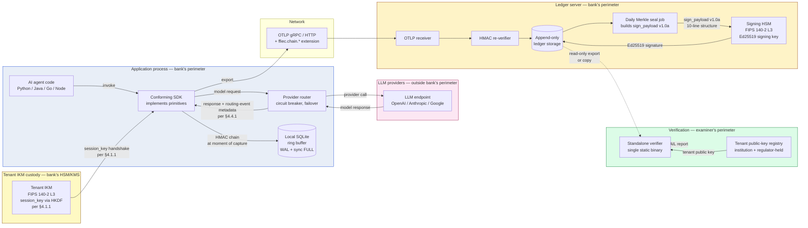

# 00 — System overview

> **What this doc is.** The big-picture design of the chain-of-custody system. Names the components, the data flow, the trust boundaries, and the deployment topologies. Subsequent docs zoom into individual components.

## 1. The problem

A regulated financial institution runs AI agents in production. Decisions made by those agents affect customers, money, and the institution's regulatory posture. The institution must produce evidence to its regulator (FFIEC member agency), to its external auditor (Big Four or specialty audit firm), and to its internal model-risk committee.

Today, captured AI events &mdash; prompts, tool calls, responses, decisions &mdash; live in mutable storage at a vendor. The institution cannot prove the captured data has not been altered. The vendor cannot prove it either, because their database engine permits UPDATE and DELETE. **There is no chain of custody.**

## 2. The four attack approaches the spec defends against

Before describing the solution shape, name the attacks. Every primitive in §3 onwards exists to close one of these four; an implementation that does not close all four is not conforming.

### 2.1 Host-side chain tampering

| Aspect | Detail |
|---|---|
| Adversary capability | Read and write access to the SDK's local audit storage, the OTLP bytes in flight between SDK and ledger, or the application process at runtime. Does NOT have the tenant master IKM, which lives in the bank's tenant-controlled key custody (HSM/KMS), never on the application host. |
| Adversary goal | Modify, insert, delete, reorder, or replay captured events without the verifier detecting it. |
| Where the attack lives | Client-side &mdash; SDK, application host, network in flight to the ledger. |
| Primitive that defends | HMAC chain at capture (§4.1). |

**Why it works.** Each event's `payload_hash` is HMAC-SHA-256 keyed by an HKDF-derived per-tenant session key, computed inside the application process before the event leaves the host, persisted byte-for-byte. An attacker who can read past entries does not learn the key (HMAC is key-recovery-resistant), so they cannot produce valid MACs for forged or modified events. Tampering shows up as a MAC mismatch the next time the verifier walks the chain.

### 2.2 Cross-tenant or cross-version key confusion

| Aspect | Detail |
|---|---|
| Adversary capability | No active adversary required. The threat is operational misconfiguration &mdash; operator typo at KMS provisioning, restored backup pointed at the wrong tenant row, botched rotation that re-uses `key_version=1` for a different IKM, or vendor-side cross-tenant key swap. |
| Adversary goal | None directly. The danger is that a wrong-key configuration silently produces valid-looking MACs in the wrong tenant's chain, leaving cross-contamination invisible to both writer and verifier. |
| Where the attack lives | Anywhere a key is looked up &mdash; provisioning, rotation, restore from backup, multi-tenant verifier flow. |
| Primitive that defends | Per-tenant HKDF binding + per-entry `key_fingerprint` (§4.1). |

**Why it works.** The HKDF `info` parameter binds `tenant_id` into the session-key derivation: `info = info_base || "|" || utf8(tenant_id)`. Two tenants whose IKMs are ever swapped derive verifiably different session keys instead of colliding silently. Every chain entry also carries `key_fingerprint = SHA-256(utf8(tenant_id) || ikm)[:16]`, and the verifier asserts the looked-up IKM produces this fingerprint **before** computing any MAC. A wrong-key lookup is rejected at the fingerprint check with a clear "wrong key" message, not buried in a MAC-mismatch storm.

### 2.3 Server-side or privileged-insider history rewrite

| Aspect | Detail |
|---|---|
| Adversary capability | Code execution on the ledger server, OR privileged-insider access &mdash; DBA, vendor operator, or institution operator with KMS Decrypt rights to the IKM. **Has the key.** Can rewrite events in append-only storage and recompute valid HMAC chains over the rewritten history. |
| Adversary goal | Retroactively alter, insert, or delete past events in a way that still produces a verifying HMAC chain end-to-end. |
| Where the attack lives | Server-side &mdash; the ledger server, its backing database, or its operational tooling. The Python SDK does not produce this seal; the ledger does, after ingest, before the day closes. |
| Primitive that defends | Daily Merkle seal (§4.2) signed by HSM-held key (§4.3). Server-side primitive, distinct from the per-event HMAC the SDK produces. |

**Why it works.** At the close of each tenant-day, the ledger server constructs an RFC 6962 Merkle root over every event's `payload_hash` (ordered `(run_id, seq)` ASC) and submits it to the HSM for Ed25519 signing. The HSM holds the signing key under FIPS 140-2 Level 3 protection, with `sign`-only authority granted to the seal-job operator role; the private key cannot be extracted. The signed root is appended to the ledger and the corresponding public key is held by the institution AND the regulator out of band. An adversary with full server access AND full IKM access still cannot forge the day's signed root &mdash; extracting the HSM signing key requires physical compromise of FIPS-validated hardware, which the device is designed to make detectable and operationally impractical. Past-event modification is detectable because the day's signed root no longer matches the Merkle root over the rewritten events.

This is the load-bearing distinction between the per-event HMAC seal and the daily HSM Merkle rollup: **HMAC defends against attackers without the key; Merkle+HSM defends against attackers with the key.** The two compose. Neither alone is sufficient against the full adversary set.

### 2.4 Examination-time tooling subversion

| Aspect | Detail |
|---|---|
| Adversary capability | Influence over the verifier the examiner runs &mdash; a malicious binary substituted into the supply chain, a compromised cosign signing path, a falsified public-key registry, or a network attacker attempting to steer the verifier toward a forged ledger or a malicious public key at examination time. |
| Adversary goal | Cause the verifier to return "PASS" on a tampered chain. |
| Where the attack lives | Examiner's perimeter &mdash; the verifier binary, its supply chain, the public-key registry it consults, the examiner laptop. |
| Primitive that defends | Verifier supply-chain discipline (detailed in `07-verifier-design.md` §8). The load-bearing properties — no network calls in the verification path, deterministic build, twice-signed release artifacts (cosign primary, GPG-signed SHA-256 manifest fallback), regulator-held public-key fingerprint — are observable from the shipped artifacts; the spec text leans on the design doc for the operational discipline rather than restating it. |

**Why it works.** The verifier makes no network calls &mdash; enforced by a build constraint that bans the network stack from the verification path. The binary is statically linked, deterministic-built, and signed twice (cosign primary, GPG-signed SHA-256 manifest fallback). Examiners run a binary-validation step (`bundleverify` or equivalent shell wrapper) before every verification, which validates both signatures plus the binary's SHA-256 against the manifest. The tenant public key is registered with the regulator at tenant onboarding; the verifier validates the registry-published key against the regulator-held fingerprint. Three independent compromises (cosign, GPG manifest, regulator-held fingerprint) would have to align for the verifier to silently pass forged data.

### 2.5 What is NOT in the four

For honesty:

- **Application-host compromise that exfiltrates the IKM.** Once the IKM is in an attacker's hands, this collapses to attack 2.3 (server-side); the §4.1 host-side memory-protection requirements (mlock, hardware-backed key handles) bound but do not eliminate the risk.
- **Examiner-laptop compromise.** A compromised laptop can produce a false report. Mitigation is examiner laptop hygiene (separation of duties, dedicated audit machines), not the verifier itself.
- **Cryptographic primitive break.** A practical attack on HMAC-SHA-256, SHA-256, or Ed25519 collapses the spec. The §4.3.2 algorithm-rotation commitment is the operational response.
- **Detection of incorrect AI decisions.** The chain captures evidence; whether the AI's decisions are correct is SR 11-7 model validation, a separate workflow.

These are residual risks the threat model in `09-threat-model.md` accepts and documents.

---

## 3. The solution shape

A four-primitive system that produces a verifiable chain of custody:



The diagram shows the five trust zones the v1.0a chain spans. The application process holds only short-lived session keys (derived per §4.1.1 from the tenant IKM in bank-side custody — a separate trust zone the application never sees in cleartext). The LLM provider is outside the bank's perimeter; the bank captures what was requested and what was returned but does NOT trust the provider for integrity. The ledger receives chained events over OTLP; its receiver re-verifies HMAC chains on ingest and writes append-only. At seal time, the ledger builds the v1.0a `sign_payload` (10 lines binding `sign_payload_version`, algorithm, format_version, tenant_id, seal_date, Merkle root, HKDF inputs digest, cadence, and `dev_mode`) and submits it to the signing HSM; the HSM returns the Ed25519 signature, which is appended to the seal record. The examiner's verifier reads the ledger as untrusted input, fetches the tenant public key from a registry held by the institution and the regulator (out-of-band), and produces a PASS/FAIL report. The HSM is the integrity anchor: extracting the signing key requires physical compromise of FIPS 140-2 Level 3 hardware; without it, no actor — bank or vendor — can forge a seal that covers a history they have rewritten.

## 4. Trust boundaries

Three distinct trust zones:

- **Application process** — Where the AI agent runs. Trusted only with a session key that is short-lived and process-scoped. A compromised application process can corrupt data going forward but cannot retroactively forge sealed history.
- **Ledger server** — The bank's own ingest server. Trusted to durably append events and to invoke the HSM signing step. A compromised ledger server cannot forge the daily root because the HSM holds the signing key.
- **Verifier** — Operated by the examiner or external auditor, *outside* the bank's trust zone. The verifier reads the ledger as untrusted input and produces a report it stands behind on its own.

The boundaries are designed so that **no single party can both alter history and forge the seal that covers the alteration**. The HSM is the integrity anchor.

## 5. Data flow, in 8 steps

1. The agent code calls into the SDK (decorator, span, audit-event API).
2. The SDK constructs the `payload_hash` using the per-process session key and the previous event's hash for the run.
3. The SDK writes the event to a local SQLite ring buffer (with `synchronous=FULL` for audit events, `NORMAL` for telemetry).
4. The SDK exports the event over OTLP to the ledger server, asynchronously.
5. The ledger server's OTLP receiver re-verifies the HMAC chain on ingest. Failed verifications are recorded as alerts but do not corrupt the ledger.
6. The ledger writes the event to append-only storage indexed by `(tenant_id, run_id, seq)`.
7. At UTC midnight + delay, the daily Merkle seal job runs. It reads every event for the prior day, builds the Merkle tree, computes the root, and submits it to the HSM for signing.
8. The signed root is appended to the ledger and made available for verification.

## 6. Deployment topologies

### 6.1 Self-hosted

```
Bank's data center / VPC:
  - SDK runs in agent processes
  - Ledger server runs as a service
  - HSM is bank-operated (AWS CloudHSM, on-prem HSM appliance, Azure Managed HSM, or Azure Dedicated HSM; spec §10.5 names the precise conformant tiers)

Examiner takes:
  - Ledger snapshot
  - Tenant public key
  - Verifier binary
  → produces report offline
```

### 6.2 Bring-your-own-cloud (BYOC)

```
Bank's cloud account:
  - SDK runs in agent processes
  - Ledger server runs in bank's account
  - Cloud HSM (AWS CloudHSM Classic or v2, Azure Managed HSM, Azure Dedicated HSM, or Google Cloud HSM; AWS KMS without CloudHSM and Azure Key Vault Standard are NOT conformant per spec §10.5)

Vendor provides:
  - Ledger server image
  - HSM integration
  - Operations support

Examiner takes the same artifacts as §6.1.
```

### 6.3 Vendor-hosted (managed cloud)

```
Vendor's cloud:
  - SDK runs in bank's environment
  - Ledger server is multi-tenant in vendor's cloud
  - HSM is vendor-operated, with per-tenant key separation

Bank's compliance posture:
  - HSM root signing requires per-tenant key custody documented
  - Bank holds the public key half on file with regulator

Examiner takes the same artifacts as §6.1.
```

The verifier is identical in all three topologies. The trust boundary moves; the verification process does not.

### 6.4 Multi-region resilience (normative)

A single tenant operates across multiple geographic regions for resilience. The chain composes with multi-region deployment via two conformant patterns. The institution selects the pattern that fits its resilience program and documents the choice in CC8.1.

**Pattern A — Active-active with seal-region pinning (RECOMMENDED).** A single canonical `tenant_id` operates in multiple regions. Each region has its own ledger that ingests events from SDKs in that region. One region is the **seal region** for the tenant; other regions are **replication regions**.

```
                Tenant: tenant_acme_prod   (single tenant_id)

  Region A (replication)              Region B (replication)
  +-----------------+                 +-----------------+
  | SDK pool        |                 | SDK pool        |
  | Local ledger    |                 | Local ledger    |
  +--------+--------+                 +--------+--------+
           |                                   |
           |  cross-region replication         |
           |  (institution-defined,            |
           |   completes before seal-time)     |
           v                                   v
                  Region C  (seal region)
              +-------------------------+
              | Aggregate ledger        |
              |  - events from A        |
              |  - events from B        |
              |  - events from C        |
              | Daily Merkle seal       |
              | HSM signature           |
              +-------------------------+
```

Per-event integrity is region-agnostic. The same `tenant_id` derives the same `session_key` from the same IKM in any region, so per-event MACs are byte-identical for byte-identical inputs regardless of capture region. The seal region aggregates events from all regions for the tenant-day, computes the Merkle root over all events in `(run_id, seq)` ordering, and produces the HSM-signed seal.

**Day-boundary partitioning under Pattern A.** The `received_at` discriminator (spec §4.2.2) is the seal region's `received_at`. An event captured in a replication region at 23:59:50 UTC but received at the seal region at 00:00:30 UTC the next day belongs to the next day's seal. This is consistent with the single-region day-boundary semantics — the seal region's ingest clock partitions the day for every event, regardless of where the event was captured.

**Run-locality (normative for v1.0).** Runs are region-local in v1.0. A run starts and ends in one region; the SDK MUST NOT compute a chain entry whose `prev_hash` references an event captured in a different region. Cross-region run continuation (an agent migrating mid-run between regions) is a v1.x roadmap commitment the working group expects to deliver alongside the post-quantum signature work; the v1.0 simplification keeps the chain construction deterministic across replication topologies without forcing every institution to wait on cross-region continuation. An institution operating a workload that requires cross-region run continuation today routes the workload to a single region or operates under Pattern B.

**Replication-loss detection (normative).** Pattern A deployments MUST operate per-region event-count reconciliation: each region reports event count per tenant-day; the seal region's count MUST equal the sum of regional counts. A mismatch is a control failure (replication did not deliver all events to the seal region), separate from chain integrity. The seal still accurately seals what's in the seal region's ledger; the missing events are a regional ingest issue. The `master.cross_region_replication_completed` operational event records per-region replication evidence (per-region count, replication-completion timestamp, the seal region the replication targets).

**Seal-region failover (normative).** The institution's CC8.1 names the seal-region failover procedure. If the seal region becomes unavailable before seal-time, the institution promotes a replication region to seal-region status. The promoted region MUST have all events for the tenant-day before producing the seal. The institution's tenant key registry resolves the public key per signing entity; multiple HSM endpoints under the same `tenant_id` are conformant when each is named in the registry. The signed seal record names the signing entity through `public_key_id`; an examiner verifying across a failover-day looks up the per-day signing entity in the registry.

**Pattern B — Per-region tenant_id (CONFORMANT alternative).** An institution that prefers per-region cryptographic isolation operates per-region tenant identifiers (`tenant_acme_prod_us_east_1`, `tenant_acme_prod_us_west_2`, `tenant_acme_prod_eu_west_1`). Each regional tenant has its own IKM, its own seals, its own verifier runs. Cross-region correlation is institution-side — the institution maintains a registry mapping the regional tenants to one logical "Acme prod" deployment, consulted for human disambiguation during examiner inquiries or customer disputes.

Pattern B is heavier than Pattern A: the verifier runs O(regions) times per audit period, and cross-region comparison is institution-correlated rather than seal-aggregated. It is appropriate when:

- The institution's regional regulatory regime mandates in-region key custody (some EU banking jurisdictions; APAC data-sovereignty regimes).
- The institution's risk posture treats cross-region replication as an unacceptable trust boundary (the seal region's compromise would corrupt the seal even though events were captured securely elsewhere).
- The institution operates regional ledgers under different vendor contracts and per-region IKM custody is part of the contractual posture.

**Pattern selection.** The two patterns are mutually exclusive per tenant — an institution operating Pattern A for one tenant MAY operate Pattern B for another. A given tenant operates under one pattern only; switching patterns is a chain-discontinuity event analogous to a posture change per spec §4.1.2 and is governed by the institution's documented change-management procedure.

### 6.5 Per-tier proportionality

The same primitives apply at any volume. The cost differentiator is HSM operating cost. Three deployment shapes are defensible at different bank sizes:

- **Community bank, low-volume.** Shared cloud HSM; daily seal cadence may be relaxed to weekly with examiner approval. Software-key fallback is acceptable for non-production only.
- **Mid-size bank.** Dedicated cloud HSM (single region for v1.0); daily seal cadence at the spec default.
- **Tier-1 bank.** Multi-region per §6.4 (Pattern A active-active with seal-region pinning, or Pattern B per-region tenant_id) with HSM cluster per region or cross-region HSM cluster; daily seal cadence at the default; consider tenant-day partitioning by business line if event volume warrants.

The all-in cost picture (annual HSM fees, ledger compute, retention storage) is documented separately in `docs/cost-model.md`.

## 7. Key design decisions

| Decision | Choice | Why |
|---|---|---|
| Cryptographic algorithms | HMAC-SHA-256, SHA-256, Ed25519 | All FIPS-approved. Stdlib in Go. Auditor recognizes immediately. |
| Canonical form | RFC 8785 JCS over JSON | Deterministic. Implementable in every language. Avoids protobuf non-determinism issues. |
| Wire format | OTLP with attribute extension | OTel ecosystem alignment. Banks already standardize on OTel. |
| Tree construction | RFC 6962 binary Merkle | Battle-tested in Certificate Transparency. Auditors trust the precedent. |
| Daily aggregation | UTC tenant-day | Consistent across regions. Aligns with retention period definitions. |
| Append-only storage | Application-level enforcement plus storage choice | The application invariant is the design property; storage choice is implementation flexibility. |
| Reference language | Go | Single static binary for verifier. Stdlib crypto. Cross-platform. Bank IT comfort. |

Each choice is defended in detail in subsequent docs.

## 8. What this design does not do

- **Detect AI errors.** The chain captures evidence of decisions; whether the decisions are correct is out of scope. SR 11-7 model validation is a separate workflow.
- **Prevent prompt injection.** The chain records prompt-injection attempts after the fact. Runtime detection is a separate product (Lakera, Galileo Agent Control, etc.).
- **Replace SIEM/SOC.** The chain is the source data. Alerting and correlation happen downstream.
- **Define AI behavior policy.** The chain is integrity-focused; behavior policy is governance-focused.

## 9. Auditor's-lens review

| Auditor question | Design answer |
|---|---|
| Can the institution alter history without detection? | No. The HMAC chain catches in-flight tampering at re-verification on ingest. The daily Merkle seal under HSM signature catches retroactive tampering. |
| Can the vendor alter history without detection? | No. Same answer &mdash; the HSM is bank-operated (or per-tenant-segregated when vendor-operated), and the public key is held by the institution and the regulator. |
| Can the examiner verify independently? | Yes. The verifier is a single static binary with no network calls. It reads the ledger and the public key only. |
| What happens if the HSM is unavailable? | The daily seal is delayed. Captured events continue to chain (the per-event HMAC is independent of the HSM). The institution must document the seal delay and re-attempt. |
| What happens if the application process is compromised? | The compromise corrupts events going forward (the attacker can alter what gets captured). It cannot forge events into the past, because past events have already been chained and exported. The compromise window is bounded by the time between compromise and detection. |
| What about multi-region deployment? | Two conformant patterns at v1.0 per §6.4 and spec §10.15. Pattern A — active-active with seal-region pinning — operates one canonical `tenant_id` across regions, replicates events to a designated seal region, produces one HSM-signed Merkle root per tenant-day. Pattern B — per-region `tenant_id` — operates one tenant per region with its own IKM, seals, and verifier runs. Replication-loss is detected by per-region event-count reconciliation. Run-locality (a run starts and ends in one region) is normative for v1.0; cross-region run continuation is a v1.x roadmap commitment. |
| What about smaller institutions for which HSM cost is meaningful? | Configurable seal cadence (weekly is defensible with examiner approval) and shared-cloud-HSM deployment shapes scale the spec down. See §6.5 and `docs/cost-model.md`. |
| How is the master HMAC key custody bounded? | The IKM lives in tenant-controlled HSM/KMS custody and never reaches the application host as plaintext (spec §4.1.1 names two delivery models — IKM-delivered to the host under tight handling, and session-key-delivered with HKDF inside the device). Spec §10.6 sets the 32-byte minimum (RFC 4868), §10.7 bans the software-key adapter from production builds (compile-time exclusion plus packaging exclusion), and §10.9 names retention so a `key_version` retired before its last chain entry is itself a control failure. |

## 10. Next steps

The spec is locked at v1.0-final-amendment (canonical wire form `v1.0a`). The conformance corpus ships at `spec/test-vectors/` with positive vectors 001, 002, 003, 008, 010, 015, and 016 alongside negative vectors N001 through N023. The reference implementation is published. The remaining work is in three buckets:

- **FFIEC submission preparation.** Package the spec, the conformance corpus, the reference implementation, and the regulator pack for working-group review. Track outside-reviewer feedback drops in `docs/feedback/`; close-outs land as cumulative change-log rows.
- **Post-amendment monitoring.** Watch for follow-on reviewer drops and operational findings from early-adopter institutions. Cumulative findings either land as v1.x errata (clarifications that do not change byte-form) or as v1.x amendments (a new `sign_payload_version` discriminator value such as `"v1.0b"` so verifiers detect the form-generation without breaking older chains).
- **v1.x roadmap items.** Three deferrals are forward commitments the working group expects to deliver on a multi-year track: (i) post-quantum signatures (Dilithium per FIPS 204, SLH-DSA per FIPS 205) once HSM products mature and NIST publishes the deprecation trigger; (ii) cross-region run continuation, which lifts the v1.0 run-locality simplification once the spec text and reference implementation can carry the determinism guarantee across regions; (iii) hardware-attested edge-device key custody, which subsumes the v1.0 Pattern B compensating-control set in `edge-and-federated-ai.md`. None of these block v1.0 conformance; institutions that need any of them today operate under the v1.0 compensating-control posture and plan the v1.x migration.
