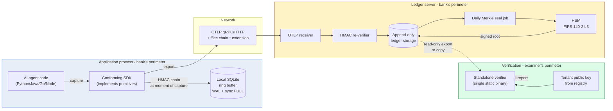

# 00 — System overview

> **What this doc is.** The big-picture design of the chain-of-custody system. Names the components, the data flow, the trust boundaries, and the deployment topologies. Subsequent docs zoom into individual components.

## 1. The problem

A regulated financial institution runs AI agents in production. Decisions made by those agents affect customers, money, and the institution's regulatory posture. The institution must produce evidence to its regulator (FFIEC member agency), to its external auditor (Big Four or specialty audit firm), and to its internal model-risk committee.

Today, captured AI events &mdash; prompts, tool calls, responses, decisions &mdash; live in mutable storage at a vendor. The institution cannot prove the captured data has not been altered. The vendor cannot prove it either, because their database engine permits UPDATE and DELETE. **There is no chain of custody.**

## 2. The solution shape

A four-primitive system that produces a verifiable chain of custody:



## 3. Trust boundaries

Three distinct trust zones:

- **Application process** — Where the AI agent runs. Trusted only with a session key that is short-lived and process-scoped. A compromised application process can corrupt data going forward but cannot retroactively forge sealed history.
- **Ledger server** — The bank's own ingest server. Trusted to durably append events and to invoke the HSM signing step. A compromised ledger server cannot forge the daily root because the HSM holds the signing key.
- **Verifier** — Operated by the examiner or external auditor, *outside* the bank's trust zone. The verifier reads the ledger as untrusted input and produces a report it stands behind on its own.

The boundaries are designed so that **no single party can both alter history and forge the seal that covers the alteration**. The HSM is the integrity anchor.

## 4. Data flow, in 8 steps

1. The agent code calls into the SDK (decorator, span, audit-event API).
2. The SDK constructs the `payload_hash` using the per-process session key and the previous event's hash for the run.
3. The SDK writes the event to a local SQLite ring buffer (with `synchronous=FULL` for audit events, `NORMAL` for telemetry).
4. The SDK exports the event over OTLP to the ledger server, asynchronously.
5. The ledger server's OTLP receiver re-verifies the HMAC chain on ingest. Failed verifications are recorded as alerts but do not corrupt the ledger.
6. The ledger writes the event to append-only storage indexed by `(tenant_id, run_id, seq)`.
7. At UTC midnight + delay, the daily Merkle seal job runs. It reads every event for the prior day, builds the Merkle tree, computes the root, and submits it to the HSM for signing.
8. The signed root is appended to the ledger and made available for verification.

## 5. Deployment topologies

### 5.1 Self-hosted

```
Bank's data center / VPC:
  - SDK runs in agent processes
  - Ledger server runs as a service
  - HSM is bank-operated (CloudHSM, on-prem HSM appliance, or Azure Key Vault HSM)

Examiner takes:
  - Ledger snapshot
  - Tenant public key
  - Verifier binary
  → produces report offline
```

### 5.2 Bring-your-own-cloud (BYOC)

```
Bank's cloud account:
  - SDK runs in agent processes
  - Ledger server runs in bank's account
  - Cloud HSM (AWS CloudHSM, Azure Key Vault HSM Premium)

Vendor provides:
  - Ledger server image
  - HSM integration
  - Operations support

Examiner takes the same artifacts as 5.1.
```

### 5.3 Vendor-hosted (managed cloud)

```
Vendor's cloud:
  - SDK runs in bank's environment
  - Ledger server is multi-tenant in vendor's cloud
  - HSM is vendor-operated, with per-tenant key separation

Bank's compliance posture:
  - HSM root signing requires per-tenant key custody documented
  - Bank holds the public key half on file with regulator

Examiner takes the same artifacts as 5.1.
```

The verifier is identical in all three topologies. The trust boundary moves; the verification process does not.

## 6. Key design decisions

| Decision | Choice | Why |
|---|---|---|
| Cryptographic algorithms | HMAC-SHA-256, SHA-256, Ed25519 | All FIPS-approved. Stdlib in Go. Auditor recognizes immediately. |
| Canonical form | RFC 8785 JCS over JSON | Deterministic. Implementable in every language. Avoids protobuf non-determinism issues. |
| Wire format | OTLP with attribute extension | OTel ecosystem alignment. Banks already standardize on OTel. |
| Tree construction | RFC 6962 binary Merkle | Battle-tested in Certificate Transparency. Auditors trust the precedent. |
| Daily aggregation | UTC tenant-day | Consistent across regions. Aligns with retention period definitions. |
| Append-only storage | Application-level enforcement plus storage choice | The application invariant is the design property; storage choice is implementation flexibility. |
| Reference language | Go | Single static binary for verifier. Stdlib crypto. Cross-platform. Bank IT comfort. |

Each choice is defended in detail in subsequent docs.

## 7. What this design does not do

- **Detect AI errors.** The chain captures evidence of decisions; whether the decisions are correct is out of scope. SR 11-7 model validation is a separate workflow.
- **Prevent prompt injection.** The chain records prompt-injection attempts after the fact. Runtime detection is a separate product (Lakera, Galileo Agent Control, etc.).
- **Replace SIEM/SOC.** The chain is the source data. Alerting and correlation happen downstream.
- **Define AI behavior policy.** The chain is integrity-focused; behavior policy is governance-focused.

## 8. Auditor's-lens review

| Auditor question | Design answer |
|---|---|
| Can the institution alter history without detection? | No. The HMAC chain catches in-flight tampering at re-verification on ingest. The daily Merkle seal under HSM signature catches retroactive tampering. |
| Can the vendor alter history without detection? | No. Same answer &mdash; the HSM is bank-operated (or per-tenant-segregated when vendor-operated), and the public key is held by the institution and the regulator. |
| Can the examiner verify independently? | Yes. The verifier is a single static binary with no network calls. It reads the ledger and the public key only. |
| What happens if the HSM is unavailable? | The daily seal is delayed. Captured events continue to chain (the per-event HMAC is independent of the HSM). The institution must document the seal delay and re-attempt. |
| What happens if the application process is compromised? | The compromise corrupts events going forward (the attacker can alter what gets captured). It cannot forge events into the past, because past events have already been chained and exported. The compromise window is bounded by the time between compromise and detection. |
| Open issue | Master-key escrow. The master HMAC key must live somewhere reachable when application processes start, but must not be accessible to a compromised process for retroactive use. The threat model in `09-threat-model.md` discusses options; v1.0-final must lock this down. |

## 9. Next steps

- Lock the spec at v1.0-draft and circulate for comment among the targeted FFIEC working group
- Implement `core/chain/`, `core/merkle/`, `core/hsm/`, `core/otlp/` to v1.0-draft
- Build out the conformance corpus
- Run a private dry-run with a Big Four advisor before the FFIEC presentation
