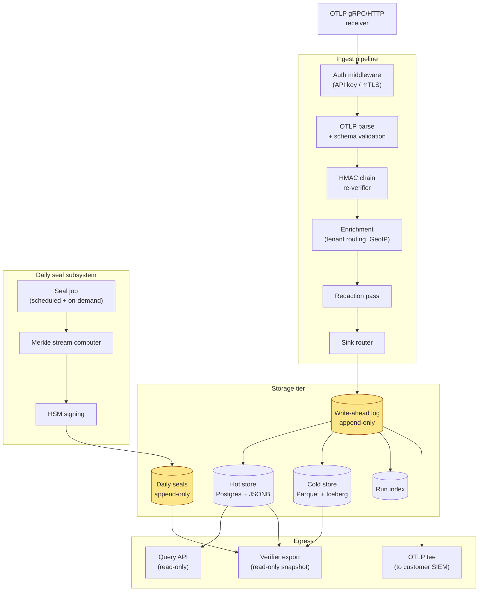

# 06 — Ledger server design

> **What this doc is.** The architecture of `ledger/`. The reference ingest server that receives OTLP, re-verifies the chain, writes append-only storage, computes the daily Merkle seal, and signs in HSM custody.

## 1. Component diagram



## 2. Process model

### 2.1 Single-binary, multi-component

The ledger is one Go binary that runs all subsystems. Components are goroutine-pools within the process:

- **Receiver pool** &mdash; OTLP gRPC and HTTP servers
- **Pipeline pool** &mdash; verification, enrichment, redaction
- **Writer pool** &mdash; append-only WAL writers
- **Seal pool** &mdash; daily seal job and HSM client
- **Query pool** &mdash; read-only API for verifier exports

Backpressure is per-pool: a slow downstream causes its pool to fill, which slows its upstream, which surfaces to the SDK as backpressure on OTLP.

### 2.2 Why one binary

Operational simplicity. A bank deploys one container; runs one set of health probes; configures one set of secrets. The internal pool isolation provides the isolation a microservice architecture would, without the operational overhead.

Vendors operating at very large scale may split the ledger into multiple deployments (e.g., separating the receiver from the writer for hot-path latency). The reference implementation keeps it single-binary; vendor distributions may diverge.

## 3. Storage tier

### 3.1 Write-ahead log

The WAL is the source of truth. Every accepted event lands in the WAL before any other storage operation. The WAL is append-only at the application level (no UPDATE/DELETE statements appear in the codebase) and append-only at the storage level (where the underlying storage supports it &mdash; PostgreSQL with `WAL` mode, S3 versioned bucket, or a flat-file ring).

WAL retention is unlimited within the institution&rsquo;s configured retention period. The WAL is the artifact the verifier reads.

### 3.2 Hot store (Postgres + JSONB)

For online query: per-run lookups, recent-events scans, dashboard queries. Schema:

```sql
CREATE TABLE events (
  id BIGSERIAL PRIMARY KEY,
  tenant_id TEXT NOT NULL,
  run_id TEXT NOT NULL,
  seq BIGINT NOT NULL,
  captured_at TIMESTAMPTZ NOT NULL,
  kind TEXT NOT NULL,            -- 'telemetry' | 'audit'
  payload JSONB NOT NULL,         -- the canonical event payload
  prev_hash BYTEA NOT NULL,
  payload_hash BYTEA NOT NULL,
  session_key_id TEXT NOT NULL,
  UNIQUE (tenant_id, run_id, seq)
);

CREATE INDEX events_tenant_day_idx
  ON events (tenant_id, (captured_at AT TIME ZONE 'UTC')::date, run_id, seq);

CREATE INDEX events_payload_gin
  ON events USING gin (payload jsonb_path_ops);
```

The hot store is **derived** from the WAL. Re-deriving from the WAL produces an identical hot store byte-for-byte (within Postgres tuple ordering). This property matters for recovery.

### 3.3 Cold store (Parquet + Iceberg)

For long retention: 7-year audit holds, regulatory retention beyond hot-store TTL. Daily partitions written from the WAL. Parquet for analytics; Iceberg for snapshot management.

### 3.4 Daily seals

A separate small table:

```sql
CREATE TABLE daily_seals (
  tenant_id TEXT NOT NULL,
  seal_date DATE NOT NULL,           -- UTC
  spec_version TEXT NOT NULL,        -- 'v1.0'
  merkle_root BYTEA NOT NULL,        -- 32 bytes
  algorithm TEXT NOT NULL,           -- 'ed25519'
  public_key_id TEXT NOT NULL,       -- which tenant key version
  signature BYTEA NOT NULL,          -- 64 bytes
  signed_at TIMESTAMPTZ NOT NULL,
  late_binding_count BIGINT NOT NULL,
  PRIMARY KEY (tenant_id, seal_date, spec_version)
);
```

Append-only; UPDATE on this table is a defect.

## 4. Hot path (per-event ingest)

Wall-clock budget: <2 ms p99 from OTLP receipt to WAL fsync ack.

```
1. Receive OTLP request
2. Authenticate (API key check or mTLS cert)
3. Parse OTLP envelope, extract spans
4. For each span with ffiec.chain.* attributes:
   a. Re-derive session_key from session_key_id (lookup in tenant key cache)
   b. Recompute payload_hash from prev_hash + canonical payload
   c. Compare to event's payload_hash
   d. If mismatch: record ChainVerificationFailure event, do NOT commit
5. Append to WAL (single transaction per OTLP request)
6. Acknowledge OTLP request
7. Async: derive hot store + cold store + index
```

Step 4 is the one that catches in-flight tampering. A failure does not corrupt the ledger &mdash; it is recorded as an integrity alert and routed to the SIEM.

## 5. Daily seal subsystem

Detail in [`03-merkle-seal.md`](03-merkle-seal.md). The subsystem is a separate goroutine pool; it does not share state with the hot path.

Triggers:

- **Scheduled.** Cron-style trigger at UTC 00:00 + delay (default 60 minutes) per tenant.
- **On-demand.** Operator command (CLI or admin API) for incident response.
- **Crash recovery.** On startup, the subsystem checks for any tenant-day pair that should have been sealed but wasn&rsquo;t. Missing seals are recomputed.

The subsystem holds a per-tenant-per-day advisory lock to prevent concurrent seal computation.

## 6. Configuration

The ledger reads its configuration from a YAML file at startup. Reference configuration:

```yaml
listen:
  otlp_grpc: ":4317"
  otlp_http: ":4318"
  admin: ":4319"            # Health, metrics, profiling
  query: ":4320"            # Read-only query API

tls:
  cert: /etc/ledger/tls/server.crt
  key:  /etc/ledger/tls/server.key
  client_ca: /etc/ledger/tls/clients.ca

storage:
  wal:
    backend: postgres
    dsn: postgres://ledger@.../ledger?sslmode=require
  hot:
    backend: postgres
    dsn: postgres://ledger@.../ledger?sslmode=require
  cold:
    backend: s3
    bucket: bank-ledger-cold
    prefix: tenants/

hsm:
  module: /usr/lib/pkcs11/libCryptoki2_64.so   # PKCS#11 path
  slot: 0
  pin_env: HSM_PIN                             # PIN read from environment

tenants:
  - id: tenant_acme_prod
    master_key_label: tenant-acme-master       # HSM label for HMAC master
    seal_key_label: tenant-acme-seal           # HSM label for Ed25519 seal key
    seal_delay_minutes: 60
    public_key_path: /etc/ledger/tenants/acme.pub
```

No defaults for credentials. No defaults for HSM PIN. No baked-in keys.

## 7. Operational concerns

### 7.1 Health and readiness

Standard Kubernetes-style probes on `:4319`:

- `/healthz` &mdash; process is up
- `/readyz` &mdash; all subsystems initialized, HSM session established, storage connections healthy
- `/metrics` &mdash; Prometheus scrape endpoint

### 7.2 Metrics

- `ledger_otlp_received_total{tenant, status}` &mdash; events received
- `ledger_chain_verifications_total{tenant, result}` &mdash; integrity check outcomes
- `ledger_seal_runs_total{tenant, status}` &mdash; daily seal job outcomes
- `ledger_seal_age_seconds{tenant}` &mdash; how long since the last seal
- `ledger_hsm_operations_total{op, status}` &mdash; HSM call outcomes

### 7.3 Logs

Structured JSON logs to stdout. Every log line includes `tenant_id`, `run_id`, and a correlation ID. Failed integrity checks log at WARN with the full event context for post-incident review.

### 7.4 Backups

The WAL is the integrity-bearing artifact. Backups are continuous (PostgreSQL streaming replication or S3 versioned bucket replication). The institution is responsible for backup integrity within its own framework; the ledger contributes by being deterministic-derivable from the WAL.

## 8. What the ledger does not do

- **Detect prompt injection or harmful AI output.** Captures the evidence; downstream tools detect.
- **Enforce policy.** A separate guardrails system can prevent agent actions; the ledger only records.
- **Authorize end-user access to bank systems.** The ledger is an audit substrate; access control is the institution's IAM.
- **Provide a UI.** Read-only query API only. UIs are a separate product (vendor-distributed).

## 9. Auditor's-lens review

| Question | Answer |
|---|---|
| Can the ledger silently drop events? | No. Backpressure is explicit: when downstream is slow, the OTLP receiver returns a retryable error. The SDK retries. The drop only happens after the SDK&rsquo;s local buffer fills (configurable cap), and that drop is recorded by the SDK. |
| Can a malicious operator bypass chain verification? | Only by modifying the ledger code. The verification step is a hard precondition to writing the WAL; it is not a configuration toggle. The reference implementation has a unit test that verifies the verification step cannot be skipped. |
| What if the WAL writer fails partway? | Standard transactional storage semantics: the WAL transaction either commits in full or rolls back. The OTLP request returns an error and the SDK retries. |
| How is the daily seal protected from the operator? | The HSM holds the signing key. The operator has access to the seal job's authentication credentials (which can be rotated independently of the HSM key) but cannot extract the key. |
| What if Postgres is compromised? | The hot store is derived data. The WAL is the source of truth. If Postgres is corrupted or attacked, the institution rebuilds the hot store from the WAL. The integrity of the WAL is the property the verifier checks; downstream stores are derived. |
| Open issue | Multi-region deployment. The current design is single-region per tenant. v1.1 may add cross-region replication semantics with explicit ordering guarantees. |
