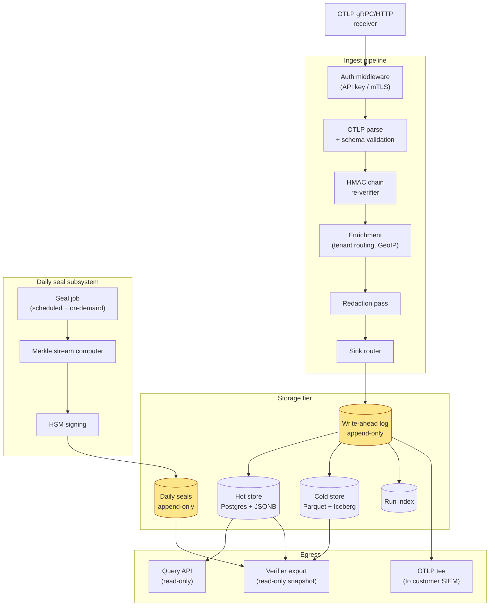

# 06 — Ledger server design

> **What this doc is.** The architecture of `ledger/`. The reference ingest server that receives OTLP, re-verifies the chain, writes append-only storage, computes the daily Merkle seal, and signs in HSM custody.

## 1. Component diagram



## 2. Process model

### 2.1 Single-binary, multi-component

The ledger is one Go binary that runs all subsystems. Components are goroutine-pools within the process:

- **Receiver pool** &mdash; OTLP gRPC and HTTP servers
- **Pipeline pool** &mdash; verification, enrichment, redaction
- **Writer pool** &mdash; append-only WAL writers
- **Seal pool** &mdash; daily seal job and HSM client
- **Query pool** &mdash; read-only API for verifier exports

Backpressure is per-pool: a slow downstream causes its pool to fill, which slows its upstream, which surfaces to the SDK as backpressure on OTLP.

### 2.2 Why one binary

Operational simplicity. A bank deploys one container; runs one set of health probes; configures one set of secrets. The internal pool isolation provides the isolation a microservice architecture would, without the operational overhead.

Vendors operating at very large scale may split the ledger into multiple deployments (e.g., separating the receiver from the writer for hot-path latency). The reference implementation keeps it single-binary; vendor distributions may diverge.

## 3. Storage tier

### 3.1 Write-ahead log

The WAL is the source of truth. Every accepted event lands in the WAL before any other storage operation. The WAL is append-only at the application level (no UPDATE/DELETE statements appear in the codebase) and append-only at the storage level (where the underlying storage supports it &mdash; PostgreSQL with `WAL` mode, S3 versioned bucket, or a flat-file ring).

WAL retention is unlimited within the institution&rsquo;s configured retention period. The WAL is the artifact the verifier reads.

### 3.2 Hot store (Postgres + JSONB)

For online query: per-run lookups, recent-events scans, dashboard queries. Schema:

```sql
CREATE TABLE events (
  id BIGSERIAL PRIMARY KEY,
  tenant_id TEXT NOT NULL,
  run_id TEXT NOT NULL,
  seq BIGINT NOT NULL,
  captured_at TIMESTAMPTZ NOT NULL,
  received_at TIMESTAMPTZ NOT NULL,
  kind TEXT NOT NULL,            -- 'telemetry' | 'audit'
  payload JSONB NOT NULL,         -- the canonical event payload (chain-stamp fields excluded)
  prev_hash BYTEA NOT NULL,       -- 32 raw bytes; per spec §4.1
  payload_hash BYTEA NOT NULL,    -- 32 raw bytes; the HMAC, persisted byte-for-byte
  key_version BIGINT NOT NULL,    -- IKM generation; spec §4.1 per-entry stamp
  key_fingerprint BYTEA NOT NULL, -- 16 raw bytes; spec §4.1 per-entry stamp
  format_version TEXT NOT NULL,   -- "v1" for this spec
  mac_computed_at_utc TIMESTAMPTZ NOT NULL,  -- forensic; not security-trusted
  kms_handle_uri TEXT NOT NULL,   -- provenance pointer; "plaintext-dev" only in dev
  algorithm TEXT NOT NULL DEFAULT 'HMAC-SHA-256',
  parent_run_id TEXT,             -- multi-process linkage (optional)
  parent_seq BIGINT,              -- required when parent_run_id present
  dag_parents TEXT,               -- DAG linkage (optional; mutually exclusive with parent_run_id)
  UNIQUE (tenant_id, run_id, seq),
  CHECK (length(prev_hash) = 32),
  CHECK (length(payload_hash) = 32),
  CHECK (length(key_fingerprint) = 16),
  CHECK (key_version >= 1),
  CHECK (NOT (parent_run_id IS NOT NULL AND dag_parents IS NOT NULL))
);

CREATE INDEX events_tenant_day_idx
  ON events (tenant_id, (received_at AT TIME ZONE 'UTC')::date, run_id, seq);

CREATE INDEX events_payload_gin
  ON events USING gin (payload jsonb_path_ops);

CREATE INDEX events_fingerprint_idx
  ON events (tenant_id, key_version, key_fingerprint);  -- supports P-6 reconciliation queries
```

The hot store is **derived** from the WAL. Re-deriving from the WAL produces an identical hot store byte-for-byte (within Postgres tuple ordering). This property matters for recovery.

**The `key_fingerprint` column is the per-entry tenant↔IKM identity binding.** The `events_fingerprint_idx` supports the P-6 key-fingerprint reconciliation procedure: given a `(tenant_id, key_version)` pair, the SOC team queries for the distinct fingerprints observed and cross-checks against the institution's IKM roster. A row whose stored fingerprint does not match the IKM-roster's expected fingerprint for that `(tenant, key_version)` is a high-priority alert (spec §10.1).

### 3.3 Cold store (Parquet + Iceberg)

For long retention: 7-year audit holds, regulatory retention beyond hot-store TTL. Daily partitions written from the WAL. Parquet for analytics; Iceberg for snapshot management.

### 3.4 Daily seals

A separate small table; mirrors spec §4.2 seal record schema:

```sql
CREATE TABLE daily_seals (
  tenant_id TEXT NOT NULL,
  seal_date DATE NOT NULL,           -- UTC
  spec_version TEXT NOT NULL,        -- 'v1.0'
  format_version TEXT NOT NULL,      -- 'v1'
  merkle_root BYTEA NOT NULL,        -- 32 bytes
  algorithm TEXT NOT NULL,           -- 'ed25519'
  public_key_id TEXT NOT NULL,       -- resolves to tenant public key entry
  key_versions BIGINT[] NOT NULL,    -- list form; multi-element on rotation days
  hkdf_inputs_digest BYTEA NOT NULL, -- 32 bytes; for format-drift detection
  signature BYTEA NOT NULL,          -- 64 bytes; Ed25519 over sign_payload
  signed_at TIMESTAMPTZ NOT NULL,
  cadence TEXT NOT NULL,             -- 'hourly' | 'daily' | 'weekly'
  late_binding_count BIGINT NOT NULL,
  hsm_cluster_member TEXT,           -- which HSM signed; advisory
  dev_mode BOOLEAN NOT NULL DEFAULT false,  -- true ONLY for software-key dev seals
  PRIMARY KEY (tenant_id, seal_date, spec_version, format_version),
  CHECK (length(merkle_root) = 32),
  CHECK (length(signature) = 64),
  CHECK (length(hkdf_inputs_digest) = 32),
  CHECK (array_length(key_versions, 1) >= 1),
  CHECK (cadence IN ('hourly', 'daily', 'weekly'))
);
```

Append-only; UPDATE on this table is a defect.

**Field rationale (mirrors spec §4.2 + §4.3):**

- `format_version` — the chain-stamp format in force for this day's events. A single seal covers one `format_version`. Future-version verifiers dispatch on this field.
- `key_versions` — list form because a tenant-day that crosses a master-key rotation contains events under multiple IKM generations. `[v3, v4]` on a rotation day; `[v3]` otherwise. The verifier resolves the right IKM per chain entry via the entry's stamped `key_version`.
- `hkdf_inputs_digest` — `SHA-256(HKDF_SALT || HKDF_INFO_BASE || length_LE32)`. Same value for every v1 seal; recorded so a future-version verifier can detect format-drift independent of the chain entries' per-entry stamps.
- `dev_mode` — `true` ONLY when the seal was signed by a development software-key adapter (spec §10.7). The verifier under `--strict` refuses `dev_mode=true`. Production deployments stamp `false` always.

The `cadence` column records the institution's claimed cadence so the verifier confirms it matches the day-density observed.

### 3.5 Storage RBAC (defense-in-depth)

Append-only is enforced at the application level — the codebase contains no UPDATE or DELETE on the events or daily_seals tables. As defense-in-depth, the database role used by the ledger writer SHOULD be granted INSERT and SELECT only; UPDATE, DELETE, and TRUNCATE permissions SHOULD be revoked. Routine DBAs operate under a separate role with the same restriction. Schema migrations run under a privileged role exercised through change management.

This does not change the integrity property — the Merkle seal catches any deletion regardless of who did it — but it raises the operational floor and makes accidental destruction harder.

## 4. Hot path (per-event ingest)

Wall-clock budget: <2 ms p99 from OTLP receipt to WAL fsync ack.

```
1. Receive OTLP request
2. Authenticate (API key check or mTLS cert)
3. Parse OTLP envelope, extract spans
4. For each span with ffiec.chain.* attributes:
   a. Re-derive session_key from `(tenant_id, key_version)` lookup (HKDF over IKM with per-tenant info)
   b. Recompute payload_hash from prev_hash + canonical payload
   c. Compare to event's payload_hash
   d. If mismatch: record ChainVerificationFailure event, do NOT commit
5. Append to WAL (single transaction per OTLP request)
6. Acknowledge OTLP request
7. Async: derive hot store + cold store + index
```

Step 4 is the one that catches in-flight tampering. A failure does not corrupt the ledger &mdash; it is recorded as an integrity alert and routed to the SIEM.

## 5. Daily seal subsystem

Detail in [`03-merkle-seal.md`](03-merkle-seal.md). The subsystem is a separate goroutine pool; it does not share state with the hot path.

Triggers:

- **Scheduled.** Cron-style trigger at UTC 00:00 + delay (default 60 minutes) per tenant.
- **On-demand.** Operator command (CLI or admin API) for incident response.
- **Crash recovery.** On startup, the subsystem checks for any tenant-day pair that should have been sealed but wasn&rsquo;t. Missing seals are recomputed.

The subsystem holds a per-tenant-per-day advisory lock to prevent concurrent seal computation.

## 6. Configuration

The ledger reads its configuration from a YAML file at startup. Reference configuration:

```yaml
listen:
  otlp_grpc: ":4317"
  otlp_http: ":4318"
  admin: ":4319"            # Health, metrics, profiling
  query: ":4320"            # Read-only query API

tls:
  cert: /etc/ledger/tls/server.crt
  key:  /etc/ledger/tls/server.key
  client_ca: /etc/ledger/tls/clients.ca

storage:
  wal:
    backend: postgres
    dsn: postgres://ledger@.../ledger?sslmode=require
  hot:
    backend: postgres
    dsn: postgres://ledger@.../ledger?sslmode=require
  cold:
    backend: s3
    bucket: bank-ledger-cold
    prefix: tenants/

hsm:
  module: /usr/lib/pkcs11/libCryptoki2_64.so   # PKCS#11 path
  slot: 0
  pin_env: HSM_PIN                             # PIN read from environment

tenants:
  - id: tenant_acme_prod
    master_key_label: tenant-acme-master       # HSM label for HMAC master
    seal_key_label: tenant-acme-seal           # HSM label for Ed25519 seal key
    seal_delay_minutes: 60
    public_key_path: /etc/ledger/tenants/acme.pub
```

No defaults for credentials. No defaults for HSM PIN. No baked-in keys.

## 6.1 BYOC IAM and network boundary

In a Bring-Your-Own-Cloud topology the bank deploys the vendor's ledger image in the bank's cloud account. The vendor must not reach the bank's HSM or master key. The boundary is enforced through cloud IAM and network controls:

| Control | Boundary |
|---|---|
| The ledger image runs under a bank-controlled IAM role | The vendor cannot assume the role from the vendor's account |
| The HSM is in a bank-controlled VPC with private endpoints only | No vendor network path to the HSM |
| Secrets (HSM PIN, TLS keys) are in a bank-controlled secret store | The vendor does not have read access to the secret store |
| The ledger's egress is restricted to bank-approved destinations | The vendor cannot exfiltrate event data to a vendor-controlled endpoint |
| Logs and metrics flow to the bank's observability stack | The vendor sees only what the bank explicitly shares for support |

The vendor receives operational support access (read-only logs, error traces) through a bank-mediated path that the bank can audit and revoke. The vendor's image is delivered as a signed container; the bank verifies the signature before deployment.

A full IAM-permission matrix is documented in `docs/byoc-deployment.md`.

### 6.1.1 Image-pull egress and vendor support telemetry

Two flows cross the bank-vendor boundary in BYOC deployments:

**Image pull.** The vendor publishes signed images. The bank operates a bank-controlled mirror registry (Harbor, ECR, ACR, GAR). The mirror pulls from the vendor's registry through an explicit, audit-logged egress path; the mirror verifies cosign signatures before storing the image. The ledger workload pulls from the bank's mirror, never from the vendor's registry directly. This pattern lets the bank scan, sign, and approve images before deployment and prevents in-flight image substitution.

**Vendor support telemetry.** When the vendor needs operational telemetry to support the bank, the data flows through a bank-controlled router that:

1. Receives the ledger's operational logs and metrics
2. Applies a documented redaction policy (no event payload data; control-plane events only)
3. Forwards the redacted stream to the vendor over a bank-managed egress

The bank's privacy-impact-assessment for the support relationship documents the data flow. The bank can revoke the egress path unilaterally without coordinating with the vendor.

A worked example of both flows lives in `docs/byoc-deployment.md`.

## 7. Operational concerns

### 7.1 Health and readiness

Standard Kubernetes-style probes on `:4319`:

- `/healthz` &mdash; process is up
- `/readyz` &mdash; all subsystems initialized, HSM session established, storage connections healthy
- `/metrics` &mdash; Prometheus scrape endpoint

### 7.2 Metrics

- `ledger_otlp_received_total{tenant, status}` &mdash; events received
- `ledger_chain_verifications_total{tenant, result}` &mdash; integrity check outcomes
- `ledger_seal_runs_total{tenant, status}` &mdash; daily seal job outcomes
- `ledger_seal_age_seconds{tenant}` &mdash; how long since the last seal
- `ledger_hsm_operations_total{op, status}` &mdash; HSM call outcomes

### 7.3 Logs

Structured JSON logs to stdout. Every log line includes `tenant_id`, `run_id`, and a correlation ID. Failed integrity checks log at WARN with the full event context for post-incident review.

### 7.3.1 Operational events for control evidence

The implementation MUST log the following events at INFO or higher, with consistent field names so SOC and examination teams can map them to control-evidence requirements:

| Event | Fields | Purpose |
|---|---|---|
| `ledger.startup` | version, config_hash, hsm_cluster | Process started, config loaded |
| `ledger.hsm_session_opened` | hsm_cluster, key_label | HSM ready for signing |
| `seal.job_started` | tenant_id, seal_date | Seal job triggered |
| `seal.job_completed` | tenant_id, seal_date, event_count, merkle_root, signed_at | Seal recorded |
| `seal.job_failed` | tenant_id, seal_date, error, retry_count | Seal job failed |
| `chain.verification_failure` | tenant_id, run_id, seq, reason | In-flight chain mismatch detected |
| `hsm.operation_success` | op, key_label, latency_ms | HSM call succeeded |
| `hsm.operation_failure` | op, key_label, error | HSM call failed |
| `config.reload` | config_hash, source | Configuration reloaded |
| `master_key.rotated` | tenant_id, old_version, new_version, custodian | Master rotation event from the master-key custodian (HSM/KMS); ingested by the ledger via the custodian's audit feed |
| `master_key.rotation_observed` | tenant_id, old_key_version, new_key_version, first_seen_key_fingerprint | Ledger-emitted event when it first observes an event under a new key_version |
| `master.reconciliation_completed` | tenant_id, period, key_versions_observed, key_fingerprints_observed, fingerprint_unmatched_count | Weekly key-fingerprint reconciliation pass result per spec §10.1 |

Logs are append-only on the operational side: rotated to long-term archive on a schedule the institution sets. The rotation does not affect the chain — these logs are control-evidence artifacts, not chain-integrity artifacts.

**Retention.** Operational-event logs SHOULD be retained at least as long as the events table they relate to. If the institution retains chain events for 7 years for audit purposes, the operational events SHOULD also retain 7 years so the SOC and examination teams can correlate operational anomalies with the chain events of the same period. Implementations document operational-event retention in their control description.

**Schema standardization.** Operational events are emitted as structured JSON with the field names listed above. The full JSON schema is published as `docs/operational-events.schema.json`. Implementations MUST conform to the schema; SOC and examination teams use the schema to mechanically compare events across vendors.

### 7.4 Backups

The WAL is the integrity-bearing artifact. Backups are continuous (PostgreSQL streaming replication or S3 versioned bucket replication). The institution is responsible for backup integrity within its own framework; the ledger contributes by being deterministic-derivable from the WAL.

### 7.5 Disaster recovery — RPO / RTO

The ledger inherits the institution's standard DR program. Reference targets:

| Component | RPO target | RTO target | Mechanism |
|---|---|---|---|
| WAL | < 1 second | < 15 minutes | PostgreSQL streaming replication or equivalent |
| Hot store | Derivable from WAL | < 1 hour | Re-derive from WAL on standby |
| Cold store | < 1 hour | < 4 hours | S3 cross-region replication or equivalent |
| Daily seals | Same as WAL | Same as WAL | Stored in WAL-backed table |

The integrity claim survives any DR event because the seals are reproducible from the WAL: if the hot store is destroyed, the institution rebuilds it from the WAL and the verifier still produces the correct report. The DR concern is operational continuity, not integrity.

**Synchronous-vs-asynchronous-replication trade-off.** Sub-second RPO requires synchronous replication. Synchronous replication adds 1–3 ms latency for same-region replicas and 10s of ms for cross-region. The hot path budget is <2 ms p99 (`02-chain-construction.md` §5); same-region synchronous replication fits this budget; cross-region synchronous replication does not. Institutions choose:

| Posture | RPO | Hot-path latency cost | When appropriate |
|---|---|---|---|
| Async same-region | Seconds | None | Default; most banks |
| Sync same-region | Sub-second | +1–3 ms | High-volume institutions willing to spend the latency |
| Async cross-region | Seconds | None to hot path; minutes to RPO at failover | Cross-region resilience without hot-path cost |
| Sync cross-region | Sub-second | +10s of ms | Generally not recommended; defeats the hot-path budget |

Multi-region resilience is normative at v1.0 per spec §10.15 and `00-overview.md` §6.4. Pattern A (active-active with seal-region pinning) and Pattern B (per-region `tenant_id`) are both conformant; the institution selects per its risk posture and documents the choice in CC8.1. Run-locality (a run starts and ends in one region) is a v1.0 simplification under both patterns; cross-region run continuation is a v1.x roadmap commitment.

### 7.6 Time-stamp authority

Two clocks matter:

- **Application-host clock** populates `captured_at`. SHOULD be NTP-synchronized; institutions document time-sync as a complementary control.
- **Ledger receive clock** populates `received_at` and is authoritative for the day-boundary that determines which seal an event lands in. Server clocks are NTP-synchronized as standard practice; the implementation MUST log clock-skew detection events when `|received_at - captured_at|` exceeds a configurable threshold (default 5 minutes).

The verifier reports clock-skew anomalies in its anomaly section. High skew is an operational signal — typically a misconfigured client — not a tampering signal.

## 8. What the ledger does not do

- **Detect prompt injection or harmful AI output.** Captures the evidence; downstream tools detect.
- **Enforce policy.** A separate guardrails system can prevent agent actions; the ledger only records.
- **Authorize end-user access to bank systems.** The ledger is an audit substrate; access control is the institution's IAM.
- **Provide a UI.** Read-only query API only. UIs are a separate product (vendor-distributed).

## 9. Auditor's-lens review

| Question | Answer |
|---|---|
| Can the ledger silently drop events? | No. Backpressure is explicit: when downstream is slow, the OTLP receiver returns a retryable error. The SDK retries. The drop only happens after the SDK&rsquo;s local buffer fills (configurable cap), and that drop is recorded by the SDK. |
| Can a malicious operator bypass chain verification? | Only by modifying the ledger code. The verification step is a hard precondition to writing the WAL; it is not a configuration toggle. The reference implementation has a unit test that verifies the verification step cannot be skipped. |
| What if the WAL writer fails partway? | Standard transactional storage semantics: the WAL transaction either commits in full or rolls back. The OTLP request returns an error and the SDK retries. |
| How is the daily seal protected from the operator? | The HSM holds the signing key. The operator has access to the seal job's authentication credentials (which can be rotated independently of the HSM key) but cannot extract the key. |
| What if Postgres is compromised? | The hot store is derived data. The WAL is the source of truth. If Postgres is corrupted or attacked, the institution rebuilds the hot store from the WAL. The integrity of the WAL is the property the verifier checks; downstream stores are derived. |
| Multi-region deployment | v1.0 normative per spec §10.15 and `00-overview.md` §6.4. Pattern A (active-active with seal-region pinning, single seal region per tenant per `seal_date`) and Pattern B (per-region `tenant_id`) are both conformant; the institution selects per its risk posture. Run-locality (a run starts and ends in one region) is a v1.0 simplification under both patterns; cross-region run continuation is a v1.x roadmap commitment. The `master.cross_region_replication_completed` operational event records per-region replication evidence under Pattern A. |
