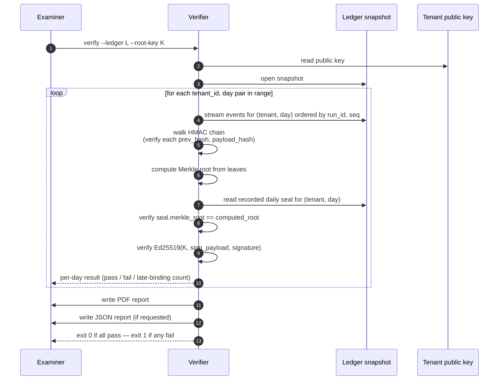
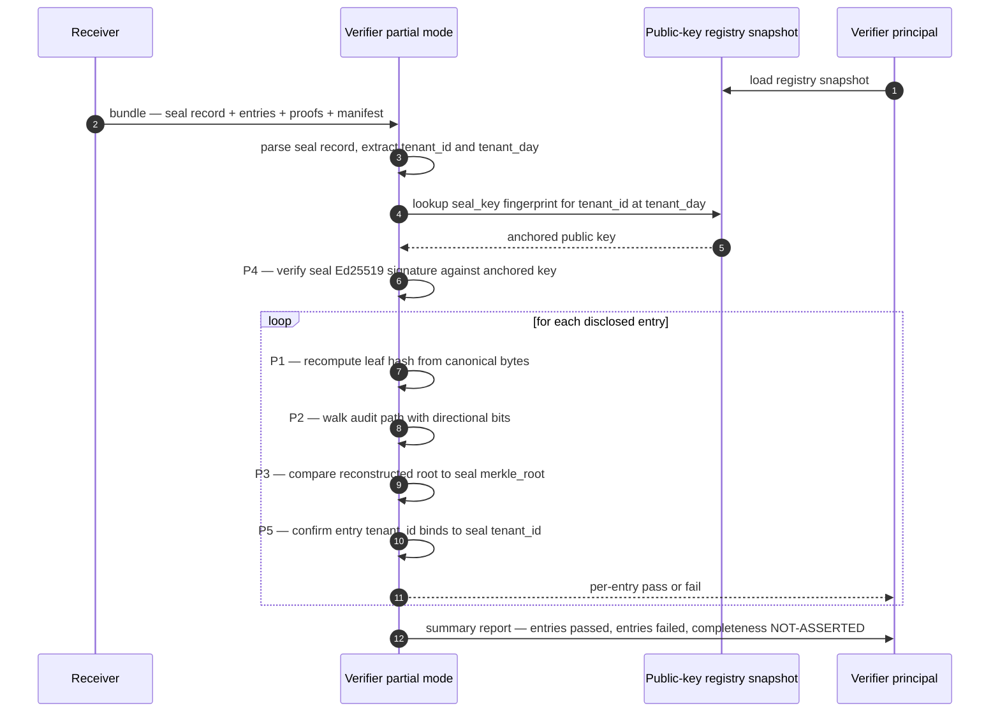

# 07 — Verifier design

> **What this doc is.** The architecture of `verifier/`. The standalone offline CLI that an examiner runs against a ledger to verify chain integrity, Merkle proofs, and HSM root signatures &mdash; with no dependencies on the institution or its vendor.

## 1. Design constraints

The verifier exists to satisfy one constraint: **an examiner can verify the chain without trusting the institution or its vendor**. Every design choice flows from that constraint.

| Constraint | Implication |
|---|---|
| No network calls | Pure offline binary. No DNS, no HTTPS, no telemetry. |
| Single binary | Static build with `CGO_ENABLED=0`. No dynamic linking. |
| Deterministic output | Same inputs &rarr; byte-for-byte identical report. Two examiners produce identical PDFs that can be compared by hash. |
| Fail closed | Any ambiguity is a failure. The verifier never silently passes a partial verification. |
| Read-only | The verifier never mutates the ledger or any other input. |
| Auditor-readable | Output is human-readable; the verifier explains what it checked and why each check passed or failed. |

## 2. Inputs

The verifier&rsquo;s entire trusted-computing-base for one verification run:

```
verifier verify \
  --ledger <path>           # Ledger snapshot or live read-only mount
  --root-key <path>         # Tenant public key (PEM-encoded Ed25519)
  --tenant-id <string>      # Optional; defaults to the tenant_id in the ledger
  --from <date>             # Optional; defaults to first day in ledger
  --to <date>               # Optional; defaults to last day in ledger
  --report <path>           # Output PDF path
  --json-report <path>      # Optional structured JSON output for tooling
  --strict                  # Optional; treat any warning as a failure
```

Each input is a flat file the examiner controls. The `--root-key` path is the regulator-held public key half. There is nothing else.

## 3. The verification flow



Every step has a deterministic outcome. The PDF is generated from the structured results.

## 4. The verification primitives — twelve-step ordered procedure

The verifier follows the ordered procedure in spec §7. The order is load-bearing: cheap rejections happen before expensive ones, structural checks before cryptographic, no-key-compute before key-compute.

```mermaid
flowchart TB
    Start([Open file])
    H1{1. format_version<br/>== running v?}
    H2{2. hkdf_inputs<br/>_digest match?}
    H3{3. genesis_hash<br/>== zeros?}
    E4{4. event.tenant<br/>== header?}
    E5{5. entry.format<br/>== header?}
    E6{6. seq + prev_hash<br/>structural?}
    E7{7. ikm_lookup<br/>returns IKM?}
    E8{8. fingerprint<br/>match?}
    E9{9. MAC match<br/>using expected_prev?}
    M10{10. Merkle root<br/>== sealed root?}
    M11{11. Ed25519<br/>signature valid?}
    M12{12. cadence and<br/>dev_mode OK?}
    Pass([PASS])
    Fail([FAIL with named reason])

    Start --&gt; H1
    H1 --&gt;|no| Fail
    H1 --&gt;|yes| H2
    H2 --&gt;|no| Fail
    H2 --&gt;|yes| H3
    H3 --&gt;|no| Fail
    H3 --&gt;|yes| E4
    E4 --&gt;|no| Fail
    E4 --&gt;|yes| E5
    E5 --&gt;|no| Fail
    E5 --&gt;|yes| E6
    E6 --&gt;|no| Fail
    E6 --&gt;|yes| E7
    E7 --&gt;|no| Fail
    E7 --&gt;|yes| E8
    E8 --&gt;|no| Fail
    E8 --&gt;|yes| E9
    E9 --&gt;|no| Fail
    E9 --&gt;|yes| M10
    M10 --&gt;|no| Fail
    M10 --&gt;|yes| M11
    M11 --&gt;|no| Fail
    M11 --&gt;|yes| M12
    M12 --&gt;|no| Fail
    M12 --&gt;|yes| Pass
```

### 4.0 File header pre-flight (steps 1-3, run once per file)

```
header = read first line of audit file (parse as AuditFileHeader)

# Step 1: format_version most-specific-first refusal.
# A v2 file fails HERE with "format_version not supported by this verifier",
# not later with a HKDF or MAC mismatch. The ordering matters because the
# downstream messages would mislead a reader into thinking the file is corrupt
# rather than format-incompatible.
IF header.format_version != "v1":
  FAIL: format_version {header.format_version} not supported by this verifier (running v1)

# Step 2: HKDF inputs digest matches the running v1 constants.
expected_hkdf_inputs_digest = SHA-256(
  HKDF_SALT
  || (HKDF_INFO_BASE || b"|" || utf8(header.tenant_id))
  || (32).to_bytes(4, "little")
)
IF NOT constant_time_equal(expected_hkdf_inputs_digest, header.hkdf_inputs_digest):
  FAIL: header HKDF inputs do not match running v1 inputs

# Step 3: Genesis hash is the v1 constant (32 zero bytes).
IF header.genesis_hash != b"\x00" * 32:
  FAIL: header genesis_hash does not match v1 constant
```

### 4.1 Per-event walk (steps 4-9, in (run_id, seq) order)

```
expected_prev_hash = b"\x00" * 32
expected_seq = 1

FOR each event in events_for_file:
  entry = event.audit_chain

  # Step 4: per-entry tenant + run binding (cross-chain-lift defence).
  # An event copied from another tenant's or another run's chain fails
  # here before any MAC compute.
  IF event.tenant_id != header.tenant_id:
    FAIL: cross-chain lift detected at seq {entry.seq} (event.tenant_id mismatch)
  IF event.run_id != header.chain_id:
    FAIL: cross-chain lift detected at seq {entry.seq} (event.run_id mismatch)

  # Step 5: per-entry format_version matches header.
  IF entry.format_version != header.format_version:
    FAIL: format_version mismatch at seq {entry.seq}

  # Step 6: structural seq + prev_hash walk.
  IF entry.seq != expected_seq:
    FAIL: seq out of order at seq {entry.seq}, expected {expected_seq}
  IF entry.prev_hash != expected_prev_hash:
    FAIL: chain link broken at seq {entry.seq}

  # Step 7: IKM lookup. NO MAC COMPUTE happens on lookup miss.
  ikm = ikm_lookup(event.tenant_id, entry.key_version)
  IF ikm is None:
    FAIL: unknown key_version: no IKM for (tenant={event.tenant_id}, key_version={entry.key_version}) at seq {entry.seq}

  # Step 8: fingerprint constant-time compare. NO MAC COMPUTE on mismatch.
  # This is the load-bearing check that catches botched rotation
  # (wrong IKM under the same key_version) at lookup time.
  expected_fingerprint = SHA-256(utf8(event.tenant_id) || ikm)[:16]
  IF NOT constant_time_equal(expected_fingerprint, entry.key_fingerprint):
    FAIL: key_fingerprint mismatch at seq {entry.seq}: looked-up IKM does not match the entry's recorded fingerprint

  # Step 9: MAC recompute using EXPECTED prev_hash, not entry.prev_hash.
  # The structural walk already rejects entries whose prev_hash drifts;
  # feeding the *expected* value into the MAC compute removes a latent
  # footgun where a future relaxation of the structural check would let
  # an attacker substitute prev_hash and have writer + verifier agree.
  info_for_tenant = HKDF_INFO_BASE || b"|" || utf8(event.tenant_id)
  session_key = HKDF-SHA-256(IKM=ikm, salt=HKDF_SALT, info=info_for_tenant, length=32)
  canonical_bytes = serialize_event_for_hash(event)   # excludes chain-stamp fields
  expected_mac = HMAC-SHA-256(session_key, expected_prev_hash || canonical_bytes)
  IF NOT constant_time_equal(expected_mac, entry.payload_hash):
    FAIL: payload_hash MAC mismatch at seq {entry.seq}

  expected_prev_hash = entry.payload_hash
  expected_seq += 1
```

### 4.2 Per-day Merkle recomputation (step 10)

```
day_events = SELECT payload_hash FROM ledger
             WHERE tenant_id=T AND DATE(received_at, 'UTC')=D
             ORDER BY run_id ASC, seq ASC

streaming_merkle = NEW StreamingMerkle()
FOR each ph in day_events:
  streaming_merkle.add(ph)
computed_root = streaming_merkle.root()

# Empty-day handling: when day_events is empty, streaming_merkle.root() MUST
# return SHA-256("") = e3b0c44298fc1c149afbf4c8996fb92427ae41e4649b934ca495991b7852b855
# per design 03 §3.1. A streaming implementation that returns nil on empty input
# is non-conformant — wrap it to substitute the empty-root constant.
IF day_events is empty AND computed_root is nil/empty:
  computed_root = bytes.fromhex("e3b0c44298fc1c149afbf4c8996fb92427ae41e4649b934ca495991b7852b855")

seal = SELECT * FROM daily_seals WHERE tenant_id=T AND seal_date=D
IF seal.merkle_root != computed_root:
  FAIL: merkle root mismatch — ledger contents do not produce sealed root
```

### 4.3 Per-day signature verification (steps 11-12)

The verifier dispatches on the seal record's `sign_payload_version` field per spec §4.3 — absent → pre-amendment 6-line form; `"v1.0a"` → amendment 10-line form; unrecognized → fail with `sign_payload_version "X" not supported by this verifier (running v1.0a)`. The pseudocode below shows the v1.0a 10-line reconstruction (the canonical v1.0 form under v1.0-final-amendment); pre-amendment chains use the 6-line form per spec §4.3.

```
# v1.0a 10-line sign_payload reconstruction (single-algorithm posture):
sign_payload = "ffiec.chain-of-custody.v1\n" ||
               "v1.0a"                       || "\n" ||  # sign_payload_version (line 2)
               seal.algorithm                || "\n" ||
               seal.format_version           || "\n" ||
               T                             || "\n" ||
               iso8601(D)                    || "\n" ||
               hex(seal.merkle_root)         || "\n" ||  # 64 chars lowercase
               hex(seal.hkdf_inputs_digest)  || "\n" ||  # 64 chars lowercase
               seal.cadence                  || "\n" ||  # "hourly" | "daily" | "weekly"
               ("1" if seal.dev_mode else "0")           # single byte; NO trailing \n
# Total: 9 LF separators, no trailing newline. CRLF is non-conformant.
# Algorithm dispatch: resolves the public key's algorithm from public_key_id.
# Mismatch between seal.algorithm and the public key's algorithm reports
# "algorithm/key-type mismatch at signature verification" (spec §7 step 11).
IF NOT verify_for_algorithm(seal.algorithm, public_key, sign_payload, seal.signature):
  FAIL: signature verification failed

# Dual-algorithm posture (Variant B per spec §4.3.2 with seal.signatures present):
# Each entry covers its OWN algorithm-bound sign_payload — line 3 (algorithm)
# carries that algorithm's identifier; line 2 (sign_payload_version) remains
# "v1.0a" for every algorithm. A single shared sign_payload is non-conformant.
IF seal.signatures is present:
  per_algorithm_results = []
  FOR each entry in seal.signatures:
    # Reconstruct the algorithm-specific 10-line sign_payload. Line 3 is
    # entry.algorithm, NOT seal.algorithm — Variant B is normative per
    # spec §4.3.2 to close the algorithm-confusion attack class.
    sp_alg = "ffiec.chain-of-custody.v1\n" ||
             "v1.0a"                       || "\n" ||  # sign_payload_version (line 2)
             entry.algorithm               || "\n" ||  # per-algorithm identifier (line 3)
             seal.format_version           || "\n" ||
             T                             || "\n" ||
             iso8601(D)                    || "\n" ||
             hex(seal.merkle_root)         || "\n" ||
             hex(seal.hkdf_inputs_digest)  || "\n" ||
             seal.cadence                  || "\n" ||
             ("1" if seal.dev_mode else "0")
    pk_alg = lookup_public_key(seal.public_key_id, entry.algorithm)
    valid = verify_for_algorithm(entry.algorithm, pk_alg, sp_alg, entry.signature)
    per_algorithm_results.append((entry.algorithm, valid))

  # Dispatch per spec §7 step 11 cases (a)-(e):
  declared_posture = institution_declared_algorithm_posture()  # institution config
  algos_in_posture = set(declared_posture)
  algos_in_seal    = set(e.algorithm for e in seal.signatures)
  algos_unknown    = algos_in_seal - algos_in_posture
  algos_present    = algos_in_seal & algos_in_posture

  IF algos_unknown:
    # Case (c): algorithm not on declared posture list
    REPORT: algorithm not on institution's declared posture list at seal_date {D}
    IF strict: FAIL else PASS-WITH-ANOMALY
  ELIF len(algos_present) < len(algos_in_posture):
    # Case (b): partial-coverage seal
    REPORT: partial-coverage seal: single-algorithm signature during institution's declared dual-algorithm posture
    IF strict: PASS-WITH-ANOMALY else PASS-WITH-ANOMALY (control-completeness, NOT chain-integrity)
  ELIF all(valid for (_, valid) in per_algorithm_results):
    # Case (a): both signatures present and valid
    REPORT: PASS (co-signed)
  ELIF any(valid for (_, valid) in per_algorithm_results):
    # Case (e): one valid + one invalid (load-bearing)
    valid_alg = [a for (a, v) in per_algorithm_results if v][0]
    invalid_alg = [a for (a, v) in per_algorithm_results if not v][0]
    REPORT: co-signed seal failure: algorithm {valid_alg} validated, algorithm {invalid_alg} did not
    IF strict: FAIL else PASS-WITH-ANOMALY
  ELSE:
    # All signatures invalid
    FAIL: signature verification failed (all algorithms in dual-algorithm posture)

# Step 12: cadence + dev_mode posture check.
IF seal.cadence != claimed_cadence:
  FAIL: cadence mismatch
IF strict_mode AND seal.dev_mode:
  FAIL: dev-mode seal in production verification — refused
```

### 4.3.1 Step 13 — DAG topology resolution (optional under default; reportable as anomaly)

For chain entries carrying `dag_parents` (spec §4.4), the verifier SHOULD validate the DAG topology after the per-day Merkle and signature checks complete:

```
FOR each event with dag_parents:
  parents = parse_dag_parents(event.dag_parents)  # comma-separated (run_id, seq) pairs
  FOR each (parent_run_id, parent_seq) in parents:
    parent_event = lookup_event(event.tenant_id, parent_run_id, parent_seq)
    IF parent_event is None:
      ANOMALY: dag_parents references missing event at (run_id={parent_run_id}, seq={parent_seq})
      (under --strict, ANOMALY elevates to FAIL with reason "dag_parents resolution failed")
```

The check ensures a DAG-shaped multi-process flow's parent edges resolve to chain entries that exist in the same tenant's ledger. A typo in `dag_parents`, a parent event that was not captured (SDK persistence failure, network drop), or a parent in a different tenant produces an anomaly the auditor sees in the report rather than discovering downstream during a SR 11-7 reconstruction.

The check is at the day-level (after step 10), not per-event during the chain walk, because the parent events may be in earlier days within the verification range. The verifier's day-level summary includes a `dag_topology_check` section listing the anomalies if any.

### 4.4 Master-key-less verification (--master-key absent)

When the verifier is invoked without `--master-key`, it cannot perform steps 7-9 (no IKM available). The verifier still performs:

- Steps 1-3 (header pre-flight)
- Steps 4-6 (cross-chain binding + structural walk)
- Steps 10-12 (Merkle + signature)

The day is reported as `PASS-WITH-ANOMALY: structural verification only; key-bound verification skipped`. Under `--strict`, the absent IKM elevates to FAIL with `master key not provided; --strict requires key-bound verification`.

This degradation mode is the answer to "the institution will not share the master IKM with the examiner": the verifier proves the structural integrity (chain links, Merkle root, HSM signature) without the IKM, and recommends a follow-up examination with key access. A zero-knowledge mode where the institution proves chain knowledge without disclosing the IKM is a v1.x roadmap candidate; the v1.0 degradation posture is sufficient for the structural-only review path.

## 5. The PDF report

The PDF is the artifact the examiner takes home. Determinism matters: two examiners running the verifier independently produce identical PDFs.

### 5.1 Structure

```
Page 1: Cover
  - Examiner instance (from --report-author flag, optional)
  - Verifier version, spec version, format_version
  - Ledger snapshot path and SHA-256 hash
  - Public key fingerprint
  - Verification range (from..to)
  - Pass/fail summary, with FAILED DAYS section if any
  - key_versions_observed and key_fingerprints_observed across the period
  - Examiner signature line

Pages 2..N: Per-day detail
  - Date
  - Event count
  - Late-binding count
  - Run count
  - Key versions present:        [list of key_version integers for the day]
  - Key fingerprints (truncated): [list of fingerprints for the day]
  - KMS handle URI:              [provenance pointer; "plaintext-" prefix is severe finding]
  - Merkle root (hex)
  - Recorded seal merkle_root (hex)
  - hkdf_inputs_digest (hex):    [seal record's value; verifier confirmed match]
  - Spec §7 steps executed:      1..12 (with explicit list when not all 12)
  - Merkle match: pass/fail
  - Signature verification: pass/fail (with algorithm dispatch noted)
  - HMAC chain verification: pass/fail
  - Per-failure detail (if any) carrying step, reason, run_id, seq,
    expected_fingerprint, recorded_fingerprint as applicable

Page N+1: Anomalies
  - List of any anomalies that did not cause failure but warrant attention:
    * Late-binding events
    * Empty days
    * Sealing delays > 24 hours
    * master_key_rotation_observed (normal-operations during documented rotation)
    * Clock-skew anomalies
    * Session keys not available for HMAC verification (--master-key absent)
    * audit_file.truncation_detected (operational; recovery completed/partial/unrecoverable)
    * dag_parents resolution failures (DAG topology anomaly per §4.3.1)

Page N+2: Methodology
  - The exact algorithms used (HKDF-SHA-256, HMAC-SHA-256, RFC 6962 Merkle, Ed25519)
  - The HKDF constants in force (HKDF_SALT, HKDF_INFO_BASE, info_for_tenant pattern)
  - The order of operations (spec §7 twelve-step procedure with named step references)
  - The pass/fail rules
  - The dev_mode posture (--strict refuses dev_mode seals)
```

### 5.2 PDF determinism

The PDF includes a generation timestamp by default. With `--deterministic`, the verifier emits a PDF with no timestamp and no randomized fields, producing byte-for-byte reproducible output across runs.

### 5.3 Examiner-side handling of the report

The PDF is the working-paper artifact. Examiners include three pieces in their working-paper bundle:

- **The PDF itself.** Sealed in the examination case file with the standard examination metadata.
- **The verifier binary's SHA-256 hash.** Recorded so a later reviewer can confirm the report came from a verifier whose binary has been independently verified against cosign and a reproducible build.
- **The ledger snapshot's SHA-256 hash.** The PDF cover page records this; the working paper retains the snapshot file (or a documented retrieval path) for re-verification.

For institutions producing the report for a regulator examination, the same three pieces are bundled in the examination evidence package.

**Standardized bundle format.** The verifier emits an examination bundle when invoked with `--bundle <path>`. The bundle is a `.tar.gz` archive containing:

```
report.pdf              The human-readable report
report.json             The machine-readable JSON report
verifier.sha256         SHA-256 of the verifier binary used
ledger.sha256           SHA-256 of the ledger snapshot consumed
public_key.pem          The tenant public key used (for reproduction)
metadata.json           Bundle metadata: verifier version, spec version, generation time, examiner identity (optional)
```

The bundle is the standard examination evidence artifact. Examiners working from the bundle can reproduce the verification independently with any conforming verifier; the bundle is sufficient input. The bundle SHA-256 is recorded in the examination working papers.

### 5.4 Strict mode usage

| Use case | Recommended invocation |
|---|---|
| Federal examination (conservative) | `verifier verify --strict` — any anomaly fails the day |
| SOC 2 / SOC 1 attestation | `verifier verify` (without `--strict`) — anomalies are evaluated; documented operational explanations may be acceptable |
| Internal audit, ongoing monitoring | `verifier verify` — anomalies feed the institution's internal-control review |
| Incident investigation | `verifier walk --run-id <r>` — full per-event detail for a specific run |

The `--strict` flag is not a security boundary; it is a posture toggle. Conservative consumers (regulators) use it; consumers who can evaluate anomalies in context (auditors, internal teams) usually do not.

### 5.5 Verifier output authenticity

The verifier's PASS/FAIL output and the reason string are written to stdout (and to the PDF and JSON report files when those flags are present). The output is NOT cryptographically signed by the verifier itself. Output authenticity is established at a different layer: auditors verify the verifier binary via cosign and reproducible-build validation per §8 (the institution and the regulator both run `verifier-validate.sh` before invoking the verifier; the wrapper checks cosign + reproducible-build manifest + GPG fallback and exits 0 only if all three pass). The trust model is "the binary is the right binary; the output is what that binary produced," not "the output carries its own signature."

For institutions requiring cryptographic attestation of verifier output (high-assurance scenarios such as nation-state-actor threat models or contested litigation where the verifier's output itself becomes evidence), a future v1.x extension could add an optional `--sign-output` mode. Under that mode, the verifier writes a detached Ed25519 signature alongside the PDF and JSON files; the signing key is held by the regulator's verifier-tooling team and rotated on the same cadence as the verifier release pipeline.

For v1.0, verifier-output authenticity is established through binary-provenance verification (cosign) and reproducible-build testing, not through output-level signing. The simpler posture is sufficient for the v1.0 conformance bar; the `--sign-output` extension is a v1.x candidate when an institution or regulator brings a concrete requirement that the binary-provenance path cannot satisfy.

## 6. The JSON report

For tooling integration. Same structured data as the PDF, in machine-readable form. Schema picks up the new chain-stamp fields per spec §4.1 and §4.2:

```json
{
  "verifier_version": "v1.0.0",
  "spec_version": "v1.0",
  "format_version": "v1",
  "ledger_sha256": "9f86d081884c7d659a2feaa0c55ad015a3bf4f1b2b0b822cd15d6c15b0f00a08",
  "public_key_fingerprint": "1d0d5c2cfdcec18ff8b21e9c10ffe4e7...5193623230",
  "range": { "from": "2026-04-01", "to": "2026-04-30" },
  "tenant_id": "tenant_acme_prod",
  "summary": {
    "days_verified": 30,
    "days_passed": 30,
    "days_failed": 0,
    "events_total": 4218391,
    "runs_total": 312401,
    "late_binding_total": 47,
    "key_versions_observed": [3, 4],
    "key_fingerprints_observed": [
      "b94c1a77b40bf5106c66ca6c1c1b4989",
      "2eede65f0f764c97eaf3b3f306a48537"
    ],
    "sealing_delays_over_1h": 3
  },
  "days": [
    {
      "date": "2026-04-01",
      "events": 142087,
      "runs": 10423,
      "merkle_root": "a7f5e391b2c8d4f6e0a1b2c3d4e5f6a7b8c9d0e1f2a3b4c5d6e7f8a9b0c1d2e3",
      "recorded_root": "a7f5e391b2c8d4f6e0a1b2c3d4e5f6a7b8c9d0e1f2a3b4c5d6e7f8a9b0c1d2e3",
      "merkle_match": true,
      "signature_valid": true,
      "chain_walk": "pass",
      "cadence": "daily",
      "key_versions": [3],
      "hkdf_inputs_digest": "9c5d955ee35f89844d9017c02c7e4b8c9b7b7962b54678efbe9a2f550bad791a",
      "dev_mode": false,
      "failures": [],
      "anomalies": []
    },
    {
      "date": "2026-04-15",
      "events": 140108,
      "runs": 10289,
      "merkle_root": "5e1ac73fa9b8c7d6e5f4a3b2c1d0e9f8a7b6c5d4e3f2a1b0c9d8e7f6a5b4c3d2",
      "recorded_root": "5e1ac73fa9b8c7d6e5f4a3b2c1d0e9f8a7b6c5d4e3f2a1b0c9d8e7f6a5b4c3d2",
      "merkle_match": true,
      "signature_valid": true,
      "chain_walk": "pass",
      "cadence": "daily",
      "key_versions": [3, 4],
      "hkdf_inputs_digest": "9c5d955ee35f89844d9017c02c7e4b8c9b7b7962b54678efbe9a2f550bad791a",
      "dev_mode": false,
      "failures": [],
      "anomalies": [
        { "kind": "master_key_rotation_observed", "detail": "events under both key_version 3 and 4 on this day; rotation completed mid-day per institution log" },
        { "kind": "sealing_delay", "detail": "signed_at exceeds 60-min window by 2h 12m" },
        { "kind": "late_binding", "detail": "9 events; rate 0.006% above 0.005% threshold" }
      ]
    }
  ]
}
```

**Failure-record shape.** When a day's `failures` array is non-empty, each entry follows the spec §7 failure-mode taxonomy:

```json
{
  "step": 8,
  "reason": "key_fingerprint mismatch at seq 17: looked-up IKM does not match the entry's recorded fingerprint",
  "run_id": "r_a3f29b71c",
  "seq": 17,
  "tenant_id": "tenant_acme_prod",
  "key_version": 1,
  "expected_fingerprint": "b94c1a77b40bf5106c66ca6c1c1b4989",
  "recorded_fingerprint": "2eede65f0f764c97eaf3b3f306a48537"
}
```

The `step` field references the spec §7 step number that produced the failure (1-12), so the auditor can map the failure to the named procedure step.

## 7. Operational modes

### 7.1 `verifier verify` &mdash; primary mode

The full verification flow. Produces the PDF and exits with status reflecting overall pass/fail.

### 7.2 `verifier walk`

Walk one specific run. For incident-investigation use:

```
verifier walk --ledger L --run-id r_a3f29b71c
```

Output: every event in the run, in order, with chain status per event.

### 7.3 `verifier diff`

Compare two ledger snapshots:

```
verifier diff --before L1 --after L2
```

Output: events present in L2 but not in L1 (additions), events present in L1 but not in L2 (defects, since the ledger should be append-only), and any events with conflicting payload_hash between the two snapshots (definitive evidence of tampering).

### 7.4 `verifier signedroot`

Just verify a single signed root, given the root and the public key:

```
verifier signedroot --root <hex> --signature <hex> --public-key <path> \
  --tenant tenant_acme_prod --date 2026-04-01
```

Use case: an examiner has a daily seal record but not the full ledger; this command confirms the seal was signed by the expected key. The full ledger is required for chain and Merkle verification.

## 8. Build and distribution

### 8.1 Static build

```bash
CGO_ENABLED=0 go build -ldflags="-s -w" -o verifier ./cmd/verifier
```

The `-s -w` flags strip debug symbols. The static build runs on any Linux, macOS, or Windows examiner laptop without dependencies.

### 8.2 Cross-compilation matrix

The release pipeline builds for:

- `linux/amd64`, `linux/arm64`
- `darwin/amd64`, `darwin/arm64`
- `windows/amd64`

All builds are reproducible (deterministic build flags, no embedded build timestamps). The release artifacts are signed with cosign.

### 8.3 Distribution

- GitHub Releases (signed binaries)
- Direct download from `verify.ffiec-ai-chain.org` (when registered)
- Reference Docker image for CI integration

The examiner is expected to obtain the binary from one of these channels, verify its signature, and run it locally.

### 8.4 Supply chain

The verifier release pipeline produces three artifacts per platform:

- **The binary.** Statically linked, deterministic-built, stripped of debug symbols.
- **A cosign signature.** Signed by the project's release pipeline; verifiable against the project's published cosign public key.
- **A SHA-256 hash manifest.** GPG-signed by the project's release-management role; verifiable against a cached GPG public key the institution holds out-of-band.

The double-signing path is defense-in-depth against Sigstore compromise: cosign is the primary trust anchor, the GPG-signed manifest is the fallback. Institutions that depend on the verifier in a regulatory submission SHOULD perform an independent reproducible-build verification at least once per release.

The Docker image follows the same trust chain: distroless base image, SBOM published with the release, image signed with cosign, trivy/grype vulnerability scan results published.

**SBOM format.** SBOMs are published in CycloneDX 1.5 format. The CycloneDX choice aligns with what most bank vulnerability-management tools consume directly. Each release publishes the SBOM at `verifier-v<version>.cdx.json` alongside the binary.

**Reproducible-build evidence.** Institutions performing independent rebuilds emit a `reproducible-build-log` JSON record with the rebuild timestamp, the source SHA-256, the toolchain version, and the resulting binary SHA-256. The institution archives the log in its standard control-evidence repository. A sample log:

```json
{
  "rebuild_timestamp": "2026-05-15T14:30:00Z",
  "source_commit": "a3f29b71c8...",
  "go_version": "go1.22.3",
  "build_flags": "CGO_ENABLED=0 -ldflags='-s -w' -trimpath",
  "binary_sha256": "9f86d081884c7d659a2feaa0c55ad015a3bf4f1b2b0b822cd15d6c15b0f00a08",
  "matches_published": true,
  "verifier": "internal-build-pipeline-v2.1"
}
```

The log is evidence the institution exercised the practice. SOC and examination teams sample-test the logs.

### 8.5 Examiner-laptop deployment guide

For regulator IT teams allowlisting the verifier:

| Field | Value |
|---|---|
| File name (Linux/macOS) | `verifier` |
| File name (Windows) | `verifier.exe` |
| File type | Static ELF / Mach-O / PE binary, no dynamic linking |
| Network behavior | None — verifier makes no outbound connections |
| File system behavior | Reads `--ledger`, `--root-key`; writes `--report`, `--json-report` |
| Privileged-operation requirement | None — runs as ordinary user |
| Cosign signature | Validates against the project's published cosign public key |
| Reproducible build | Yes; institutions may rebuild from source and compare hashes |

Allowlisting the binary by SHA-256 hash is the conservative posture; allowlisting by cosign signature lets new releases auto-allowlist on signature validation. Either is acceptable.

**`verifier-validate` wrapper.** The release pipeline ships `verifier-validate.sh` (Linux/macOS) and `verifier-validate.ps1` (Windows) that run the full validation chain (cosign + reproducible-build manifest + GPG fallback) and produce a single pass/fail. Examiners run the wrapper before running the verifier; the wrapper exits 0 only if all three checks pass. The script is itself signed and reproducible; its hash is published alongside the verifier binary.

### 8.6 Recovery scenarios

When the institution restores a ledger from a backup older than the most recent recorded seal, the recomputed Merkle root will not match the recorded seal — the seal covers events the older WAL is missing. The verifier reports the day as failed with `merkle root mismatch`.

The remediation path:

1. The institution identifies the gap (events captured between the backup point and the failure point).
2. The institution replays the gap from any source available — SDK-side local SQLite buffers, downstream OTLP backends that retained the events, vendor-held copies — into the recovered WAL.
3. The institution re-runs the seal job for the affected days; with the gap filled, the recomputed root matches the original seal.
4. The verifier's next pass succeeds; the recovery event is documented in the institution's incident log.

If the gap cannot be filled (the source events are unrecoverable), the affected days remain unverifiable. The institution treats this as an integrity-control failure that triggers cyber-incident notification (`docs/incident-response-playbook.md`).

## 9. Auditor's-lens review

| Question | Answer |
|---|---|
| Can the verifier produce a false-positive (claim a chain is valid when it isn&rsquo;t)? | Only via a defect in the verifier code. The verification logic is small, well-tested by the conformance corpus, and CodeQL-scanned. The reference implementation accepts independent re-implementation by other parties. |
| Can the verifier produce a false-negative (claim a chain is invalid when it&rsquo;s valid)? | Only via a defect or a fundamental cryptographic break. The verifier reports specific reasons for failure; the examiner can re-verify by hand or with another verifier instance. |
| Does the verifier need network access? | No. Verified by the build constraint that bans `net/http` import in the verification path. |
| Can the institution influence what the verifier checks? | No. The verifier reads only the ledger (untrusted input) and the public key (regulator-held). The institution&rsquo;s ops team has no way to inject behavior into the verifier process. |
| What if the examiner&rsquo;s laptop is compromised? | A compromised laptop can produce a false report. This is a residual risk; the mitigation is examiner laptop hygiene (separation of duties, dedicated audit machines). The verifier itself is not the right place to defend against laptop compromise. |
| What if the verifier itself is compromised (a malicious build)? | Examiners verify the binary signature with cosign before running. Reproducible builds enable third-party re-verification. The threat model accepts this is a residual risk if cosign is compromised. |
| Master-key-less verification | Today the HMAC chain check requires the session key (and thus the master IKM). If the institution will not share the IKM with the examiner, the verifier degrades to structural verification (prev_hash linking, Merkle, signature) without HMAC equality and reports the day as PASS-WITH-ANOMALY. Under `--strict` the absent IKM elevates to FAIL. A zero-knowledge mode where the institution proves chain knowledge without disclosing the IKM is a v1.x roadmap candidate; the v1.0 degradation posture is sufficient for the structural-only review path. |

## 10. Partial-disclosure verifier mode

> **What this mode is.** A second verifier mode that authenticates one entry, or a small subset of entries, against a sealed daily Merkle root — without disclosing the rest of the day's chain. The full-day mode in §3 and §4 walks every event in the range. The partial-disclosure mode walks only the produced entries and accepts an RFC 6962 §2.1.1 Merkle audit path that proves each entry was a leaf in the same sealed root.

The full-day mode is the default and the only mode that asserts chain completeness. The partial-disclosure mode answers a narrower question: did the receiver honestly produce a subset of what it sealed, against the seal it published. That distinction is load-bearing; §10.4 below states the limit precisely.

The mode exists because three first-look review tracks converged on the same need. A federal investigator working an 18 USC §2703(d) order is required to take only what the order authorizes — a Rule 41 warrant level of disclosure exposes the institution to a Bivens claim from non-target customers and gives defense counsel a Fourth Amendment hook. A SOC 2 Type II auditor draws a stratified sample from a population of millions of entries and tests each independently. A DORA Article 11-14 incident report is filed in three tiers — initial at 4 hours, intermediate at 72 hours, final at 1 month — and the institution must produce only the responsive evidence at each tier. In all three contexts, full-day disclosure is the wrong shape.

### 10.1 Mode invocation

The verifier's partial-disclosure mode is invoked with a distinct subcommand so the caller cannot reach it accidentally:

```
verifier verify-partial \
  --tenant-id <string>               # Target tenant
  --tenant-day <YYYY-MM-DD>          # Target sealed day
  --seal <path>                      # The seal record for (tenant_id, tenant_day)
  --public-key-registry <path>       # Snapshot of the public-key registry
  --entries <path>                   # JSON list of (seq, entry_bytes) records
  --proofs <path>                    # JSON list of inclusion proofs, indexed by seq
  --report <path>                    # Output report path
  --json-report <path>               # Optional structured output
  --strict                           # Optional; treat any anomaly as failure
```

The full-day mode (`verifier verify`) and the partial-disclosure mode (`verifier verify-partial`) are not interchangeable. The full-day mode rejects partial inputs; the partial mode rejects a full ledger. The named subcommand is the toggle and the verifier never silently switches between them.

### 10.2 Inputs

The partial-disclosure verifier consumes six inputs and only those six. None of them name the rest of the day's entries.

| Input | Contents | Trust source |
|---|---|---|
| `tenant_id` | The target tenant identifier. | The disclosing party names it; the seal record binds it. |
| `tenant_day` | The target sealed day in `YYYY-MM-DD`. | The disclosing party names it; the seal record binds it. |
| Entry list | A JSON list of `(seq, entry_bytes)` records — the produced entries' canonical bytes per spec §5. | Disclosing party. |
| Inclusion proofs | One audit path per produced entry, in the shape defined by §10.5 below. | Disclosing party. |
| Seal record | The full seal record for `(tenant_id, tenant_day)` — verbatim, untouched, byte-for-byte as the institution sealed it. | Disclosing party but cryptographically bound. |
| Public-key registry snapshot | The regulator-side or auditor-held snapshot naming the seal-key fingerprint authorized to sign for `tenant_id` on or around `tenant_day`. | Independently held by the verifier's principal — the regulator, the auditor, or the federal investigator. |

The split between disclosing party and independent party is the trust boundary. The disclosing party can lie about anything they hold; the public-key registry snapshot is the verifier-side anchor that catches the lie.

### 10.3 Outputs

Partial-disclosure output is a per-entry verdict plus an aggregated summary. The verifier never emits a single combined PASS over the whole input — each entry stands or falls on its own audit path.

```json
{
  "mode": "partial-disclosure",
  "tenant_id": "tenant_acme_prod",
  "tenant_day": "2026-04-15",
  "seal_signature_valid": true,
  "seal_key_fingerprint": "1d0d5c2c…5193",
  "registry_anchor": "regulator-snapshot-2026-04-30",
  "entries_disclosed": 6,
  "entries_passed": 6,
  "entries_failed": 0,
  "per_entry": [
    { "seq": 142,  "result": "pass", "leaf_hash": "a7f5…d2e3", "audit_path_length": 6 },
    { "seq": 187,  "result": "pass", "leaf_hash": "5e1a…c3d2", "audit_path_length": 6 },
    { "seq": 213,  "result": "pass", "leaf_hash": "8c2f…b1a4", "audit_path_length": 5 },
    { "seq": 401,  "result": "pass", "leaf_hash": "2a9d…f7e8", "audit_path_length": 6 },
    { "seq": 502,  "result": "pass", "leaf_hash": "9f3b…1c0d", "audit_path_length": 6 },
    { "seq": 617,  "result": "pass", "leaf_hash": "4e7c…a8b2", "audit_path_length": 5 }
  ],
  "completeness_assertion": "NOT-ASSERTED"
}
```

The `completeness_assertion` field is always `"NOT-ASSERTED"` in this mode. It is present, named, and explicit. A consumer reading the JSON output cannot mistake a partial-disclosure pass for a full-day pass.

### 10.4 What the partial mode CANNOT do

The partial-disclosure mode asserts **inclusion**, not **completeness**. An entry that verifies under this mode was sealed in the named `(tenant_id, tenant_day)` by the seal-key the registry attests to. That is the only claim the mode supports. The mode does not — and cannot — assert any of the following:

- That the receiver disclosed every responsive entry. The disclosing party chose the entries; an entry the disclosing party omitted is invisible to this mode.
- That the day's full chain is intact. The chain walk in §4.1 (steps 4-9) inspects per-entry MAC and structural prev_hash linkage. The partial mode does not recompute those properties for the disclosed entries because the previous and next entries are not provided.
- That no other entries exist for the day. The seal record commits to a Merkle root over a leaf set whose size is not revealed by the audit path alone.

When the verifier-principal (the regulator, the auditor, the investigator) needs completeness, they must run the full-day mode (§3) over a complete ledger snapshot. The partial-disclosure mode is the right tool when completeness is not the question being asked. The DORA 4-hour initial-tier filing is the canonical example: the institution is reporting that something happened and producing the small responsive set; the supervisor is not yet asking "did you report everything you sealed."

The PDF and JSON output produced under this mode carry a header banner that names the limit verbatim:

```
PARTIAL-DISCLOSURE VERIFICATION
This report attests inclusion of the named entries in the sealed root.
This report does NOT attest chain completeness for tenant_day {D}.
```

The banner is non-removable and non-configurable.

### 10.5 Inclusion-proof shape

The inclusion proof per entry follows RFC 6962 §2.1.1 audit-path style, with directional bits to handle non-power-of-2 trees per the leaf-balancing rule pinned in test-vector 016. The audit path is a sequence of `(sibling_hash, position)` pairs walking from the leaf level to the root.

```json
{
  "seq": 142,
  "leaf_index": 3,
  "leaf_hash": "a7f5e391b2c8d4f6e0a1b2c3d4e5f6a7b8c9d0e1f2a3b4c5d6e7f8a9b0c1d2e3",
  "audit_path": [
    { "sibling_hash": "8c4b0aa3…f201", "position": "right" },
    { "sibling_hash": "33b71927…e7c3", "position": "right" },
    { "sibling_hash": "b9d2e5a1…7f4c", "position": "left"  }
  ],
  "expected_root": "5e1ac73fa9b8c7d6e5f4a3b2c1d0e9f8a7b6c5d4e3f2a1b0c9d8e7f6a5b4c3d2"
}
```

`leaf_hash` is `SHA-256(0x00 || entry_canonical_bytes)` per spec §5 leaf-domain prefix and design 03 §3.1. Each `sibling_hash` is the 32-byte node hash at that level. `position` is the directional bit — `"left"` means the sibling is on the left and the running hash combines as `SHA-256(0x01 || sibling_hash || running)`; `"right"` means the sibling is on the right and the combination is `SHA-256(0x01 || running || sibling_hash)`.

The directional bit handles the right-promote rule from test-vector 016. When an entry is the unpaired rightmost element at a level, the audit path at that level has no sibling — the entry is promoted to the next level unchanged. The proof encodes this as a `null` sibling at that step:

```json
{ "sibling_hash": null, "position": "promote" }
```

A `"promote"` step performs no hash compression at that level; the running hash is carried forward unchanged. This matches the RFC 6962 §2.1 right-promote balancing rule. Verifiers MUST handle the `"promote"` step; an audit path that omits it for a tree where the leaf was right-promoted is non-conformant and the verifier MUST fail with `audit path missing promote step at level L`.

### 10.6 Verification procedure

The partial-disclosure mode runs a fixed five-step procedure per entry. The order matches the cheap-rejections-first pattern from §4.

```
# Per-entry partial-disclosure verification

# Step P1: Recompute leaf hash from canonical bytes.
computed_leaf = SHA-256(0x00 || entry_canonical_bytes)
IF NOT constant_time_equal(computed_leaf, proof.leaf_hash):
  FAIL: leaf hash mismatch at seq {entry.seq}: disclosed bytes do not produce the proof's leaf_hash

# Step P2: Walk the audit path from leaf to root.
running = computed_leaf
FOR each step in proof.audit_path:
  IF step.position == "promote":
    # Right-promoted leaf at this level. Carry forward unchanged.
    running = running
  ELIF step.position == "left":
    running = SHA-256(0x01 || step.sibling_hash || running)
  ELIF step.position == "right":
    running = SHA-256(0x01 || running || step.sibling_hash)
  ELSE:
    FAIL: invalid audit-path position at seq {entry.seq}: {step.position}

# Step P3: Confirm the recomputed root matches the seal's merkle_root.
IF NOT constant_time_equal(running, seal.merkle_root):
  FAIL: audit path does not lead to sealed root at seq {entry.seq}

# Step P4: Confirm the seal's signature against the registry-anchored public key.
# Reuse the §4.3 signature verification (10-line v1.0a sign_payload).
# This step runs once per (tenant_id, tenant_day), not once per entry — it is
# extracted to a per-batch precondition.

# Step P5: Confirm the entry's tenant_id and run_id match the seal's tenant binding.
# The entry.tenant_id MUST equal seal.tenant_id; an entry whose tenant_id differs
# from the seal's binding is a cross-chain-lift attempt against partial mode.
IF entry.tenant_id != seal.tenant_id:
  FAIL: tenant_id mismatch at seq {entry.seq}: entry not bound to disclosed seal
```

Step P4 is a per-batch precondition because the seal's signature does not depend on which entries the institution chose to disclose; verifying the signature once before the per-entry loop is correct and avoids redundant compute on a multi-entry disclosure.

### 10.7 Security property

The partial-disclosure verifier accepts `(entry_bytes, audit_path)` if and only if:

1. The entry was sealed in the named `(tenant_id, tenant_day)`. Inclusion-proof second-preimage resistance means an audit path that walks to the sealed root is computationally infeasible to forge for an entry that was not in the sealed leaf set; the bound is the SHA-256 second-preimage strength of approximately 2^254 operations, the same bound the full-day mode rests on.
2. The seal was signed by the seal-key the registry attests to. The Ed25519 verification at step P4 is EUF-CMA at approximately 2^128 operations.
3. The entry binds to the seal's `tenant_id`. Step P5 closes the cross-tenant lift class — an entry sealed in tenant A cannot be presented as a member of tenant B's daily seal because the seal's `tenant_id` line of the v1.0a `sign_payload` (line 5 per §4.3) is HSM-signed.

The strength of the partial-disclosure mode is therefore bounded above by min(2^128 EUF-CMA on Ed25519, 2^254 SHA-256 second-preimage). This is the same cryptographic floor as the full-day mode. The partial mode's narrower scope does not weaken any primitive; it only declines to assert chain completeness.

A subtle property worth naming explicitly: the audit path itself is not a secret. Its sibling hashes are leaf hashes (or compressed internal-node hashes) of other entries the institution chose not to disclose. Those siblings reveal that other entries existed at sibling positions; they do not reveal those entries' contents. SHA-256 preimage resistance protects the bodies. The institution can publish or withhold the audit path freely without leaking the bodies of unrelated entries.

### 10.8 Disclosure obligations

The receiver producing a partial-disclosure bundle MUST disclose the following items verbatim. These are the items the verifier needs to run §10.6 and the items a consumer needs to assess the disclosure's coverage.

| Item | Form | Reason |
|---|---|---|
| The seal record | The full seal record for `(tenant_id, tenant_day)`, byte-for-byte as the institution sealed it. | Step P3 and step P4 both depend on it. The institution cannot redact any field of the seal record without breaking the signature. |
| Each disclosed entry's canonical bytes | Per-entry, in the canonical form per spec §5. | Step P1 recomputes the leaf hash from these bytes. |
| Each disclosed entry's audit path | One audit path per disclosed entry, in the §10.5 shape. | Step P2 walks each path. |
| The public-key registry snapshot anchor | The fingerprint and timestamp of the snapshot the verifier-principal will use to validate the seal signature. | Step P4 validates against this anchor. |
| The disclosure manifest | A JSON manifest naming `tenant_id`, `tenant_day`, the disclosed `seq` values, the basis for the disclosure (e.g., 2703(d) order number, SOC 2 sample identifier, DORA incident reference), and the SHA-256 of the bundle's entries-and-proofs payload. | Establishes what was produced and why. |

The receiver MAY redact the bodies of unrelated entries. Those bodies do not appear anywhere in a partial-disclosure bundle by construction — the audit path's siblings are leaf hashes of other entries, not the entries themselves. The receiver MUST NOT redact any field of the seal record; the seal is signed and any redaction breaks signature validation. The receiver MUST NOT redact the disclosed entries' canonical bytes; redacting them would break leaf-hash recomputation at step P1.

### 10.9 Integration with §10.12 verifier exit codes

The partial-disclosure mode follows the same exit-code contract as the full-day mode, with one mapping addition:

- Exit `0` — All disclosed entries verified and the seal signature validated against the registry snapshot.
- Exit `1` — One or more disclosed entries failed verification at steps P1, P2, P3, or P5; or the seal signature failed step P4. Per-entry failures are reported on stdout with the seq, the failing step, and the normative reason string.
- Exit `2` — Structural / input error. The bundle is malformed, the entry list is empty, the proof file is missing, the seal record cannot be parsed, or the public-key registry snapshot is unreadable. The verifier could not begin the §10.6 procedure.
- Exit `3` — Configuration error. The named `tenant_id` does not appear in the registry snapshot; the seal's `tenant_id` does not match the `--tenant-id` argument; the snapshot is older than `tenant_day` and a roll-forward is required; or the disclosure manifest's basis field is empty under `--strict`.

The discriminator between exit 1 and exit 2 is the same as in §10.12: could the §10.6 procedure begin. If the verifier reached step P1 and any step rejected, exit 1. If the verifier never reached step P1 (parse failures, missing files), exit 2.

Examiner harnesses and audit-firm sample-comparison scripts treating the verifier as a black box can branch on the exit code without learning the partial-disclosure-specific subcommand: a non-zero exit always means "do not rely on this disclosure as cryptographic evidence of inclusion."

### 10.10 Mermaid — partial-disclosure flow



The flow is deliberately linear. Each disclosed entry is independent of every other disclosed entry; a failure on one does not poison the others. The aggregated summary names every entry's verdict separately.

### 10.11 Use-case cross-references

The three contexts that motivated the mode are documented in `docs/selective-production-and-sampling.md`:

- 18 USC §2703(d) selective production for federal criminal investigations.
- SOC 2 Type II sampling for external attestation engagements.
- DORA Articles 11-14 incident-reporting tiers for EU financial entities.

The companion document carries worked byte-count examples and the procedural framing each context expects (for example, the FRE 902(13) declaration that accompanies a 2703(d) production). The verifier-mode specification is here in design 07; the consumer-side procedural framing lives in the companion document so the verifier docs stay focused on the verification mechanism.
