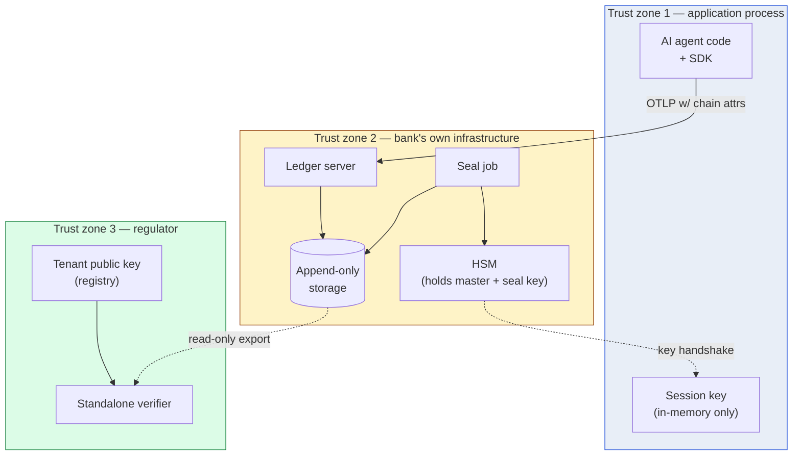

# 09 — Threat model

> **What this doc is.** The adversaries we defend against, the integrity properties we claim, and the residual risks we accept. The auditor's lens is the evaluation standard: a control we cannot defend to a federal examiner is not a control.

## 1. The integrity properties

Three properties the chain provides:

| Property | What it means |
|---|---|
| **Authentic capture** | An event in the chain was produced by the institution&rsquo;s legitimate AI agent process at the time and run-id it claims. |
| **Tamper evidence** | Any modification to a captured event &mdash; insertion, deletion, alteration &mdash; is detectable by the verifier. |
| **Independent verifiability** | A regulator with no access to the institution beyond a public key can verify both properties without trusting the institution. |

The properties are achieved by the composition of the four primitives. Removing any primitive weakens at least one property.

## 2. The adversaries

### 2.1 Adversary A &mdash; External attacker on the wire

**Capability.** Network-level attacker who can inject, modify, or drop OTLP messages between the SDK and the ledger server.

**Goal.** Forge AI events into the captured stream that the institution did not produce.

**Defense.** The HMAC chain. An attacker without the per-process session key cannot produce events whose `payload_hash` matches the chain's `prev_hash` linkage. Verification at ingest catches a wire-injected event before it lands in the ledger.

**Residual risk.** An attacker who recovers a session key (e.g., by compromising the application process) can produce events that pass verification. Detection: the institution&rsquo;s incident response identifies the compromise window. Bounded: the attacker can only produce events going forward, not retroactively.

### 2.2 Adversary B &mdash; Insider with database admin access

**Capability.** Direct read/write to the ledger storage. Bypasses the application-level append-only invariant.

**Goal.** Rewrite past events to favor a different decision history (e.g., make a denied loan look approved, or vice versa).

**Defense.** The daily Merkle seal. The Merkle root is committed under HSM signature; modifying any past event changes the root, which the verifier catches by comparing the recomputed root to the signed one. The insider cannot re-sign because the HSM holds the signing key.

**Residual risk.** The insider can corrupt the database and break verification (denial of service), but cannot silently rewrite history.

### 2.3 Adversary C &mdash; Insider with operational access (seal job credentials)

**Capability.** Authorized to invoke the daily seal job and supply payloads to the HSM for signing.

**Goal.** Construct a plausible alternate history and sign it under the institution&rsquo;s key.

**Defense.** Separation of duties. The seal-job operator role is separated from the database admin role and from the master-key custody role. To execute the attack, the insider needs the database admin&rsquo;s ability to alter ledger contents *and* the seal-job operator&rsquo;s ability to sign. Banks already enforce this separation for other privileged roles (payment authorization, change management); the chain leverages it.

**Residual risk.** Collusion between the database admin and the seal-job operator. Detection: a separate audit (internal or external) periodically samples ledger consistency; the regulator&rsquo;s independent verification is the long-cycle defense.

### 2.4 Adversary D &mdash; HSM physical attack

**Capability.** Physical possession of the HSM long enough to attempt key extraction.

**Goal.** Extract the Ed25519 signing key.

**Defense.** FIPS 140-2 Level 3 (or higher) physical tamper resistance. The HSM is designed to detect physical compromise and either zeroize keys or refuse to operate. AWS CloudHSM, Azure Dedicated HSM, and on-prem appliances at this level have physically passed FIPS validation.

**Residual risk.** A nation-state-level adversary with sufficient resources may compromise the HSM. The threat model accepts this as a residual risk; the institution&rsquo;s incident response includes notifying the regulator of any HSM physical-security incident.

### 2.5 Adversary E &mdash; Vendor compromise

**Capability.** The vendor that provides the chain-of-custody software (the SDK or the ledger server) is compromised &mdash; either an insider or a supply-chain attack.

**Goal.** Subvert the chain at build time to allow the vendor to forge events on demand.

**Defense (multi-layered):**

1. **Apache 2.0 open source.** Every line of the reference implementation is publicly auditable. The FFIEC, internal audit teams, or independent security researchers can review the code.
2. **Reproducible builds.** The CI pipeline produces deterministic artifacts; independent re-builds match the published binaries byte-for-byte.
3. **Cosign-signed releases.** Release artifacts are signed; institutions verify signatures before deployment.
4. **Runtime determinism.** The conformance corpus catches behavioral deviation. A subverted build that produces incorrect output fails the corpus.

**Residual risk.** A subversion that passes the corpus and produces deterministic-but-wrong output is theoretically possible (the attacker would have to compromise the corpus itself or convince upstream maintainers to merge a covertly-malicious change). Multi-party review and the SECURITY.md disclosure process are the defenses.

### 2.6 Adversary F &mdash; Application process compromise

**Capability.** The AI agent&rsquo;s host process is compromised (RCE, container escape, malicious dependency).

**Goal.** Forge events going forward, claim they reflect legitimate decisions.

**Defense.** Bounded forward-only attack window. The compromised process holds the session key and can produce valid-looking events. Past events have already been chained, exported, and (eventually) sealed; they cannot be retroactively altered. The institution&rsquo;s incident response identifies the compromise; events from the compromise window are flagged.

**Residual risk.** The compromise window between when the attacker gains access and when the institution detects it. Detection mechanisms: anomaly detection on the captured stream, out-of-band monitoring of the agent&rsquo;s behavior, third-party intrusion detection.

### 2.7 Adversary G &mdash; Master key compromise

**Capability.** The tenant master HMAC key is exfiltrated.

**Goal.** Derive arbitrary session keys and forge events.

**Defense.** Rotation. On detection, the institution rotates the master. New session keys derive from the new master; events captured after rotation pass verification only against the new master. Past events remain verifiable against the previous master (the institution retains key version history in the registry).

**Residual risk.** Events captured during the compromise window between exfiltration and detection are repudiable &mdash; the institution cannot prove they were produced by legitimate processes versus by the attacker. Forensic analysis (network logs, process audit logs) is the supplementary evidence path.

### 2.8 Adversary H &mdash; Cryptographic break

**Capability.** A practical break of HMAC-SHA-256, SHA-256, or Ed25519 emerges.

**Goal.** Forge events or seals.

**Defense.** Algorithm rotation. The spec includes algorithm identifiers in the seal record (Section 4.4 of `04-hsm-custody.md`). A future spec version can specify a new algorithm; institutions rotate to new keys under the new algorithm; past records remain verifiable against their original algorithm (with the caveat that they may be repudiable if the original algorithm break is total).

**Residual risk.** The window between when a break becomes practical and when institutions can rotate. The rotation lag is operational, not technical; the spec admits the new algorithm immediately, but bank-internal change management has its own cadence.

## 3. The trust boundary diagram

The trust boundaries:

- **TZ1 → TZ2.** Crossed by OTLP. Wire-tampering is caught by the ledger's HMAC re-verification.
- **TZ2 → TZ3.** Crossed by ledger snapshot export. The verifier reads the snapshot as untrusted input.
- **HSM.** Inside TZ2 but with a separate authentication boundary; only the seal-job role can request signatures.

A property of the trust topology: **TZ3 (the regulator) does not trust TZ2 (the bank).** The verifier is designed to produce a defensible report from untrusted input. The only thing the regulator trusts from the bank is the public key, and even that is verified against a fingerprint the regulator recorded at tenant registration time.

## 4. Properties NOT claimed

The threat model does not claim:

- **AI decision correctness.** The chain captures the decision; whether it was the correct decision is out of scope.
- **Real-time prevention of bad behavior.** Detection is post-hoc; runtime guardrails are a separate product.
- **Defense against side-channel attacks on the application host.** A sufficiently capable attacker on the host can observe events as they are constructed.
- **Defense against operational monoculture.** If every bank uses the same vendor and that vendor is compromised, the integrity claim is contingent on the open-source review process catching the compromise.

These exclusions are explicit so the auditor knows where the chain&rsquo;s integrity story ends and where the institution&rsquo;s broader controls begin.

## 5. Independent re-implementation as a defense

A property of the open-source-plus-conformance-corpus model:

- The reference implementation is one of N implementations.
- A second, independent implementation passing the same corpus produces identical output.
- A bank can run two independent implementations in parallel (one in production, one for sampling-based audit) and compare outputs.

If one implementation is compromised, the other catches the divergence on the next sampled event. This is *defense in depth via diversity* and is one of the strongest arguments for the open-standard-plus-multiple-vendors model over a single-vendor proprietary stack.

## 6. The auditor's residual-risk register

When the FFIEC working group reviews this design, they will want a residual-risk register. Here is the current state:

| # | Risk | Likelihood | Impact | Mitigation status |
|---|---|---|---|---|
| R1 | Application process compromise | Medium (high-value targets attacked routinely) | Forward-only forgery, bounded window | Industry-standard host hardening + rotation on detection |
| R2 | Master key exfiltration | Low (HSM custody) | Repudiable events in compromise window | Key rotation + supplementary forensic evidence |
| R3 | HSM physical compromise | Very low (FIPS 140-2 L3) | Forged seals possible until detection | Tamper detection + immediate revocation |
| R4 | Insider collusion (DBA + seal-op) | Low (separation of duties) | Silent history rewrite | Independent audit + regulator verification |
| R5 | Vendor supply chain | Low (Apache 2.0 OSS, reproducible builds) | Subverted runtime behavior | Conformance corpus + multi-party review |
| R6 | Cryptographic break | Very low (SHA-2, HMAC, Ed25519 are mature) | Forged chains | Algorithm rotation provision in spec |
| R7 | Cross-tenant key reuse misconfiguration | Low (per-tenant keys enforced) | Cross-tenant signature replay | Tenant ID in signature payload |
| R8 | Session key leakage to logs | Medium (operational concern) | Forward-only forgery within session | Session key never logged; key handles only |

Each risk has an owner and a mitigation status; risks marked as residual are accepted as part of the threat model, not as gaps in the design.

## 7. Auditor's-lens review

| Question | Answer |
|---|---|
| What is the worst-case scenario the chain still detects? | Insider with database access altering past events. The Merkle root recomputation catches it; the HSM signature confirms the original root was authentic. |
| What is the worst-case scenario the chain misses? | Collusion between the seal-job operator and the database admin. Mitigation is operational: separation of duties + independent audit. The chain&rsquo;s defense is stronger than typical model-risk controls but is not a replacement for those operational controls. |
| What changes if the master key is shared with the FFIEC? | The FFIEC can perform full HMAC equality verification, in addition to structural verification. This is a tenant policy decision; sharing the master is a higher cooperation level but enables stronger third-party verification. |
| What if the bank claims an event is forged that the chain shows as authentic? | The chain&rsquo;s verifiability cuts both ways. If the chain says the event is authentic, the bank carries the burden of demonstrating that the legitimate process was compromised. The chain produces evidence; courts and regulators interpret it. |
| Open issue | Formal verification of the threat model. v1.1 candidate: a TLA+ or Tamarin model of the protocol. |
