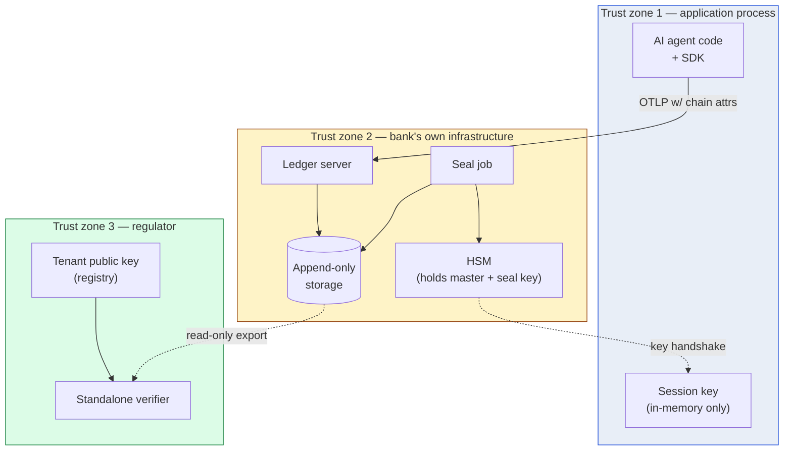

# 09 — Threat model

> **What this doc is.** The adversaries we defend against, the integrity properties we claim, and the residual risks we accept. The auditor's lens is the evaluation standard: a control we cannot defend to a federal examiner is not a control.

## 1. The integrity properties

Three properties the chain provides:

| Property | What it means |
|---|---|
| **Authentic capture** | An event in the chain was produced by the institution&rsquo;s legitimate AI agent process at the time and run-id it claims. |
| **Tamper evidence** | Any modification to a captured event &mdash; insertion, deletion, alteration &mdash; is detectable by the verifier. |
| **Independent verifiability** | A regulator with no access to the institution beyond a public key can verify both properties without trusting the institution. |

The properties are achieved by the composition of the four primitives. Removing any primitive weakens at least one property.

## 2. The adversaries

### 2.1 Adversary capability matrix

The adversary descriptions below name capabilities in prose. The matrix below names them in a structured grid so an auditor can reason about coverage in one view. Each row is one adversary; each column is one capability axis. The decomposition follows the IETF CFRG style of separating read access, write access, network position, key access, and oracle access so the threat model's structural logic is explicit.

| Adversary | Read ledger | Write ledger | Network position | IKM access | HSM access | Session-key access | Oracle access |
|---|---|---|---|---|---|---|---|
| A (external wire)        | No  | No  | Yes (wire) | No        | No                | No      | No      |
| B (database insider)     | Yes | Yes | No         | No        | No                | No      | No      |
| C (operational insider)  | Yes | No  | No         | No        | Yes               | No      | Limited |
| D (HSM physical)         | No  | No  | No         | No        | Yes (physical)    | No      | Limited |
| E (process compromise)   | Limited | No | No      | No        | No                | Yes     | Yes     |
| F (vendor subversion)    | Partial | Partial | No  | No        | No                | Partial | Partial |
| G (supply-chain compromise) | Partial | Partial | No | No     | No                | Partial | Partial |
| H (examiner-time tooling) | Yes | No | No         | Limited   | No                | No      | Partial |
| I (time-source attacker) | No  | No  | Yes (NTP)  | No        | No                | No      | Yes     |

The matrix makes the threat model's structural logic explicit. Each adversary section below describes the goal, the defense, and the residual risk in prose; the matrix shows what each adversary controls, observes, or queries at a glance. The decomposition aligns with IETF CFRG-style adversary-capability articulation, which is the form an academic or standards-track reviewer expects when evaluating coverage.

### 2.2 Adversary A &mdash; External attacker on the wire

**Capability.** Network-level attacker who can inject, modify, or drop OTLP messages between the SDK and the ledger server.

**Goal.** Forge AI events into the captured stream that the institution did not produce.

**Defense.** The HMAC chain. An attacker without the per-process session key cannot produce events whose `payload_hash` matches the chain's `prev_hash` linkage. Verification at ingest catches a wire-injected event before it lands in the ledger.

**Residual risk.** An attacker who recovers a session key (e.g., by compromising the application process) can produce events that pass verification. Detection: the institution&rsquo;s incident response identifies the compromise window. Bounded: the attacker can only produce events going forward, not retroactively.

### 2.3 Adversary B &mdash; Insider with database admin access

**Capability.** Direct read/write to the ledger storage. Bypasses the application-level append-only invariant.

**Goal.** Rewrite past events to favor a different decision history (e.g., make a denied loan look approved, or vice versa).

**Defense.** The daily Merkle seal. The Merkle root is committed under HSM signature; modifying any past event changes the root, which the verifier catches by comparing the recomputed root to the signed one. The insider cannot re-sign because the HSM holds the signing key.

**Residual risk.** The insider can corrupt the database and break verification (denial of service), but cannot silently rewrite history.

### 2.4 Adversary C &mdash; Insider with operational access (seal job credentials)

**Capability.** Authorized to invoke the daily seal job and supply payloads to the HSM for signing.

**Goal.** Construct a plausible alternate history and sign it under the institution&rsquo;s key.

**Defense.** Separation of duties. The seal-job operator role is separated from the database admin role and from the master-key custody role. To execute the attack, the insider needs the database admin&rsquo;s ability to alter ledger contents *and* the seal-job operator&rsquo;s ability to sign. Banks already enforce this separation for other privileged roles (payment authorization, change management); the chain leverages it.

**Residual risk.** Collusion between the database admin and the seal-job operator. Detection: a separate audit (internal or external) periodically samples ledger consistency; the regulator&rsquo;s independent verification is the long-cycle defense.

### 2.5 Adversary D &mdash; HSM physical attack

**Capability.** Physical possession of the HSM long enough to attempt key extraction.

**Goal.** Extract the Ed25519 signing key.

**Defense.** FIPS 140-2 Level 3 (or higher) physical tamper resistance. The HSM is designed to detect physical compromise and either zeroize keys or refuse to operate. AWS CloudHSM, Azure Dedicated HSM, and on-prem appliances at this level have physically passed FIPS validation.

**Residual risk.** A nation-state-level adversary with sufficient resources may compromise the HSM. The threat model accepts this as a residual risk; the institution&rsquo;s incident response includes notifying the regulator of any HSM physical-security incident.

**Fault-injection (FIA / DFA) residual.** Differential fault attacks against HSM signing operations are a known vulnerability class on some hardware implementations. FIPS 140-2 Level 3 certifies physical tamper-resistance; it does not certify DFA resistance. FIPS 140-3 includes DFA resistance for some algorithms per NIST SP 800-108, so newer FIPS 140-3 devices carry stronger countermeasures by default. The v1.0 baseline accepts the DFA residual: institutions deploying in jurisdictions whose threat model includes nation-state attackers SHOULD select HSMs with documented DFA countermeasures. The institution&rsquo;s incident-response procedure (IR Scenario 4: HSM key compromise) covers detection and recovery if a successful fault-injection attack is suspected.

### 2.6 Adversary E &mdash; Vendor compromise

**Capability.** The vendor that provides the chain-of-custody software (the SDK or the ledger server) is compromised &mdash; either an insider or a supply-chain attack.

**Goal.** Subvert the chain at build time to allow the vendor to forge events on demand.

**Defense (multi-layered):**

1. **Apache 2.0 open source.** Every line of the reference implementation is publicly auditable. The FFIEC, internal audit teams, or independent security researchers can review the code.
2. **Reproducible builds.** The CI pipeline produces deterministic artifacts; independent re-builds match the published binaries byte-for-byte.
3. **Cosign-signed releases.** Release artifacts are signed; institutions verify signatures before deployment.
4. **Runtime determinism.** The conformance corpus catches behavioral deviation. A subverted build that produces incorrect output fails the corpus.

**Residual risk.** A subversion that passes the corpus and produces deterministic-but-wrong output is theoretically possible (the attacker would have to compromise the corpus itself or convince upstream maintainers to merge a covertly-malicious change). Multi-party review and the SECURITY.md disclosure process are the defenses.

### 2.7 Adversary F &mdash; Application process compromise

**Capability.** The AI agent&rsquo;s host process is compromised (RCE, container escape, malicious dependency).

**Goal.** Forge events going forward, claim they reflect legitimate decisions.

**Defense.** Bounded forward-only attack window. The compromised process holds the session key and can produce valid-looking events. Past events have already been chained, exported, and (eventually) sealed; they cannot be retroactively altered. The institution&rsquo;s incident response identifies the compromise; events from the compromise window are flagged.

**Residual risk.** The compromise window between when the attacker gains access and when the institution detects it. Detection mechanisms: anomaly detection on the captured stream, out-of-band monitoring of the agent&rsquo;s behavior, third-party intrusion detection.

### 2.8 Adversary G &mdash; Master key compromise

**Capability.** The tenant master HMAC key is exfiltrated.

**Goal.** Derive arbitrary session keys and forge events.

**Defense.** Rotation. On detection, the institution rotates the master. New session keys derive from the new master; events captured after rotation pass verification only against the new master. Past events remain verifiable against the previous master (the institution retains key version history in the registry).

**Detection cadence.** Institutions SHOULD operate key-fingerprint reconciliation at no more than weekly cadence (per spec §10.1, reframed for the v1.0-rework). The reconciliation matches every `(tenant_id, key_version, key_fingerprint)` triple observed on captured events against the institution's IKM roster's expected fingerprint per `(tenant_id, key_version)` pair. A recorded fingerprint that does not match the roster's expected value (recomputed as `SHA-256(utf8(tenant_id) || ikm)[:16]`) is a high-priority alert: cross-tenant configuration drift, botched rotation, or a swapped backup. This bounds the master-compromise window to at most one week, plus the window between reconciliation observation and remediation. The corresponding operational event is `master.reconciliation_completed` with `fingerprint_unmatched_count` (audit-procedures P-6).

**Residual risk.** Events captured during the compromise window between exfiltration and detection are repudiable &mdash; the institution cannot prove they were produced by legitimate processes versus by the attacker. Forensic analysis (network logs, process audit logs) is the supplementary evidence path.

### 2.9 Adversary H &mdash; Cryptographic break

**Capability.** A practical break of HMAC-SHA-256, SHA-256, or Ed25519 emerges.

**Goal.** Forge events or seals.

**Defense.** Algorithm rotation. The spec includes algorithm identifiers in the seal record (Section 4.4 of `04-hsm-custody.md`). A future spec version can specify a new algorithm; institutions rotate to new keys under the new algorithm; past records remain verifiable against their original algorithm (with the caveat that they may be repudiable if the original algorithm break is total).

**Quantum-readiness rough roadmap.**

| Trigger | Spec response | Response window |
|---|---|---|
| NIST publishes a deprecation timeline for classical signatures | Major-version bump introducing post-quantum requirements | Track NIST's timeline; spec lands within 6 months of NIST publication |
| HSM vendors ship FIPS-validated Dilithium / SLH-DSA support at scale | Spec accepts post-quantum signatures alongside Ed25519 as a configuration option | Within 12 months of two major HSM vendors shipping support |
| A practical attack on Ed25519 is demonstrated | Emergency spec patch requiring post-quantum migration | **Spec patch published within 30 days** of credible demonstration; institutions migrate within 180 days |
| A practical attack on SHA-256 / HMAC-SHA-256 is demonstrated | Emergency spec patch requiring SHA-3 (or successor) and a re-key | **Spec patch published within 30 days**; institutions re-key within 90 days |

**Dual-algorithm transitional period.** v1.0 already admits the dual-algorithm transitional posture per spec §4.3.2 (the seal record's `signatures` list, Variant B, with each entry computed over its OWN algorithm-bound `sign_payload`). When NIST-approved HSM products ship FIPS-validated Dilithium / SLH-DSA support at scale, institutions add the post-quantum keypair alongside Ed25519 and the seal job co-signs under both algorithms; the verifier dispatches per-algorithm via the `signatures` list and verifies against the public key resolved for that algorithm. A v1.x amendment will normate Dilithium / SLH-DSA support once HSM products mature and NIST publishes the deprecation trigger; until then the spec carries the transitional shape and institutions can stage the migration on the `signatures` list without a wire-form change. During the multi-year transitional period both signatures coexist; the institution's evidence claim is "the chain is integrity-bearing under both algorithm assumptions until one is broken; once one is broken, the un-broken algorithm's seals remain integrity-bearing." Institutions document the transition timeline in their control description; SOC and FFIEC examiners verify both signatures during sample testing. The `algorithm` field is bound into the v1.0a `sign_payload` per spec §4.3 (line 3) and `sign_payload_version = "v1.0a"` (line 2) is bound under the signature, closing the algorithm-confusion attack class (R13 in §6) without waiting on a v1.x amendment.

The trigger-and-response posture is articulated so institutions can plan multi-year migration tracks. The spec does not require post-quantum today; it commits to evolving with NIST. The 30-day emergency-patch SLA is a working-group commitment recorded in `GOVERNANCE.md`.

**Residual risk.** The window between when a break becomes practical and when institutions can rotate. The rotation lag is operational, not technical; the spec admits the new algorithm immediately, but bank-internal change management has its own cadence.

## 3. The trust boundary diagram

The trust boundaries:

- **TZ1 → TZ2.** Crossed by OTLP. Wire-tampering is caught by the ledger's HMAC re-verification.
- **TZ2 → TZ3.** Crossed by ledger snapshot export. The verifier reads the snapshot as untrusted input.
- **HSM.** Inside TZ2 but with a separate authentication boundary; only the seal-job role can request signatures.

A property of the trust topology: **TZ3 (the regulator) does not trust TZ2 (the bank).** The verifier is designed to produce a defensible report from untrusted input. The only thing the regulator trusts from the bank is the public key, and even that is verified against a fingerprint the regulator recorded at tenant registration time.

## 3.1 Properties at boundaries — what is and is not in scope

### 3.1.1 Backup integrity

The chain catches retroactive tampering of the WAL through the daily Merkle seal. Backup tampering — selective deletion of WAL segments or selective rollback of versioned backups — is detectable as a verifier failure (the recomputed Merkle root does not match the signed root). This makes backup tampering a denial-of-service against the bank's ability to produce a passing verifier report; it does not let an attacker silently rewrite history. Backup integrity controls (immutable backup, write-once-read-many storage, off-site copies) are the bank's standard responsibility; the chain composes with them rather than replacing them.

### 3.1.2 Identity attribution

The chain captures tenant-level identity (per-entry `key_fingerprint` deterministically binds to `(tenant_id, key_version)` via SHA-256). It does not capture human-or-service-account identity. Identity attribution — answering "which IAM principal authored the action behind this event" — is the bank's IAM layer's responsibility. The chain composes with IAM:

- The bank's IAM layer produces an authentication event (login, role assumption) with a unique session ID.
- The application records the IAM session ID and emits a chain event whose canonical payload references it.
- The verifier confirms the chain event's integrity; the IAM session ID resolves to a principal via the bank's IAM logs.

The composition produces end-to-end attribution. The chain alone produces only the integrity-bearing record.

### 3.1.3 Forgery-allegation evidence path

If the bank claims an event is forged that the chain shows as authentic, the bank assembles supporting evidence:

- **Process audit logs.** Was the application process running on the claimed host at the claimed time? The bank's host-level logging answers this.
- **Network logs.** Did the host establish OTLP connections at the claimed time? The bank's network telemetry answers this.
- **IDS / EDR output.** Was the host compromised in the relevant window? The bank's intrusion-detection systems answer this.
- **HSM operations log.** Were the right HSM operations recorded at the right times? The HSM's audit log answers this.
- **Key rotation records.** Was the master key rotated, and when, relative to the disputed event?

A forgery allegation that survives this evidence path is rare; an allegation that fails this evidence path is unsupported. Courts and regulators interpret the evidence; the chain produces it.

### 2.10 Adversary I — Examiner-side tooling subversion

**Capability.** Influence over the verifier the examiner runs, the public-key registry the verifier consults, or the examiner laptop's binary-validation chain. Could be a malicious binary substituted into the supply chain, a compromised cosign signing path, a falsified registry entry, or a network attacker steering the verifier toward a forged ledger.

**Goal.** Cause the verifier to return PASS on a tampered chain.

**Defense.** Verifier supply-chain discipline detailed in `supply-chain.md` and `07-verifier-design.md` §8. Three independent compromises (cosign, GPG-signed manifest, regulator-held public-key fingerprint) would have to align for the verifier to silently pass forged data. The examiner runs `bundleverify` (or the equivalent shell wrapper) before every verifier invocation; the wrapper validates cosign + reproducible-build manifest + GPG fallback and exits 0 only if all three pass. The verifier itself makes no network calls (build constraint bans the network stack from the verification path).

**Residual risk.** A simultaneous compromise of cosign, the project's GPG-signing role, AND the regulator-held fingerprint is a project-side governance and supply-chain compromise, not a chain-construction defect. The regulator-held fingerprint is the trust anchor that makes the institution-published public key trustable; rotating it is a regulator-side procedure (referenced in `regulator-pack/regulator-procedures.md` — a v1.x roadmap candidate for promoted normative text; until the procedure is published, the trust-anchor rotation event is recognized as an unbounded residual the institution cannot control institution-side).

**Institution-side reception-and-validation procedure for a regulator-held fingerprint rotation.** When the regulator publishes a new public-key fingerprint for a tenant (typically because the institution rotated its tenant signing key per `04-hsm-custody.md` §3.2 or because the regulator's own fingerprint-storage system rotated), the institution operates a documented reception procedure with three institution-defined operational events providing audit-evidence:

1. **Receive the rotation notice** → emit `regulator_fingerprint.rotation_received` event. The regulator publishes the new fingerprint via the institution's established regulator-communication channel (typically the regulator's encrypted messaging system or a paper notice with hand-delivered envelope to the institution's compliance officer). Event fields: `received_at`, `received_via` (channel name), `regulator_signing_identity`, `notice_artifact_sha256`.
2. **Validate the rotation notice's authenticity** → emit `regulator_fingerprint.rotation_validated` event. The institution validates the notice against the regulator's published GPG signature (the regulator-held fingerprint rotation procedure SHOULD be co-signed by the regulator's standing identity); cross-checks against the regulator's parallel notification on the regulator's authenticated-domain channel. Event fields: `validated_at`, `validation_paths_attempted` (list), `validation_results` (per-path PASS/FAIL), `overall_validation` (PASS/FAIL). **Reception-failure sub-variant:** if validation FAILS (forged notice suspected), the institution does NOT install the fingerprint; activates IR Scenario 11 sub-variant for "trust-anchor reception failure" (project- or regulator-side governance event); cross-checks via out-of-band regulator contact.
3. **Update the institution's verifier configuration** → emit `regulator_fingerprint.installed` event. The institution installs the new fingerprint in its verifier's trust-anchor configuration; archives the old fingerprint per the institution's standard retention. Event fields: `installed_at`, `old_fingerprint_archived_at`, `new_fingerprint_active_from`, `change_management_record_id`.
4. **Re-validate any historical verifier reports** that depended on the old fingerprint, against the new fingerprint, to confirm the institution's verifier output remains stable across the rotation.
5. **Document the rotation in the institution's control-evidence repository** for the SOC team and the next FFIEC examination. The three operational events provide the audit trail; the SOC team's P-22-equivalent procedure samples the events.

The procedure is the institution's responsibility (the chain construction does not normate it); the institution's IR playbook references this procedure when a fingerprint-rotation notice arrives. Without a documented institution-side reception procedure, the institution risks (a) accepting a forged rotation notice, (b) failing to update the verifier and verifying against the old fingerprint when the new fingerprint is in force, or (c) under-instrumenting the trust-anchor lifecycle so the SOC team and examiner cannot sample-test the institution's reception discipline.

**Examiner-laptop hygiene is a regulator-side control, NOT an institution-side control.** A compromised examiner laptop can produce a false report regardless of the chain's integrity properties. Mitigation is the FFIEC's own examiner-IT program: separation of duties between examination work and personal work, dedicated audit machines for high-sensitivity engagements, examiner-IT lifecycle management, and the FFIEC's standard endpoint-security posture. This residual is **out of scope for the institution's CC6 evaluation** under SOC 2 because the institution does not operate examiner-IT; institution-side reviewers (SOC engagement partners) should NOT misread this residual as an institution-owned control gap. The chain's defense composition (cosign + GPG + regulator-held fingerprint + `bundleverify` + offline binary + reproducible build) is what the institution can defend; examiner-laptop hygiene is what the regulator's own program defends.

This adversary mirrors the §2.4 attack approach in `00-overview.md` (examination-time tooling subversion). It is named here for first-class catalog completeness.

## 4. Properties NOT claimed

The threat model does not claim:

- **AI decision correctness.** The chain captures the decision; whether it was the correct decision is out of scope.
- **Real-time prevention of bad behavior.** Detection is post-hoc; runtime guardrails are a separate product.
- **Defense against side-channel attacks on the application host.** A sufficiently capable attacker on the host can observe events as they are constructed.
- **Defense against operational monoculture.** If every bank uses the same vendor and that vendor is compromised, the integrity claim is contingent on the open-source review process catching the compromise.

These exclusions are explicit so the auditor knows where the chain&rsquo;s integrity story ends and where the institution&rsquo;s broader controls begin.

## 5. Independent re-implementation as a defense

A property of the open-source-plus-conformance-corpus model:

- The reference implementation is one of N implementations.
- A second, independent implementation passing the same corpus produces identical output.
- A bank can run two independent implementations in parallel (one in production, one for sampling-based audit) and compare outputs.

If one implementation is compromised, the other catches the divergence on the next sampled event. This is *defense in depth via diversity* and is one of the strongest arguments for the open-standard-plus-multiple-vendors model over a single-vendor proprietary stack.

## 6. The auditor's residual-risk register

When the FFIEC working group reviews this design, they will want a residual-risk register. Here is the current state:

| # | Risk | Likelihood | Impact | Mitigation status |
|---|---|---|---|---|
| R1 | Application process compromise | Medium (high-value targets attacked routinely) | Forward-only forgery, bounded window | Industry-standard host hardening + rotation on detection |
| R2 | Master key exfiltration | Low (HSM custody) | Repudiable events in compromise window | Key rotation + supplementary forensic evidence |
| R3 | HSM physical compromise | Very low (FIPS 140-2 L3) | Forged seals possible until detection | Tamper detection + immediate revocation. **Fault-injection (FIA / DFA) residual:** FIPS 140-2 L3 certifies physical tamper-resistance, not differential-fault-attack resistance. FIPS 140-3 includes DFA resistance for some algorithms per NIST SP 800-108. The v1.0 baseline accepts the DFA residual; institutions in nation-state threat-model jurisdictions SHOULD select HSMs with documented DFA countermeasures. IR Scenario 4 (HSM key compromise) covers detection and recovery if a successful fault-injection attack is suspected. |
| R4 | Insider collusion (DBA + seal-op) | Low (separation of duties) | Silent history rewrite | Independent audit + regulator verification |
| R5 | Vendor supply chain | Low (Apache 2.0 OSS, reproducible builds) | Subverted runtime behavior | Conformance corpus + multi-party review |
| R6 | Cryptographic break | Very low (SHA-2, HMAC, Ed25519 are mature) | Forged chains | Algorithm rotation provision in spec |
| R7 | Cross-tenant key reuse misconfiguration and replay | Low (per-tenant keys enforced) | Cross-tenant signature replay; cross-institution event injection | Tenant ID in signature payload. **Replay analysis (cross-tenant, within-day, cross-institution):** the chain prevents replay at three layers. (1) **Cross-tenant.** The HKDF info parameter binds `tenant_id` (`info = HKDF_INFO_BASE \|\| "\|" \|\| utf8(tenant_id)`), so an event captured under Tenant A's MAC cannot verify under Tenant B's session key. The verifier's spec §7 step 4 cross-chain-lift detection rejects entries whose `event.tenant_id` does not match `header.tenant_id` BEFORE any MAC compute, so a Tenant-A event injected into a Tenant-B chain fails at step 4 with `cross-chain lift detected`. (2) **Within-day.** Replaying a Tenant-A event at a different position within the same chain breaks the structural prev_hash walk at step 6 (`chain link broken at seq N`); the recomputed prev_hash linkage does not match the relocated entry's recorded prev_hash. (3) **Cross-institution.** Each institution operates a separate IKM registry and a separate verifier; an event from Institution X cannot land in Institution Y's chain because the IKMs and the public-key registries are disjoint. The defense composition is verified in negative test cases N005 (signature for wrong tenant), N012 (cross-chain tenant mismatch), and N015 (prev_hash substituted within the same chain). |
| R8 | Session key leakage to logs | Medium (operational concern) | Forward-only forgery within session | Session key never logged; key handles only. The public per-entry `key_fingerprint` is NOT offline-grindable due to spec §10.6 IKM minimum (32 bytes per RFC 4868) — an attacker observing chain entries cannot brute-force the IKM from the fingerprint at acceptable cost. |
| R9 | Cross-tenant chain confusion via HKDF input collision | Very low (closed by per-tenant binding) | Verifiable cross-tenant signing in the wrong chain | **Closed by spec §4.1 inviolate property #1**: tenant_id is bound into HKDF info as `info = HKDF_INFO_BASE \|\| "\|" \|\| utf8(tenant_id)`. Two tenants whose IKMs are accidentally swapped derive verifiably different session keys. Reinforced by per-entry `key_fingerprint` check at verifier step 8 (no MAC compute on mismatch). |
| R10 | Future-maintainer relaxation of structural prev_hash check | Low (closed by verifier construction) | An attacker who substitutes `entry.prev_hash` could collude with the substitution if the structural check is later relaxed | **Closed by spec §4.1 inviolate property #8**: the verifier feeds `expected_prev_hash` (the structurally-walked value), NOT `entry.prev_hash`, into the MAC recompute. Even if a future maintainer relaxes the structural check, the MAC compute still uses the value derived from the previous entry's `payload_hash`; an attacker who substitutes `entry.prev_hash` does not also substitute the previous payload_hash, and the MAC mismatch still surfaces. |
| R11 | IKM-registry premature retirement | Medium (operational discipline) | Affected events become unverifiable at verifier step 7 | **Mitigated by spec §10.9**: IKM MUST be retained as long as any chain entry under that key_version is retained; institution's IKM-retirement procedure MUST be documented. SOC and FFIEC examiners cross-check via audit-procedures P-5. Operational event `master_key.retired` records the action; verifier reports `unknown_key_version` with the affected `(tenant_id, key_version)` pair. |
| R12 | Edge-device physical compromise (secure-enclave attestation defeated) | Low (limited deployment surface; v1.x roadmap commitment for hardware-attested handling) | Edge SDK produces forged chain entries that pass verification | **v1.0 conformance posture (Pattern A and Pattern B).** Pattern A (per-device IKM in TPM/secure-enclave) is conformant under v1.0 with reconciliation cadence baseline tuned per fleet. Pattern B (bulk session-key issuance to fleets without secure-enclave hardware) is conformant under v1.0 with the four-control compensating set named in `edge-and-federated-ai.md` "Pattern B conformance for v1.0": (i) per-device IKM rotation cadence aligned with the device-class compromise window (default monthly for branch-office tooling, weekly for higher-risk fleet and federated-learning nodes); (ii) IR Scenario 14 readiness with a documented per-device-class playbook; (iii) device-fleet inventory monitored against the IKM roster so rogue devices surface; (iv) compensating-control documentation in CC8.1. Without the four-control set, Pattern B is non-conformant for v1.0. **v1.x roadmap commitment.** Hardware-attested key custody — explicit physical-attacker handling that subsumes the v1.0 compensating controls — lands in a future v1.x amendment when secure-enclave hardware and spec text mature. Institutions running Pattern B under v1.0 plan the v1.x migration on that timeline; the v1.0 compensating-control posture is the bridge, not a workaround. |
| R13 | Algorithm-confusion attack at the seal layer (post-quantum coexistence) | Low (closed at v1.0) | Attacker presents an Ed25519 signature as a Dilithium signature for a key that happens to match | **Closed by spec §4.3 v1.0a `sign_payload` form**: `algorithm` is bound on line 3 and `sign_payload_version` is bound on line 2, so cross-algorithm replay fails at signature verification regardless of public-key resolution. The verifier dispatches on the seal record's `algorithm` field and confirms it matches the public key's algorithm; mismatch reports `algorithm/key-type mismatch at signature verification`. Variant B (per-algorithm `sign_payload` under dual-algorithm posture per §4.3.2) extends the defense to multi-signature seals: each algorithm covers its OWN algorithm-bound payload, so an algorithm-X signature cannot be presented on a payload that names algorithm-Y. The defense is in force today; no v1.x amendment is required. |

Each risk has an owner and a mitigation status; risks marked as residual are accepted as part of the threat model, not as gaps in the design.

## 7. Auditor's-lens review

| Question | Answer |
|---|---|
| What is the worst-case scenario the chain still detects? | Insider with database access altering past events. The Merkle root recomputation catches it; the HSM signature confirms the original root was authentic. |
| What is the worst-case scenario the chain misses? | Collusion between the seal-job operator and the database admin. Mitigation is operational: separation of duties + independent audit. The chain&rsquo;s defense is stronger than typical model-risk controls but is not a replacement for those operational controls. |
| What changes if the master key is shared with the FFIEC? | The FFIEC can perform full HMAC equality verification, in addition to structural verification. This is a tenant policy decision; sharing the master is a higher cooperation level but enables stronger third-party verification. |
| What if the bank claims an event is forged that the chain shows as authentic? | The chain&rsquo;s verifiability cuts both ways. If the chain says the event is authentic, the bank carries the burden of demonstrating that the legitimate process was compromised. The chain produces evidence; courts and regulators interpret it. |
| Formal verification of the threat model | A TLA+ or Tamarin model of the protocol is a v1.x roadmap candidate. The conformance corpus, the cross-implementation fuzzing program (`08-test-vectors.md` §8), and the residual-risk register together carry the v1.0 threat-model assurance posture; a formal model is additive evidence that lifts the bar above what testing and review alone provide. |

## 8. Adversarial AI scenarios — what the chain captures and what it does not

The §2 adversary catalog covers attackers against the chain's integrity primitives — wire injection, insider rewriting, HSM physical attack, vendor compromise. AI-specific adversaries operate one layer up: the model itself produces outputs that, while integrity-bound by the chain, are themselves the vehicle for harm. The chain proves what the model said; the chain does not prove what the model said was correct, was not coerced into being said by an injection, or was not a hallucinated assertion the institution then acted on.

This section names the AI-specific adversaries the chain interacts with, the chain's contribution to detection, and the institution-side controls that complete the defense. Every adversary in this section is **out of scope for the chain's integrity claim** but **in scope for the institution's evidence posture**, because the chain is the substrate forensic and safety teams use to investigate the events these adversaries produce.

### 8.1 Adversary J — Prompt-injection attacker

**Capability.** Indirect or direct prompt content the model interprets as instructions overriding the institution's system prompt. Indirect injection arrives via retrieved context (a retrieved document carries hidden instructions); direct injection arrives in the user's input (a customer-service query laced with instruction-override markers).

**Goal.** Cause the model to take actions outside its institutional scope — exfiltrate data via a tool call, produce fraudulent decisions, route to a different model, leak system-prompt content.

**Defense (out of chain scope).** Application-layer defenses — input filtering, system-prompt hardening, retrieval-source validation, output classifiers — are the institution's safety tooling's responsibility. The chain does not detect injection at runtime.

**Chain's evidentiary contribution.** Post-incident, the chain provides the substrate for forensic recovery:

- The captured prompt bytes (`gen_ai.request.*` plus the institution's `audit.*` payload) are what the model actually received. If the prompt contains an injection signature (instruction-override markers, prompt-boundary tokens, jailbreak phrasing), the bytes capture it verbatim — not a sanitized version.
- The retrieved context hashes (`gen_ai_parameters.retrieval_context_hashes` per `docs/AI-safety-evaluation-overlay.md` §2.1) name the documents the model saw. A retrieved document containing hidden instructions resolves from the hash to the institution's content store; the institution can recover the document and confirm or refute the indirect-injection hypothesis.
- The tool-call entries chained as children (`chain_kind = 'tool_call'` per spec §3) record what tools the agent invoked under the suspicious prompt. An injection that forces a data-exfiltration tool call shows up as a chained `audit.tool.*` entry the institution did not authorize.
- The downstream decision entry shows the model's output. Cross-referencing with the captured prompt and the tool-call sequence reconstructs the full agent flow.

**Residual risk.** The chain does not detect injection at runtime — by the time a chain entry is sealed, the injected output has already been produced and (potentially) acted on. The institution's runtime guardrails and post-hoc detection layers (output classifiers, anomaly detection on agent flows, alert-on-tool-call-pattern systems) are the prevention path; the chain is the forensic-recovery path. An institution running agentic AI without runtime guardrails accepts that the chain reports the harm rather than preventing it.

**Forensic-investigation procedure.** When the institution's safety team suspects an injection occurred:

1. Identify the affected `(tenant_id, run_id)` via the customer-correlation index or the safety detector's alert.
2. Pull all chain entries for the run via the verifier in walk mode.
3. Confirm chain integrity per spec §7 (the prompt and outputs are byte-faithful).
4. Extract the captured prompt; run injection classifiers on it.
5. Resolve `retrieval_context_hashes` to the source documents; inspect for hidden instructions.
6. Walk the chained tool-call entries; flag any tool invocation that does not match the institution's authorized scope for the agent.
7. Document the finding as an incident-response record per `docs/incident-response-playbook.md`.

The chain's contribution is the integrity-bound substrate. The detection logic is the institution's safety tooling.

### 8.2 Adversary K — Model-induced data leakage

**Capability.** A model that, in response to a legitimate prompt, includes in its output content the institution did not intend the customer to see — another customer's data, internal training-data snippets, system-prompt content, vendor-internal model state. The leakage is not the result of malice; it is an emergent property of the model's training.

**Goal.** No adversarial actor; the model itself is the leakage source. The institution's exposure is the legal and reputational consequence of the leak.

**Defense (out of chain scope).** Output-side data-loss-prevention (DLP) classifiers, system-prompt design that constrains the response surface, retrieval-augmented generation that grounds the model in institution-curated context, fine-tuning to reduce verbatim training-data recall.

**Chain's evidentiary contribution.** The chain captures the model's output verbatim. If the output contained leaked content, the captured bytes prove the leak occurred and prove the institution did not insert it post-hoc. This is institutionally inconvenient — the chain proves the leak the institution would prefer not to have happened — but evidentially the right outcome. The institution's response to the affected customer or the regulator references the chain entry as ground truth.

**Cross-customer leakage detection.** Chained `audit.output_classification.*` entries (per `docs/AI-safety-evaluation-overlay.md` §5.2) flag outputs that contain potential PII not belonging to the requesting customer. The classifier runs post-inference; the classification is chained as a child of the model_call entry. A pattern of such classifications across multiple customers signals systematic leakage and triggers MRM committee review.

**Residual risk.** A leak that the institution's classifiers do not detect, and that the institution does not discover until the affected customer raises a dispute. The chain provides the evidence on dispute; the chain does not prevent the leak.

### 8.3 Adversary L — Hallucinated tool-call argument

**Capability.** A model that, when invoking a tool, hallucinates the tool's argument — typing a customer ID that does not exist, asserting a transaction reference that was never recorded, producing an account number adjacent to but not equal to the actual one.

**Goal.** No adversarial actor; the model's hallucination is the harm vector. Hallucinated tool calls can produce real institutional actions on the wrong customer's data, the wrong account, or the wrong transaction.

**Defense (out of chain scope).** Pre-execution validation — the institution's tool-call gateway checks the argument against authoritative records before executing; the gateway rejects calls with arguments that fail validation.

**Chain's evidentiary contribution.** The full tool-call input (per spec §3 `chain_kind = 'tool_call'` plus `docs/AI-safety-evaluation-overlay.md` §7.2 schema) is captured before execution. The argument the model generated is integrity-bound. If the gateway rejected the call, the chain captures the rejection as `audit.tool.status = 'error'` with the validation error text. If the gateway accepted a hallucinated argument that the institution later discovered was wrong, the chain produces the bytes that prove the model hallucinated.

**Per-customer dispute pattern.** When a customer disputes "the institution acted on my account but I didn't request the action," the institution traces:

1. The chain entry for the model_call that produced the tool invocation.
2. The chained tool_call entry capturing the argument.
3. Cross-reference the tool argument against the disputed customer's account identifier. If the argument matches the wrong customer's identifier, the model hallucinated and the institution acted on the hallucination — recoverable via the institution's reversal procedures, integrity-bound by the chain.

**Residual risk.** Hallucinations the institution's gateway accepts and that the customer does not dispute (because the action was minor or invisible). The chain captures them; the institution's MRM committee identifies them through statistical review of tool-call accuracy across decisions.

### 8.4 Adversary M — AI-generated SAR / regulatory-narrative hallucination

**Capability.** A model invoked to produce regulatory-narrative content — Bank Secrecy Act Suspicious Activity Reports, Customer Identification Program documentation, adverse-action explanations under ECOA — that hallucinates customer-history facts the institution then files with the regulator.

**Goal.** No adversarial actor; the institutional consequence is filing a false regulatory record under the institution's signature.

**Defense (out of chain scope).** The institution's hallucination cross-check procedure (`docs/customer-dispute-procedures.md` §"Hallucination cross-check") — the institution validates AI-cited facts against authoritative records before the narrative reaches the regulator. The validation is itself a chained `audit.fact_verification.*` entry.

**Chain's evidentiary contribution.** When the cross-check catches a hallucination before filing, the chain records the catch — the `audit.fact_verification.disposition = 'contradicted'` entry as a child of the model_call that produced the hallucinated narrative. The institution's filing process pulls only narratives whose downstream cross-check disposition is `confirmed` or `unverifiable`; `contradicted` narratives are blocked from filing.

When the cross-check misses a hallucination and the false narrative reaches the regulator, the chain still records the institution's position at filing time. If the regulator discovers the hallucination, the chain proves the institution captured the narrative as the model produced it; the institution's defense rests on the cross-check procedure's documented operation, not on a claim the institution edited the narrative.

**The two-tier integrity claim for regulatory filings.** The institution's filing posture under BSA, ECOA, and adjacent frameworks rests on:

- **Tier 1 (chain integrity).** The narrative was produced by the model and captured byte-faithfully. Spec §7 verifier output is the substrate.
- **Tier 2 (hallucination cross-check).** The institution's cross-check procedure ran on the narrative before filing; the disposition was `confirmed` or `unverifiable`; the institution accepted the substantive risk associated with `unverifiable` per its MRM policy.

A regulator examining a filed narrative pulls both tiers from the chain. The institution's litigation defense (per `docs/litigation-support.md`) rests on both tiers being intact.

**Residual risk.** Hallucinations that pass the cross-check (the institution's authoritative records were silent or ambiguous; disposition was `unverifiable`; the institution filed anyway). The MRM committee's risk-tolerance posture for filing on `unverifiable` dispositions is the institutional control; the chain produces the audit trail.

### 8.5 Adversary N — Model-output replay attack

**Capability.** An attacker who has access to the institution's chain extracts (under discovery, FOIA, regulator referral, or chain leakage) replays a prior chain entry's output as the response to a new query. The attacker substitutes the model's response for the new query with a verbatim copy of an earlier response that produced the desired downstream effect.

**Goal.** Cause the institution's downstream processing to act on a replayed model output as if the model had produced it for the new query.

**Defense.** The chain's anti-replay defenses are layered:

1. **Per-entry MAC binds the entry's seq within its run.** A replayed entry inserted at a different seq within the same run breaks the structural prev_hash walk at spec §7 step 6 (`chain link broken at seq N`).
2. **Cross-run replay is blocked by the run_id binding under the canonical bytes.** An entry whose canonical bytes name run_id A cannot be relocated to run_id B without recomputing the MAC under a session key the attacker does not possess.
3. **Cross-tenant replay is blocked by the HKDF tenant_id binding** (per §2.4.4 of `02-chain-construction.md` and R7 in §6 above). Negative test cases N005, N012, and N015 confirm the defenses.
4. **Cross-day replay is blocked by the daily seal.** A chain entry sealed on day D-1 cannot be presented as a day-D entry without breaking the day-D Merkle root.

**Residual risk.** A replay within the same run, at a position that has not yet been sealed, before the institution's monitoring detects the anomaly. The window is bounded by the seal cadence (typically 24 hours); after the seal, the replayed entry is structurally rejected by the verifier.

**Evidentiary posture.** A regulator or litigation-side party discovering a suspected replay runs the verifier on the affected run. The verifier's output is dispositive: a passing run cannot contain a replayed entry (the structural and cryptographic defenses would have rejected it); a failing run names the rejection step and reason. The chain's design is symmetric — the same property that lets the institution prove integrity also lets a third party detect a replay attempt.

### 8.6 Adversary O — Forged AI tool call via prompt injection

**Capability.** A prompt-injection attacker (Adversary J) succeeds in causing the model to emit a tool call the institution would not have authorized. The tool-call entry chains normally — the chain captures what the model said.

**Goal.** Have the institution's tool-call gateway execute the forged call, producing a real-world action (data exfiltration, fund transfer, communication to an external party) under the institution's authority.

**Defense (gateway-layer).** The institution's tool-call gateway validates every tool invocation against the agent's authorized scope (`audit.tool.permission_scope` per `docs/AI-safety-evaluation-overlay.md` §7.2). A tool call outside the scope is rejected before execution. The rejection is itself a chained entry with `audit.tool.status = 'error'`.

**Chain's evidentiary contribution.** Three chained entries together prove what happened:

1. The `model_call` entry capturing the prompt that contained the injection.
2. The `tool_call` entry capturing the forged invocation, including the argument and the gateway's status (success or rejection).
3. Optionally, a chained `audit.output_classification.*` entry from the institution's safety tooling flagging the prompt as injection-suspected.

A forensic investigator walking the chain after a suspected forced tool call has the substrate to reconstruct the attack. The chain does not prevent the attack; the chain produces the evidence that lets the institution discover and remediate it.

**Residual risk.** A tool call that passes the gateway's scope check but acts in a way the gateway's narrow scope was not designed to prevent (e.g., a `read-only` tool that returns data the agent was authorized to receive but that the injection caused the agent to surface to the wrong customer). The MRM committee's review of the agent's authorized scope is the layer that closes this; the chain produces the substrate for the review.

### 8.7 Capability matrix extension for adversaries J–O

The §2.1 adversary capability matrix tracked attackers against the chain's integrity primitives. The AI-specific adversaries operate at a different layer — they produce harm through legitimate chain captures of illegitimate model behavior. The matrix below names what each AI-adversary controls, the chain's evidentiary role, and where the institution's defense lives.

| Adversary | Affects model input | Affects model output | Chain detects at runtime | Chain produces forensic substrate | Institution defense layer |
|---|---|---|---|---|---|
| J (prompt injection) | Yes | Indirectly | No | Yes | Runtime guardrails + retrieval validation + output classifier |
| K (model-induced leakage) | No | Yes | No | Yes | DLP output classifier + system-prompt design + RAG grounding |
| L (hallucinated tool argument) | No | Yes | No | Yes | Pre-execution gateway validation against authoritative records |
| M (regulatory-narrative hallucination) | No | Yes | No | Yes | Hallucination cross-check before filing |
| N (model-output replay) | No | Yes (replayed bytes) | Yes (via MAC and seal) | Yes | Chain primitives directly |
| O (forged tool call via injection) | Indirectly via J | Yes | Partial (gateway-layer) | Yes | Tool-call gateway scope enforcement + injection guardrails |

The matrix makes the layering explicit. The chain's runtime detection is the row "Chain detects at runtime" — a column that is mostly "No" because runtime AI-safety detection is not the chain's role. The chain's evidentiary role is "Chain produces forensic substrate" — a column that is uniformly "Yes" because the chain's purpose is producing the substrate. The institution's defense layer names where prevention lives.

### 8.8 The composition with §2 adversaries

Adversaries J through O do not replace the §2 adversary catalog; they extend it. A real-world attack typically combines AI-specific and infrastructure-specific adversaries:

- **Combined J + F.** A prompt-injection attacker (J) takes advantage of a compromised application process (F) to inject prompts into customer-facing flows the institution did not vet.
- **Combined K + B.** Model-induced leakage (K) discovered post-hoc; an insider with database access (B) attempts to delete the chain entries that captured the leak. The chain catches the deletion via Merkle-root mismatch; the leak's existence is preserved.
- **Combined N + E.** Model-output replay (N) attempted by a vendor with chain access (E) trying to make a prior model output appear as a current response. The chain's MAC and seal defeat the replay; the vendor's attempt becomes itself an integrity event the verifier surfaces.

The institution's threat model treats AI adversaries and infrastructure adversaries as composable. The chain's defense composition (per §3 of this document and spec §1.4) survives any pairing — the chain proves what the model said and that no one altered the record after capture, regardless of which AI-specific adversary produced what the model said.

### 8.9 Properties NOT claimed for AI adversaries

Extending §4's "Properties NOT claimed" for the AI layer:

- **No claim of model alignment.** The chain does not prove the model is aligned with the institution's values or the customer's interests.
- **No claim of injection prevention.** The chain captures injection-suspected prompts; the institution's guardrails prevent injection's downstream effects.
- **No claim of hallucination prevention.** The chain captures hallucinations; the institution's cross-check procedures prevent acting on them.
- **No claim of leak prevention.** The chain captures leaks; the institution's DLP layer prevents them.
- **No claim of tool-call authorization correctness.** The chain captures tool calls; the institution's gateway authorizes them.

These are explicit so the institution does not over-claim the chain's coverage when adversaries J through O become incidents. The chain is the substrate for evidence and forensic recovery; the institution's safety tooling is the prevention layer.

---

## 9. AI-adversary residual-risk register extension

Extending §6's residual-risk register with AI-specific entries:

| # | Risk | Likelihood | Impact | Mitigation status |
|---|---|---|---|---|
| R14 | Prompt injection causing forced tool call (Adversary J + O) | Medium (active research area; attacks evolving) | Single-decision exfiltration or unauthorized action; chain captures the event | Runtime guardrails + tool-call gateway scope enforcement + post-hoc detection. **Chain's role:** forensic recovery via captured prompt + chained tool-call entry; the chain does not prevent. |
| R15 | Model-induced cross-customer leakage (Adversary K) | Low (with output DLP classifier active); Medium (without) | Per-incident PII exposure; reputational and regulatory consequence | Output DLP classifier + system-prompt design + chained `audit.output_classification.*` for systematic detection. **Chain's role:** byte-faithful capture of leaked output; substrate for affected-customer notification and regulatory disclosure. |
| R16 | Hallucinated tool-call argument acted on by gateway (Adversary L) | Low (with pre-execution validation); Medium (without) | Wrong-customer action; recoverable via reversal but operationally costly | Pre-execution gateway validation against authoritative records + chained tool-call full-input/output capture. **Chain's role:** dispute-resolution substrate; per-customer trace. |
| R17 | Hallucinated regulatory-narrative filed under institution signature (Adversary M) | Low (with cross-check procedure); Medium (with weak cross-check) | False BSA / ECOA / similar filing; regulatory exposure | Mandatory hallucination cross-check before filing per `docs/customer-dispute-procedures.md`; MRM committee opinion on filing on `unverifiable` dispositions. **Chain's role:** two-tier integrity claim — chain captures narrative + chained cross-check captures disposition; both tiers required for institutional defense. |
| R18 | Model-output replay attack (Adversary N) | Very low (closed by chain primitives) | Forged decision presented as authentic | **Closed by chain primitives:** per-entry MAC binds seq within run; HKDF binds run_id and tenant_id; daily seal closes cross-day replay. Negative tests N005, N012, N015 confirm defenses. |
| R19 | Forged tool call via prompt injection (Adversary O) | Medium (composes J with tool execution) | Unauthorized tool-mediated action; data exfiltration or institutional liability | Tool-call gateway scope enforcement (`audit.tool.permission_scope`) + injection guardrails + chained tool-call full capture. **Chain's role:** forensic recovery; the gateway is the prevention layer. |

Each AI-layer risk has the same structure as the §6 infrastructure risks: a likelihood, an impact, and a mitigation status. The institution's CC8.1 control description names the institutional defenses for R14 through R19; the chain's role is consistent — produce the substrate, do not prevent the harm. Prevention is the institution's safety architecture's responsibility.
