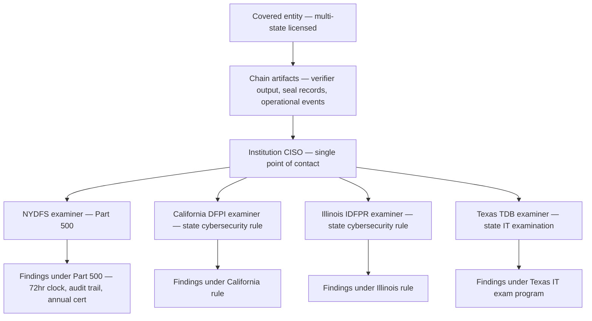

# Reina Castellanos — NYDFS Part 500 First-Look Review of FFIEC chain-of-custody v1.0a
**Date:** 2026-05-07
**Reviewer:** Reina Castellanos, Senior Examiner, NYDFS Cybersecurity Division
**Posture:** First encounter with v1.0a. American specification reviewed through the lens of 23 NYCRR Part 500 (cybersecurity), Part 504 (transaction-monitoring/filtering attestations), and Part 600 (virtual currency), with cross-jurisdictional coordination experience with California DFPI, Illinois IDFPR, and Texas TDB on multi-state examinations.

## Initial supervisory impression

The spec is technically sound. The cryptography is not ordinary — a per-event HMAC chain under HKDF-derived session keys, a daily Merkle aggregation under FIPS 180-4 SHA-256, an Ed25519 daily seal under FIPS 140-2 Level 3 custody, and a verifier that runs offline from a single binary against a pinned test-vector corpus is more discipline than I usually see at v1.0. The §1.1 *Daubert* posture and the §1.2 epistemic-scope statement are the kind of language an IT witness should be able to lift directly into a deposition. I would accept the integrity claim on the merits.

What I cannot accept — and where the work remains — is the institutional-articulation layer for state prudential supervision. The spec orients around FFIEC member-agency expectations and the EU's GDPR/DORA framework. NYDFS Part 500 expectations are absent from the regulator pack. Every New-York-licensed bank, state-chartered trust company, money transmitter operating under Article 13-B, BitLicense entity under Part 200, and DFS-supervised insurance entity will need that articulation before a state examination would close cleanly. The DORA articulation overlay is 608 lines. The Part 500 articulation does not exist. That asymmetry is the single biggest gap.

On the multi-state examiner-cooperation dimension — where my agency, DFPI, IDFPR, and TDB do most of our coordination work — the spec has no framing at all. The verifier runs offline from a single binary, which is excellent for one examiner; it says nothing about how four examiners reading the same artifact in parallel reconcile findings. Not a deal-breaker, but a gap.

## Findings

### Gaps

**G-1. No 23 NYCRR Part 500 articulation overlay analogous to the DORA overlay.**
**Section/file:** `docs/regulator-pack/` (overall); compare `dora-articulation-overlay.md` (608 lines) and the GDPR document set (eleven files).
**Regulatory citation:** 23 NYCRR Part 500 in entirety; companion regimes in California DFPI, Illinois IDFPR, Texas TDB, and ~25 additional states that adopted the NAIC Insurance Data Security Model Law or the Part 500 framework as a template.
**Issue:** Every New-York-licensed institution adopting the chain will be examined under Part 500 by my agency as primary or co-primary cybersecurity supervisor. Part 500 is binding; FFIEC handbook guidance is not. The chain's evidence outputs map onto Part 500 sections cleanly — verifier output is direct §500.06 audit-trail evidence, the daily seal cadence and 60-minute SLA are §500.06(a)(2)/(b) integrity-control evidence, the operational-event catalog feeds §500.16(d) — but the mapping is not written down. An examiner opening this artifact would construct the Part 500 crosswalk from scratch per institution. The crosswalk should ship in the regulator pack.
**What would close it:** A `docs/regulator-pack/nydfs-part-500-overlay.md` of comparable shape and depth to the DORA overlay. At minimum: a section per Part 500 section, naming the chain artifact (verifier output, operational event class, control-evidence event, audit procedure P-N, CUEC) that supports the institution's compliance evidence. The headline mapping is §500.06 (audit trail). The high-leverage neighbors are §500.04 (CISO reporting), §500.06 (audit trail), §500.09 (risk assessment), §500.11 (third-party service-provider security policy), §500.15 (encryption of NPI), §500.16 (IR plan), and §500.17 (notices and annual certification). The remaining sections (§500.02, .03, .05, .07, .08, .10, .12, .13, .14, .19, .22) are mostly institution-side controls where the chain is a supporting input rather than the headline. The §500.17(b) annual certification is the binding deliverable my division reads first; that section deserves its own anchor in the overlay.

**G-2. No NYDFS 72-hour notification clock in the breach-notification-matrix.**
**Section/file:** `docs/regulator-pack/breach-notification-matrix.md` §1 (the four-clock table); `docs/incident-response-playbook.md` "Multi-jurisdiction clock-start handling" section.
**Regulatory citation:** 23 NYCRR §500.17(a) — notice to superintendent within 72 hours of a cybersecurity event affecting the institution's information systems if the event has a reasonable likelihood of materially harming any material part of the normal operations of the covered entity, OR triggers notification to any government body, self-regulatory agency, or supervisory body. Companion clocks: California Civil Code §1798.82 ("most expedient time possible and without unreasonable delay"); New York General Business Law §899-aa ("most expedient time possible and without unreasonable delay"); Illinois Personal Information Protection Act 815 ILCS 530/10 ("most expedient time possible"); Texas Business and Commerce Code §521.053 (60 days from determination).
**Issue:** The matrix lists four primary clocks: HIPAA 60 days, FFIEC 36 hours, GDPR 72 hours, DORA 24 hours. Its footnote dismisses state law as "not the binding floor here." For a covered entity under Part 500, the 72-hour notification to the superintendent IS a binding floor — a missed notification is itself a Part 500 violation independent of the underlying event, and the §500.17(a) clock binds at the same moment of incident determination as the FFIEC 36-hour clock. The IR playbook's worked example for "US-state-only" uses the phrase "state-side cadence per state-banking-regulator timing" — too vague to use. An IR commander at 02:00 during a chain-integrity incident cannot derive the right clock from that.
**What would close it:** Add NYDFS §500.17(a) as a primary clock in the four-clock table (it becomes a five-clock table). Add the companion state clocks in a sub-table for the state-cybersecurity laws modeled on Part 500. Update the IR playbook's regulatory-footprint matrix so the "US-state-only" and "Multi-jurisdiction (US-federal AND state-chartered)" rows name 23 NYCRR §500.17(a) explicitly and resolve the binding-floor question for each. The simultaneous-notification rule in §3 of the breach-notification matrix already has the right shape — it just needs the NYDFS clock plumbed in. The §500.17(a) clock starts at the institution's determination that the event has the reasonable-likelihood-of-material-harm property; the operational meaning is the same "T0" the matrix already defines.

**G-3. No Part 500.17(b) annual certification scaffolding tied to chain artifacts.**
**Section/file:** `docs/audit-procedures.md`; `docs/templates/soc2-section3-description-of-system.md`; the (missing) Part 500 overlay.
**Regulatory citation:** 23 NYCRR §500.17(b) — covered entity must annually submit a written statement to the superintendent certifying that the entity is in compliance with Part 500. The certification must be signed by the senior officer or the board (or appropriate committee) and is filed by April 15 each year covering the prior calendar year.
**Issue:** The annual certification is the document my division reads first when an institution comes up for examination — the institution's positive assertion that its cybersecurity program operated through the prior calendar year. It is signed personally by the senior officer or the board chair; a false certification has implications under New York Executive Law and potentially under the SHIELD Act. The chain produces excellent attestable evidence the senior officer can rely on (verifier output, reconciliation events per spec §10.1, seal-publication SLA evidence per P-30, the operational-event stream) — but no document walks the senior officer's drafting team through which chain artifacts support which Part 500 section's certification claim. An institution shipping this chain into NYDFS-supervised production today would construct that mapping from first principles.
**What would close it:** A `docs/regulator-pack/nydfs-annual-certification-evidence.md` (or a §10 within the G-1 overlay) listing each Part 500 section the certification covers, the chain artifact that supports it, the audit procedure that tested it during the period, and the institution-side artifact custodian. The shape parallels the SOC2 Section 3 control-mapping table — section, control description, evidence — oriented to Part 500. The senior officer's signature memo cites this mapping.

**G-4. No Part 500.11 third-party service-provider security policy mapping for vendor-hosted ledger and HSM topology.**
**Section/file:** `docs/vendor-hosted-controls.md`; `docs/vendor-conformance-attestation.md`; `docs/regulator-pack/dora-articulation-overlay.md` (the DORA Article 28-30 overlay that should have a Part 500.11 sibling).
**Regulatory citation:** 23 NYCRR §500.11 — covered entity must implement written policies and procedures designed to ensure the security of information systems and nonpublic information that are accessible to, or held by, third-party service providers. The policy must address (a) identification and risk assessment of TPSPs, (b) minimum cybersecurity practices required of TPSPs, (c) due diligence processes, (d) periodic assessment based on the risk presented and the continued adequacy of TPSP cybersecurity practices, (e) representations and warranties addressing the TPSP's cybersecurity policies and procedures.
**Issue:** A covered entity using a vendor-hosted ledger and HSM (the topology at `docs/templates/soc2-section3-description-of-system.md` §3.2.C) is engaging a TPSP that holds nonpublic information — chain entries contain prompt content, response content, and routing decisions that may be NPI under §500.01(g). Section 500.11 binds the institution to the five-element written policy. The vendor-conformance-attestation framework is exactly the objective mechanism the institution would lean on for the (b) minimum-cybersecurity-practices and (d) periodic-assessment requirements — but no document frames it as a Part 500.11 artifact. The DORA overlay handles the European parallel; the Part 500.11 sibling is missing.
**What would close it:** A section of the G-1 overlay walking the five §500.11 elements against the chain's vendor-hosted topology. The vendor-conformance attestation's annual validation (CUEC-VND-06) is the §500.11(d) periodic-assessment artifact; the vendor's published public-key URL (CSOC-VND-07) is the §500.11(b) minimum-practices evidence; the receiver-policy discovery endpoint is what the (e) representations-and-warranties clause would point at. The mapping is straightforward; the document does not exist yet.

**G-5. No multi-state examiner cooperation framework for parallel state examinations.**
**Section/file:** `docs/regulator-pack/examiner-training.md`; `docs/audit-procedures.md` "Coordination with FFIEC examination" subsection.
**Regulatory citation:** Multi-state state-banking examination compacts under the Conference of State Bank Supervisors (CSBS) Nationwide Cooperative Agreement (NCA); the NMLS supervisory framework for state-licensed money transmitters; §500.19 exemptions where a covered entity is also subject to another state's cybersecurity rule (the institution may rely on the more stringent regime's compliance).
**Issue:** A covered entity in New York is frequently also licensed in California, Illinois, Texas, Florida, and elsewhere. When my agency examines under Part 500, DFPI, IDFPR, TDB, and others examine in parallel — sometimes through a coordinated NCA exam, sometimes independently. The audit-procedures doc has a clean "Coordination with FFIEC examination" subsection but no analogous subsection for parallel state examinations. Four examiners reading the same chain artifacts may produce four different findings without a shared framework, and each examiner ends up mapping the artifacts to the home-state regime independently. That is duplicative work for the institution and risks inconsistent results across cooperating supervisors.
**What would close it:** A subsection of `docs/audit-procedures.md` titled "Coordination across multi-state examinations" listing (a) jurisdiction-neutral chain artifacts (verifier output, seal records, operational events), (b) artifacts requiring jurisdiction-specific interpretation (incident-notification timing, certification evidence), and (c) a recommended sequence when multiple state examinations open simultaneously (CISO as single cybersecurity-program lead; one evidence package serves all examiners; jurisdiction-specific findings documented separately). Mostly framing language that lifts the FFIEC-coordination subsection's structure.

**G-6. No Part 504 transaction-monitoring/filtering attestation framing.**
**Section/file:** None directly; the closest is `docs/regulator-pack/finding-language.md` and the routing primitives at spec §4.4.1.
**Regulatory citation:** 23 NYCRR Part 504 (the BSA/AML and OFAC transaction-monitoring/filtering rule). Section 504.4 requires the senior officer to file an annual certification that the transaction-monitoring program and the filtering program operate as designed. Section 504.3 sets the program-design requirements.
**Issue:** Institutions adopting AI-driven decision systems will use the chain to capture AI-driven sanctions-screening decisions, AML triage decisions, and transaction-monitoring alert dispositions. The §4.4.1 routing-decision schema and the OTel GenAI semconv `gen_ai.*` attributes capture the right shape of evidence. Part 504's annual certification is a parallel deliverable to Part 500's, signed under similar penalty provisions, and an examiner reading a Part 504-certified institution's evidence will look for the same kind of integrity-bearing record the chain produces. The spec does not name Part 504 anywhere, and the regulator pack does not provide a Part 504 attestation overlay.
**What would close it:** A short overlay mapping the chain's routing-decision evidence (audit.routing.* schema), policy-version stamping (`audit.routing.policy_version`), and the customer-dispute reproduction evidence per P-27 to the Part 504.3 program-design requirements and the §504.4 attestation. Smaller than the Part 500 overlay; relevant to most large state-chartered banks, every money transmitter, and every BitLicense entity doing on-chain compliance screening.

### Partials

**P-1. Part 500.16 incident response plan exists implicitly in the IR playbook but is not cited as the binding source.**
**Section/file:** `docs/incident-response-playbook.md`.
**Regulatory citation:** 23 NYCRR §500.16 — covered entity must establish a written incident response plan addressing seven specific elements: (a) internal processes for responding, (b) goals of the IR plan, (c) definition of clear roles, responsibilities, and levels of decision-making authority, (d) external and internal communications and information sharing, (e) identification of requirements for remediation of identified weaknesses, (f) documentation and reporting of cybersecurity events and related incident response activities, (g) evaluation and revision as necessary of the IR plan following a cybersecurity event.
**Issue:** The IR playbook reads, in places, as if it could be lifted directly into a Part 500.16 written IR plan — Scenarios 7-9, the multi-jurisdiction clock matrix, the HSM tamper-detection integration, the post-event update cadence. All seven §500.16 elements are present in some form. What is missing is a section at the top of the playbook that says "this document, when adopted by the institution, satisfies the seven-element requirement of §500.16(a) through (g) for the chain-of-custody portion of the institution's IR program." Without that statement, the CISO has to make the argument independently. With it, the CISO points at the seven elements and is done.
**What would close it:** Add a section near the top of `docs/incident-response-playbook.md` titled "Part 500.16 mapping" with a seven-row table — one row per §500.16(a) through (g) element — and the corresponding section of the playbook that satisfies it. Pair with a similar table for analogous state IR-plan rules where the playbook content addresses them.

### Confirmations

**C-1. The verifier-output evidence shape is appropriate for §500.06 audit-trail evidence.**
**Section/file:** `spec/chain-of-custody-v1.md` §7; `docs/design/07-verifier-design.md`.
**Confirmation:** The verifier produces deterministic PDF + JSON output from a single binary running offline against a pinned conformance corpus. An examiner from my division can run it independently against archived chain bytes and reproduce the institution's verification result without trusting the institution's logging infrastructure. That is a stronger evidentiary posture than vendor-hosted log-aggregation tools usually produce. I would accept the verifier output as primary evidence for §500.06(a)(2). The Ed25519 daily seal under FIPS 140-2 Level 3 custody composes alongside this as supporting evidence for §500.15 when chain entries are NPI under §500.01(g), and the §10.1 weekly key-fingerprint reconciliation cadence (with the `master.reconciliation_completed` operational event as audit-evidence artifact) is appropriate for the §500.06 detection portion and the §500.16(a) trigger portion at small-and-mid-sized covered entities.

## A multi-state examination diagram

How the chain's evidence flows in a parallel-examination scenario, for the spec authors to lift into the Part 500 overlay.

The institution's CISO operates as the single evidence custodian; the same chain artifacts feed all four examiners; jurisdiction-specific findings flow back through the CISO to the institution's remediation tracking.

## Posture

I would accept the chain's technical artifact as primary §500.06 audit-trail evidence in a Part 500 examination of a NYDFS-supervised covered entity, conditional on three deliverables before my division would close a first examination cycle cleanly:

**Condition 1 — A Part 500 articulation overlay in the regulator pack** (G-1). Without it, my examiners reconstruct the Part 500 crosswalk per institution per cycle. This is the binding condition and the largest gap in the artifact.

**Condition 2 — The breach-notification matrix names §500.17(a) as a primary clock** (G-2). The 72-hour clock to the superintendent is a binding regulatory floor for every NYDFS-supervised entity. The change is small and local to two documents.

**Condition 3 — The §500.17(b) annual certification has a chain-artifacts-mapping document** (G-3). This is what the senior officer or board chair will read when deciding whether to sign. The chain produces excellent evidence; the institution should not have to construct the mapping.

The other gaps (G-4 through G-6, P-1) are recoverable through the same Part 500 overlay G-1 produces, with localized additions per gap. None blocks the technical artifact's evidentiary value.

If those three conditions are met, my agency would accept the chain as primary evidence for §500.06 audit trails, supporting evidence for §500.11 and §500.15, and triggering evidence for §500.16 incident-response activation. The annual §500.17(b) certification would then operate against a documented evidence map rather than an ad-hoc binder.

I would not accept unconditionally as it ships today. The technical work is excellent; the state-prudential institutional layer is incomplete. The DORA articulation overlay is the proof point that the spec authors know how to do this work; doing it again for Part 500 is the same shape of work and is the closing condition.

I would not reject. The chain's integrity primitives are sound, the verifier is well-designed, the audit-procedures are testable, and the threat model is honest about its residual risks. The right call is acceptance subject to the three conditions named above. For multi-state examinations specifically, I would offer my division's cooperation in drafting the Part 500 overlay if the spec authors are open to it; the CSBS Nationwide Cooperative Agreement provides the procedural scaffolding and the chain's jurisdiction-neutral evidence shape provides the technical scaffolding.

— Reina Castellanos
NYDFS Cybersecurity Division
Senior Examiner
2026-05-07
