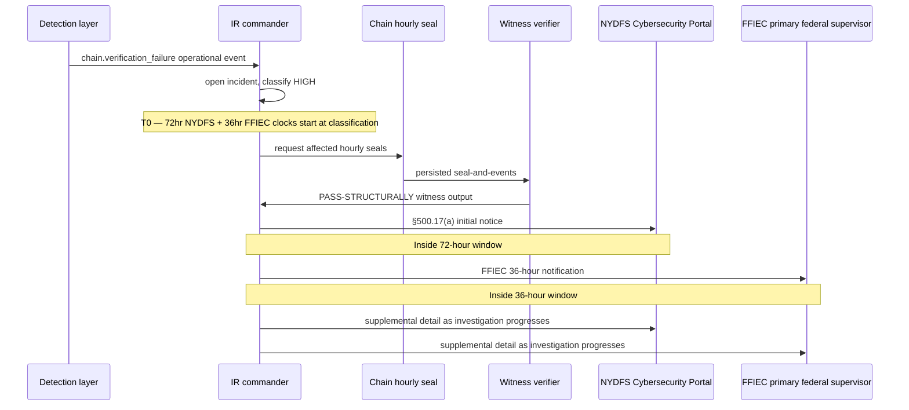
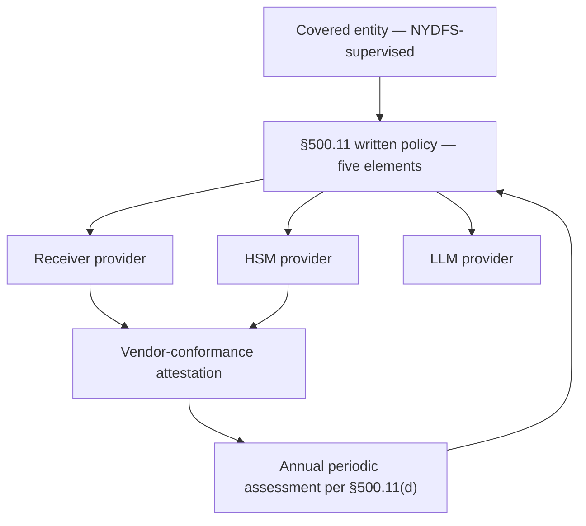
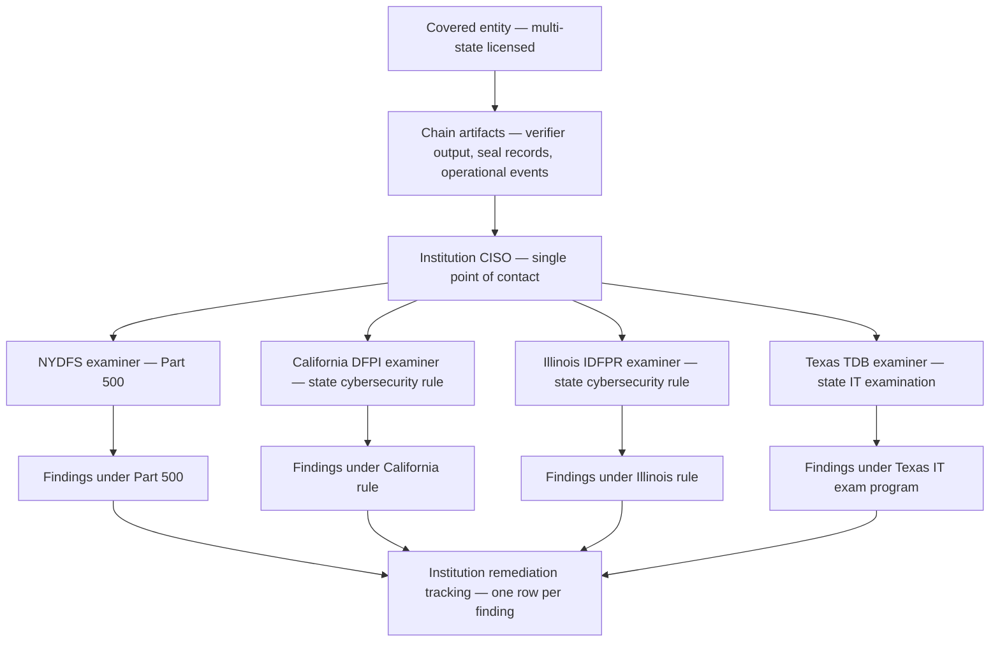

# NYDFS Part 500 / Part 504 / Part 600 Articulation Overlay

> **What this doc is.** A single articulation overlay that maps the FFIEC chain-of-custody v1.0a specification onto the New York State Department of Financial Services supervisory framework. Written so a NYDFS examiner, a covered entity's CISO, a senior officer or board member preparing the §500.17(b) annual certification, and a Part 504 BSA/AML certifying officer can read this document alongside the spec and confirm what the chain delivers, what it does not, and which artifact discharges which Part-500 / Part-504 / Part-600 obligation.

> **What this doc is NOT.** Not a normative extension to the v1.0a specification. Not a substitute for the institution's Part 500 written program documents. The integrity primitives in v1.0a are framework-neutral cryptographic constructs; the New-York-supervisory translation is an articulation overlay an institution layers on top, not a change to the underlying specification. Spec §1.2 (epistemic scope) is the discipline this document operates under: the chain proves what was said and that the record was not tampered with after capture; it does not prove the substantive correctness of the captured content. The overlay carries the same discipline — it maps integrity evidence to supervisory expectations; it does not claim the chain alone discharges the institution's substantive obligations under any New-York rule named here.

---

## 1. Scope and reading order

This overlay is consumed in five reading orders.

| Reader | Reading order |
|---|---|
| First-look NYDFS examiner | §2 (Part 500 section-by-section crosswalk) → §3 (§500.17(a) 72-hour clock) → §10 (§500.17(b) annual-certification evidence map) → §13 (bottom line) |
| Senior officer or board chair drafting the §500.17(b) certification | §10 (annual-certification evidence map) → §2 (section-by-section) → §11 (false-certification posture under New York Executive Law and SHIELD Act) |
| Part 504 BSA/AML certifying officer | §6 (Part 504 transaction-monitoring/filtering attestation framing) → §10 (parallel certification posture) |
| Multi-state covered entity (NY + CA + IL + TX + FL) | §7 (multi-state examiner cooperation framework) → §3 (NY clock) → cross-references to `breach-notification-matrix.md` and `multi-jurisdiction-conflict.md` |
| Vendor-hosted ledger / HSM topology team | §5 (Part 500.11 third-party service-provider mapping) → cross-reference to `vendor-conformance-attestation.md` |

The overlay does not duplicate material that already lives in adjacent regulator-pack documents. Cross-references are exact — if a section sends the reader to `dora-articulation-overlay.md` §4 for the four-clock simultaneous-notification rule, that document is the load-bearing source and this overlay names where the New-York clock fits in the picture.

---

## 2. Part 500 — section-by-section crosswalk

23 NYCRR Part 500 is the binding cybersecurity rule for every entity required to operate under DFS authorization, license, registration, or charter. The chain-of-custody artifacts feed Part 500 evidence at the section granularity below. The headline mapping is §500.06 (audit trail); the high-leverage neighbors are §500.04 (CISO reporting), §500.09 (risk assessment), §500.11 (third-party service-provider security policy), §500.15 (encryption of NPI), §500.16 (incident response plan), and §500.17 (notices and annual certification). The remaining sections are mostly institution-side controls where the chain is a supporting input rather than the headline. *(closes Castellanos G-1)*

### 2.1 Headline section — §500.06 audit trail

Section 500.06(a)(2) requires the covered entity to maintain audit trails designed to detect and respond to cybersecurity events that have a reasonable likelihood of materially harming any material part of the normal operations of the covered entity. The chain delivers the integrity-bound audit trail this section asks for.

| §500.06 sub-clause | Chain-of-custody evidence supporting compliance |
|---|---|
| (a)(1) Reconstruction of material financial transactions | Per-event chain entries record the AI's prompts, the AI's responses, the routing decisions that selected providers, and the institution's operational state at the moment of decision (spec §4.1, §4.4) |
| (a)(2) Audit trails to detect and respond to cybersecurity events | Daily Merkle seal under HSM signature (spec §4.2, §4.3); operational events under spec §10.2; verifier exit-code contract (spec §10.12); §10.1 weekly key-fingerprint reconciliation cadence |
| (b) Maintenance for not fewer than three years for (a)(1) and not fewer than five years for (a)(2) | Spec §10.13 evidentiary-artifact retention; `retention-justification.md` "longer of" rule reaches a composite 7-year period that exceeds both Part 500 floors |

The verifier's twelve-step ordered procedure and the byte-for-byte normative failure-reason strings (spec §7) are the operational discipline a Part 500 examiner runs against retained artifacts. An examiner from the Cybersecurity Division can run the verifier independently against archived chain bytes and reproduce the institution's verification result without trusting the institution's logging infrastructure — that is a stronger evidentiary posture than vendor-hosted log-aggregation tools usually produce. The verifier output is direct §500.06(a)(2) audit-trail evidence.

### 2.2 §500.02 — Cybersecurity program

Section 500.02 requires the covered entity to maintain a cybersecurity program designed to protect the confidentiality, integrity, and availability of its information systems. The chain is one component of the program for the AI-decision class of records.

| §500.02 sub-clause | Chain artifact |
|---|---|
| (a) Identification of internal and external risks | Threat model at design 09; risk-assessment input at §500.09 below |
| (b) Use of defensive infrastructure | Three-layer integrity construction (per-event MAC §4.1, daily Merkle seal §4.2, HSM Ed25519 signature §4.3); FIPS 140-2 Level 3 HSM custody (spec §10.5) |
| (c) Detection of cybersecurity events | Operational events under spec §10.2; `chain.verification_failure`, `audit_file.truncation_detected`, `hsm.operation_failure` |
| (d) Response, including mitigation and recovery | IR playbook (`docs/incident-response-playbook.md`); §500.16 mapping at §2.7 below |
| (e) Fulfillment of regulatory reporting obligations | §500.17(a) clock at §3 below; breach-notification matrix |

### 2.3 §500.03 — Cybersecurity policy

Section 500.03 requires written policies approved by the senior officer or the board addressing fourteen specified topics. The institution's CC8.1 control description (per `templates/soc2-section3-description-of-system.md`) is the load-bearing artifact; the chain integrity-binds the operational evidence that demonstrates each policy is observed in practice. The chain is supporting evidence, not the policy itself.

### 2.4 §500.04 — Chief Information Security Officer

Section 500.04(a) requires designation of a qualified CISO. Section 500.04(b) requires the CISO to report in writing at least annually to the senior officer or the board on the cybersecurity program and material cybersecurity risks. The chain produces the integrity-bearing operational record the CISO's annual report rests on.

| §500.04 sub-clause | Chain artifact |
|---|---|
| (a) Designation of qualified CISO | Institution-side; the chain does not produce evidence on this clause |
| (b)(1) Confidentiality of NPI and integrity / security of information systems | §500.15 mapping at §2.10 below; verifier output covering the period |
| (b)(2) Cybersecurity policies and procedures | §500.03 mapping at §2.3 above |
| (b)(3) Material cybersecurity risks to the covered entity | Operational events from spec §10.2 covering the reporting period; aggregated `chain.verification_failure` count is a direct §500.04(b)(3) input |
| (b)(4) Overall effectiveness of the cybersecurity program | Verifier PASS/FAIL ratio over the period; control-evidence events from `soc-pack/control-evidence-events.md` |
| (b)(5) Material cybersecurity events involving the covered entity during the time period | Operational events stream filtered to material classifications; integrity-bound under the chain |

The CISO's written report cites the verifier-output bundles for the reporting period and the operational-event aggregations as the primary evidence. The board or senior officer reading the report sees integrity-bound evidence rather than narrative-only attestation.

### 2.5 §500.05 — Penetration testing and vulnerability assessments

Section 500.05 requires annual penetration testing and bi-annual vulnerability assessments. Penetration-test evidence flows into the chain through the segregated TLPT routing pattern (cross-reference `dora-articulation-overlay.md` §5.2 — the same attribute-flagged routing pattern serves both DORA TLPT and Part 500 penetration testing). The institution's CC8.1 names the TLPT chain's retention bucket and the access-control separation between the red-team engagement and the production operations team.

### 2.6 §500.09 — Risk assessment

Section 500.09 requires the covered entity to conduct a periodic risk assessment of its information systems. The chain's threat model (design 09), the JCS edge-case test corpus (spec test-vector 008), and the verifier's twelve-step procedure are the technical inputs the risk assessment consumes. The institution's risk-assessment document cites these artifacts and reaches the institution-specific risk posture.

The chain does not run the risk assessment. The chain produces the integrity-bearing input the risk assessment uses to reach its conclusions.

### 2.7 §500.16 — Incident response plan

Section 500.16 requires a written IR plan addressing seven specified elements. The IR playbook at `docs/incident-response-playbook.md` is the institution's IR-plan substrate; this overlay names the seven-element mapping the institution adopts when claiming Part 500.16 compliance. *(closes Castellanos P-1)*

| §500.16 element | IR playbook section satisfying it |
|---|---|
| (a) Internal processes for responding to a cybersecurity event | "Detection and triage" section; the operational-event taxonomy under spec §10.2 |
| (b) Goals of the IR plan | "Goals" section at the top of the playbook |
| (c) Definition of clear roles, responsibilities, and levels of decision-making authority | "Roles and responsibilities" section; CISO, IR commander, chain operations lead, HSM administrator, legal counsel, records officer |
| (d) External and internal communications and information sharing | "Communications" section; the multi-jurisdiction notification matrix at `breach-notification-matrix.md` |
| (e) Identification of requirements for remediation of identified weaknesses | "Recovery and remediation" section; the verifier-driven re-validation pass after recovery |
| (f) Documentation and reporting of cybersecurity events and related IR activities | The chain itself; `incident.opened`, `incident.classification_committed`, `incident.recovery_committed` operational events; integrity-bound under the daily seal |
| (g) Evaluation and revision of the IR plan following a cybersecurity event | "Post-incident review" section; lessons-learned cadence with named owner |

The institution adopting the IR playbook as its Part 500.16 written plan adds the table above to the playbook's preamble — "this document, when adopted by the institution, satisfies the seven-element requirement of §500.16(a) through (g) for the chain-of-custody portion of the institution's IR program." With that statement and the table, the CISO points at the seven elements and the §500.16 obligation is closed.

### 2.8 §500.17(a) — Notice to superintendent

The 72-hour clock to the superintendent is treated separately at §3 below.

### 2.9 §500.17(b) — Annual certification

The annual certification scaffolding tied to chain artifacts is treated separately at §10 below.

### 2.10 §500.15 — Encryption of nonpublic information

Section 500.15 requires encryption of NPI in transit over external networks and at rest. Chain entries containing prompt content, response content, demographic-attribute hashes, or routing decisions may carry NPI under §500.01(g). The chain-side disciplines:

| §500.15 sub-clause | Chain artifact |
|---|---|
| (a) NPI in transit over external networks | OTLP transport over TLS 1.3 (spec §5.1, §4.4); receiver provider's mTLS or equivalent |
| (b) NPI at rest | Institution's encryption-at-rest posture; `article-32-security-mapping.md` covers the GDPR Article 32 / EBA §14 parallel; the institution's ledger storage encryption policy applies in parallel |
| Compensating controls where encryption is infeasible | The Ed25519 daily seal under FIPS 140-2 Level 3 custody (spec §10.5) is integrity-confidentiality-adjacent — it does not encrypt the NPI but it integrity-binds whatever the institution captured, which is a §500.15 compensating-control input |

The chain's HSM-bound seal signature is supporting evidence for §500.15 when chain entries are NPI under §500.01(g).

### 2.11 Other Part 500 sections

The remaining Part 500 sections are mostly institution-side controls where the chain is a supporting input. Brief mappings:

| Section | Chain's contribution |
|---|---|
| §500.07 Access privileges | HSM separation-of-duties roster (spec §10.5); `master.*` operational events showing privileged actions |
| §500.08 Application security | The chain SDK's secure-development lifecycle (vendor-conformance attestation; supply-chain document) |
| §500.10 Cybersecurity personnel and intelligence | CISO's annual report under §2.4 above |
| §500.12 Multi-factor authentication | Institution-side authentication; the chain integrity-binds operator activity through the operator-identity attribute on operational events |
| §500.13 Limitations on data retention | Spec §10.9 IKM retention coupling; `retention-justification.md` 7-year composite period; symmetric hold-release procedure (cross-reference `templates/records-management-program.md`) |
| §500.14 Training and monitoring | `examiner-training.md` and the institution's cybersecurity-training program |
| §500.19 Exemptions | Where a covered entity is also subject to another state's cybersecurity rule, the institution may rely on the more stringent regime's compliance — this overlay's §7 multi-state cooperation framework operates against this exemption mechanism |
| §500.22 Effective date | Compliance dates are institution-specific; the chain is current with v1.0a as of this overlay's date |

---

## 3. §500.17(a) 72-hour notification clock

23 NYCRR §500.17(a) requires notice to the superintendent within 72 hours of a cybersecurity event affecting the institution's information systems if the event has a reasonable likelihood of materially harming any material part of the normal operations of the covered entity, OR triggers notification to any government body, self-regulatory agency, or supervisory body. For a covered entity under Part 500, the 72-hour clock IS a binding regulatory floor — a missed notification is itself a Part 500 violation independent of the underlying event. *(closes Castellanos G-2)*

### 3.1 Plumbing the §500.17(a) clock into the breach-notification matrix

The breach-notification matrix at `docs/regulator-pack/breach-notification-matrix.md` lists primary clocks for federal, EU, and state-by-state notification regimes. The §500.17(a) clock is added as a primary clock — the matrix becomes a five-clock table for any covered entity dual-supervised under FFIEC, GDPR/DORA, and NYDFS.

| Clock | Trigger | Window |
|---|---|---|
| FFIEC | Notification incident determination | 36 hours |
| HIPAA | Discovery of breach | 60 days |
| GDPR Article 33 | Awareness of personal-data breach | 72 hours |
| DORA Article 19 | Major-incident classification (RTS) | 4 hours initial / 72 hours intermediate / 1 month final |
| **NYDFS §500.17(a)** | **Determination that the event has the reasonable-likelihood-of-material-harm property OR triggers any other supervisory notification** | **72 hours** |

The §500.17(a) clock starts at the institution's determination — the same "T0" the matrix already defines. The IR commander operating multiple clocks in parallel uses the simultaneous-notification rule from `breach-notification-matrix.md` §3 — notify the tightest deadline first, then the next-tightest, with a consistent narrative across all notifications.

### 3.2 Companion state clocks

A covered entity multi-licensed across NY plus other states operates against companion state clocks. The chain-of-custody evidence shape is jurisdiction-neutral — the same verifier output supports notification under each. The clocks themselves differ:

| State | Clock | Source |
|---|---|---|
| New York (NYDFS) | 72 hours | 23 NYCRR §500.17(a) |
| New York (general business) | "Most expedient time possible and without unreasonable delay" | NY GBL §899-aa |
| California | "Most expedient time possible and without unreasonable delay" | Cal. Civ. Code §1798.82 |
| Illinois | "Most expedient time possible" | 815 ILCS 530/10 |
| Texas | 60 days from determination | Tex. B. & C. Code §521.053 |
| Florida | 30 days | Fla. Stat. §501.171 |
| ~25 additional states modeled on Part 500 framework | Generally 72 hours | NAIC Insurance Data Security Model Law (#668) and state-by-state adoptions |

The IR runbook's regulatory-footprint matrix names each state row — "US-state-only" and "Multi-jurisdiction (US-federal AND state-chartered)" — and resolves the binding-floor question for each. The §500.17(a) clock is the binding floor for any New-York-licensed institution and operates in parallel with whichever state-level clocks apply.

### 3.3 Worked example — §500.17(a) clock against an integrity anomaly

The institution detects a `chain.verification_failure` operational event at 14:30 ET on a Tuesday. The IR commander opens the incident at 14:34 ET. Classification committed at 15:18 ET under the institution's CRITICAL/HIGH/MEDIUM/LOW policy: HIGH (a chain-integrity anomaly affecting credit-decisioning evidence with a reasonable likelihood of material harm).

- **At 15:18 ET** — the §500.17(a) 72-hour clock starts at classification commit
- **At 15:18 ET** — the FFIEC 36-hour clock also starts (the institution is dual-supervised)
- **At 17:00 ET** — the institution's CISO notifies the senior officer
- **At 19:30 ET** — the institution files the §500.17(a) initial notice through the NYDFS Cybersecurity Portal
- **At 22:00 ET** — the institution files the FFIEC 36-hour notification through the appropriate federal channel (whichever applies given the institution's primary federal supervisor — OCC, FRB, or FDIC)
- **At 15:18 ET + 72 hours (Friday 15:18 ET)** — the §500.17(a) clock closes; the institution has discharged the initial-notification obligation
- **At 15:18 ET + 36 hours (Wednesday 03:18 ET)** — the FFIEC clock closes; the institution has discharged the federal initial-notification obligation

The two clocks are filed against the same incident with consistent narratives. The chain's witness-mode verifier output (spec §7) is the load-bearing initial-evidence artifact for both — the integrity-bearing record showing what the institution detected and when.

### 3.4 Sequence diagram — §500.17(a) and FFIEC clocks operating in parallel

The flow assumes hourly cadence per spec §4.2.1 for any tenant in scope of major-incident classification under either regime. Daily-cadence deployments cannot meet the FFIEC 36-hour clock cleanly; the institution's cadence selection is the load-bearing operational decision under dual-supervision.

---

## 4. §500.04 CISO reporting under the chain

Section 500.04(b) requires the CISO to report to the senior officer or the board at least annually. The chain produces the operational-evidence aggregations that feed each report element.

### 4.1 The CISO's annual report sourced from the chain

| §500.04(b) element | Chain-sourced aggregation |
|---|---|
| (b)(1) Confidentiality, integrity, security of information systems | Verifier PASS/FAIL ratio over the reporting year; operational-event count by class; HSM operation success rate (`hsm.operation_failure` count) |
| (b)(2) Cybersecurity policies and procedures | Cross-reference to §500.03 and the institution's CC8.1 control description |
| (b)(3) Material cybersecurity risks | Aggregated `chain.verification_failure` count; root-cause classification of each anomaly; threat-model residual-risk update from design 09 |
| (b)(4) Overall effectiveness of the cybersecurity program | The institution's audit-procedures findings (`docs/audit-procedures.md`); the §10.1 weekly key-fingerprint reconciliation success rate; the seal-publish-SLA evidence per audit procedure P-30 |
| (b)(5) Material cybersecurity events during the time period | Material-events stream from the operational-event taxonomy filtered to the institution's CRITICAL/HIGH/MEDIUM/LOW threshold |

The CISO's working draft cites the verifier-output bundles for each quarter of the reporting year, the operational-event aggregations, and the audit-procedures findings. The board or senior officer reading the report sees integrity-bound evidence rather than narrative-only attestation. The §500.04(b) report is itself a supporting artifact for the §500.17(b) annual certification.

### 4.2 Mid-year material-event reporting

When a material cybersecurity event occurs mid-year, the CISO reports to the senior officer or the board promptly. The chain's operational-event stream produces the integrity-bound record the report cites. The 72-hour superintendent clock (§3 above) runs in parallel.

---

## 5. §500.11 third-party service-provider security policy mapping

Section 500.11 requires written policies and procedures designed to ensure the security of information systems and NPI accessible to or held by third-party service providers. The institution operating a vendor-hosted ledger and HSM topology engages TPSPs that hold NPI; the §500.11 five-element written policy applies. *(closes Castellanos G-4)*

### 5.1 The five §500.11 elements against the vendor-hosted topology

| §500.11 element | Chain artifact / contractual artifact |
|---|---|
| (a) Identification and risk assessment of TPSPs | The institution's TPSP register names the receiver provider, the HSM provider, and the LLM provider (cross-reference `dora-articulation-overlay.md` §2.1 for the four-party lattice; the same lattice applies under §500.11) |
| (b) Minimum cybersecurity practices required of TPSPs | The vendor-conformance attestation framework (`docs/vendor-conformance-attestation.md`) is the operational evidence of minimum-practices compliance; CSOC-VND-07 names the vendor's published public-key URL as the load-bearing artifact |
| (c) Due diligence processes evaluating cybersecurity practices | The institution's vendor-management procedure consumes the vendor's SOC 2 Type II report, FIPS validation certificates, and the chain-conformance attestation |
| (d) Periodic assessment based on risk presented and continued adequacy of TPSP cybersecurity practices | CUEC-VND-06 names the annual validation of the vendor-conformance attestation; this is the §500.11(d) periodic-assessment artifact |
| (e) Representations and warranties addressing the TPSP's cybersecurity policies and procedures | The contractual representations the institution requires from the TPSP; the receiver-policy discovery endpoint (spec §4) is what the (e) representations-and-warranties clause points at for the receiver provider specifically |

### 5.2 Vendor-hosted ledger topology — the §500.11 view

A covered entity operating with a vendor-hosted ledger and HSM (the topology at `templates/soc2-section3-description-of-system.md` §3.2.C) carries §500.11 obligations against three providers in parallel.

| Provider | §500.11 contractual posture |
|---|---|
| Receiver / ledger provider | Five-element written policy applies; vendor-conformance attestation is the operational evidence; receiver-policy discovery endpoint surfaces the audit-rights URI |
| HSM provider | Five-element written policy applies; FIPS 140-2 Level 3 custody attestation is the operational evidence; the contract names the separation-of-duties roster per spec §10.5 |
| LLM provider | Five-element written policy applies; the institution's RoPA names the LLM provider as a sub-processor where personal data flows; the `audit.deployment.intent` field (spec §4.4.2) distinguishes deliberate vendor-managed model rollouts from silent vendor reroutes the institution did not authorize |

The chain does NOT change the contractual obligations the institution holds with each provider; the chain produces the audit trail that lets the institution, the NYDFS examiner, and any auditor appointed by the supervisor verify that the contractual obligations are observed in operation.

### 5.3 The Part 500.11 vendor-hosted flow

The annual evaluation feeds back into the written policy under §500.11(a) — the TPSP register and risk assessment are kept current as the vendor relationships evolve.

---

## 6. Part 504 transaction-monitoring/filtering attestation framing

23 NYCRR Part 504 governs BSA/AML and OFAC transaction-monitoring/filtering programs for state-chartered banks, money transmitters, and BitLicense entities. Section 504.4 requires the senior officer to file an annual certification that the transaction-monitoring program and the filtering program operate as designed. Section 504.3 sets the program-design requirements. *(closes Castellanos G-6)*

### 6.1 The Part 504 program-design requirements against chain-bound AI decisions

Institutions adopting AI-driven decision systems will use the chain to capture AI-driven sanctions-screening decisions, AML triage decisions, and transaction-monitoring alert dispositions. The §4.4.1 routing-decision schema and the OTel GenAI semconv `gen_ai.*` attributes capture the right shape of evidence for §504.3 program-design and §504.4 attestation.

| §504.3 design requirement | Chain artifact |
|---|---|
| (a) Risk-based identification of transactions requiring monitoring | `audit.routing.policy_version` stamping; the routing decision identifies which monitoring policy applied to each transaction |
| (b) Detection of activity that meets identified BSA/AML and OFAC criteria | The AI-decision entry's `gen_ai.completion.text` (or its hash where CC8.1 declares hash-only retention) records the model's screening output |
| (c) Investigations and dispositions of alerts | The customer-dispute reproduction evidence per audit procedure P-27; the `audit.routing.outcome` attribute on each routing decision |
| (d) Periodic validation of the program's logic | Annual conformance-corpus runs against the chain's verifier; the audit-procedures findings (`docs/audit-procedures.md`) for the period |
| (e) Documentation of the program's operation | The chain itself; integrity-bound under the daily seal; retention per spec §10.13 |

### 6.2 §504.4 annual certification

The §504.4 certification is signed by the senior officer responsible for the institution's BSA/AML compliance. It parallels the §500.17(b) certification — same penalty provisions, same April-15 filing cadence, same load-bearing role for the senior officer's signature.

The chain's evidence supporting §504.4:

| §504.4 attestation element | Chain artifact |
|---|---|
| The transaction-monitoring program operates as designed | The integrity-bound chain entries covering the reporting period; the verifier PASS rate for the period |
| The filtering program operates as designed | Same |
| The institution has documented the program's operation | The chain entries themselves plus the operational events |
| The institution validates the program periodically | The conformance-corpus runs; the audit-procedures findings |

The senior officer signing §504.4 cites the chain's evidence aggregation through the same scaffolding §500.17(b) uses (§10 below). The two certifications can share an evidence-mapping document; the senior officer reviews one map and signs both certifications against it.

### 6.3 Part 504 scope across NYDFS-supervised entities

Part 504 binds:

- Every bank or trust company chartered under New York Banking Law
- Every money transmitter operating under New York Banking Law Article 13-B
- Every BitLicense entity under 23 NYCRR Part 200 (cross-reference to Part 600 below)
- Foreign banking corporations licensed by NYDFS to maintain a New-York branch or agency

For these entities, Part 504 attestation is parallel to Part 500.17(b) attestation; the chain's evidence supports both.

---

## 7. Multi-state examiner cooperation framework

A covered entity in New York is frequently also licensed in California, Illinois, Texas, Florida, and elsewhere. When NYDFS examines under Part 500, DFPI, IDFPR, TDB, and others examine in parallel — sometimes through a coordinated CSBS Nationwide Cooperative Agreement (NCA) exam, sometimes independently. *(closes Castellanos G-5)*

### 7.1 The CSBS NCA framework

The Conference of State Bank Supervisors operates the Nationwide Cooperative Agreement, a multi-state examination compact under which state banking supervisors coordinate examinations of multi-state-licensed institutions. The NCA framework names a lead state, supplementary states, and a shared examination scope. The chain's jurisdiction-neutral evidence shape composes with the NCA framework — the same verifier output supports findings under each state's home regime.

### 7.2 Jurisdiction-neutral chain artifacts

The chain produces three classes of jurisdiction-neutral evidence that any state examiner can consume without further translation.

| Class | Examples | Why neutral |
|---|---|---|
| Verifier output | Per-day verifier PDF + JSON; PASS/FAIL exit code; structural-walk evidence | The verifier procedure is deterministic and binary-equivalent across runs; no jurisdiction-specific interpretation is required to read the output |
| Seal records | The HSM-signed daily Merkle root; the Ed25519 signature; the public-key fingerprint | The cryptographic primitives are NIST-standardized; no jurisdiction-specific interpretation is required |
| Operational events | `chain.verification_failure`, `audit_file.truncation_detected`, `master.reconciliation_completed`, `incident.opened`, etc. | The taxonomy is institution-neutral and supervisor-neutral; the events describe the chain's operational lifecycle in primitive terms |

Each cooperating state examiner consumes the same evidence and reaches its home-regime finding from the same base. Four examiners reading the same artifacts produce four findings against four regimes, but the findings rest on a shared evidence package — duplicative work for the institution is avoided.

### 7.3 Artifacts requiring jurisdiction-specific interpretation

Three classes of artifacts require jurisdiction-specific interpretation; the institution provides the chain evidence and each examiner overlays their home-regime requirements.

| Class | Examples | Jurisdiction-specific layer |
|---|---|---|
| Incident-notification timing | The `chain.verification_failure` event timestamp; the institution's classification commit time | Each state applies its own clock — NY 72 hours, CA "expedient", IL "expedient", TX 60 days |
| Certification evidence | The senior officer's annual certification under each regime | NY §500.17(b); CA's analogous certification under the DFPI rule; IL's under the IPS rule; TX's under the IT-examination program |
| Encryption-of-NPI claims | The institution's encryption-at-rest posture | NY §500.15; CA's CCPA security requirements; state-specific NPI definitions |

For each class, the chain's evidence is the input; the examiner's home-regime requirement is the layer applied on top.

### 7.4 Recommended sequence when multiple state examinations open simultaneously

When NYDFS, DFPI, IDFPR, TDB, and other state supervisors open examinations against the same covered entity in the same period:

1. **CISO operates as single cybersecurity-program lead.** The institution's CISO is the single point of contact for cybersecurity-program inquiries from all examiners. Each examiner's specific questions go through the CISO; the institution's response is consistent across examiners.
2. **One evidence package serves all examiners.** The institution produces one chain-of-evidence package — verifier output for the examination period, the period's seal records, the period's operational events — and each examiner consumes the same package.
3. **Jurisdiction-specific findings documented separately.** Each examiner produces its own finding document against the institution. The institution's remediation tracking has one row per finding, with the originating examiner named.
4. **CSBS NCA framework for coordinated exams.** Where the exams are coordinated under NCA, the lead state's examination report references the supplementary states' findings. Where the exams are independent, each state's report stands alone.
5. **§500.19 exemption mechanism.** Where a covered entity is also subject to another state's cybersecurity rule, the institution may rely on the more stringent regime's compliance. The institution names which regime it relied on for which obligation; the cooperating supervisors review the reliance and either accept or reach a contrary finding.

### 7.5 The multi-state examination flow

The institution's CISO operates as the single evidence custodian; the same chain artifacts feed all four examiners; jurisdiction-specific findings flow back through the CISO to the institution's remediation tracking.

---

## 8. Part 600 — virtual currency business activity

23 NYCRR Part 600 (paired with Part 200 BitLicense) governs virtual-currency business activity in New York. The chain composes with Part 600 obligations the same way it composes with Part 500 — the integrity-bearing audit trail under §200.12(a) is the §500.06 audit-trail evidence shape.

### 8.1 BitLicense entity adopting the chain

A BitLicense entity adopting AI-driven decision systems for transaction screening, on-chain compliance, customer onboarding, or any other regulated activity captures those decisions in the chain. The chain entries are integrity-bound under the same three-layer construction; the BitLicense entity's §200.16 cybersecurity-program requirement is satisfied by the same Part 500 mapping at §2 above.

### 8.2 Part 600 / Part 200 specific overlays

| §200 / §600 section | Chain artifact |
|---|---|
| §200.12(a) Books and records | Per-event chain entries; daily seal records; retention per spec §10.13 (7-year composite period exceeds Part 200's record-keeping floor) |
| §200.16 Cybersecurity program | Cross-reference to §2 above (Part 500 cybersecurity program) — Part 200 incorporates Part 500's cybersecurity-program requirement by reference |
| §200.19 Disclosure of material risks | The chain's threat model (design 09); operational-event aggregations covering material-risk reporting |

### 8.3 Multi-state virtual-currency licensure

A virtual-currency entity licensed in NY plus other states (California's Digital Financial Assets Law, Wyoming's SPDI framework, Texas's money-transmission regime) operates against multi-state cooperation framework at §7 above. The NYDFS BitLicense overlay composes with the §500.11 vendor-hosted topology mapping at §5 above where the entity uses vendor-hosted custody.

---

## 9. State-cybersecurity-rule cousin regimes

Roughly twenty-five additional states have adopted the NAIC Insurance Data Security Model Law (#668) or the Part 500 framework as a template. The chain's Part 500 mapping at §2 above translates onto each by section-name correspondence. Brief notes on the largest cousin regimes:

| State | Rule | Notes |
|---|---|---|
| California | DFPI cybersecurity rule (in development) and CCPA security requirements (existing) | The DFPI rule is on a parallel track to Part 500; the CCPA security requirements are enforced through the California Privacy Protection Agency |
| Illinois | IPS cybersecurity rule (50 IAC Part 2052, modeled on Part 500) | Section-by-section correspondence to Part 500 makes the §2 mapping above directly translatable |
| Connecticut | Insurance Data Security Law (Public Act 19-117, modeled on NAIC #668) | Same insurance-sector cousin; the §2 mapping translates by section correspondence |
| New Hampshire | Insurance Data Security Law (modeled on NAIC #668) | Same |
| Ohio | Data Protection Act (modeled on NAIC #668) | Same |
| Mississippi | Insurance Data Security Law (modeled on NAIC #668) | Same |
| Indiana | Insurance Data Security Law (modeled on NAIC #668) | Same |
| Virginia, North Carolina, South Carolina, Tennessee, Alabama, Louisiana, etc. | NAIC-modeled state rules | Same |

The institution operating under multiple state cybersecurity regimes uses the §500.19 exemption mechanism (or the analogous mechanism in each cousin regime) to declare reliance on the most stringent regime's compliance. The chain's evidence is the same regardless; the regulatory layer above it differs by state.

---

## 10. §500.17(b) annual certification evidence map

The §500.17(b) annual certification is the document NYDFS reads first when an institution comes up for examination — the institution's positive assertion that its cybersecurity program operated through the prior calendar year. It is signed personally by the senior officer or the board chair; a false certification has implications under New York Executive Law and potentially under the SHIELD Act. The chain produces excellent attestable evidence the senior officer can rely on; this section is the document the senior officer's drafting team works against. *(closes Castellanos G-3)*

### 10.1 Filing cadence and binding character

| Element | Detail |
|---|---|
| Filing window | Annually by April 15 covering the prior calendar year |
| Signer | Senior officer or board (or appropriate committee) |
| Form | Written statement certifying compliance with Part 500 |
| Penalty for misstatement | New York Executive Law sanctions; potential SHIELD Act exposure; loss of license under 23 NYCRR Part 5 |
| Exception form | Section 500.17(b)(2) covers the case where the entity cannot certify compliance with Part 500 — the entity instead identifies the section(s) it has not complied with and the remediation plan |

### 10.2 The evidence map — Part 500 section to chain artifact

| Part 500 section | Certification claim | Chain artifact supporting the claim | Audit procedure that tested it during the period | Institution-side custodian |
|---|---|---|---|---|
| §500.02 Cybersecurity program | The institution maintains the program in (a) through (e) | Verifier PASS rate over the period; operational-event stream; threat-model design 09 | P-30 (seal-publish SLA); P-27 (customer-dispute reproduction) | CISO |
| §500.03 Cybersecurity policy | Written policies addressing 14 specified topics | CC8.1 control description; cross-reference to soc-pack | SOC 2 Type II testing per `audit-procedures.md` | CISO + chief compliance officer |
| §500.04 CISO | CISO designated and reporting | §500.04 mapping at §4 above; the CISO's written report for the period | The institution's senior-officer-or-board minutes recording receipt | Board secretary |
| §500.05 Penetration testing | Annual pen-test and bi-annual vulnerability assessment | Segregated TLPT chain (cross-reference §2.5 above); pen-test working paper | Pen-test firm's deliverable | CISO |
| §500.06 Audit trail | Audit trails per (a)(1) and (a)(2) maintained for required periods | Per-event chain entries; daily seals; spec §10.13 retention | P-1 through P-26 (chain-integrity audits) | Chain operations lead + records officer |
| §500.07 Access privileges | Access privileges limited and reviewed | HSM separation-of-duties roster; `master.*` operational events | HSM administrative access review | HSM administrator |
| §500.08 Application security | Application security maintained | Vendor-conformance attestation; supply-chain document | Annual SDLC review | Chief technology officer |
| §500.09 Risk assessment | Periodic risk assessment conducted | The chain's threat model; the risk-assessment document | Annual risk-assessment update | CISO |
| §500.10 Cybersecurity personnel | Qualified personnel maintained | Training records; the institution's training program | Annual training audit | HR + CISO |
| §500.11 Third-party service-provider security policy | Five-element written policy in place; periodic assessment performed | §500.11 mapping at §5 above; vendor-conformance attestation | CUEC-VND-06 (annual vendor validation) | Vendor management lead |
| §500.12 Multi-factor authentication | MFA implemented as required | Operator-identity attribute on operational events | Annual MFA review | Identity and access management lead |
| §500.13 Limitations on data retention | Data retention limited and disposed | Spec §10.9 IKM retention coupling; certificate of destruction at 7-year boundary (cross-reference `templates/records-management-program.md`) | Records-management audit | Records officer |
| §500.14 Training and monitoring | Training and monitoring programs in place | Examiner-training; institution's program | Annual training audit | HR + CISO |
| §500.15 Encryption of NPI | NPI encrypted in transit and at rest | OTLP transport over TLS 1.3; institution's encryption-at-rest posture; HSM-bound seal as compensating control | Encryption-controls audit | Chief information security officer |
| §500.16 Incident response plan | Written IR plan addressing seven elements | §500.16 mapping at §2.7 above; the IR playbook | Annual tabletop exercise | IR commander |
| §500.17(a) Notice to superintendent | All required notices filed within 72 hours | The IR record showing notice timing; cross-reference to §3 above | IR drill review | IR commander |
| §500.17(b) Annual certification | This certification | This evidence map | Self-review | Senior officer or board chair |
| §500.19 Exemptions | Exemptions claimed and qualified | The institution's exemption documentation | Annual exemption review | Compliance lead |
| §500.22 Effective date | Compliance dates met | Institution's effective-date documentation | Annual compliance-date review | Compliance lead |

The senior officer's signature memo cites this map. The senior officer reviewing the map sees each section, the certification claim, the chain artifact (or institution-side artifact) supporting it, the audit procedure that tested it, and the custodian. The senior officer's signature rests on the integrity-bound evidence the map names.

### 10.3 Exception-form posture under §500.17(b)(2)

When the institution cannot certify full compliance with Part 500, §500.17(b)(2) requires the institution to identify the section(s) it has not complied with and the remediation plan. The chain's evidence supports this exception form too — the verifier-output deficiencies, the operational-event anomalies, and the audit-procedures findings name specifically what is not in compliance. The senior officer's exception-form statement cites the chain artifact directly.

### 10.4 Interaction with §504.4 Part 504 attestation

The §500.17(b) certification and the §504.4 attestation are filed in parallel. The senior officer signing both reviews one evidence map and signs both certifications against it. The chain's transaction-monitoring routing-decision evidence (§6.1 above) is the §504.4-specific evidence layer added to the §500.17(b) base.

### 10.5 Pre-signature checklist

Before the senior officer signs the §500.17(b) certification, the drafting team confirms:

- [ ] All Part 500 sections covered in §10.2 above have an evidence row populated for the reporting year
- [ ] Verifier PASS rate over the year exceeds the institution's defined threshold (or exceptions are documented)
- [ ] Operational-event aggregations cover the full year with no gaps in coverage
- [ ] Audit-procedures findings have been reviewed and either remediated or scheduled for remediation
- [ ] §500.04(b) annual report from the CISO has been received by the senior officer or the board
- [ ] §500.16 IR plan is current; the post-incident-review section is up to date
- [ ] §500.11 vendor-conformance attestation is current for each vendor in the topology
- [ ] §500.13 records-disposition program produced certificates of destruction for any record series reaching end of retention during the year
- [ ] §500.17(a) initial-notice filings during the year have all been documented
- [ ] If §500.17(b)(2) exception form applies, the section(s) and remediation plan are documented

The pre-signature checklist takes a working draft and turns it into a signature-ready statement. The senior officer's review is against this checklist plus the §10.2 map.

---

## 11. New York Executive Law and SHIELD Act implications

The §500.17(b) certification is signed under New York law. Misstatement carries implications under multiple legal regimes.

| Regime | Implication |
|---|---|
| New York Executive Law §63 | The Attorney General has parens-patriae authority to investigate fraudulent or deceptive business practices; a false §500.17(b) certification is potentially actionable under §63(12) |
| SHIELD Act (NY GBL §899-bb) | The SHIELD Act binds reasonable security safeguards for private information; a false certification stating compliance with Part 500 (which itself bounds reasonable security safeguards under SHIELD) compounds SHIELD exposure |
| 23 NYCRR Part 5 | NYDFS administrative actions can include license revocation, monetary penalties, and prohibition orders against responsible individuals |
| Federal Reserve / OCC dual-supervision | A false state-level certification can trigger parallel federal-supervisor inquiry under the institution's federal banking license |
| Criminal exposure | Where the certification is filed with knowledge of falsity, criminal exposure under NY Penal Law Article 175 (offering false instruments for filing) may apply |

The senior officer signing the §500.17(b) certification operates under these implications in writing. The chain's integrity-bound evidence is the primary defense — the senior officer's signature rests on integrity-bearing evidence the institution can re-produce on demand from its archived chain artifacts. A senior officer signing without the evidence map is exposed; a senior officer signing with the §10.2 map and the §10.5 checklist completed has documented their signature posture.

---

## 12. Translation table — Part 500 / Part 504 to chain artifact

A condensed translation a NYDFS examiner can carry as a bench reference. Pairs each Part 500 / Part 504 obligation with the chain artifact name.

| Obligation | Chain artifact |
|---|---|
| §500.02 Cybersecurity program (a)-(e) | Verifier output + operational events + design 09 threat model |
| §500.03 Written cybersecurity policy | CC8.1 control description |
| §500.04(b) CISO annual report | Operational-event aggregation; verifier PASS rate; audit-procedures findings |
| §500.05 Penetration testing | Segregated TLPT chain with attribute-flagged routing |
| §500.06 Audit trail | Per-event chain entries + daily seals; verifier output |
| §500.06(b) Retention | Spec §10.13 (7-year composite exceeds Part 500 floors of 3 and 5 years) |
| §500.09 Risk assessment | Threat model design 09; risk-assessment update |
| §500.11 Third-party service-provider policy | Vendor-conformance attestation; CUEC-VND-06; CSOC-VND-07 |
| §500.13 Limitations on data retention | Certificate of destruction; symmetric hold-release procedure |
| §500.15 Encryption of NPI | OTLP TLS 1.3; institution's encryption-at-rest; HSM-bound seal as compensating control |
| §500.16(a)-(g) IR plan elements | IR playbook seven-element table at §2.7 |
| §500.17(a) 72-hour notice | Witness-mode verifier output; integrity-bearing record of detection time |
| §500.17(b) Annual certification | Evidence map at §10.2 |
| §504.3 Program design | Routing-decision evidence (`audit.routing.*`); policy-version stamping |
| §504.4 Annual attestation | Same evidence map at §10.2 with §504-specific layer |
| §200.12(a) Books and records (BitLicense) | Per-event chain entries; spec §10.13 retention |
| §200.16 Cybersecurity program (BitLicense) | Cross-reference to §500 mapping above |

---

## 13. Bottom line

For a NYDFS-supervised covered entity:

- The chain's verifier output is **primary §500.06 audit-trail evidence**.
- The chain's HSM-bound seal under FIPS 140-2 Level 3 custody is **supporting §500.15 evidence** when chain entries are NPI under §500.01(g).
- The chain's operational-event stream is **triggering §500.16 evidence** for IR-plan activation.
- The chain's vendor-conformance attestation framework is **§500.11(d) periodic-assessment evidence**.
- The chain's evidence-mapping document at §10 is the **§500.17(b) annual-certification scaffold** the senior officer reviews before signing.

For a multi-state covered entity:

- The chain's jurisdiction-neutral evidence (verifier output, seal records, operational events) feeds parallel state examinations through the CISO as single point of contact.
- Each state examiner's home-regime layer is applied above the shared evidence base; the institution's remediation tracking has one row per finding regardless of originating supervisor.
- The §500.19 exemption mechanism lets the institution rely on the most stringent regime's compliance for the obligations it covers; the chain's evidence supports the reliance claim.

For a Part 504 BSA/AML certifying officer:

- The chain's routing-decision evidence (`audit.routing.*`) and policy-version stamping discharge §504.3 program-design evidence.
- The §504.4 annual attestation runs against the same evidence map as §500.17(b); one map serves both certifications.

For a BitLicense entity under Part 200 / Part 600:

- The Part 500 mapping at §2 incorporates by reference into Part 200 §200.16 cybersecurity-program requirement.
- The Part 200 §200.12(a) books-and-records requirement is satisfied by the chain's per-event entries plus daily seals plus spec §10.13 retention.

The technical artifact's evidentiary value is sound. This overlay closes the institutional-articulation layer that turns the technical artifact into a Part 500 / Part 504 / Part 600 examination posture an NYDFS examiner can accept on first encounter.

---

## 14. Cross-references

- `dora-articulation-overlay.md` — the EU parallel of this overlay; the four-clock simultaneous-notification rule extends to a five-clock rule when NYDFS §500.17(a) is added per §3 above.
- `breach-notification-matrix.md` — the load-bearing source for the simultaneous-notification rule; this overlay adds the §500.17(a) row.
- `incident-response-playbook.md` — the institution's IR-plan substrate; the §500.16 mapping at §2.7 above is the seven-element table.
- `vendor-conformance-attestation.md` — the §500.11(b) minimum-practices evidence and the §500.11(d) periodic-assessment artifact.
- `templates/soc2-section3-description-of-system.md` — the CC8.1 control description that sits beneath multiple Part 500 sections.
- `audit-procedures.md` — the audit procedures (P-1 through P-30) that test individual Part 500 obligations.
- `templates/records-management-program.md` — the records-officer designation, records schedule, certificate of destruction, and symmetric hold-release procedure that close §500.13 limitations on data retention.
- `multi-jurisdiction-conflict.md` — the reconciliation rule when Part 500 and other regimes (DORA, GDPR, FFIEC) impose simultaneous obligations.
- `regulator-pack/finding-language.md` — the institution's response-language conventions for examiner findings under any regime including Part 500.
